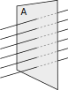
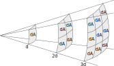
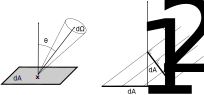
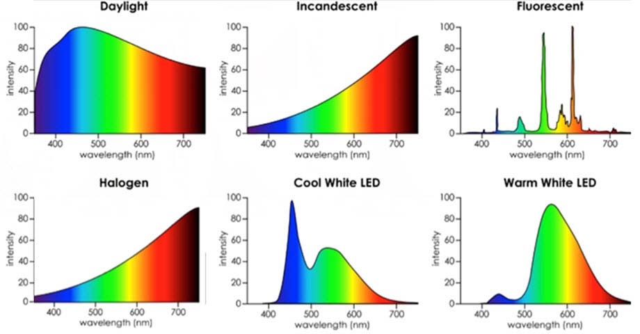
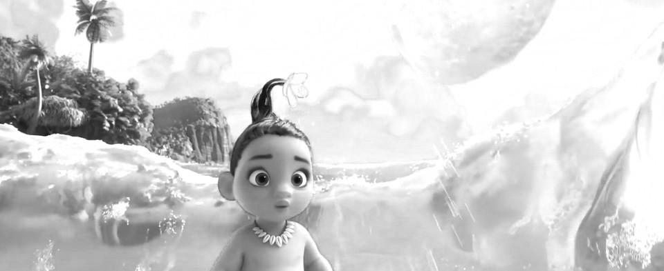
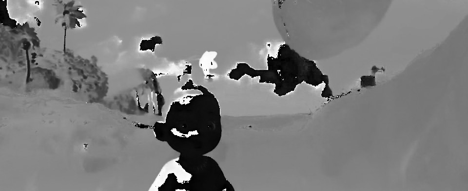
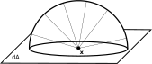
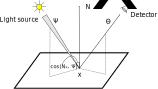

<iframe src="https://player.vimeo.com/video/517979969?badge=0&amp;autopause=0&amp;player_id=0&amp;app_id=58479" width="1934" height="810" frameborder="0" allow="autoplay; fullscreen; picture-in-picture" allowfullscreen title="Moana (Clements, Musker, Hall, Williams) Beach scene (no sound)"></iframe>

[*Oceania* (R. Clements, J. Musker, D. Hall, C. Williams, 2016)]{style="float:right"}

# «Cornell box»

{height=560}

# «Cornell box»

{height=560}

# Bibliografia

-   [*Physically Based Rendering: from Theory to Implementation*](http://www.pbr-book.org/) (M. Pharr, W. Jakob, G. Humphreys, terza ed.): molto complesso e completo, è il testo di riferimento in materia. È disponibile online.
-   *Advanced Global Illumination* (P. Dutré, K. Bala, P. Bekaert, seconda ed.): lo useremo soprattutto per le parti più «fisiche».
-   *Realistic Ray Tracing* (P. Shirley, R. K. Morley, seconda ed.): molto antiquato, è utile soprattutto come testo introduttivo.

# Radiometria

# Propagazione della luce

-   Ottica quantistica (non usata nella *computer graphics*)
-   Modello ondulatorio (diffrazione, es. bolle di sapone)
-   Ottica geometrica

[(v. Dutré, Bala, Bekaert)]{style="float:right"}

# Ottica geometrica

-   La luce si propaga lungo linee rette (geodesiche)
-   La velocità della luce è assunta infinita
-   Propagazione non influenzata da effetti gravitazionali o magnetici

# Perché ci serve la radiometria?

-   In questo corso dovremo trattare la *radiometria*, ossia la scienza che studia come la radiazione si propaga in un mezzo.
-   Ciò che è importante è avere quantità che caratterizzano la *radiazione* in maniera il più possibile indipendente da strumenti che la misurano.

# Quantità radiometriche

-   Energia emessa (Joule)
-   Potenza radiante, o *flusso* (Energia che attraversa una
    superficie nell'unità di tempo)
-   Irradianza, emettenza radiante (flusso normalizzato sulla superficie)
-   **Radianza** (← il cuore del corso!)
-   Le definizioni che useremo saranno quelle usate nella *computer
    graphics*, ma possono essere diverse in altri campi della fisica!
    (Es., in astronomia l'irradianza è chiamata *flusso*).

# Flusso

-   Energia che attraversa una superficie $A$ nell'unità di tempo: $\Phi$
-   $[\Phi] = \mathrm{W}$ (in fisica, il flusso si misura invece come $\mathrm{W}/\mathrm{m}^2$!).
-   Esempio: $A$ è la superficie di un rivelatore, come la
    pupilla umana o l'obbiettivo di una fotocamera.
-   Più è grande la superficie $A$, maggiore è $\Phi$.

{height=260}

# Irradianza/emettenza

-   Flusso $\Phi$ normalizzato sulla superficie:
    $$
    I, E = \frac{\mathrm{d}\Phi}{\mathrm{d}A},
    \qquad [I] = \mathrm{W}/\mathrm{m}^2.
    $$
    
-   Irradianza $I$: ciò che *cade* su $\mathrm{d}A$; emettenza $E$:
    ciò che *abbandona* $\mathrm{d}A$

{height=260}

# Radianza

-   Ciò che ci interessa!
-   Flusso $\Phi$ normalizzato sulla superficie **proiettata** per
    unità di angolo solido:
    $$
    L = \frac{\mathrm{d}^2\Phi}{\mathrm{d}\Omega\,\mathrm{d}A^\perp}
      = \frac{\mathrm{d}^2\Phi}{\mathrm{d}\Omega\,\mathrm{d}A\,\cos\theta},
    \qquad [L] = \mathrm{W}/\mathrm{m}^2/\mathrm{sr}.
    $$
-   Come l'irradianza e l'emettenza, la radianza è funzione del punto
    $\mathbf{x}$ della superficie $\mathrm{d}A$:
    $$
    L = L(\mathbf{x}).
    $$

# Angoli solidi e distanza

{height=320px}

-   Dato che $I \propto A^{-1} \propto d^{-2}$, l'irradianza su $\mathrm{d}A$ a $3d$ è 1/9 di quella a $d$
-   Ma $\mathrm{d}\Omega = dA/d^2 \propto d^{-2}$
-   Quindi $L \propto I/\mathrm{d}\Omega$ non dipende da $d$

# Radianza

-   Il rapporto sull'angolo solido rimuove la dipendenza dalla
    distanza
-   La presenza di $\cos\theta$ rimuove la dipendenza
    dall'orientamento di $\mathrm{d}A$.

# Notazione per la radianza

-   Useremo spesso la notazione
    $$
    L(\mathbf{x} \rightarrow \Theta)
    $$
    per indicare la radianza che abbandona una superficie nel punto $\mathbf{x}$ verso la direzione $\Theta$, a cui è associato un angolo solido $\mathrm{d}\Omega$.
    
-   Analogamente,
    $$
    L(\mathbf{x} \leftarrow \Theta)
    $$
    è la radianza proveniente dalla direzione $\Theta$ che incide sulla superficie in $\mathbf{x}$.

# Spettri di emissione

Ciascuna delle quantità viste finora può essere riferita a un
intervallo di lunghezze d'onda. Diverse sorgenti luminose hanno
infatti spettri differenti:

# Radianza spettrale

Dalla radianza $L(\mathbf{x} \leftrightarrow \Theta)$ si può definire
la **radianza spettrale** $L_\lambda(\mathbf{x} \leftrightarrow
\Theta),$ che fa riferimento all'intervallo di lunghezze d'onda
$[\lambda, \lambda + \mathrm{d}\lambda]$ e indichiamo con la stessa
lettera $L$ per comodità. È definita tramite l'equazione
$$
L(\mathbf{x} \leftrightarrow \Theta) = 
\int_0^\infty L_\lambda(\mathbf{x} \leftrightarrow \Theta)\,\mathrm{d}\lambda,
\quad
[L_\lambda(\mathbf{x} \leftrightarrow \Theta, \lambda)] = \mathrm{W}/\mathrm{m}^2/\mathrm{sr}/\mathrm{m}.
$$

# Proprietà di $L$

1.  Da $L$ si possono ricavare $\Phi$, $I$, $E$. Ad esempio:
    
    $$
    \Phi = \iint_{A, \Omega} L(\mathbf{x} \rightarrow \Theta)\,
           \cos\theta\,\mathrm{d}\Omega\,\mathrm{d}A_\mathbf{x},
    $$
    
2.  In assenza di attenuazione vale che $L(\mathbf{x} \rightarrow
    \mathbf{y}) = L(\mathbf{x} \rightarrow \mathbf{z}),$ se
    $\mathbf{x}$, $\mathbf{y}$, $\mathbf{z}$ sono sulla stessa retta;
    vale lo stesso per $L_\lambda$, ovviamente.
    
3.  Il fatto che $L$ e $L_\lambda$ non dipendano dalla distanza
    implica che il colore percepito di un oggetto alla distanza $d$
    non cambia al variare di $d$.

# Utilità di $L$

$L$ è ciò che viene misurato da qualsiasi sensore (telecamera, occhio
umano) sensibile alla luce.

# Utilità di $L_\lambda$

Il comportamento di $L_\lambda$ al variare di $\lambda$ permette di
stimare il colore (*hue*):

(Esiste anche un terzo parametro, la *saturazione*, che tratteremo a
breve.)

# Creazione di immagini

Stimare $L$ e $L_\lambda$ insieme consente di produrre un'immagine a
colori:

    
# Esempio

Consideriamo un *emettitore diffuso*, un oggetto che emette luce
uniformemente in tutte le direzioni:

In questo caso,
$$
L(\mathbf{x} \rightarrow \Theta) = L_e\qquad\text{(costante)}.
$$

# Calcolo del flusso

$$
\begin{aligned}
\Phi &= \iint_{A, \Omega} L(\mathbf{x} \rightarrow \Theta)\,\cos\theta\,\mathrm{d}\Omega\,\mathrm{d}A =\\
     &= \iint_{A, \Omega} L_e\,\cos\theta\,\mathrm{d}\Omega\,\mathrm{d}A =\\
     &= L_e \int_A \mathrm{d}A \int_\Omega \cos\theta\,\mathrm{d}\Omega =\\
     &= L_e \int_A \mathrm{d}A \int_0^{2\pi}\mathrm{d}\phi \int_0^{\pi/2}\mathrm{d}\theta \cos\theta\,\sin\theta =\\
     &= \pi A L_e.\\
\end{aligned}
$$

# Interazione luce/superficie

# «Cornell box»

{height=560}

# La BRDF

La Bidirectional Reflectance Distribution Function (BRDF) è il rapporto $f_r(x, \Psi \rightarrow \Theta)$ tra la *radianza* che abbandona una superficie lungo $\Theta$ e l'*irradianza* (flusso normalizzato su $A$, $\mathrm{W}/\mathrm{m}^2$) ricevuta da una direzione $\Psi$:

$$
\begin{aligned}
f_r(x, \Psi \rightarrow \Theta) &= \frac{\mathrm{d}L (x \rightarrow \Theta)}{\mathrm{d}E(x \leftarrow \Psi)} = \\
&= \frac{\mathrm{d}L (x \rightarrow \Theta)}{
    L(x \leftarrow \Psi) \cos(N_x, \Psi)\,\mathrm{d}\omega_\Psi
},
\end{aligned}
$$
dove $\cos(N_x, \Psi)$ è l'angolo tra la normale a $\mathrm{d}A$ e la direzione incidente $\Psi$.

# La BRDF

{height=560}

# Significato della BRDF

-   Descrive come una superficie interagisce con la luce;
-   $f_r \propto \cos^{-1}(N_x, \Psi)$: si tiene conto dell'inclinazione della sorgente luminosa rispetto a $\mathrm{d}A$.
-   $f_r : \mathbb{R}^2 \times \mathbb{R}^2 \rightarrow \mathbb{R}$ (per codificare una direzione sono necessari due numeri), ma nel caso più generale dipende anche da $\lambda$ e dal tempo $t$;
-   È una funzione positiva: $f_r \geq 0$, e la sua unità di misura è $1/\mathrm{sr}$;
-   Si considera tutto l'angolo solido $4\pi$, perché la BRDF si usa anche per superfici (semi-)trasparenti.
-   Assume che la luce abbandoni la superficie dallo stesso punto $x$ in cui l'ha incontrata (non vero per *subsurface scattering*!).

# Reciprocità di Helmholtz

Per la BRDF vale la *reprocità di Helmholtz*:
$$
f_r(x, \Psi\rightarrow\Theta) = f_r(x, \Theta\rightarrow\Psi),
$$
ossia, la BRDF non cambia se si scambiano la direzione entrante con quella uscente.

Si può dimostrare questa proprietà usando le equazioni di Maxwell, ma la dimostrazione è lunga e non particolarmente interessante per i nostri scopi.

# Più angoli di incidenza

Grazie al principio di sovrapposizione dei campi e.m., se si hanno più sorgenti luminose $i=1\ldots N$ che insostono su una superficie, è sufficiente sommare le componenti:

$$
\begin{aligned}
\mathrm{d}L_i(x \rightarrow \Theta) &= f_r(x, \Psi_i \rightarrow \Theta) \mathrm{d}E(x \leftarrow \Psi_i) =\\
&= f_r(x, \Psi_i \rightarrow \Theta) L(x \leftarrow \Psi_i)\,\cos(N_x, \Psi_i)\,\mathrm{d}\omega_{\Psi_i},\\
L_\text{tot}(x \rightarrow \Theta) &= \int_{\Omega_x} f_r(x, \Psi \rightarrow \Theta) L(x \leftarrow \Psi)\,\cos(N_x, \Psi)\,\mathrm{d}\omega_\Psi.
\end{aligned}
$$

# Utilità della BRDF

# Superficie diffusiva ideale

Tutta la radiazione incidente viene distribuita sulla semisfera $2\pi$, così la BRDF è costante:
$$
f_r(x, \Psi \rightarrow \Theta) = \frac{\rho_d}\pi,
$$
dove $0 \leq \rho_d \leq 1$ è la frazione di energia incidente che viene riflessa.

# Superficie riflettente

In questo caso $f_r$ è una Delta di Dirac, ossia identicamente nulla tranne nella direzione uscente $R$ data dalla legge di riflessione:
$$
R = 2(N \cdot \Psi) N - \Psi,
$$
dove $N$ è il vettore normale (tangente) alla superficie.

# Altre BRDF

-   Superficie rifrattiva: si tratta in modo simile alla superficie riflettente.

-   Superficie di Fresnel: parte della luce viene riflessa e parte rifratta, secondo le *equazioni di Fresnel*.

-   Superficie di Phong: cerca di modellare una superficie in maniera semi-empirica. Molto popolare in passato, non è molto usata oggi perché non plausibile fisicamente (non conserva l'energia).

-   Esistono online librerie di BRDF, solitamente ricavate da misure in laboratorio.

# L'equazione del rendering

# Formulazione dell'equazione

L'equazione che studieremo durante il corso è la seguente:
$$
\begin{aligned}
L(x \rightarrow \Theta) = &L_e(x \rightarrow \Theta) +\\
&\int_{\Omega_x} f_r(x, \Psi \rightarrow \Theta)\,L(x \leftarrow \Psi)\,\cos(N_x, \Psi)\,\mathrm{d}\omega_\Psi,
\end{aligned}
$$
dove $L_e$ è la radianza emessa dalla superficie nel punto $x$ lungo la direzione $\Theta$.
