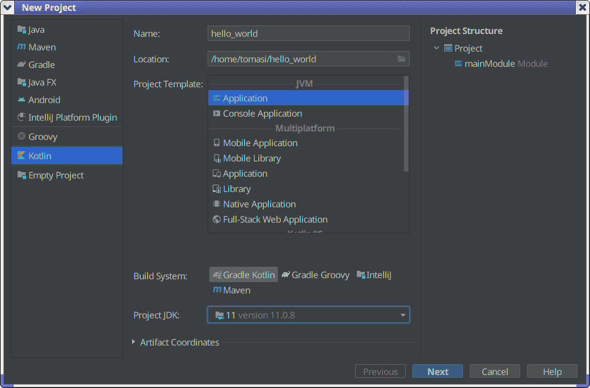

<iframe src="https://player.vimeo.com/video/683431827?h=9e4de4dba1&amp;badge=0&amp;autopause=0&amp;player_id=0&amp;app_id=58479" width="1280" height="720" frameborder="0" allow="autoplay; fullscreen; picture-in-picture" allowfullscreen title="Come usare una IDE (JetBrains Rider)"></iframe>

# Suggerimenti per C\#

# Suggerimenti

-   Creare un'applicazione vuota e il file `.gitignore`; se usate `dotnet` da linea di comando, eseguite

    ```sh
    $ dotnet new console
    $ dotnet new gitignore
    ```
    
    Se usate Rider, assicuratevi di attivare Git quando create il progetto.
    
-   L'applicazione stampa già `Hello World!`: cambiate il messaggio in `Hello, wold!` (altrimenti l'esercitazione di oggi non ha senso!)
    
-   Compilate ed eseguite; da linea di comando, eseguite

    ```
    dotnet run
    ```
    
    mentre sotto Rider premete Shift+F10.

# Esempio

<asciinema-player src="cast/dotnet-example.cast" rows="20" cols="94" font-size="medium"></asciinema-player>

# Formattazione

-   Per formattare automaticamente il codice in Rider, eseguite *Code*/*Reformat code* (Shift+Alt+L)

-   Sotto Visual Studio Code, installate il package [C\#](https://code.visualstudio.com/docs/languages/csharp).

-   Per formattare il codice da linea di comando, installate `dotnet-format`:

    ```sh
    $ dotnet tool install -g dotnet-format
    ```


# Indicazioni per C++

# Istruzioni

-   Installare CMake; sotto Linux Debian/Ubuntu/Mint basta eseguire

    ```
    sudo apt install cmake
    ```

-   Creare un'applicazione che produca un eseguibile. Strutturare il codice in questo modo:

    -   Un file `CMakeLists.txt` nella directory principale
    -   Una directory `src` che contiene il file `main.cpp`

-   In `.gitignore` elencate `*.o`, il nome dell'eseguibile (es. `hello_world`), eventuali file di backup (`*.bak`, `*~` a seconda dell'editor che usate) e la directory `build` (oppure usate [gitignore.io](https://gitignore.io/) indicando `c++` e `cmake`).

# Esempio di CMake per C++

```cmake
cmake_minimum_required(VERSION 3.12)

# Define a "project", providing a description and a programming language
project(hello_world
    VERSION 1.0
    DESCRIPTION "Hello world in C++"
    LANGUAGES CXX
)

# Our "project" will be able to build an executable out of a C++ source file
add_executable(hello_world
    src/main.cpp
)

# Force the compiler to use the C++17 standard
target_compile_features(hello_world PUBLIC cxx_std_17)
```

# Esempio d'uso di CMake

<asciinema-player src="cast/cmake-example.cast" rows="20" cols="94" font-size="medium"></asciinema-player>

# Riferimenti per CMake

- [Documentazione ufficiale](https://cmake.org/documentation/) (abbastanza illeggibile, ma è la più aggiornata per definizione)
- [*Professional CMake*](https://crascit.com/professional-cmake/) (C. Scott)
- [*An Introduction to Modern CMake*](https://cliutils.gitlab.io/modern-cmake/)

# Formattazione

-   Se usate [CLion](https://www.jetbrains.com/clion/) (consigliatissimo!), potete formattare il codice usando il comando *Code*/*Reformat code* (Shift+Alt+L)

-   Altrimenti, esiste il programma da linea di comando `clang-format`; installatelo con

    ```sh
    sudo apt install clang-format
    ```
    
-   Se scrivete questo:

    ```c++
    int sum  ( int a,int b    )    {    return a+ b;}
    ```
    
    la formattazione automatica lo trasforma in
    ```c++
    int sum(int a, int b) { return a + b; }
    ```

# Formattazione

-   Il programma `clang-format` si usa da linea di comando:

    ```sh
    clang-format -i main.cpp
    ```
    
-   Se **non** usate CLion, dovrebbe essere possibile configurare il vostro editor perché invochi automaticamente `clang-format` ad ogni salvataggio (ad esempio, per VSCode esiste il package [clang-format](https://github.com/xaverh/vscode-clang-format-provider))

-   Questi strumenti sono utilissimi per mantenere il codice pulito e chiaro da leggere: cercate di configurarli al meglio e di imparare ad usarli sin da subito.


# Indicazioni per Nim/D/Rust

# Suggerimenti (1/2)

-   Creare un'applicazione vuota usando il package manager del vostro linguaggio. Nim usa `nimble`:

    ```
    $ nimble init helloworld
    ```
    
-   D usa `dub`:

    ```
    $ dub init helloworld
    ```
    
-   Rust usa `cargo`:

    ```
    $ cargo init helloworld
    ```
    
-   Sia con Nim che con D dovrete rispondere ad alcune domande. Se possibile, scegliete il default (ma per Nim assicuratevi di specificare che volete un `binary`).

# Suggerimenti (2/2)

-   L'applicazione stampa già `Hello World!`: cambiate il messaggio in `Hello, wold!` (altrimenti l'esercitazione di oggi non ha senso!)
    
-   Per compilare ed eseguire, basta usare il comando `run` (identico in `nimble`, `dub` e `cargo`):

    ```
    $ cd helloworld
    $ nimble run     # Oppure: dub run, oppure: cargo run
    ```

-   Sia per [D](https://intellij-dlanguage.github.io/) che per [Nim](https://plugins.jetbrains.com/plugin/15128-nim) esistono dei plugin per IntelliJ IDEA, l'IDE Java di JetBrains. Per Rust, potete usare CLion con il plugin [Rust](https://plugins.jetbrains.com/plugin/8182-rust/docs).

# Suggerimenti per Java/Kotlin

# Suggerimenti

-   Creare un'applicazione Java oppure Kotlin in [IntelliJ IDEA](https://www.jetbrains.com/idea/):

    -   Se usate Kotlin, come *Build system* scegliete «Gradle Kotlin»
    
    -   Come JDK, se non ne avete di installati scegliete il numero (versione) 17
    
    -   Usate «Console application» come template
    
-   L'applicazione vuota stampa `Hello World!`: come prima cosa, cambiate il messaggio in `Hello, wold!`.

-   Per usare Git, meglio fare affidamento al menu «VCS» di IntelliJ (gestisce automaticamente i `.gitignore`).

---

<center>

</center>

# Compilare ed eseguire

-   La directory che contiene il progetto ha un eseguibile, `gradlew`, che può essere usato per produrre una *distribution* nella directory `./build/distributions`:

    ```
    gradlew assembleDist
    ```

-   Siccome è una funzione molto utile, esploratela! Create una distribuzione del vostro programma e cercate di capire come installarla e usarla.

# Suggerimenti

-   In Java e in Kotlin si fa grande affidamento sull'ambiente di sviluppo (IDE). Imparate a conoscere bene IntelliJ IDEA!

-   Abituatevi a invocare regolarmente il comando «Code | Reformat code» (Ctrl+Alt+L).
