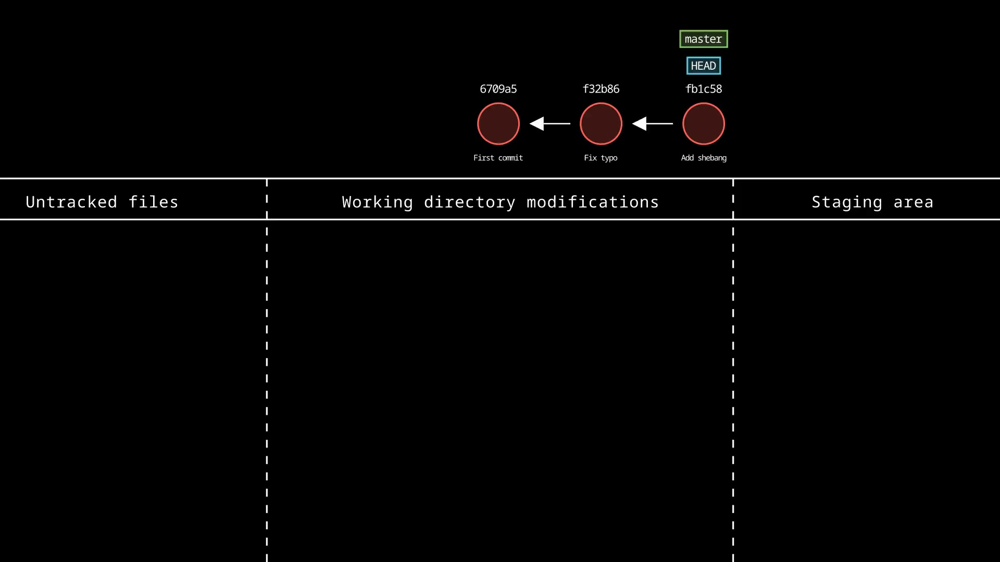
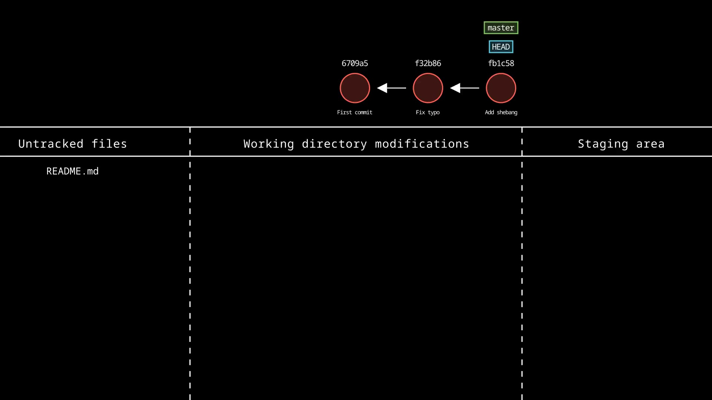
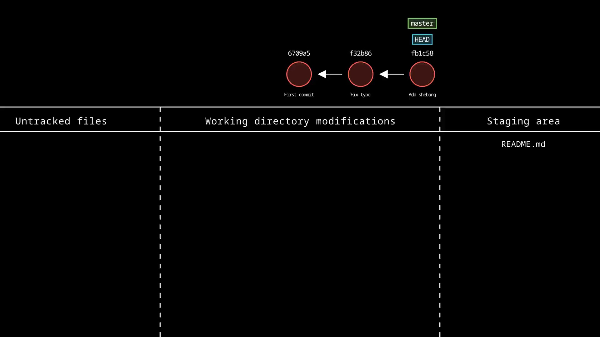
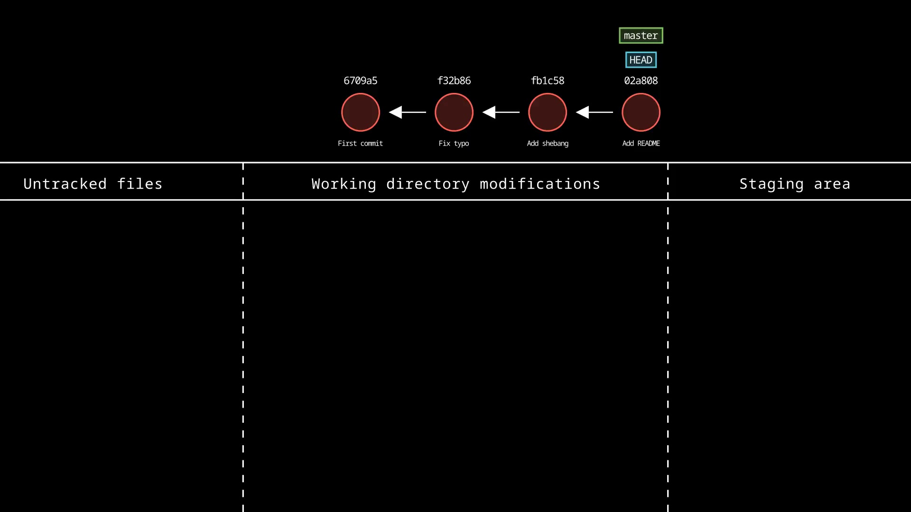
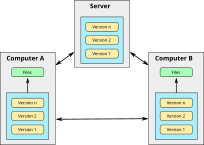
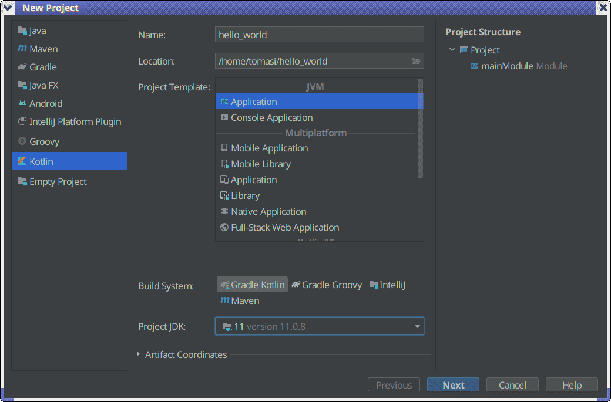

# Miscellanea

-   Communicate to the teacher by the next exercise the composition of your group and the chosen language

-   The exercises end at 12:30, but if you complete the work early you can leave earlier

# Project management

# Overview

-   In this course we will develop a complex program to generate photorealistic images;

-   Managing complex programs requires a series of measures:

    -   Automatic code quality checks

    -   Change monitoring

    -   Code visibility to other users

    -   Access to documentation

# How have you managed your projects so far?

# Version control systems

-   A version control system (VCS) records changes made to the code;

-   Possibility to undo changes;

-   Release of "releases" (e.g., 1.0, 1.1, 1.2) with the possibility of retrieving older ones;

-   Ensures that multiple programmers can modify the code simultaneously (with some caveats).

# How to use a VCS

-   A VCS manages a directory, with all its subdirectories;

-   When creating/modifying a file within the directory, you ask the VCS to record the change;

-   The VCS takes “snapshots” of the directory, which it saves in its own database.

# Usage example

-   I create a directory `hello_world` and a file `hello_world/hello.py`:

    ```python
    print("Hello, wold!")
    ```

-   I invoke the VCS to "save" a snapshot of the `hello_world` directory

-   I modify the file `hello_world/hello.py` to correct the message:

    ```python
    print("Hello, world!")
    ```

-   I invoke the VCS again to "save" a new snapshot of the directory

# Usage example

At the end of the example, the VCS database contains two snapshots:

1.  File `hello_world/hello.py` with this content:

    ```python
    print("Hello, wold!")
    ```

2.  File `hello_world/hello.py` with this content:

    ```python
    print("Hello, world!")
    ```

# Commit

-   Each snapshot is always associated by VCS with some additional information:

    -   User who performed the snapshot
    -   Date and time of the snapshot

-   In VCS jargon, a snapshot is called a **commit**.

# A simple VCS (1/3)

-   We can create a simple VCS in Linux/Mac OS X using the Bash/Zsh shell and two command-line programs: `date` (prints date and time) and `whoami` (prints the user's name).

    ```sh
    $ date +%Y-%m-%d  # Date in YEAR-MONTH-DAY format
    2025-02-26
    $ whoami
    tomasi
    ```

-   We use the ability of shells like [Bash](https://www.gnu.org/software/bash/) to substitute commands using `$()`:

    ```sh
    $ echo "Hello, I am $(whoami) and today is $(date +%Y-%m-%d)"
    Hello, I am tomasi and today is 2025-02-26
    ```

# A simple VCS (2/3)

-   This command creates a backup copy of the files in the current directory:

    ```sh
    tar -c -f "/vcsdatabase/hello_world-$(date +%Y%m%d%H%M%S)-$(whoami).tar" *
    ```

-   The command creates a `.tar` file in a `/vcsdatabase` folder containing all the files of the current directory.

-   The file name contains the user's name and the date; the latter is encoded as a long number (e.g., `20240926155130` for the date 2024-09-26, 15:51:30)

# A simple VCS (3/3)

It is always useful to associate a brief comment with a commit. We extend our idea into a shell script called `my_vcs.sh`:

```sh
#!/bin/bash

readonly destpath="$1"
readonly tag="$2"

if [ "$tag" == "" ]; then
    echo "Usage: $0 PATH TAG"
    exit 1
fi

# Create the folder, if it does not exist
mkdir -p "${destpath}"

readonly filename="${destpath}/$(date +%Y%m%d%H%M%S)-$(whoami)-${tag}.tar"
tar -c -f "$filename" *
echo "File \"$filename\" created successfully"
```

# Example

<asciinema-player src="cast/hello_world.cast" rows="20" cols="94" font-size="medium"></asciinema-player>

# Advantages of a VCS

-   We have a backup of the code: if we accidentally delete a source file from the working directory, we can recover it from `/vcsdatabase`.

-   If we realize that a modification does not work, we can restore the previous version.

-   We can reconstruct the history of the code development simply by looking at the list of files in `/vcsdatabase`:

    ```
    20240926153856-tomasi-first-release.tar
    20240926155130-tomasi-fix-bug.tar
    ```

-   If we discover the existence of a bug, we can check backwards to determine when the bug was introduced.

# Problems with our VCS (1/4)

-   If a VCS is being used, it is probably because the project is complex and has many files.

-   Usually, modifications affect one or just a few files at a time.

-   However, our implementation with `tar` saves **all files** every time: this risks occupying a lot of space, and it is not necessary!

-   There is also another issue: if the database contained the files

    ```
    20240926153856-tomasi-first-release.tar
    20240926155130-tomasi-fix-bug.tar
    ```

    and we wanted to understand what the "bug" was and how it was fixed, we would have to compare the files in the latest `.tar` one by one with their counterparts in the previous `.tar` to see what changed.

# Problems with our VCS (2/4)

-   We could write a shell script that invokes `tar`, saving only the files that were actually modified (for example, by checking the modification date of each file with `ls -l`).
-   But even this is not optimal: a very large file may have changed in **just one line**, yet we would save the entire file!
-   (There are files with tens of thousands of lines of code.
    The [amalgamation](https://www.sqlite.org/amalgamation.html) of SQLite3 is a C language file with 220,000 lines.)

# Problems with our VCS (3/4)

-   Complex modifications are usually implemented gradually; for example:

    1.  A modification that adds the ability to save work to a file;

    2.  A modification that adds the ability to load a file.

    If each of these tasks required a week of work, the programmer might want to perform a backup after completing the first step, before moving on to the second.

-   Our system does not allow logically related modifications to be grouped together: each `tar` file is independent of the others!

# Problems with our VCS (4/4)

-   Our system does not provide any control when multiple people work on the project.

-   Consider this situation:

    -   A starts from the `.tar` with the latest version of the code to fix a bug.

    -   B starts from the same `.tar` to add a new feature to the program.

    -   A uses `my_vcs.sh` to save their version with the bug fixed.

    -   B uses `my_vcs.sh` to save their version with the new feature.

    In the end, there will be a `.tar` file with the bug fixed but without the new feature, and a `.tar` file with the new feature but where the bug is still present.

# Professional VCS

-   There are solutions for each of the problems we identified in our VCS.

-   Modern VCSs all have these features:

    -   They save only the parts of files that have changed (using tools similar to the `diff` command found in Linux and Mac OS X).

    -   They allow logically related commits to be grouped together (e.g., saving/loading files).

    -   When multiple programmers work on the same file, they check the consistency of modifications.

# Types of VCS

Centralized
: The database (our `/vcsdatabase` directory) resides on a remote computer that all programmers access.

Distributed
: The database resides on the local computer; multiple programmers working on the same code each have their own database, which they synchronize with each other periodically (usually with an explicit command).

# Some important VCS

| Name      | Kind        | Example                           |
|-----------+-------------|-----------------------------------|
| [CVS](https://cvs.nongnu.org/) | Centralized | [OpenBSD](https://www.openbsd.org/) ([link](https://www.openbsd.org/anoncvs.html)) |
| [Subversion](https://subversion.apache.org/) | Centralized | [FreePascal](https://www.freepascal.org/) ([until 2021](https://forum.lazarus.freepascal.org/index.php/topic,55532.0.html)), [GCC](https://gcc.gnu.org/) ([until 2019](https://gcc.gnu.org/wiki/GitConversion)) |
| [GNU Bazaar](https://bazaar.canonical.com/en/) | Distributed | [Ubuntu Linux](https://ubuntu.com/) ([until 2018](https://wiki.ubuntu.com/UbuntuDevelopment/MigratingFromBzrToGit)) |
| [Mercurial](https://www.mercurial-scm.org/) | Distributed | Facebook, Mozilla, [GNU Octave](https://octave.org/) ([link](https://www.octave.org/hg/octave)) |
| [Fossil](https://www.fossil-scm.org/home/doc/trunk/www/index.wiki) | Distributed | [SQLite](https://www.sqlite.org/) ([link](https://sqlite.org/src/doc/trunk/README.md)) |
| [BitKeeper](https://www.bitkeeper.org/) | Distributed | Kernel Linux ([until 2005](https://www.linuxjournal.com/content/git-origin-story)) |
| [Git](https://git-scm.com/) | Distributed | Too many! |

# Git

-   Created by Linus Torvalds, the creator of Linux
-   Distributed VCS
-   Extremely versatile…
-   …but very complex to use!
-   Today, it is the standard among VCSs (unfortunately)

# Using Git (1/3)

-   On Ubuntu/Mint Linux systems, install Git with `sudo apt install git`

-   As soon as it is installed, you need to configure Git with your identity. Run these commands:

    ```
    git config --global user.email "YOUREMAIL@BLABLA"
    git config --global user.name "First Last"
    ```

    This allows Git to associate your name with the actions you perform on the repository. (Obviously, this is unnecessary if you know you'll always be the only one working on the repository, but Git is designed to be a *collaborative* tool.)

# Using Git (2/3)

-   To create a database in a directory, run

    ```
    git init
    ```

    This will create a hidden `.git` directory (equivalent to our `/vcsdatabase`).

-   The first time you run `git init`, it may ask you to specify your name and email address.

# Using Git (3/3)

-   When you want to make a *commit*, you must perform two operations:

    ```
    git add FILENAME1 FILENAME2…
    git commit
    ```

    The first command prepares the files for "taking the snapshot,"
    copying them to the *staging area*, while the second performs the actual snapshot.

-   The `git commit` command opens an editor to enter a description.

# How Git Works (1/2)

-   Each commit/snapshot is identified by a long hexadecimal number called a *hash* (e.g.,
    `2f2f2cb36bbf02eaf5629b6295e9a47684c16905`).
-   Each commit has *two* associated hashes:

    -   Its own hash (obviously!)
    -   The hash of the previous commit

-   The hash of the latest commit is called `HEAD`, and it can be
    viewed using the command

    ```
    git rev-parse HEAD
    ```

# How Git Works (2/2)

When you run `git commit`, the following happens:

1.   `git` analyzes which files have been modified compared to
     the last commit (indicated by `HEAD`);
2.   It creates a new commit, saving only the changes relative to
     the `HEAD` commit;
3.   It saves the `HEAD` value in the commit as the "previous hash";
4.   It generates a new hash for the commit;
5.   It updates `HEAD` to point to the new hash.

# Example {data-transition="none"}

<!-- Immagini create con git-sim https://github.com/initialcommit-com/git-sim -->
{height=600px}

# Example {data-transition="none"}

{height=600px}

# Example {data-transition="none"}

{height=600px}

# Example {data-transition="none"}

{height=600px}

# Our example with Git

<asciinema-player src="cast/hello_world_git.cast" rows="20" cols="94" font-size="medium"></asciinema-player>

# A few useful commands

-    `git status` shows the status of the repository (**extremely useful!**)
-    `git log` prints the list of commits starting from the most recent one (`HEAD`) and going backwards in time
-    `git diff` shows which changes have been made since the last commit
-    `git mv` rename a file
-    `git rm` delete a file

# Files to exclude

-   Automatically generated files should not be included in a repository (e.g., `*.o` files, backups, executables, etc.).
-   If you create a text file named `.gitignore`, you can list the files to *exclude* inside it. For example:

    ```
    *~
    *.o
    build/
    ```
-   The `.gitignore` file should be added to the repository (`git add .gitignore`, followed by `git commit`).
-   You can generate this file using the website [gitignore.io](https://gitignore.io/) or your IDE.

# GitHub

# Distributed Systems



# Introduction to GitHub

<iframe src="https://player.vimeo.com/video/513803423?badge=0&amp;autopause=0&amp;player_id=0&amp;app_id=58479" width="960" height="540" frameborder="0" allow="autoplay; fullscreen; picture-in-picture" allowfullscreen title="anGitHub hello_world demo"></iframe>

# Syncing Git

Since Git is a distributed system, when you connect to a remote server you need to *sync* your database. These are the most important commands:

- `git clone` creates a new directory based on a remote database, and downloads the entire database into `.git`;
- `git pull` syncs your database in `.git` by requesting changes from a remote one;
- `git push` sends your local changes in `.git` to a remote database.

# How GitHub works


# How GitHub works


# Git-based hosting software

-   [GitHub](https://github.com) (Microsoft): the most widespread
-   [GitLab](https://about.gitlab.com/) (GitLab Inc.)
-   [BitBucket](https://bitbucket.org/product) (Atlassian)
-   [SourceForge](https://sourceforge.net/) (Slashdot Media): the first to have widespread use, now little used
-   Self-hosted solutions also exist ([Gitea](https://github.com/go-gitea/gitea), [GitBucket](https://github.com/gitbucket/gitbucket), etc.)

# BitBucket

<iframe src="https://player.vimeo.com/video/513805000" width="960" height="540" frameborder="0" allow="autoplay; fullscreen" allowfullscreen></iframe>

# Is GitHub distributed?

GitHub makes Git "a bit more centralized" and "less distributed":

-   Provides a canonical address (`https://github.com/name/project`);
-   Establishes rules on who can commit and when;
-   Provides the ability to show a project presentation page;
-   ...and many other features that we will see in the coming weeks.

It is interesting to note that GitHub could provide all these features based on any other VCS that is not Git!

# Git

[{height=560}](https://remembertheapi.com/products/git-cheat-sheet-black-mugs)


# What to do today


# What to do today

1.  Create your own account on GitHub (if you don't already have one)
2.  Create an empty project and add `.gitignore`
4.  Write a program (in your chosen programming language) that prints `Hello, wold!` [without `r`], make a commit (1) and publish it on GitHub
5.  Fix the error in the text and make a commit (2)
6.  Add the ability to specify a name and make a commit (3):

    ```sh
    $ hello_world
    Hello, world!
    $ hello_world Maurizio
    Hello, Maurizio!
    ```

# Using IDEs

-   If possible, start practicing today with an integrated development environment (IDE) appropriate for your language
-   An excellent choice are the IDEs developed by [JetBrains](https://www.jetbrains.com/); they are paid, but there are [free licenses for students](https://www.jetbrains.com/community/education/#students).
-   I have created a video that shows how to use [Rider](https://www.jetbrains.com/rider/); it is useful for those who use other languages to watch it as well, to know what features to look for in IDEs

---

<iframe src="https://player.vimeo.com/video/683431827?h=9e4de4dba1&amp;badge=0&amp;autopause=0&amp;player_id=0&amp;app_id=58479" width="1280" height="720" frameborder="0" allow="autoplay; fullscreen; picture-in-picture" allowfullscreen title="Come usare una IDE (JetBrains Rider)"></iframe>


# Hints for C++

# Instructions

-   Install CMake; on Linux Debian/Ubuntu/Mint just run

    ```
    sudo apt install cmake
    ```

-   Create an application that produces an executable. Structure the code like this:

    -   A `CMakeLists.txt` file in the root directory
    -   A `src` directory that contains the `main.cpp` file

-   In `.gitignore` list `*.o`, the executable name (e.g. `hello_world`), any backup files (`*.bak`, `*~` depending on the editor you use) and the `build` directory (or use [gitignore.io](https://gitignore.io/) indicating `c++` and `cmake`).

# CMake example for C++

```cmake
cmake_minimum_required(VERSION 3.12)

# Define a "project", providing a description and a programming language
project(hello_world
    VERSION 1.0
    DESCRIPTION "Hello world in C++"
    LANGUAGES CXX
)

set(CMAKE_CXX_STANDARD 20)   # Pick the standard you like

# Our "project" will be able to build an executable out of a C++ source file
add_executable(hello_world src/main.cpp)
```

# Example: CMake and GNU Make

<asciinema-player src="cast/cmake-example.cast" rows="20" cols="94" font-size="medium"></asciinema-player>

(In your case, CMake might output `build.ninja` instead of `Makefile`: in this case, run `ninja` instead of `make`.)

# Bibliography for CMake

- [Official manual](https://cmake.org/documentation/) (not very readable, but it’s the most up-to-date reference)
- [*Professional CMake*](https://crascit.com/professional-cmake/) (C. Scott)
- [*An Introduction to Modern CMake*](https://cliutils.gitlab.io/modern-cmake/)

# Formatting

-   If you use [CLion](https://www.jetbrains.com/clion/) (highly recommended!), you can format the code using the *Code*/*Reformat code* command (Shift+Alt+L)

-   Otherwise, there is the command-line program `clang-format`; install it with `sudo apt install clang-format`. If you write this:

    ```c++
    int sum  ( int a,int b    )    {    return a+ b;}
    ```

    then `clang-format` transforms it into
    ```c++
    int sum(int a, int b) { return a + b; }
    ```

# Formatting

-   The `clang-format` program is used from the command line:

    ```sh
    clang-format -i main.cpp
    ```

-   If you do **not** use CLion, it should be possible to configure your editor to automatically invoke `clang-format` on every save. Some development environments like [Qt Creator](https://en.wikipedia.org/wiki/Qt_Creator) can do this automatically on every save.

-   These tools are very useful for keeping the code clean and clear to read: try to configure them to the best of your ability and learn to use them right from the start.

# Hints for C\#

# Hints

-   Create an empty application and the `.gitignore` file; if you use `dotnet` from the command line, run

    ```sh
    $ dotnet new console
    $ dotnet new gitignore
    ```

    If you use Rider, make sure to enable Git when you create the project.

-   The application already prints `Hello World!`: change the message to `Hello, wold!` (otherwise today's exercise makes no sense!)

-   Compile and run; from the command line, run

    ```
    dotnet run
    ```

    If you are using Rider, just press Shift+F10.

# Example

<asciinema-player src="cast/dotnet-example.cast" rows="20" cols="94" font-size="medium"></asciinema-player>

# Code formatting

-   To automatically format the code in Rider, run *Code*/*Reformat code* (Shift+Alt+L)

-   In Visual Studio Code, install the [C#](https://code.visualstudio.com/docs/languages/csharp) package.

-   To format the code from the command line, install `dotnet-format`:

    ```sh
    $ dotnet tool install -g dotnet-format
    ```

# Hints for Julia

# Instructions {#julia-main}

-   Create a package using the [Julia manual](https://julialang.github.io/Pkg.jl/v1/creating-packages/) (see the example in the next slide)

-   Create a `hello_world` application (in the directory where `Project.toml` is located) like this:

    ```julia
    #!/usr/bin/env julia

    using Pkg
    Pkg.activate(normpath(@__DIR__))

    using hello_world

    function main()
        hello_world.greet()
    end

    main()
    ```

---

# Creating a package

<asciinema-player src="cast/julia-example.cast" rows="20" cols="94" font-size="medium"></asciinema-player>

# The directory tree

-   Once you have completed the exercise, the directory should have this shape:

    ```text
    $ tree hello_world
    hello_world/
    ├── hello_world
    ├── Project.toml
    └── src
        └── hello_world.jl
    ```

-   The logic of this structure is that the function library is implemented inside `src`, while the code related to the executable part (e.g., command-line parameter interpretation) goes into `hello_world`.

# Formatting

-   If you use Visual Studio Code, there is the [julia-vscode](https://www.julia-vscode.org/docs/stable/gettingstarted/) package.

-   It should guarantee the ability to format the code, but it is good to verify that it works.

-   There is also an independent package, [Runic.jl](https://github.com/fredrikekre/Runic.jl).

# Using packages

-   Fundamental aspect of Julia!

-   They correspond to Python's *virtual environments*

-   With `Pkg.generate` you create a new package, with `Pkg.activate` you activate the package

-   The `hello_world` script shown before activates the package and invokes it:

    ```julia
    # This activates the package in the current directory ("hello_world")
    using Pkg
    Pkg.activate(normpath(@__DIR__))

    # Not calling "activate" above would make this "using" statement fail
    using hello_world
    ```


# Hints for Java/Kotlin

# Hints

-   Create a Kotlin or Java application in [IntelliJ IDEA](https://www.jetbrains.com/idea/):

    -   If you use Kotlin, choose "Gradle Kotlin" as the *Build system* (*do not* use IntelliJ IDEA's internal build system! It's convenient but too limited for our purposes!)
    -   Use "Console application" as the template

-   The empty application prints `Hello World!`: first, change the message to `Hello, wold!`.

-   To use Git, you can also rely on IntelliJ's "VCS" menu (it automatically manages `.gitignore`). It's very convenient, sometimes perhaps too much...

---

<center>

</center>

# Compiling and running

-   The directory containing the project has an executable, `gradlew`, which can be used to produce a *distribution* in the `./build/distributions` directory:

    ```
    gradlew assembleDist
    ```

-   Since it is a very useful function, explore it! Create a distribution of your program and try to understand how to install and use it.

# Suggestions

-   In Java and Kotlin, there is great reliance on the integrated development environment (IDE). Learn to know IntelliJ IDEA well!

-   Get used to regularly invoking the "Code | Reformat code" command (Ctrl+Alt+L).

# Hints for Nim/D/Rust

# Hints (1/2)

-   Create an empty application using your language's package manager. Nim uses `nimble`:

    ```
    $ nimble init helloworld
    ```

-   D uses `dub`:

    ```
    $ dub init helloworld
    ```

-   Rust uses `cargo`:

    ```
    $ cargo init helloworld
    ```

-   With both Nim and D you will have to answer some questions. If possible, choose the default (but for Nim make sure to specify that you want a `binary`).

# Hints (2/2)

-   The application already prints `Hello World!`: change the message to `Hello, wold!` (otherwise today's exercise makes no sense!)

-   To compile and run, just use the `run` command (identical in `nimble`, `dub` and `cargo`):

    ```
    $ cd helloworld
    $ nimble run      # Or: dub run, or: cargo run
    ```

-   For both [D](https://intellij-dlanguage.github.io/) and [Nim](https://plugins.jetbrains.com/plugin/15128-nim) there are plugins for IntelliJ IDEA, JetBrains' Java IDE. For Rust, you can use CLion with the [Rust](https://plugins.jetbrains.com/plugin/8182-rust/docs) plugin.

---
title: "Laboratory 1: Git and GitHub"
subtitle: "Calcolo numerico per la generazione di immagini fotorealistiche"
author: "Maurizio Tomasi <maurizio.tomasi@unimi.it>"
...
