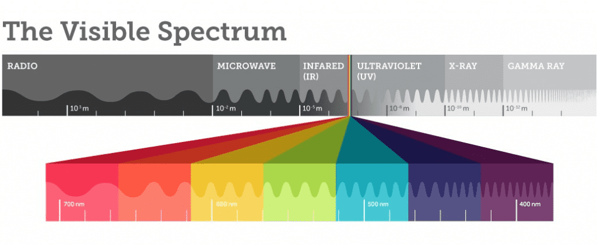
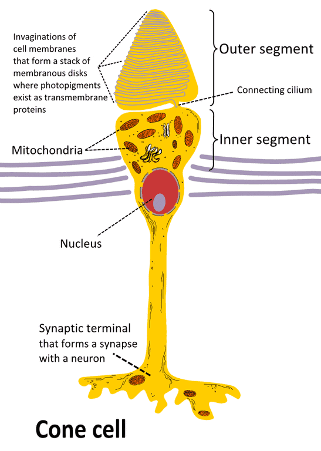
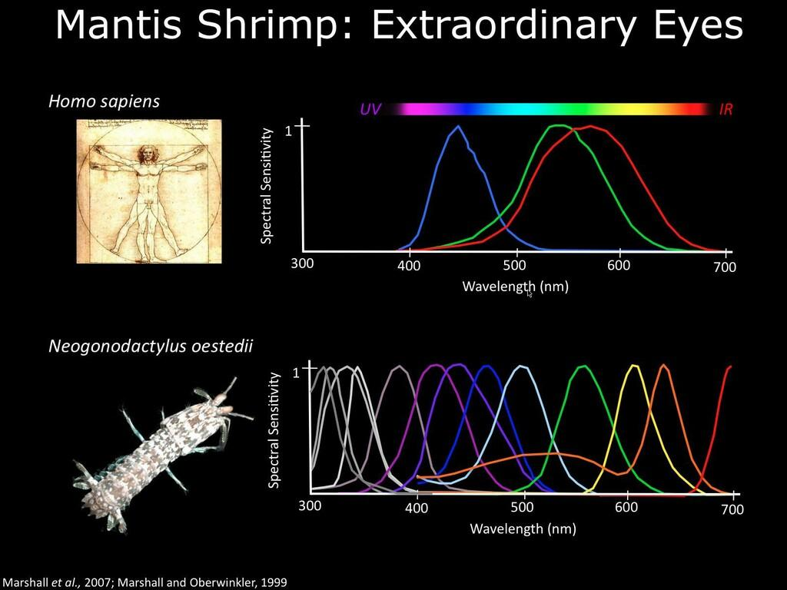
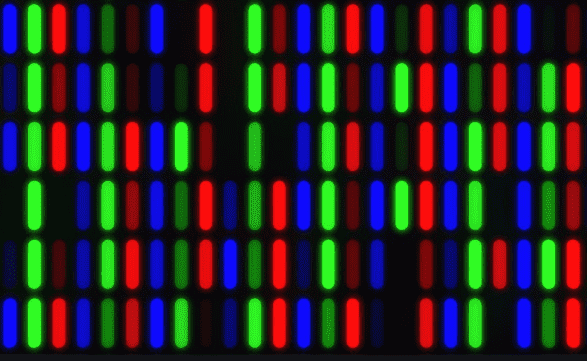
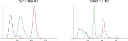
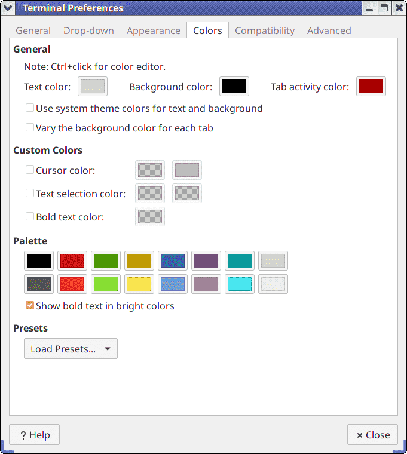
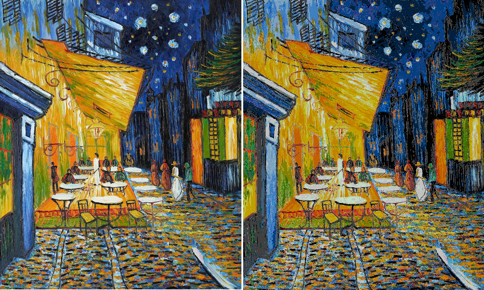
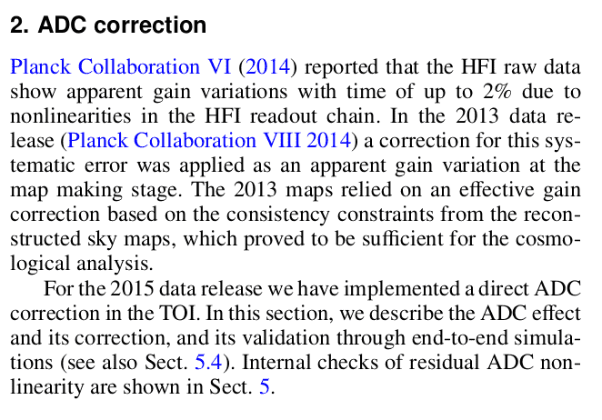

# Emissioni realistiche

-   Anche se nella scorsa lezione abbiamo parlato di «colore», non dobbiamo pensare che basti **un** numero a codificarlo: questo è vero solo per un corpo nero ideale (dove è sufficiente la temperatura `T`)!

-   Gli spettri di emissione di oggetti del mondo reale possono essere
    molto complessi (v. lezione precedente):

    <center>
    {height="300px"}
    </center>

# SPD

-   Il termine *Spectral Power Distribution* (SPD) è un termine
    generico che indica la forma funzionale di una quantità dipendente
    da $\lambda$: SPD della radianza, SPD del flusso, SPD dell'emittanza, etc.

-   I grafici della slide precedente sono di fatto rappresentazioni di
    diverse SPD.

-   La percezione che il nostro occhio ha di un colore dipende dalla
    SPD dell'irradianza che raggiunge i fotorecettori della retina
    sensibili al colore (*coni*).

# Percezione del colore

-   I fotorecettori presenti nell'occhio umano sono di due tipi:

    1.  **Bastoncelli**: cellule fotorecettrici fortemente sensibili
        all'intensità della luce (~100 milioni per occhio)

    2.  **Coni**: cellule fotorecettrici sensibili al colore della
        luce (~ 5 milioni per occhio)

-   I bastoncelli non sono sensibili alla SPD, e sono usati
    soprattutto in condizioni di scarsa luminosità.

-   Ovviamente a noi oggi interessano i coni!

---



# Tipi di coni

-   Esistono tre tipi di coni:

    1.  Tipo S (*short*): sensibile al blu
    2.  Tipo M (*medium*): sensibile al verde
    3.  Tipo L (*long*): sensibile al rosso

-   Ci sono più teorie che spiegano come il cervello combini le
    informazioni dei tre tipi di coni per rappresentare un colore.
    
-   Nel mondo animale c'è molta varietà: il [gambero mantide](https://www.nature.com/news/mantis-shrimp-s-super-colour-vision-debunked-1.14578) possiede 12 tipi di coni!

---



# Sistema XYZ

-   Teoria tristimolare dei colori: è sempre possibile codificare il
    colore percepito dall'occhio umano usando tre quantità scalari
    legate alla SPD:

    $$
    \begin{aligned}
    x &= \frac{
        \int_\lambda \mathrm{d}\lambda\,S(\lambda)\,X(\lambda)
    }{
        \int_\lambda \mathrm{d}\lambda\,Y(\lambda)
    },\\
    y &= \frac{
        \int_\lambda \mathrm{d}\lambda\,S(\lambda)\,Y(\lambda)
    }{
        \int_\lambda \mathrm{d}\lambda\,Y(\lambda)
    },\\
    z &= \frac{
        \int_\lambda \mathrm{d}\lambda\,S(\lambda)\,Z(\lambda)
    }{
        \int_\lambda \mathrm{d}\lambda\,Y(\lambda)
    }.
    \end{aligned}
    $$

# Sistema XYZ

-   Le curve $X(\lambda)$, $Y(\lambda)$ e $Z(\lambda)$ sono
    predefinite.

-   Definite dalla Commission Internationale de l'Éclairage (CIE) in seguito ad esperimenti fatti negli anni '20 su 17 volontari.

-   La costante di normalizzazione è sempre

    $$
    \int_\lambda \mathrm{d}\lambda\,Y(\lambda) \approx 106.856895\,\text{nm}.
    $$

-   Essendo state derivate prima della scoperta dei coni (anni '50), le curve $X$, $Y$ e $Z$ seguono un andamento diverso dall'effettiva risposta dei coni umani.

# Curve X, Y, Z

```{.gnuplot im_fmt="svg" im_out="img"}
set terminal svg
set xlabel "Wavelength [nm]"
set ylabel "Pure number"
plot "cie_data.txt" using 1:2 with lines lw 2 lt rgb "#3434ad" t 'X', \
     "" using 1:3 with lines lw 2 lt rgb "#34ad34" t 'Y', \
     "" using 1:4 with lines lw 2 lt rgb "#ad3434" t 'Z'
```

# Metamerismo cromatico

-   È possibile che due SED diverse portino agli stessi valori XYZ

-   In questo caso il colore dei due oggetti è indistinguibile
    all'occhio umano

-   Il fenomeno è detto *metamerismo cromatico*, e i due colori si
    dicono *metamerici*

-   Il metamerismo dipende dal tipo di illuminazione (sole, lampada a
    fluorescenza, luce laser, etc.)

# XYZ e RGB

-   La codifica XYZ è basata sul funzionamento dell'occhio umano (coni)

-   Non è in generale adatto per la fabbricazione di hardware

-   Codifiche molto usate sono RGB (monitor) e CYMK (stampanti)

-   Noi ci occuperemo solo della codifica RGB

# Sistema RGB

-   La codifica RGB usa tre quantità scalari per identificare un
    colore: rosso, verde, blu (**R**ed, **G**reen, **B**lue).

-   Basato sulla sintesi *additiva* dei colori, che è perfetta per i monitor (le stampanti usano la sintesi *sottrattiva*, e usano la codifica CYMK).

-   Legato al funzionamento dei vecchi televisori a tubo catodico e replicato sui moderni schermi LED e LCD

{height=200px}

# Emissione RGB

Esistono vari tipi di schermi (tubi catodici, LED, etc.), e gli
spettri di emissione dei tre canali RGB possono essere diversi:

{height=400px}

Non spenderemo troppo tempo su questo per motivi di tempo.

# Da XYZ a RGB

$$
\begin{aligned}
\begin{pmatrix}R\\G\\B\end{pmatrix} &=
M_{\text{XYZ}\rightarrow\text{RGB}}\begin{pmatrix}X\\Y\\Z\end{pmatrix} =\\
&=
\begin{pmatrix}
+3.2404542& -1.5371385& -0.4985314\\
-0.9692660& +1.8760108& +0.0415560\\
+0.0556434& -0.2040259& +1.0572252
\end{pmatrix}
\begin{pmatrix}X\\Y\\Z\end{pmatrix}.\\
\end{aligned}
$$

# Colori RGB { data-state="rgb-colors-1.0" }

<table style="width:60%">
    <tr>
        <th>Red</th>
        <th>Green</th>
        <th>Blue</th>
    </tr>
    <tr>
        <td id="val1Red"></td>
        <td id="val1Green"></td>
        <td id="val1Blue"></td>
    </tr>
    <tr>
        <td id="red" style="height:50px;background-color:red"></td>
        <td id="green" style="background-color:green"></td>
        <td id="blue" style="background-color:blue"></td>
    </tr>
    <tr>
        <td>
            <input oninput="rgb1ChangeRed(this.value)" onchange="rgb1ChangeRed(this.value)" type="range" id="slideRed" name="slideRed" min="0" max="255" value="0">
        </td>
        <td>
            <input oninput="rgb1ChangeGreen(this.value)" onchange="rgb1ChangeGreen(this.value)" type="range" id="slideGreen" name="slideGreen" min="0" max="255" value="0">
        </td>
        <td>
            <input oninput="rgb1ChangeBlue(this.value)" onchange="rgb1ChangeBlue(this.value)" type="range" id="slideBlue" name="slideBlue" min="0" max="255" value="0">
        </td>
    </tr>
</table>
<div id="rgb1Change" style="margin:auto;width:50%;height:50px"></div>

<script>
function roundComponent(value) {
    return Math.round(value * 1000) / 1000
}

function rgb1ChangeRed(value) {
    document.getElementById('val1Red').innerHTML = roundComponent(value / 255.0);
    rgb1ChangeAll();
}
function rgb1ChangeGreen(value) {
    document.getElementById('val1Green').innerHTML = roundComponent(value / 255.0);
    rgb1ChangeAll();
}
function rgb1ChangeBlue(value) {
    document.getElementById('val1Blue').innerHTML = roundComponent(value / 255.0);
    rgb1ChangeAll();
}
function rgb1ChangeAll() {
    var r = Math.round(document.getElementById('val1Red').innerHTML * 255);
    var g = Math.round(document.getElementById('val1Green').innerHTML * 255);
    var b = Math.round(document.getElementById('val1Blue').innerHTML * 255);
    document.getElementById('rgb1Change').style.backgroundColor = 
        "rgb(" + r.toString() + "," + g.toString() + "," + b.toString() + ")";
}

document.addEventListener('rgb-colors-1.0', function() {
    document.getElementById('val1Red').innerHTML = 0;
    document.getElementById('val1Green').innerHTML = 0;
    document.getElementById('val1Blue').innerHTML = 0;
    rgb1ChangeAll();
});
</script>

# Da $L_\lambda$ a RGB

-   Equazione del rendering espressa per $L_\lambda$
    $$
    \begin{aligned}
    L_\lambda(x \rightarrow \Theta) = &L_{e,\lambda}(x \rightarrow \Theta) +\\
    &\int_{\Omega_x} f_{r,\lambda}(x, \Psi \rightarrow \Theta)\,L_\lambda(x \leftarrow \Psi)\,\cos(N_x, \Psi)\,\mathrm{d}\omega_\Psi.
    \end{aligned}
    $$

-   Possiamo esprimere l'equazione usando $R$, $G$ e $B$ anziché $L_\lambda$?

# Operazioni sui colori

-   Per valutare l'integrale nell'equazione del rendering occorrono queste operazioni:

    -   Somma di densità di radianza: $L_\lambda^{(1)} + L_\lambda^{(2)}$
    -   Prodotto di densità di radianza per uno scalare: $\xi\,L_\lambda$

-   Se $f_{r,\lambda}$ è costante nel dominio di integrazione, le due operazioni sono lineari

-   La definizione di $X$, $Y$, $Z$ è lineare (integrale)

-   La conversione a RGB è lineare (matrice)

-   Quindi le due operazioni (somma e prodotto per scalare) possono essere implementate direttamente sui valori RGB.

# Esempio (1/2)

$$
\begin{aligned}
L_\lambda &= \alpha L_\lambda^{(1)} + \beta L_\lambda^{(2)},\\
\int_\lambda\mathrm{d}\lambda\,X(\lambda)\,L_\lambda &= \int_\lambda\mathrm{d}\lambda\,X(\lambda)\,\bigl(\alpha L_\lambda^{(1)} + \beta L_\lambda^{(2)}\bigr),\\
\int_\lambda\mathrm{d}\lambda\,X(\lambda)\,L_\lambda &= \alpha\int_\lambda\mathrm{d}\lambda\,X(\lambda)\, L_\lambda^{(1)} +
  \beta \int_\lambda\mathrm{d}\lambda\,X(\lambda)\,L_\lambda^{(2)},\\
x &= \alpha x^{(1)} + \beta x^{(2)},\\
\end{aligned}
$$
e quindi operazioni lineari sulla radianza si traducono in operazioni lineari sulle componenti di colore $x$, $y$ e $z$.

# Esempio (2/2)

$$
\begin{aligned}
M_{\text{XYZ}\rightarrow\text{RGB}}\begin{pmatrix}x\\y\\z\end{pmatrix} &=
M_{\text{XYZ}\rightarrow\text{RGB}}\begin{pmatrix}\alpha x^{(1)} + \beta x^{(2)}\\\alpha y^{(1)} + \beta y^{(2)}\\\alpha z^{(1)} + \beta z^{(2)}\end{pmatrix},\\
\begin{pmatrix}R\\G\\B\end{pmatrix} &=
\alpha M_{\text{XYZ}\rightarrow\text{RGB}}\begin{pmatrix}x^{(1)}\\y^{(1)}\\z^{(1)}\end{pmatrix} +
\beta M_{\text{XYZ}\rightarrow\text{RGB}}\begin{pmatrix}x^{(2)}\\y^{(2)}\\z^{(2)}\end{pmatrix},\\
R &= \alpha R^{(1)} + \beta R^{(2)},\\
\end{aligned}
$$
e quindi la linearità è preservata anche per $R$, $G$ e $B$.

# Equazione del rendering

Se indichiamo con $R$, $G$ e $B$ la radianza integrata e convertita nel sistema RGB, l'equazione del rendering si traduce in un sistema di tre equazioni identiche:
$$
\begin{aligned}
R(x \rightarrow \Theta) = &R_{e}(x \rightarrow \Theta) +\\
    &\int_{\Omega_x} f_{r,R}(x, \Psi \rightarrow \Theta)\,R(x \leftarrow \Psi)\,\cos(N_x, \Psi)\,\mathrm{d}\omega_\Psi,\\
\end{aligned}
$$
e analogamente per $G$ e $B$. Questo ovviamente vale solo se la BRDF $f_r$ è una funzione costante all'interno della risposta in banda $X$, $Y$ e $Z$!


# Visualizzazione su dispositivi

# Funzionamento di un monitor

-   Un monitor visualizza le immagini tramite una matrice di punti (*pixel*: *picture element*)
-   Ogni punto è comandato tramite una terna RGB di valori
-   I valori possibili spaziano in un intervallo limitato
-   Il realismo nell'emissione di $L$ è quindi in genere impossibile

---

<center>

</center>

---

# Colori in terminali Unix

-   Gli «emulatori di terminale» Unix sono dei programmi che simulano il comportamento dei vecchi terminali a caratteri.

-   Sebbene i terminali originali fossero monocromatici, emulatori come XTerm aggiunsero la possibilità di usare 8 colori

-   Versioni più avanzate, come quelli sui primi Personal Computer Intel, supportavano ben 16 colori!

-   Oggi i terminali supportano 256 colori, e alcuni addirittura 16 milioni.

-   Ma perché questi numeri strani (8, 16, 256, 16 milioni?)

---

<center>

</center>

# Codifica RGB di colori (1/2)

-   Nel caso di 8 colori, ogni colore viene rappresentato da tre bit `rgb` (es., `010`, `100`, etc.). Se un bit è `1`, il led di quel colore viene acceso, altrimenti viene spento. Quindi `100` corrisponde al rosso, `110` al giallo, etc. Tre bit possono codificare $2^3 = 8$ colori.

-   Nel caso di 16 colori, viene aggiunto un bit che specifica se i led accesi devono emettere all'intensità massima o a una intermedia. Quindi `0100` è un rosso spento, `1100` è un rosso brillante, `0110` è marrone e `1110` è giallo. Quattro bit possono codificare $2^4 = 16$ colori.

# Codifica RGB di colori (2/2)

-   Nel caso di 256 colori, ci sono molti standard in gioco, e la maggior parte dei quali non sono coerenti con la codifica RGB. In alcune applicazioni si usa la maschera di bit `rrrgggbb`, usando 3 bit (8 livelli) per il rosso e per il verde, e solo 2 bit (4 livelli) per il blu. (L'occhio umano è meno sensibile alle tonalità di blu).

-   Nel caso dei 16 milioni di colori, si usano 8 bit per ciascun livello di colore, così che $2^{8+8+8} = 2^{24} = 16\,777\,216$.

-   La codifica a 16 milioni di colori è rara nei terminali, ma è lo standard per le immagini fotografiche, e viene usato nei formati PNG, Jpeg, TIFF, etc.

---

Sinistra: 16 milioni di colori

Destra: 256 colori con codifica 3+3+2



[*Terrazza del caffè la sera, Place du Forum, Arles*. Vincent Van Gogh (1888)]{style="float:right"}

# Colori RGB { data-state="rgb-colors" }

<table style="width:60%">
    <tr>
        <th>Red</th>
        <th>Green</th>
        <th>Blue</th>
    </tr>
    <tr>
        <td id="valRed"></td>
        <td id="valGreen"></td>
        <td id="valBlue"></td>
    </tr>
    <tr>
        <td id="red" style="height:50px;background-color:red"></td>
        <td id="green" style="background-color:green"></td>
        <td id="blue" style="background-color:blue"></td>
    </tr>
    <tr>
        <td>
            <input oninput="rgbChangeRed(this.value)" onchange="rgbChangeRed(this.value)" type="range" id="slideRed" name="slideRed" min="0" max="255" value="0">
        </td>
        <td>
            <input oninput="rgbChangeGreen(this.value)" onchange="rgbChangeGreen(this.value)" type="range" id="slideGreen" name="slideGreen" min="0" max="255" value="0">
        </td>
        <td>
            <input oninput="rgbChangeBlue(this.value)" onchange="rgbChangeBlue(this.value)" type="range" id="slideBlue" name="slideBlue" min="0" max="255" value="0">
        </td>
    </tr>
</table>
<div id="rgbChange" style="margin:auto;width:50%;height:50px"></div>

<script>
function rgbChangeRed(value) {
    document.getElementById('valRed').innerHTML = value;
    rgbChangeAll();
}
function rgbChangeGreen(value) {
    document.getElementById('valGreen').innerHTML = value;
    rgbChangeAll();
}
function rgbChangeBlue(value) {
    document.getElementById('valBlue').innerHTML = value;
    rgbChangeAll();
}
function rgbChangeAll() {
    var r = document.getElementById('valRed').innerHTML;
    var g = document.getElementById('valGreen').innerHTML;
    var b = document.getElementById('valBlue').innerHTML;
    document.getElementById('rgbChange').style.backgroundColor = "rgb(" + r + "," + g + "," + b + ")";
}

document.addEventListener('rgb-colors', function() {
    document.getElementById('valRed').innerHTML = 0;
    document.getElementById('valGreen').innerHTML = 0;
    document.getElementById('valBlue').innerHTML = 0;
    rgbChangeAll();
});
</script>

# Comportamento dei monitor

# Non-linearità dei monitor

-   La potenza emessa dai punti di uno schermo non varia linearmente.

-   La relazione tra il livello di emissione richiesto $I$ e il flusso $\Phi$ effettivamente emesso da un pixel è di solito della forma
    $$
    \Phi \propto \left(\frac{I}{I_\text{max}}\right)^\gamma,
    $$

    dove $I \in [0, I_\text{max}]$, e $\gamma$ è un parametro caratteristico del dispositivo.
    
-   Nei monitor moderni ovviamente $I_\text{max} = 255$, e $I$ è un numero *intero*.

# Andamento di $\gamma$

```{.gnuplot im_fmt="svg" im_out="img"}
set terminal svg
set xlabel "Normalized input"
set ylabel "Normalized output"
set key left top
plot [0:1] x with lines t "γ = 1.0" lt rgb "#ad3434", \
           x**1.6 with lines t "γ = 1.6" lt rgb "#34ad34", \
           x**2.2 with lines t "γ = 2.2" lt rgb "#3434ad"
```

# Calibrazione dei monitor


$$
\text{value} = \frac12^\gamma \quad\Rightarrow\quad \gamma = \frac{\log 1/2}{\log(\text{value})}
$$


# Calibrazione dei monitor  { data-state="monitor-calibration-state" }

<table>
    <tr>
        <td>
            <canvas
                id="monitor-calibration"
                width="300px"
                height="300px"
                style="image-rendering: pixelated">
            </canvas>
        </td>
        <td>
            <canvas
                id="gamma-plot"
                width="300px"
                height="300px">
            </canvas>
        </td>
    </tr>
</table>

<div class="slidecontainer">
  <input type="range" min="0.0" max="1.0"
    value="0.5" step="0.01" class="slider" id="gamma-slider">
  <p id="gamma-value"></p>
</div>

<script>
var checker_canvas_width;
var checker_canvas_height;
var checker_canvas_ctx;

var gamma_canvas_width;
var gamma_canvas_height;
var gamma_canvas_ctx;

var gamma_slider = document.getElementById("gamma-slider");
var gamma_value = document.getElementById("gamma-value");
var black_white_checkers;
gamma_value.innerHTML = gamma_slider.value;

function calc_gamma(val05) {
    return Math.log(0.5) / Math.log(val05);
}

function redraw_gamma() {
  var val = (gamma_slider.value * 255.0).toFixed(0);

  // Grey border around the image
  checker_canvas_ctx.fillStyle = `rgb(${val}, ${val}, ${val})`;
  checker_canvas_ctx.fillRect(0, 0, checker_canvas_width, checker_canvas_height);

  // Checkered image
  var cornerx = (checker_canvas_width - black_white_checkers.width) / 2;
  var cornery = (checker_canvas_height - black_white_checkers.height) / 2;
  checker_canvas_ctx.drawImage(black_white_checkers,
                               cornerx, cornery);

  // Gamma plot
  gamma_canvas_ctx.clearRect(0, 0, gamma_canvas_width, gamma_canvas_height);

  var gamma = calc_gamma(gamma_slider.value * 1.0);
  const numOfPoints = 30;
  gamma_canvas_ctx.beginPath();
  gamma_canvas_ctx.moveTo(0, gamma_canvas_height);
  for(i = 1; i <= numOfPoints; i++) {
    gamma_canvas_ctx.lineTo(gamma_canvas_height * i / numOfPoints,
                            gamma_canvas_height * (1.0 - Math.pow(i * 1.0 / numOfPoints, gamma)));
  }
  gamma_canvas_ctx.stroke();
}

function refresh_gamma_text(val) {
  var gamma = calc_gamma(val);
  gamma_value.innerHTML = `Value: ${val.toFixed(2)} (${(val * 255.0).toFixed(0)}), γ: ${gamma.toFixed(2)}`;
  redraw_gamma();
}

gamma_slider.oninput = function() {
  refresh_gamma_text(this.value * 1.0);
}

document.addEventListener('monitor-calibration-state', function() {
  var canvas = document.getElementById("monitor-calibration");
  checker_canvas_ctx = canvas.getContext("2d");
  checker_canvas_width = canvas.width;
  checker_canvas_height = canvas.height;

  canvas = document.getElementById("gamma-plot");
  gamma_canvas_ctx = canvas.getContext("2d");
  gamma_canvas_width = canvas.width;
  gamma_canvas_height = canvas.height;

  black_white_checkers = new Image();
  black_white_checkers.src = "./media/black-white-checkers.png";
  black_white_checkers.addEventListener("load", redraw_gamma, false);

  refresh_gamma_text(0.5);
});
</script>

# Risposta dei monitor

-   Una volta ottenuta una terna RGB di numeri reali, per pilotare un monitor occorre convertirla in una cosiddetta «[terna sRGB](https://en.wikipedia.org/wiki/SRGB)».
-   La conversione è parametrizzata da $\gamma$ (ma non solo), e **non è lineare**.
-   Quanto abbiamo visto per la conversione $L_\lambda \rightarrow (X, Y, Z) \rightarrow (R, G, B)$ non si applica quindi a sRGB.

# Conversione da RGB a sRGB

-   Una semplice approssimazione per la conversione da RGB, $(R, G, B)$, a sRGB, $(r, g, b)$, è la seguente:
    $$
    \begin{aligned}
    r &= \left[k\,R^\gamma\right],\\
    g &= \left[k\,G^\gamma\right],\\
    b &= \left[k\,B^\gamma\right],\\
    \end{aligned}
    $$
    dove $[\cdot]$ è indica l'arrotondamento a intero, e $k$ è una costante di normalizzazione.
-   Determinare un «buon» valore per $k$ è critico!

# Determinazione di $k$

-   Se i valori R, G e B fossero compresi nell'intervallo $[0, 1]$, allora basterebbe porre $k = 255$.
-   Ma l'intervallo dei possibili valori di R, G e B è infinito:
    -   Dipende dall'unità di misura usata per $L_\lambda$;
    -   Dipende dalla scena (astronave vicino a una supernova? stanza in penombra?)
-   Lo standard CIE XYZ definisce una normalizzazione di riferimento in termini di un colore standard, il *D65*, che corrisponde all'emissione di un corpo nero a 6500 K (più o meno l'emissione del cielo in una giornata limpida).
-   Vedremo meglio questo punto quando avremo discusso il salvataggio di immagini.

# Esempio della vita reale

{height=520}

Planck: missione spaziale ESA (2009–2013)

---

<center>
{height=640}
</center>

# Analogue-to-Digital Converters

<center>

</center>

# Lezioni imparate oggi

---

-   Semplificare il più possibile: invece di trattare $L_\lambda$, usiamo $R$, $G$ e $B$.
-   Mai dimenticarsi che le misurazioni fisiche passano da uno strumento: occorre conoscerne le caratteristiche e le non-idealità!
-   Il mondo è *complicato*!
