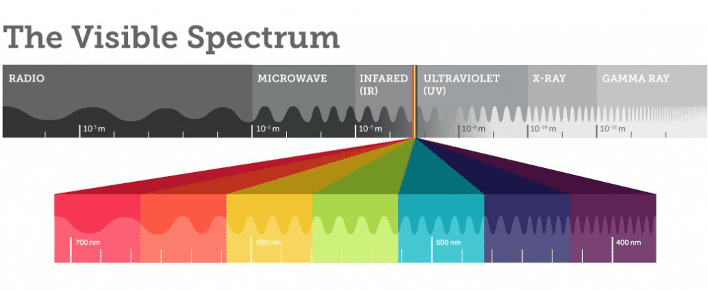
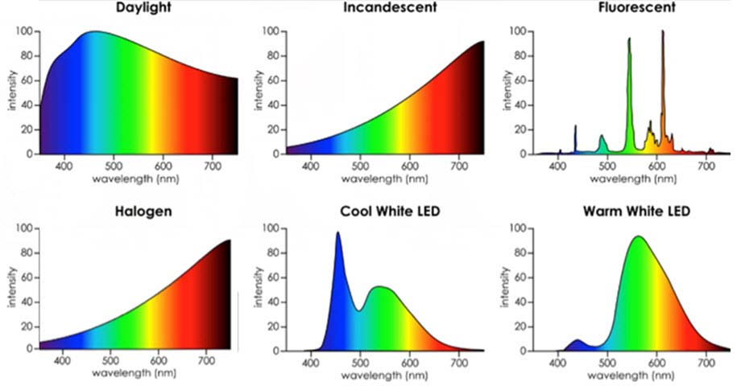
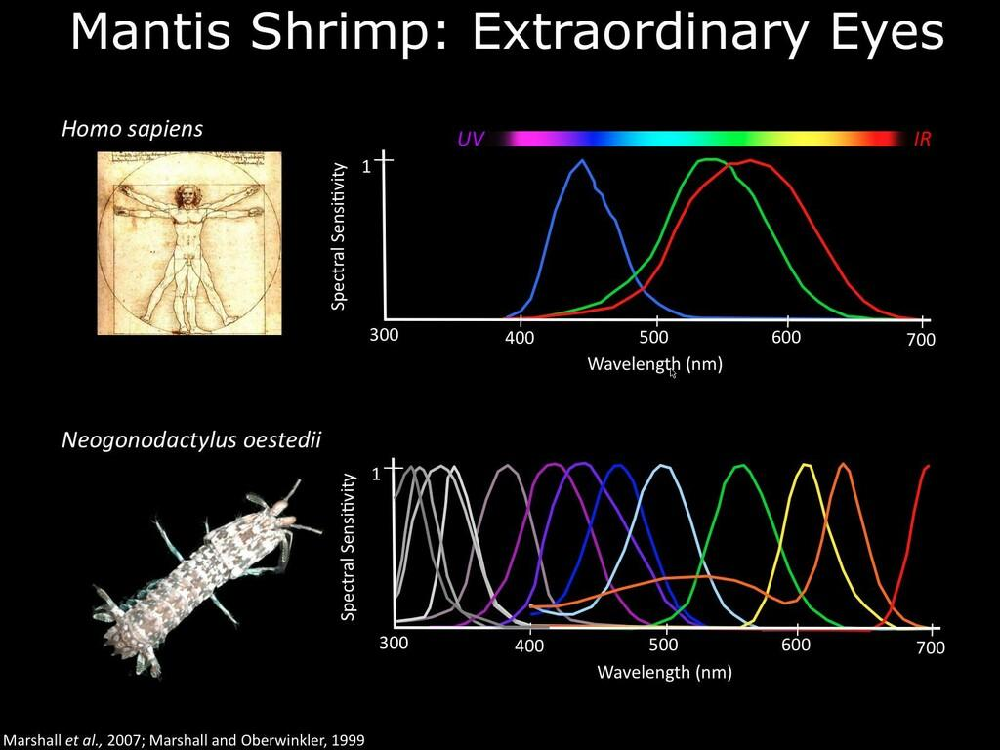
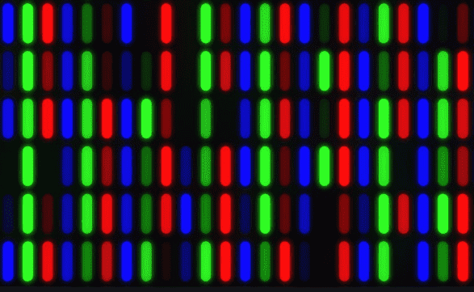
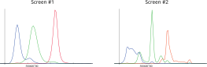
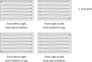
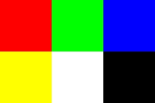

# Suggested calendar

<small>

| Week        | Topic                                  |
|-------------|----------------------------------------|
| March, 2nd  | Colors                                 |
| March, 9th  | HDR files                              |
| March, 16th | **No classes!**                        |
| March, 23rd | Tone mapping                           |
| March, 30th | Linear algebra                         |
| April, 8th  | Clifford algebras (only on Wednesday!) |
| April, 13th | 3D projections                         |
| April, 20th | Geometrical shapes #1                  |
| April, 27th | Geometrical shapes #2                  |
| May, 4th    | Path tracing #1                        |
| May, 11th   | Path tracing #2                        |
| May, 18th   | Compilers #1                           |
| May, 25th   | Compilers #2                           |

</small>

# Previous Lesson

-   **Radiance** (flux $\Phi$ in Watts normalized on the projected surface per unit solid angle):
    $$
    L = \frac{\mathrm{d}^2\Phi}{\mathrm{d}\Omega\,\mathrm{d}A^\perp}
    = \frac{\mathrm{d}^2\Phi}{\mathrm{d}\Omega\,\mathrm{d}A\,\cos\theta},
    \qquad [L] = \mathrm{W}/\mathrm{m}^2/\mathrm{sr}.
    $$

-   Rendering equation:
    $$
    \begin{aligned}
    L(x \rightarrow \Theta) = &L_e(x \rightarrow \Theta) +\\
    &\int_{\Omega_x} f_r(x, \Psi \rightarrow \Theta)\,L(x \leftarrow \Psi)\,\cos(N_x, \Psi)\,\mathrm{d}\omega_\Psi.
    \end{aligned}
    $$

# Color Encoding {#color-encoding}

-   The quantities $\Phi$, $L$, etc. are all wavelength-dependent $\lambda$ (radiance → *spectral radiance*)

-   In numerical codes that simulate light propagation, we have to solve two problems:

    1.  A function $f(\lambda)$ dependent on the wavelength has an infinite number of degrees of freedom: how can we represent it numerically?

    2.  In our case, radiance is perceived as a color: but how do you specify a color when controlling a monitor or a printer?

---



# Realistic Emissions

-   **One** number is not enough to encode a color: this is only true for an ideal black body (where the temperature $T$ is a sufficient descriptor)!

-   Emission spectra of real-world objects can be very complex (see previous lesson):

    <center>
    {height="360px"}
    </center>

# SPD

-   The term *Spectral Power Distribution* (SPD) is a generic term that indicates the functional form of a quantity dependent on λ: SPD of radiance, SPD of flux, SPD of emittance, etc.

-   The plots in the previous slide are in fact representations of different SPDs.

-   The visual perception of a color depends on the SPD of the irradiance that reaches the color-sensitive photoreceptors of the retina (*cones*).

# Color Perception

-   There are two types of photoreceptors in the human eye:

    1.  **Rods**: photoreceptor cells highly sensitive to light intensity (~100 million per eye)

    2.  **Cones**: photoreceptor cells sensitive to the color of light (~5 million per eye)

-   Rods are not sensitive to SPD, and are used mainly in low light conditions.

-   Since our focus today is on color, we will concentrate on cones.

# Types of Cones

-   There are three types of cones ([probably](https://en.wikipedia.org/wiki/Tetrachromacy)):

    1.  Type S (*short*): sensitive to blue
    2.  Type M (*medium*): sensitive to green
    3.  Type L (*long*): sensitive to red

-   There are many theories that explain how the brain combines the information from the three types of cones to represent a color.

-   In the animal world there is a lot of variety: the [mantis shrimp](https://www.nature.com/news/mantis-shrimp-s-super-colour-vision-debunked-1.14578) has 12 types of cones!

---



# Color Encoding

-   Tristimulus theory of color: it is always possible to encode the color of the signal $S(\lambda)$ perceived by the human eye using three scalar quantities related to the responses $B_S(\lambda)$, $B_M(\lambda)$, and $B_L(\lambda)$ of the cones:

    $$
    \begin{aligned}
    s &= k \int_\lambda \mathrm{d}\lambda\,S(\lambda)\,B_S(\lambda),\\
    m &= k \int_\lambda \mathrm{d}\lambda\,S(\lambda)\,B_M(\lambda),\\
    l &= k \int_\lambda \mathrm{d}\lambda\,S(\lambda)\,B_L(\lambda).
    \end{aligned}
    $$

# Metamerism

-   It is possible that two different signals $S_1(\lambda) \not= S_2(\lambda)$ lead to the same triplet $(s, m, l)$

-   In this case, the perceived color for the two signals is indistinguishable to the human eye

-   The phenomenon is called *metamerism*, and the two colors associated with the radiation hitting the eye are said to be *metameric*

-   Metamerism suggests that our vision applies a "lossy compression" of the input signal, converting it into a simpler representation. This is why ray-tracing is computationally feasible!


# RGB Encoding

-   There are various color encodings, based on triplets of scalar quantities: XYZ, HSV, HSL, RGB…

-   Widely used encodings are RGB (monitors) and CMYK (printers)

-   In this course we will only deal with RGB encoding

# RGB System

-   RGB encoding uses three scalar quantities to identify a color: red, green, blue (**R**ed, **G**reen, **B**lue).

-   Based on the *additive* synthesis of colors, which is perfect for monitors (printers use *subtractive* synthesis, and use CMYK encoding).

-   Inherited from the operation of cathode ray tube (CRT) televisions and replicated on modern LED and LCD screens

{height=200px}

# RGB Emission

There are various types of screens (cathode ray tubes, LEDs, etc.), and the emission spectra of the three RGB channels can be different:

{height=400px}

We will not spend too much time on this for time reasons.

# RGB Colors { data-state="rgb-colors-1.0" }

<table style="width:60%">
    <tr>
        <th>Red</th>
        <th>Green</th>
        <th>Blue</th>
    </tr>
    <tr>
        <td id="val1Red"></td>
        <td id="val1Green"></td>
        <td id="val1Blue"></td>
    </tr>
    <tr>
        <td id="red" style="height:50px;background-color:red"></td>
        <td id="green" style="background-color:green"></td>
        <td id="blue" style="background-color:blue"></td>
    </tr>
    <tr>
        <td>
            <input oninput="rgb1ChangeRed(this.value)" onchange="rgb1ChangeRed(this.value)" type="range" id="slideRed" name="slideRed" min="0" max="255" value="0">
        </td>
        <td>
            <input oninput="rgb1ChangeGreen(this.value)" onchange="rgb1ChangeGreen(this.value)" type="range" id="slideGreen" name="slideGreen" min="0" max="255" value="0">
        </td>
        <td>
            <input oninput="rgb1ChangeBlue(this.value)" onchange="rgb1ChangeBlue(this.value)" type="range" id="slideBlue" name="slideBlue" min="0" max="255" value="0">
        </td>
    </tr>
</table>
<div id="rgb1Change" style="margin:auto;width:50%;height:50px"></div>

<script>
function roundComponent(value) {
    return Math.round(value * 1000) / 1000
}

function rgb1ChangeRed(value) {
    document.getElementById('val1Red').innerHTML = roundComponent(value / 255.0);
    rgb1ChangeAll();
}
function rgb1ChangeGreen(value) {
    document.getElementById('val1Green').innerHTML = roundComponent(value / 255.0);
    rgb1ChangeAll();
}
function rgb1ChangeBlue(value) {
    document.getElementById('val1Blue').innerHTML = roundComponent(value / 255.0);
    rgb1ChangeAll();
}
function rgb1ChangeAll() {
    var r = Math.round(document.getElementById('val1Red').innerHTML * 255);
    var g = Math.round(document.getElementById('val1Green').innerHTML * 255);
    var b = Math.round(document.getElementById('val1Blue').innerHTML * 255);
    document.getElementById('rgb1Change').style.backgroundColor =
        "rgb(" + r.toString() + "," + g.toString() + "," + b.toString() + ")";
}

document.addEventListener('rgb-colors-1.0', function() {
    document.getElementById('val1Red').innerHTML = 0;
    document.getElementById('val1Green').innerHTML = 0;
    document.getElementById('val1Blue').innerHTML = 0;
    rgb1ChangeAll();
});
</script>

# From $L_\lambda$ to RGB

-   Rendering equation expressed for $L_\lambda$
    $$
    \begin{aligned}
    L_\lambda(x \rightarrow \Theta) = &L_{e,\lambda}(x \rightarrow \Theta) +\\
    &\int_{\Omega_x} f_{r,\lambda}(x, \Psi \rightarrow \Theta)\,L_\lambda(x \leftarrow \Psi)\,\cos(N_x, \Psi)\,\mathrm{d}\omega_\Psi.
    \end{aligned}
    $$

-   We want to convert the equation in $L_\lambda$ into three equations that provide the three components $R$, $G$, $B$ that “drive” each pixel on the monitor.

---

If $f_{r,\lambda} = f_{r, X}$ is constant in the band $X(\lambda)$ (**big approximation!**), then

$$
\begin{aligned}
L_\lambda(x \rightarrow \Theta) = &L_{e,\lambda}(x \rightarrow \Theta) +\\
% I use \! here to insert some negative space
&\int_{\Omega_x}\! f_{r,\lambda}(x, \Psi \rightarrow \Theta)\,L_\lambda(x \leftarrow \Psi)\,\cos(N_x, \Psi)\,\mathrm{d}\omega_\Psi\\
\int_0^\infty\!\!\!\!\!{} X(\lambda)\,L_\lambda(x \rightarrow \Theta)\,\mathrm{d}\lambda = &\int_0^\infty\!\!\!\!\!{} X(\lambda)\,L_{e,\lambda}(x \rightarrow \Theta)\,\mathrm{d}\lambda +\\
&\iint\!\!\mathrm{d}\lambda\,\mathrm{d}\omega_\Psi\,X(\lambda)\,L_\lambda(x \leftarrow \Psi) f_{r,X}(x, \Psi \rightarrow \Theta)\,\cos(N_x, \Psi)\\
L_X(x \rightarrow \Theta) = &L_{X,e}(x \rightarrow \Theta) +\\
&\int_{\Omega_x}\! f_{r,X}(x, \Psi \rightarrow \Theta)\,L_X(x \leftarrow \Psi)\,\cos(N_x, \Psi)\,\mathrm{d}\omega_\Psi.
\end{aligned}
$$

# Rendering Equation {#relationship-between-radiance-and-rgb}

-   If we denote with $R$, $G$ and $B$ the integrated and converted radiance in the RGB system, the rendering equation translates into a system of three equations.

-   These can be rewritten as a "vector" equation on $\vec c = (R, G, B)$:
    $$
    \begin{aligned}
    \vec c(x \rightarrow \Theta) = &\vec c_{e}(x \rightarrow \Theta) +\\
    &\int_{\Omega_x} \vec f_r(x, \Psi \rightarrow \Theta)\otimes \vec c(x \leftarrow \Psi)\,\cos(N_x, \Psi)\,\mathrm{d}\omega_\Psi.\\
    \end{aligned}
    $$

    where $\vec v \otimes \vec w$ indicates a "vector" given by the product of the components of $\vec v$ and $\vec w$.

# Display devices {#display-devices}

# How a monitor operates

-   A monitor can be considered a matrix of emitting points (*pixels*: *picture element*)

-   Each point is controlled by an RGB triplet of values

-   The possible values are constrained within a finite rangeinterval

-   Realism in the emission of $L$ by a monitor is therefore generally impossible

---

<center>

</center>

# RGB Color Encoding

-   Today all monitors and graphics cards support the so-called "24-bit color depth" (16 millions of colors!)

-   An RGB triplet is encoded by a computer using three 8-bit integer values; for example, in C++ one could use a type like the following:

    ```c++
    struct RGB {
        uint8_t r, g, b;
    };
    ```

-   The total number of RGB combinations is $2^8 \times 2^8 \times 2^8 = 2^{24} = 16\,777\,216$.

# RGB Colors { data-state="rgb-colors" }

<table style="width:60%">
    <tr>
        <th>Red</th>
        <th>Green</th>
        <th>Blue</th>
    </tr>
    <tr>
        <td id="valRed"></td>
        <td id="valGreen"></td>
        <td id="valBlue"></td>
    </tr>
    <tr>
        <td id="red" style="height:50px;background-color:red"></td>
        <td id="green" style="background-color:green"></td>
        <td id="blue" style="background-color:blue"></td>
    </tr>
    <tr>
        <td>
            <input oninput="rgbChangeRed(this.value)" onchange="rgbChangeRed(this.value)" type="range" id="slideRed" name="slideRed" min="0" max="255" value="0">
        </td>
        <td>
            <input oninput="rgbChangeGreen(this.value)" onchange="rgbChangeGreen(this.value)" type="range" id="slideGreen" name="slideGreen" min="0" max="255" value="0">
        </td>
        <td>
            <input oninput="rgbChangeBlue(this.value)" onchange="rgbChangeBlue(this.value)" type="range" id="slideBlue" name="slideBlue" min="0" max="255" value="0">
        </td>
    </tr>
</table>
<div id="rgbChange" style="margin:auto;width:50%;height:50px"></div>

<script>
function rgbChangeRed(value) {
    document.getElementById('valRed').innerHTML = value;
    rgbChangeAll();
}
function rgbChangeGreen(value) {
    document.getElementById('valGreen').innerHTML = value;
    rgbChangeAll();
}
function rgbChangeBlue(value) {
    document.getElementById('valBlue').innerHTML = value;
    rgbChangeAll();
}
function rgbChangeAll() {
    var r = document.getElementById('valRed').innerHTML;
    var g = document.getElementById('valGreen').innerHTML;
    var b = document.getElementById('valBlue').innerHTML;
    document.getElementById('rgbChange').style.backgroundColor = "rgb(" + r + "," + g + "," + b + ")";
}

document.addEventListener('rgb-colors', function() {
    document.getElementById('valRed').innerHTML = 0;
    document.getElementById('valGreen').innerHTML = 0;
    document.getElementById('valBlue').innerHTML = 0;
    rgbChangeAll();
});
</script>

# Monitor Behavior {#monitor-behavior}

# Monitor Non-Linearity

-   The power emitted by the points of a screen does not vary linearly.

-   The relationship between the requested emission level $I$ and the flux $\Phi$ actually emitted by a pixel is usually in the form
    $$
    \Phi = \Phi_0 + \bigl(\Phi_\text{max} - \Phi_0\bigr) \left(\frac{I}{I_\text{max}}\right)^\gamma\ \text{for R, G and B},
    $$

    where $I \in [0, I_\text{max}]$, and $\gamma$ is a characteristic parameter of the device.

-   In modern monitors, of course $I_\text{max} = 255$, and $I$ is an *integer* number.

# Gamma response curves

```{.gnuplot im_fmt="svg" im_out="img" im_fname="gamma-curve"}
set terminal svg font 'Helvetica,24'
set xlabel "Normalized input"
set ylabel "Normalized output"
set key left top
plot [0:1] x with lines t "γ = 1.0" lt rgb "#ad3434" lw 3, \
           x**1.6 with lines t "γ = 1.6" lt rgb "#34ad34" lw 3, \
           x**2.2 with lines t "γ = 2.2" lt rgb "#3434ad" lw 3
```

We assume here that $\Phi_0 \approx 0$.

# Monitor calibration


$$
\text{value} = \frac{\Phi}{\Phi_\text{max}} \stackrel{\Phi_0 \approx 0}{\approx} \left(\frac12\right)^\gamma \quad\Rightarrow\quad \gamma = \frac{\log 1/2}{\log(\text{value})}
$$


# Monitor calibration { data-state="monitor-calibration-state" }

<table>
    <tr>
        <td>
            <canvas
                id="monitor-calibration-canvas"
                width="300px"
                height="300px"
                style="image-rendering: pixelated; image-rendering: -moz-crisp-edges; image-rendering: crisp-edges; image-rendering: -webkit-optimize-contrast; transform: translateZ(0);">
            </canvas>
        </td>
        <td>
            <canvas
                id="gamma-plot"
                width="300px"
                height="300px">
            </canvas>
        </td>
    </tr>
</table>

<div class="slidecontainer">
  <input type="range" min="0.0" max="1.0"
    value="0.5" step="0.01" class="slider" id="gamma-slider">
  <p id="gamma-value"></p>
</div>

<script>
var checker_canvas_width;
var checker_canvas_height;
var checker_canvas_ctx;

var gamma_canvas_width;
var gamma_canvas_height;
var gamma_canvas_ctx;

var gamma_slider = document.getElementById("gamma-slider");
var gamma_value = document.getElementById("gamma-value");
var black_white_checkers;
gamma_value.innerHTML = gamma_slider.value;

function calc_gamma(val05) {
    return Math.log(0.5) / Math.log(val05);
}

function redraw_gamma() {
  var val = (gamma_slider.value * 255.0).toFixed(0);

  // Grey border around the image
  checker_canvas_ctx.fillStyle = `rgb(${val}, ${val}, ${val})`;
  checker_canvas_ctx.fillRect(0, 0, checker_canvas_width, checker_canvas_height);

  // Checkered image
  var cornerx = (checker_canvas_width - black_white_checkers.width) / 2;
  var cornery = (checker_canvas_height - black_white_checkers.height) / 2;

  // Draw the pixel-perfect checkered pattern
  checker_canvas_ctx.putImageData(black_white_checkers, cornerx, cornery);

  // Gamma plot
  gamma_canvas_ctx.clearRect(0, 0, gamma_canvas_width, gamma_canvas_height);

  var gamma = calc_gamma(gamma_slider.value * 1.0);
  const numOfPoints = 30;
  gamma_canvas_ctx.beginPath();
  gamma_canvas_ctx.moveTo(0, gamma_canvas_height);
  for(i = 1; i <= numOfPoints; i++) {
    gamma_canvas_ctx.lineTo(gamma_canvas_height * i / numOfPoints,
                            gamma_canvas_height * (1.0 - Math.pow(i * 1.0 / numOfPoints, gamma)));
  }
  gamma_canvas_ctx.stroke();
}

function refresh_gamma_text(val) {
  var gamma = calc_gamma(val);
  gamma_value.innerHTML = `Value: ${val.toFixed(2)} (${(val * 255.0).toFixed(0)}), γ: ${gamma.toFixed(2)}`;
  redraw_gamma();
}

gamma_slider.oninput = function() {
  refresh_gamma_text(this.value * 1.0);
}

document.addEventListener('monitor-calibration-state', function() {
  var canvas = document.getElementById("monitor-calibration-canvas");
  checker_canvas_ctx = canvas.getContext("2d");

  // Scale factor of the display
  const dpr = window.devicePixelRatio || 1;

  const logicalWidth = 300;
  const logicalHeight = 300;

  canvas.width = Math.round(widthCSS * dpr);
  canvas.height = Math.round(heightCSS * dpr);

  // Force the visualized size through CSS
  canvas.style.width = logicalWidth + "px";
  canvas.style.height = logicalHeight + "px";

  checker_canvas_width = canvas.width;
  checker_canvas_height = canvas.height;

  // Disable antialiasing
  checker_canvas_ctx.imageSmoothingEnabled = false;
  checker_canvas_ctx.webkitImageSmoothingEnabled = false;
  checker_canvas_ctx.mozImageSmoothingEnabled = false;
  checker_canvas_ctx.msImageSmoothingEnabled = false;

  canvas = document.getElementById("gamma-plot");
  gamma_canvas_ctx = canvas.getContext("2d");
  gamma_canvas_width = canvas.width;
  gamma_canvas_height = canvas.height;

  // Create checkered pattern pixel data
  const size = checker_canvas_width - Math.floor(100 * dpr);
  black_white_checkers = checker_canvas_ctx.createImageData(size, size);
  const data = black_white_checkers.data;

  for (let y = 0; y < size; y++) {
      for (let x = 0; x < size; x++) {
          const index = (y * size + x) * 4;
          // Alternating pattern
          const color = (x % 2) ^ (y % 2) ? 255 : 0;

          data[index] = color;
          data[index + 1] = color;
          data[index + 2] = color;
          data[index + 3] = 255;
      }
  }
  refresh_gamma_text(0.5);
});
</script>

# Monitor Response

-   Therefore, when we have a color expressed as an RGB triplet of real numbers, to display the color on a monitor it is necessary to perform the conversion using the $\gamma$ factor
-   (Real monitors use a slightly more complex formula that assumes linear behaviour for small intensities, but we will neglect it.)
-   The RGB color converted with $\gamma$ is an "[sRGB triplet](https://en.wikipedia.org/wiki/SRGB)".
-   The conversion is **not linear**, as is evident from its analytical expression
-   What we have seen for the conversion $L_\lambda \rightarrow (R, G, B)$ does not apply to sRGB: we cannot write the rendering equation directly in the sRGB space!

# What our software should do

-   The monitor applies a *gamma expansion*, which makes mid-tones appear darker
-   Therefore, our software must apply *gamma encoding* to ensure mid-tones are displayed with the correct intensity.
-   This requires implementing the inverse of the monitor’s expansion: we must apply a power-law transformation with exponent $1/\gamma$ to the linear radiance values computed by our code before outputting them to the display.

# Conversion from RGB to sRGB {#from-rgb-to-srgb}

-   A simple approximation for the conversion from RGB, $(R, G, B)$, to sRGB, $(r, g, b)$ (*power-law gamma approximation*), is the following:
    $$
    \begin{aligned}
    r &= \left[k\,R^{1/\gamma}\right],\\
    g &= \left[k\,G^{1/\gamma}\right],\\
    b &= \left[k\,B^{1/\gamma}\right],\\
    \end{aligned}
    $$
    where $[\cdot]$ indicates rounding to integer, and $k$ is a normalization constant.
-   Determining an optimal value for $k$ is crucial!

# Determination of $k$

-   If the R, G and B values were in the range $[0, 1]$, then it would be sufficient to set $k = 255$.
-   But the range of possible values of R, G and B is $[0, \infty)$:
    -   It depends on the unit of measurement used for $L_\lambda$;
    -   It depends on the scene
-   There are some color standards (such as CIE XYZ) that set a reference normalization (standard color, black body temperature…)
-   Let's see now how to save images in a file

# HDR and LDR Images

# From RGB to sRGB

-   Standard image file formats (PNG, JPEG, TIFF…) all use sRGB encoding

-   If we want our program to produce easy-to-use images, we must therefore convert the result of the rendering equation from RGB to sRGB.

-   *Tone mapping* is the process through which an RGB image is converted into an sRGB image, where by *image* we mean a matrix of RGB colors.

# Image Types

There are two categories of images that are relevant for this course:

LDR (Low-Dynamic Range) Images
: These store color components as integers using the sRGB system. The usual range is 0–255 (8 bit per component). All the most common graphic formats (JPEG, PNG, GIF, etc.) belong to this type.

HDR (High-Dynamic Range) Images
: These store components as floating-point numbers using the (linear) RGB system to represent the intensity of the scene without clipping. To display them, they must undergo *tone mapping* and gamma encoding. Examples of this format are OpenEXR and PFM.

# How your code will work

```{.graphviz im_fmt="svg" im_out="img" im_fname="course-workflow"}
digraph "" {
    read [label="read input file" shape=box];
    solve [label="solve the rendering equation and create a HDR image" shape=box];
    tonemapping [label="apply tone mapping to convert HDR to LDR" shape=box];
    save [label="save the LDR image" shape=box];
    read -> solve;
    solve -> tonemapping;
    tonemapping -> save;
}
```

# Raster Image Encoding

-   Both LDR and HDR images are encoded by a color matrix; each color is usually an RGB triplet.

-   The file usually has this content:

    Header
    : Specifies the image format, the matrix dimensions, and sometimes other useful parameters (e.g., the date and time of the shot, GPS coordinates, the $\gamma$ value of the device that captured the image, etc.).

    Color Matrix
    : The order in which rows/columns are saved, and also the order in which R, G, B components are saved (RGB/BGR) varies depending on the format.

---

<center>

</center>

# Example: the PPM Format

-   LDR format, very common on Unix systems.

-   You can read and write it using [NetPBM](http://netpbm.sourceforge.net/) or [ImageMagick](https://imagemagick.org/index.php). The latter is the most common; it can be installed under Ubuntu with

    ```text
    $ sudo apt install imagemagick
    ```

    You can convert images with the command

    ```text
    $ convert input.png output_p6.ppm                # P6 Format
    $ convert input.jpg -compress none output_p3.ppm # P3 Format
    ```

-   PPM is a format designed to be written and read easily.

# PPM File (P3)

-   A PPM file is a text file, openable with any editor.
-   **Header**:

    1.  The two characters `P3`;
    2.  Number of columns and rows, in text format and separated by a space;
    3.  Maximum value for each of the R, G, B components (usually 255).

-   **Color Matrix**: the R, G, B triplets must be reported as integers starting from the top left corner to the bottom right, proceeding row by row.

# Example (P3)

```text
P3
3 2
255
255   0   0
  0 255   0
  0   0 255
255 255   0
255 255 255
  0   0   0
```

<center>

</center>

# PFM Files {#pfm-file-format}

-   It is a type of file that is inspired by PPM, but it is an HDR format

-   **Very** important for this course!

-   It has limited native support in standard image viewers: under Ubuntu there is only `pftools`, which is installed with

    ```text
    $ sudo apt install pftools
    ```

-   We will write our own tools that will allow us to convert PFM files to PPM, so `pftools` will not be necessary

# Structure of a PFM File

-   Like PPM files in P6 format, PFM files are also partially text and partially binary.
-   **Header**:

    1.  The two characters `PF`, plus the character `0x0a` (newline);
    2.  `ncol nrows` (columns and rows), followed by newline `0x0a`;
    3.  The value `-1.0`, followed by `0x0a`.

-   **Color Matrix**: the R, G, B triplets must be written as sequences of 32-bit numbers (so **not** text!), from left to right and from **bottom to top** (different from PPM!).

---
title: "Lesson 2"
subtitle: "Calcolo numerico per la generazione di immagini fotorealistiche"
author: "Maurizio Tomasi <maurizio.tomasi@unimi.it>"
...
