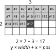
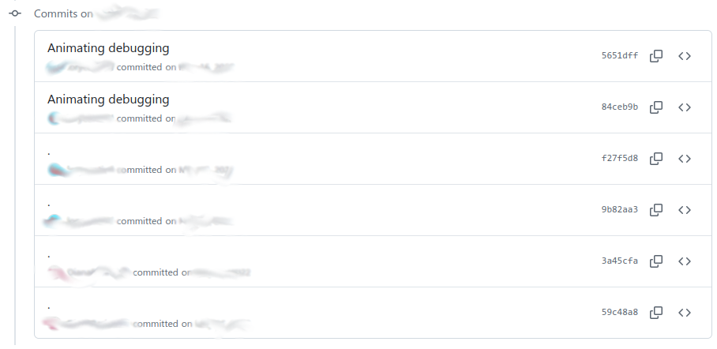
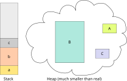
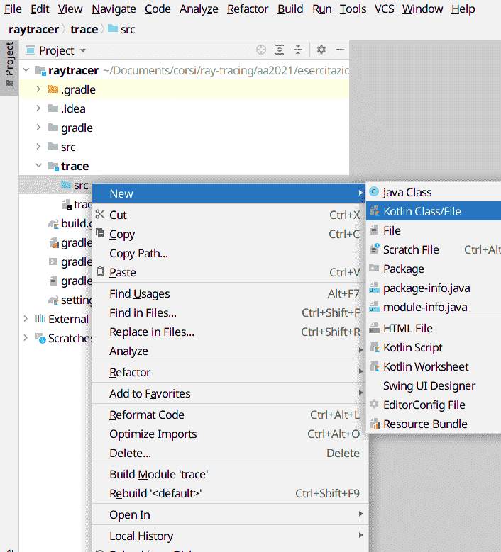
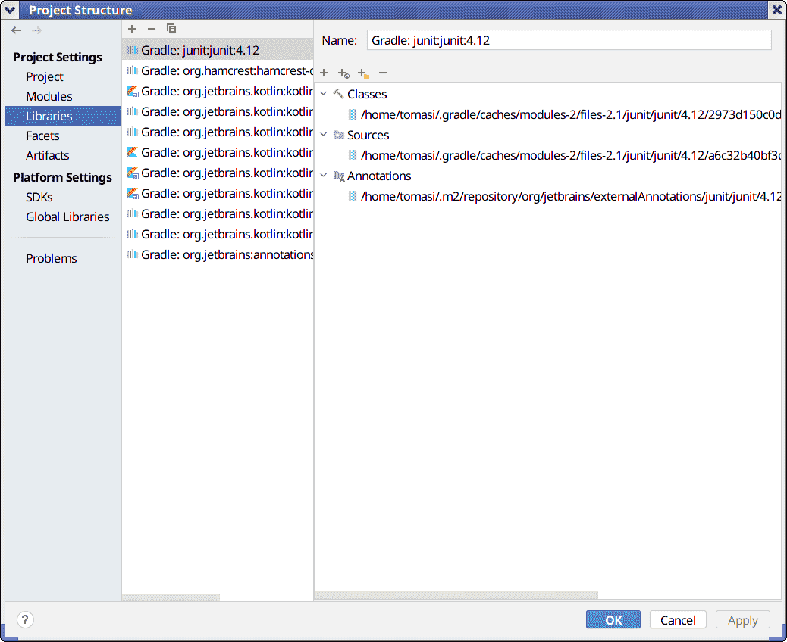
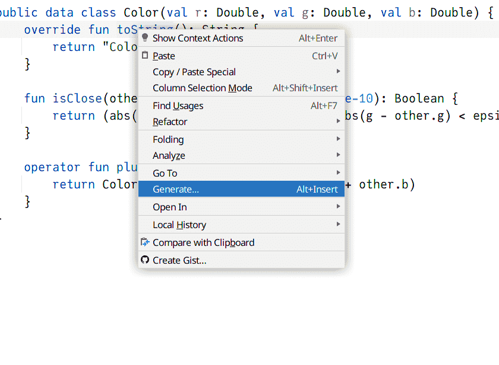
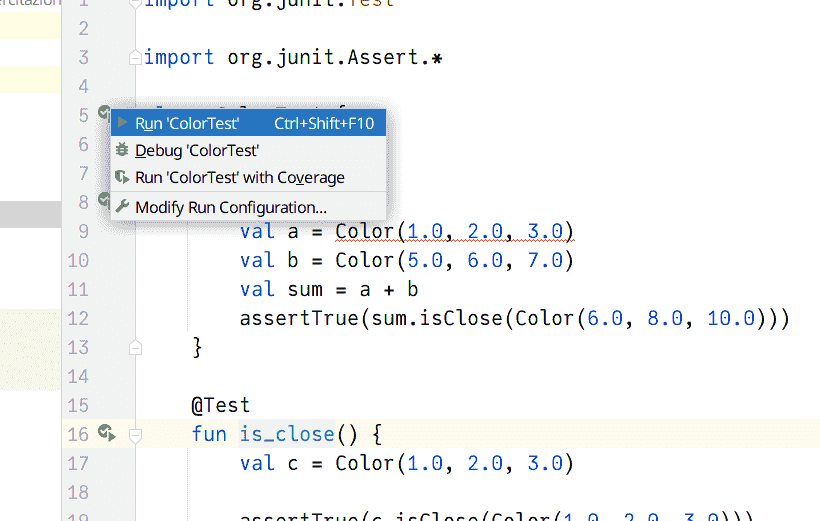

# Premessa iniziale

-   Ci vorrà un bel po' prima di essere in grado di produrre immagini fotorealistiche! (Non volevate mica finire il corso in quindici giorni, no?!?)

-   La ragione è che ci serve molta “infrastruttura” prima di poter affrontare direttamente la soluzione dell'equazione del rendering

-   La generazione della prima immagine sarà un “[triangolo nero](https://rampantgames.com/blog/?p=7745)”, come si dice nel gergo informatico.

# Gestione dei colori

# Codificare un colore

-   Abbiamo visto che i colori percepiti dall'occhio umano possono essere codificati tramite tre valori scalari R, G, B.
-   Il compito di oggi è implementare un tipo di dato `Color` che codifichi un colore usando tre numeri *floating-point* (a 32 bit) per i livelli di rosso, verde e blu.
-   La conversione da RGB a sRGB sarà oggetto dell'esercitazione di settimana prossima, quando introdurremmo i formati grafici (PNG, Jpeg, etc.)
-   Come per la scorsa lezione, anche oggi mostrerò esempi di codice in Python

# Colori in Python

-   Definiamo una classe `Color` usando `@dataclass` (come `struct` in C++):

    ```python
    # Supported since Python 3.7
    from dataclasses import dataclass

    @dataclass
    class Color:
        r: float = 0.0
        g: float = 0.0
        b: float = 0.0
    ```

-   È possibile creare un colore con questa sintassi:

    ```python
    color1 = Color(r=3.4, g=0.4, b=1.7)
    color2 = Color(3.4, 0.4, 1.7)  # Shorter version
    ```

# Operazioni su `Color`

-   Somma tra due colori (analogo di $L_\lambda^{(1)} + L_\lambda^{(2)}$)
-   Prodotto per uno scalare ($\alpha L_\lambda$)
-   Prodotto tra due colori ($f_{r,\lambda} \otimes L_\lambda$ nell'equazione del rendering)
-   Livello di somiglianza tra due colori (da usare nei test)

# Esempio in Python

```python
class Color:
    # ...

    def __add__(self, other):
        """Sum two colors"""
        return Color(
            self.r + other.r,
            self.g + other.g,
            self.b + other.b,
        )

    def __mul__(self, other):
        """Multiply two colors, or one color with one number"""
        try:
            # Try a color-times-color operation
            return Color(
                self.r * other.r,
                self.g * other.g,
                self.b * other.b,
            )
        except AttributeError:
            # Fall back to a color-times-scalar operation
            return Color(
                self.r * other,
                self.g * other,
                self.b * other,
            )

    # Etc.
```

# Il tipo `HdrImage`

-   Oltre al tipo `Color`, oggi implementeremo un tipo `HdrImage`, che useremo per rappresentare una immagine HDR tramite una matrice di elementi `Color`.
-   Per oggi, il tipo `HdrImage` dovrà implementare solo queste funzionalità:
    -   Creazione di un'immagine vuota, specificando il numero di colonne (`width`) e il numero di righe (`height`);
    -   Lettura/modifica di pixel.

# Matrice dei colori

-   Il tipo più naturale per una matrice di colori è un array bidimensionale di dimensione `(ncols, nrows)`…

-   …ma è più efficiente usare un array **monodimensionale** di dimensione `ncols × nrows`. (Se usate Julia non avete questo problema: basta usare una `Matrix`!)

-   Gli array bidimensionali non sono supportati in tutti i linguaggi (Kotlin ad esempio non li supporta), e se usati male possono essere molto inefficienti:

    ```java
    // This is valid Java, but it's sub-optimal!
    int[][] myNumbers = { {1, 2, 3, 4}, {5, 6, 7} };
    ```

# Struttura di `HdrImage`

-   In Python possiamo implementare `HdrImage` così:

    ```python
    class HdrImage:
        def __init__(self, width=0, height=0):
            # Initialize the fields `width` and `height`
            (self.width, self.height) = (width, height)
            # Create an empty image (Color() returns black, remember?)
            self.pixels = [Color() for i in range(self.width * self.height)]
    ```

-   L'array di valori ha un numero di elementi pari a $\mathtt{width} \times \mathtt{height}$

-   A noi però interessa identificare un elemento della matrice tramite una coppia `(colonna, riga)`, ossia `(x, y)`.

# Accesso ai pixel

Data la posizione `(x, y)` di un pixel (con `x` colonna e `y` riga), l'indice nell'array `self.pixels` si trova così:

<center>

</center>

# `get_pixel` e `set_pixel`

```python
def get_pixel(self, x: int, y: int) -> Color:
    """Return the `Color` value for a pixel in the image

    The pixel at the top-left corner has coordinates (0, 0)."""

    assert (x >= 0) and (x < self.width)
    assert (y >= 0) and (y < self.height)
    return self.pixels[y * self.width + x]

def set_pixel(self, x: int, y: int, new_color: Color):
    """Set the new color for a pixel in the image

    The pixel at the top-left corner has coordinates (0, 0)."""

    assert (x >= 0) and (x < self.width)
    assert (y >= 0) and (y < self.height)
    self.pixels[y * self.width + x] = new_color
```

Possiamo evitare queste ripetizioni?

# Verifica del codice

# Perché verificare il codice?

-   Gli errori sono dietro l'angolo!

-   Esempio (in un tema d'esame del corso di TNDS!):

    ```c++
    CampoVettoriale operator+(const CampoVettoriale &v) const {
      CampoVettoriale sum(v); // invoco costruttore di copia di v
      sum.Addcomponent(getFx(), getFx(), getFz());

      return sum;
    }
    ```

-   Per verificare la correttezza di una funzione, occorrerebbe invocarla con dati *non banali* e controllarne il risultato.

# Come verificare il codice?

-   Una volta scritto, il codice va *verificato* su casi il cui risultato è già noto

-   Il modo più semplice è testare il codice stampando a video i valori:

    ```python
    color1 = Color(1.0, 2.0, 3.0)  # Avoid trivial cases like Color(3.0, 3.0, 3.0)
    color2 = Color(5.0, 6.0, 7.0)  # in your tests!
    print(color1 + color2)
    print(color1 * 2)
    ```

    che produce l'output

    ```text
    Color(r=6.0, g=8.0, b=10.0)
    Color(r=2.0, g=4.0, b=6.0)
    ```

-   Possiamo fare di meglio?

# Scrittura di test automatici

-   Il compito di verificare la correttezza dei calcoli è noioso e facile da sbagliare.

-   Dovremmo far svolgere compiti tediosi ai computer!

-   Tutti i linguaggi moderni offrono sistemi per l'esecuzione automatica di test. (Il C++ no, a meno di usare librerie esterne: ecco perché queste cose non sono state spiegate nel corso di TNDS)

# Test automatici

In Python, il nostro codice di partenza è questo:

```python
color1 = Color(1.0, 2.0, 3.0)
color2 = Color(5.0, 6.0, 7.0)
print(color1 + color2)
print(color1 * 2)
```

Possiamo migliorarlo facilmente usando `assert`:

```python
color1 = Color(1.0, 2.0, 3.0)
color2 = Color(5.0, 6.0, 7.0)
assert (color1 + color2) == Color(6.0, 8.0, 10.0)
assert (2 * color1) == Color(2.0, 4.0, 6.0)
# If everything is ok, no output is expected
```


# Come testare i test?

-   Il fatto che il nostro programma non produca output è atteso (non ha bug), ma non tranquillizzante: siamo *sicuri* che abbia davvero eseguito il test?

-   Una pratica molto diffusa è quella di iniziare scrivendo test *sbagliati*, e verificando che si generi effettivamente un errore:

    ```python
    color1 = Color(1.0, 2.0, 3.0)
    color2 = Color(5.0, 6.0, 7.0)
    assert (color1 + color2) == Color(6.0, 8.0, 11.0) # 11.0 instead of 10.0: wrong!
    assert (2 * color1) == Color(3.0, 4.0, 6.0) # 3.0 instead of 2.0: wrong!
    ```

    Solo quando si è visto che l'errore è stato emesso si rimette a posto il test.

---

<asciinema-player src="cast/color-test-python.cast" rows="27" cols="94" font-size="medium"></asciinema-player>

# Verifiche su floating point

-   Nei test che scriveremo dovremo usare operazioni logiche e di confronto (in Python: `==`, `<`, `>`, `<=`, `>=`, etc.)

-   Occorre prestare molta attenzione ai numeri floating point!

    <asciinema-player src="cast/floating-point-python.cast" rows="15" cols="80"
        font-size="medium"></asciinema-player>

# Accorgimenti per floating point

-   Evitate dei test che coinvolgano numeri con parti decimali (es., `2.1`, `5.09`)
-   Numeri interi piccoli (es., `16.0`) sono codificati senza arrotondamenti…
-   …quindi nei test, se possibile, usate numeri floating point interi (come abbiamo fatto per la classe `Color` in Python)
-   Per i casi in cui non è possibile, definite una funzione `are_close`:

    ```python
    def are_close(x, y, epsilon = 1e-5):
        return abs(x - y) < epsilon

    x = sum([0.1] * 10)       # Sum of the values in [0.1, 0.1, ..., 0.1]
    print(x)                  # Output: 0.9999999999999999
    assert are_close(1.0, x)  # This test passes successfully
    ```


# Test e granularità

-   L'implementazione di funzioni e tipi dovrebbe essere legata alla scrittura di test.

-   Implementare test per le due funzioni `get_pixel` e `set_pixel` è ripetitivo:

    ```python
    def get_pixel(self, x: int, y: int) -> Color:
        assert (x >= 0) and (x < self.width)
        assert (y >= 0) and (y < self.height)
        return self.pixels[y * self.width + x]

    def set_pixel(self, x: int, y: int, new_color: Color):
        assert (x >= 0) and (x < self.width)
        assert (y >= 0) and (y < self.height)
        self.pixels[y * self.width + x] = new_color
    ```

    La verifica delle coordinate va testata due volte: in `get_pixel` e in `set_pixel`.

---

# Test ripetuti

-   Dobbiamo verificare che coordinate sbagliate vengano rigettate sia in `set_pixel` che in `get_pixel`:

    ```python
    img = HdrImage(7, 4)

    # Test that wrong positions be signaled
    with pytest.raises(AssertionError):
        img.get_pixel(-1, 0)

    # We must redo the same for "set_pixel"
    with pytest.raises(AssertionError):
        img.set_pixel(-1, 0, Color())
    ```

-   Possiamo fare di meglio *modularizzando* il codice, ossia decomponendolo in parti più semplici (che è un vantaggio già di per sè).

# Nuova implementazione

```python
def valid_coordinates(self, x: int, y: int) -> bool:
    return ((x >= 0) and (x < self.width) and
            (y >= 0) and (y < self.height))

def pixel_offset(self, x: int, y: int) -> int:
    return y * self.width + x

def get_pixel(self, x: int, y: int) -> Color:
    assert self.valid_coordinates(x, y)
    return self.pixels[self.pixel_offset(x, y)]

def set_pixel(self, x: int, y: int, new_color: Color):
    assert self.valid_coordinates(x, y)
    self.pixels[self.pixel_offset(x, y)] = new_color
```

# Test

-   Questi sono i test scritti per la nuova implementazione:

    ```python
    img = HdrImage(7, 4)

    # Check that valid/invalid coordinates are properly flagged
    assert img.valid_coordinates(0, 0)
    assert img.valid_coordinates(6, 3)
    assert not img.valid_coordinates(-1, 0)
    assert not img.valid_coordinates(0, -1)
    assert not img.valid_coordinates(7, 0)
    assert not img.valid_coordinates(0, 4)

    # Check that indices in the array are calculated correctly:
    # this kind of test would have been harder to write
    # in the old implementation
    assert img.pixel_offset(3, 2) == 17    # See the plot a few slides before
    assert img.pixel_offset(6, 3) == 7 * 4 - 1
    ```

-   Questi sono detti *unit test*, perché vanno a verificare le singole «unità» di codice.


# Metodi pubblici e privati

-   La programmazione OOP propugna l'idea di definire certi metodi come “privati”, in modo che non siano invocabili dall'esterno.

-   Questo però risulta molto scomodo nei test! Si vorrebbe infatti scrivere un test anche per `valid_coordinates` e per `pixel_offset`, ma la filosofia OOP imporrebbe di definirli privati e quindi non richiamabili dall'esterno.

-   Se usate un linguaggio OOP, potete definire queste funzioni *pubbliche* ma chiamarle `_valid_coordinates` e `_pixel_offset`: di solito quando in informatica un nome inizia con `_` lo si considera “privato”, ma non si è obbligati a trattarlo come tale.


# Funzioni di supporto ai test

-   Nel nostro codice Python, per verificare la corrispondenza tra due colori abbiamo usato `==`, che funziona perché abbiamo specificato numeri interi:

    ```c++
    assert (color1 + color2) == Color(6.0, 8.0, 10.0)
    assert (2 * color1) == Color(2.0, 4.0, 6.0)
    ```

-   Però $\pi$ compare spesso nei calcoli radiometrici!

-   Definite una funzione che confronti due `Color` come i floating-point:

    ```python
    def are_colors_close(a, b):
        return are_close(a.r, b.r) and are_close(a.g, b.g) and are_close(a.b, b.b)

    assert are_colors_close(color1, color2)
    ```

# Importanza dei test

-   La scrittura di buoni test è una delle abilità che questo insegnamento vuole sviluppare.

-   È quindi **fondamentale** che i vostri repository mostrino una regolare implementazione dei test, lezione per lezione.

-   La regolarità nell'implementazione dei test e la loro qualità è uno dei criteri con cui verrete valutati all'esame.


# Lavoro in gruppo

-   Da oggi lavorerete in gruppo: ciascuno di voi dovrà scegliere quale parte di codice implementare.

-   Inizieremo ad usare le caratteristiche più avanzate di Git per gestire i **conflitti**, ossia le situazioni in cui una parte di codice viene modificata contemporaneamente da più persone.

-   Vediamo un esempio pratico di conflitto per un semplice codice Python.

---

<asciinema-player src="cast/git-conflicts-96x27.cast" cols="96" rows="27"  font-size="medium"></asciinema-player>

# *Merge commit*

<center>

</center>

# Tipi di conflitti

1.  Due sviluppatori stanno implementando la stessa funzionalità:
    -   Si sceglie una delle due implementazioni
    -   Si fondono insieme
2.  Due sviluppatori implementano funzionalità separate nello stesso punto del codice:
    -   Se possono coesistere, si mantengono insieme (è il caso del video precedente)
    -   Se non possono, si separano in due file diversi
3.  Due sviluppatori implementano due funzionalità incompatibili:
    -   Decidono quale delle due funzionalità vada mantenuta e quale no…
    -   …oppure uno dei due si licenzia!


# Guida per l'esercitazione

# Guida per l'esercitazione

1.  Scegliete un nome per il vostro progetto (qui useremo `myraytracer`).

2.  Strutturare il progetto nel modo seguente:

    -   Una libreria che implementi `Color` e `HdrImage`, più le operazioni su di essi;
    -   Un programma da linea di comando che importi la libreria, ma che per il momento stampi solo `Hello, world!`;
    -   Una serie di test automatici sui tipi `Color` e `HdrImage`.

3.  Registrare il progetto su GitHub, aggiungere i propri compagni e mandare una mail al docente.

5.  Non abbiate paura di creare conflitti e fare *merge commit*: più vi esercitate con essi, più semplice vi sarà la vita in futuro.


# Lavoro in gruppo

-   In ogni gruppo, solo **uno** di voi dovrebbe creare lo scheletro del progetto, creare la pagina GitHub e salvarlo.

-   Gli altri membri diventeranno collaboratori del progetto (v. slide seguente).

-   Pensate a un modo per suddividere il lavoro tra membri del vostro gruppo; ad esempio, per `Color`:

    1.  Somma di due colori;
    2.  Prodotto tra due colori, e prodotto colore-scalare;
    3.  Funzione `are_colors_close`;
    4.  Test.

---

<center>

</center>

# Lavoro in gruppo

-   Per lavorare in gruppo sul repository GitHub, ciascuno di voi dovrà eseguire `git push` per inviare le proprie modifiche («commit») al server GitHub
-   A quel punto i compagni potranno scaricare le modifiche usando `git pull`.

-   Un modo per dividersi il lavoro è che uno di voi implementi un metodo (ad esempio `valid_coordinates`) e l'altro scriva **contemporaneamente** il test:

    - `valid_coordinates` + test;
    - `pixel_offset` + test;
    - `get_pixel`/`set_pixel` + test.

# Attenzione ai commit!

-   Il proprio profilo GitHub/LinkedIn può essere esaminato durante i colloqui di lavoro

-   Se curate bene il repository su cui lavorerete per questo insegnamento, potrebbe essere uno “show-case” da mettere in evidenza nel vostro CV

-   Evitate quindi di scrivere commenti approssimativi nei vostri commit!

---



# Caratteristiche di `Color`

-   Tre campi `r`, `g`, `b` di tipo floating-point a **32 bit**: non servono 64 bit, e anzi ci farebbero sprecare memoria e tempo
-   Se usate linguaggi OOP, non perdete tempo a definire `GetR`/`SetR` e simili: sono lunghe da scrivere, facili da sbagliare, rendono il codice difficile da leggere e più lento da compilare
-   Metodo `Color.is_close` o funzione `are_close`/`are_colors_close` per verificare se due colori sono simili (utile nei test);
-   Somma tra colori;
-   Prodotti colore-colore e colore-scalare
-   Se è il caso, implementate anche una funzione che converta un numero in una stringa (es., `<r:1.0, g:3.0, b:4.0>`): sarà comodo per fare debug

# Uso della memoria

-   Nella maggior parte dei linguaggi c'è differenza tra *value* e *reference types*.

-   I *value types* sono valori a cui si può accedere direttamente, e sono sempre allocati sullo *stack*: sono molto veloci da usare, ma non possono occupare troppa memoria (alcuni kB al massimo).

-   I *reference types* sono dei puntatori al dato attuale, e possono essere sia sullo *stack* che nello *heap*; in quest'ultimo caso possono occupare tutta la memoria che vogliono, ma sono più lenti da leggere e scrivere.

-   Fanno eccezione i linguaggi basati su JVM (Java, Kotlin, Scala, etc.), per cui esistono solo *reference types* (ma la JVM può autonomamente convertire variabili in *value types* se capisce che è conveniente).

---

<center>

</center>

---

# Esempio in C++

```c++
#include <iostream>
#include <vector>

int main() {
    int a{};                     // Allocated on the stack
    int * b{new int};            // Allocated in the heap
    int c[] = {1, 2, 3};         // Allocated on the stack
    std::vector<int> v{1, 2, 3}; // "v" on the stack, but the three numbers in the heap

    a = 15;   // This is fast
    *b = 16;  // This is slower

    std::cout << a << ", " << *b << "\n";
    // Output:
    // 15, 16
}
```

In Python, qualsiasi variabile (anche le variabili intere come `x = 1`) è allocata nello heap (uno dei motivi per cui è molto più lento del C++)

# Dimensione dello stack

-   Per programmi C/C++/Fortran/Julia, la dimensione è fissata dal sistema operativo. Sotto sistemi Posix (Linux/Mac OS X), potete conoscerne il valore in KB col comando `ulimit -s`:

    ```text
    $ ulimit -s
    8192
    ```

    Il valore di 8 MB è caratteristico di Linux; per i Mac è 0,5 MB.

-   La piattaforma .NET (Visual Basic, C\#) usa uno stack di 1 MB.

-   La piattaforma JVM (Java, Kotlin) usa uno stack di 1 MB, che è però usato solo per i tipi primitivi (interi, booleani, numeri floating-point).

# Value types

-   La classe `Color` è molto piccola: richiede memoria per 3 numeri floating-point, ed è quindi logico definirla come un *value type* (questo non è vero per `HdrImage`)

-   A seconda del linguaggio, l'uso di un *value type* richiede accorgimenti diversi:

    -   In C++, si usa `struct` oppure `class` (è uguale), ma quando la userete nei codici/test evitate `new`/`delete`;
    -   In C\# e in D, si usa `struct` (value type), ma non `class` (reference type);
    -   In Pascal, si usa `object` o `record`, ma non si usa `class`;
    -   In Nim, si usa `object`, ma non si usa `ref object`;
    -   In Julia, si usa il package [`StaticArrays`](https://juliaarrays.github.io/StaticArrays.jl/stable/).

# Test (1)

-   Creazione di colori e funzione `is_close`:

    ```python
    col = Color(1.0, 2.0, 3.0)
    assert col.is_close(Color(1.0, 2.0, 3.0))
    ```

-   Verificate anche che `is_close` fallisca (ossia ritorni `False`) quando è necessario:

    ```python
    assert not col.is_close(Color(3.0, 4.0, 5.0))  # First method
    ```

    Questo tipo di test «negativi» è molto importante!

# Test (2)

-   Somma/prodotto di colori:

    ```python
    col1 = Color(1.0, 2.0, 3.0)  # Do not use the previous definition,
    col2 = Color(5.0, 7.0, 9.0)  # it's better to define it again here

    assert (col1 + col2).is_close(Color(6.0, 9.0, 12.0))
    assert (col1 * col2).is_close(Color(5.0, 14.0, 27.0))
    ```

-   Prodotto colore-scalare (implementate anche scalare-colore,
    se volete):

    ```python
    prod_col = Color(1.0, 2.0, 3.0) * 2.0

    assert prod_col.is_close(Color(2.0, 4.0, 6.0))
    ```

# Test (3)

```python
def test_image_creation():
    img = HdrImage(7, 4)
    assert img.width == 7
    assert img.height == 4

def test_coordinates():
    img = HdrImage(7, 4)

    assert img.valid_coordinates(0, 0)
    assert img.valid_coordinates(6, 3)
    assert not img.valid_coordinates(-1, 0)
    assert not img.valid_coordinates(0, -1)
    assert not img.valid_coordinates(7, 0)
    assert not img.valid_coordinates(0, 4)

def test_pixel_offset():
    img = HdrImage(7, 4)

    assert img.pixel_offset(0, 0) == 0
    assert img.pixel_offset(3, 2) == 17
    assert img.pixel_offset(6, 3) == 7 * 4 - 1

def test_get_set_pixel():
    img = HdrImage(7, 4)

    reference_color = Color(1.0, 2.0, 3.0)
    img.set_pixel(3, 2, reference_color)
    assert are_colors_close(reference_color, img.get_pixel(3, 2))
```

# Indicazioni per C++

# Uso di CMake

-   [CMake](https://cmake.org/) permette non solo di generare automaticamente un `Makefile`, ma anche di eseguire test automatici.

-   Create il seguente albero di directory:

    ```text
    $ tree raytracer
    raytracer
    ├── CMakeLists.txt
    ├── include
    │   └── colors.h       <-- Definition of "Color"
    ├── src
    │   ├── colors.cpp     <-- Implementation of "Color" (if you *really* need it!)
    │   └── raytracer.cpp
    └── test
        └── colors.cpp     <-- Tests for the class "Color"
    ```

-   Se implementate tutti i metodi di `Color` in `include/colors.h` (consigliato, il codice è più veloce così), non c'è bisogno di `src/colors.cpp`.

# Struttura di `CMakeLists.txt`

-   CMake dovrà creare tre prodotti:

    1.  Una libreria che implementi `Color`; sceglietele un nome (noi useremo `trace`).
    2.  Un programma eseguibile che usi la libreria, che chiameremo `raytracer`. Al momento basta che stampi `Hello, world!`.
    3.  Un programma che esegua i test, che chiameremo `colorTest`.

-   Per creare programmi sappiamo che c'è il comando `add_executable`; per le librerie esiste l'analogo `add_library`.

-   Le dipendenze tra libreria `trace` e programmi si specificano con `target_link_libraries`.

# Librerie ed eseguibili

-   La sequenza di librerie e di eseguibili da produrre si specifica così:

    ```cmake
    add_library(trace
      src/colors.cpp
      )
    # This is needed if we keep .h files in the "include" directory
    target_include_directories(trace PUBLIC
      $<BUILD_INTERFACE:${CMAKE_CURRENT_SOURCE_DIR}/include>
      $<INSTALL_INTERFACE:include>
      )

    add_executable(raytracer
      src/raytracer.cpp
      )
    target_link_libraries(raytracer PUBLIC trace)

    add_executable(colorTest
      test/colors.cpp
      )
    target_link_libraries(colorTest PUBLIC trace)
    ```

-   `target_include_directories` specifica dove cercare `colors.h`.

# Eseguire test

-   Per eseguire test automatici, occorre invocare due comandi in `CMakeLists.txt`:

    1.  `enable_testing` abilita la possibilità di eseguire test, e va scritto subito dopo il comando `project`.

    2.  `add_test` specifica quale dei file eseguibili da produrre esegue effettivamente test. (Si può usare più volte).

-   Nel nostro caso, invocheremo `add_test` una sola volta per eseguire `colorTest`.

-   Per eseguire i test, nella directory `build` basta invocare `ctest`.

# `CMakeLists.txt`

Questo è il contenuto completo di `CMakeLists.txt`:
```cmake
cmake_minimum_required(VERSION 3.12)

# Define a "project", providing a description and a programming language
project(raytracer
  VERSION 1.0
  DESCRIPTION "Hello world in C++"
  LANGUAGES CXX
  )

# Force the compiler to use the C++23 standard (or whatever you want)
set(CMAKE_CXX_STANDARD 23)

# If the compiler does not support the standard, stop!
set(CMAKE_CXX_STANDARD_REQUIRED ON)

# Turn on the support for automatic tests
enable_testing()

# This is the library. Pick the name you like the most; we use "trace"
add_library(trace
  src/colors.cpp
  )
# Help the compiler when you write "#include <colors.h>"
# See "cmake-generator-expressions(7)" in the CMake manual
target_include_directories(trace PUBLIC
  $<BUILD_INTERFACE:${CMAKE_CURRENT_SOURCE_DIR}/include>
  $<INSTALL_INTERFACE:include>
  )

# This is the program that we will run from the command line
add_executable(raytracer
  src/raytracer.cpp
  )
# The command-line program needs to be linked to the "trace" library
target_link_libraries(raytracer PUBLIC trace)

# This program runs the automatic tests on the "Color" class
add_executable(colorTest
  test/colors.cpp
  )
# The test program too needs to be linked to "trace"
target_link_libraries(colorTest PUBLIC trace)

# Here we specify that "colorTest" is a special executable, because
# it is meant to be run automatically whenever we want to check our code
add_test(NAME colorTest
  COMMAND colorTest
  )
```

---

<asciinema-player src="cast/c++-tests.cast" cols="72" rows="22" font-size="medium"></asciinema-player>

# Funzionamento dei test

-   Occorre restituire l'esito del test come valore al sistema operativo.

-   La possibilità più elementare è di usare un `return` appropriato nel `main`:

    ```c++
    #include "colors.h"
    #include <cstdlib>

    int main() {
        Color c1{1.0, 2.0, 3.0};
        Color c2{5.0, 7.0, 9.0};

        return are_colors_close(Color{6.0, 9.0, 11.0}, c1 + c2)
            ? EXIT_SUCCESS : EXIT_FAILURE;
    }
    ```

-   Si può usare [`abort`](https://www.cplusplus.com/reference/cstdlib/abort/?kw=abort) (in caso di fallimento) o [`assert`](https://www.cplusplus.com/reference/cassert/assert/?kw=assert) (occhio a `NDEBUG`!).

# Esecuzione dei test

-   Provate a modificare uno dei test sul tipo `Color`, in modo che fallisca:

    -   Cambiate il file `test/colors.cpp`
    -   Andate nella directory `build` ed eseguite `ctest`
    -   Fate il commit delle modifiche
    -   Inviate le modifiche a GitHub col comando `git push`

 -  Sarebbe bene che ciascun membro del gruppo provasse a fare questo.

# Suggerimenti

-   Se il build **non** fallisce, è probabilmente perché viene usato come tipo di build il `Release` anziché il `Debug`, e avete usato `assert` nel vostro codice.
-   Soluzioni:
    -   Cambiate il file `.yml` in modo da usare `Debug` anziché `Release`;
    -   Usate `#undef NDEBUG` prima di `#include <cassert>` (meglio!);
    -   Definite una vostra funzione `my_assert` (ancora meglio!);
    -   Usate una libreria di testing C++, come [Catch2](https://github.com/catchorg/Catch2/tree/v2.x) (ottimo!).
-   Insegnamento: provare **sempre** a far fallire uno o più test!

# Indicazioni per Julia

# Struttura del package

-   Julia implementa in modo nativo il tipo di struttura richiesta (libreria, eseguibile, eseguibile con i test):

    -   Ogni package può essere usato come una libreria;
    -   I package possono includere una serie di test se al loro interno è presente una directory chiamata `test`;
    -   Lo script che implementa il `main` [visto nella precedente esercitazione](./tomasi-ray-tracing-01b.html#/julia-main) può essere usato come eseguibile.

-   La creazione di un nuovo package configura quindi tutto già nel modo richiesto, tranne l'eseguibile.

# Creazione del package

-   Create un nuovo package con i comandi visti la volta scorsa:

    ```julia
    using Pkg
    Pkg.generate("Raytracer")  # Upper case is customary in Julia
    Pkg.activate("Raytracer")
    ```

-   Julia supporta la gestione dei colori tramite [ColorTypes](https://github.com/JuliaGraphics/ColorTypes.jl) e [Colors](https://juliagraphics.github.io/Colors.jl/stable/):

    ```julia
    Pkg.add("ColorTypes")
    Pkg.add("Colors")
    ```

    Questo modificherà `Project.toml` e aggiungerà `Manifest.toml`, che vanno salvati in Git (guardate cosa contengono!).

# Operazioni sui colori

-   Per oggi non c'è bisogno di comprendere la differenza tra *value* e *reference types*, perché userete Colors e ColorTypes.

-   La libreria Colors implementa una serie di tipi template:

    ```julia
    using Colors

    a = RGB(0.1, 0.3, 0.7)
    b = XYZ(0.8, 0.4, 0.2)
    println(convert(XYZ, a))  # Convert a from RGB to XYZ space
    ```

-   La libreria non implementa però le operazioni sui colori che ci interessano (somma, differenza, prodotto, confronto). Implementatele voi nel file `src/Raytracer.jl` (il nome del file dipende dal nome del vostro progetto).

# Complicazioni

-   I tipi in ColorTypes sono [*parametrici*](https://docs.julialang.org/en/v1/manual/types/#Parametric-Types) (come i template in C++): il tipo `RGB` è in realtà `RGB{T}`, con `T` parametro.

-   Dovete ridefinire le operazioni fondamentali `+`, `-`, `*` e `≈` (`\approx`), che in Julia sono presenti nel package `Base`.

    Dovrete scrivere qualcosa del genere in `src/Raytracer.jl`:

    ```julia
    import ColorTypes
    import Base.:+, Base.:*, Base.:≈

    # To make this work, first define the product "scalar * color"
    Base.:*(c::ColorTypes.RGB{T}, scalar) where {T} = scalar * c
    ```

# Creazione di test

-   Per implementare i test, create un file `test/runtests.jl`, in modo che la struttura delle directory sia la seguente:

    ```sh
    $ tree Raytracer
    Raytracer
    ├── Manifest.toml
    ├── Project.toml
    ├── src
    │   └── Raytracer.jl
    └── test
        └── runtests.jl
    ```

-   Per scrivere test, dovete aggiungere la libreria [Test]():

    ```julia
    Pkg.add("Test")
    ```

# Come scrivere test

-   Nel file `runtests.jl` dovete scrivere le procedure di test. La libreria Test implementa le macro `@testset` (raggruppa test) e `@test`:

    ```julia
    using Raytracer   # Mettete il nome che avete scelto
    using Test

    @testset "Colors" begin
        # Put here the tests required for color sum and product
        @test 1 + 1 == 2
    end
    ```

-   Per eseguirli dalla REPL, scrivete

    ```julia
    Pkg.test()
    ```

# Esecuzione di test

<asciinema-player src="cast/julia-tests.cast" cols="72" rows="22" font-size="medium"></asciinema-player>

# Il file `Manifest.toml`

-   Julia usa il file `Project.toml` per indicare informazioni generali sul package, e può essere editato
-   Il file `Manifest.toml` viene generato automaticamente, e fissa (in inglese, “pin”) il numero di versione delle dipendenze usate dal vostro package.
-   È indispensabile aggiungere a Git il file `Project.toml`.
-   Per `Manifest.toml` ci sono due possibilità:
    1.  Se ritenete che sia **indispensabile** che ogni utente usi esattamente le stesse vostre versioni delle dipendenze, aggiungetelo;
    2.  Se volete garantire più versatilità, escludetelo da Git (aggiungendo quindi una riga a `.gitignore`).

# Suggerimenti per C\#

# Soluzioni e progetti

```{.graphviz im_fmt="svg" im_out="img" im_fname="project-structure-csharp"}
graph "" {
    lib [label="library (project)" shape=ellipse];
    exec [label="executable (project)" shape=box];
    test [label="tests (project)" shape=box];
    lib -- exec;
    lib -- test;
}
```

-   Il comando `dotnet` supporta la creazione di *soluzioni* e *progetti*.

-   Per *progetto* si intende qualsiasi cosa che possa essere prodotta a partire da file contenenti codice C\# (eseguibile, libreria…)

-   Una *soluzione* è un insieme di progetti. Nel grafico sopra, ogni elemento del grafico è un *progetto*, e il grafico nel suo complesso è una *soluzione*.

# Creare soluzioni/progetti

-   Per creare una soluzione, basta scrivere `dotnet new sln`
-   I progetti in `dotnet` si dividono in più tipi:
    -   Eseguibili (`dotnet new console`)
    -   Librerie (`dotnet new classlib`)
    -   Test automatici (`dotnet new xunit`)
-   Per specificare che il progetto `A` dipende da `B`, si usa `dotnet add A reference B`
-   Per aggiungere progetti a una soluzione, si usa `dotnet sln add`

# La nostra soluzione

Questi sono i comandi da terminale per produrre la soluzione che vogliamo:

```sh
# Create a new solution that will include:
# 1. The library
# 2. The executable (currently printing «Hello, world!»)
# 3. The tests
dotnet new sln -o "Myraytracer"

cd Myraytracer

# 1. Create the library, named "Trace", and add it to the solution
dotnet new classlib -o "Trace"
dotnet sln add Trace/Trace.csproj

# 2. Create the executable, named "Myraytracer", and add it to the solution
dotnet new console -o "Myraytracer"
dotnet sln add Myraytracer/Myraytracer.csproj

# 3. Create the tests, named "Trace.Tests", and add them to the solution
dotnet new xunit -o "Trace.Tests"
dotnet sln add Trace.Tests/Trace.Tests.csproj

# Both the executable and the tests depend on the «Trace» library
dotnet add Myraytracer/Myraytracer.csproj reference Trace/Trace.csproj
dotnet add Trace.Tests/Trace.Tests.csproj reference Trace/Trace.csproj

# Create a .gitignore file
dotnet new gitignore
```

Fate tutto da linea di comando e poi aprite il progetto in Rider: è più istruttivo!

# Albero delle directory

-   La soluzione così com'è creata ha nomi generici per i file, ed è meglio cambiarli in qualcosa di più facile da riconoscere;
-   Rinominate i file in modo da avere una struttura con questa forma:

    ```text
    Myraytracer
    ├── Myraytracer.sln
    ├── Myraytracer
    │   ├── Myraytracer.cs      <-- This was Program.cs
    │   └── Myraytracer.csproj
    ├── Trace
    │   ├── Color.cs            <-- This was Class1.cs
    │   ├── HdrImage.cs         <-- New file
    │   └── Trace.csproj
    └── Trace.Tests
        ├── ColorTests.cs       <-- This was UnitTest1.cs
        ├── HdrImageTests.cs    <-- New file
        └── Trace.Tests.csproj
    ```

# Scrittura di test

```csharp
// This should be put in Trace.Tests/ColorTests.cs
using System;
using Xunit;
using Trace;

namespace Trace.Tests
{
    public class ColorTests
    {
        [Fact]
        public void TestAdd()
        {
            Color a = new Color(1.0f, 2.0f, 3.0f);
            Color b = new Color(5.0f, 6.0f, 7.0f);
            // C# convention: *first* the expected value, *then* the test value
            Assert.True(Color.are_close(new Color(6.0f, 8.0f, 10.0f), a + b));
            // ...
        }
    }
}
```

Potete eseguire i test col comando `dotnet test`, oppure in Rider (comodissimo, fate riferimento alle slide relative a Kotlin)


# Suggerimenti per D

# Definizione dei tipi

-   Definite `Color` come una `struct` e `HdrImage` come una `class`; per `Color` prevedete dei default:

    ```d
    struct Color {
      float r = 0, g = 0, b = 0;
    };
    ```

-   Definite il campo `pixels` del tipo `HdrImage` come un [array dinamico](https://dlang.org/spec/arrays.html#dynamic-arrays)

-   Definite un costruttore per `HdrImage` che accetti `width` ed `height`, ed inizializzi `pixels` [allocando la lunghezza appropriata](https://dlang.org/spec/arrays.html#length-initialization) e poi impostando il colore di tutti i pixel al nero


# Suggerimenti per Java/Kotlin

# Gestione di progetti

-   IntelliJ IDEA si basa su Gradle, che è l'equivalente di CMake in C++.

-   Gradle può essere programmato in Groovy (un linguaggio basato su Java) o in Kotlin.

-   Siccome Java e Kotlin permettono un'ottima modularità, per questo corso non è necessario differenziare tra libreria ed eseguibile.

-   Create quindi un nuovo progetto esattamente come avete fatto la volta scorsa.

# Creazione di classi

In IntelliJ IDEA le classi si creano dalla finestra del progetto (a sinistra):

<center>
{height=480}
</center>

# Creazione di `Color`

-   In Kotlin, usate le *data classes* per definire la classe `Color`: sono molto veloci da usare!

    ```kotlin
    /** A RGB color
     *
     * @param r The level of red
     * @param g The level of green
     * @param b The level of blue
     */
    public data class Color(val r: Double, val g: Double, val b: Double) {
        // ...
    }
    ```

-   Definite `is_close` e gli operatori `plus` (somma di due colori) e `times` (prodotto tra colore e scalare).

# Definizione di `HdrImage`

-   Kotlin permette la definizione di classi in forma estremamente compatta (una favola per chi viene da Java!). Ecco un esempio di implementazione di `HdrImage`:

    ```kotlin
    class HdrImage(
        val width: Int,  // Using 'val' ensures that we cannot change the width
        val height: Int, // or the height of the image once it's been created
        var pixels: Array<Color> = Array(width * height) { Color(0.0F, 0.0F, 0.0F) }
    ) {
        // Here are the methods for the class…
    }
    ```

-   Abituatevi alla differenza tra `val` e `var`!

# Scrittura di test

-   IntelliJ IDEA genera e gestisce il codice di test.

-   Usa la libreria [JUnit](https://junit.org/); se vi chiede che versione usare, scegliete la 5.

-   Controllate la versione usata nel vostro progetto aprendo il menu «File | Project structure».

---

<center>
{height=560}
</center>

Qui la versione di JUnit è la 4.

# Creazione di test vuoti

-   Fate click col tasto destro sul nome di una classe e scegliete *Generate*.

-   Nella finestra che compare, scegliete la versione giusta per JUnit e poi fate un segno di spunta accanto ai metodi per cui volete scrivere test. (Nel nostro caso saranno `is_close`, `plus` e `times`).

-   Una volta implementati i test (usando `assertTrue` e `assertFalse`), eseguiteli usando le icone a sinistra dell'editor.

---

# Generare test

<center>

</center>

---

# Eseguire test
<center>

</center>


# Test in D

-   Il linguaggio D offre un ottimo supporto ai test tramite la keyword `unittest` (da sogno!)

-   Non è quindi necessario definire i test in file separati, com'è invece il caso ad esempio del C\# e di Nim

-   Per eseguire i test, basta avviare il comando

    ```
    $ dub test
    ```

-   La documentazione corrispondente è qui: [Unit tests](https://dlang.org/spec/unittest.html)


# Suggerimenti per Rust

# Struttura del codice

-   Per oggi non è necessario che strutturiate il codice in moduli complessi.

-   Create un file `basictypes.rs` in cui definirete sia il tipo `Color` che il tipo `HdrImage`, insieme a tutti i test associati ad essi

-   Potete per il momento lasciare il file `main.rs` intatto (con il messaggio `Hello, world!`)

-   Per formattare automaticamente il codice, usate il comando `cargo fmt`

# Definizione dei tipi

-   Per `Color`, derivate i *trait* `Copy`, `Clone` e `Debug` per semplificarvi la vita:

    ```rust
    #[derive(Copy, Clone, Debug)]
    pub struct Color {
        pub r: f32,
        pub g: f32,
        pub b: f32,
    }
    ```

-   Per `HdrImage`, definite il membro `pixels` di tipo `Vec<Color>`

-   Definite anche una funzione `create_hdr_image(width: i32, height: i32) -> HdrImage`, che inizializzi `pixels` correttamente

# Test in Rust

-   Rust supporta test nativamente usando le annotazioni `#[cfg(test)]` e `#[test]`

-   I test possono essere eseguiti automaticamente con il comando

    ```
    $ cargo test
    ```

-   Consultate la [guida di Rust](https://doc.rust-lang.org/rust-by-example/testing/unit_testing.html); una trattazione più approfondita si trova nel [capitolo 11](https://doc.rust-lang.org/book/ch11-00-testing.html) di *The Rust Programming Language* (Klabnik & Nichols)


# Suggerimenti per Nim

# Definizione dei tipi

-   Implementare i tipi `Color` e `HdrImage` dovrebbe essere elementare

-   Assicuratevi di usare `object` e non `ref object` per Color, mentre per `HdrImage` è indifferente

-   Ricordatevi che in Nim bisogna esportare sia i tipi che i loro membri, usando `*`:

    ```nim
    type
        Color* = object
            r*, g*, b*: float32

        HdrImage* = object
            width*, height*: int
            pixels*: Seq[Color]
    ```

# Creazione di `HdrImage`

-   In Nim non servono costruttori come in C++

-   La prassi è quella di definire una funzione `newMyType` che crei il tipo `MyType`

-   Aggiungete quindi una procedura `newHdrImage` che accetti due parametri `width` ed `height`; inizializzate il campo `pixels` usando [`newSeq`](https://nim-lang.org/docs/system.html#newSeq), poi impostate tutti i colori a zero (nero)

# Scrittura di test

-   In Nim è possibile usare il comando `assert` per eseguire dei test

-   La prassi è quella di creare dei file Nim all'interno della directory `tests`; se questi file iniziano con `t`, vengono [eseguiti automaticamente](https://github.com/nim-lang/nimble#tests) dal comando

    ```
    $ nimble test
    ```

-   Per scrivere i test dei tipi `Color` e `HdrImage`, create quindi un file `tests/test_basictypes.nim` fatto così:

    ```nim
    import ../src/basictypes

    when isMainModule:
        assert Color(1.0, 2.0, 3.0) + Color(3.0, 4.0, 5.0) == Color(4.0, 6.0, 8.0)
        # …
    ```


---
title: "Esercitazione 2"
subtitle: "Calcolo numerico per la generazione di immagini fotorealistiche"
author: "Maurizio Tomasi <maurizio.tomasi@unimi.it>"
...
