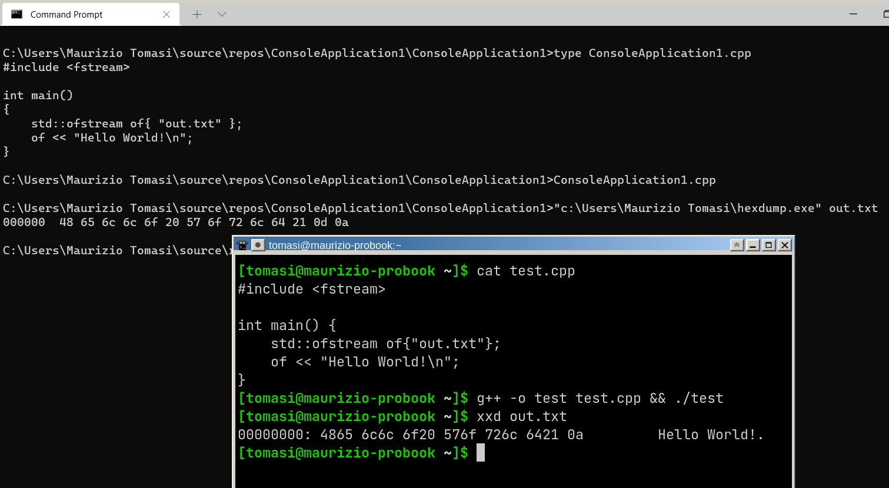
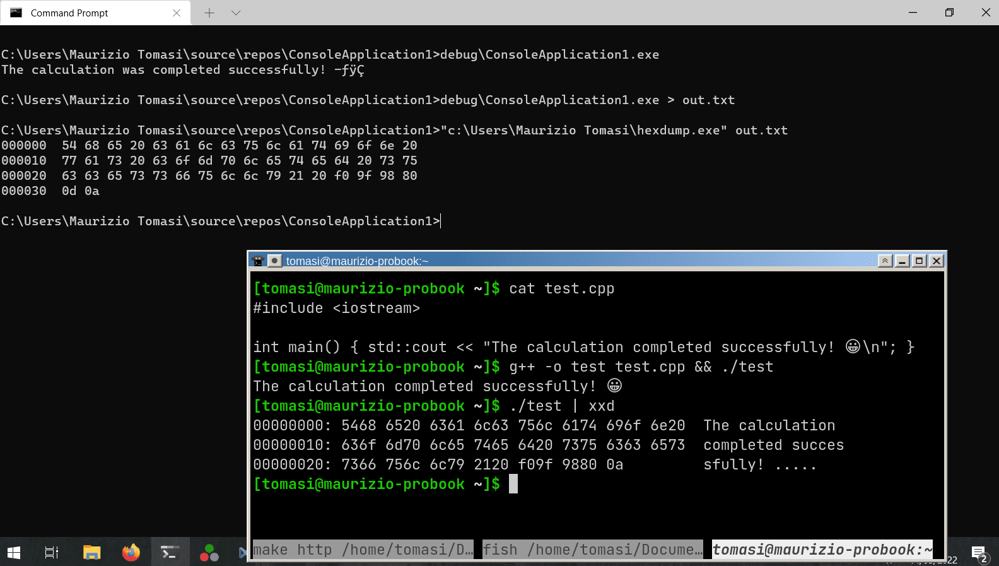
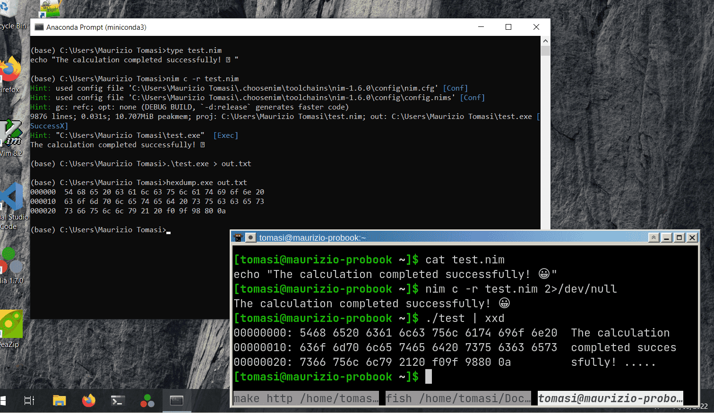
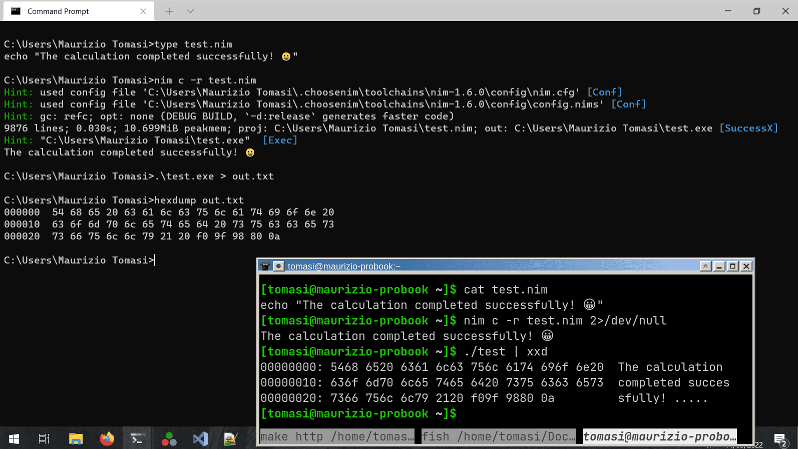
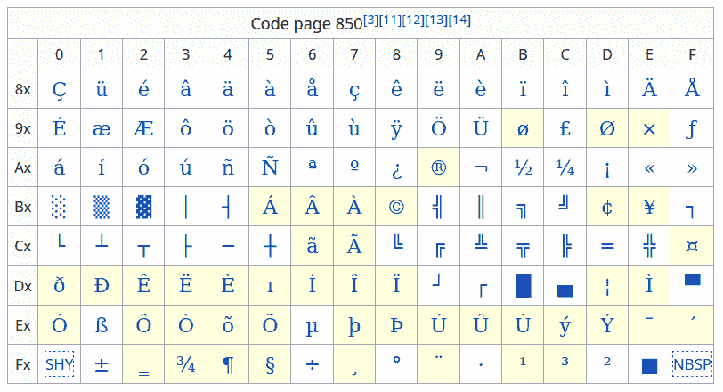
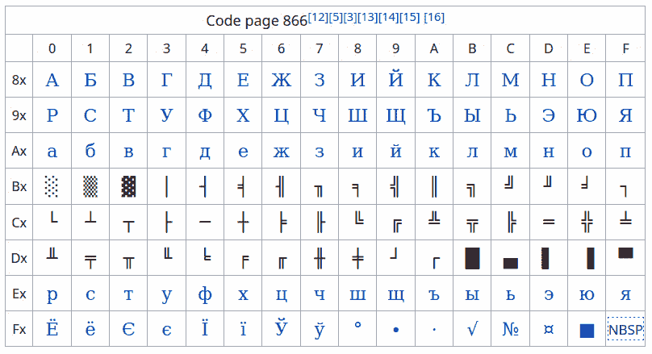
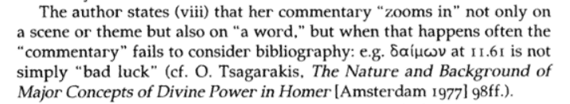

<asciinema-player src="./cast/binary-files-73x19.cast" cols="73" rows="19" font-size="medium"></asciinema-player>

# Da binario a decimale

-   Per ragionare sui valori dei byte si usa la numerazione binaria, che ovviamente usa come base il numero 2:

    ```
    0  → 0
    1  → 1
    2  → 10
    3  → 11
    4  → 100
    …
    ```
    
-   Per un numero `dcba` espresso in una base $B$, il suo valore è

    $$
    \text{value} = a \times B^0 + b \times B^1 + c \times B^2 + d \times B^3.
    $$
    
    Quindi il valore binario `100` corrisponde a $0 \times 2^0 + 0 \times 2^1 + 1\times 2^2 = 4.$

# Notazione esadecimale

-   La notazione binaria è però scomoda, perché i numeri richiedono rapidamente molte cifre (8 cifre per un byte!).

-   In alternativa alla notazione binaria si usa molto la notazione esadecimale (16), che usa le cifre

    ```
    0 1 2 3 4 5 6 7 8 9 A B C D E F
    ```
    
-   La notazione esadecimale richiede 4 bit per cifra, perché $2^4 = 16$. Siccome un byte è composto da 8 bit, il valore di un byte è sempre codificabile usando solo due cifre esadecimali (`0xFF = 255`).

-   In C/C++/D/Nim/Rust/Julia/C\#/Kotlin, i numeri esadecimali si scrivono con `0x`, ad es. `0x1F67 = 8039` (in alcuni linguaggi `0b` introduce un numero binario).


# Ordine dei bit in un byte

-   C'è sempre un'ambiguità di fondo nel raggruppamento dei bit in byte, e sta nel loro ordine.

-   Se un byte è formato dalla sequenza di bit `0011 0101`, esistono due modi per interpretarlo:

    $$
    \begin{aligned}
    2^0 + 2^2 + 2^4 + 2^5 &= 53,\\
    2^2 + 2^3 + 2^5 + 2^7 &= 172.
    \end{aligned}
    $$

# «Endianness» dei bit

-   L'ordine dei bit in un byte è detto in gergo *bit-endianness*, termine tratto dai *Viaggi di Gulliver* (1726), di J. Swift:

    1.  La codifica *big-endian* parte dalla potenza *maggiore* («big»);
    2.  La codifica *little-endian* parte dalla potenza *minore* («little»).

-   Le CPU Intel e AMD oggi usate nei personal computer usano tutte la codifica *little-endian*. La codifica *big-endian* è invece lo standard per le trasmissioni via rete (ed oggi è ancora impiegata in alcune CPU ARM).

-   Fortunatamente, la *bit endianness* non sarà qualcosa di cui dovremo preoccuparci nel nostro codice, ma dovremo invece affrontare la *byte endianness*!

# Usare più di 8 bit

-   Un numero a 8 bit può assumere valori da 0 a 255

-   È un intervallo molto ridotto! Ma si possono combinare insieme più bytes

-   In C++ esistono i tipi `int16_t` (16 bit → 2 byte), `int32_t` (32 bit → 4 byte), `int64_t` (64 bit → 8 byte)

    <center>
    { height=280px }
    </center>

# Endianness dei byte

-   Se si combinano insieme più byte, c'è di nuovo il problema della *endianness*!

-   Ad esempio, il numero esadecimale a 16 bit 1F3D (2 byte) si codifica con la coppia di byte `1F 3D` (*big endian*) oppure `3D 1F` (*little endian*)?

-   Si parla anche in questo caso di codifica di byte *big endian* o *little endian*

-   A differenza della *bit endianness*, dovremo preoccuparci della *byte endianness* nella gestione dei file PFM ☹

# Dati binari e testuali

-   Oltre al problema della *endianness*, bisogna anche capire come il proprio linguaggio gestisce i file binari. Guardate questo esempio in C++:

    ```c++
    #include <fstream>
    
    int main() {
      int x{138};  // 138 < 256, so the value fits in *one* byte
      std::ofstream outf{"file.bin"};
      outf << x; // Ouch! It writes *three* bytes: '1', '3', '8'
    }
    ```
    
    Il valore `138` è stato salvato in *forma testuale*! (Se invece usate il tipo `uint8_t`, il C++ userà l'usuale *forma binaria*)
    
-   Vediamo dunque ora i segreti della codifica testuale.


# Codifica testuale

---



---



---



---




# Codifica testuale

-   I caratteri del computer vengono codificati tramite numeri; la più usata è la codifica ASCII:

    -  La lettera `A` è codificata dal numero 65, `B` da 66, `C` da 67, etc.;
    -  La lettera `a` è codificata dal numero 97, `b` da 98, etc.;
    -  La cifra `0` è codificata dal numero 48, `1` da 49, etc.
    
-   Codificare una parola come `Casa` vuol dire rappresentare la parola con la sequenza di valori `67 97 115 97 = 0x43 0x61 0x73 0x61`.

-   Questi codici numerici fanno parte dello standard ASCII, che specifica 128 caratteri. ([Qui c'è la tabella completa](https://garbagecollected.org/2017/01/31/four-column-ascii/), spiegata bene).

# Codifica di testi

-   Lo standard ASCII è semplicissimo, eppure sufficiente per codificare testi:

    ```text
    Beauty - be not caused - It Is -
    Chase it, and it ceases -
    Chase it not, and it abides -
    
    Overtake the Creases
    
    In the Meadow - when the Wind
    Runs his fingers thro' it -
    Deity will see to it
    That You never do it -
    
    (Emily Dickinson, 1863)
    ```

-   Ma come si codifica la fine della riga in ogni verso della poesia?

-   In 128 valori è possibile codificare *tutti* i caratteri?


# Ritorno a capo

-   Il modo per indicare un ritorno a capo dipende dal sistema operativo!

-   Nelle macchine da scrivere c'erano due operazioni da fare per iniziare una nuova riga (vedi [questo video YouTube](https://www.youtube.com/watch?v=r97JHr13T98)):

    1.   Spostarsi verso il bordo sinistro/destro del foglio (*carriage return*, movimento orizzontale);
    2.   Muoversi alla riga successiva (*line feed*, movimento verticale).
    
-   Nella codifica ASCII c'è un carattere per ciascuno dei due comandi, che corrispondono a `13` (*carriage return*, indicato anche come `\r`) e `10` (*line feed*, indicato con `\n`). Questi erano indispensabili per i terminali *teletype*.


# Terminale teletype [ASR-33](http://bytecollector.com/asr_33.htm)

<center>
{height=520px}
</center>

Vedete questo [link](https://www.howtogeek.com/727213/what-are-teletypes-and-why-were-they-used-with-computers/) per un po' di storia su questo tipo di terminali.

# Tipi di ritorno a capo

-   Oggi non si usano più terminali teletype, ma `\n` e `\r` sono ancora usati

-   Il tipo di ritorno a capo dipende dal sistema operativo utilizzato:

    | Sistema operativo  | Codifica         |
    |--------------------|------------------|
    | Windows, DOS       | `13 10` (`\r\n`) |
    | RISC OS            | `10 13` (`\n\r`) |
    | C64, macOS classic | `13` (`\r`)      |
    | Linux, Mac OS X    | `10` (`\n`)      |
    
-   Git si aspetta il formato Linux (`\n`) nei file aggiunti con `git add`

# Oltre i 127 caratteri

-   Anche se ASCII nacque per computer con 7 bit per byte, ben presto i produttori di computer si uniformarono per usare 8 bit in ogni byte

-   Siccome $2^8 = 256$, questo vuol dire che i numeri 128–255 sono inutilizzati in ASCII: uno spreco!

-   Per venire incontro alle esigenze degli utenti di lingua non inglese, si inventarono le *code page*

-   Una *code page* è una tabella di corrispondenze tra i numeri 128–255 e dei caratteri

# Esempi di *code page*

Code page 850 (latina)



# Esempi di *code page*

Code page 866 (cirillica)



# Problemi delle *code page*

-   Se si esegue questo comando sotto un sistema MS-DOS che usa la *code page* 850:

    ```
    c:\> echo è > file.txt
    ```
    
    il primo byte del file avrebbe valore `130`, e verrebbe rappresentato correttamente:
    
    ```
    c:\> type file.txt
    è
    ```
    
-   Copiando però il file su un computer con *code page* 866, si otterrebbe questo:

    ```
    c:\> type file.txt
    ѓ
    ```

# Limiti delle *code page*

-   Abbiamo visto che ASCII è un sistema centrato sul sistema di scrittura usato negli USA, e non include caratteri accentati come «è», «é», «ü», «â», etc.

-   Il sistema delle *code page* ha mostrato ben presto i suoi limiti: come scrivere testi in cui si richiedono più scritture contemporaneamente?

    <center></center>

-   Oltre agli accenti sulle lettere latine, sono esistenti nel mondo molti altri alfabeti e simboli, sia contemporanei (greco, cirillico, cinese, i simboli matematici, etc.) che antichi (geroglifici egizi, caratteri cuneiformi sumerici)

# Lo standard Unicode

-   Standard internazionale nato nel 1991, che copre praticamente tutti i sistemi di scrittura oggi esistenti al mondo.

-   Oggi è supportato quasi universalmente.

-   Viene aggiornato periodicamente, circa una volta all'anno.

-   Supporta sia scritture moderne (latino, cirillico, ebraico, arabo…) che antiche (geroglifici egizi: 𓀃, scrittura sumerico-accadica: 𒀄)

-   Ha un ottimo supporto anche per caratteri matematici (∞, ∈, ∀), emoticons (😀, 😉), simboli musicali (♭, ♯, 𝄞), etc.

# Versioni Unicode

| Versione | Data           | Scritture | Caratteri |
|----------|----------------|-----------|-----------|
| 1.0      | Ottobre 1991   | 24        | 7,129     |
| …        |                |           |           |
| 11.0     | Giugno 2018    | 146       | 137,374   |
| 12.0     | Marzo 2019     | 150       | 137,928   |
| 13.0     | Marzo 2020     | 154       | 143,859   |
| 14.0     | Settembre 2021 | 159       | 144,697   |

# Esempi di caratteri Unicode

-   Lettera A maiuscola: `A` (65, uguale all'ASCII!);
-   Lettera A minuscola con accento acuto: `à` (224);
-   Lettera E maiuscola con accento grave: `É` (201);
-   Puntini di sospensione: `…` (8230);
-   Bemolle: `♭` (9837);
-   Faccina che ride: `😀` (128.512).

# Codifica Unicode

-   Ogni carattere Unicode è associato a un valore numerico, chiamato *code point*.

-   Si possono [combinare insieme caratteri](https://en.wikipedia.org/wiki/Combining_character): unendo `a` e `^` per formare `â`.

-   Le lettere accentate più comuni hanno però una [codifica dedicata](https://en.wikipedia.org/wiki/Precomposed_character). Queste lettere sono quindi codificabili in **più modi** secondo lo standard Unicode. (Questo rende complicato confrontare due stringhe!)

-   Un *grafema* è il risultato di una combinazione di uno o più code point. Quindi la parola `così` è composta da quattro grafemi: `c`, `o`, `s` ed `ì` (che può essere il *code point* 236, oppure la combinazione dei code point `i` e `).

-   La combinazione di caratteri diversi è molto importante in certe scritture come il cinese.

# Codificare i *code point*

-   Lo standard Unicode possiede molti *code point*, e a ogni versione se ne aggiungono di nuovi.

-   Questo pone un problema nella codifica dei *code point* su file: ASCII usava un byte per carattere perché il set era limitato. Ma per Unicode quanti byte per *code point* usare? 1? 2? 100?

    -   Se si scegliesse un valore basso, si limiterebbe l'estendibilità di Unicode.
    -   Se si scegliesse un valore molto alto, i file di testo aumenterebbero di dimensione inutilmente: la poesia di E. Dickinson richiede 232 byte in codifica ASCII (un byte per carattere). Usare 4 byte per carattere quadruplicherebbe lo spazio.

# Codifiche oggi usate

-   Storicamente sono state proposte varie codifiche per Unicode.

-   Le più usate oggi sono le codifiche UTF (Unicode Transformation Format), che esistono in tre versioni:

    -   UTF8 (usata nei sistemi Linux e Mac OS X);
    -   UTF16 (usata in Windows);
    -   UTF32 (molto comoda dal punto di vista del software).

# UTF-8

-   È oggi la codifica più usata in assoluto (tranne che sotto Windows 😢).

-   Il numero di byte usati per un *code point* è variabile da 1 a 4.

-   È compatibile con la codifica ASCII: un file ASCII è automaticamente anche un file UTF-8 valido

-   Sfrutta il fatto che la codifica ASCII usa solo 7 degli 8 bit in un byte, e che i primi 127 *code point* Unicode sono uguali ai valori ASCII.


# Codifica UTF-8

| Code point           | Byte 1     | Byte 2     | Byte 3     | Byte 4     |
|----------------------|------------|------------|------------|------------|
| `0x0000`–`0x007F`    | `0xxxxxxx` | —          | —          | —          |
| `0x0080`–`0x07FF`    | `110xxxxx` | `10xxxxxx` | —          | —          |
| `0x0800`–`0xFFFF`    | `1110xxxx` | `10xxxxxx` | `10xxxxxx` | —          |
| `0x10000`–`0x10FFFF` | `11110xxx` | `10xxxxxx` | `10xxxxxx` | `10xxxxxx` |

# Codifica UTF-16

-   Funziona come la codifica UTF-8, ma si usano coppie di byte ($8 + 8 = 16$). 

-   Un *code point* può essere codificato da due oppure quattro byte.

-   C'è qui però un problema di *endianness*: il valore `0x2A6C` si scrive come la coppia di byte `0x2A 0x6C` (*big endian*) oppure `0x6C 0x2A` (*little endian*)?

-   Nei file di testo codificati con UTF-16 si inserisce all'inizio del file il cosiddetto BOM (*byte-order marker*) che corrisponde al *code point* `0xFEFF`. Se i primi due byte di un file sono `0xFE 0xFF`, allora è chiaro che il file usa *big endian*, se sono `0xFF 0xFE` usa *little endian*. (Anche UTF-8 ha un BOM, `0xEF 0xBB 0xBF`).

-   UTF-16 è usato da Windows e nei linguaggi basati su Java (Kotlin, Scala, etc.).

# Codifica UTF-32

-   Ovviamente, usa 32 bit per *code point*.

-   In questo caso non c'è ambiguità: ogni code point usa esattamente quattro byte.

-   È ovviamente la codifica più inefficiente dal punto di vista dello spazio occupato: la poesia di Emily Dickinson occuperebbe 928 byte in UTF-32, e solo 232 byte in ASCII/UTF-8 (quattro volte tanto!)

-   È però la codifica più semplice: ogni code point occupa sempre lo spazio di un tipo `uint32_t` in C/C++.

# File binari e testuali

-   Quanto detto oggi spiega perché è spesso più vantaggioso usare *file binari* anziché testuali: è molto più facile per un programma leggerli e scriverli!

-   Quasi tutti i formati grafici oggi usati (PNG, JPEG, GIF, etc.) si basano su codifiche binarie.

-   I file testuali hanno però alcuni vantaggi significativi:

    -   Sono più facili da leggere e da scrivere per un essere umano;
    
    -   Non hanno problemi di *endianness*.
    
-   Inoltre, c'è un tipo importante di file di testo che avete già iniziato ad usare: i vostri **codici sorgente**!


# Codifica di file sorgente

-   Quasi tutti i linguaggi richiedono parole chiave e simboli che si limitano ad usare caratteri ASCII (alcuni consentono anche caratteri Unicode nei nomi di variabili e di funzioni, come Julia e Python)

-   Però nelle slide mostrate prima abbiamo visto che nei programmi si possono inserire anche stringhe letterali:

    ```python
    print("The calculation completed successfully! 😀")
    ```
    
-   Come assicurarsi che il codice sia interpretato correttamente?

# Codifiche di file sorgente

-   Alcuni linguaggi ([Nim](https://nim-lang.org/docs/manual.html#lexical-analysis-encoding), [Rust](https://doc.rust-lang.org/reference/input-format.html)…) impongono la codifica UTF-8

-   [D](https://dlang.org/spec/lex.html#source_text) supporta tutte le codifiche Unicode (UTF-8, UTF-16, UTF-32, con qualsiasi *endianness*)

-   Python permette in linea di principio [qualsiasi codifica](https://peps.python.org/pep-0263/), indicata con un commento all'inizio del file:

    ```python
    #!/usr/bin/env python3
    # -*- encoding: utf-8 -*-
    ```

-   Il rapporto del C++ con Unicode è complicato! `clang` usa UTF-8, GCC la ammette da linea di comando (`-finput-charset=`)…

# Codifiche di file sorgente

-   Ma questo risolve solo parte del problema, perché se il programma stampa una stringa UTF-8, bisogna assicurarsi che il sistema su cui gira il programma riconosca UTF-8 (Vedi le schermate all'inizio di questa sezione).

-   Fate attenzione alla codifica usata dal vostro editor; di solito inserire la stringa `encoding: utf-8` in un commento all'inizio del file aiuta (è riconosciuta sia da Emacs che da Vim)

-   Tutti gli editor moderni consentono comunque di cambiare la codifica di un file

-   Da linea di comando potete usare il programma [`iconv`](https://en.wikipedia.org/wiki/Iconv)


# Gestione degli errori

# Errori

-   Nella scorsa esercitazione abbiamo implementato il tipo `HdrImage`.
-   Questa settimana implementeremo le funzioni per scrivere e leggere file PFM.
-   Legge e scrivere file è un'attività che è facilmente soggetta ad errori:
    -   La directory in cui salvare il file non esiste, oppure è protetta da scrittura
    -   Il file specificato dall'utente non esiste
    -   Il file è danneggiato
    -   Il file è in un formato valido ma che il nostro codice non è in grado di caricare (es., un file è codificato in *big endian*, ma noi abbiamo previsto solo *little endian*)

# Tipi di errore

-   Gli errori possono essere suddivisi in due classi:

    -   Errori di pertinenza del programmatore
    -   Errori di pertinenza dell'utente
    
-   A seconda del tipo di errore in cui vi imbattete, la sua gestione è diversa.

# Errori del programmatore

-   Si tratta di un errore logico del programma.
-   Un programma «perfetto» non dovrebbe mai avere errori logici.
-   Se si ha l'evidenza che è avvenuto un errore logico, sarebbe meglio segnalarlo **nel modo più rumoroso possibile**.

# Esempio

```python
my_list = [5, 3, 8, 4, 1, 9]
sorted = my_sort_function(my_list)

if not (len(my_list) == len(sorted)):
    print("Error, mismatch in the length of the sorted list")
    
if not (sorted[0] <= sorted[1]):
    print("Error, the array is not sorted")

# The program continues
...
```

# Esempio migliorato

```python
my_list = [5, 3, 8, 4, 1, 9]
sorted = my_sort_function(my_list)

# If any "assert", the program will crash and will print details
# about what the code was doing. If PDB support is turned on,
# a debugger will be fired automatically.
assert len(my_list) == len(sorted)
assert sorted[0] <= sorted[1]

# The program continues
...
```

# Gestione errori del programmatore

-   Tutti i linguaggi implementano funzioni che consentono di mandare in crash un programma (es., `assert` e `abort` in C/C++).
-   Queste istruzioni solitamente stampano a video una serie di dettagli sulla causa dell'errore, e sono pensate per essere usate insieme a un debugger.
-   Eseguire un debugger è sensato: se l'errore è logico, è il programmatore che deve mettere mano al codice, non l'utente!
-   Attenzione al fatto che alcune di queste funzioni potrebbero non essere compilate in modalità *release* (es., [`assert`](https://nim-lang.org/docs/assertions.html#assert.t,untyped,string) vs [`doAssert`](https://nim-lang.org/docs/assertions.html#doAssert.t%2Cuntyped%2Cstring) in Nim).

# Errori dell'utente

-   Sono errori causati da un input o un contesto sbagliato, e non per colpa di un errore nel programma:
    -   L'utente chiede di leggere un file che non esiste;
    -   L'utente chiede di scrivere un file su un supporto che non ha più spazio libero;
    -   L'utente specifica un input scorretto;
    -   L'utente chiede di usare una periferica (stampante?) non connessa al computer oppure spenta.
-   Vanno gestiti in modo molto diverso dagli errori del programmatore: non vogliamo che il programma vada in crash in questi casi!

# Esempio

<asciinema-player src="./cast/user-error-74x25.cast" cols="74" rows="25" font-size="medium"></asciinema-player>

# Gestire errori dell'utente

-   Gli errori dell'utente sono **inevitabili**.
-   Se si ha evidenza che l'utente ha commesso un errore, ci sono diversi modi di reagire:
    1.  Stampare un messaggio di errore, il più chiaro possibile;
    2.  Chiedere all'utente di inserire di nuovo il dato scorretto;
    3.  In certi contesti il codice può decidere autonomamente come correggere l'errore.
    
        Ad esempio, se si chiede un valore numerico entro un certo intervallo $[a, b]$ e il valore fornito è $x > b$, si può porre $x = b$ e continuare.

# Correzione errori (1/2)

```python
x = float(input("Insert a number: "))
y = float(input("Insert another number: "))
if y != 0.0:
    print(f"The ratio {x} / {y} is {x / y}")
else:
    print("Error, the second number cannot be zero!")
```

# Correzione errori (2/2)

```python
x = float(input("Insert a number: "))

while True:
    y = float(input("Insert another number: "))
    if y == 0.0:
        print("Error, the second number cannot be zero!")
    else:
        break
        
print(f"The ratio {x} / {y} is {x / y}")
```

# Programma corretto

<asciinema-player src="./cast/user-error-corrected-74x25.cast" cols="74" rows="25" font-size="medium"></asciinema-player>

# Messaggi d'errore

-   Gli studenti hanno spesso la tendenza a stampare messaggi di errore.

-   Esempio (sbagliato) preso da un tema d'esame TNDS:

    ```c++
    double Bisezione::CercaZeri(double a, double b) {
        if(f->Eval(a) * f->Eval(b) >= 0) {
            cout << "Errore, teorema degli zeri non soddisfatto\n";
        } else {
            // Etc.
        }
    }
    ```

    Non c'è un `return` in corrispondenza dell'`if`, e l'esercizio chiedeva di calcolare lo zero di una funzione in un intervallo in cui lo zero **doveva esserci**. Se il teorema degli zeri non è soddisfatto, vuol dire che c'è un errore in `a` oppure `b`.

# Visibilità dei messaggi di errore

-   Se una funzione stampa un messaggio quando capita un errore, è molto probabile che quel messaggio si perda all'interno dell'output:

    ```text
    $ python3 my-beautiful-program.py
    Initializing the program...
    Now I am reading data from the device
    The device has sent 163421 samples
    Computing statistics on the samples
    Error, some samples are negative
    Sorting the samples
    Running a Monte Carlo simulations, please wait...
    Done, time elapsed: 164.96 seconds
    Producing the plots...
    Done, the results are saved in "output.pdf"
    $
    ```
    
-   Meglio rendere l'errore più visibile, ad esempio con i colori, oppure (meglio!) fermare del tutto l'esecuzione del programma appena l'errore si verifica.

# Errori dell'utente nelle funzioni

-   È solitamente molto semplice come gestire gli errori dell'utente nel `main` di un programma.
-   È invece meno chiaro come gestire gli errori nell'input passato a una funzione o un metodo, come ad esempio `Bisezione::CercaZeri` (gli estremi erano un input dell'utente, o erano stati calcolati automaticamente dal programma?).
-   Nessuna funzione o metodo dovrebbe **mai** fare qualcosa di catastrofico (mandare in crash il programma) o **visibile** (stampare un messaggio d'errore a video).
-   La **regola aurea** è che la funzione restituisca un valore di ritorno che segnali l'errore, oppure che sollevi un'eccezione.

# Eccezioni

# Eccezioni

-   Una eccezione serve per «mandare in crash» un programma in modo controllato:

    ```python
    def my_function(...):
        if something_wrong:
            raise Exception("Error!")
    ```

-   A differenza di funzioni come `abort`, il crash può essere sospeso o interrotto (in gergo, «catturato»), e l'eccezione può segnalare il tipo di errore che ne ha causato la creazione.

---

<asciinema-player src="./cast/exceptions-100x23.cast" cols="100" rows="23" font-size="18"></asciinema-player>

# Tipi per eccezioni

-   Una eccezione è un tipo di *crash* che è **tipizzato** (es., `ValueError`)

-   Questi tipi possono avere al loro interno informazioni aggiuntive:

    ```python
    class WrongNumber(Exception):
        def __init__(self, num):
            self.num = num

    try:
        x = float(input("Enter some number: "))
        if x > 3:
            raise WrongNumber(num=x)
    except WrongNumber as e:
        print("You entered a number that is too large: ", e.num)

    # Enter some number: 5
    # You entered a number that is too large: 5
    ```

# Propagare eccezioni

-   Una eccezione che non viene catturata si diffonde lungo tutta la catena dei chiamanti

-   Essa può essere catturata a qualsiasi livello:

    ```python
    def f():
        raise Exception("Error!")
        
    def g():
        f()
        
    def h():
        try:      # You can capture exceptions within functions, of course
            g()   # g doesn't raise exceptions, but f() does
        except:
            print("Got an exception!")
    ```

# Prestazioni

-   Le eccezioni rallentano i programmi, perché il compilatore deve inserire all'interno delle funzioni del codice «nascosto» che possa gestirle

-   Per questo alcuni linguaggi (Rust, Go…) non le supportano, e in altri si possono disabilitare all'interno di specifiche funzioni/metodi (`nothrow` in C++)

-   Nel programma che svilupperemo useremo il seguente approccio, che non causerà alcun rallentamento significativo:

    -   Leggeremo input dall'utente, usando eccezioni per segnalare errori
    -   Calcoleremo la soluzione dell'equazione del rendering, evitando eccezioni: questa sarà la parte più lenta
    -   Salveremo il risultato in un file, usando nuovamente le eccezioni

# Alternative alle eccezioni

# Parametri d'errore

-   Si può accettare un parametro addizionale che segnali l'errore:

    ```c++
    double my_function(..., bool & error) {
        error = false;
        
        if (something_wrong) {
            error = true;
            return 0.0;
        }

        // ...
        return result;
    }
    ```

-   Al posto di un `bool` potete usare una `enum class` per registrare il tipo di errore, o addirittura una `struct` per racchiudere informazioni complesse.

# Tipi *nullable*

-   Linguaggi come C\# e Kotlin definiscono il tipo *nullable*, che può essere usato con qualsiasi tipo, e ne indica l'*assenza*:

    ```csharp
    // C# example

    // Note the "?" after "double": this is the same syntax as in Kotlin
    double? result = my_function(...);

    if (! result.HasValue)
    {
        // Something wrong happened, my_function didn't compute the result
    }
    ```

-   In alternativa, può esserci un tipo definito nella libreria standard che implementa questa funzionalità ([`std::optional`](https://en.cppreference.com/w/cpp/utility/optional) in C++, [Option](https://nim-lang.org/docs/options.html) in Nim)

# Tipi `Result`

-   In Rust esiste il tipo `Result`, che è una versione più versatile del tipo `std::optional` in C++ (ma c'è una proposta per [`std::expected`](il prohttp://www.open-std.org/jtc1/sc22/wg21/docs/papers/2021/p0323r10.html)…)

-   Il tipo `Result` è un *sum type* (li vedremo meglio più avanti), e permette di associare un tipo `A` in caso di successo, e un tipo `B` in caso di fallimento:

    ```rust
    pub struct OutputData {
        pub mass: f32;
        pub charge: f32;
    };
    
    pub struct SomeError {
        pub message: String;
    };
    
    fn compute_quantities(…) -> Result<OutputData, SomeError> { … }
    ```
