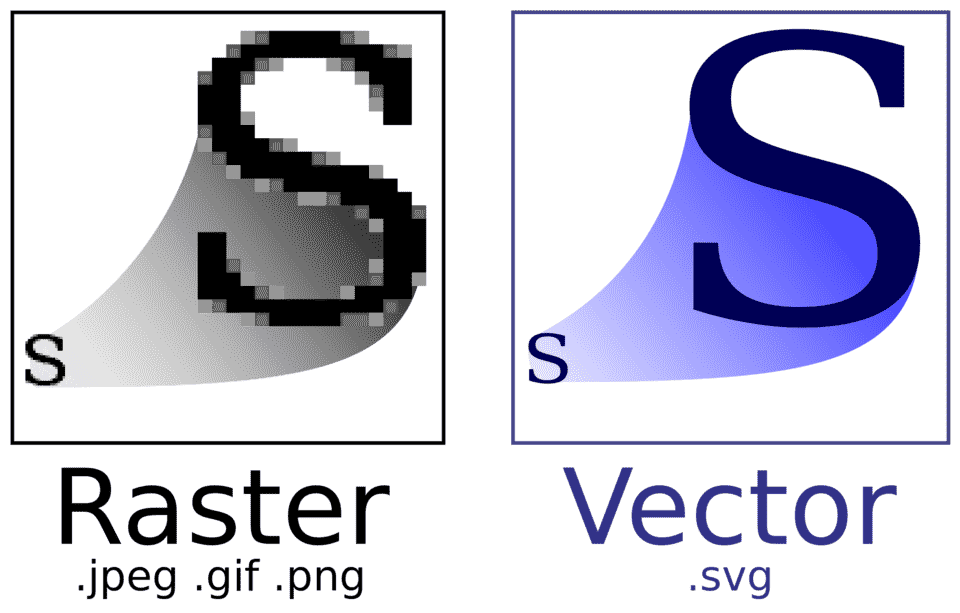
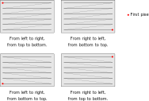

<center>

</center>

# Grafica vettoriale

<center>

</center>

# Grafica raster

<center>

</center>

# Tipi di immagini raster

Ci sono due categorie di immagini raster che sono rilevanti per questo corso:

Immagini LDR (Low-Dynamic Range)
: Codificano i colori usando il sistema sRGB: le tre componenti R, G, B sono quindi numeri interi, solitamente nell'intervallo 0–255. Tutti i formati grafici più diffusi (JPEG, PNG, GIF, etc.) appartengono a questo tipo.

Immagini HDR (High-Dynamic Range)
: Codificano i colori usando il sistema RGB o sRGB, ma le tre componenti R, G, B sono numeri floating-point e coprono quindi un grande intervallo dinamico; per visualizzarle occorre quindi applicare il *tone mapping*. Esempi di questo formato sono OpenEXR e PFM.

# Codifica di immagini raster

-   Sia le immagini LDR che HDR sono codificate tramite una matrice di colori; ogni colore è solitamente una terna (R, G, B).

-   Il file ha solitamente questo contenuto:

    Header
    : Specifica il formato dell'immagine, le dimensioni della matrice, e a volte anche altri parametri utili (es., la data e l'ora dello scatto, le coordinate del GPS, il valore di $\gamma$ del dispositivo che ha catturato l'immagine, etc.).
    
    Matrice dei colori
    : L'ordine in cui sono salvate le righe/colonne, e anche l'ordine in cui sono salvate le componenti R, G, B (RGB/BGR) varia a seconda del formato.

---

<center>

</center>

# Esempio: il formato PPM

-   Formato LDR, molto diffuso sui sistemi Unix.

-   Potete leggerlo e scriverlo usando [NetPBM](http://netpbm.sourceforge.net/) o [ImageMagick](https://imagemagick.org/index.php). Il secondo è il più diffuso, e può essere installato con

    ```text
    $ sudo apt install imagemagick
    ```
    
    Potete convertire immagini col comando
    
    ```text
    $ convert input.png output_p6.ppm                  # Formato P6
    $ convert input.jpg -compress none output_p3.ppm   # Formato P3
    ```
    
-   PPM è un formato pensato per essere scritto e letto facilmente.

# File PPM (P3)

-   Un file PPM è un file di testo, apribile con qualsiasi editor.
-   **Header**:

    1. I due caratteri `P3`;
    2. Numero di colonne e di righe, in formato testo e separate da uno spazio;
    3. Valore massimo per ciascuna delle componenti R, G, B (solitamente 255).

-   **Matrice dei colori**: le terne R, G, B devono essere riportate come numeri interi partendo dall'angolo in alto a sinistra a quello in basso a destra, procedendo riga per riga.

# Esempio (P3)

```text
P3
3 2
255
255   0   0
  0 255   0
  0   0 255
255 255   0
255 255 255
  0   0   0
```

<center>

</center>

# File PPM (P6)

-   Oltre al tipo `P3` esiste anche il file di tipo `P6`.

-   La differenza sta nel modo in cui le terne R, G, B sono salvate: invece di scrivere numeri in codifica testuale, vengono scritti in binario.

-   Vedremo dopo questa differenza, che sarà però fondamentale per l'esercitazione di questa settimana.

# File PFM

-   È un tipo di file che si ispira a PPM, ma è un formato HDR

-   **Molto** importante per questo corso!

-   Non è così ben supportato: sotto Ubuntu esiste solo `pftools`, che si installa con

    ```text
    $ sudo apt install pftools
    ```
    
-   Noi scriveremo i nostri tool che permetteranno di convertire file PFM in PPM.

# Struttura di un file PFM

-   Come i file PPM in formato P6, anche i file PFM sono parzialmente di testo e parzialmente binari.
-   **Header**:

    1. I due caratteri `PF`, più il carattere `0x0a` (ritorno a capo);
    2. `ncol nrows` (colonne e righe), seguito da ritorno a capo `0x0a`;
    3. Il valore `-1.0`, seguito da `0x0a`.

-   **Matrice dei colori**: le terne R, G, B devono essere scritte come sequenze di numeri a 32 bit (quindi **non** testo!), da sinistra a destra e dal **basso all'alto** (diverso da PPM!).

# Codifica testuale e binaria

# Codifica binaria

-   I file binari sono il tipo più semplice: consistono di una sequenza di byte (ossia, 8 bit scritti in sequenza).

-   Ogni byte può contenere un valore intero nell'intervallo 0–255

-   Per stampare il contenuto di un file binario potete usare il comando `xxd` (sotto Ubuntu, installatelo con `sudo apt install xxd`):

    ```text
    $ xxd file.bin
    ```
    
    (Su altri sistemi operativi potreste avere `hexdump` anziché `xxd`).
    
-   Salvare dati in un file binario vuol dire scrivere una sequenza di numeri binari sul disco fisso, memorizzati come byte.

# Da binario a decimale

-   Per ragionare sui valori dei byte si usa la numerazione binaria, che ovviamente usa come base il numero 2:

    ```
    0  → 0
    1  → 1
    2  → 10
    3  → 11
    4  → 100
    …
    ```
    
-   Per un numero `dcba` espresso in una base $B$, il suo valore è

    $$
    \text{value} = a \times B^0 + b \times B^1 + c \times B^2 + d \times B^3.
    $$
    
    Quindi il valore binario `101` corrisponde a $1 \times 2^0 + 0 \times 2^1 + 1\times 2^2 = 5.$

# Notazione ottale

-   La notazione binaria è comoda per una CPU ma scomoda per noi!

-   Una base più comoda è quella ottale (8).

-   In C/C++, le cifre ottali si scrivono facendole precedere da `0`.

-   Siccome $8 = 2^3$, una cifra ottale corrisponde a 3 cifre binarie. Basta imparare a memoria l'associazione binario-ottale per i numeri da 0 a 7 per saper convertire ogni altro valore:

    ```
    03  -> 011
    06  -> 110
    036 -> 011 110
    ```
    
    La conversione inversa è ugualmente semplice.

# Notazione esadecimale

-   La notazione ottale è però scomoda, perché i computer lavorano a multipli di 8 bit (i byte), mentre la notazione ottale usa 3 bit per cifra.

-   Oggi la notazione ottale è quasi completamente abbandonata in favore della notazione esadecimale (16), che usa le cifre

    ```
    0 1 2 3 4 5 6 7 8 9 A B C D E F
    ```
    
-   La notazione esadecimale richiede 4 bit per cifra, perché $2^4 = 16$. Siccome un byte è composto da 8 bit, il valore di un byte è sempre codificabile usando solo due cifre esadecimali (`0xFF = 255`).

-   In C/C++/Julia/C\#, i numeri esadecimali si scrivono facendoli iniziare con `0x`, ad es. `0x1F67 = 8039`.

# Ordine dei bit in un byte

-   C'è sempre un'ambiguità di fondo nel raggruppamento dei bit in byte, e sta nel loro ordine.

-   Se un byte è formato dalla sequenza di bit `0011 0101`, esistono due modi per interpretarlo:

    $$
    \begin{aligned}
    2^2 + 2^3 + 2^5 + 2^7 &= 172,\\
    2^5 + 2^4 + 2^2 + 2^0 &= 53.
    \end{aligned}
    $$

# «Endianness» dei bit

-   L'ordine dei bit in un byte è detto in gergo *bit-endianness*, termine tratto dai *Viaggi di Gulliver* (1726), di J. Swift:

    1.  La codifica *big-endian* parte dalla potenza *maggiore* («big»);
    2.  La codifica *little-endian* parte dalla potenza *minore* («little»).

-   Le CPU Intel e AMD oggi usate nei personal computer usano tutte la codifica *little-endian*. La codifica *big-endian* è stata molto usata in passato, ma oggi è ancora impiegata in alcune CPU ARM.

# Salvare dati in binario

-   Salvare una variabile in forma binaria non è in generale semplice!

-   In C++ ad esempio, il programma seguente *non* salva il valore di `x` in binario:

    ```c++
    #include <fstream>
    
    int main() {
      int x{138};  // 138 < 256, so the value fits in *one* byte
      std::ofstream outf{"file.bin"};
      outf << x; // Ouch! It writes *three* bytes: '1', '3', '8'
    }
    ```
    
-   Il valore `138` è stato salvato in *forma testuale*. (Se includete `<cstdint>` e cambiate il tipo di `x` da `int` a `uint8_t`, il valore viene salvato come binario!)

-   Vediamo in cosa consiste la codifica testuale.

# Codifica testuale

-   I caratteri del computer vengono codificati tramite dei valori precisi; le lettere dell'alfabeto latino, le cifre romane e la punteggiatura di base usano la codifica ASCII:

    -  La lettera `A` è codificata dal numero 65, `B` da 66, `C` da 67, etc.;
    -  La lettera `a` è codificata dal numero 97, `b` da 98, etc.;
    -  La cifra `0` è codificata dal numero 48, `1` da 49, etc.
    
-   Codificare una parola come `Casa` vuol dire rappresentare la parola con la sequenza di valori `67 97 115 97`.

-   Questi codici numerici fanno parte dello standard ASCII, che specifica 128 caratteri. ([Qui c'è la tabella completa](https://garbagecollected.org/2017/01/31/four-column-ascii/), spiegata bene).

# Codifica di testi

-   Lo standard ASCII è semplicissimo, eppure sufficiente per codificare testi:

    ```text
    Beauty - be not caused - It Is -
    Chase it, and it ceases -
    Chase it not, and it abides -
    Overtake the Creases
    
    In the Meadow - when the Wind
    Runs his fingers thro’ it -
    Deity will see to it
    That You never do it -
    
    (Emily Dickinson)
    ```

-   Ma come si codifica la fine della riga in ogni verso della poesia?

-   In 128 valori è possibile codificare *tutti* i caratteri?

# Ritorno a capo

-   Il modo per indicare un ritorno a capo dipende dal sistema operativo!

-   Nelle macchine da scrivere c'erano due operazioni da fare per iniziare una nuova riga (vedi [questo video YouTube](https://www.youtube.com/watch?v=r97JHr13T98)):

    1.   Spostarsi verso il bordo sinistro/destro del foglio (*carriage return*);
    2.   Muoversi alla riga successiva (*line feed*).
    
-   Anche i computer hanno adottato questi due comandi, che corrispondono a due valori ASCII: `13` (*carriage return*, indicato anche come `\r`) e `10` (*line feed*, indicato con `\n`).

# Tipi di ritorno a capo

-   Il tipo di ritorno a capo dipende dal sistema operativo utilizzato:

    | Sistema operativo  | Codifica         |
    |--------------------|------------------|
    | Windows, DOS       | `13 10` (`\r\n`) |
    | RISC OS            | `10 13` (`\n\r`) |
    | C64, macOS classic | `13` (`\r`)      |
    | Linux, Mac OS X    | `10` (`\n`)      |
    
-   Si può convertire un file con i comandi `dos2unix` e `unix2dos`.

-   Git si aspetta il formato Linux (`\n`), ed emette un warning se i file aggiunti con `git add` ne usano un altro.

# Da ASCII a Unicode

-   ASCII è stato usato per la prima volta su un terminale che usava 7 bit per byte: ecco perché l'ultimo carattere ha valore `127 = 0x7F` ($127 = 2^7 - 1$).

-   Nei 128 caratteri sono inclusi anche caratteri «speciali», come il ritorno a capo (`10`), la tabulazione (`8`), etc., che «consumano» posizioni nella tabella.

-   ASCII è un sistema centrato sul sistema di scrittura usato negli USA, e non include caratteri accentati come «è», «é», «ü», «â», etc.

-   Oltre agli accenti sulle lettere latine, sono esistenti nel mondo molti altri alfabeti e simboli (greco, cirillico, cinese, i simboli matematici, etc.).

-   Lo standard Unicode ha esteso ASCII per includere *tutte* i possibili simboli testuali (contiene anche i geroglifici egizi e il sumerico!).

# Lo standard Unicode

-   Standard internazionale nato nel 1991, che copre praticamente tutti i sistemi di scrittura oggi esistenti al mondo.

-   Oggi è supportato quasi universalmente.

-   Viene aggiornato periodicamente, circa una volta all'anno.

<center>

</center>


# Versioni Unicode

| Versione | Data         | Scritture | Caratteri |
|----------|--------------|-----------|-----------|
| 1.0      | Ottobre 1991 | 24        | 7,129     |
| …        |              |           |           |
| 11.0     | Giugno 2018  | 146       | 137,374   |
| 12.0     | Marzo 2019   | 150       | 137,928   |
| 13.0     | Marzo 2020   | 154       | 143,859   |

# Esempi di caratteri Unicode

-   Lettera A maiuscola: `A` (65, uguale all'ASCII!);
-   Lettera A minuscola con accento acuto: `à` (224);
-   Lettera E maiuscola con accento grave: `É` (201);
-   Puntini di sospensione: `…` (8230);
-   Bemolle: `♭` (9837);
-   Faccina che ride: `😀` (128.512).

# Codifica Unicode

-   Ogni carattere Unicode è associato a un valore numerico, chiamato *code point*.

-   Si possono [combinare insieme caratteri](https://en.wikipedia.org/wiki/Combining_character): unendo `a` e `^` per formare `â`.

-   Le lettere accentate più comuni hanno però una [codifica dedicata](https://en.wikipedia.org/wiki/Precomposed_character). Queste lettere sono quindi codificabili in **più modi** secondo lo standard Unicode. (Questo rende complicato confrontare due stringhe!)

-   Un *grafema* è il risultato di una combinazione di uno o più code point. Quindi la parola `così` è composta da quattro grafemi: `c`, `o`, `s` ed `ì` (che può essere il *code point* 236, oppure la combinazione dei code point `i` e `).

-   La combinazione di caratteri diversi è molto importante in certe scritture come il cinese.

# Codificare i *code point*

-   Lo standard Unicode possiede molti *code point*, e a ogni versione se ne aggiungono di nuovi.

-   Questo pone un problema nella codifica dei *code point* su file: ASCII usava un byte per carattere perché il set era limitato. Ma per Unicode quanti byte per *code point* usare? 1? 2? 100?

    -   Se si scegliesse un valore basso, si limiterebbe l'estendibilità di Unicode.
    -   Se si scegliesse un valore molto alto, i file di testo aumenterebbero di dimensione inutilmente: la poesia di E. Dickinson richiede 232 byte in codifica ASCII (un byte per carattere). Usare 4 byte per carattere quadruplicherebbe lo spazio.

# Codifiche oggi usate

-   Storicamente sono state proposte varie codifiche per Unicode.

-   Le più usate oggi sono le codifiche UTF (Unicode Transformation Format), che esistono in tre versioni:

    -   UTF8 (usata nei sistemi Linux e Mac OS X);
    -   UTF16 (usata in Windows);
    -   UTF32 (molto comoda dal punto di vista del software).

# UTF-8

-   È oggi la codifica più usata in assoluto (tranne che sotto Windows 😢).

-   Il numero di byte usati per un *code point* è variabile da 1 a 4.

-   È compatibile con la codifica ASCII: un file ASCII è automaticamente anche un file UTF-8 valido, perché sfrutta il fatto che la codifica ASCII usa solo 7 degli 8 bit in un byte, e che i primi 127 *code point* Unicode sono uguali ai valori ASCII.


# Codifica UTF-8

| Code point           | Byte 1     | Byte 2     | Byte 3     | Byte 4     |
|----------------------|------------|------------|------------|------------|
| `0x0000`–`0x007F`    | `0xxxxxxx` | —          | —          | —          |
| `0x0080`–`0x07FF`    | `110xxxxx` | `10xxxxxx` | —          | —          |
| `0x0800`–`0xFFFF`    | `1110xxxx` | `10xxxxxx` | `10xxxxxx` | —          |
| `0x10000`–`0x10FFFF` | `11110xxx` | `10xxxxxx` | `10xxxxxx` | `10xxxxxx` |

# Codifica UTF-16

-   Funziona come la codifica UTF-8, ma si usano coppie di byte ($8 + 8 = 16$). 

-   Un *code point* può essere codificato da due oppure quattro byte.

-   C'è anche qui un problema di *endianness*: il valore `0x2A6C` si scrive come la coppia di byte `0x2A 0x6C` (*big endian*) oppure `0x6C 0x2A` (*little endian*)?

-   Nei file di testo codificati con UTF-16 si inserisce all'inizio del file il cosiddetto BOM (*byte-order marker*) che corrisponde al *code point* `0xFEFF`. Se i primi due byte di un file sono `0xFE 0xFF`, allora è chiaro che il file usa *big endian*, se sono `0xFF 0xFE` usa *little endian*. (Anche UTF-8 ha un BOM, `0xEF 0xBB 0xBF`, che però non è così utile).

-   UTF-16 è usato da Windows e nei linguaggi basati su Java (Kotlin, Scala, etc.).

# Codifica UTF-32

-   Ovviamente, usa 32 bit per *code point*.

-   In questo caso non c'è ambiguità: ogni code point usa esattamente quattro byte.

-   È ovviamente la codifica più inefficiente dal punto di vista dello spazio occupato: la poesia di Emily Dickinson occuperebbe 928 byte in UTF-32, e solo 232 byte in ASCII/UTF-8 (quattro volte tanto!)

-   È però la codifica più semplice: ogni code point occupa sempre lo spazio di un tipo `uint32_t` in C/C++.

# File binari e testuali

-   Quanto detto oggi spiega perché è spesso più vantaggioso usare *file binari* anziché testuali: è molto più facile per un programma leggerli e scriverli!

-   Quasi tutti i formati grafici oggi usati (PNG, JPEG, GIF, etc.) si basano su codifiche binarie.

-   I file testuali hanno però alcuni vantaggi significativi:

    -   Sono più facili da leggere e da scrivere per un essere umano;
    
    -   Non hanno problemi di *endianness*.
    
-   Questa settimana e la prossima lavoreremo su file binari; tra alcune settimane passeremo ai file testuali per leggere i file di input del nostro programma.
