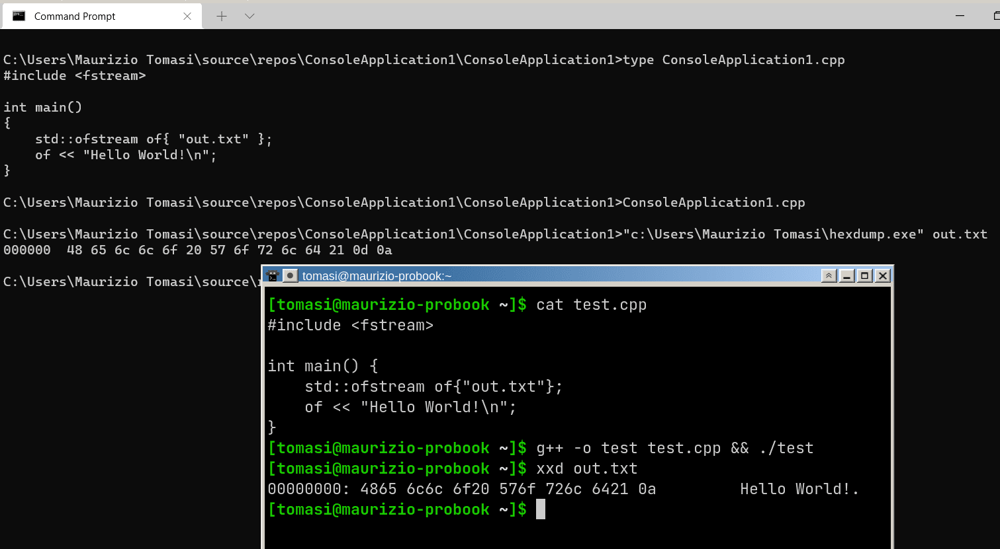
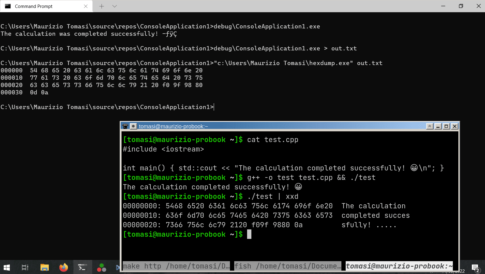
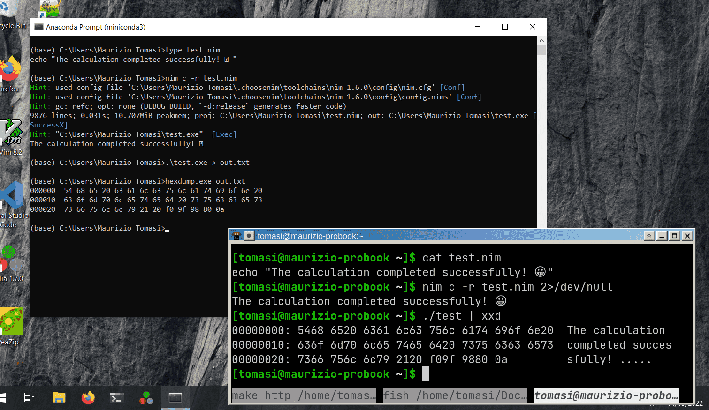
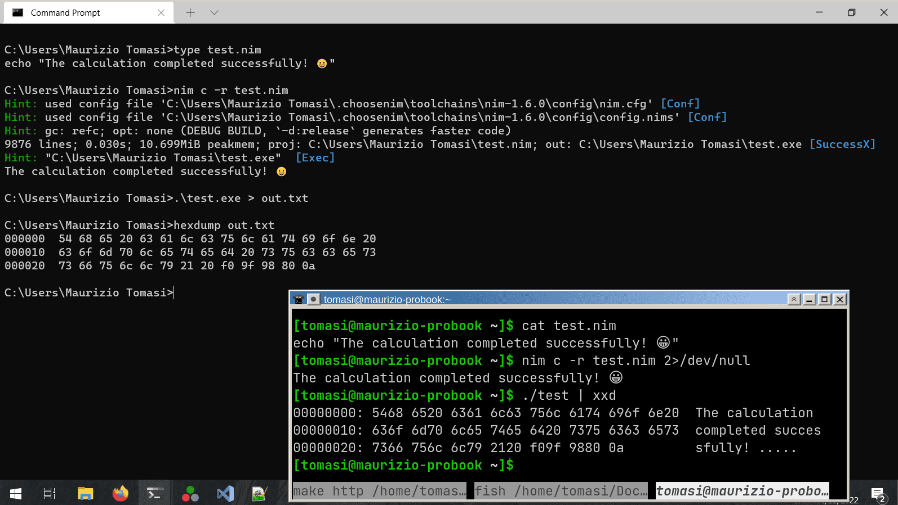
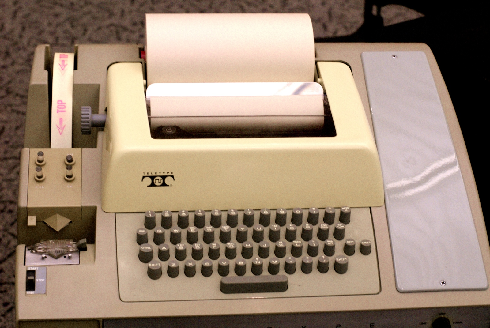
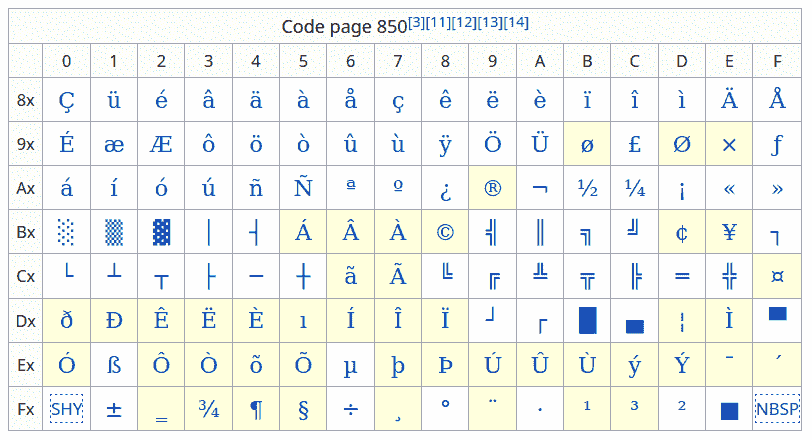
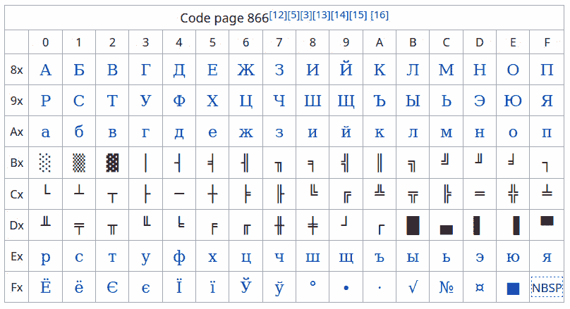
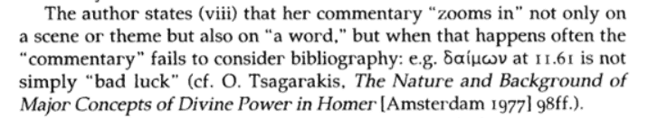
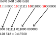
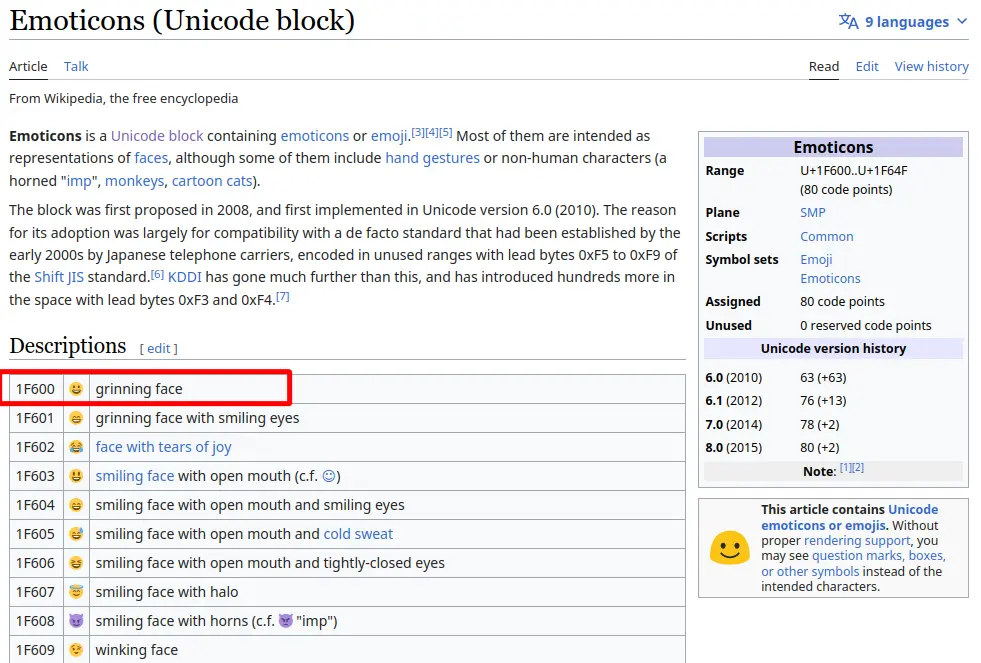

# Error Handling {#error-handling}

# Errors

-   In the last exercise we implemented the `HdrImage` type.
-   This week we will implement the functions to read and write PFM files.
-   Reading and writing files is an activity that is easily prone to errors:
    -   The target directory for saving the file does not exist, or it is write-protected
    -   The file specified by the user does not exist
    -   The file is corrupted
    -   The file is in a valid format but our code is not able to load it (e.g., a file is encoded with XYZ colors, but our code only supports RGB)


# Types of errors

-   Errors can be divided into two classes:

    #.  Programmer errors
    #.  User errors

-   An error should be handled according to its type (first or second).


# Programmer errors

-   This is a logical error in the program.
-   A "perfect" program should never have logical errors.
-   If there is evidence that a logical error has occurred, it should be reported **as loudly as possible**.


# Example

```python
my_list = [5, 3, 8, 4, 1, 9]
sorted_list = my_sort_function(my_list)

if not (len(my_list) == len(sorted_list)):
    print("Error, mismatch in the length of the sorted list")

# The program continues
...
```

---

<asciinema-player src="./cast/error_example1_83x23.asciinema" cols="83" rows="23" font-size="medium"></asciinema-player>


# Improved example

```python
my_list = [5, 3, 8, 4, 1, 9]
sorted_list = my_sort_function(my_list)

# If any "assert", the program will crash and will print details
# about what the code was doing. If PDB support is turned on,
# a debugger will be fired automatically.
assert len(my_list) == len(sorted_list)

# The program continues
...
```

---

<asciinema-player src="./cast/error_example2_83x23.asciinema" cols="83" rows="23" font-size="medium"></asciinema-player>


# Programmer Errors

-   All languages implement functions that allow crashing a program (e.g., `assert` and `abort` in C/C++).
-   These instructions usually print a series of details about the cause of the error to the screen and are intended to be used with a debugger.
-   Running a debugger makes sense: if the error is logical, it is the programmer who must intervene on the code, not the user!
-   Be aware that some of these functions may not be compiled in *release* mode (e.g., [`assert`](https://nim-lang.org/docs/assertions.html#assert.t,untyped,string) vs [`doAssert`](https://nim-lang.org/docs/assertions.html#doAssert.t%2Cuntyped%2Cstring) in Nim).


# User Errors

-   These are errors caused by incorrect input or context, and not due to an error in the program:
    -   The user requests to read a file that does not exist;
    -   The user requests to write a file to a medium that has no more free space;
    -   The user specifies incorrect input;
    -   The user requests to use a peripheral (printer?) that is not connected to the computer or is turned off.
-   They should be handled very differently from programmer errors: we don't want the program to crash in these cases!


# Example

```python
x = float(input("Insert a number: "))
y = float(input("Insert another number: "))
print(f"The ratio {x} / {y} is {x / y}")
```

# Example

```
$ python3 calc.py
Insert a number: 4
Insert another number: 3
The ratio 4.0 / 3.0 is 1.3333333333333333

$ python3 calc.py
Insert a number: 3
Insert another number: 0
Traceback (most recent call last):
  File "calc.py", line 3, in <module>
    print(f"The ratio {x} / {y} is {x / y}")
ZeroDivisionError: float division by zero
$
```

(Note: Python raises an exception if you divide a number by zero. Most of the languages return a `NaN` instead.)

# Handling User’s Errors

-   User errors are **inevitable**.
-   If there is evidence that the user has made a mistake, there are several ways to react:
    1.  Print an error message, as clear as possible;
    2.  Ask the user to enter the incorrect data again;
    3.  In specific contexts, the code can decide autonomously how to correct the error, e.g., clamping a value $x > b$ to the range $[a, b]$.


# Error Correction (1/2)

```python
x = float(input("Insert a number: "))
y = float(input("Insert another number: "))
if y != 0.0:
    print(f"The ratio {x} / {y} is {x / y}")
else:
    print("Error, the second number cannot be zero!")
```


# Error Correction (2/2)

```python
x = float(input("Insert a number: "))

while True:
    y = float(input("Insert another number: "))
    if y == 0.0:
        print("Error, the second number cannot be zero!")
    else:
        break

print(f"The ratio {x} / {y} is {x / y}")
```


# Corrected Program

```
$ python calc.py
Insert a number: 3
Insert another number: 0
Error, the second number cannot be zero!
Insert another number: 2
The ratio 3.0 / 2.0 is 1.5
$
```

(There is still room for improvement: the program would crash if the user enters `pippo` as input…)

# User’s Errors in Functions

-   It is usually very simple to decide how to handle user’s errors in the `main` function of a program.
-   It is less clear, however, how to handle errors in the input passed to a function or method. Who is responsible for the invalid input?
    -   The calling program?
    -   The user?


# Example: root finding

The method `Bisection::FindRoot()` searches for the root of a function within an interval `[a, b]`, provided that Weierstrass’ theorem holds.

```c++
double Bisection::FindRoot(double a, double b) {
    if(f->Eval(a) * f->Eval(b) < 0) {
        // Weierstrass’ theorem holds. Hurrah!
    } else {
        // The hypotheses of Weierstrass’ theorem do not hold here.
        // What should I do now?
    }
}
```

# Example: root finding

<table width="90%">
<thead>
<tr>
<th>First case</th>
<th>Second case</th>
</tr>
</thead>
<tbody>
<tr>
<td>
```c++
int main() {
  // …

  double a, b;
  // The program calculates its own
  // values for a and b: if they are
  // wrong, blame the programmer!
  a = sin(3 * nu / 4 * k);
  b = cos(3 * nu + psi);
  bis.FindRoot(a, b);
}
```

</td>
<td>

```c++
int main() {
  // …

  double a, b;
  // The program asks the user for the
  // values for a and b: if they are
  // wrong, blame the user!
  cout << "Enter a: ";
  cin << a;
  cout << "Enter b: ";
  cin << b;
  bis.FindRoot(a, b);
}
```
</td>
</tr>
</tbody>
</table>


# General Rule

-   As a general principle, no function or method should do anything catastrophic (crash the program) or **visible** (print an error message to the screen).
-   The responsibility for the User Interface usually belongs to the `main` function.
-   The **golden rule**: a function should either return an error signal (error code/optional type) or raise an exception, letting the caller decide how to handle it.


# Exceptions {#exceptions}


# Exceptions

-   An exception is used to «crash» a program in a controlled way:

    ```python
    def my_function(...):
        if something_wrong:
            raise Exception("Error!")
    ```

-   Unlike functions like `abort`, the crash can be suspended or interrupted (in jargon, «caught»), and the exception can signal the type of error that caused its creation.

---

<asciinema-player src="./cast/exceptions-100x23.cast" cols="100" rows="23" font-size="18"></asciinema-player>


# Exceptions are typed

An exception is a type of *crash* that is **typed**: `ValueError`, `ZeroDivisionError`, etc.

```python
def f(x, y):
    return x / y

try:
    x = float(input("Enter the first number:"))
    y = float(input("Enter the second number:"))
    print(f"The result of {x} / {y} is {x / y}")
except ZeroDivisionError:
    print("Error! The value for y must be different than zero")
except ValueError:
    print("Error! You must provide two floating-point numbers")
```

# Raising exceptions

-   Exception types can contain additional information

-   This is extremely useful when you want to know *why* an exception occurred:

    ```python
    class WrongNumber(Exception):
        def __init__(self, num):
            self.num = num

    try:
        x = float(input("Enter some number: "))
        if x > 3:
            raise WrongNumber(num=x)
    except WrongNumber as e:
        print("You entered a number that is too large: ", e.num)

    # Enter some number: 5
    # You entered a number that is too large: 5
    ```


# Propagating Exceptions

-   An exception that is not caught propagates along the entire chain of callers.

-   It can be caught at any level:

    ```python
    def f():
        raise Exception("Error!")

    def g():
        f()

    def h():
        try:      # You can capture exceptions within functions, of course
            g()   # g doesn't raise exceptions, but f() does
        except:
            print("Got an exception!")
    ```


# Performance

- Exceptions slow down programs because the compiler must insert "hidden" code to handle them ([in-depth video](https://www.youtube.com/watch?v=Oy-VTqz1_58))

- Some languages (Rust, Go…) do not support them, in others they can be disabled ([`noexcept`](https://en.cppreference.com/w/cpp/language/noexcept) in C++, [`nothrow`](https://dlang.org/spec/function.html#nothrow-functions) in D…)

- In the program we will develop we will use an efficient approach:

    - We will read input from the user, using exceptions to signal serious errors;
    - We will calculate the solution of the rendering equation, **avoiding exceptions** because this will be the slowest part;
    - We will save the result to a file, using exceptions again.


# Alternatives to Exceptions


# Error Parameters

- An additional parameter can be accepted to signal the error:

    ```c++
    double Bisezione::CercaZeri(double a, double b, bool & error) {
        error = false;

        if (m_f->Eval(a) * m_f->Eval(b) > 0.0) {
            error = true;
            return 0.0;
        }

        // ...
        return result;
    }
    ```

- Instead of a `bool`, you can use a class to record the type of error and complex information.


# Nullable Types

- Languages like C# and Kotlin define the *nullable* type, which can be used with any type, and indicates its *absence*:

    ```csharp
    // C# example

    // Note the "?" after "double": this is the same syntax as in Kotlin
    double? result = my_function(...);

    if (! result.HasValue)
    {
        // Something wrong happened, my_function didn't compute the result
    }
    ```

- Check if the standard library of your language implements this functionality ([`std::optional`](https://en.cppreference.com/w/cpp/utility/optional) in C++17, [`std::expected`](https://en.cppreference.com/w/cpp/utility/expected) in C++23, [Option](https://nim-lang.org/docs/options.html) in Nim…)


# Result Types

- In Rust there is the `Result` type, which is a more versatile version of *nullable* (like C++23’s [`std::expected`](https://en.cppreference.com/w/cpp/utility/expected)).

- The `Result` type is a *sum type* (we will see them better later) that acts as type `A` in case of success and type `B` in case of failure:

    ```rust
    pub struct OutputData {
        pub mass: f32;
        pub charge: f32;
    };

    pub struct SomeError {
        pub message: String;
    };

    fn compute_quantities(…) -> Result<OutputData, SomeError> { … }
    ```


# Binary and Text Files {#binary-and-text-files}

# Binary Files

-   Binary files are the simplest type: they consist of a sequence of bytes (where each byte consists of 8 bits).

-   Each byte can contain an integer value in the range 0–255

-   To print the content of a binary file you can use the `xxd` command (on Ubuntu, install it with `sudo apt install xxd`):

    ```text
    $ xxd file.bin
    ```

    (On other operating systems you might have `hexdump` instead of `xxd`).

-   Saving data in a binary file means writing a sequence of binary numbers to the hard disk, stored as bytes.


# Binary Content of a File

<asciinema-player src="./cast/binary-files-73x19.cast" cols="73" rows="19" font-size="medium"></asciinema-player>


# From Binary to Decimal

-   To interpret the values of bytes, binary numbering is used, which obviously uses the number 2 as its base:

    ```
    0  → 0
    1  → 1
    2  → 10
    3  → 11
    4  → 100
    …
    ```

-   For a number `dcba` expressed in base $B$, its value is

    $$
    \text{value} = a \times B^0 + b \times B^1 + c \times B^2 + d \times B^3.
    $$

    Therefore, the binary value `100` corresponds to $0 \times 2^0 + 0 \times 2^1 + 1\times 2^2 = 4.$


# Hexadecimal Notation

-   Binary notation, however, is cumbersome because numbers quickly require many digits (131 requires 8 bits in binary!).

-   As an alternative to binary notation, hexadecimal (base 16) notation is widely used, which uses the digits

    ```
    0 1 2 3 4 5 6 7 8 9 A B C D E F
    ```

-   Hexadecimal notation requires 4 bits per digit, because $2^4 = 16$. Since a byte is composed of 8 bits, the value of a byte can always be encoded using only two hexadecimal digits (`0xFF = 255`).

-   In C/C++/D/Nim/Rust/Julia/C#/Kotlin, hexadecimal numbers are written with `0x`, e.g., `0x1F67 = 8039` (in some languages `0b` introduces a binary number).


# Bit Order in a Byte

-   There's always an underlying ambiguity in grouping bits into bytes, and it lies in their order.

-   If a byte is formed by the bit sequence `0011 0101`, there are two ways to interpret it:

    $$
    \begin{aligned}
    2^0 + 2^2 + 2^4 + 2^5 &= 53,\\
    2^2 + 2^3 + 2^5 + 2^7 &= 172.
    \end{aligned}
    $$


# Bit Endianness

-   The order of bits in a byte is called *bit-endianness*, a term taken from *Gulliver's Travels* (1726) by J. Swift:

    1.  *Big-endian* encoding starts from the *highest* power ("big");
    2.  *Little-endian* encoding starts from the *lowest* power ("little").

-   Fortunately, *bit endianness* will not be something we have to worry about in our code, because the hardware abstracts it.

-   However, we will have to deal with *byte endianness*!


# Using More Than 8 Bits

-   An 8-bit number can take values from 0 to 255.

-   That's a very small range! But you can combine multiple bytes together.

-   In C++ there are the types `int16_t` (16 bits → 2 bytes), `int32_t` (32 bits → 4 bytes), `int64_t` (64 bits → 8 bytes).

    <center>
    { height=280px }
    </center>


# Byte Endianness

-   If you combine multiple bytes together, there's the *endianness* problem again!

-   For example, the 16-bit hexadecimal number 1F3D (2 bytes) is encoded with the byte pair `1F 3D` (*big-endian*) or `3D 1F` (*little-endian*)?

-   In this case too, we speak of *big-endian* or *little-endian* byte encoding. Intel and AMD CPUs used in personal computers today all use *little-endian* encoding. *Big-endian* encoding is instead the standard for network transmissions (and is still used today in some ARM CPUs).

-   Unlike *bit endianness*, we will have to worry about *byte endianness* when handling PFM files 🙁


# Binary and Text Data

-   In addition to the *endianness* problem, you also need to understand how your language handles binary files. Look at this C++ example:

    ```c++
    #include <fstream>

    int main() {
      int x{138};  // 138 < 256, so the value fits in *one* byte
      std::ofstream outf{"file.bin"};
      outf << x; // Ouch! It writes *three* bytes: '1', '3', '8'
    }
    ```

    The value `138` has been saved in *textual form*! (To write it in binary form, you must use `outf.write()`.)

-   Let's now see the secrets of text encoding.


# Text Encoding

# Text Encoding

-   The PFM format is composed of a textual part and a binary part

-   But you have already dealt with text files: they are your source codes!

-   Some of you may also have had error messages from Git regarding strange `CRLF` character conversions

-   Let's now see in detail the text encoding of files. This is useful for us because of two contexts:

    1.  Comments in the code;
    2.  Writing messages to the user.

---

<center>

</center>

---

<center>

</center>

---

<center>

</center>

---

<center>

</center>

---

<center>

</center>

# Text Encoding

-   Computer characters are encoded using numbers; the most common encoding is ASCII:

    -   The letter `A` is encoded by the number 65, `B` by 66, `C` by 67, etc.;
    -   The letter `a` is encoded by the number 97, `b` by 98, etc.;
    -   The digit `0` is encoded by the number 48, `1` by 49, etc.

-   Encoding a word like `Casa` means representing the word with the sequence of values `67 97 115 97 = 0x43 0x61 0x73 0x61`.

-   These numeric codes are part of the ASCII standard, which specifies 128 characters. ([Here is the complete table](https://garbagecollected.org/2017/01/31/four-column-ascii/), well explained).


# Encoding of Texts

-   The ASCII standard is very simple, yet sufficient for encoding texts:

    ```text
    Beauty - be not caused - It Is -
    Chase it, and it ceases -
    Chase it not, and it abides -

    Overtake the Creases

    In the Meadow - when the Wind
    Runs his fingers thro' it -
    Deity will see to it
    That You never do it -

    (Emily Dickinson, 1863)
    ```

-   How is the end of a line encoded in each line of the poem?

-   Is it possible to encode *all* characters using 128 values?


# Line Breaks

-   The way to indicate a line break depends on the operating system!

-   On typewriters, there were two operations required to start a new line (see [this YouTube video](https://www.youtube.com/watch?v=r97JHr13T98)):

    1.  Return to the edge of the sheet (*carriage return*, horizontal movement);
    2.  Move to the next line (*line feed*, vertical movement).

-   In ASCII encoding, there is a character for each of the two commands, corresponding to `13` (*carriage return*, also indicated as `\r`) and `10` (*line feed*, indicated by `\n`). These were essential for *teletype* terminals, and usually `\r` preceded `\n` because it took longer to execute.


# Teletype Terminal [ASR-33](http://bytecollector.com/asr_33.htm)

<center>
{height=520px}
</center>
See this [link](https://www.howtogeek.com/727213/what-are-teletypes-and-why-were-they-used-with-computers/) for some history on this type of terminal.

# Types of Newlines

-   Today, teletype terminals are no longer used, but `\n` and `\r` are still in use.

-   The type of newline depends on the operating system used:

    | Operating System   | Encoding         |
    |--------------------|------------------|
    | MS-DOS, Windows    | `13 10` (`\r\n`) |
    | RISC OS            | `10 13` (`\n\r`) |
    | C64, macOS classic | `13` (`\r`)      |
    | Linux, Mac OS X    | `10` (`\n`)      |

-   Git expects the Linux format (`\n`) in files added with `git add`


# Beyond 127 Characters

-   Even though ASCII was born for computers with 7 bits per byte, computer manufacturers soon standardized the use of 8-bit bytes (more convenient because it is a power of 2)

-   Since $2^8 = 256$, this means that the numbers 128–255 are unused in ASCII: a waste!

-   To meet the needs of non-English speaking users, *code pages* were invented

-   A *code page* is a table of correspondences between numbers 128–255 and characters


# *Code page* examples

Code page 850 (latin)




# *Code page* examples

Code page 866 (cyrillic)




# Discussion: how would you implement code page support in your own code?


# The C locale functions

-   The C language implements the concept of “locale” through [`setlocale()`](https://en.cppreference.com/w/c/locale/setlocale).

-   This is a *global* switch: it changes the locale everywhere in the code, not just within the function where `setlocale()` was called.

-   Apart from country locales (Italy, France, etc.), there is a “special” locale called “C”, which is the [most basic](https://devblogs.microsoft.com/oldnewthing/20250206-00/?p=110846) and just follows the rules of the C language: no thousand separator, a dot to separate the decimal part from the integer part, and only ASCII letters (`a`…`z`) are considered by functions like [`towupper()`](https://en.cppreference.com/w/cpp/string/wide/towupper).

-   Locales and code pages are probably one of C’s most spectacular failures.


# Issues with *code pages*

-   If this command is executed on an MS-DOS system using *code page* 850:

    ```
    c:\> echo è > file.txt
    ```

    the first byte of the file would have the value `130`, and would be displayed correctly:

    ```
    c:\> type file.txt
    è
    ```

-   However, copying the file to a computer with *code page* 866, you would get this:

    ```
    c:\> type file.txt
    ѓ
    ```


# Issues with *code pages*

-   We have seen that ASCII is a system centered on the writing system used in the USA, and does not include accented characters such as «è», «é», «ü», «â», etc.

-   The *code page* system soon showed its limits: how to write texts where multiple writing systems are required simultaneously?

    <center></center>

-   In addition to accents on Latin letters, there are many other alphabets and symbols in the world, both contemporary (Greek, Cyrillic, Chinese, mathematical symbols, etc.) and ancient (Egyptian hieroglyphs, Akkadian cuneiform characters)


# The Unicode Standard {#unicode}

-   International standard born in 1991, which covers practically all the writing systems existing in the world today.

-   Today it is almost universally supported.

-   It is updated periodically (about once a year).

-   It supports both modern scripts (Latin, Cyrillic, Hebrew, Arabic…) and ancient ones (Egyptian hieroglyphs: 𓀃, Sumerian-Akkadian script: 𒀄)

-   It also has excellent support for mathematical characters (∞, ∈, ∀), emoticons (😀, 😉), musical symbols (♭, ♯, 𝄞), etc.


# Unicode Releases

| Version | Date           | Scripts | Characters |
|---------|----------------|---------|------------|
| 1.0     | October 1991   | 24      | 7,129      |
| …       |                |         |            |
| 15.0    | September 2022 | 161     | 149,186    |
| 15.1    | September 2023 | 161     | 149,813    |
| 16.0    | September 2024 | 168     | 154,998    |
| 17.0    | September 2025 | 172     | 159,801    |


# Unicode Character Examples

-   Uppercase letter A: `A` (65, same as ASCII!);
-   Lowercase letter A with acute accent: `à` (224);
-   Uppercase letter E with grave accent: `É` (201);
-   Ellipsis: `…` (8230);
-   Flat symbol: `♭` (9837);
-   Grinning face emoji: `😀` (128,512).


# Unicode Encoding

-   Each Unicode character is associated with a number, called *code point*.

-   Characters can be [combined together](https://en.wikipedia.org/wiki/Combining_character), for example by joining `a` and `^` to form `â`.

-   The most common accented letters, however, have a [dedicated encoding](https://en.wikipedia.org/wiki/Precomposed_character). These letters can therefore be encoded in **multiple ways** according to the Unicode standard. (This makes comparing two strings complicated!)

-   A *grapheme* is the result of a combination of one or more code points. Therefore, the word `così` is composed of four graphemes: `c`, `o`, `s`, and `ì` (which can be the *code point* 236, or the combination of the code points `i` and `` ` ``).

-   The combination of different characters is very important in certain scripts like Chinese.


# Encoding *Code Points*

-   The Unicode standard has many *code points*, and new ones are added with each version.

-   This poses a problem in encoding *code points* in files: ASCII used one byte per character because the set was limited. But for Unicode, how many bytes per *code point* should be used? One? Two? One hundred?

    -   Choosing a low value would limit the extensibility of Unicode.
    -   Choosing a very high value would unnecessarily increase the size of text files.


# Discussion: how would you solve this problem?


# Encodings Used Today

-   Historically, various encodings have been proposed for Unicode.

-   The most used today are the UTF (Unicode Transformation Format) encodings, which exist in three versions:

    -   UTF8 (used in Linux and macOS systems);
    -   UTF16 (used in Windows);
    -   UTF32 (very convenient from a software perspective).


# UTF-8

-   It is the most used encoding today (except under Windows 😢).

-   The number of bytes used for a *code point* varies from 1 to 4.

-   It is compatible with ASCII encoding: an ASCII file is automatically also a valid UTF-8 file.

-   It takes advantage of the fact that ASCII encoding uses only 7 of the 8 bits in a byte, and that the first 127 Unicode *code points* are the same as the ASCII values.


# UTF-8 Encoding

| Code point           | Byte 1     | Byte 2     | Byte 3     | Byte 4     |
|----------------------|------------|------------|------------|------------|
| `0x0000`–`0x007F`    | `0xxxxxxx` | —          | —          | —          |
| `0x0080`–`0x07FF`    | `110xxxxx` | `10xxxxxx` | —          | —          |
| `0x0800`–`0xFFFF`    | `1110xxxx` | `10xxxxxx` | `10xxxxxx` | —          |
| `0x10000`–`0x10FFFF` | `11110xxx` | `10xxxxxx` | `10xxxxxx` | `10xxxxxx` |

---

<center>

</center>

---

<center>

</center>

---

<center>

</center>


# UTF-16 Encoding

-   It works like UTF-8 encoding, but uses pairs of bytes ($8 + 8 = 16$).

-   A *code point* can be encoded by two or four bytes.

-   There is a problem of *endianness* here: is the value `0x2A6C` written as the byte pair `0x2A 0x6C` (*big endian*) or `0x6C 0x2A` (*little endian*)?

-   In text files encoded with UTF-16, the so-called BOM (*byte-order marker*) is inserted at the beginning of the file, which corresponds to the *code point* `0xFEFF`. If the first two bytes of a file are `0xFE 0xFF`, then the file uses *big endian*; if they are `0xFF 0xFE`, it uses *little endian*. (UTF-8 also has a BOM: `0xEF 0xBB 0xBF`, but it’s discouraged).

-   UTF-16 is used by Windows and in Java-based languages (Kotlin, Scala, etc.).


# UTF-32 Encoding

-   Obviously, it uses 32 bits per *code point*.

-   In this case, there is no ambiguity: each code point uses exactly four bytes.

-   It is obviously the most inefficient encoding in terms of space occupied: Emily Dickinson's poem occupies 232 bytes in ASCII/UTF-8, but it would occupy 928 bytes in UTF-32 (four times as much!).

-   However, it is the simplest encoding: each code point always occupies the space of a `uint32_t` type in C/C++.


# Binary and Text Files

-   What we discussed today explains why it is often more advantageous to use *binary files* instead of text files: it is much easier for a program to read and write them!

-   Almost all graphic formats used today (PNG, JPEG, GIF, etc.) are based on binary encodings.

-   However, text files have some significant advantages:

    -   They are easier for a human to read and write;

    -   They do not have *endianness* problems.

-   Furthermore, there is an important type of text file that you have already started using: your **source code**!


# Source File Encoding

-   Almost all languages require keywords and symbols that are limited to ASCII characters (some also allow Unicode characters in variable and function names, such as Julia and Python)

-   However, in the slides shown earlier we saw that literal strings can also be inserted into programs:

    ```python
    print("The calculation completed successfully! 😀")
    ```

-   How to ensure that the code is interpreted correctly?


# Source File Encodings

-   Some languages impose an encoding (UTF-8 for [Nim](https://nim-lang.org/docs/manual.html#lexical-analysis-encoding) and [Rust](https://doc.rust-lang.org/reference/input-format.html)…), UTF-16 for C# and Java/Kotlin)

-   [D](https://dlang.org/spec/lex.html#source_text) supports everything: UTF-8, UTF-16, UTF-32, with any *endianness*

-   Python, in principle, allows [any encoding](https://peps.python.org/pep-0263/), indicated by a comment at the beginning of the file:

    ```python
    #!/usr/bin/env python3
    # -*- encoding: utf-8 -*-
    ```

-   C++'s relationship with Unicode is complicated! `clang` uses UTF-8, GCC allows it from the command line (`-finput-charset=`)…


# Source File Encodings

-   But this only solves part of the problem because if the program prints a UTF-8 string, you must ensure that the system running the program recognizes UTF-8 (See the screenshots at the beginning of this section).

-   Pay attention to the encoding used by your editor; some editors allow you to specify the encoding in a comment at the beginning of the file (see the manual for [Emacs](https://www.gnu.org/software/emacs/manual/html_node/emacs/Specify-Coding.html) and [Vim](https://vim.fandom.com/wiki/How_to_make_fileencoding_work_in_the_modeline))

-   All modern editors allow you to change the encoding of a file

-   From the command line, you can use the [`iconv`](https://en.wikipedia.org/wiki/Iconv) program


# Conclusions

-   It is important to support Unicode in your programs, **if they need to handle user-entered text** (Spoiler: this is not the case for our ray-tracer, fortunately!)

-   To use Unicode, we must abandon some assumptions that we Italians (Americans/French/etc.) have ingrained

-   For example, [there are letters based on the Latin alphabet](https://devblogs.microsoft.com/oldnewthing/20241031-00/?p=110443) that have a **third** form in addition to uppercase and lowercase

-   We don't need to know Unicode so well in our lessons, but I recommend everyone to explore the topic further! Some references: [The Absolute Minimum Every Software Developer Absolutely, Positively Must Know About Unicode and Character Sets (No Excuses!)](https://www.joelonsoftware.com/2003/10/08/the-absolute-minimum-every-software-developer-absolutely-positively-must-know-about-unicode-and-character-sets-no-excuses/), [Unicode programming, with examples](https://begriffs.com/posts/2019-05-23-unicode-icu.html)


---
title: "Lesson 3"
subtitle: "Calcolo numerico per la generazione di immagini fotorealistiche"
author: "Maurizio Tomasi <maurizio.tomasi@unimi.it>"
...
