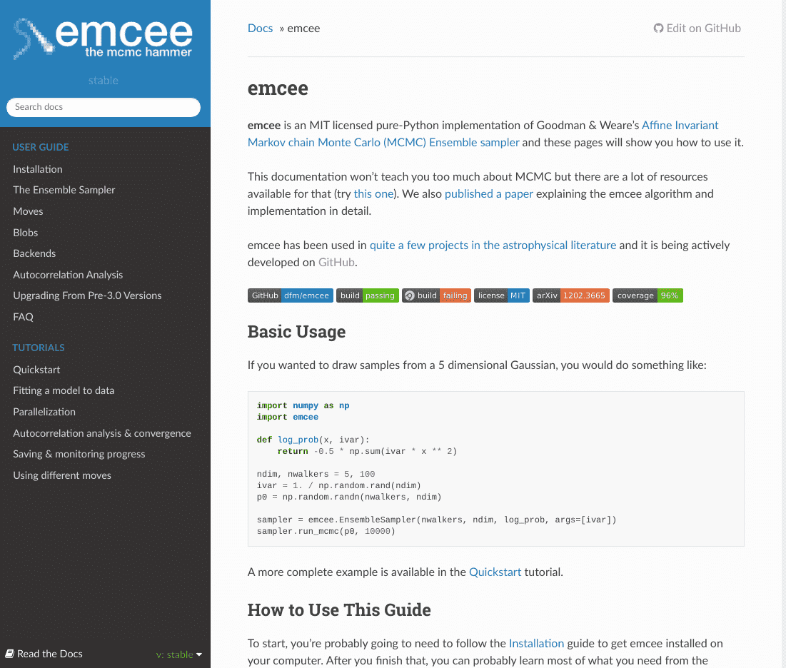
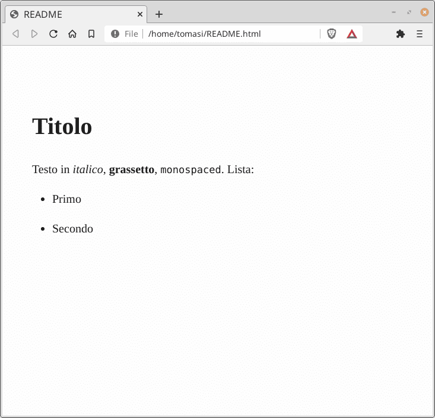
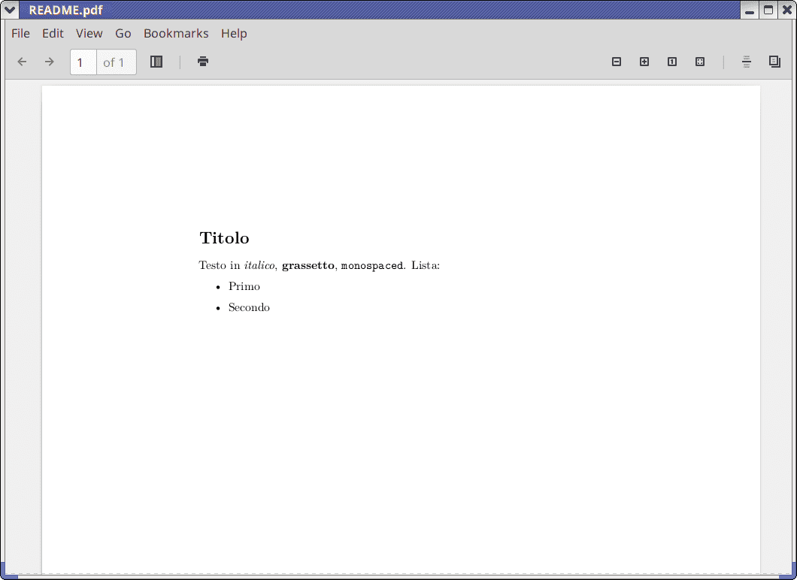
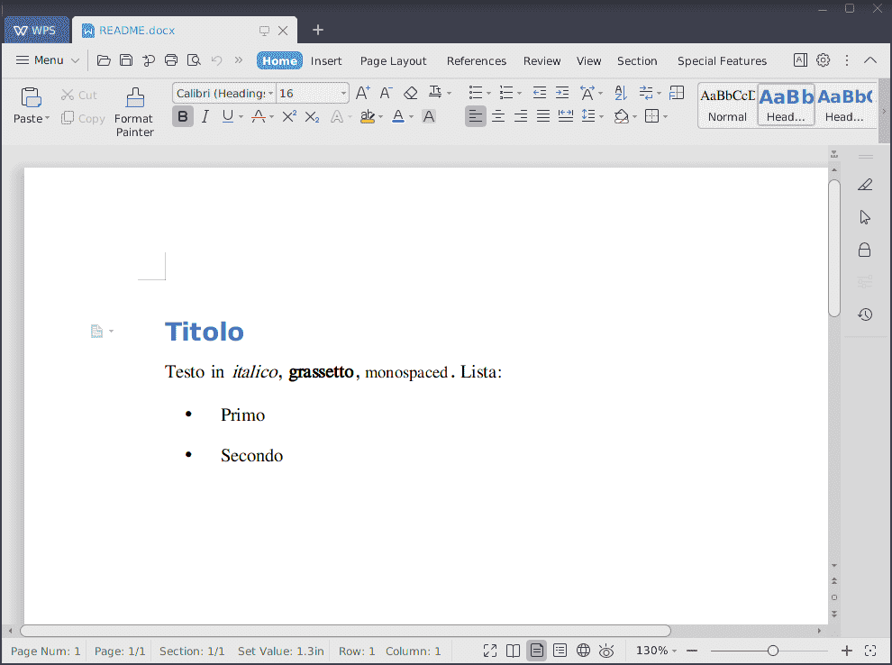
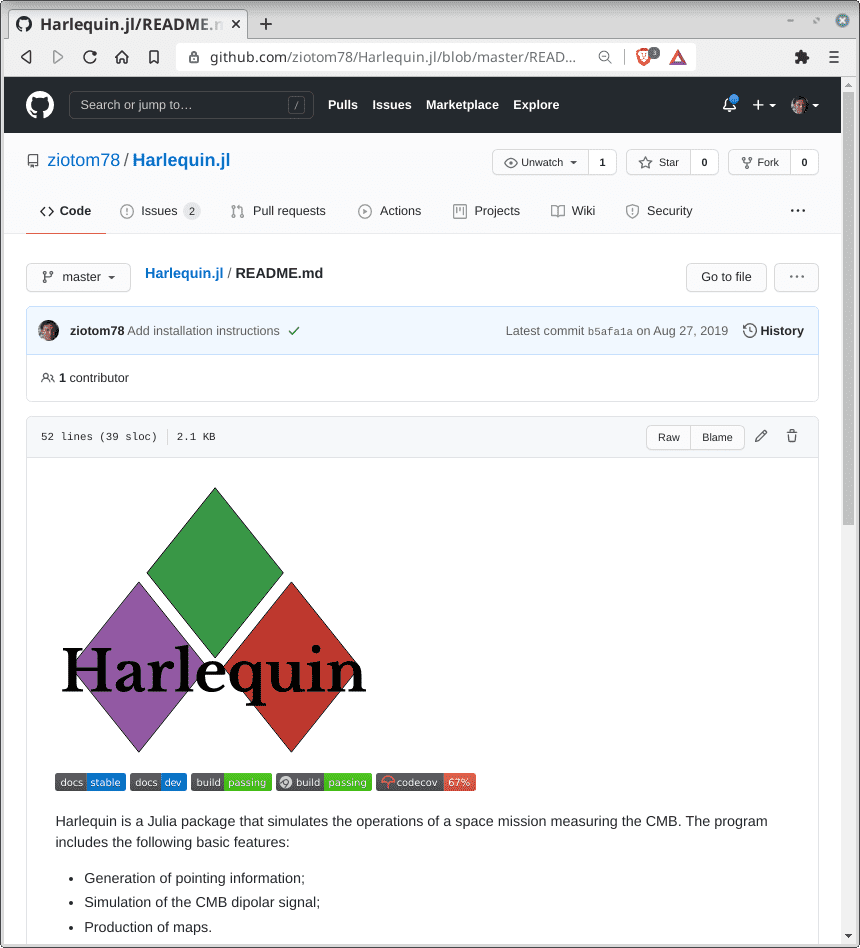

# Tone mapping

---

<center>

</center>

# Tone mapping

-   Una conversione da RGB a sRGB dovrebbe preservare la «tinta» complessiva di un'immagine.
-   Ecco perché non si parla di *tone mapping* per un singolo colore RGB, ma per una matrice di colori (ossia un'immagine).
-   Noi useremo il *tone mapping* descritto da [Shirley & Morley (2003)](https://books.google.it/books/about/Realistic_Ray_Tracing_Second_Edition.html?id=ywOtPMpCcY8C&redir_esc=y): è fisicamente meno preciso di altri metodi (es., la normalizzazione dello standard CIE usando D65), ma più intuitivo e più semplice da implementare.

# Algoritmo di tone mapping

1.  Stabilire un valore «medio» per l'irradianza misurata in corrispondenza di ogni pixel dell'immagine;
2.  Normalizzare il colore di ogni pixel a questo valore medio;
3.  Applicare una correzione ai punti di maggiore luminosità.

# Valore medio

-   Il valore «neutro» per la radianza è definito dalla media logaritmica della luminosità $l_i$ dei pixel (con $i = 1\ldots N$):
    $$
    \left<l\right> = 10^{\frac{\sum_i \log_{10}(\delta + l_i)}N},
    $$
    dove $\delta \ll 1$ evita la singolarità di $\log_{10} x$ in $x = 0$.

-   A ciascun pixel sono però associati tre valori scalari (R, G, B). Quale valore usare per la luminosità $l_i$?

# Luminosità

Media aritmetica
: $l_i = \frac{R_i + G_i + B_i}3$;

Media pesata
: $l_i = \frac{w_R R_i + w_G G_i + w_B B_i}{w_R + w_G + w_B}$, data una terna di valori positivi $(w_R, w_G, w_B)$;

Distanza dall'origine
: $l_i = \sqrt{R_i^2 + G_i^2 + B_i^2}$;

Funzione di luminosità
: $l_i = \frac{\max(R_i, G_i, B_i) + \min(R_i, G_i, B_i)}2$

Shirley & Morley usano l'ultima definizione perché sostengono che, nonostante non sia fisicamente significativa, produca risultati visivamente migliori.

# Perché la media logaritmica?

-   Non abbiamo ancora giustificato la formula
    $$
    \left<l\right> = 10^{\frac{\sum_i \log_{10}(\delta + l_i)}N},
    $$

-   Essa è plausibile perché la risposta dell'occhio a uno stimolo $S$ è logaritmica (*leggi di Weber-Fechner*):
    $$
    p = k \log_{10} \frac{S}{S_0}
    $$
    dove $p$ è il valore percepito, e $S$ è l'intensità dello stimolo.

# Proprietà della media logaritmica

-   La media logaritmica è una media sugli *esponenti*, mentre la media aritmetica è una media sui valori;

-   Nel caso i valori siano $10^2$, $10^4$ e $10^6$, la media logaritmica è
    $$
    10^{\frac{\log_{10} 10^2 + \log_{10} 10^4 + \log_{10} 10^6}3} = 10^4,
    $$
    mentre la media aritmetica è $(10^2 + 10^4 + 10^6)/3 \approx 10^6/3$.


# Normalizzazione

-   Una volta stimato il valore medio, i valori R, G, B dell'immagine sono aggiornati tramite la trasformazione

    $$
    R_i \rightarrow a \times \frac{R_i}{\left<l\right>},
    $$

    dove $a$ è un valore impostabile dall'utente.

-   Curiosamente, nel loro libro Shirley & Morley suggeriscono $a = 0.18$; in realtà non esiste un valore «giusto», e $a$ si deve scegliere a seconda dell'immagine.


# Punti luminosi

<center>{height=520}</center>

Sono notoriamente difficili da trattare!

# Punti luminosi

Shirley & Morley suggeriscono di applicare ai valori R, G, B di ogni punto dell'immagine la trasformazione
$$
R_i \rightarrow \frac{R_i}{1 + R_i},
$$
che ha le seguenti caratteristiche:
$$
\begin{aligned}
R_i \ll 1 &\Rightarrow R_i \rightarrow R_i,\\
R_i \gg 1 &\Rightarrow R_i \rightarrow 1.
\end{aligned}
$$

# Punti luminosi

<center>
```{.gnuplot im_fmt="svg" im_out="img" im_fname="bright-point-transformation"}
set terminal svg
set xlabel "Input"
set ylabel "Output"
plot [0:10] [] x/(1 + x) lw 4
```
</center>

# Correzione γ

-   Potremmo voler applicare una correzione γ ai valori dell'immagine.

-   Se in corrispondenza di un segnale $x$ il monitor emette un flusso

    $$
    \Phi \propto x^\gamma,
    $$

    allora i valori RGB da salvare nell'immagine LDR devono essere

    $$
    r = \left[2^8\times R^{1/\gamma}\right],\quad
    g = \left[2^8\times G^{1/\gamma}\right],\quad
    b = \left[2^8\times B^{1/\gamma}\right],
    $$

---

<center>

</center>


# Documentazione

# Commenti nel codice

-   Tutti sanno che è importante scrivere commenti nel codice!

-   Un commento aiuta chi legge il codice a capire cosa quel codice faccia

-   Può aiutare voi stessi! Se tra un anno leggerete il codice scritto oggi, siete sicuri che ricorderete perché l'avevate scritto così?

# Commenti da evitare

-   I commenti però non devono essere pedanti: non è necessario commentare cose ovvie, magari evitando di commentare cose importanti

    ```c++
    // Initialize variable "a" and set it to zero
    int a = 0;
    // Cycle over the vector "v"
    for(auto elem : v) {
        // Increment a by 2*sin(elem)
        a += 2 * sin(elem);
    }
    // One year from now: «Wait! but… why were we doing this calculation in the first place?»
    ```

-   Se in una funzione sentite che è necessario mettere molti commenti per renderla chiara, forse la funzione non è scritta bene

# *Docstrings*

-   Gli editor moderni sono in grado di leggere commenti messi in testa a classi/metodi/funzioni/tipi, e visualizzarli in certi contesti (ad esempio quando spostate il mouse su una chiamata di funzione)

-   Abituatevi a fare affidamento a questa caratteristica: vi insegnerà come scrivere meglio i commenti, e vi evita di andare avanti e indietro nel codice

-   Di solito, per dichiarare una *docstring* dovete iniziare un commento con un carattere o una stringa speciale, ad esempio:

    ```c++
    // Plain comment in C++
    int f(int x)  { return 2 * x; }

    /// Docstring: it begins with three '/' instead of two
    int g(int x)  { return 3 * x; }
    ```

---

<iframe src="https://player.vimeo.com/video/683431827?h=9e4de4dba1&amp;badge=0&amp;autopause=0&amp;player_id=0&amp;app_id=58479#t=12m00s" width="1280" height="720" frameborder="0" allow="autoplay; fullscreen; picture-in-picture" allowfullscreen title="Come usare una IDE (JetBrains Rider)"></iframe>


# Il file README

-   Quando si pubblica un progetto su GitHub, è fondamentale includere un README:
    -   La quantità di FOSS (Free and Open Source Software) su Internet è impressionante;
    -   Gli utenti hanno bisogno di capire in poco tempo se un progetto fa al caso loro o no;
    -   Un README oggi combina la funzione di un annuncio pubblicitario (nel senso buono!) e di primo manuale d'uso.
-   È quindi indispensabile avere un `README` nei propri repository.
-   In effetti, quando create un nuovo repository in GitHub, vi viene proposto di generarne uno automaticamente!

---

<center>

</center>

# Scopo del README

-   È il primo documento in cui si imbatte un potenziale utente.
-   Deve comunicare in maniera concisa questi concetti:
    1.  A cosa serve il programma;
    2.  Cosa richiede per funzionare (Windows? Linux? una GPU? una
        stampante?);
    3.  Come si installa;
    4.  Esempi pratici che mostrino cos'è in grado di fare il
        programma (possibilmente più d'uno: partire da casi semplici e mostrare sinteticamente almeno un caso realistico);
    5.  Licenza d'uso.
-   Non deve addentrarsi troppo nei dettagli.

---

-   Cercate di essere *chiari* ma anche *sintetici*!
-   Esempio negativo ([`boost.array`](https://www.boost.org/doc/libs/1_74_0/doc/html/array.html)). L'introduzione inizia così:

    > The C++ Standard Template Library STL as part of the C++
    > Standard Library provides a framework for processing algorithms
    > on different kind of containers. However, ordinary arrays don't
    > provide the interface of STL containers (although, they provide
    > the iterator interface of STL containers).

    Un intero paragrafo, e ancora non si dice cosa faccia la libreria!
    (Non viene detto neppure nel paragrafo successivo…)

# Esempio: [emcee](https://emcee.readthedocs.io/en/stable/)

<center>
{height=620px}
</center>

# Struttura di un README

-   Struttura consigliata dal sito [Make a README](https://www.makeareadme.com/):
    1.  Nome e descrizione;
    2.  Istruzioni di installazione;
    3.  Esempi d'uso;
    4.  Come contribuire al repository;
    5.  Licenza d'uso.
-   Il sito [Awesome README](https://github.com/matiassingers/awesome-readme) è una miniera di suggerimenti e di link a README di progetti veri da imitare (come [joe](https://github.com/karan/joe#readme): bellissimo!).

# Come scrivere documentazione?

# Scrivere testo

-   In passato, i README e i manuali d'uso erano semplici file di testo.
-   Abbiamo però visto che i README usati oggi includono grafica, codice evidenziato, titoli, etc. (Lo stesso vale per i manuali d'uso!)
-   Che facciamo, noi fisici dobbiamo scrivere tutto in LaTeX?!?

# Linguaggi di markup

-   Non bisogna essere così disperati per dover usare il LaTeX!
-   Negli anni sono nati una serie di linguaggi di markup con cui scrivere semplicemente del testo strutturato:
    -   [Markdown](https://en.wikipedia.org/wiki/Markdown) (estensione `.md`, es. `README.md`);
    -   [reStructuredText](https://en.wikipedia.org/wiki/ReStructuredText) (estensione `.rst`), molto usato nel mondo Python;
    -   [Asciidoc](https://en.wikipedia.org/wiki/AsciiDoc) (estensione `.adoc` oppure `.txt`);
    -   [Org-mode](https://en.wikipedia.org/wiki/Org-mode) (estensione `.org`);
    -   etc.
-   Il più usato in assoluto è senza dubbio Markdown.

# Markdown

-   Di solito i documenti a corredo di un programma vengono scritti in Markdown (è la scelta di default in GitHub).

-   Usando [pandoc](https://pandoc.org/), un file `.md` può essere convertito in:

    -   Pagine HTML (queste slide, fatte con [Reveal.js](https://revealjs.com/), ne sono un esempio!);
    -   LaTeX, incluso Beamer
        ([ctan.org/pkg/beamer](https://ctan.org/pkg/beamer));
    -   File Microsoft Word;
    -   Ebook in formato `.epub`;
    -   Etc.

-   Pandoc implementa una versione estesa di Markdown, e supporta equazioni come $\int x^2\,\mathrm{d}x$ e caratteri Unicode (UTF-8).

# Installazione di Pandoc

-   Pandoc (su sistemi Debian/Ubuntu/Mint):

    ```
    sudo apt install pandoc
    ```

-   TeX/LaTeX (idem):

    ```
    sudo apt install texlive-full
    ```

# Esempio di Markdown

-   Se avete installato Pandoc, create un file `README.md` con questo contenuto:

    ```markdown
    # Titolo

    Testo in *italico*, **grassetto**, `monospaced`. Lista:
    -   Primo
    -   Secondo
    ```

-   Convertitelo in un file HTML/Word/LaTeX con

    ```
    $ pandoc -t html5 --standalone -o README.html README.md
    $ pandoc -t docx  --standalone -o README.docx README.md
    $ pandoc -t latex --standalone -o README.tex  --pdf-engine=lualatex  README.md
    ```

---

<center>

</center>

---

<center>

</center>

---

<center>

</center>

# Alcuni trucchi (1/4)

-   Pandoc implementa una versione molto estesa di Markdown: consultate la [guida](https://pandoc.org/MANUAL.html#pandocs-markdown).

-   Usando `--standalone` viene generato un documento completo; è utile coi formati HTML o LaTeX.

-   Se si sceglie il formato LaTeX ma si specifica come output un file con estensione `.pdf`, il file viene compilato automaticamente usando pdfLaTeX (esempio visto prima).

# Alcuni trucchi (2/4)

```markdown
I ritorni a capo sono interpretati come in LaTeX:

Lorem ipsum dolor sit amet, consectetur adipiscing elit, sed do
eiusmod tempor incididunt ut labore et dolore magna aliqua. Ut enim ad
minim veniam, quis nostrud exercitation ullamco laboris nisi ut
aliquip ex ea commodo consequat.

Duis aute irure dolor in reprehenderit in voluptate velit esse
cillum dolore eu fugiat nulla pariatur. Excepteur sint occaecat
cupidatat non proident, sunt in culpa qui officia deserunt mollit
anim id est laborum.
```

(Purtroppo, come vedremo tra un attimo, questo non è vero se il file Markdown viene visualizzato in GitHub…)

# Alcuni trucchi (3/4)

```markdown
Si possono associare più paragrafi a una lista puntata:

-   Punto uno, con sottopunti:

    -   Primo
    -   Secondo

    Questo è un nuovo paragrafo del primo punto, seguito da codice C++:

    ```c++
    int main() {
        return 0;
    }
    ```

-   Punto secondo
```

# Alcuni trucchi (4/4)

```markdown
---
title: "Dei delitti e delle pene"
subtitle: "Nuova edizione corretta e accresciuta"
author: "Cesare Beccaria"
year: 1764
colorlinks: true
...

# A chi legge

Alcuni avanzi di leggi di un antico popolo conquistatore fatte
compilare da un principe che dodici secoli fa regnava in
Costantinopoli, frammischiate poscia co’ riti longobardi, ed involte
in farraginosi volumi di privati ed oscuri interpreti, formano quella
tradizione di opinioni che da una gran parte dell’Europa ha tuttavia
il nome di leggi; ed è cosa funesta quanto comune al dì d’oggi che una
opinione di Carpzovio, un uso antico accennato da Claro, un tormento
con iraconda compiacenza suggerito da Farinaccio sieno le leggi a cui
con sicurezza obbediscono coloro che tremando dovrebbono reggere le
vite e le fortune degli uomini. [Etc.]
```

# Personalizzazione

-   L'output di pandoc può essere personalizzato.

-   Per ogni formato di output è presente un *template*, che può essere ispezionato col comando `--print-default-template`:

    ```text
    $ pandoc --print-default-template=latex | head
% Options for packages loaded elsewhere
\PassOptionsToPackage{unicode$for(hyperrefoptions)$,$hyperrefoptions$$endfor$}{hyperref}
\PassOptionsToPackage{hyphens}{url}
$if(colorlinks)$
\PassOptionsToPackage{dvipsnames,svgnames*,x11names*}{xcolor}
$endif$
$if(dir)$
$if(latex-dir-rtl)$
\PassOptionsToPackage{RTLdocument}{bidi}
$endif$
    ```

-   Si può passare un template personalizzato con `--template=FILE`.


# Markdown in GitHub (1/2)

-   In GitHub non serve convertire con `pandoc` i file Markdown come `README.md`, perché implementa un convertitore interno a HTML.

-   Se si carica in un repository un file con nome `README.md`, GitHub
    lo mostrerà automaticamente nella pagina principale:

    <center>
    {height=320}
    </center>

# Markdown in GitHub (2/2)

-   GitHub interpreta il Markdown in modo lievemente diverso da Pandoc: consultate la guida [GitHub Flavored Markdown Spec](https://github.github.com/gfm/).
-   In particolare, non potete usare ritorni a capo all'interno di un paragrafo: nel testo seguente, la poesia viene riprodotta da GitHub con i versi separati ciascuno nella propria riga:

    ```markdown
    Voi, che sapete che cosa è amor,
    Donne vedete, s'io l'ho nel cor.
    Quello ch'io provo vi ridirò;
    è per me nuovo, capir nol so.
    ```

    (`pandoc` lo trasformerebbe invece in un paragrafo unico).

# Licenze d'uso

# Licenze d'uso

-   Una «licenza d'uso» spiega agli utenti che scaricano un programma
    cosa gli sia lecito fare e cosa no.
-   È da sempre usata nel software commerciale.
-   È diventata sempre più importante anche in ambito accademico:
    -   Alcune istituzioni lo richiedono (ma non UniMI);
    -   Può mettere al riparo l'autore da sorprese spiacevoli.
-   Nei programmi FOSS è solitamente scritta in un file `LICENSE`,
    `LICENSE.txt` o `LICENSE.md` (in Markdown).
-   Un'ottima spiegazione è presente nell'articolo [*A Quick Guide to Software Licensing for the Scientist-Programmer*](https://journals.plos.org/ploscompbiol/article?id=10.1371/journal.pcbi.1002598) (Morin, Urban & Sliz, 2012).

# Importa a un fisico?

-   Nel mondo della ricerca si scrive moltissimo codice.

-   Lo scopo principale è di eseguire simulazioni e analisi, che vengono poi descritte in un articolo.

-   È importante che i risultati siano riproducibili: un lettore dovrebbe essere in grado di eseguire il medesimo programma usato dagli autori e ottenere gli stessi risultati.

-   Il programma dovrebbe essere quindi distribuito insieme al suo codice sorgente: in questo modo i lettori possono verificarne la correttezza.

-   Una licenza stabilisce quali sono i diritti del creatore del programma e quali i diritti dell'utente, ed è quindi **molto importante** anche per i fisici!

# Importa all'utente?

-   Supponiamo che voi stiate facendo un lavoro per cui vi serve un certo tipo di programma/libreria.

-   Avete trovato un programma/libreria su internet che sembra proprio fare al caso vostro.

-   Prima di usarlo, dovete però rispondere alle seguenti domande:

    -   Ho il permesso di scaricarlo?
    -   Ho il permesso di compilarlo?
    -   Ho il permesso di eseguirlo?
    -   Ho il permesso di pubblicare i risultati che ho ottenuto con questo programma?

# Il caso di GitHub

-   Quando vi siete registrati su GitHub, avete dovuto sottoscrivere i suoi [*Terms of service*](https://docs.github.com/en/github/site-policy/github-terms-of-service).

-   Quanti di voi li hanno letti? 👀

-   Sapete cosa potrebbe fare l'utente quadratico medio col codice che avete pubblicato su GitHub per questo corso?

# *GitHub's terms of service*

-   Anche se avete pubblicato codice su GitHub, voi restate i proprietari del codice.

-   Ma date ovviamente a GitHub il diritto di mantenere sul loro server una copia del codice (in legalese si chiama «content», perché include anche altri tipi di file, come immagini e testo Markdown).

-   Date anche l'autorizzazione di GitHub a **visualizzare** il vostro *content*, e a permettere agli utenti di scaricarlo.

-   Ciò che **non** garantite necessariamente agli utenti è di poter compilare, modificare o eseguire il vostro codice, e tantomeno di poter usare i risultati prodotti da esso in una pubblicazione!

# I vostri repository

-   Per come vi ho chiesto di creare i vostri repository, immagino che nessuno di voi abbia aggiunto un file `LICENSE` o `LICENSE.md`.

-   Si tratta di un file di testo che specifica quali sono i diritti
    dell'utente: se questo file non esiste nel repository, l'utente
    **non** è autorizzato a compilare il vostro codice, né ad
    eseguirlo, etc. Dovete dare il vostro consenso esplicito!

-   Se non siete esperti in questioni legali, è meglio che non scriviate da voi questo file. (Altrimenti potreste [scrivere abomini](https://github.com/ErikMcClure/bad-licenses)!)

-   Esistono molti tipi di licenze pronte per essere usate, e i file `LICENSE` sono solitamente prodotti tramite copia-e-incolla. Vediamo quindi quali licenze possono essere usate nel vostro lavoro.

# Tipi di licenze

Proprietary
: Sono usate per programmi come Microsoft Word, Apple Mac OS X, Adobe Photoshop, etc. Si trovano anche in ambito accademico.

Permissive
: Sono le licenze più usate in ambito accademico: sostanzialmente, dicono che col programma si può fare un po' di tutto.

Copyleft
: È una licenza molto usata nel mondo FOSS, e ci sono casi in cui è obbligatoria anche in ambito accademico.

# Le *Proprietary licenses*

-   Includono una lista di ciò che l'utente può fare; ciò che non è elencato, è implicitamente escluso.

-   Non sempre permettono all'utente di ottenere una copia del codice sorgente; quando ciò è previsto, è di solito solo per *lettura* e *verifica*.

-   È un tipo di licenza usata in ambito accademico, anche se non molto comune nell'ambito della fisica.

# Le *Permissive licenses*

-   È una famiglia di licenze che fornisce la massima libertà all'utente.

-   I tipi più famosi sono:
    -   [MIT](https://opensource.org/licenses/MIT) (usato da [Julia](https://github.com/JuliaLang/julia/blob/master/LICENSE.md) e da [dotnet](https://github.com/dotnet/roslyn/blob/main/License.txt));
    -   [BSD](https://opensource.org/licenses/BSD-3-Clause);
    -   [Apache License]() (usato da [Kotlin](https://github.com/JetBrains/kotlin/tree/master/license) e [clang](https://clang.llvm.org/));
    -   [Academic Free License](https://opensource.org/licenses/AFL-3.0).

-   L'utente può acquisire il codice sorgente, compilarlo, eseguirlo, etc.

-   In generale, in queste licenze si dice cosa è proibito, e ciò che non è elencato è implicitamente ammesso.

# Uso di *permissive licenses*

-   Non è proibito che l'utente modifichi il codice e lo redistribuisca a sua volta…

-   …e non viene vietato che l'utente incorpori il codice all'interno del *suo* programma, che venga poi rilasciato in una *proprietary license*.

-   L'unico requisito esplicito è che venga mantenuta l'attribuzione del codice: non posso prendere il codice di Tizio e pubblicarlo dicendo che è mio.

# *Copyleft licenses*

-   È un tipo di *Permissive license* che però pone vincoli importanti al modo in cui il codice viene redistribuito.

-   Se il codice di una *copyleft license* viene usato all'interno di un codice, anche quest'ultimo deve essere rilasciato con una *copyleft license* (ma non è obbligatorio rilasciarlo!).

-   È detta *viral license*: se un programma «tocca» del codice *copyleft*, diventa automaticamente *copyleft* lui stesso.

-   L'esempio più famoso è la [GNU Public License](https://opensource.org/licenses/gpl-license), usata per Linux, Emacs, Bash e il vostro amato GCC.

# Che licenza usare?

-   Per il codice sviluppato in questo corso, in linea di principio potreste usare a vostro piacimento una *permissive* o *copyleft license*.

-   Ma se nelle prossime lezioni userete librerie esterne (verrà il momento), dovrete fare attenzione che la licenza della libreria sia compatibile:

    -   Se il vostro codice usa una *copyleft license*, dovete verificarne la compatibilità con quella della libreria;
    -   Se il vostro codice usa una *permissive license*, in generale non potete usare librerie con licenza *copyleft* a meno di non cambiare la vostra licenza.

-   Potete usare i siti [TLDRLegal](https://tldrlegal.com/) e [Choose an open source license](https://choosealicense.com/) per decidere. Se proprio non sapete cosa usare, la scelta più sicura è probabilmente la GPL.

# Come «usare» una licenza?

-   Il sito [Open Source Initiative](https://opensource.org/) riporta un template di varie licenze.

-   Per applicare una licenza al vostro codice, dovete compiere i seguenti passaggi:

    1.   Scegliete la licenza. Noi prendiamo come esempio la GPL versione 3, descritta sul sito [OSI](https://opensource.org/licenses/GPL-3.0).
    2.   Il sito OSI ha un [link](https://www.gnu.org/licenses/gpl-3.0.en.html) al testo della licenza sul sito GNU. Da questo sito si può scaricare la versione in [testo ASCII](https://www.gnu.org/licenses/gpl-3.0.txt) o in [Markdown](https://www.gnu.org/licenses/gpl-3.0.md).
    3.   Scaricate la licenza e salvatela in `LICENSE` (se testo ASCII) o `LICENSE.md` (se Markdown) dentro il vostro repository.
    4.   La maggior parte delle licenze consiglia di riportare un breve testo in un commento in cima a *ogni* file sorgente del vostro repository.

# Oltre il file `LICENSE.md`

-   È comune la prassi di inserire anche una copia della licenza in ogni file sorgente: in questo modo chi copia un file da un repository nel proprio codice si “porta dietro” la licenza

-   Non è però necessario (io non lo faccio mai…); alternativamente potete inserire un breve messaggio: *This file is released under a … license. See LICENSE.md*.

-   Ci sono metodi più strutturati per riportare il tipo di licenza nel codice. Un esempio è [SPDX](https://spdx.dev/), uno standard seguito anche dal [kernel Linux](https://git.kernel.org/pub/scm/linux/kernel/git/torvalds/linux.git/commit/?id=2c1212de6) che permette di processare le informazioni sulle licenze in modo automatico (ad esempio da uno script)

---
title: "Lezione 4"
subtitle: "Calcolo numerico per la generazione di immagini fotorealistiche"
author: "Maurizio Tomasi <maurizio.tomasi@unimi.it>"
...
