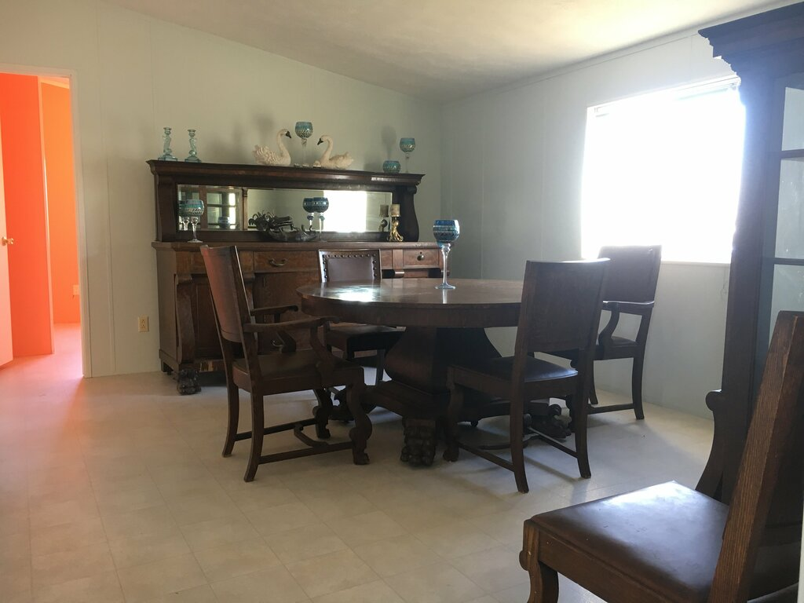
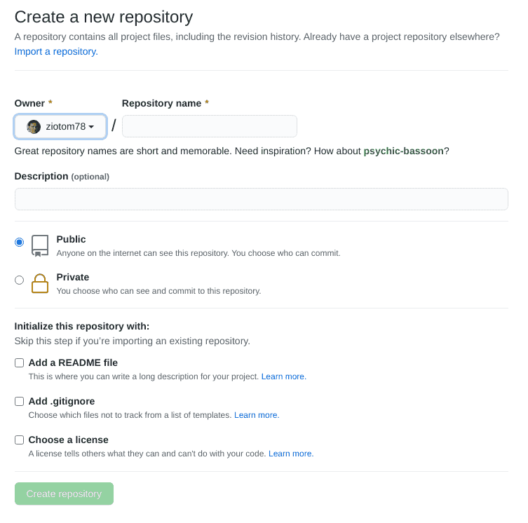
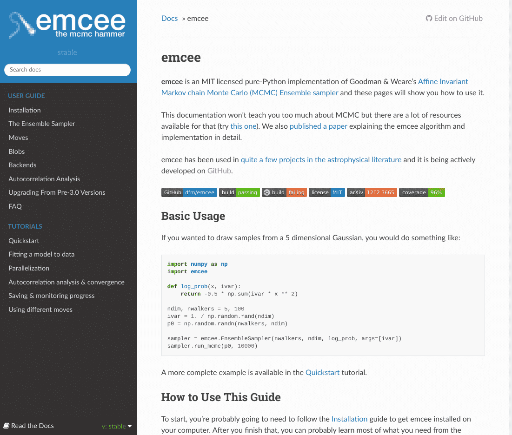
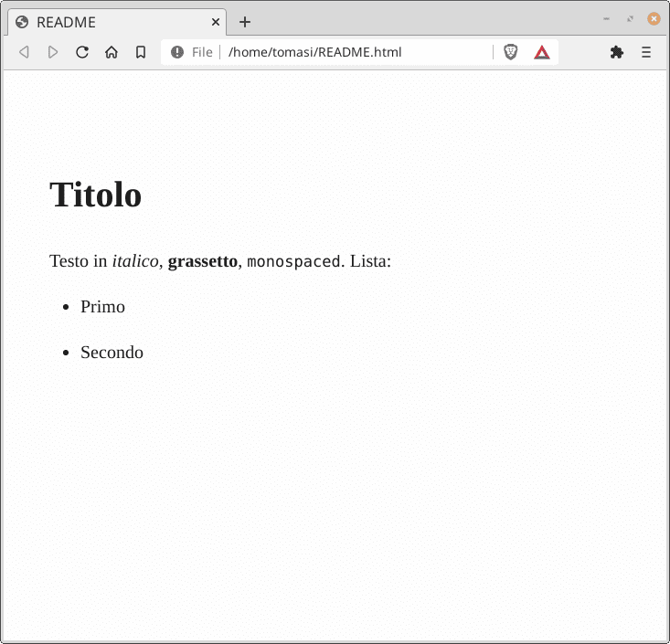
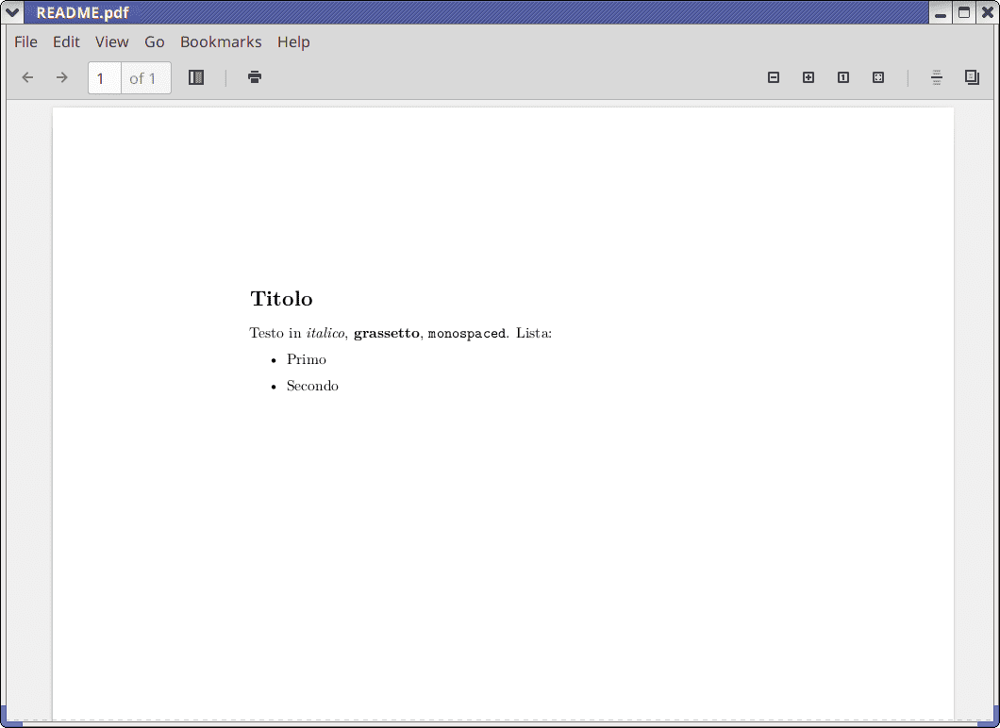
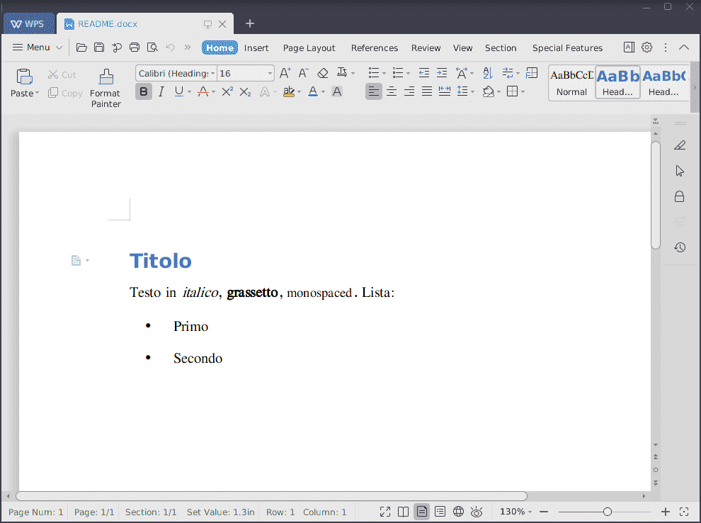
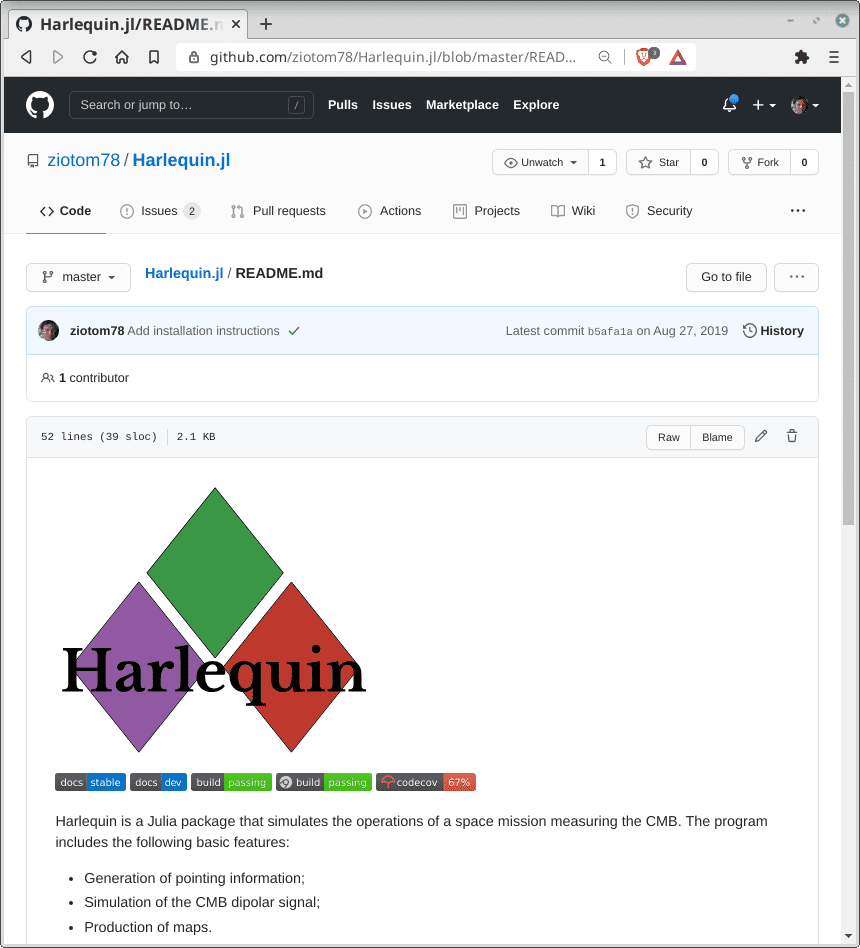

# Tone mapping {#tone-mapping}

---

<center>

</center>

# Tone mapping

-   A conversion from RGB to sRGB should preserve the overall «hue» of an image.
-   This is why we don't talk about *tone mapping* for a single RGB color, but for a matrix of colors (i.e., an image).
-   We will use the *tone mapping* described by [Shirley & Morley (2003)](https://books.google.it/books/about/Realistic_Ray_Tracing_Second_Edition.html?id=ywOtPMpCcY8C&redir_esc=y): it is physically less accurate than other methods (e.g., CIE standard normalization using D65), but more intuitive and easier to implement.

# Tone Mapping Algorithm

1.  Establish an «average» value for the irradiance measured at each pixel of the image;
2.  Normalize the color of each pixel to this average value;
3.  Apply a correction to the brightest spots.

# The Weber-Fechner law

-   To establish a plausible “average value” for the radiance coming from a scene, we must rely on **psychophysics**, the branch of psychology that deals with the relationship between a physical stimulus and the correlated psychological event

-   Weber and Fechner established that the eye's response to a stimulus $S$ is logarithmic ([Weber-Fechner law](https://en.wikipedia.org/wiki/Weber%E2%80%93Fechner_law)):
    $$
    p = k \log_{10} \frac{S}{S_0}
    $$
    where $p$ is the perceived value, and $S$ is the intensity of the stimulus.

# The Logarithmic Average

-   The «neutral» value for radiance is defined by the logarithmic average of the pixel luminosity $l_i$ (with $i = 1\ldots N$):
    $$
    \left<l\right> = 10^{\frac{\sum_i \log_{10}(\delta + l_i)}N},
    $$
-   The purpose of the parameter $\delta \ll 1$ is to avoid the singularity of $\log_{10} x$ at $x = 0$.

# The Logarithmic Average

-   The logarithmic average is an average of the *exponents*, while the arithmetic average is an average of the values; if the values are $10^2$, $10^4$ and $10^6$, the logarithmic average is
    $$
    10^{\frac{\log_{10} 10^2 + \log_{10} 10^4 + \log_{10} 10^6}3} = 10^4,
    $$

-   As a comparison, the arithmetic average is $(10^2 + 10^4 + 10^6)/3 \approx 10^6/3$.

# Luminosity

We have **three** scalar values (RGB) for each pixel. Which one should we use for $l_i$?

Arithmetic Mean
: $l_i = \frac{R_i + G_i + B_i}3$;

Weighted Average
: $l_i = \frac{w_R R_i + w_G G_i + w_B B_i}{w_R + w_G + w_B}$, given a triplet of positive values $(w_R, w_G, w_B)$;

Distance from the Origin
: $l_i = \sqrt{R_i^2 + G_i^2 + B_i^2}$;

Luminosity Function
: $l_i = \frac{\max(R_i, G_i, B_i) + \min(R_i, G_i, B_i)}2$

We will use the last: it isn’t physically meaningful but produces good results.


# Normalization

-   Once the average value is estimated, the R, G, B values of the image are updated through the transformation

    $$
    R_i \rightarrow a \times \frac{R_i}{\left<l\right>},
    $$

    where $a$ is a user-settable value.

-   Curiously, in their book Shirley & Morley suggest $a = 0.18$; however, there is no “right” value, as $a$ must be chosen depending on the image.


# Bright Spots

<center>{height=520}</center>

These are notoriously difficult to handle!

# Bright Spots

Shirley & Morley suggest to apply the following transformation to the R, G, B components of each pixel:
$$
R_i \rightarrow \frac{R_i}{1 + R_i}.
$$
The equation has these properties:
$$
\begin{aligned}
R_i \ll 1 &\Rightarrow R_i \rightarrow R_i,\\
R_i \gg 1 &\Rightarrow R_i \rightarrow 1.
\end{aligned}
$$

# Bright Spots

<center>
```{.gnuplot im_fmt="svg" im_out="img" im_fname="bright-point-transformation"}
set terminal svg
set xlabel "Input"
set ylabel "Output"
plot [0:10] [] x/(1 + x) lw 4
```
</center>

# γ correction

-   We might want to apply a gamma correction to the image values.

-   If for a signal $x$ the monitor emits a flux

    $$
    \Phi \propto x^\gamma,
    $$

    then the RGB values to be saved in the LDR image must be

    $$
    r = \left[2^8\times R^{1/\gamma}\right],\quad
    g = \left[2^8\times G^{1/\gamma}\right],\quad
    b = \left[2^8\times B^{1/\gamma}\right],
    $$

---

<center>

</center>


# Documentation

# Comments in code

-   Everyone knows how important it is to write comments in the code!

-   A comment helps those reading the code understand what that code does.

-   It can help you too! If you read the code you wrote today in a year, are you sure you will remember why you wrote it that way?

# Comments to avoid

-   Comments, however, should not be pedantic: it is not necessary to comment on obvious things, perhaps avoiding commenting on important things.

    ```c++
    // Initialize variable "a" and set it to zero
    int a = 0;
    // Cycle over the vector "v"
    for(auto elem : v) {
        // Increment a by 2*sin(elem)
        a += 2 * sin(elem);
    }
    // One year from now: «Wait! but… why were we doing this calculation in the first place?»
    ```

-   If you feel the need to put a lot of comments in a function to make it clear, perhaps the function is not written well.

# *Docstrings*

-   Modern editors are able to read comments placed at the beginning of classes/methods/functions/types, and display them in certain contexts (for example, when you hover the mouse over a function call).

-   Get used to relying on this feature: it will teach you how to write comments better and prevent you from going back and forth in the code.

-   Usually, to declare a *docstring*, you must start a comment with a special character or string, for example:

    ```c++
    // Plain comment in C++
    int f(int x)  { return 2 * x; }

    /// Docstring: it begins with three '/' instead of two
    int g(int x)  { return 3 * x; }
    ```

---

<iframe src="https://player.vimeo.com/video/683431827?h=9e4de4dba1&amp;badge=0&amp;autopause=0&amp;player_id=0&amp;app_id=58479#t=12m00s" width="1280" height="720" frameborder="0" allow="autoplay; fullscreen; picture-in-picture" allowfullscreen title="Come usare una IDE (JetBrains Rider)"></iframe>


# The README File

-   When publishing a project on GitHub, it is essential to include a README:
    -   The amount of FOSS (Free and Open Source Software) on the Internet is impressive;
    -   Users need to understand quickly whether a project is right for them or not;
    -   A README today combines the function of an advertisement (in a good way!) and a first user manual.
-   It is therefore essential to have a `README` in your repositories.
-   In fact, when you create a new repository on GitHub, you are prompted to generate one automatically!

---

<center>

</center>

# Purpose of the README

-   It's the first document a potential user encounters.
-   It must concisely communicate these concepts:
    1.  What the program is for;
    2.  What it requires to work (Windows? Linux? a GPU? a printer?);
    3.  How to install it;
    4.  Practical examples showing what the program can do (possibly more than one: starting from simple cases and synthetically showing at least one realistic case);
    5.  Usage license.
-   It shouldn't go into too much detail.

---

-   Try to be *clear* but also *concise*!
-   Negative example ([`boost.array`](https://www.boost.org/doc/libs/1_74_0/doc/html/array.html)). The introduction begins like this:

    > The C++ Standard Template Library STL as part of the C++
    > Standard Library provides a framework for processing algorithms
    > on different kind of containers. However, ordinary arrays don't
    > provide the interface of STL containers (although, they provide
    > the iterator interface of STL containers).

    A whole paragraph, and it still doesn't say what the library does! (It's not even mentioned in the next paragraph…)

# Example: [emcee](https://emcee.readthedocs.io/en/stable/)

<center>
{height=620px}
</center>

# Structure of a README

-   Recommended structure from the [Make a README](https://www.makeareadme.com/) website:
    #.  Name and description;
    #.  Usage examples;
    #.  Installation instructions;
    #.  How to contribute to the repository;
    #.  License.
-   The [Awesome README](https://github.com/matiassingers/awesome-readme) website is a goldmine of suggestions and links to real-world project READMEs to imitate.


# How to write documentation?

# Writing text

-   In the past, READMEs and user manuals were simple text files.
-   However, we have seen that READMEs used today include graphics, highlighted code, titles, etc. (The same applies to user manuals!)
-   What do we do? Do we really have to write everything in LaTeX?!?

# Markup languages

-   There's no need to despair and resort to LaTeX!
-   Over the years, a series of markup languages have emerged that allow you to easily write structured text:
    -   [Markdown](https://en.wikipedia.org/wiki/Markdown) (`.md` extension, e.g., `README.md`);
    -   [reStructuredText](https://en.wikipedia.org/wiki/ReStructuredText) (`.rst` extension), widely used in the Python world;
    -   [Asciidoc](https://en.wikipedia.org/wiki/AsciiDoc) (`.adoc` or `.txt` extension);
    -   [Org-mode](https://en.wikipedia.org/wiki/Org-mode) (`.org` extension: my favourite, but it only works with Emacs);
    -   etc.
-   The most widely used is undoubtedly Markdown.

# Markdown {#markdown}

-   Usually, the documents accompanying a program are written in Markdown (it's the default choice on GitHub).

-   The standard tool for Markdown is [pandoc](https://pandoc.org/), which can convert `.md` files into:

    -   HTML pages (these slides, made with [Reveal.js](https://revealjs.com/), are an example!);
    -   LaTeX, including Beamer
        ([ctan.org/pkg/beamer](https://ctan.org/pkg/beamer));
    -   Microsoft Word files;
    -   Ebooks in `.epub` format;
    -   Etc.

-   Pandoc implements an extended version of Markdown, and supports equations like $\int x^2\,\mathrm{d}x$ and Unicode characters (UTF-8).


# Markdown Example

-   If you have installed Pandoc, create a file `README.md` with this content:

    ```markdown
    # Title

    Text in *italic*, **bold**, `monospaced`. List:
    -   First
    -   Second
    ```

-   Convert it to an HTML/Word/LaTeX file with

    ```
    $ pandoc -t html5 --standalone -o README.html README.md
    $ pandoc -t docx  --standalone -o README.docx README.md
    $ pandoc -t latex --standalone -o README.tex  --pdf-engine=lualatex  README.md
    ```

---

<center>

</center>

---

<center>

</center>

---

<center>

</center>


# Markdown in GitHub (1/2)

-   In GitHub, you don't need to convert Markdown files like `README.md` with `pandoc` because it implements an internal HTML converter.

-   If you upload a file named `README.md` to a repository, GitHub will automatically display it on the main page:

    <center>
    {height=320}
    </center>

# Markdown in GitHub (2/2)

-   GitHub interprets Markdown slightly differently from Pandoc: consult the [GitHub Flavored Markdown Spec](https://github.github.com/gfm/) guide.

-   In particular, you cannot use line breaks within a paragraph: in the following text, the poem is rendered by GitHub with each verse on its own line:

    ```markdown
    Voi, che sapete che cosa è amor,
    Donne vedete, s'io l'ho nel cor.
    Quello ch'io provo vi ridirò;
    è per me nuovo, capir nol so.
    ```

    (`pandoc` would instead transform it into a single paragraph).

# Other tools

-   [Quarto](https://quarto.org/) builds on Pandoc to produce complex documents (papers, books, technical manuals…)
-   [Typst](https://typst.app/) is mainly an alternative to LaTeX, as it (currently) targets PDF. It is superb to produce scientific documents


# Can we use LLMs?

-   Large Language Models (LLMs) are the Big New Thing™!
-   Neural network trained on massive text datasets to generate text, translate, answer questions…
-   They only recognize statistical patterns: no true understanding!
-   Very good for text manipulation and structuring, but remember that they can only provide **structure**, not **content**!

---

{height=680px}

# README Creation with LLMs

-   You can use them to produce a nice `README`: you write a messy draft and ask the LLM to improve it
-   LLMs can:
    -   Format existing text
    -   Generate boilerplate sections
    -   Improve clarity and consistency
-   **Caution:** Don't rely solely on LLM for technical details

# Pro tip

-   You can provide instructions about how to fix some text:

    ```
    [Instructions]
    <Write here how you want the LLM to work on the text>

    [Text]
    <The actual text>
    ```

    (Use Shift+Enter to enter a new line in the LLM prompt.)

-   Writing good instructions is called [prompt engineering](https://en.wikipedia.org/wiki/Prompt_engineering), and it is a kind of black art.


# Example

```
[Instructions]
I am a PhD student and am preparing a presentation to show the results of my work. You are an expert in creating concise conference slides using Markdown. I will provide you with a description of my PhD research, including the problem statement, methodology, results, and conclusions.

Your task is to generate a set of 5-7 slides in Markdown format suitable for a 10-minute conference presentation. Each slide should focus on a key aspect of my research. Please:

-    Use clear and concise bullet points.
-    Highlight key findings and contributions.
-    Format code snippets or equations using LaTeX within '′or′$' delimiters where applicable.
-    Include a 'Summary' or 'Conclusions' slide.
-    Prioritize visual clarity and readability.

[Text]
<The description of your own research>
```

# Using LLMs for READMEs

-   Provide existing project information: usage examples, installation steps…
-   Ask for specific formatting: Markdown, code block formatting, tables…
-   Iterative process: review and refine its output, as human expertise is crucial!
-   LLM as a tool, not a replacement


# Additional resources

-   Good LLMs:

    -   [OpenAI ChatGPT](https://chatgpt.com/): the most famous, but not necessarily the best
    -   [Google Gemini](https://gemini.google.com/app): similar to ChatGPT, but with a more generous free plan
    -   [DeepSeek](https://chat.deepseek.com/): promising Chinese alternative, more environment-friendly

-   To learn how to use LLMs, look for Grant Sanderson’s videos ([3Blue1Brown](https://www.youtube.com/@3blue1brown)):

    -   [Brief introduction (8 minutes)](https://www.youtube.com/watch?v=LPZh9BOjkQs)
    -   [Longer talk with more information](https://www.youtube.com/watch?v=KJtZARuO3JY)
    -   [Full course](https://www.youtube.com/playlist?list=PLZHQObOWTQDNU6R1_67000Dx_ZCJB-3pi)


# Software Licenses {#licenses}

# The Case of GitHub

-   When you registered on GitHub, you had to agree to its [*Terms of service*](https://docs.github.com/en/github/site-policy/github-terms-of-service).

-   How many of you have read them? 👀

-   Do you know what the average user could do with the code you published on GitHub for this course?

# *GitHub's terms of service*

-   Even if you have published code on GitHub, you remain the owner of the code.

-   But you obviously give GitHub the right to keep a copy of the code on their server (in legal terms it's called "content," because it also includes other types of files, such as images and Markdown text).

-   You also give GitHub permission to [**display**](https://docs.github.com/en/site-policy/github-terms/github-terms-of-service#5-license-grant-to-other-users) your *content*, and to allow users to download it.

-   What you do **not** necessarily guarantee to users is the ability to compile, modify, or run your code, let alone use the results produced by it in a publication!

# Software Licenses

-   A "software license" explains to the users who downloaded a program what they are allowed to do and what they are not.
-   It has always been used in commercial software.
-   It has become increasingly important also in academia:
    -   Some institutions require it (but not UniMI);
    -   It can protect the author from unpleasant surprises.
-   In FOSS programs, licenses are usually written in a `LICENSE`, `LICENSE.txt`, or `LICENSE.md` file (in Markdown).
-   An excellent explanation is present in the article [*A Quick Guide to Software Licensing for the Scientist-Programmer*](https://journals.plos.org/ploscompbiol/article?id=10.1371/journal.pcbi.1002598) (Morin, Urban & Sliz, 2012).

# Does it matter to a physicist?

-   A lot of code is written in the research world.

-   The main purpose is to perform simulations and analyses, which are then described in an article.

-   It is important that the results are reproducible: a reader should be able to run the same program used by the authors and obtain the same results.

-   The program should therefore be distributed along with its source code: in this way, readers can verify its correctness.

-   A license establishes the rights of the program's creator and the rights of the user, and is therefore **very important** for physicists too!

# Does it matter to the user?

-   Suppose you are doing a job that requires a certain type of program/library.

-   You have found a program/library on the internet that seems to be just what you need.

-   Before using it, however, you must answer the following questions:

    -   Do I have permission to download it?
    -   Do I have permission to compile it?
    -   Do I have permission to run it?
    -   Do I have permission to publish the results I obtained with this program?


# Your repositories

-   From the way I asked you to create your repositories, I reckon that none of you have added a `LICENSE` or `LICENSE.md` file.

-   This is a text file that specifies the user's rights: if this file does not exist in the repository, the user is **not** authorized to compile your code, nor to run it, etc. You must give your explicit consent!

-   If you are not an expert in legal matters, it is best that you do not write this file yourself. (Otherwise, you could [write abominations](https://github.com/ErikMcClure/bad-licenses)!)

-   There are many types of ready-to-use licenses, and `LICENSE` files are usually produced by copy-and-paste. So let's see which licenses can be used in your work.

# Types of licenses

Proprietary
: These are used for programs like Microsoft Word, Apple Mac OS X, Adobe Photoshop, etc. They are also found in academia.

Permissive
: These are the most used licenses in academia: basically, they say that you can do almost anything with the program.

Copyleft
: This is a license widely used in the FOSS world, and there are cases where it is mandatory even in academia.

# Proprietary licenses

-   A list of what the user can do; what is not listed is implicitly excluded.

-   They do not always allow the user to obtain a copy of the source code; when this is provided, it is usually only for *reading* and *verification*.

-   It is a type of license used in academia (e.g., in faculties closely linked to industry, such as engineering), although not very common in physics.

# *Permissive Licenses*

-   This is a family of licenses that provides maximum freedom to the user.

-   The most famous types are:
    -   [MIT](https://opensource.org/licenses/MIT) (used by [Julia](https://github.com/JuliaLang/julia/blob/master/LICENSE.md) and [dotnet](https://github.com/dotnet/roslyn/blob/main/License.txt));
    -   [BSD](https://opensource.org/licenses/BSD-3-Clause);
    -   [Apache License]() (used by [Kotlin](https://github.com/JetBrains/kotlin/tree/master/license) and [clang](https://clang.llvm.org/));
    -   [Academic Free License](https://opensource.org/licenses/AFL-3.0).

-   The user can acquire the source code, compile it, run it, etc.

-   In general, these licenses state what is prohibited, and anything not listed is implicitly permitted.

# Using *Permissive Licenses*

-   The user is not prohibited from modifying the code and redistributing it…

-   …and the user is not prohibited from incorporating the code into *their* program, which is then released under a *proprietary license*.

-   The only explicit requirement is that the code attribution be maintained: I cannot take someone else's code and publish it claiming it as my own.

# *Copyleft Licenses*

-   This is a type of *Permissive License* that, however, places important restrictions on how the code is redistributed.

-   If code under a *copyleft license* is used within another codebase, the latter must also be released under a *copyleft license* (but it is not mandatory to release it!).

-   The most famous example is the [GNU Public License](https://opensource.org/licenses/gpl-license), used for Linux, Emacs, Bash, and your beloved GCC. It is called a *viral license*: if a program "touches" *copyleft* code, it automatically becomes *copyleft* itself, even if it merely links to it. (Many detest it for this!)

# European Union Public License (EUPL)

-   It is an open-source software license designed by the European Union, and legalized translations are available in the 23 languages of the EU!

-   Proposed in 2007, it has now reached version 1.2.

-   Compatible with [GPL](https://en.wikipedia.org/wiki/GNU_General_Public_License), [LGPL](https://en.wikipedia.org/wiki/GNU_Lesser_General_Public_License), and [AGPL](https://en.wikipedia.org/wiki/GNU_Affero_General_Public_License) (as well as others), but it is not viral… and this is a good thing!

-   Let's see the differences between EUPL and GPL, which is the most famous *copyleft* license of all.

# EUPL vs GPL

-   It is compatible with European legislation, unlike the GPL, which has some parts that may not be applicable in the EU.

-   Despite being *copyleft*, it is not viral: you can write a program that interfaces with an EUPL program and choose the license you want because an explicit exception is provided in the text.

-   It explicitly covers the case of so-called SaaS ("Software as a Service"), which are programs that are not run on your own computer but work within a browser. (One of the reasons why [AGPL](https://en.wikipedia.org/wiki/GNU_Affero_General_Public_License) was written was to fill this gap in the GPL).

-   It is the "recommended" license in a large number of countries (including [Italy](https://joinup.ec.europa.eu/collection/eupl/news/agid-guidelines)) for software used in public administration (*mandatory* in Spain!).

# Further Information on the EUPL

-   The European Union offers a [free official course on the EUPL](https://academy.europa.eu/courses/the-european-union-public-license-eupl)! (Those who complete the quiz with at least 60% correct answers get a certificate.)

-   [Discussion on the EUPL](https://discourse.writefreesoftware.org/t/eupl-a-better-choice-for-european-citizens/43/9) on the [writefreesoftware.org](https://discourse.writefreesoftware.org) website.

-   Simple explanation of why the virality of the GPL is not compatible with European legislation: [Why viral licensing is a ghost](https://joinup.ec.europa.eu/collection/eupl/news/why-viral-licensing-ghost). (Spoiler: the problem is how to deal with static/dynamic linking of libraries.)

-   Interesting [discussion](https://discourse.julialang.org/t/package-licenses-contemplations-and-considerations/117922) on the Julia forum.

# Which License to Use?

-   For the code developed in this course, in principle, you could use a *permissive* or *copyleft license* at your discretion.

-   But if in the next lessons you use external libraries (the time will come), you will have to be careful that the library's license is compatible:
    -   If your code uses a *copyleft license*, you must verify its compatibility with that of the library;
    -   If your code uses a *permissive license*, in general, you cannot use libraries with a *copyleft license* unless you change your license.

-   You can use the sites [TLDRLegal](https://tldrlegal.com/) and [Choose an open source license](https://choosealicense.com/) to decide. If you really don't know what to use, the safest choice is probably the EUPL.

# How to "Use" a License?

-   The [Open Source Initiative](https://opensource.org/) website provides a template for various licenses, and the EU provides an [interactive](https://joinup.ec.europa.eu/collection/eupl/solution/joinup-licensing-assistant/jla-find-and-compare-software-licenses) way to pick one of them!

-   To apply a license to your code, you must take the following steps:

    1.  Choose the license. We take the EUPL 1.2 as an example (see [OSI](https://opensource.org/license/eupl-1-2)).
    2.  The website <https://license.md> provides the text of various open-source licenses in text or Markdown format. From this site, you can download the text of the [EUPL 1.2](https://license.md/licenses/european-union-public-license-1-2/), which we use as an example.
    3.  Save the license text in the file `LICENSE` (if it is in ASCII format) or `LICENSE.md` (if it is in Markdown) inside your repository.
    4.  Most licenses recommend including a short text in a comment at the top of *every* source file in your repository.

# Beyond the `LICENSE.md` File

-   It is common practice to also include a copy of the license in a comment at the beginning of each source file: this way, anyone who copies a file from a repository into their own code "brings" the license with them.

-   However, it is not necessary (I never do it…); alternatively, you can insert a short message: *This file is released under a … license. See LICENSE.md*.

-   There are more structured methods for reporting the license type in the code. One example is [SPDX](https://spdx.dev/), a standard also followed by the [Linux kernel](https://git.kernel.org/pub/scm/linux/kernel/git/torvalds/linux.git/commit/?id=2c1212de6), which allows license information to be processed automatically (e.g., by a script).

---
title: "Lesson 4"
subtitle: "Calcolo numerico per la generazione di immagini fotorealistiche"
author: "Maurizio Tomasi <maurizio.tomasi@unimi.it>"
...
