<center>

</center>

# Tone mapping

-   Una conversione da RGB a sRGB dovrebbe preservare la «tinta» complessiva di un'immagine.
-   Ecco perché non si parla di *tone mapping* per un singolo colore RGB, ma per una matrice di colori (ossia un'immagine).
-   Noi useremo il *tone mapping* descritto da Shirley (2003): è fisicamente meno preciso di altri metodi (es., la normalizzazione dello standard CIE usando D65), ma più intuitivo e più semplice da implementare.

# Algoritmo di tone mapping

1.  Stabilire un valore «medio» per l'irradianza misurata in corrispondenza di ogni pixel dell'immagine;
2.  Normalizzare il colore di ogni pixel a questo valore medio;
3.  Applicare una correzione ai punti di maggiore luminosità.

# Valore medio

-   Il valore «neutro» per la radianza è definito dalla media logaritmica della luminosità $l_i$ dei pixel (con $i = 1\ldots N$):
    $$
    \left<l\right> = \exp\left(\frac{\sum_i \log(\delta + l_i)}N\right),
    $$
    dove $\delta \ll 1$ evita la singolarità di $\log x$ in $x = 0$.

-   A ciascun pixel sono però associati tre valori scalari (R, G, B). Quale valore usare per la luminosità $l_i$?

# Luminosità

Media aritmetica
: $l_i = \frac{R_i + G_i + B_i}3$;

Media pesata
: $l_i = \frac{w_R R_i + w_G G_i + w_B B_i}{w_R + w_G + w_B}$, data una terna di valori positivi $(w_R, w_G, w_B)$;

Distanza dall'origine
: $l_i = \sqrt{R_i^2 + G_i^2 + B_i^2}$;

Funzione di luminosità
: $l_i = \frac{\max(R_i, G_i, B_i) + \min(R_i, G_i, B_i)}2$

Shirley usa l'ultima definizione perché sostiene che, nonostante non sia fisicamente significativa, produca risultati visivamente migliori.

# Perché la media logaritmica?

-   Non abbiamo ancora giustificato la formula
    $$
    \left<l\right> = \exp\left(\frac{\sum_i \log(\delta + l_i)}N\right),
    $$

-   Essa è plausibile perché la risposta dell'occhio a uno stimolo $S$ è logaritmica (*leggi di Weber-Fechner*):
    $$
    p = k \log \frac{S}{S_0}
    $$
    dove $p$ è il valore percepito, e $S$ è l'intensità dello stimolo.

# Proprietà della media logaritmica

-   La media logaritmica è una media sugli *esponenti*, mentre la media aritmetica è una media sui valori;

-   Nel caso i valori siano $10^2$, $10^4$ e $10^6$, la media logaritmica è
    $$
    10^{\frac{\log_{10} 10^2 + \log_{10} 10^4 + \log_{10} 10^6}3} = 10^4,
    $$
    mentre la media aritmetica è $(10^2 + 10^4 + 10^6)/3 \approx 10^6/3$.


# Normalizzazione

Una volta stimato il valore medio, i valori R, G, B dell'immagine sono aggiornati tramite la trasformazione
$$
R_i \rightarrow a \times \frac{R_i}{\left<l\right>},
$$
dove $a$ è un valore impostabile dall'utente (Shirley suggerisce $a = 0.18$, ma in realtà si dovrebbe ottimizzare a seconda dell'immagine).


# Punti luminosi

{height=520}

Sono notoriamente difficili da trattare!

# Punti luminosi

Shirley suggerisce di applicare ai valori R, G, B di ogni punto dell'immagine la trasformazione
$$
R_i \rightarrow \frac{R_i}{1 + R_i},
$$
che ha le seguenti caratteristiche:
$$
\begin{aligned}
R_i \ll 1 &\Rightarrow R_i \rightarrow R_i,\\
R_i \gg 1 &\Rightarrow R_i \rightarrow 1.
\end{aligned}
$$

# Punti luminosi

```{.gnuplot format=svg dpi=600}
set xlabel "Input"
set ylabel "Output"
plot [0:10] [] x/(1 + x)
```

---

<center>

</center>

# Uso del tone mapping

```{.graphviz}
digraph "" {
    read [label="read input file" shape=box];
    solve [label="solve the rendering equation" shape=box];
    savepfm [label="save a PFM file" shape=box];
    tonemapping [label="apply tone mapping" shape=box];
    saveldr [label="save a LDR file (PNG, JPEG...)" shape=box];
    read -> solve;
    solve -> savepfm;
    savepfm -> tonemapping;
    tonemapping -> saveldr;
    saveldr -> tonemapping;
}
```


# Formati grafici e compressione

# Formati LDR

-   Non ci sarà un formato obbligatorio da implementare nel codice (PNG, JPEG, BMP, GIF, etc.): scegliete quello che vi intriga di più, o il più semplice da implementare.
-   È però importante evidenziare le differenze tra i vari formati, perché ciascun formato ha vantaggi e svantaggi.

# Differenze tra formati

Versatilità
: Alcuni formati supportano solo colori codificati come terne (R, G, B) di 8×3=24 bit, altri ammettono più possibilità (es. 16×3=48 bit).

Metadati
: Alcuni formati consentono di memorizzare metadati a piacere.

Facilità di lettura/scrittura
: Alcuni sono semplici da scrivere ([PNM](https://en.wikipedia.org/wiki/Netpbm)), altri molto più complessi (JPEG).

Compressione
: Molti formati comprimono i dati per ridurre lo spazio su disco. Se la compressione preserva l'informazione è detta **lossless**, altrimenti **lossy**.

# Compressione dati

-   La compressione dei dati è un argomento molto importante non solo nel campo della grafica, ma anche in fisica computazionale.

-   Le simulazioni e gli esperimenti del XXI secolo richiedono di registrare quantità di dati sempre più grandi. Esempio nell'ambito della CMB:

    -   Nel periodo 1989–1993, l'esperimento COBE/DMR ha acquisito <8 GB;
    -   Nel periodo 2001–2010, l'esperimento WMAP ha acquisito 200 GB;
    -   Nel periodo 2009–2013, l'esperimento Planck ha acquisito 30 TB.

    Grandi moli di dati sono comuni anche in altri domini della fisica (particelle, climatologia, etc.): apprendere i principi della compressione dati è estremamente utile!

# Compressione dati

-   Uno schermo di computer ha solitamente una risoluzione di 1920×1080 pixel.

-   Se vengono usati 8+8+8=24 bit per il colore sRGB di ogni pixel (3 byte per pixel), il numero totale di byte necessari è
    $$
    3 \times 1920 \times 1080 = 6\,220\,800
    $$
    che equivale a circa 6 MB.

-   Nelle immagini c'è solitamente molta informazione ridondante che può essere eliminata.

# *Palette* di colori

-   Alcuni formati «storici» comprimono l'informazione limitando il numero di colori disponibili in un'immagine. Questo era giustificato dal limitato numero di colori supportato da certe vecchie schede grafiche.

-   Un esempio è il formato GIF: esso richiede che all'inizio del file vengano elencati i colori usati dall'immagine come terne sRGB in una lista di 256 elementi.

-   La matrice che rappresenta l'immagine contiene **un solo byte** per pixel: è il valore che «punta» al colore sRGB della *palette*. In questo modo si comprime di un fattore $\lesssim 3$.

-   Salvare un file usando una *palette* è un metodo **lossy**.

# Esempio di palette

<center>
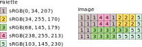
</center>

Usare una *palette* è un primo passo per comprimere, ma oggi si può fare **molto** meglio senza necessariamente restringersi a 256 colori!

# Il problema della compressione

-   Usiamo come esempio la seguente sequenza:

    <center>
    
    </center>

-   Potete pensarla come una sequenza di caratteri ASCII, oppure dei valori numerici indicati da lettere ($a, b, c, \ldots$) che rappresentano componenti sRGB.

-   In gergo, $a$, $b$ e $c$ sono detti *simboli*.

# Run-Length Encoding

-   Un tipo di compressione molto usato in passato è la *Run-Length Encoding*.

-   Invece di trasmettere la sequenza di valori, si trasmette un valore seguito dal numero di volte per cui deve essere ripetuto

    <center>
    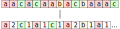
    </center>

-   È una compressione **lossless**: non si perde informazione.

-   Per questa sequenza, non c'è però guadagno: la versione compressa è lunga 22 byte (11 coppie valore/conteggio) anziché 15!

# Ottimizzazione dei bit

-   Potremmo ottenere un risultato migliore se usassimo meno di 8 bit per il numero di ripetizioni.

-   Ovviamente, usando $n$ bit non potremmo codificare più di $2^n$ ripetizioni (suggerimento: il valore `0b000` può codificare 1 anziché 0…).

-   Il codice si complicherebbe, perché nel salvare i dati in uno stream di bytes dovremo «decompattare» e «ricompattare» bit; però non è impossibile (vedi le slide opzionali alla fine).

# Ottimizzazione dei bit

-   Nel nostro esempio di prima, usando $n = 2$ avremmo ancora 11 coppie (il numero massimo di ripetizioni è $3 < 2^2 = 4$), ma i bit richiesti sarebbero $(8 + 2) \times 11 = 110$, corrispondenti a 14 byte:

    <center>
    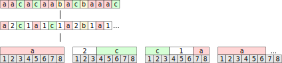
    </center>

-   Anche con questo accorgimento, la compressione resta **lossless**.

# Maniac mansion PC (1989)

<center>
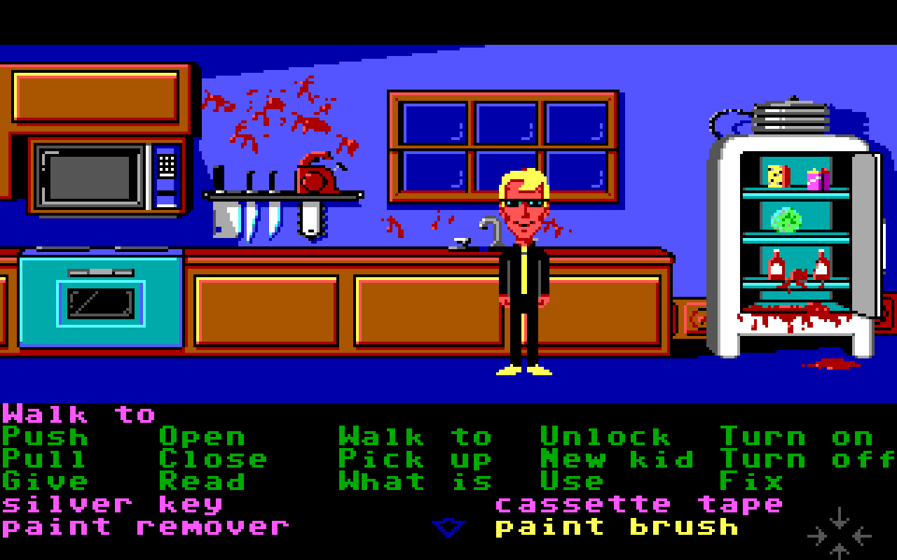{height=560px}
</center>

# Ottimizzare i simboli

-   Potremmo ottimizzare anche i bit usati per i *simboli*.

-   Nel nostro esempio, i simboli che ricorrono sono appena 3: $a$, $b$ e $c$. Il numero di bit necessario a codificare $N = 3$ simboli è $\lceil\log_2 N\rceil = 2$.

-   Potremmo associare una sequenza di bit univoca a ciascuno dei tre simboli:

    | Simbolo | Sequenza |
    |---------|----------|
    | $a$     | 00       |
    | $b$     | 01       |
    | $c$     | 10       |

# Ottimizzare i simboli

-   La sequenza da cui siamo partiti

    <center>
    
    </center>

    verrebbe quindi compressa nella sequenza di bit

    ```text
    a  a  c  a  c  a  a  b  a  c  b  a  a  a  c
    00 00 10 00 10 00 00 01 00 10 01 00 00 00 10

    0b00001000 0b10000001 0b00100100 0b000010xx     (4 byte)
    ```

-   Siccome ogni simbolo occupa 2 bit, il numero totale di bit è $2 \times 15 = 30$, che richiede 4 byte per essere memorizzato: niente male!

# Metadati

-   Abbiamo un po' barato: nell'esempio precedente non sono sufficienti i 30 bit che abbiamo prodotto, se non sappiamo le corrispondenze con $a$, $b$ e $c$.

-   Perché la sequenza si possa decomprimere, dobbiamo codificare anche la tabella delle corrispondenze. È sufficiente trasmettere il numero di simboli e la loro lista per ricostruire la tabella:

    ```
    3 'a' 'b' 'c' 0b00001000 0b10000001 0b00100100 0b000010xx
    ```

    per un totale di 8 byte, comunque ancora vantaggioso.

-   Ovviamente la compressione resta **lossless**.

# Codifica di Huffman

-   Esiste un algoritmo, la *codifica di Huffman*, che permette di ridurre ulteriormente il numero di bit richieste rispetto al caso precedente.

-   Si basa sull'idea che i simboli dovrebbero essere codificati da un numero *variabile* di bit, e che i simboli più frequenti dovrebbero usare meno bit.

<center>
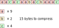
</center>

# Codifica di Huffman

-   Usando l'idea di Huffman, potremmo costruire questa tabella:

    | Simbolo | Sequenza |
    |---------|----------|
    | $a$     | 0        |
    | $b$     | 10       |
    | $c$     | 11       |

-   Questo ci consente di risparmiare un byte!

    ```text
    a a c  a c  a a b  a c  b  a a a c
    0 0 11 0 11 0 0 10 0 11 10 0 0 0 11

    0b00110110 0b01001110 0b00011xxx     (3 byte)
    ```

# Entropia di Shannon

-   Il teorema di [Shannon](https://en.wikipedia.org/wiki/Claude_Shannon) (1916–2001) ci permette di chiarire meglio il risultato.

-   Per enunciare il teorema dobbiamo prima introdurre l'*entropia di Shannon*, che è uno scalare $S$ associato a una sequenza di $N$ simboli $\left\{x_i\right\}$:

    $$
    S(\left\{x_i\right\}) = -\sum_i p_i\,\log_2 p_i,
    $$

    dove la somma è sul numero totale di simboli (3 nel nostro caso: $a$, $b$ e $c$), e $p_i$ è la probabilità dell'$i$-esimo simbolo.
    
-   Per convenzione, se $p_i = 0$ si pone $p_i\,\log_2 p_i = 0$).

# Esempi di entropia (1/3)

Partiamo da una sequenza dove $a$ e $b$ compaiono un numero uguale di volte:

$$
a, b, a, b, a, b, a, b, \ldots
$$

Allora $p_a = p_b = \frac12$ e

$$
S = -\left(\frac12\log_2\frac12\right) - \left(\frac12\log_2\frac12\right) = 1.
$$

# Esempi di entropia (2/3)

Se abbiamo una sequenza con tre simboli $a$, $b$ e $c$ con probabilità $1/2, 1/4, 1/4$:

$$
a, a, b, c, a, a, b, c, a, a, b, c, \ldots
$$

allora

$$
S = -\left(\frac12\log_2\frac12\right)
- \left(\frac14\log_2\frac14\right)
- \left(\frac14\log_2\frac14\right) = \frac32.
$$

# Esempi di entropia (3/3)

Per la nostra sequenza `aacac…` si ha che

$$
S = -\left(\frac9{15}\,\log_2\frac9{15}\right)
- \left(\frac2{15}\,\log_2\frac2{15}\right)
- \left(\frac4{15}\,\log_4\frac2{15}\right) \approx 1.34.
$$


# Teorema di Shannon

-   Il teorema di Shannon fissa il limite inferiore al livello di compressione ottenibile per una sequenza di valori **casuali** con probabilità nota.

-   Esso dice che il numero minimo di bit necessari alla codifica di una sequenza di $N$ simboli $x_n$ è uguale a

    $$
    S(\left\{x_i\right\}) \times N.
    $$

    In altre parole, un compressore deve sempre usare almeno $S$ bit per simbolo.

-   Nella nostra sequenza `aacac…`, il numero minimo *teorico* di bit necessario è $1.34 \times 15 \approx 20$ (un po' meno di 3 byte): Huffman quindi in questo caso non riesce a raggiungere il limite teorico.

# Codifica aritmetica

-   La codifica aritmetica è un approccio alternativo a quello di Huffman.

-   Si distingue per *tendere asintoticamente al limite di Shannon*, in qualsiasi caso! («Asintoticamente» nel senso che lo fa se la sequenza di simboli ha lunghezza infinita).

-   Invece di codificare ogni simbolo separatamente, li codifica tutti insieme in un unico numero binario: in questo modo è come se impiegasse per ogni simbolo un numero possibilmente frazionario di bit, che è pari a $S$ se $N \rightarrow \infty$.

# Algoritmo

-   Si divide l'intervallo $[0, 1]$ in tanti intervalli quanti sono i simboli.

-   Ogni intervallo deve essere lungo tanto quanto la probabilità del simbolo:

    <center>
    
    </center>

-   Considerando la sequenza $\{x_n\}$ dei simboli da codificare, ad ogni simbolo da codificare si fa corrispondere l'intervallo corrispondente, che viene a sua volta suddiviso in sotto-intervalli come sopra.

-   All'intera sequenza si associa quindi un intervallo $[\alpha, \beta]$, con $0 < \alpha < \beta < 1$.

---

<center>
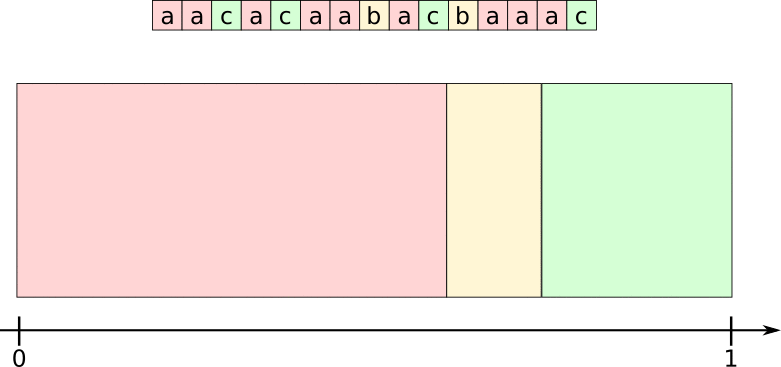
</center>

---

<center>
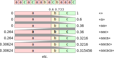
</center>

# Uso della codifica aritmetica

-   Una volta codificata la sequenza in un intervallo $[\alpha, \beta]$, questo intervallo è identificato *univocamente* da qualsiasi numero $\xi \in [\alpha, \beta]$.
-   Quindi una sequenza di lunghezza nota è associabile a un numero reale $\xi$.
-   Si dimostra che il numero di bit necessario per codificare questo numero $\xi$, se opportunamente scelto, tende a $S \times N$ quando $N \rightarrow \infty$.
-   Trasmettere il numero $\xi$ equivale a trasmettere quindi l'intero messaggio, ma la codifica è ottimale.
-   Oggi alla codifica aritmetica si preferiscono metodi basati sugli [asymmetric numeral systems](https://en.wikipedia.org/wiki/Asymmetric_numeral_systems) (Duda, 2014), che hanno le stesse capacità di compressione ma garantiscono esecuzioni più veloci (v. [Zstandard](https://en.wikipedia.org/wiki/Zstandard)).

# *Dictionary compressors*

-   Il teorema di Shannon fornisce un limite inferiore alla lunghezza di una serie compressa.
-   Esso però vale nel caso di una successione *casuale* di simboli. I compressori per cui il teorema di Shannon sono detti **compressori entropici**, o **statistici**.
-   I cosiddetti *dictionary compressors* cercano sequenze ripetute nella successione di simboli da comprimere.
-   I *dictionary compressors* sono da sempre molto usati nei formati grafici (es. GIF, PNG).

# Lempel-Ziv (1977)

-   Nel 1977, Abraham Lempel and Jacob Ziv proposero un algoritmo di compressione che è stato poi impiegato in molti formati grafici, da allora chiamato LZ77.

-   Esso sostituisce sequenze di dati con riferimenti a parti precedenti.

-   La sequenza di simboli è codificata in una sequenza di terne (*δ*, *L*, *s*), dove *δ* è un indice che dice di quanti simboli retrocedere, *L* è il numero di simboli da considerare, e *s* è il nuovo simbolo da aggiungere in coda.

-   L'algoritmo fissa un limite al numero di simboli da cercare a ritroso (che vanno tenuti in memoria): questo segmento è detto *window*.

---

<center>
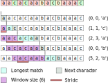
</center>

# Lempel-Ziv (1978)

-   LZ77 ha lo svantaggio di richiedere di fissare una lunghezza della *window*: dimensioni diverse possono portare a performance differenti.

-   L'anno successivo (1978), Lempel & Ziv pubblicarono un nuovo articolo in cui descrivevano un nuovo algoritmo che non aveva questo grado di libertà.

-   Il nuovo algoritmo, chiamato LZ78, si basa su un «dizionario» di sequenze già codificate, che possono essere richiamate quando si trovano loro ripetizioni.

-   La sequenza compressa è formata da una lista di coppie (*k*, *s*), dove *k* fa riferimento a un elemento del dizionario oppure è 0 se non esistono corrispondenze, e *s* è il nuovo simbolo da mettere in coda.

---

<center>
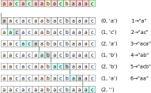
</center>

# I formati grafici più diffusi

# Il formato [BMP](https://en.wikipedia.org/wiki/BMP_file_format#:~:text=The%20BMP%20file%20format%2C%20also,and%20OS%2F2%20operating%20systems.)

-   È un formato ideato da Microsoft per Windows e OS/2.

-   Il formato originale non prevedeva la compressione dei dati, ma con gli anni Microsoft ha aggiunto il supporto per RLE e Huffman coding.

-   Permette di salvare file con *palette*, se si desidera comprimere ulteriormente il file.

-   Non è troppo difficile da scrivere, soprattutto se evitate di comprimere i dati.

# Il formato [GIF](https://en.wikipedia.org/wiki/GIF)

-   Usa la compressione LZW, che è una variante di LZ78: storicamente, è stato il primo formato di una certa diffusione a mostrare buoni livelli di compressione (1987).

-   Permette solo di codificare immagini con *palette*, quindi è limitato a 256 colori.

-   A causa di problemi di brevetti legati alla compressione LZW (ora scaduti), nel 1995 è stato rilasciato il formato PNG, che usa un algoritmo di compressione (DEFLATE) basato su LZ77, all'epoca non gravato da brevetti.

-   Oggi è usato esclusivamente per la sua capacità di salvare semplici animazioni.

# Il formato [PNG](https://en.wikipedia.org/wiki/Portable_Network_Graphics)

-   Supporta immagini con *palette* (come il GIF) ma anche immagini a 24 bit.

-   Implementa una compressione più efficiente di GIF, ispirata all'algoritmo LZ77.

-   Oggi è lo standard per le immagini su web, insieme al JPEG (v. in seguito).

# Il formato JPEG

-   È il formato più complesso tra quelli che vediamo oggi. Codifica i colori con 24 bit, ma internamente lavora nello spazio di colore Y C~B~ C~R~ anziché sRGB.

-   Decompone l'immagine in blocchi di 8×8 pixel, che «linearizza» in un vettore monodimensionale di 64 elementi.

-   Ad ogni componente di colore del vettore di 64 elementi è applicata la Discrete Cosine Transform (DCT)

-   I coefficienti DCT sono quantizzati a un livello variabile; questa quantizzazione fa perdere informazione (algoritmo **lossy**), ed è il parametro *quality* (da 0 a 100).

-   I coefficienti quantizzati sono compressi con Huffman o l'aritmetic coding.

---

<center>
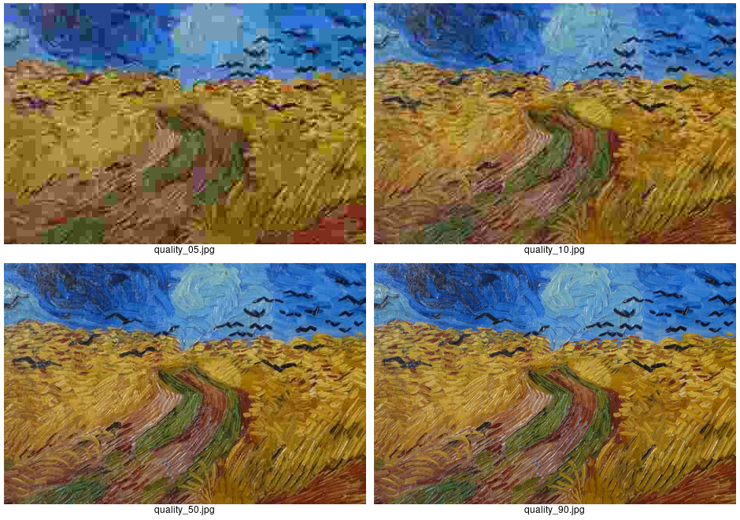
</center>

[Van Gogh, *Campo di grano con volo di corvi* (1890)]{style="float:right"}

# Il formato TIFF

-   Creato dalla Aldus Corporation per gestire le immagini salvate da scanner (1986), in seguito acquisito dalla Adobe.

-   Il più versatile dei formati visti qui:

    -   Immagini multiple in uno stesso file;
    -   Diversi schemi di compressione, sia **lossless** che **lossy** (RLE, LZW, JPEG, etc.);
    -   Supporta sia immagini a 24 bit che immagini con *palette*;
    -   I colori possono essere memorizzati in vari spazi di colore, non solo sRGB.

-   Molto diffuso nelle applicazioni (GIMP, Photoshop, etc.), non usato sul web.

# Il formato WebP

-   Creato da Google nel 2010.

-   Usa più algoritmi di compressione (LZW, JPEG, Huffman, …); l'effetto complessivo è un algoritmo **lossy**.

-   È il formato più efficiente tra quelli visti oggi.

-   Supportato su tutti i browser tranne sotto il Mac OS X (il supporto è stato aggiunto solo nel 2020 con Big Sur).

---

<center>
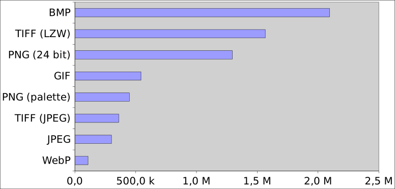
</center>

# Approfondimento: manipolare i bit

# Dai *byte* ai *bit*

-   Gli algoritmi di compressione solitamente si basano sulla rappresentazione in bit dei numeri interi (in tipi come quelli del C++: `int`, `uint8_t`, `uint32_t`, etc.)

-   Abbiamo già visto di sfuggita l'importanza di esplorare i bit all'interno dei byte quando abbiamo descritto il formato [UTF-8](./tomasi-ray-tracing-03a-images.html#/codifica-utf-8).

-   Vi lascio come riferimento una serie di slide che mostrano come manipolare i singoli bit all'interno di un byte; non ci serviranno però durante le esercitazioni.

# Operazioni sui bit in C++ (1/2)

-   Le due operazioni `<<` e `>>` sono dette *bit shift operators*, e traslano i bit verso destra o sinistra (sono infatti indicate con (`shl` e `shr` in Pascal), eliminando quelli alle estremità:

    ```
    0b00101110 >> 1 = 0b00010111         0b00101110 << 1 = 0b01011100
    0b00101110 >> 2 = 0b00001011         0b00101110 << 2 = 0b10111000
    0b00101110 >> 3 = 0b00000101         0b00101110 << 3 = 0b01110000
    0b00101110 >> 4 = 0b00000010         0b00101110 << 4 = 0b11100000
    ```

-   L'operazione `x << 1` equivale a un prodotto per due, proprio come l'aggiunta di uno zero in fondo a un numero decimale equivale al prodotto per dieci (13 → 130).

-   In generale, `x << n` è matematicamente uguale a $2^n \times x$, e `x >> n` è uguale a $\lfloor 2^{-n} \times x\rfloor$.

# Operazioni sui bit in C++ (2/2)

-   Il C++ implementa gli operatori *logici* `&&` (*and*), `||` (*or*) e `^^` (*xor*):

    ```
    true  && true  == true     true  || true  == true     true  ^^ true  == false
    true  && false == false    true  || false == true     true  ^^ false == true
    false && true  == false    false || true  == true     false ^^ true  == true
    false && false == false    false || false == false    false ^^ false == false
    ```

-   Le operazioni `&`, `|` e `^` corrispondono all'*and*, *or* e *xor* logici `&&`, `||`, `^^`, ma sono fatte sui bit:

    ```
    0b00011001 &               0b00011001 |               0b00011001 ^
    0b10010101 =               0b10010101 =               0b10010101 =
    ----------                 ----------                 ----------
    0b00010001                 0b10011101                 0b10001100
    ```

# `write_float`

Due settimane fa avevo fornito questo codice C++ per estrarre i quattro byte di cui è composta la variabile `uint32_t double_word`:

```c++
// To interpret this code, you must remember that:
// -   uint32_t double_word is made by 8×4 = 32 bit
// -   0xFF is the uint32_t number
//
//     0b0000_0000_0000_0000_0000_0000_1111_1111

// Extract the four bytes in "double_word" using bit-level operators
uint8_t bytes[] = {
    static_cast<uint8_t>(double_word & 0xFF),         // Least significant byte
    static_cast<uint8_t>((double_word >> 8) & 0xFF),
    static_cast<uint8_t>((double_word >> 16) & 0xFF),
    static_cast<uint8_t>((double_word >> 24) & 0xFF), // Most significant byte
};
```

# Applicazione: `BitWriter`

```python
class BitWriter:
    "Write a sequence of bits into several 8-bit bytes"
    def __init__(self):
        self.seq_of_bytes = []
        self.bits_written = 0
        self.cur_byte = 0

    def push(self, value):
        self.cur_byte = (self.cur_byte << 1) + value
        self.bits_written += 1
        if self.bits_written == 8:
            self.seq_of_bytes.append(self.cur_byte)
            self.bits_written = 0
            self.cur_byte = 0
```

# Esempio di `BitWriter`

-   Questo codice usa `BitWriter` per scrivere una sequenza di 16 cifre binarie (0/1) in `output_stream`, e poi stampa i due byte che le contengono.

    ```python
    output_stream = BitWriter()
    for value in "1100 1001 0100 1101".replace(" ", ""):
        output_stream.push(int(value))

    print("Sequence of bytes produced by BitWriter:")
    for idx, value in enumerate(output_stream.seq_of_bytes):
        print("Byte #{0}: {1:3d} (0b{1:08b}, 0x{1:02x})".format(idx, value))
    ```

-   Output:

    ```text
    Sequence of bytes produced by BitWriter:
    Byte #0: 201 (0b11001001, 0xc9)
    Byte #1:  77 (0b01001101, 0x4d)
    ```

# `BitReader`

```python
class BitReader:
    "Decompose a sequence of bytes into binary digits"
    def __init__(self, seq_of_bytes):
        self.seq_of_bytes = seq_of_bytes
        self.cur_bit = 0

    def pop(self):
        result = (self.seq_of_bytes[0] & 0b10000000) >> 7

        self.seq_of_bytes[0] = self.seq_of_bytes[0] << 1
        self.cur_bit += 1
        if self.cur_bit == 8:
            self.cur_bit = 0
            self.seq_of_bytes = self.seq_of_bytes[1:]

        return result
```

# Esempio `BitReader`

-   Possiamo usare `BitReader` passandogli come input i due byte prodotti da `BitWriter` nell'esempio precedente:

    ```python
    input_stream = BitReader(output_stream.seq_of_bytes)
    print("Sequence of bits as decoded by BitReader:")
    for i in range(16):
        print(input_stream.pop(), end=" ")
    ```

-   Output:

    ```text
    Sequence of bits as decoded by BitReader:
    1 1 0 0 1 0 0 1 0 1 0 0 1 1 0 1
    ```

# Codifica aritmetica (1/5)

-   Vediamo ora come implementare l'algoritmo della codifica aritmetica per associare un intervallo $[\alpha, \beta]$ a una sequenza di byte.

-   L'algoritmo usa il concetto di «intervallo», quindi definiamo un tipo `Interval` che codifica una coppia di numeri reali:

    ```python
    from dataclasses import dataclass

    @dataclass
    class Interval:
        start: float = 0.0
        end: float = 1.0

        def __repr__(self):
            return f"[{self.start:.7f}, {self.end:.7f}]"
    ```

# Codifica aritmetica (2/5)

-   La codifica aritmetica ha bisogno di conoscere la probabilità con cui ogni byte compare nella sequenza.

-   Usiamo i `set` di Python per costruire una lista di tutti i simboli che compaiono nella sequenza, e poi usiamo `count` per contare ciascuna corrispondenza:

    ```python
    def probabilities(seq):
        symbols = set(seq)  # In our example, symbols == set("a", "b", "c")
        length = len(seq)   # Length of the sequence to compress
        return {x: seq.count(x) / length for x in symbols}
    ```

# Codifica aritmetica (3/5)

-   Una volta note le probabilità di ogni elemento, bisogna suddividere l'intervallo $[0, 1]$ secondo le probabilità di ciascun simbolo.

-   La funzione `intervals` invoca `probabilities` e costruisce un dizionario che associa ad ogni simbolo il proprio intervallo `Interval`:

    ```python
    def intervals(seq):
        probs = probabilities(seq)
        intervals = {}
        curpos = 0.0
        for s in sorted(probs.keys()):
            intervals[s] = Interval(start=curpos, end=curpos + probs[s])
            curpos += probs[s]

        return intervals
    ```

# Codifica aritmetica (4/5)

```python
def arithmetic_compression(seq):
    spans = intervals(seq)

    cur_span = Interval()
    for s in seq:
        print(f"Current interval: {cur_span}")
        subspan = spans[s]
        curlen = cur_span.end - cur_span.start
        new_span = Interval(
            start=cur_span.start + curlen * subspan.start,
            end=cur_span.start + curlen * subspan.end,
        )
        cur_span = new_span

    return cur_span
```

# Codifica aritmetica (5/5)

-   Verifichiamo il funzionamento del codice sulla nostra sequenza:

    ```python
    sequence = "aacacaabacbaaac"
    final_span = arithmetic_compression(sequence)
    print(f"Result for '{sequence}': {final_span}")
    ```

-   L'output è il seguente:

    ```text
    Current interval: [0.0000000, 1.0000000]
    Current interval: [0.0000000, 0.6000000]
    Current interval: [0.0000000, 0.3600000]
    …
    Current interval: [0.3099529, 0.3099586]
    Current interval: [0.3099529, 0.3099563]
    Result for 'aacacaabacbaaac': [0.3099554, 0.3099563]
    ```
