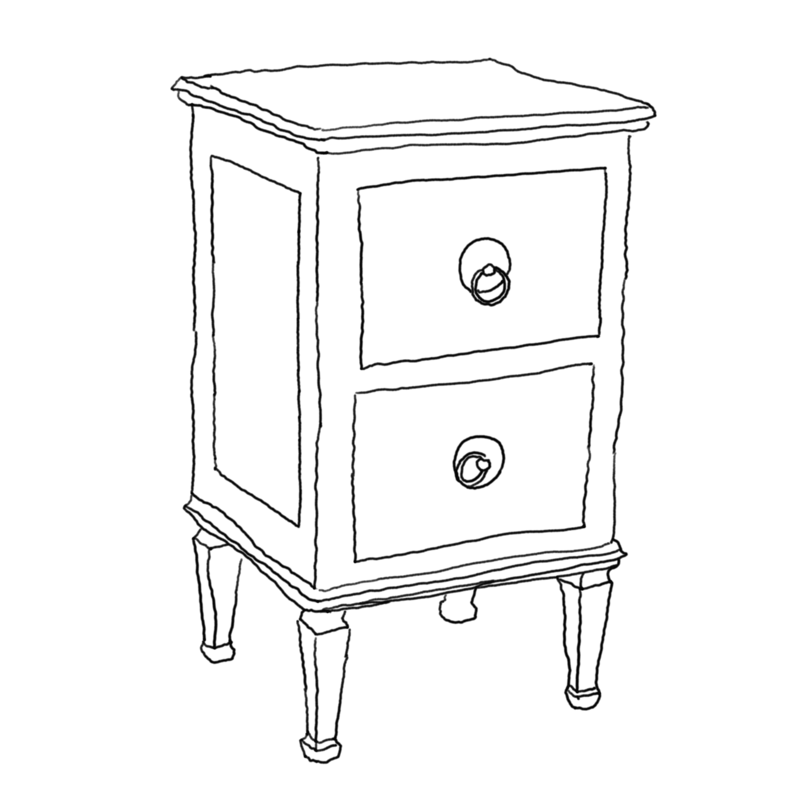
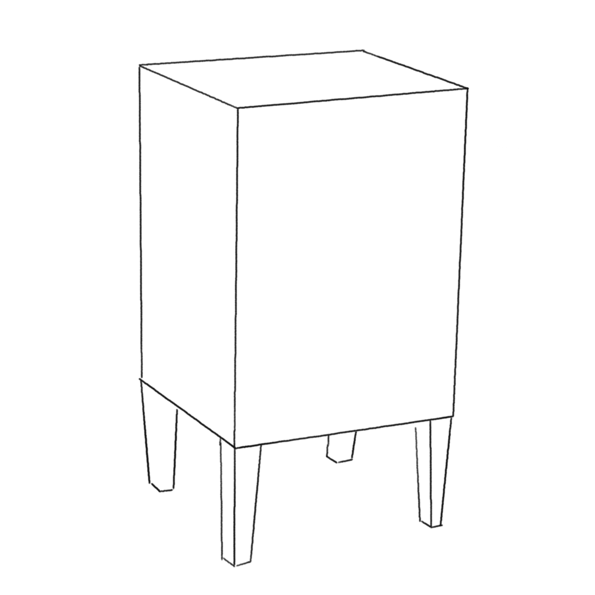
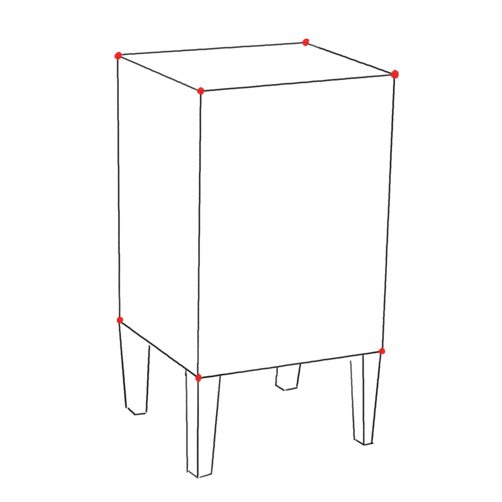

---

---

---

# Lezioni imparate oggi

---

-   Sempre definire in modo accurato le quantità misurabili (energia, flusso, radianza, etc.).
-   Assicurarsi di studiare un modello fisico in casi semplici (spazio vuoto, sferetta e piano, sferetta e due piani, etc.), per *capire* il modello prima di usarlo.
-   Il mondo è *complicato*!
night-stand-lines.png
night-stand-photo.jpg
night-stand-sketch.png
night-stand-vertexes.png
