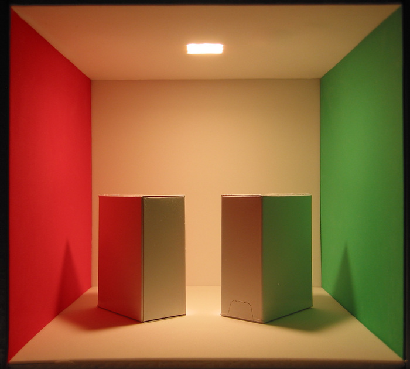
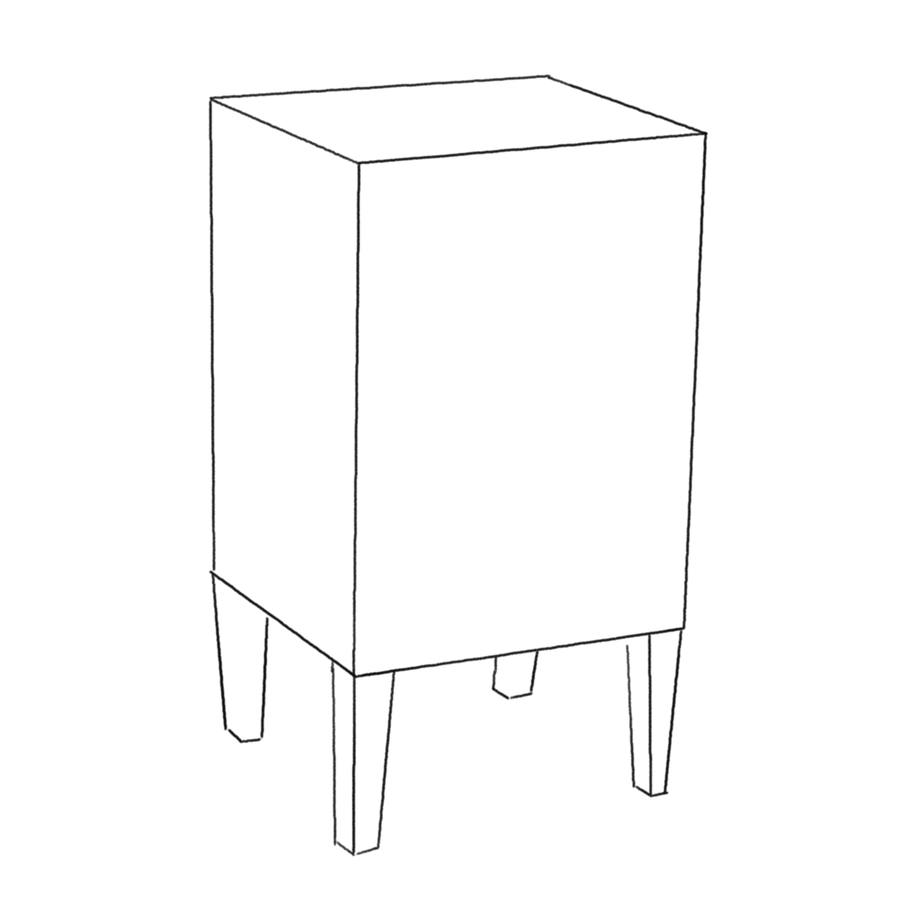
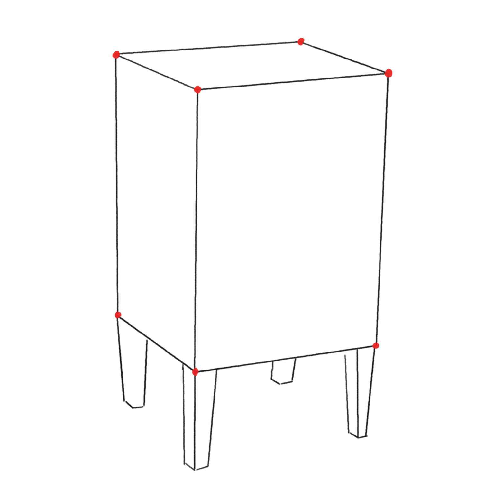
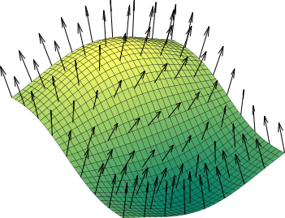
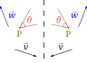
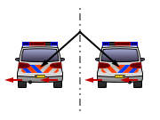
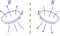
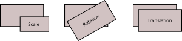

# Modeling objects {#modeling-objects}

# «Cornell box»

{height=560}

# «Cornell box»

{height=560}

---

<center>
{height=620}
</center>

---

<center>
{height=620}
</center>

---

<center>
{height=620}
</center>

---

<center>
{height=620}
</center>

# The Geometric Problem

-   Placement of objects in space?
-   Where is the observer, and what are they looking at?
-   Surface of the objects?

# Positions and Transformations

-   The geometric description of an object in space usually makes use of transformations.

-   These transformations are necessary to place the objects that make up the scene so that their position, orientation, and size are as desired.

-   The position of the camera is also specified through transformations that identify its position (where is the observer?) and orientation (in which direction are they looking?).

# Light/surface interaction

<center>

</center>

The way a ray of light interacts with a surface depends on the BRDF, which [is expressed in terms of the angle](tomasi-ray-tracing-01a.html#/brdf) $\theta = N_x \cdot \Psi$ between the direction of incidence $\Psi$ and the normal $N_x$ to the surface at point $x$.

# Using Geometry

Our code will simulate the propagation of light rays in the environment:

-   Each ray will start from a **point**…

-   …and will propagate along the direction encoded by a **vector**…

-   …until it hits the surface of an object; at that point the code will have to calculate the angle between the direction of arrival and the **normal**.

All this is complicated by the fact that each object will have its own orientation in space, encoded by a transformation (translation, rotation…).

# Encoding Geometry

To solve the rendering equation numerically, our code must correctly handle all the quantities named in the previous slide:

-   **Points** in three-dimensional space (sources of light rays, vertices of the bedside table);
-   3D **Vectors** (directions of light propagation);
-   **Normals** (the inclination of the surface at a point);
-   **Matrices** (transformations applied to objects and to the observer).

Let's review the properties of these geometric objects.

# Linear Algebra Review

# Points and Vectors

-   A **point** encodes a position in three-dimensional space. Example: the position $P(t)$ of a particle at time $t$.

-   A **vector** encodes a direction and is not associated with a specific point in space. Example: the velocity $\vec v(t)$ of a particle.

-   The difference between two points is a vector. Example:

    \[
        \vec v(t) = \lim_{\delta t \rightarrow 0} \frac{P(t + \delta t) - P(t)}{\delta t}.
    \]

-   Vectors are also used to define **bases** (reference systems), so let's explore them further.

# Vector Spaces

A vector space $V$ over a field $F$ is a non-empty set $V$ of elements, called *vectors*, associated with two operators $+: V \times V \rightarrow V$ and $\cdot: F \times V \rightarrow V$ that satisfy these properties $\forall u, v, w \in V, \forall \alpha, \beta \in F$:

#.  $+$ is commutative and associative;
#.  There exists a vector $0$ which is the identity element for $+$;
#.  $\forall u \in V,\ \exist -u \in V: u + (-u) = 0$;
#.  $\alpha(\beta v) = (\alpha\beta) v,\quad (\alpha + \beta) v = \alpha v + \beta v,\quad \alpha(v + u) = \alpha v + \alpha u$;
#.  If $1 \in F$ is the multiplicative identity element in $F$, then $1u = u$.

# Inner Product

-   Given a vector space $V$ over $F$, the inner product is an operation $\left<\cdot, \cdot\right>: V \times V \rightarrow F$ that has the following properties $\forall u, v, w \in V, \forall \alpha \in F$:

    #.  $\left<\alpha u, v\right> = \alpha \left<u, v\right>$;
    #.  $\left<u + v, w\right> = \left<u, w\right> + \left<v, w\right>$;
    #.  $\left<u, v\right> = \overline{\left<v, u\right>}$;
    #.  $\left<u, u\right> > 0$ if $u \not= 0$.

-   Scalar product on $\mathbb{R}^3$: $\vec u \cdot \vec v = \left\|\vec u\right\|\,\left\|\vec v\right\|\,\cos\theta$.

-   Two vectors $u$ and $v$ are defined as *orthogonal* if $\left<u, v\right> = 0$.

# Norm of a Vector

-   Given an inner product, we can define the *norm* $\left\|\cdot\right\|: V \rightarrow F$ as follows:

    $$
    \left\|u\right\| = \sqrt{\left<u, u\right>},
    $$

    which is positive definite and is zero only if $u = 0$.

-   A vector $u$ such that $\left\|u\right\| = 1$ is called *normalized*.

# Linear spans

-   The span of a set of vectors $\{v_i\}_{i=1}^N$ is the set

    $$
    \mathrm{Span}\left(\{v_i\}_{i=1}^N\right) = \left\{\sum_{i=1}^N \alpha_i v_i,\ \forall \alpha_i \in F\right\}.
    $$

-   In the case of $\mathbb{R}^3$:
    #.  The span of $\vec v$ is the line passing through 0 and aligned with $\vec v$.
    #.  The span of two non-parallel vectors $\vec v$ and $\vec w$ is the plane passing through the origin on which $\vec v$ and $\vec w$ lie. (See next slide).

# Plane generated by two vectors

```{.asy im_fmt="html" im_opt="-f html" im_out="img,stdout,stderr" im_fname="vector_generators"}
size(0,100);
import three;
currentlight=Viewport;

draw(O--2X, gray); //x-axis
draw(O--2Y, gray); //y-axis
draw(O--2Z, gray); //z-axis

real[][] rot = rotate(15, X) * rotate(30, Y);
path3 pl = ((2, -2, 0) -- (-2, -2, 0) -- (-2, 2, 0) -- (2, 2, 0) -- cycle);
draw(surface(rot * pl), green + opacity(0.2));
draw(rot * pl, black);
draw(rot * ((0, 0, 0) -- X), blue, Arrow3);
draw(rot * ((0, 0, 0) -- (0.3 * (X + 2Y))), red, Arrow3);
```


# Basis (1/2)

-   The vectors $\{v_i\}_{i=1}^N$ are said to be *linearly independent* if

    $$
    \sum_{i=1}^N \alpha_i v_i = 0
    $$

    holds if and only if $\alpha_i = 0\ \forall i=1\ldots N$.

-   A set of vectors $\left\{v_i\right\}_{i=1}^N$ is called *basis* of $B$ if they are linearly independent and they generate $V$, i.e.,

    $$
    \mathrm{Span}\left(\{v_i\}_{i=1}^N\right) = V.
    $$

# Basis (2/2)

-   If $V$ admits two bases $\left\{e_i\right\}_{i=1}^N$ and $\left\{f_i\right\}_{i=1}^M$, the number of elements in both is identical ($N = M$) and is called the *dimension* of $V$. (We ignore infinite-dimensional spaces in this course.)

-   An *orthonormal basis* of a vector space $V$ equipped with an inner product is defined as the set of vectors $\left\{e_i\right\}_{i=1}^N$ such that

    $$
    \left<e_i, e_j\right> = \delta_{ij}\quad\forall i, j = 1 \ldots N.
    $$

# Vector Representation

-   Given a basis $\{e_i\}_{i=1}^N$, it is always possible to write $v \in V$ as

    $$
    v = \sum_{i=1}^N \alpha_i e_i,
    $$

    where $\alpha_i \in F$. (Consequence of the fact that the basis spans the space $V$).

-   This representation is always unique; **if the basis is orthonormal** then

    $$\alpha_i = \left<v, e_i\right>.$$

-   Vectors are represented as column matrices: $v = (\alpha_1\ \alpha_2\ \ldots)^t$.

# Vector Representation

-   The fact that $\alpha_i = \left<v, e_i\right>$ holds **only** if the basis is orthonormal!

-   For example, consider the basis $e_1 = (1, 0), e_2 = (1, 1)$ on the plane $\mathbb{R}^2$. The vector $v = (4, 3)$ is decomposed by solving a linear system, and the solution is

    $$
    v = e_1 + 3 e_2 = \begin{pmatrix}1\\0\end{pmatrix} + 3 \begin{pmatrix}1\\1\end{pmatrix} = \begin{pmatrix}4\\3\end{pmatrix},
    $$

    but $\left<v, e_1\right> = 4$ and $\left<v, e_2\right> = 7$.

-   Our code will always use orthonormal bases: $\alpha_i = \left<v, e_i\right>$ is too convenient!

# Linear Transformations

-   A linear transformation from a vector space $V$ to a vector space $W$ is a linear function $f: V \rightarrow W$:

    $$
    f(\alpha u + \beta v) = \alpha f(u) + \beta f(v).
    $$

-   Linearity implies that $f(0) = 0$, because

    $$
    f(0) = f(v - v) = f(v) - f(v) = 0\quad\forall v \in V.
    $$

# Matrices (1/2)

-   A matrix $M$ is a set of scalar values $\left\{m_{ij}\right\} \in F$ that represents a linear transformation $f: V \rightarrow W$ according to a pair of bases for $V$ and $W$.

-   If $N$ is the dimension of $V$ and $M$ is the dimension of $W$, then the matrix $M$ representing $f: V \rightarrow W$ must have $n = N$ columns and $m = M$ rows.

# Matrices (2/2)

-   If the value of $f(e_i)$ is known for all $e_i$, $f$ can be calculated for any vector:

    $$
    f(v) = f\left(\sum_{i=1}^N \alpha_i e_i\right) =
    \sum_{i=1}^N \alpha_i f(e_i).
    $$

-   The previous point is related to the fact that the $i$-th column of the matrix $M$ contains the representation of $f(e_i)$, with $e_i$ being the $i$-th element of the so-called **canonical basis** of $V$: $e_1 = (1\ 0\ 0\ldots)^t, e_2 = (0\ 1\ 0\ldots)^t$, etc.

# First Example

-   Consider the matrix in $\mathbb{R}^2$

    $$
    M = \begin{pmatrix}3&4\\2&-1\end{pmatrix}
    $$

    and the canonical basis $e_1 = (1\ 0)^t, e_2 = (0\ 1)^t$.

-   It is easy to see that the first column of $M$ is equal to $M e_1$ and the second to $M e_2$:

    $$
    M e_1 = \begin{pmatrix}3&4\\2&-1\end{pmatrix} \begin{pmatrix}1\\0\end{pmatrix} = \begin{pmatrix}3\\2\end{pmatrix},\ {}
    M e_2 = \begin{pmatrix}3&4\\2&-1\end{pmatrix} \begin{pmatrix}0\\1\end{pmatrix} = \begin{pmatrix}4\\-1\end{pmatrix}.
    $$

# Second Example {#second-example-rotation}

-   Let's write the matrix $R(\theta)$ that represents a rotation of $\theta$ around the origin of the Cartesian $xy$ plane.

-   As stated before, it is sufficient to calculate $R(\theta) e_1$ and $R(\theta) e_2$:

    $$
    R(\theta) e_1 = \begin{pmatrix}\cos\theta\\\sin\theta\end{pmatrix}, \quad
    R(\theta) e_2 = \begin{pmatrix}\cos(\theta + 90^\circ)\\\sin(\theta + 90^\circ)\end{pmatrix} = \begin{pmatrix}-\sin\theta\\\cos\theta\end{pmatrix},
    $$

    because they are the columns of the matrix $R(\theta)$:

    $$
    R(\theta) = \begin{pmatrix}\cos\theta&-\sin\theta\\\sin\theta&\cos\theta\end{pmatrix}.
    $$

# Reflections

-   Let's now consider a particular type of transformation, called *reflection*.

-   Points, vectors, and angles transform intuitively with respect to reflections:

    <center>
    {height=380px}
    </center>

# Pseudovectors

-   Now consider a car moving away from us, and its mirrored copy.

-   The angular momentum of the wheels $\vec L$ does **not** transform like a normal vector under reflection: it is a *pseudovector*.

    <center>
    {height=380px}
    </center>

# Pseudovectors

-   The problem with $\vec\omega$ is that it is defined through the cross product: $\vec \omega = \vec r \times \vec p$, and the result of a cross product is *always* a pseudovector.

-   This can also be seen in the case of Ampère's law:

    <center>
    {height=380px}
    </center>


# Transformations {#transformations}

---

<center>

</center>

# Transformation Types

In our code, we will implement only **invertible** transformations:

1. Scaling (enlargement/reduction);
2. Rotation around an axis;
3. Translation (displacement).

    <center>
    
    </center>

# Scaling Transformations {#scaling-transformations}

# General Properties

-   A scaling transformation is represented by a diagonal matrix $M = \mathrm{diag}(s_1, s_2, \ldots)$ with $s_i \not= 0\ \forall i$:

    $$
    M = \begin{pmatrix}s_1& 0& \vdots\\0& s_2& \vdots\\\ldots& \ldots&\end{pmatrix}.
    $$

-   Scaling transformations where $s_i < 0$ are also called *reflections* with respect to the $i$-th axis (reflection across a mirror).

# Example

-   A circle on the plane can be transformed into an ellipse through a scaling transformation; in the example below, $M = \mathrm{diag}(1/2, 1)$:

    <center>
    ```{.gle im_fmt="svg" im_opt="-cairo -device svg" im_out="img" im_fname="scale-demo"}
    size 10 4

    amove 2 2
    circle 2 fill grey50

    amove 7.5 2
    begin scale 0.5 1.0
        circle 2 fill grey20
    end scale
    ```
    </center>

-   A reflection with respect to the $y$ axis is represented by $M = \mathrm{diag}(1, -1)$.

    <center>
    ```{.gle im_fmt="svg" im_opt="-cairo -device svg" im_out="img" im_fname="reflect-demo"}
    size 10 4

    begin path fill grey50 stroke
        amove 7 0
        rline 3 0
        rline 0 4
        closepath
    end path

    begin path fill grey20 stroke
        amove 3 0
        rline -3 0
        rline 0 4
        closepath
    end path
    ```
    </center>

# Transformations and Normals {#transformations-and-normals}

-   We already have a problem with this type of transformation!

-   The normals to the objects do not transform as they should:

    <center>
    
    </center>

-   What is the transformation law for normals?

# Transformations and Normals

-   A normal $\hat n$ is defined in terms of the tangent vector $\hat v$:

    $$
    \hat n^t \hat v = 0.
    $$

-   Suppose we want to apply the (invertible) transformation $N$ to the vector $\hat v$. We must apply a transformation $M$ to the vector $\hat n$ such that

    $$
    \left(M \hat n\right)^t \left(N \hat v\right) = 0.
    $$

# Transformations and Normals

-   Knowing that $\left(A B\right)^t = B^t A^t$, we obtain

    $$
    \left(M \hat n\right)^t \left(N \hat v\right) = 0\quad\Rightarrow\quad\hat n^t \left(M^t N\right) \hat v = 0.
    $$

-   Already knowing that $\hat n^t \hat v = 0$, it follows that the equation is true if

    $$
    M^t N = \mathbb{1}\quad\Rightarrow\quad M = \left(N^{-1}\right)^t,
    $$

    where we have used the assumption that the transformation $N$ has an inverse.

# Handling Normals

-   Note that the result we obtained is *general*: it is not only valid for scaling transformations, but for **any** invertible transformation $N$.

-   In numerical code, it is convenient to store both the matrix $N$ corresponding to a transformation and the transpose of its inverse $\left(N^{-1}\right)^t$ in a type (`struct`, `class`, `record`, etc.) that represents an invertible transformation: it uses more memory, but the calculations are faster.

# Rotations {#rotations}

# Formalism

-   To define a rotation on the plane around the origin, only **one** degree of freedom is sufficient.

-   However, to define a rotation in three dimensions around the origin, **three** degrees of freedom are needed: the rotation axis and the angle. (The rotation axis is a unit-length vector, so it only has two degrees of freedom).

-   There are various ways to represent a rotation, some more effective than others depending on the context: Euler angles, axis/angle, rotation matrices, quaternions. We will focus on rotation matrices.


# Rotations and Matrices

-   In 2D, we already wrote the [rotation matrix around the origin](./tomasi-ray-tracing-05a-geometry.html#/second-example-rotation):

    $$
    R(\theta) v = \begin{pmatrix}\cos\theta&-\sin\theta\\\sin\theta&\cos\theta\end{pmatrix} \begin{pmatrix}v_1\\v_2\end{pmatrix} =
    \begin{pmatrix}v_1\cos\theta - v_2\sin\theta\\v_1\sin\theta + v_2\cos\theta\end{pmatrix}.
    $$

    <center>
    ```{.gle im_fmt="svg" im_opt="-cairo -device svg" im_out="img" im_fname="rotation-demo"}
    size 6 4
    set hei 0.6
    set lwidth 0.04

    amove 0 1
    rline 6 0 arrow end

    amove 3 0
    rline 0 4 arrow end

    amove 3 1
    begin rotate 30
        rline 2 0
        ellipse 0.1 0.1 fill black
    end rotate

    amove 3 1
    begin rotate 50
        rline 2 1
        ellipse 0.1 0.1 fill gray50
    end rotate

    arc 1 30 80

    amove 3.75 2
    text θ

    amove 5 2
    text v

    amove 3.9 3.2
    text r(θ)v
    ```
    </center>

-   In two dimensions, $R(\alpha) R(\beta) = R(\beta) R(\alpha) = R(\alpha + \beta)$.

# 3D Rotations

-   In 3 dimensions, rotations can be considerably more complex because there are infinitely many axes that can be used for rotation around the origin!

    <center>
        <video src="./media/rotating-cubes.mp4" width="960" height="360" controls loop autoplay/>
    </center>

-   In general, a matrix $R$ in $\mathbb{R^n}$ represents a rotation if and only if $\det R = 1$ and $R R^t = \mathbb{1}$, i.e., if its transpose coincides with its inverse.

# Composition of Rotations

-   In 3D, the composition of rotations **does not commute** (unlike the 2D case).

-   The two dice below undergo two rotations $R_1$ and $R_2$: for the red die, the rotation is $R_1 R_2$, for the green die it is $R_2 R_1$. We can see that the final positions are different:

    <center>
        <video src="./media/rotation-commutativity.mp4" width="640" height="360" controls/>
    </center>

# Elementary Rotations

-   It is easy to write the rotations around the three axes $\hat e_x$, $\hat e_y$ and $\hat e_z$. For example, the rotation around $\hat e_z$ is

    $$
    R_z(\theta) v = \begin{pmatrix}\cos\theta&-\sin\theta&0\\\sin\theta&\cos\theta&0\\0&0&1\end{pmatrix}.
    $$

-   It is possible to write a matrix $R_{\hat v}(\theta)$ that describes a rotation by an angle θ around an arbitrary axis $\hat v$; see the [Wikipedia page](https://en.wikipedia.org/wiki/Rotation_matrix#Basic_rotations) for details.

# Euler Angles

-   A generic rotation $R_{\hat v}(\theta)$ can always be expressed as a product of the elementary rotations $R_x(\theta_x)$, $R_y(\theta_y)$ and $R_z(\theta_z)$ for appropriate values of $\theta_x, \theta_y, \theta_z$.

-   This property is the basis of the formalism of rotations with [Euler angles](https://en.wikipedia.org/wiki/Euler_angles), which, however, we will not use in our code.


# Translations {#translations}

# The Problem of Translations

-   A translation $T_{\vec{k}}$ is an operation that moves a point $P$ by $\vec{k}$:

    $$
    T_{\vec{k}} (P) = P + \vec{k}.
    $$

-   So far we have used matrices to represent scaling and rotation transformations. Unfortunately, 3×3 matrices **cannot** represent translations in three-dimensional space: a translation $T$ is not a linear operator! If it were, then it would hold that

    $$
    T_{\vec{k}}(0) = 0\quad\forall\ \vec{k}.
    $$

# Homogeneous Coordinates {#homogeneous-coordinates}

-   Fortunately, there is a trick, widely used in *computer graphics*, which consists of using **homogeneous coordinates**.

-   In homogeneous coordinates, we consider the space $\mathbb{R}^4$ instead of $\mathbb{R}^3$, and we write points $P$ and vectors $\vec{v}$ differently:

    $$
    P = \begin{pmatrix}p_x\\p_y\\p_z\\1\end{pmatrix}, \quad
    \vec{v} = \begin{pmatrix}v_x\\v_y\\v_z\\0\end{pmatrix}.
    $$

# Homogeneous Transformations

-   A matrix $M$ is transformed into homogeneous coordinates by adding a row and a column:

    $$
    M =
    \begin{pmatrix}
    m_{11}&m_{12}&m_{13}\\
    m_{21}&m_{22}&m_{23}\\
    m_{31}&m_{32}&m_{33}
    \end{pmatrix}\ \rightarrow%
    \ M_h =
    \begin{pmatrix}
    m_{11}&m_{12}&m_{13}&0\\
    m_{21}&m_{22}&m_{23}&0\\
    m_{31}&m_{32}&m_{33}&0\\
    0&0&0&1
    \end{pmatrix}
    $$

-   From the block form of $M_h$, it is easy to understand that applying $M_h$ to $P$ and $\vec{v}$ leads to the same result as in the non-homogeneous case in $\mathbb{R}^3$.

# Translations

-   In homogeneous coordinates, the translation operation along a vector $\vec{k}$ is linear, and is represented as follows:

    $$
    T_{\vec{k}} =
    \begin{pmatrix}
    1&0&0&k_x\\
    0&1&0&k_y\\
    0&0&1&k_z\\
    0&0&0&1
    \end{pmatrix}
    $$

-   The operator is obviously linear because it is in matrix form.

# Properties

-   $T_{\vec{k}}^{-1} = T_{-\vec{k}}$: the inverse transformation of the translation along $\vec{k}$ is the translation along $-\vec{k}$;
-   $T_{\vec{u}} T_{\vec{w}} = T_{\vec{u} + \vec{w}}$: the composition of two translations is equal to the translation along the sum of the two vectors;
-   $T_{\vec{u}} T_{\vec{w}} = T_{\vec{w}} T_{\vec{u}}$: translations are commutative operators;
-   $T_{\vec{k}} \vec{v} = \vec{v}$: unlike points, vectors are not translated.

# Rototranslations

-   Composing a translation $T_{\vec{k}}$ and a rotation $R(\theta)$ depends on the order: the result of $T_{\vec{k}}\,R(\theta)$ is different from that of $R(\theta)\,T_{\vec{k}}$:

    <center>
        <video width="640" height="360" src="./media/rototranslation.mp4" controls/>
    </center>

-   It can be verified that homogeneous matrices correctly implement this behavior.


# Version numbers {#version-numbers}

# Purpose of Version Numbers

-   Every program should have a **version number** associated with it, which indicates how up-to-date the program is.
-   A user can compare a version number on the official website of the program with the one installed on their computer.
-   Many different approaches to version numbers exist.

# Example I: Release Date

-   Ubuntu Linux: a Linux distribution.
-   The version number is the release date in the form `year.month`, associated with a nickname like «Focal fossa» (20.04).
-   Linked to a strict release schedule (every 6 months).
-   The C++ ISO standards follow a similar scheme, using only the year: C++11, C++14, C++17, C++20, …
-   Useful especially if following a rigid and regular schedule.

# Example II: Irrational Number

-   TeX: a digital typography program created by Donald Knuth (to type *The Art of Computer Programming*, 1962–2019).
-   The version is the rounding of the value of $\pi$, where each subsequent version adds a digit:

    -   3
    -   3.1
    -   3.14
    -   3.141…

-   METAFONT, the program that manages TeX fonts, uses $e = 2.71828\ldots$
-   Mathematically fascinating, but impractical!

# Example III: Even/Odd Versions

-   Versions indicated with `X.Y`, where `X` is the «major version» and `Y` is the «minor version».
-   If `Y` is even, the version is **stable** (e.g., `2.0`, `2.2`, `2.4`, …); otherwise, it is a **development** version (e.g., `2.1`, `2.3`, `2.5` …), not ready for use by the general public but only by more experienced users.
-   [Nim](https://nim-lang.org/), [Gtk+](https://www.gtk.org/), [GNOME](https://www.gnome.org/), [Lilypond](http://lilypond.org/) follow this approach.
-   Widely used in the past, now tends to be abandoned: experience has shown that odd versions often tend to become «eternal».

# Example IV: *Semantic Versioning*

-   The scheme we will use in this course is called [*semantic versioning*](https://semver.org/), used for example by Julia. It uses the `X.Y.Z` scheme:
    -   `X` is the «major version»
    -   `Y` is the «minor version»
    -   `Z` is the «patch version»
-   The rules for assigning values to `X`, `Y`, and `Z` are strict and allow users to decide whether it is worth updating software or not.

# Semantic Versioning (1/2)

-   The `X.Y.Z` scheme is used, starting from version `0.1.0`.
-   With each release of a new version, one of these rules is followed:
    -   Increment `Z` («patch number») if only bugs have been fixed;
    -   Increment `Y` («minor number») and reset `Z` to zero if new features have been added;
    -   Increment `X` («major number») and reset `Y` and `Z` to zero if features have been added that make the program **incompatible** with the last released version.

# Semantic Versioning (2/2)

-   In the early stages of a project, new versions are released quickly and are used by «beta testers»; it is not important to indicate when incompatibilities are introduced because these are frequent, but the users are still few.
-   Version `1.0.0` should be released when the program is ready to be used by general users.
-   Consequently, versions prior to `1.0.0` follow different rules:
    -   Increment `Z` if bugs are fixed;
    -   Increment `Y` and reset `Z` in all other cases.

# Example (1/3)

-   We have written a program that prints `Hello, world!`:

    ```
    $ ./hello
    Hello, wold!
    ```

-   The first «official» version we release, after numerous beta versions (it's a complex project!), is obviously `1.0.0`.

-   We realize that the program prints `Hello, wold!`, so we fix the problem and release version `1.0.1` (bug fix).

# Example (2/3)

-   We add a new feature: if a name like `Maurizio` is passed from the command line, the program prints `Hello, Maurizio!`. Without arguments, the program still writes `Hello, world!`:

    ```
    $ ./hello
    Hello, world!

    $ ./hello Maurizio
    Hello, Maurizio!
    ```

-   We have added a feature but preserved compatibility (without arguments, the program still works the same as version `1.0.1`), so the new version will be `1.1.0`.


# Example (3/3)

-   We decide it is time to introduce internationalization into our code (*internationalization*, abbreviated as I18N).

-   The code checks the value of the `$LANG` environment variable (used on Unix systems) and decides which language to print the message in:

    ```
    $ ./hello Maurizio     # …when I run it on a english-talking machine
    Hello, Maurizio!
    $ LANG=it_IT.UTF-8 ./hello Maurizio
    Salve, Maurizio!
    ```

-   The program is **not compatible** with version `1.1.0` because on an Italian machine it now prints `Salve, mondo!` instead of `Hello, world!`.

-   Therefore, I must release version `2.0.0`.


# User Perspective

1.  If a new «patch release» of the version being used is released (e.g., `1.3.4` → `1.3.5`), the user should **always** update.
2.  If a new «minor release» of the version being used is released (e.g., `1.3.4` → `1.4.0`), the user should update only if they consider the new features useful.
3.  A new «major release» (e.g., `1.3.4` → `2.0.0`) should be installed only by new users or by those who intend to update the way they use the program.


# Example: Textualize 2.0.0

-   In February 2025, version 2.0.0 of [Textualize](https://github.com/Textualize/textual), a Python application framework for creating pseudo-graphical interfaces from the terminal, was released.

-   The [release notes](https://github.com/Textualize/textual/releases/tag/v2.0.0) provide this explanation:

    > It took us more than 3 years to get to 1.0. But a couple of months to get to 2.0? Why?
    >
    > We follow [Semver](https://semver.org/) which says that after 1.0, all breaking changes bump the major version number. We have some breaking changes here, which will be trivial to fix -- if they effect you at all. But a breaking change is a breaking change!

# Disadvantages of semantic versioning

-   Sometimes it is difficult to establish whether a change is "breaking" or not (see for example the article [Semantic Versioning Will Not Save You](https://hynek.me/articles/semver-will-not-save-you/)) or this [XKCD comic](https://xkcd.com/1172/).

-   For projects with a large critical mass, it may make more sense to use the release date, as is the case with C++.  Python is also moving in this direction with [PEP 2026](https://peps.python.org/pep-2026/).

-   We will use *semantic versioning* for consistency, but in your projects you should evaluate which is the most appropriate solution.


---
title: "Lesson 5"
subtitle: "Calcolo numerico per la generazione di immagini fotorealistiche"
author: "Maurizio Tomasi <maurizio.tomasi@unimi.it>"
...
