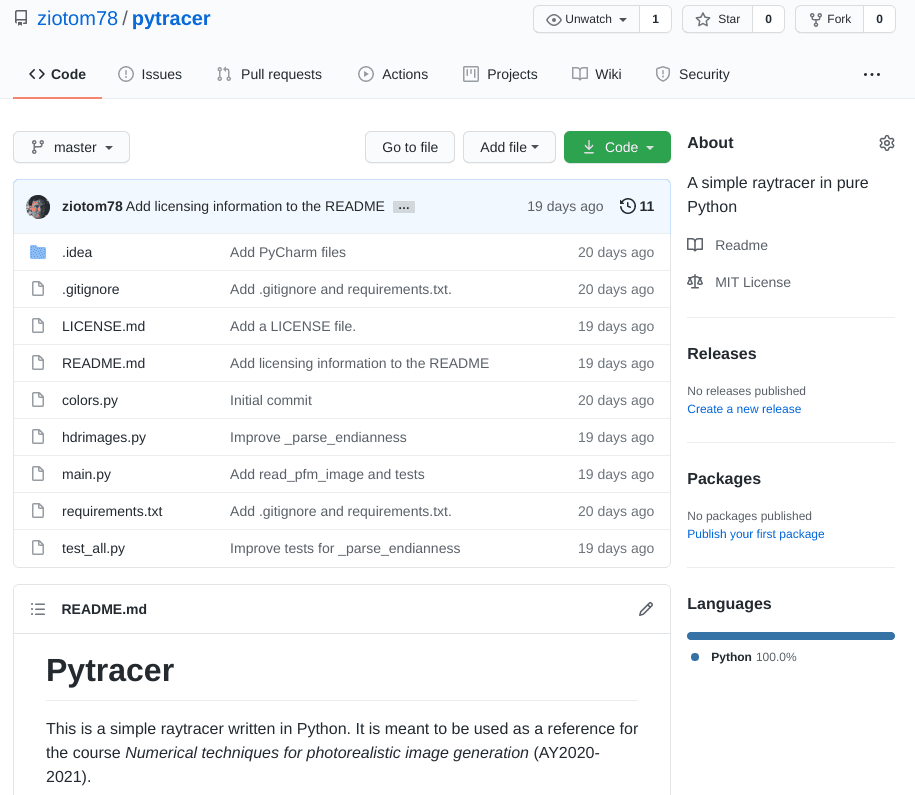
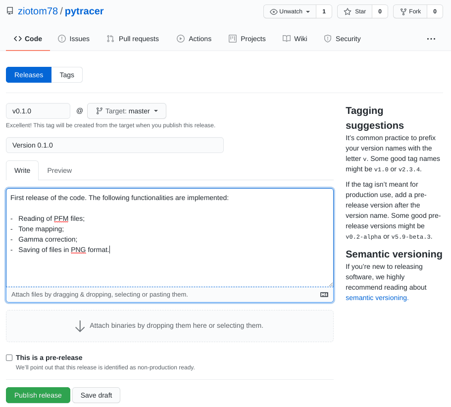
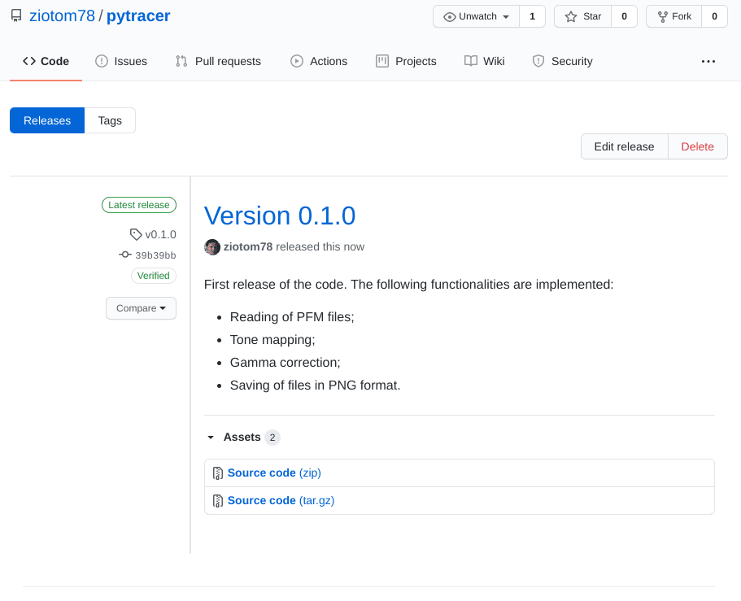
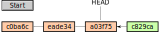
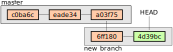
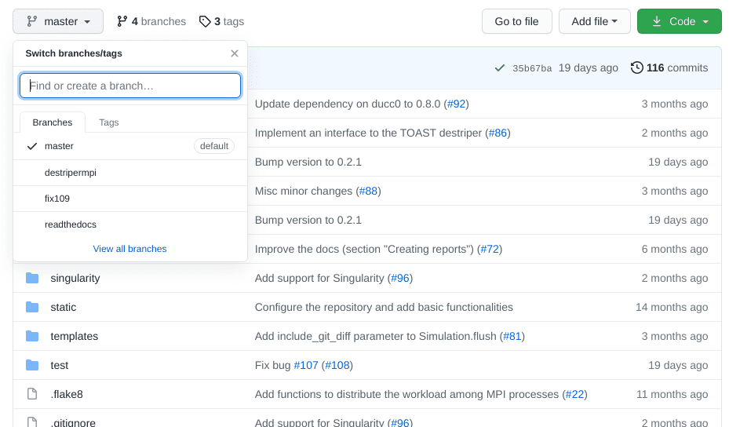
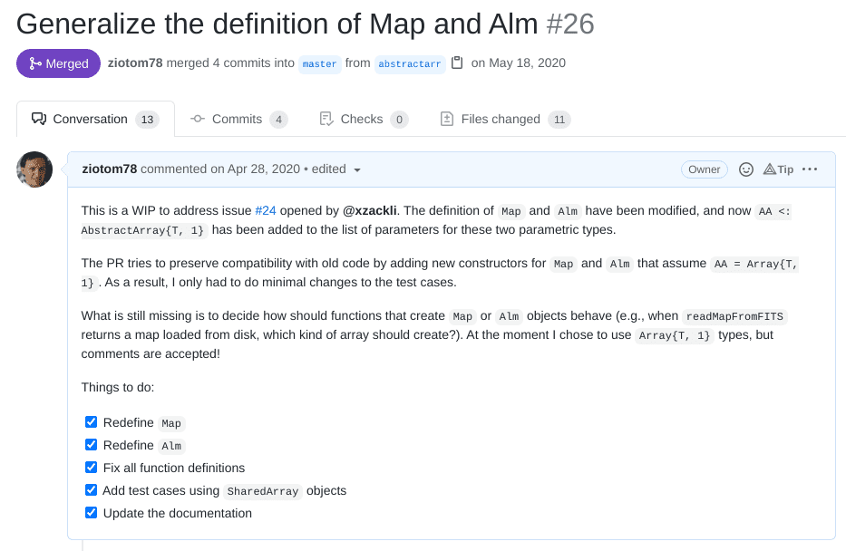

<center>
{height=720px}
</center>

---

<center>
{height=720px}
</center>

---

<center>
{height=720px}
</center>

# Pull requests

# Come funziona Git

-   Stiamo usando Git da alcune settimane, e dovremmo aver imparato come funziona.

-   Abbiamo visto in particolare che Git salva ogni modifica del codice (il *commit*) legandola alla modifica precedente:

    <center>
    
    </center>

-   Oggi vedremo che questa struttura lineare può in realtà essere più complicata.

# Modifiche complesse

-   Nelle scorse lezioni abbiamo implementato il codice per leggere e scrivere file PFM.

-   Ciascuno dei gruppi ha implementato questa funzionalità tramite una serie di commit.

-   Questi commit erano *logicamente* legati tra loro, ma ciò non appare quando si apre la pagina dei commit di uno qualsiasi dei vostri repository (v. slide seguente).

---

<center>

</center>

# Branch

-   Git implementa il concetto di *branch* («ramo»), che è un modo di separare una sequenza di commit dal «tronco» principale del *master*:

    <center>
    
    </center>

-   Tramite il comando `git branch NOME` si cambia il branch attivo; `git commit` aggiunge sempre in coda a questo branch.

-   `HEAD` punta sempre all'ultimo commit del branch attivo.

# Esempio di branch

<asciinema-player src="cast/git-branch-84x25.cast" cols="84" rows="25" font-size="medium"></asciinema-player>

# Comandi per branch

-   `git branch` elenca i branch (di default, all'inizio c'è solo `master`).

-   `git checkout -b NOME` crea un nuovo branch e lo rende attivo.

-   `git checkout NOME` rende attivo il branch `NOME`, già esistente.

-   `git merge NOME1 NOME2` incorpora le modifiche al branch `NOME1` dentro il branch `NOME2`; di solito `NOME2` è `master`.

-   `git branch -d NOME` cancella un branch.

-   Quando eseguite `git fetch` o `git pull` per scaricare nuovi commit da GitHub, vengono importati tutti i branch.

# Branch in GitHub

-   GitHub permette di navigare all'interno dei branch tramite un bottone dedicato:

    <center>
    {height=440px}
    </center>

-   La vera potenza dei branch sta però nei *pull request*.

# Pull request in GitHub

-   Un *pull request* è una richiesta di eseguire un comando `git merge` all'interno di `master`.

-   GitHub attiva un forum per ogni pull request, in modo che gli sviluppatori possano commentare l'opportunità o meno di eseguire `git merge`.

-   Nel momento in cui si fa il *merging*, è possibile (e consigliato) applicare lo *squashing*, che consiste nel fondere insieme tutti i commit in uno solo.

-   Lo *squashing* è utilissimo per levare di mezzo i tanti commit con messaggi «*Small fixes*», «*Oops I forgot to add this*», etc.

# Esempio di Pull request

<iframe src="https://player.vimeo.com/video/535144283?badge=0&amp;autopause=0&amp;player_id=0&amp;app_id=58479" width="1440" height="622" frameborder="0" allow="autoplay; fullscreen; picture-in-picture" allowfullscreen title="How to create pull requests in GitHub"></iframe>

# Altro esempio

<center>

</center>

# Come usarli in pratica

-   Se uno di voi crea un pull request su GitHub, gli altri possono aggiungere commit a quel pull request con i comandi

    ```text
    git fetch
    git checkout NOME_PULL_REQUEST
    ```

    come se fosse un branch creato da loro stessi (`git fetch` scarica da GitHub tutti i nuovi branch, inclusi i pull request).

-   I pull request sono una delle caratteristiche fondamentali di GitHub!

-   Abituatevi ad usarli per ogni modifica «seria» del vostro codice.

-   **Ai colloqui di lavoro, chiedono spesso di mostrare qualche vostra PR!**


# Guida per l'esercitazione

# Guida per l'esercitazione

-   Iniziate col «rilasciare» la *release* 0.1.0 di quanto avete scritto sinora, e inviate il link del repository GitHub a [maurizio.tomasi@unimi.it](mailto:maurizio.tomasi@unimi.it)

-   Uno di voi crei un nuovo pull request chiamato `geometry`, e gli altri invochino `git fetch` seguito da `git checkout geometry`.

-   Nel branch `geometry` implementate questi tipi (seguendo il [Capitolo 2](https://pbr-book.org/4ed/Geometry_and_Transformations.html) di Pharr, Jakobs & Humphreys):

    #.  `Vec` (un vettore tridimensionale).
    #.  `Point` (un punto tridimensionale).
    #.  `Normal` (un vettore normale).
    #.  `Transformation` (una matrice 4×4 e la sua inversa).

# Perché tre tipi?

-   Potrebbe sembrare sciocco dover definire tre tipi `Vec`, `Point`, `Normal`: dopotutto le loro strutture sono identiche!

    ```c++
    // C++ code
    struct Vec { float x, y, z; };
    struct Point { float x, y, z; };
    struct Normal { float x, y, z; };
    ```

-   In alcuni ray-tracer in effetti si usa un solo tipo `Vec` per codificare vettori, punti e normali (e anche colori RGB!), ma l'uso di tipi distinti renderà il nostro codice più robusto e chiaro.

# Metodi per `Vec`

#. Conversione a stringa, es., `Vec(x=0.4, y=1.3, z=0.7)`;
#. Confronto tra vettori (per i test), usando funzioni come `are_close`;
#. Somma e differenza tra vettori;
#. Prodotto per uno scalare e negazione (`Vec.neg()` restituisce $-v$);
#. Prodotto scalare tra due vettori e prodotto vettoriale;
#. Calcolo di $\left\|v\right\|^2$ (`squared_norm`) e di $\left\|v\right\|$ (`norm`);
#. Funzione che normalizza il vettore: $v \rightarrow v / \left\|v\right\|$;
#. Funzione che converte un `Vec` in una `Normal`.

Fate riferimento ai test nel progetto [`pytracer`](https://github.com/ziotom78/pytracer) (file `test_all.py`).

# Metodi per `Point`

#. Conversione a stringa, es., `Point(x=0.4, y=1.3, z=0.7)`;
#. Confronto tra punti (per i test);
#. Somma tra `Point` e `Vec`, restituendo un `Point`;
#. Differenza tra due `Point`, restituendo un `Vec`;
#. Differenza tra `Point` e `Vec`, restituendo un `Point`;
#. Conversione da `Point` a `Vec` (`Point.to_vec()`).

Fate riferimento ai test nel progetto [`pytracer`](https://github.com/ziotom78/pytracer) (file `test_all.py`).

# Metodi per `Normal`

#. Conversione a stringa, es., `Normal(x=0.4, y=1.3, z=0.7)`;
#. Confronto tra normali (per i test);
#. Negazione di una normale ($-\vec n$);
#. Moltiplicazione per uno scalare;
#. Prodotto scalare `Vec·Normal` e prodotto vettore `Vec×Normal` e `Normal×Normal`;
#. Calcolo di $\left\|n\right\|^2$ (`squared_norm`) e di $\left\|n\right\|$ (`norm`);
#. Funzione che normalizza la normale: $n \rightarrow n / \left\|n\right\|$.

Fate riferimento ai test nel progetto [`pytracer`](https://github.com/ziotom78/pytracer) (file `test_all.py`).

# Implementazione Python

-   Mostrerò ora brevemente come implementare le operazioni matematiche su `Point`, `Vec` e `Normal`

-   Attenzione però: Python è un linguaggio *dinamico*, e permette di fare cose che non sono direttamente traducibili in altri linguaggi.

-   Questo è evidente nell'implementazione di metodi che sono molto simili tra `Point` e `Vec`, come la somma di due elementi:

    #. `Point` + `Vec` → `Point`;
    #. `Vec` + `Vec` → `Vec`.

-   Potete fare riferimento al codice completo di [`pytracer`](https://github.com/ziotom78/pytracer) (che useremo anche nelle prossime settimane).

# Implementazione Python

```python
def _are_xyz_close(a, b):   # No need to tell if it's a Point, Vec, Normal…
    # This works thanks to Python's duck typing. In C++ and other languages
    # you should probably rely on function templates or similar tools
    return are_close(a.x, b.x) and are_close(a.y, b.y) and are_close(a.z, b.z)

def _add_xyz(a, b, return_type):
    # Ditto
    return return_type(a.x + b.x, a.y + b.y, a.z + b.z)

def _sub_xyz(a, b, return_type):
    # Ditto
    return return_type(a.x - b.x, a.y - b.y, a.z - b.z)
```

# Implementazione Python

```python
@dataclass
class Vec:
    x: float = 0.0
    y: float = 0.0
    z: float = 0.0

    def is_close(self, other, epsilon=1e-5):
        """Return True if the object and 'other' have roughly the same direction and orientation"""
        assert isinstance(other, Vec)
        return _are_xyz_close(self, other, epsilon=epsilon)

    def __add__(self, other):
        """Sum two vectors, or one vector and one point"""
        if isinstance(other, Vec):
            return _add_xyz(self, other, Vec)
        elif isinstance(other, Point):
            return _add_xyz(self, other, Point)
        else:
            raise TypeError(f"Unable to run Vec.__add__ on a {type(self)} and a {type(other)}.")
        return _add_xyz(self, other, Vec)
```

# Altre operazioni su `Vec`

```python
def dot(self, other):
    return self.x * other.x + self.y * other.y + self.z * other.z

def squared_norm(self):
    return self.x ** 2 + self.y ** 2 + self.z ** 2

def norm(self):
    return math.sqrt(self.squared_norm())

def cross(self, other):
    return Vec(x=self.y * other.z - self.z * other.y,
               y=self.z * other.x - self.x * other.z,
               z=self.x * other.y - self.y * other.x)

def normalize(self):
    norm = self.norm()
    x /= norm
    y /= norm
    z /= norm
```

# Trasformazioni

-   Bisogna implementare anche il tipo `Transformation`, che codifica una trasformazione.

-   Noi considereremo solo traslazioni, rotazioni attorno ai tre assi coordinati e trasformazioni di scala: questo ci semplificherà molto il lavoro!

-   Le trasformazioni possono essere applicate a tre oggetti matematici:

    #.  Punti (oggetti di tipo `Point`);
    #.  Vettori (oggetti di tipo `Vec`);
    #.  Normali (oggetti di tipo `Normal`).

# Il tipo `Transformation`

-   È spesso necessario avere a portata di mano sia la matrice $M$ (che implementa la trasformazione) che la sua inversa $M^{-1}$.

-   Il nostro tipo `Transformation` dovrà quindi tenere in memoria *entrambe* le matrici:

    ```python
    class Transformation:
        def __init__(self, m=IDENTITY_MATR4x4, invm=IDENTITY_MATR4x4):
            self.m = m
            self.invm = invm
    ```

    dove `IDENTITY_MATR4x4` è una costante uguale alla matrice identità di dimensioni 4×4.

# Consistenza

-   Ovviamente, il fatto che dobbiamo passare sia $M$ che $M^{-1}$ pone un problema di consistenza! Come facciamo a sapere che i due parametri del costruttore siano corretti?

-   Implementiamo un metodo che verifica che il prodotto delle due matrici dia la matrice identità 4×4 (utile nei test!):

    ```python
    def is_consistent(self):
        prod = _matr_prod(self.m, self.invm)
        return _are_matr_close(prod, IDENTITY_MATR4x4)
    ```

    dove `_matr_prod` e `_are_matr_close` sono semplici metodi che operano su matrici 4×4.

# Trasformazioni standard

-   Definiamo una serie di funzioni che costruiscono oggetti `Transformation` preoccupandosi di inizializzare correttamente $M$ e $M^{-1}$.

-   Ad esempio, questa è l'implementazione di `translation` (traslazione per un vettore $\vec v$):

    ```python
    def translation(vec: Vec):
        # We are adopting the dumbest solution here. In your code,
        # it might be more convenient (and efficient) to define a
        # HomMatrix class instead of using explicit matrices…
        return Transformation(
            m=[[1.0, 0.0, 0.0, vec.x],
               [0.0, 1.0, 0.0, vec.y],
               [0.0, 0.0, 1.0, vec.z],
               [0.0, 0.0, 0.0, 1.0]],
            invm=[[1.0, 0.0, 0.0, -vec.x],
                  [0.0, 1.0, 0.0, -vec.y],
                  [0.0, 0.0, 1.0, -vec.z],
                  [0.0, 0.0, 0.0, 1.0]],
        )
    ```

# Inversa

-   Vedremo che è spesso necessario accedere anche all'inversa di una trasformazione.

-   Fortunatamente, dato che manteniamo in memoria sia $M$ che $M^{-1}$, questo compito è molto facile:

    ```python
    class Transformation:
        # …
        def inverse(self):
            # That was easy!
            return Transformation(m=self.invm, invm=self.m)
    ```

# Prodotti

-   È particolarmente critico implementare le funzioni per applicare una trasformazione a un oggetto geometrico.!

-   Occorrerà implementare gli operatori di prodotto sui tipi `Point`, `Vec`, `Normal`:

    #.  `Transformation * Transformation → Transformation`; nel calcolare `invm`, ricordate che $(AB)^{-1} = B^{-1}A^{-1}$.
    #.  `Transformation * Point → Point`.
    #.  `Transformation * Vec → Vec`.
    #.  `Transformation * Normal → Normal`.

# Punti e vettori

-   La differenza tra punti e vettori sta nell'ultimo coefficiente della rappresentazione:

    $$
    P = \begin{pmatrix}
    p_x\\
    p_y\\
    p_z\\
    1
    \end{pmatrix},
    \vec v = \begin{pmatrix}
    v_x\\
    v_y\\
    v_z\\
    0
    \end{pmatrix}.
    $$

-   Dal punto di vista del codice, è meglio implementare *due* funzioni distinte per il prodotto: quella relativa ai vettori può risparmiare di iterare sull'ultima colonna delle matrici $M$ e $M^{-1}$.

# Trasformazione di un punto

```python
row0, row1, row2, row3 = self.m
newp = Point(x=p.x * row0[0] + p.y * row0[1] + p.z * row0[2] + row0[3],
             y=p.x * row1[0] + p.y * row1[1] + p.z * row1[2] + row1[3],
             z=p.x * row2[0] + p.y * row2[1] + p.z * row2[2] + row2[3])
w = p.x * row3[0] + p.y * row3[1] + p.z * row3[2] + row3[3]

if w == 1.0:
    return newp   # Avoid three (potentially costly) divisions if not needed
else:
    return Point(newp.x / w, newp.y / w, newp.z / w)
```

# Normalizzazione

-   Nel caso in cui l'ultimo coefficiente del risultato non sia uguale a 1, è necessario normalizzare gli altri termini:

    $$
    \begin{pmatrix}
    p_x\\
    p_y\\
    p_z\\
    \lambda
    \end{pmatrix} \rightarrow
    \begin{pmatrix}
    p_x / \lambda\\
    p_y / \lambda\\
    p_z / \lambda\\
    1
    \end{pmatrix}
    $$

-   (Nessuna delle trasformazioni che implementiamo porta a $\lambda \not= 1$, ma trasformazioni più generali possono farlo: implementare questa normalizzazione nel nostro codice lo rende *future-proof*).

# Normali

-   Abbiamo detto che dobbiamo implementare anche `Normal`, che ha struttura identica a `Vec` ma che richiederà meno operazioni:

    ```python
    @dataclass
    class Normal:
        x: float = 0.0
        y: float = 0.0
        z: float = 0.0
    ```

-   Una trasformazione applicata a una normale è identica all'applicazione di un vettore, ma bisogna usare la *trasposta* dell'*inversa*. Vediamo come si fa il calcolo.

# Inversa trasposta

-   La matrice omogenea $M$ può essere rappresentata a blocchi:

    $$
    M = \begin{pmatrix}
    \textcolor{#3434AD}{A}& \textcolor{#34AD34}{\vec v}\\
    \mathbf{0}& 1,
    \end{pmatrix}
    $$

    dove $\textcolor{#3434AD}{A}$ è una matrice 3×3.

-   Si può [dimostrare facilmente](https://en.wikipedia.org/wiki/Invertible_matrix#Blockwise_inversion) che l'inversa di una matrice omogenea è ancora una matrice omogenea.

# Inversa trasposta

-   La trasposta di una matrice omogenea non è però più omogenea, perché compaiono valori non nulli nell'ultima riga:

    $$
    M^t = \begin{pmatrix}
    \textcolor{#3434AD}{m_{11}}& \textcolor{#3434AD}{m_{21}}& \textcolor{#3434AD}{m_{31}}& 0\\
    \textcolor{#3434AD}{m_{12}}& \textcolor{#3434AD}{m_{22}}& \textcolor{#3434AD}{m_{32}}& 0\\
    \textcolor{#3434AD}{m_{13}}& \textcolor{#3434AD}{m_{23}}& \textcolor{#3434AD}{m_{33}}& 0\\
    \textcolor{#34AD34}{v_1}& \textcolor{#34AD34}{v_2}& \textcolor{#34AD34}{v_3}& 1\\
    \end{pmatrix}.
    $$

-   Esplicitando il prodotto tra l'inversa trasposta e un vettore, si vede che l'ultimo coefficiente (omogeneo) non è più 0!

-   Questo però **non influisce** su $\hat n'$ (`n[3] == 0`): possiamo quindi ignorare il problema.

# Implementazione

-   È inutile costruire la matrice trasposta di `self.invm` e calcolare il prodotto di questa con la normale.

-   Vi consiglio di implementare il prodotto tra matrice e normale nel modo più diretto possibile:

    ```python
    row0, row1, row2, _ = self.invm  # Take the *inverse*!

    # This multiplies the *transpose* of `self.invm` by `n`
    return Normal(x=n.x * row0[0] + n.y * row1[0] + n.z * row2[0],
                  y=n.x * row0[1] + n.y * row1[1] + n.z * row2[1],
                  z=n.x * row0[2] + n.y * row1[2] + n.z * row2[2])
    ```

# Test

-   Il set completo di test si trova nel repository [pytracer](https://github.com/ziotom78/pytracer), nel file [test_all.py](https://github.com/ziotom78/pytracer/blob/41878248890338e62aa38c928c17561490c901b6/test_all.py#L202-L232).

-   Implementate gli stessi test presenti in quel file.

# Lavoro di gruppo

#. Uno di voi crea la *release* 0.1.0;
#. Uno di voi crea un branch `geometry` e fa un *pull request*, che gli altri scaricano;
#. Uno di voi implementa il tipo `Vec` (senza metodi o operatori!), uno `Point`, uno `Normal` e uno `Transformation`;
#. Sincronizzatevi tra voi facendo un *merge*;
#. Dividetevi l'implementazione dei vari metodi ed operatori.


# Indicazioni per D/Nim/Rust

# Matrici e trasformazioni

-   Può essere utile definire un tipo `HomMatrix` che implementi una matrice omogenea 4×4 insieme alle operazioni basilari su di essa

-   Il tipo `Transformation` conterrà quindi due campi `HomMatrix`, contenenti rispettivamente la matrice della trasformazione e la sua inversa

-   Attenzione a definire `HomMatrix` in modo da evitare l'allocazione di memoria nello *heap*, perché deve essere veloce da allocare:

    -   Evitate di usare costrutti come `vector<vector<float>>` (C++) o `seq[seq[float]]` (Nim), perché i dati non sarebbero contigui in memoria

    -   Anzi, evitate del tutto `vector` (C++), `seq[]` (Nim) e simili, che internamente usano lo heap, e definite un semplice array di 16 elementi.

# Definizione dei tipi

-   Potete prendere spunto dalle implementazioni nel documento [*A comparison between a few programming languages*](https://ziotom78.github.io/raytracing_course/language-comparison.html)

-   Può essere una buona occasione per ridurre la duplicazione del codice mediante le potenzialità di metaprogrammazione del vostro linguaggio…

-   …ma se trovate difficoltà nell'usarle, non state ad impazzire e accontentatevi di usare codice duplicato! (In futuro, quando avrete studiato bene il linguaggio LISP, potrete rimediare 😀)

-   Mostro un esempio con Nim: è possibile ottenere risultati simili con Rust e con D

# Definire i tipi con Nim

-   Vogliamo implementare una serie di operazioni sui tipi `Vec`, `Point`, `Normal`

-   Nim ammette l'overloading degli operatori, quindi potremmo scrivere:

    ```nim
    proc `+`(a: Point, b: Vec): Point =   # Point + Vec → Point
      result.x = a.x + b.x
      result.y = a.y + b.y
      result.z = a.z + b.z

    proc `+`(a: Vec, b: Vec): Vec =        # Vec + Vec → Vec
      # The implementation is the same as above!
      result.x = a.x + b.x
      result.y = a.y + b.y
      result.z = a.z + b.z
    ```

    ma ciò è noiosissimo!

# Metaprogrammazione

-   Per risparmiare le ripetizioni nella definizione di ``+`` possiamo usare la metaprogrammazione, ossia codice che non viene eseguito quando il programma viene avviato, ma mentre il programma viene compilato.

-   Nim ammette tre costrutti diversi che implementano la metaprogrammazione:

    #.   [*funzioni generiche*](https://nim-lang.org/docs/tut2.html#generics);
    #.   [*template*](https://nim-lang.org/docs/tut2.html#templates);
    #.   [*macro*](https://nim-lang.org/docs/tut3.html).

-   Vediamo in cosa consistono: in questo modo potrete poi cercare nella documentazione del vostro linguaggio se vengono supportati paradigmi simili

# Funzioni generiche

-   Una funzione generica non specifica un tipo preciso per i suoi dati

-   È utile quando le operazioni che volete fare devono potersi adattare a un tipo qualunque (come le *template function* in C++):

    ```nim
    proc mysum[T](a: T, b: T): T =
      result = a + a + b

    echo mysum(1, 2)       # Works on integers…
    echo mysum(0x1, 0x2)   # …and on unsigned integers…
    echo mysum(1.0, 2.0)   # …and on floats!
    ```

-   Non è indicato nel nostro caso, perché noi vogliamo specificare dei *vincoli* (ad esempio, non si può sommare un vettore a una normale!)

# Template

-   Un template è un pezzo di codice in cui alcune parti non sono specificate, e possono venire sostituite in seguito a seconda del bisogno

-   Ecco un esempio:

    ```nim
    template define_double_proc(fname: untyped, t: typedesc) =
      proc fname(arg: t): t =
        result = arg + arg

    define_double_proc(double_int, int)
    define_double_proc(double_float32, float32)
    ```

    Ho definito due nuove funzioni `double_int` e `double_float32`, ma non ho specificato un'equivalente per `float32` o per `uint`

# Macro

-   Una macro è una sequenza di istruzioni che generano codice pezzo per pezzo

-   È il paradigma di metaprogrammazione più sofisticato che sia disponibile in Nim

-   Può essere usato per fare cose strabilianti (ad esempio, [modificare il linguaggio per supportare più costrutti OOP](https://nim-by-example.github.io/macros/))

-   Vi consiglio però  di andarci cauti, perché è difficile fare il debug di macro, e il codice prodotto può essere illeggibile

-   Un buon modo per capire come usare le macro è fare prima pratica con un linguaggio LISP ([Racket](https://racket-lang.org/), [Clojure](https://clojure.org/), [Scheme](https://www.scheme.com/tspl4/)…)

# *Template* in Nim

Quello che serve per definire velocemente operazioni matematiche su più tipi sono ovviamente i template:

```nim
template define_sum(type1: typedesc, type2: typedesc, rettype: typedesc) =
  proc `+`*(a: type1, b: type2): rettype =
    result.x = a.x + b.x
    result.y = a.y + b.y
    result.z = a.z + b.z

define_sum(Vec, Vec, Vec)
define_sum(Vec, Point, Point)
define_sum(Point, Vec, Point)
define_sum(Normal, Normal, Normal)
```

# *Template* in Nim (2/2)

Possiamo spingerci oltre e rendere l'approccio estendibile anche al tipo di operazione, in modo che si possa usare il template anche per la sottrazione:

```nim
template define_3dop(fname: untyped, type1: typedesc, type2: typedesc, rettype: typedesc) =
  proc fname*(a: type1, b: type2): rettype =
    result.x = fname(a.x, b.x)  # This works because "a + b" is interpreted as `+`(a, b)
    result.y = fname(a.y, b.y)
    result.z = fname(a.z, b.z)

define_3dop(`+`, Vec, Vec, Vec)
define_3dop(`-`, Vec, Vec, Vec)
define_3dop(`+`, Vec, Point, Point)
define_3dop(`+`, Point, Vec, Point)
define_3dop(`-`, Point, Vec, Point)
define_3dop(`+`, Normal, Normal, Normal)
define_3dop(`-`, Normal, Normal, Normal)
```

# Uso in D

In D i *mixin template* permettono di evitare la definizione duplicata di tanti metodi dentro `Vec`, `Point` e `Normal`;

```d
mixin template defSumDiff(T, Ret) {
  Ret opBinary(string op)(T other) const
       if (op == "+" || op == "-") {
      // This is a string mixin, so that we can handle both + and - in the same code
      return mixin("Ret(x " ~ op ~ " other.x, y " ~ op ~ "other.y, z " ~ op ~ " other.z)");
  }
}

struct Vec {
  float x, y, z;
  mixin defSumDiff!(Vec, Vec);
}

struct Point {
  float x, y, z;
  mixin defSumDiff!(Vec, Point);
}
```

# Uso in Rust

-   Purtroppo Rust non ha l'equivalente dei *template* di Nim e dei *template mixin* di D: dovrete usare per forza le macro!

-   Non complicatevi troppo la vita cercando di combinare `Add` e `Sub`!

    ```rust
    macro_rules! implement_sum(
        ($type1:ty, $type2:ty, $return_type:tt) => {
            impl ops::Add<$type2> for $type1 {
                type Output = $return_type;

                fn add(self: $type1, other: $type2) -> $return_type {
                    let result = $return_type{x: self.x + other.x, y: self.y + other.y, z: self.z + other.z};
                    result
                }
            }
        }
    );

    implement_sum!(Vec, Vec, Vec);
    implement_sum!(Point, Vec, Point);
    ```


# Indicazioni per Java/Kotlin

# Indicazioni per Java/Kotlin

-   Nessuna indicazione in particolare per `Point`, `Vec`, `Normal`: l'implementazione dovrebbe essere abbastanza semplice.
-   Né Java né Kotlin supportano la metaprogrammazione, quindi dovrete duplicare un po' di funzioni, come quelle che calcolano `Point + Vec` e `Vec + Vec`.

# Trasformazioni

Per semplificare `Transformation`, vi consiglio di definire un tipo `HomMatrix` che implementi una matrice omogenea 4×4; usate internamente un array di 16 elementi come avevate fatto con `HdrImage`:

```kotlin
// Kotlin
class HomMatrix(var elements: FloatArray) {
    init {
        require(elements.size == 16) { "A homogeneous matrix must be 4×4" }
    }

    constructor() : this(
        floatArrayOf(
            1.0f, 0.0f, 0.0f, 0.0f,
            0.0f, 1.0f, 0.0f, 0.0f,
            0.0f, 0.0f, 1.0f, 0.0f,
            0.0f, 0.0f, 0.0f, 1.0f
        )
    )

    // Etc.
}
```


# Indicazioni per C\#

# Definizione dei tipi

-   Siccome `Vec`, `Point`, `Normal` e `Transformation` saranno molto utilizzati nei calcoli, è importante che siano classi estremamente efficienti.
-   Questo è quindi un caso in cui è meglio definire i tipi come *value types* usando `struct` anziché `class`.
-   Purtroppo C\# non implementa funzionalità di metaprogrammazione, quindi dovrete definire due volte le operazioni comuni tra `Point` e `Vec`, come la somma.
