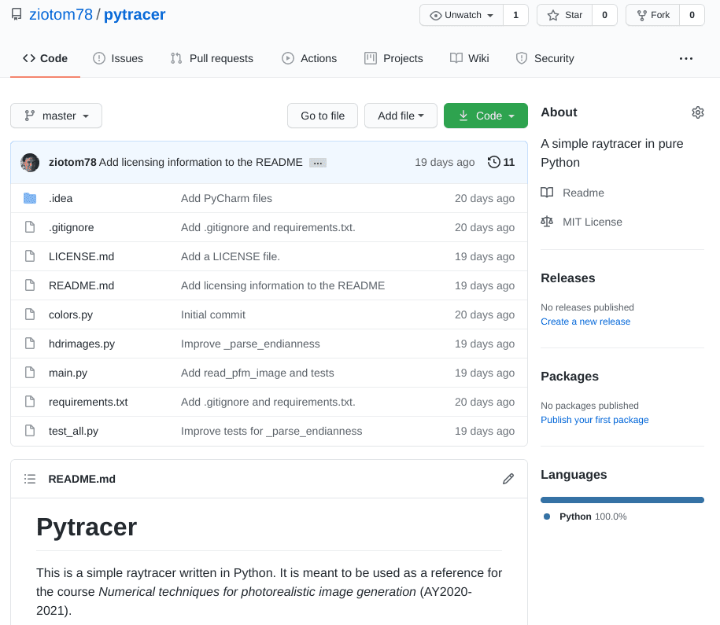
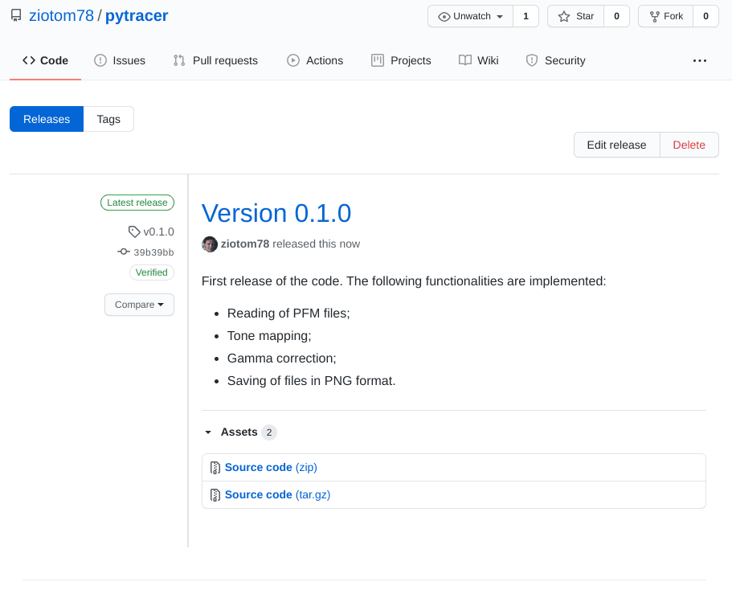
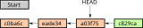
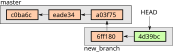
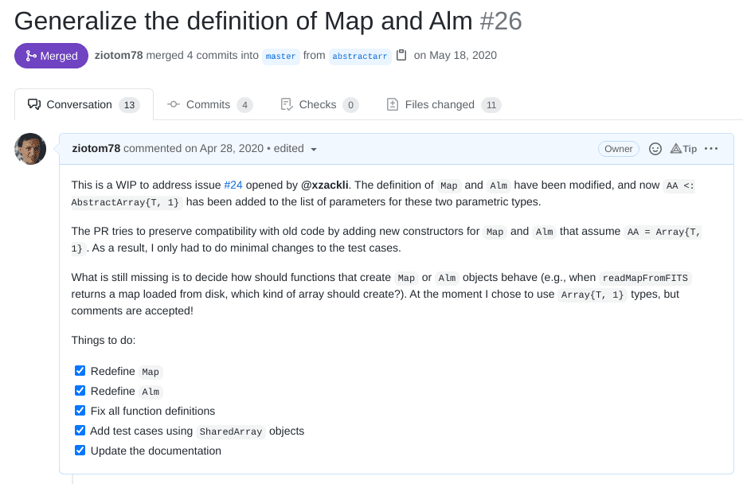

# Our Program

-   With the addition of last week's features, we are ready to release the first version of our program!

-   Currently, the program converts a PFM file into an LDR file (PNG, JPEG, etc.)

-   We will therefore release version 0.1.0.

-   GitHub allows you to release versions through a specific feature.

---

<center>
{height=720px}
</center>

---

<center>
{height=720px}
</center>

---

<center>
{height=720px}
</center>

# Pull Requests {#pull-requests}

# How Git Works

-   We have been using Git for a few weeks, and we should have learned how it works.

-   In particular, we have seen that Git saves every code change (the *commit*) by linking it to the parent commit:

    <center>
    
    </center>

-   Today we will see that this linear structure can actually be more complicated.

# Complex Changes

-   In the previous lessons, we implemented the code to read and write PFM files.

-   Each group implemented this functionality through a series of commits.

-   These commits were *logically* linked together, but this is not apparent when you open the commit page of any of your repositories (see the following slide).

---

<center>

</center>

# Branches

-   Git implements the concept of a *branch*, which is a way to separate a sequence of commits from the main *master* "trunk":

    <center>
    
    </center>

-   The `git branch NAME` command changes the active branch; `git commit` always adds to the end of this branch.

-   `HEAD` always points to the last commit of the active branch.

# Branch Example

<asciinema-player src="cast/git-branch-84x25.cast" cols="84" rows="25" font-size="medium"></asciinema-player>

# Branch Commands

-   `git branch` lists the available branches.

-   `git branch -d NAME` deletes a branch (ok if you already merged it).

-   `git checkout -b NAME` creates a new branch and makes it active.

-   `git checkout NAME` activates the already existing branch `NAME`.

-   `git merge NAME` incorporates the changes from branch `NAME` into the current branch.

-   `git fetch` and `git pull` import **all** branches.

# Branches in GitHub

-   GitHub allows you to activate any branch in the browser through a dedicated button:

    <center>
    {height=440px}
    </center>

-   The real power of branches, however, lies in *pull requests*.

# Pull Requests in GitHub

-   A *pull request* is a request to execute a `git merge` command within `master`.

-   GitHub activates a forum for each pull request so that developers can comment on whether or not to perform the `git merge`.

-   When *merging*, it is possible (and recommended) to apply *squashing*, which consists of merging all commits into a single one.

-   *Squashing* is very useful for getting rid of the many commits with messages like "*Small fixes*", "*Oops I forgot to add this*", etc.

# Pull Request Example

<iframe src="https://player.vimeo.com/video/535144283?badge=0&amp;autopause=0&amp;player_id=0&amp;app_id=58479" width="1440" height="622" frameborder="0" allow="autoplay; fullscreen; picture-in-picture" allowfullscreen title="How to create pull requests in GitHub"></iframe>

# Checklists

-   In complex pull requests, you might plan to implement several different features with separate commits (**highly** recommended!)
-   The GitHub interface lets you include checklists with this syntax:

    ```
    -   [X] Add the feature
    -   [ ] Implement tests
    -   [ ] Update the documentation
    ```

-   To activate/deactivate items, just click on them without manually editing the Markdown source.

# Checklists

<center>

</center>

# How to Use Them in Practice

-   If one of you creates a pull request on GitHub, team members can contribute to the same pull request.

    ```text
    git fetch
    git checkout BRANCH_NAME
    ```

    as if it were a branch they created themselves (`git fetch` downloads all new branches from GitHub, including pull requests).

-   Pull requests are one of the fundamental features of GitHub!

-   Get used to using them for every "serious" modification of your code.

-   **In job interviews, they often ask to see some of your PRs!**

# What to do today

# What to do today

-   Start by "releasing" the 0.1.0 *release* of what you have written so far, and send the link of the GitHub repository to [maurizio.tomasi@unimi.it](mailto:maurizio.tomasi@unimi.it)

-   One of you should create a new pull request called `geometry`, and the others should invoke `git fetch` followed by `git checkout geometry`.

-   In the `geometry` branch, implement these types (following [Chapter 2](https://pbr-book.org/4ed/Geometry_and_Transformations.html) of Pharr, Jakobs & Humphreys):

    1.  `Vec` (a three-dimensional vector).
    2.  `Point` (a three-dimensional point).
    3.  `Normal` (a normal vector).
    4.  `Transformation` (a 4×4 matrix and its inverse).

# Why Three Types?

-   It might seem redundant to have to define three types `Vec`, `Point`, `Normal`: after all, their structures are identical!

    ```c++
    struct Vec { float x, y, z; };
    struct Point { float x, y, z; };
    struct Normal { float x, y, z; };
    ```

    But this will make the compiler complain about meaningless operations, like summing two points.

-   In some ray-tracers, in fact, a single `Vec` type is used to encode vectors, points, and normals (and even RGB colors!), but the use of distinct types will make our code more robust and clear.

# Methods for `Vec`

1. Conversion to string, e.g., `Vec(x=0.4, y=1.3, z=0.7)`;
2. Comparison between vectors (for tests), using functions like `are_close`;
3. Sum and difference between vectors;
4. Product by a scalar and negation (`Vec.neg()` returns $-v$);
5. Dot product between two vectors and cross product;
6. Calculation of $\left\|v\right\|^2$ (`squared_norm`) and of $\left\|v\right\|$ (`norm`);
7. Function that normalizes the vector: $v \rightarrow v / \left\|v\right\|$;
8. Function that converts a `Vec` into a `Normal`.

Refer to the tests in the [`pytracer`](https://github.com/ziotom78/pytracer) project (file `test_all.py`).

# Methods for `Point`

1. Conversion to string, e.g., `Point(x=0.4, y=1.3, z=0.7)`;
2. Comparison between points (for tests);
3. Sum between `Point` and `Vec`, returning a `Point`;
4. Difference between two `Point`s, returning a `Vec`;
5. Difference between `Point` and `Vec`, returning a `Point`;
6. Conversion from `Point` to `Vec` (`Point.to_vec()`).

Refer to the tests in the [`pytracer`](https://github.com/ziotom78/pytracer) project (file `test_all.py`).

# Methods for `Normal`

1. Conversion to string, e.g., `Normal(x=0.4, y=1.3, z=0.7)`;
2. Comparison between normals (for tests);
3. Negation of a normal ($-\vec n$);
4. Multiplication by a scalar;
5. Dot product `Vec·Normal` and cross product `Vec×Normal` and `Normal×Normal`;
6. Calculation of $\left\|n\right\|^2$ (`squared_norm`) and of $\left\|n\right\|$ (`norm`);
7. Function that normalizes the normal: $n \rightarrow n / \left\|n\right\|$.

Refer to the tests in the [`pytracer`](https://github.com/ziotom78/pytracer) project (file `test_all.py`).

# Python Implementation

-   I will now briefly show how to implement the mathematical operations on `Point`, `Vec` and `Normal`.

-   Be careful though: Python is a *dynamic* language, and allows you to do things that are not directly translatable into other languages.

-   This is evident in the implementation of methods that are very similar between `Point` and `Vec`, like the sum of two elements:

    1.  `Point` + `Vec` → `Point`;
    2.  `Vec` + `Vec` → `Vec`.

-   You can refer to the complete code of [`pytracer`](https://github.com/ziotom78/pytracer) (which we will also use in the coming weeks).

# Python Implementation

```python
def _are_xyz_close(a, b):   # No need to tell if it's a Point, Vec, Normal…
    # This works thanks to Python's duck typing. In C++ and other languages
    # you should probably rely on function templates or similar tools
    return are_close(a.x, b.x) and are_close(a.y, b.y) and are_close(a.z, b.z)

def _add_xyz(a, b, return_type):
    # Ditto
    return return_type(a.x + b.x, a.y + b.y, a.z + b.z)

def _sub_xyz(a, b, return_type):
    # Ditto
    return return_type(a.x - b.x, a.y - b.y, a.z - b.z)
```

# Python Implementation

```python
@dataclass
class Vec:
    x: float = 0.0
    y: float = 0.0
    z: float = 0.0

    def is_close(self, other, epsilon=1e-5):
        """Return True if the object and 'other' have roughly the same direction and orientation"""
        assert isinstance(other, Vec)
        return _are_xyz_close(self, other, epsilon=epsilon)

    def __add__(self, other):
        """Sum two vectors, or one vector and one point"""
        if isinstance(other, Vec):
            return _add_xyz(self, other, Vec)
        elif isinstance(other, Point):
            return _add_xyz(self, other, Point)
        else:
            raise TypeError(f"Unable to run Vec.__add__ on a {type(self)} and a {type(other)}.")
        return _add_xyz(self, other, Vec)
```

# Other operations on `Vec`

```python
def dot(self, other: "Vec") -> float:
    return self.x * other.x + self.y * other.y + self.z * other.z

def squared_norm(self) -> float:
    return self.x ** 2 + self.y ** 2 + self.z ** 2

def norm(self) -> float:
    return math.sqrt(self.squared_norm())

def cross(self, other: "Vec") -> "Vec":
    return Vec(x=self.y * other.z - self.z * other.y,
               y=self.z * other.x - self.x * other.z,
               z=self.x * other.y - self.y * other.x)

def normalize(self) -> "Vec":
    norm = self.norm()
    return Vec(self.x / norm, self.y / norm, self.z / norm)
```

# Transformations

-   We also need to implement the `Transformation` type, which encodes a transformation.

-   We will only consider translations, rotations around the three coordinate axes, and scaling transformations: this will greatly simplify our work!

-   Transformations can be applied to three mathematical objects:

    1.  Points (objects of type `Point`);
    2.  Vectors (objects of type `Vec`);
    3.  Normals (objects of type `Normal`).

# The `Transformation` Type

-   It is often necessary to have both the matrix $M$ (which implements the transformation) and its inverse $M^{-1}$ readily available.

-   Our `Transformation` type will therefore need to store *both* matrices:

    ```python
    class Transformation:
        def __init__(self, m=IDENTITY_MATR4x4, invm=IDENTITY_MATR4x4):
            self.m = m
            self.invm = invm
    ```

    where `IDENTITY_MATR4x4` is a constant equal to the 4×4 identity matrix.

# Consistency

-   Obviously, the fact that we have to pass both $M$ and $M^{-1}$ poses a consistency problem! How do we know that the two constructor parameters are correct?

-   We implement a method that verifies that the product of the two matrices yields the 4×4 identity matrix (useful in tests!):

    ```python
    def is_consistent(self):
        prod = _matr_prod(self.m, self.invm)
        return _are_matr_close(prod, IDENTITY_MATR4x4)
    ```

    where `_matr_prod` and `_are_matr_close` are simple methods that operate on 4×4 matrices.

# Standard Transformations

-   We define a series of functions that construct `Transformation` objects, taking care to correctly initialize $M$ and $M^{-1}$.

-   For example, this is the implementation of `translation` (translation by a vector $\vec v$):

    ```python
    def translation(vec: Vec):
        # We are adopting the dumbest solution here. In your code,
        # it might be more convenient (and efficient) to define a
        # HomMatrix class instead of using explicit matrices…
        return Transformation(
            m=[[1.0, 0.0, 0.0, vec.x],
               [0.0, 1.0, 0.0, vec.y],
               [0.0, 0.0, 1.0, vec.z],
               [0.0, 0.0, 0.0, 1.0]],
            invm=[[1.0, 0.0, 0.0, -vec.x],
                  [0.0, 1.0, 0.0, -vec.y],
                  [0.0, 0.0, 1.0, -vec.z],
                  [0.0, 0.0, 0.0, 1.0]],
        )
    ```

# Inverse

-   We will see that it is often necessary to access the inverse of a transformation.

-   Fortunately, since we store both $M$ and $M^{-1}$, this task is very easy:

    ```python
    class Transformation:
        # …
        def inverse(self):
            # That was easy!
            return Transformation(m=self.invm, invm=self.m)
    ```

# Products

-   It is particularly critical to implement the functions to apply a transformation to a geometric object!

-   It will be necessary to implement the product operators on the `Point`, `Vec`, `Normal` types:

    1.  `Transformation * Transformation → Transformation`; when calculating `invm`, remember that $(AB)^{-1} = B^{-1}A^{-1}$.
    2.  `Transformation * Point → Point`.
    3.  `Transformation * Vec → Vec`.
    4.  `Transformation * Normal → Normal`.

# Points and Vectors

-   The difference between points and vectors lies in the last coefficient of the representation:

    $$
    P = \begin{pmatrix}
    p_x\\
    p_y\\
    p_z\\
    1
    \end{pmatrix},
    \vec v = \begin{pmatrix}
    v_x\\
    v_y\\
    v_z\\
    0
    \end{pmatrix}.
    $$

-   From a code perspective, it is better to implement *two* distinct functions for the product: the one for vectors can save iterating over the last column of the matrices $M$ and $M^{-1}$.

# Transformation of a Point

```python
row0, row1, row2, row3 = self.m
newp = Point(x=p.x * row0[0] + p.y * row0[1] + p.z * row0[2] + row0[3],
             y=p.x * row1[0] + p.y * row1[1] + p.z * row1[2] + row1[3],
             z=p.x * row2[0] + p.y * row2[1] + p.z * row2[2] + row2[3])
w = p.x * row3[0] + p.y * row3[1] + p.z * row3[2] + row3[3]

if w == 1.0:
    return newp   # Avoid three (potentially costly) divisions when w = 1
else:
    return Point(newp.x / w, newp.y / w, newp.z / w)
```

# Normalization

-   In the case where the last coefficient of the result is not equal to 1, it is necessary to normalize the other terms:

    $$
    \begin{pmatrix}
    p_x\\
    p_y\\
    p_z\\
    \lambda
    \end{pmatrix} \rightarrow
    \begin{pmatrix}
    p_x / \lambda\\
    p_y / \lambda\\
    p_z / \lambda\\
    1
    \end{pmatrix}
    $$

-   (None of the transformations we implement lead to $\lambda \not= 1$, but more general transformations can: implementing this normalization in our code makes it *future-proof*).

# Normals

-   We said that we also need to implement `Normal`, which has the same structure as `Vec` but will require fewer operations:

    ```python
    @dataclass
    class Normal:
        x: float = 0.0
        y: float = 0.0
        z: float = 0.0
    ```

-   A transformation applied to a normal is identical to the application to a vector, but we must use the *transpose* of the *inverse*. Let's see how to do the calculation.

# Inverse Transpose

-   The homogeneous matrix $M$ can be represented in block form:

    $$
    M = \begin{pmatrix}
    \textcolor{#3434AD}{A}& \textcolor{#34AD34}{\vec v}\\
    \mathbf{0}& 1,
    \end{pmatrix}
    $$

    where $\textcolor{#3434AD}{A}$ is a 3×3 matrix.

-   It can be [easily shown](https://en.wikipedia.org/wiki/Invertible_matrix#Blockwise_inversion) that the inverse of a homogeneous matrix is still a homogeneous matrix.

# Inverse Transpose

-   The transpose of a homogeneous matrix, however, is no longer homogeneous, because non-zero values appear in the last row:

    $$
    M^t = \begin{pmatrix}
    \textcolor{#3434AD}{m_{11}}& \textcolor{#3434AD}{m_{21}}& \textcolor{#3434AD}{m_{31}}& 0\\
    \textcolor{#3434AD}{m_{12}}& \textcolor{#3434AD}{m_{22}}& \textcolor{#3434AD}{m_{32}}& 0\\
    \textcolor{#3434AD}{m_{13}}& \textcolor{#3434AD}{m_{23}}& \textcolor{#3434AD}{m_{33}}& 0\\
    \textcolor{#34AD34}{v_1}& \textcolor{#34AD34}{v_2}& \textcolor{#34AD34}{v_3}& 1\\
    \end{pmatrix}.
    $$

-   By explicitly calculating the product between the inverse transpose and a vector, we see that the last (homogeneous) coefficient is no longer 0!

-   However, this **does not affect** $\hat n'$ (`n[3] == 0`): we can therefore ignore the problem.

# Implementation

-   It is inefficient to explicitly construct the transposed matrix of `self.invm` and calculate the product of this with the normal.

-   I suggest you implement the product between matrix and normal in the most direct way possible:

    ```python
    row0, row1, row2, _ = self.invm  # Take the *inverse*!

    # This multiplies the *transpose* of `self.invm` by `n`
    return Normal(x=n.x * row0[0] + n.y * row1[0] + n.z * row2[0],
                  y=n.x * row0[1] + n.y * row1[1] + n.z * row2[1],
                  z=n.x * row0[2] + n.y * row1[2] + n.z * row2[2])
    ```

# Matrices and Transformations

-   It may be useful to define a `HomMatrix` type that implements a 4×4 homogeneous matrix along with basic operations on it.

-   The `Transformation` type will then contain two `HomMatrix` fields, containing the transformation matrix and its inverse, respectively.

-   Be careful to define `HomMatrix` in a way that avoids memory allocation on the *heap*, because it needs to be fast to allocate:

    1.  Avoid using constructs like `vector<vector<float>>` (C++), as data would be in the heap and not contiguous in memory.

    2.  In fact, avoid `vector` (C++) and similar constructs altogether and define a `std::array` of 16 elements.


# Tests

-   The complete set of tests is in the [pytracer](https://github.com/ziotom78/pytracer) repository, in the file [test_all.py](https://github.com/ziotom78/pytracer/blob/41878248890338e62aa38c928c17561490c901b6/test_all.py#L202-L232).

-   Implement the same tests present in that file.

# Teamwork

#. One of you creates the 0.1.0 *release*;
#. One of you creates a `geometry` branch and makes a *pull request*, which the others download;
#. Split the work among your co-workers. You need to implement the types `Vec` (without methods or operators!), `Point`, `Normal`, `HomMatrix`.
#. Synchronize with each other by doing a *merge*;
#. Divide the implementation of the various methods and operators among yourselves, and then implement `Transformation`.


# Hints for C++

# Type definitions

-   It’s crucial that `Vec` and `Point` be efficient!
-   Don’t worry about defining classes with methods like `GetX`/`SetX`: just define `Vec` and `Point` as plain `struct`, or `class` with public members `x`, `y`, `z`.
-   If your code does not use C++23 modules, define most (all?) of the methods as `inline` by declaring them in the `.h` file. This gives the C++ compiler many chances to optimize the code.

# Not-recommended solution!

```c++
class Vec {
    // These are "private" members (the default visibility in "class")
    float x, y, z;  // You can use "double", if you wish

public:
    Vec(float _x = 0, float _y = 0, float _z = 0) : x{_x}, y{_y}, z{_z} {}
    Vec(const Vec &); // Copy constructor; here it is unnecessary!
    Vec(const Vec &&); // Move constructor; ditto!

    float getx() const { return x; }
    void setx(float _x) { x = _x; }
    // Etc.
};
```


# Recommended solution

```c++
struct Vec {  // With "struct", everything is "public" by default
    // Defaults can be provided inline!
    float x{0.0}, y{0.0}, z{0.0};
};
```

I suggested this approach when you implemented `Color`, but it is even more important to follow the advice today, as the number of classes to implement is growing quickly!

# Avoiding repetitions

-   You can use C++ templates to avoid defining over and over the same operations on `Point` and `Vec` types.

-   This example shows how to apply the technique to the sum of two elements:

    ```c++
    // Generic operation `In1 + In2 → Out`. This template…
    template <typename In1, typename In2, typename Out>
    Out _sum(const In1 &a, const In2 &b) {
      return Out{a.x + b.x, a.y + b.y, a.z + b.z};
    }

    Point operator+(const Point &a, const Vec &b) {
      return _sum<Point, Vec, Point>(a, b);   // …is used here…
    }

    Vec operator+(const Vec &a, const Vec &b) {
      return _sum<Vec, Vec, Vec>(a, b);       // …and here
    }
    ```

# Hints for C\#

# Type Definition

-   Since `Vec`, `Point`, `Normal` and `Transformation` will be heavily used in calculations, it is important that they be extremely efficient classes.
-   This is therefore a case where it is better to define the types as *value types* using `struct` instead of `class`.
-   Unfortunately, C\# does not support metaprogramming, so you will have to define common operations like additions multiple times

# Hints for Julia

# Type definitions

-   To define the `Vec` and `Point` types you might think that [StaticArrays.jl](https://github.com/JuliaArrays/StaticArrays.jl) is perfect. It's a very efficient library, but **I don't recommend using it in this case**.
-   The problem with StaticArrays.jl is that it doesn't allow you to exploit multiple dispatch: `Vec` and `Point` would be seen by Julia as the same type `SVector{3, Float32}`.
-   It's better to define two new types with `struct`
-   I recommend omitting `mutable`: you will encourage Julia to use them as *value types* instead of *reference types*.


# Guidelines for D/Nim/Rust

# Type Definitions

-   You can draw inspiration from the implementations in the document [*A comparison between a few programming languages*](https://ziotom78.github.io/raytracing_course/language-comparison.html).

-   This could be a good opportunity to reduce code duplication by leveraging the metaprogramming capabilities of your language…

-   …but if you find them difficult to use, don't overcomplicate things and just use duplicated code!

-   I'll show an example with Nim: similar results can be achieved with Rust and D.

# Defining Types with Nim

-   We want to implement a series of operations on `Vec`, `Point`, `Normal`.

-   Nim supports operator overloading, so we could write:

    ```nim
    proc `+`(a: Point, b: Vec): Point =   # Point + Vec → Point
      result.x = a.x + b.x
      result.y = a.y + b.y
      result.z = a.z + b.z

    proc `+`(a: Vec, b: Vec): Vec =        # Vec + Vec → Vec
      # The implementation is the same as above!
      result.x = a.x + b.x
      result.y = a.y + b.y
      result.z = a.z + b.z
    ```

    but this is very tedious!

# Metaprogramming

-   To avoid repetition in the definition of `+`, we can use metaprogramming, which is code that is not executed when the program is launched, but while the program is being compiled.

-   Nim supports three different constructs that implement metaprogramming:

    #.   [*Generic functions*](https://nim-lang.org/docs/tut2.html#generics);
    #.   [*Templates*](https://nim-lang.org/docs/tut2.html#templates);
    #.   [*Macros*](https://nim-lang.org/docs/tut3.html).

-   Let's see what they consist of: this way you can then search the documentation of your language to see if similar paradigms are supported.

# Generic Functions

-   A generic function does not specify a precise type for its data.

-   It is useful when the operations you want to perform need to be adaptable to any type (like *template functions* in C++):

    ```nim
    proc mysum[T](a: T, b: T): T =
      result = a + a + b   # A really weird type of “sum”: result = 2a + b

    echo mysum(1, 2)       # Works on integers…
    echo mysum(0x1, 0x2)   # …and on unsigned integers…
    echo mysum(1.0, 2.0)   # …and on floats!
    ```

-   It is not suitable in our case, because we want to specify *constraints* on `T` (for example, you cannot add two points together!).

# Templates

-   A template is a piece of code where some parts are not specified and can be substituted later as needed.

-   Here is an example:

    ```nim
    template define_double_proc(fname: untyped, t: typedesc) =
      proc fname(arg: t): t =
        result = arg + arg

    define_double_proc(double_int, int)
    define_double_proc(double_float32, float32)
    ```

    I have defined two new functions, `double_int` and `double_float32`, but I have not specified an equivalent for `float32` or for `uint`.

# Macros

-   A macro is a sequence of instructions that generate code piece by piece.

-   It is the most sophisticated metaprogramming paradigm available in Nim.

-   It can be used to do amazing things (for example, [modify the language to support more OOP constructs](https://nim-by-example.github.io/macros/)).

-   However, I advise caution, as macros can be difficult to debug and the generated code can be unreadable.

-   A good way to understand how to use macros is to first practice with a LISP language ([Racket](https://racket-lang.org/), [Clojure](https://clojure.org/), [Scheme](https://www.scheme.com/tspl4/)…).

# *Templates* in Nim

What we need to quickly define mathematical operations on multiple types are obviously templates:

```nim
template define_sum(type1: typedesc, type2: typedesc, rettype: typedesc) =
  proc `+`*(a: type1, b: type2): rettype =
    result.x = a.x + b.x
    result.y = a.y + b.y
    result.z = a.z + b.z

define_sum(Vec, Vec, Vec)
define_sum(Vec, Point, Point)
define_sum(Point, Vec, Point)
define_sum(Normal, Normal, Normal)
```

# *Templates* in Nim (2/2)

We can go further and make the approach extensible to the type of operation as well, so that the template can also be used for subtraction:

```nim
template define_3dop(fname: untyped, type1: typedesc, type2: typedesc, rettype: typedesc) =
  proc fname*(a: type1, b: type2): rettype =
    result.x = fname(a.x, b.x)  # This works because "a + b" is interpreted as `+`(a, b)
    result.y = fname(a.y, b.y)
    result.z = fname(a.z, b.z)

define_3dop(`+`, Vec, Vec, Vec)
define_3dop(`-`, Vec, Vec, Vec)
define_3dop(`+`, Vec, Point, Point)
define_3dop(`+`, Point, Vec, Point)
define_3dop(`-`, Point, Vec, Point)
define_3dop(`+`, Normal, Normal, Normal)
define_3dop(`-`, Normal, Normal, Normal)
```

# Templates in D

D provides *mixin template*, which can be exploited to avoid duplications in several methods of `Vec`, `Point`, and `Normal`:

```d
mixin template defSumDiff(T, Ret) {
  Ret opBinary(string op)(T other) const
       if (op == "+" || op == "-") {
      // This is a string mixin, so that we can handle both + and - in the same code
      return mixin("Ret(x " ~ op ~ " other.x, y " ~ op ~ "other.y, z " ~ op ~ " other.z)");
  }
}

struct Vec {
  float x, y, z;
  mixin defSumDiff!(Vec, Vec);
}

struct Point {
  float x, y, z;
  mixin defSumDiff!(Vec, Point);
}
```

# Templates in Rust?

-   Unfortunately, Rust does not have anything equivalent to Nim’s templates and D’s mixins. You must use macros!

-   Do not try to be too smart trying to combine `Add` and `Sub`!

    ```rust
    macro_rules! implement_sum(
        ($type1:ty, $type2:ty, $return_type:tt) => {
            impl ops::Add<$type2> for $type1 {
                type Output = $return_type;

                fn add(self: $type1, other: $type2) -> $return_type {
                    let result = $return_type{x: self.x + other.x, y: self.y + other.y, z: self.z + other.z};
                    result
                }
            }
        }
    );

    implement_sum!(Vec, Vec, Vec);
    implement_sum!(Point, Vec, Point);
    ```


---
title: "Laboratory 5"
subtitle: "Calcolo numerico per la generazione di immagini fotorealistiche"
author: "Maurizio Tomasi <maurizio.tomasi@unimi.it>"
...
