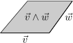
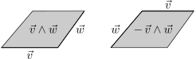
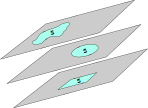
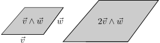
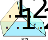
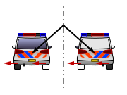
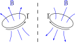

---
title: "Lezione 6"
subtitle: "Calcolo numerico per la generazione di immagini fotorealistiche"
author: "Maurizio Tomasi <maurizio.tomasi@unimi.it>"
...

# Animazioni

# Creazione di animazioni

-   La matematica delle trasformazioni che abbiamo introdotto nella scorsa lezione permette di creare facilmente immagini *statiche*.

-   Cosa cambierebbe se volessimo invece realizzare **animazioni**?

-   Vediamo subito un esempio pratico.

# Trasformazioni nel tempo (1/2)

-   Consideriamo un oggetto 3D centrato nell'origine.

-   Immaginiamo che al tempo $t = 0$ dell'animazione l'oggetto debba essere alla posizione $\vec k_0$, e al tempo $t = 1$ alla posizione $\vec k_1$.

-   Se voglio generare il fotogramma dell'oggetto al tempo generico $0 \leq t \leq 1$, la trasformazione $A$ è banalmente

    $$
    A(t) = T_{\vec k_0 + (\vec k_1 - \vec k_0) t} =
    \begin{pmatrix}
    1&0&0&k_{0x} + (k_{1x} - k_{0x})t\\
    0&1&0&k_{0y} + (k_{1y} - k_{0y})t\\
    0&0&1&k_{0z} + (k_{1z} - k_{0z})t\\
    0&0&0&1
    \end{pmatrix}.
    $$

# Trasformazioni nel tempo (2/2)

-   Le trasformazioni di scala sono ugualmente facili da animare: per scalare da $s_0$ a $s_1$, la trasformazione è

    $$
    A(t) = M_{s_0 + (s_1 - s_0) t} = \bigl(s_0 + (s_1 - s_0) t\bigr)
    \begin{pmatrix}
    1&0&0&0\\
    0&1&0&0\\
    0&0&1&0\\
    0&0&0&1
    \end{pmatrix}.
    $$

-   Ma per le rotazioni non esiste alcuna formula semplice!

# Animare rotazioni

-   Non basta interpolare i coefficienti delle due matrici
    $$
    R(0) = \begin{pmatrix}
    m_{11}&m_{12}&m_{13}\\
    m_{21}&m_{22}&m_{23}\\
    m_{31}&m_{32}&m_{33}
    \end{pmatrix},\ %
    R(1) = \begin{pmatrix}
    m'_{11}&m'_{12}&m'_{13}\\
    m'_{21}&m'_{22}&m'_{23}\\
    m'_{31}&m'_{32}&m'_{33}
    \end{pmatrix},\quad
    $$
    con la formula $m_{ij} + \bigl(m'_{ij} - m_{ij}\bigr) t$, perché non è garantito che l'interpolazione sia ancora ortogonale ($R(t) R(t)^t = I$).

-   Non esiste un modo semplice per interpolare le matrici di rotazione!

# Esempio

<iframe src="https://player.vimeo.com/video/538566733?title=0&amp;byline=0&amp;portrait=0&amp;speed=0&amp;badge=0&amp;autopause=0&amp;player_id=0&amp;app_id=58479" width="896" height="504" frameborder="0" allow="autoplay; fullscreen; picture-in-picture" allowfullscreen title="Scanning strategy of a CMB spacecraft (LiteBIRD-like)"></iframe>


# Esempio

-   Il satellite *Planck* aveva a bordo uno *star tracker* che identificava l'orientamento del satellite rispetto alle stelle fisse.

-   L'orientamento (*attitude*) era misurato 10 volte al secondo (i dati scientifici venivano campionati ~100 volte al secondo) e trasmesso alla stazione di terra:

    <center>
    
    </center>

-   A terra serve l'orientamento allo stesso campionamento del dato scientifico, quindi è necessario interpolare.

-   Per fare ciò, la pipeline di *data reduction* di Planck usava i **quaternioni**.

# Numeri complessi e quaternioni

# Breve panoramica storica

-   Antica Grecia: primi esempi di regola del parallelogramma
-   Fine '600: [Leibniz](https://en.wikipedia.org/wiki/Gottfried_Wilhelm_Leibniz) sollecita la creazione di un modo per legare algebra e geometria
-   Fine '700: [Wessel](https://en.wikipedia.org/wiki/Caspar_Wessel) introduce la somma e il prodotto di numeri complessi, che lega a proprietà geometriche, e ipotizza i quaternioni
-   1843: [Hamilton](https://en.wikipedia.org/wiki/William_Rowan_Hamilton) pubblica il suo primo lavoro sui quaternioni
-   1844–1878: [Grassmann](https://en.wikipedia.org/wiki/Hermann_Grassmann) e [Clifford](https://en.wikipedia.org/wiki/William_Kingdon_Clifford) propongono l'algebra geometrica
-   1861: [Maxwell](https://en.wikipedia.org/wiki/James_Clerk_Maxwell) formula le equazioni dell'elettromagnetismo, usando il formalismo dei quaternioni di Hamilton
-   Fine '800: [Gibbs](https://en.wikipedia.org/wiki/Josiah_Willard_Gibbs) ed [Heavyside](https://en.wikipedia.org/wiki/Oliver_Heaviside) propongono il calcolo vettoriale moderno, che in pochi decenni diventa il linguaggio dominante nella fisica

# Numeri complessi e quaternioni

-   Nella scorsa lezione abbiamo espresso le rotazioni in forma matriciale.

-   È possibile anche esprimere le rotazioni usando numeri complessi (in 2D) o quaternioni (in 3D).

-   I quaternioni hanno molti vantaggi rispetto alle matrici di rotazione 3D, e sono usati in molti ambiti. (Persino le equazioni di Maxwell furono inizialmente espresse con i quaternioni).

-   Noi **non** useremo quaternioni nel nostro codice, quindi questo argomento non sarà richiesto all'esame. Se volete approfondire, due ottimi testi sono [*Visualizing quaternions*](https://www.amazon.com/Visualizing-Quaternions-Kaufmann-Interactive-Technology/dp/0120884003) (A. J. Hanson) e [*Quaternions for computer graphics*](https://link.springer.com/book/10.1007/978-0-85729-760-0) (J. A. Vince).

# Numeri complessi

-   L'algebra ℂ dei numeri complessi contiene elementi $z = (\Re z, \Im z) = (x, y)$.

-   Il prodotto si definisce come

    $$
    z_1 \cdot z_2 = (\Re z_1\,\Re z_2 - \Im z_1\,\Im z_2, \Re z_1\,\Im z_2 + \Im z_1\,\Re z_2).
    $$

-   Introducendo $i$ tale che $i^2 = -1$ e scrivendo i numeri complessi nella forma $z = x + i y$, la formula del prodotto è più semplice da ricordare:

    $$
    (x_1 + i y_1) \cdot (x_2 + i y_2) = x_1 x_2 - y_1 y_2 + i \bigl(x_1 y_2 + x_2 y_1\bigr).
    $$

# Rotazioni e numeri complessi

-   Sul piano è possibile codificare una rotazione $R(\theta)$ attorno all'origine tramite il numero complesso

    $$
    r(\theta) = e^{i \theta} = \cos\theta + i\sin\theta
    $$

    se si associa al vettore da ruotare $\vec{v} = x \hat e_x + y \hat e_z$ il numero complesso

    $$
    z = x + iy.
    $$

    Sotto queste ipotesi, l'espressione $r(\theta) \cdot z$ è equivalente a $R(\theta)\vec{v}$.

-   Anziché i 4 coefficienti della matrice $R(\theta)$, servono solo $\Re z$ e $\Im z$.

# Da 2D a 3D

-   I [*quaternioni*](https://en.wikipedia.org/wiki/Quaternion) generalizzano in 3D la capacità dei numeri complessi di codificare rotazioni. Sono stati proposti da [W. R. Hamilton](https://en.wikipedia.org/wiki/William_Rowan_Hamilton) (quello dell'Hamiltoniana) nel 1843 proprio per estendere ℂ (“inventato” pochi decenni prima), e la loro algebra si indica con ℍ.

-   Se un numero complesso $z$ è formato da due coefficienti (la parte reale $\Re z$ e la parte immaginaria $\Im z$), un quaternione $q \in \mathbb{H}$ è composto da **quattro** coefficienti:

    $$
    q = (q_0, q_1, q_2, q_3) = \bigl(q_0, \vec{q}\bigr),
    $$

    Il termine $q_0$ è detto *parte scalare*, mentre $\vec{q} = (q_1\ q_2\ q_3)$ è la *parte vettoriale*.

# Prodotto di quaternioni

-   Il prodotto $p q$ tra due quaternioni è definito così:

    $$
    p q = \begin{pmatrix}
    p_0 q_0 - p_1 q_1 - p_2 q_2 - p_3 q_3\\
    p_1 q_0 + p_0 q_1 + p_2 q_3 - p_3 q_2\\
    p_2 q_0 + p_0 q_2 + p_3 q_1 - p_1 q_3\\
    p_3 q_0 + p_0 q_3 + p_1 q_2 - p_2 q_1
    \end{pmatrix}.
    $$

-   Questo prodotto soddisfa tutte le proprietà di un'algebra associativa, ma **non è commutativo**: $p q \not= q p$. (Prima algebra di questo tipo nella storia!).

# Notazione per i quaternioni

-   Hamilton inventò una notazione molto comoda per i quaternioni:
    $$
    q = q_0 + q_1 \mathbf{i} + q_2 \mathbf{j} + q_3 \mathbf{k}.
    $$

-   Se si definiscono le seguenti regole, il prodotto tra quaternioni della slide precedente deriva conseguentemente:

    $$
    \begin{aligned}
    \mathbf{i} \mathbf{i} &= -1, &\mathbf{i} \mathbf{j} &=  \mathbf{k}, &\quad\mathbf{j} \mathbf{i} = -\mathbf{k},\\
    \mathbf{j} \mathbf{j} &= -1, &\mathbf{j} \mathbf{k} &=  \mathbf{i}, &\quad\mathbf{k} \mathbf{j} = -\mathbf{i},\\
    \mathbf{k} \mathbf{k} &= -1, &\mathbf{k} \mathbf{i} &=  \mathbf{j}, &\quad\mathbf{i} \mathbf{k} = -\mathbf{j}.
    \end{aligned}
    $$

# Prodotto interno

-   È possibile definire un prodotto interno tra quaternioni:

    $$
    p \cdot q = p_0 q_0 + p_1 q_1 + p_2 q_2 + p_3 q_3 = p_0 q_0 + \vec{p} \cdot \vec{q},
    $$

    a cui è naturale associare una norma:

    $$
    \left\|q\right\| = \sqrt{q \cdot q} = \sqrt{q_0^2 + q_1^2 + q_2^2 + q_3^2} = \sqrt{q_0^2 + \left\|\vec{q}\right\|}.
    $$

-   È definita anche l'operazione di coniugazione:

    $$
    q^* = (q_0, -q_1, -q_2, -q_3) = (q_0, -\vec{q}).
    $$

# Rotazioni 3D con quaternioni

-   Dato un vettore normalizzato $\hat n$ e un angolo $\theta$, ad esso si associa il quaternione

    $$
    r(\theta, \hat n) = \left(\cos\frac\theta2, \sin\frac\theta2\,\hat n\right),
    $$

    che rappresenta la rotazione di un angolo $\theta$ intorno a $\hat n$.

-   Se $\left\|\hat n\right\| = 1$, vale ovviamente che $\left\|r(\theta, \hat n)\right\| = 1$.

-   Vediamo ora come rappresentare una rotazione 3D mediante $r(\theta, \hat n)$.

# Applicazione della rotazione.

-   Un generico vettore $\vec v$ viene ruotato in $\vec v'$ tramite questo prodotto di tre quaternioni:

    $$
    \vec v' = r(\theta, \hat n) \cdot (0, \vec v) \cdot r^{-1}(\theta, \hat n),
    $$
    dove $(0, \vec v)$ rappresenta il quaternione associato a $\vec v$.

-   Intuitivamente, $r(\theta, \hat n)$ compare **due** volte nella formula perché dipende dall'angolo $\theta/2$, e non semplicemente dall'angolo $\theta$.

-   Dalla formula è evidente che $r(\theta, \hat n)$ e $-r(\theta, \hat n)$ rappresentano la medesima rotazione.

# I quaternioni sono efficienti?

-   Una matrice di rotazione deve essere memorizzata salvando in memoria 9  coefficienti, mentre un quaternione ne richiede appena 4.

-   Dovremmo quindi usare quaternioni per rappresentare le rotazioni nel nostro codice?

-   In generale **no**! Se si scrive esplicitamente la sequenza di operazioni necessaria per ruotare un vettore, si può dimostrare che la rappresentazione matriciale richiede meno calcoli.

-   A cosa sono utili allora i quaternioni?


# *Slerp*

-   Col termine *slerp* si intende l'interpolazione $r(t)$ tra due rotazioni $r_1$ e $r_2$.

-   La formula di $r(t) \in \mathbb{H}$ per $t \in [0, 1]$ è banalmente

    $$
    r(t) = \frac{\sin(1 - t)\theta}{\sin\theta}r_1 + \frac{\sin t\theta}{\sin\theta}r_2,
    $$

    dove $\theta$ è l'angolo tra i due quaternioni $r_1$ e $r_2$ (con $\left\|r_1\right\| = \left\|r_2\right\| = 1$):

    $$
    \theta = r_1 \cdot r_2.
    $$

-   È facile dimostrare che $r(t)$ rappresenta una rotazione $\forall t\in [0, 1]$.

# Esempio di slerp

<p><embed width="640px" height="640px" src="js/slerp.html"/></p>

# Animare le trasformazioni

-   Rappresentare le rotazioni con i quaternioni riempie l'ultimo “buco” che ci mancava: tutte le trasformazioni presentate nella lezione precedente sono facilmente interpolabili:

    1.  Traslazioni;
    2.  Trasformazioni di scala;
    3.  Rotazioni 🥳.

-   La pagina [Look, Ma, No Matrices!](https://enkimute.github.io/LookMaNoMatrices/) mostra un simpatico esempio…

-   …che usa un'estensione del concetto di “quaternione”, i **multivettori**, per generare gli effetti mostrati in fondo alla pagina.

-   Vediamo quindi cosa sono i multivettori e le algebre di Clifford.

# Algebre di Clifford

# Limiti della geometria classica

-   Esistono vettori e pseudovettori, che seguono regole di trasformazione diverse.

-   Per descrivere le rotazioni su un piano 2D è necessario usare (pseudo)vettori 3D, come il *momento angolare* $\vec{L} = \vec{r} \times \vec{p}$ o il *momento torcente* $\vec{\tau} = \vec r \times \vec F$.

-   Il prodotto vettoriale è definibile solo per $\mathbb{R}^3$ (e $\mathbb{R}^7$, [a causa degli ottonioni](https://en.m.wikipedia.org/wiki/Seven-dimensional_cross_product)…), e ha unità strane: se $v$ e $w$ sono in metri, $v \times w$ è in m².

-   La rappresentazione delle rotazioni richiede algebre via via più complicate man mano che aumentano le dimensioni (numeri complessi, quaternioni…).

-   Non è possibile invertire i prodotti tra vettori: se $\vec a \times \vec x = \vec b$ con $\vec a$ e $\vec b$ noti e $x$ vettore incognito, non c'è modo di ricostruire univocamente $\vec x$.

# Algebra geometrica

-   Le **algebre di Clifford**, e in particolare l'*algebra geometrica*, superano tutti i problemi elencati nella slide precedente.

-   Si tratta di una branca della matematica che rifonda l'algebra lineare classica, e fornisce un'interpretazione più intuitiva e coerente di certe proprietà geometriche. [Clifford](https://en.wikipedia.org/wiki/William_Kingdon_Clifford) la propose nel 1878.

-   L'**algebra geometrica** è l'applicazione delle algebre di Clifford al caso di $\mathbb{R}^n$, ed è ciò che solitamente interessa ai fisici. Noi ci limiteremo a queste.


# Il prodotto esterno (o di Grassmann)

# Prodotto tra vettori

-   Il problema del prodotto vettoriale $\times$ è che è definito solo su ℝ³, mentre noi desideriamo un'algebra generale!

-   Nel 1840, [Hermann Günter Grassmann](https://en.wikipedia.org/wiki/Hermann_Grassmann) (1809–1877) definì il prodotto esterno $\vec v \wedge \vec w$ tra due vettori $v$ e $w$ (oggi chiamato anche *prodotto di Grassmann*) come l'area orientata sul piano $\mathrm{Span}(\vec v, \vec w)$ con superficie

    $$
    \left\|\vec v\right\|\,\left\|\vec w\right\|\,\sin\theta.
    $$

    <center>
    {height=160px}
    </center>

# Aree orientate

-   Un'area orientata come $\vec v \wedge \vec w$ si dice **bivettore**.

-   I bivettori sono orientati proprio come i comuni vettori: cambiare segno a un bivettore significa invertirne il verso di percorrenza (∧ è **antisimmetrico**).

    <center>
    
    </center>

-   Questo è analogo a quanto succede con un vettore: $\vec v \rightarrow - \vec v$.

-   Così come un vettore $\vec v$ non dipende dal punto di applicazione, un bivettore non dipende dal suo perimetro («forma»).

# «Forma» del prodotto esterno

<center>

</center>

Può suonare strano! Però ciò garantisce che $(2\vec v) \wedge \vec w = \vec v \wedge (2\vec w)$.

# Significato del prodotto esterno

-   Queste sono le informazioni che codifica un prodotto esterno $\vec v \wedge \vec w$:

    #. Estensione della superficie (es., 15 m²);
    #. Inclinazione del piano su cui si trova la superficie;
    #. Orientamento della superficie.

-   Queste informazioni non sono invece codificate:

    #. Forma della superficie;
    #. Posizione del piano rispetto all'origine degli assi.

-   Vediamo ora che è possibile definire le operazioni di prodotto scalare-bivettore e somma sui bivettori: ciò fa di essi uno **spazio vettoriale**.

# Prodotto scalare-bivettore

-   L'espressione $\lambda \vec v \wedge \vec w$ con $\lambda \in \mathbb{R}$ è ancora un bivettore.

-   L'area di $\lambda \vec v \wedge \vec w$ è $\left|\lambda\right|$ volte l'area di $\vec v \wedge \vec w$.

-   Se $\lambda < 0$, il verso si inverte, altrimenti resta lo stesso.

    <center>
    
    </center>


# Somma di bivettori

<center>
{height=640px}
</center>

# Somma di bivettori

-   Se due bivettori $B_1$ e $B_2$ sono coplanari, allora:

    #. $B_1 + B_2$ è un bivettore sul medesimo piano;
    #. La sua superficie è pari alla somma con segno delle due (dove il segno è determinato dal verso).

-   Se non sono coplanari, si considera un vettore $\vec w$ allineato lungo la retta intersezione dei due piani e si individuano $\vec u$ e $\vec v$ tali che

    $$
    B_1 = \vec u \wedge \vec w,\quad B_2 = \vec v \wedge \vec w.
    $$

    Dalle proprietà di $\wedge$ segue che $B_1 + B_2 = (\vec u + \vec v) \wedge \vec w$.

# Base dei bivettori

-   La formula della somma appare complicata, ma permette di costruire uno spazio vettoriale.

-   Essendo uno spazio vettoriale, l'insieme dei bivettori possiede quindi delle basi, e la somma è più semplice da capire e calcolare se si decompongono i bivettori in una base.

-   Possiamo definire la **base canonica** come l'insieme dei tre bivettori di area unitaria sui piani $xy$, $yz$ e $xz$:

    $$
    \hat e_1 \wedge \hat e_2, \quad \hat e_2 \wedge \hat e_3, \quad \hat e_1 \wedge \hat e_3.
    $$

# Base dei bivettori

```{.asy im_fmt="html" im_opt="-f html" im_out="img,stdout,stderr" im_fname="bivector-basis"}
size(0,100);
import three;
currentlight=Viewport;

draw(O--1.5X, gray); //x-axis
draw(O--1.5Y, gray); //y-axis
draw(O--1.5Z, gray); //z-axis

label("$x$", 1.5X + 0.2Z);
label("$y$", 1.5Y + 0.2Z);
label("$z$", 1.5Z + 0.2X);

path3 xy = ((1, 1, 0) -- (0.01, 1, 0) -- (0.01, 0.01, 0) -- (1, 0.01, 0) -- cycle);
path3 xz = rotate(90, X) * xy;
path3 yz = rotate(-90, Y) * reverse(xy);

draw(surface(xy), red + opacity(0.5));
draw(surface(xz), green + opacity(0.5));
draw(surface(yz), blue + opacity(0.5));

draw(xy, red, Arrow3);
draw(xz, green, Arrow3);
draw(yz, blue, Arrow3);

label("$\hat e_1 \wedge \hat e_2$", (0.5, 0.5, 0.05));
label("$\hat e_2 \wedge \hat e_3$", (0.05, 0.5, 0.5));
label("$\hat e_1 \wedge \hat e_3$", (0.5, 0.05, 0.5));
```

# Somma di bivettori

-   Se si hanno due bivettori

    $$
    \begin{aligned}
    \vec v &= 3 \hat e_1 \wedge \hat e_2 - \hat e_1 \wedge \hat e_3,\\
    \vec w &= 2 \hat e_1 \wedge \hat e_2 + 4\hat e_1 \wedge \hat e_3,\\
    \end{aligned}
    $$

    allora la loro somma è

    $$
    \vec v + \vec w = 5\hat e_1 \wedge \hat e_2 + 3\hat e_1 \wedge \hat e_3.
    $$

-   È quindi banale fare calcoli con bivettori!

# Multivettori

-   Il prodotto esterno può essere calcolato anche tra un bivettore e un vettore, e possiamo sfruttare la proprietà associativa:

    $$
    \vec u \wedge \vec v \wedge \vec w = (\vec u \wedge \vec v) \wedge \vec w = \vec u \wedge (\vec v \wedge \vec w)$$

-   Il trivettore $\vec u \wedge \vec v \wedge \vec w$ rappresenta un *volume orientato*.

-   Applicando il prodotto esterno a ripetizione si possono generare trivettori, quadrivettori, etc. (Ecco perché si chiama *esterno*).

-   In generale, si parla di *multivettori*, o $k$-vettori: lo scalare è uno 0-vettore, i vettori sono 1-vettori, i bivettori sono 2-vettori, etc.


# Esempi di calcolo

-   Consideriamo per esempio ℝ³ e la base canonica $\left\{\hat e_i\right\}$.

-   Questi sono alcuni esempi di trivettori e di calcoli associati ad essi:

    $$
    \begin{aligned}
    \hat e_1 \wedge \hat e_3 \wedge \hat e_2 &= \hat e_1 \wedge (\hat e_3 \wedge \hat e_2) = -\hat e_1 \wedge (\hat e_2 \wedge \hat e_3) = -\hat e_1 \wedge \hat e_2 \wedge \hat e_3,\\
    \hat e_2 \wedge \hat e_3 \wedge \hat e_1 &= -\hat e_2 \wedge \hat e_1 \wedge \hat e_3 = \hat e_1 \wedge \hat e_2 \wedge \hat e_3,\\
    \hat e_1 \wedge \hat e_2 \wedge \hat e_3 \wedge \hat e_3 &= \hat e_1 \wedge \hat e_2 \wedge (\hat e_3 \wedge \hat e_3) = 0,\\
    \hat e_1 \wedge \hat e_2 \wedge \hat e_3 \wedge \hat e_2 &= -\hat e_1 \wedge (\hat e_2 \wedge \hat e_2) \wedge \hat e_3 = 0.\\
    \end{aligned}
    $$

-   Dagli ultimi due esempi è facile convincersi che il prodotto esterno di quattro elementi della base si **annulla sempre**.

# Numerosità dei multivettori

-   Non solo il prodotto esterno di quattro elementi della **base** è nullo: anche se si prendono quattro vettori qualsiasi in $\mathbb{R}^3$, il loro prodotto è zero.

-   È banale dimostrare che in uno spazio $\mathbb{R}^n$ il massimo grado dei multivettori è $n$

-   Di conseguenza, in $\mathbb{R}^3$ solo i seguenti oggetti sono non banali:

    #. Gli 0-vettori (scalari);
    #. I 1-vettori (vettori);
    #. I 2-vettori (bivettori), chiamati anche *pseudovettori*;
    #. I 3-vettori (trivettori), chiamati anche *pseudoscalari*.

# Il prodotto geometrico

# Nascita dell'algebra geometrica

-   Clifford partì dal prodotto esterno di Grassmann per definire un **prodotto tra vettori**, che rende lo spazio vettoriale $\mathbb{R}^n$ un'**algebra**.

-   L'intuizione geniale di Clifford fu che il vecchio, “classico” prodotto scalare e il “nuovo” prodotto esterno di Grassmann sono intuitivamente legati tra loro, perché

    $$
    \vec{v} \cdot \vec{w} \propto \cos\theta, \quad \vec{v} \wedge \vec{w} \propto \sin\theta,
    $$

    ed ovviamente $\sin^2\theta + \cos^2\theta = 1$.

# Tabelle di moltiplicazione

-   La relazione si vede anche confrontando il modo in cui si combinano gli elementi della base canonica di ℝ³:

    $$
    \begin{matrix}
    \cdot& e_1& e_2& e_3\\
    e_1& 1& 0& 0\\
    e_2& 0& 1& 0\\
    e_3& 0& 0& 1
    \end{matrix}
    \qquad\qquad
    \begin{matrix}
    \wedge& e_1& e_2& e_3\\
    e_1& 0& e_1 \wedge e_2& e_1 \wedge e_3\\
    e_2& -e_1 \wedge e_2& 0& e_2 \wedge e_3\\
    e_3& -e_1 \wedge e_3& -e_2 \wedge e_3& 0
    \end{matrix}
    $$

-   È tentante l'idea di sommarli insieme, anche perché ciò ricorda la formula

    $$
    z = \left|z\right|\bigl(\cos\theta + i\sin\theta\bigr).
    $$

# Prodotto geometrico

-   Il **prodotto geometrico** è la somma del prodotto interno e del prodotto esterno:

    $$
    \vec v\,\vec w = \vec v \cdot \vec w + \vec v \wedge \vec w.
    $$

-   Questo prodotto è definito su $\mathbb{R}^n$, per qualsiasi valore di $n \geq 1$ (ma il caso $n = 1$ è banale), perché lo stesso prodotto esterno $\vec v \wedge \vec w$ è facilmente generalizzabile a $n$ dimensioni.

-   Il prodotto geometrico definisce un'algebra associativa sullo spazio vettoriale.


# Prodotto geometrico

-   Cosa significa sommare tra loro uno scalare come $\vec v \cdot \vec w$ e un bivettore come $\vec v \wedge \vec w$?

-   La «somma» si deve intendere in un senso non letterale, proprio come la somma della parte reale e immaginaria di un numero ($z = x + iy$).

-   In realtà $z \in \mathbb{C}$ rappresenta una coppia $(x, y)$, che si scrive come $x + iy$ perché ciò è un aiuto mnemonico quando si devono calcolare somme e prodotti di numeri complessi.

-   Allo stesso modo la scrittura $\vec v \cdot \vec w + \vec v \wedge \vec w$ è un aiuto mnemonico per ricordare come si sommano e moltiplicano tra loro prodotti geometrici.

# Esistenza dell'inversa

-   Calcoliamo $\vec v^2$ per un generico vettore $\vec v$:

    $$
    \vec v^2 = \vec v \vec v = \vec v \cdot \vec v + \vec v \wedge \vec v = \left\|\vec v\right\|^2 + 0 = \left\|\vec v\right\|^2.
    $$

-   Questo risultato implica che $\vec v / \left\|\vec v\right\|^2$ sia l'inverso di $\vec v$:

    $$
    \vec v \frac{\vec v}{\left\|\vec v\right\|^2} = \frac{\vec v \vec v}{\left\|\vec v\right\|^2} = 1,
    $$

    e quindi $\vec v^{-1} = \vec v / \left\|\vec v\right\|^2$: come ogni algebra che si rispetti, **esiste l'inversa**!

# Altri esempi

-   Supponiamo che $\vec v \perp \vec w$. Allora

    $$
    \vec v \vec w = \vec v \cdot \vec w + \vec v \wedge \vec w = \vec v \wedge \vec w.
    $$

    Per vettori perpendicolari, il prodotto geometrico coincide con quello esterno.

-   La base canonica $\left\{\hat e_i\right\}$ gode quindi delle seguenti proprietà:

    $$
    \hat e_i \hat e_i = \left\|\hat e_i\right\|^2 = 1, \quad \hat e_i \hat e_j = \hat e_i \wedge \hat e_j = -\hat e_j \wedge \hat e_i = - \hat e_j \hat e_i\ \text{se $i \not= j$}.
    $$

# Prodotti di multivettori

-   Abbiamo detto che in $\mathbb{R}^n$ si possono avere multivettori di grado fino a $n$, perché il prodotto esterno $\wedge$ di $n + 1$ vettori si annulla.

-   Cosa succede al prodotto geometrico di quattro vettori ortonormali in ℝ³?

    $$
    \begin{aligned}
    \hat e_1 \hat e_2 \hat e_3 \hat e_3 &= \hat e_1 \hat e_2 (\hat e_3 \hat e_3) = \hat e_1 \hat e_2\\
    \hat e_1 \hat e_2 \hat e_3 \hat e_2 &= -\hat e_1 \hat e_2 \hat e_2 \hat e_3 = -\hat e_1 (\hat e_2 \hat e_2) \hat e_3 = -\hat e_1 \hat e_3,\\
    \hat e_1 \hat e_2 \hat e_3 \hat e_1 &= -\hat e_1 \hat e_2 \hat e_1 \hat e_3= \hat e_1 \hat e_1 \hat e_2 \hat e_3 = \hat e_2 \hat e_3.
    \end{aligned}
    $$

-   Otteniamo sempre bivettori!

# Esempi

-   Se si sa operare sugli elementi di $\left\{\hat e_i\right\}$, è facile fare calcoli su vettori arbitrari.

-   Prendiamo ad esempio i vettori

    $$\vec v = 2\hat e_1 + \hat e_2,\quad \vec w = -\hat e_2.$$

    Allora:

    $$
    \begin{aligned}
    \vec v \vec w &= \bigl(2\hat e_1 + \hat e_2\bigr) \bigl(-\hat e_2\bigr) = 2\hat e_1 \hat e_2 - \hat e_2^2 = 2\hat e_1 \hat e_2 - 1,\\
    \vec v^2 &= \vec v \vec v = \bigl(2\hat e_1 + \hat e_2\bigr) \bigl(2\hat e_1 + \hat e_2\bigr) =\\
    &= 4\hat e_1^2  + 2 \hat e_2 \hat e_1 + 2\hat e_1\hat e_2 + \hat e_2^2 = 5.\\
    \end{aligned}
    $$

# Algebra geometrica in 2D

# Multivettore generale in 2D

-   In ℝ² si possono avere solo 0-vettori (scalari), 1-vettori e 2-vettori (bivettori).

-   La forma generica di un multivettore è quindi

    $$
    q = \alpha + \beta_1 \hat e_1 + \beta_2 \hat e_2 + \gamma \hat e_1 \hat e_2.
    $$

-   Abbiamo **quattro** gradi di libertà. Come si comportano le sue quattro componenti?

# Sottoalgebre

-   Notiamo innanzitutto che dalla scrittura

    $$
    q = \alpha + \beta_1 \hat e_1 + \beta_2 \hat e_2 + \gamma \hat e_1 \hat e_2
    $$

    è possibile individuare quattro sottoinsiemi (sottoalgebre):

    #.   Se $\beta_1 = \beta_2 = \gamma = 0$, il sottoinsieme è isomorfo a ℝ.
    #.   Se $\alpha = \gamma = 0$, il sottoinsieme è isomorfo allo spazio vettoriale $\mathbb{R}^2$.
    #.   Se $\alpha = \beta_1 = \beta_2 = 0$, il sottoinsieme sembra ancora isomorfo a ℝ; questi multivettori si dicono *pseudoscalari*.

-   A parte questi casi banali, esistono altre sottoalgebre interessanti?

# Multivettori e numeri complessi

-   Lo pseudoscalare $\hat e_1 \hat e_2$ si comporta come $i$!

    $$
    \bigl(\hat e_1 \hat e_2\bigr)^2 = \hat e_1 \hat e_2 \hat e_1 \hat e_2 = -\hat e_1 \hat e_2 \hat e_2 \hat e_1 = -1.
    $$

-   Confrontiamo numeri complessi e multivettori con $\beta_1 = \beta_2 = 0$:

    $$
    \begin{aligned}
    (3 + i) (1 - 2 i) &= 3 + i - 6 i + 2 = 5 - 5i,\\
    (3 + \hat e_1 \hat e_2) (1 - 2\hat e_1 \hat e_2) &= 3 + \hat e_1 \hat e_2 - 6 \hat e_1 \hat e_2 + 2 = 5 - 5 \hat e_1 \hat e_2.
    \end{aligned}
    $$

    Coincidono! L'algebra con $\beta_1 = \beta_2 = 0$ è isomorfa a ℂ, e si pone $\hat e_1 \hat e_2 = i$.

# Multivettori e rotazioni 2D

-   I numeri $e^{i\theta}$ ruotano punti sul piano ℂ. Funziona anche con multivettori?

-   Vediamo innanzitutto una interessante proprietà del prodotto geometrico:

    $$
    \begin{aligned}
    \vec u \vec v &= \vec u \cdot \vec v + \vec u \wedge \vec v =\\
    &= \left\|\vec u\right\| \cdot \left\|\vec v\right\| \cdot \cos\theta +
       \left\|\vec u\right\| \cdot \left\|\vec u\right\| \cdot \sin\theta \cdot \hat e_1 \hat e_2 =\\
    &= \left\|\vec u\right\| \cdot \left\|\vec v\right\| \cdot
       \bigl(\cos\theta + i\sin\theta\bigr) \equiv\\
    &\stackrel{\text{def.}}{\equiv} \left\|\vec u\right\| \cdot \left\|\vec v\right\| \cdot e^{i\theta} = \left\|\vec u\right\| \cdot \left\|\vec v\right\| \cdot e^{\theta \hat e_1 \hat e_2},
    \end{aligned}
    $$

    che per $\left\|\vec u\right\| = \left\|\vec v\right\| = 1$ porta a $\vec u \vec v = e^{i\theta}$, la rotazione per un angolo $\theta$!

# Multivettori e rotazione 2D

-   Per ruotare un vettore $\vec v$ di un angolo θ attorno all'origine è sufficiente considerare due versori $\hat u_1$ e $\hat u_2$, il cui angolo tra loro sia θ, e calcolare il multivettore ruotato $\vec v'$ come

    $$
    \vec v' = \hat u_1 \hat u_2 \vec v = e^{i\theta} \vec v = \left(\cos\theta + i \sin\theta\right) \vec v.
    $$

-   Questa formula vale solo nel caso 2D, ma si può riscrivere in forma generale.

# Rotazione 2D alternativa

-   Il prodotto tra due numeri complessi commuta, e così è anche nella sottoalgebra di Clifford che contiene multivettori nella forma $\alpha + \hat e_1 \hat e_2 \beta$.

-   Nella formula $\vec v' = e^{i\theta} \vec v$ però figura il *vettore* $\vec v$, che non fa parte della sottoalgebra: in questo caso il prodotto non commuta!

-   Si può dimostrare che in 2D vale $z \vec v = \vec v z^*$, dove $z^*$ è il complesso coniugato.

-   Se ci riconduciamo a una relazione simile a quella [vista per i quaternioni](tomasi-ray-tracing-07a-clifford-algebras.html#/applicazione-della-rotazione), ossia

    $$
    \vec v' = e^{i\theta} \vec v = e^{i\theta/2} e^{i\theta/2} \vec v = e^{i\theta/2}\vec v e^{-i\theta/2},
    $$

    vedremo che la formula ha un'applicazione molto più generale.

# Algebra geometrica in 3D

# Multivettori in ℝ³

-   Consideriamo la base canonica $\left\{\hat e_i\right\}$ in ℝ³.

-   Il multivettore più generico che possiamo pensare deve avere questa forma:

    $$
    \begin{aligned}
    &\alpha +\\
    &\beta_1 \hat e_1 + \beta_2 \hat e_2 + \beta_3 \hat e_3 +\\
    &\gamma_1 \hat e_1 \hat e_2 + \gamma_2 \hat e_2 \hat e_3 + \gamma_3 \hat e_3 \hat e_1 +\\
    &\delta \hat e_1 \hat e_2 \hat e_3.
    \end{aligned}
    $$

-   Abbiamo **otto** gradi di libertà: 1 per gli scalari, 3 per i vettori, 3 per i bivettori e 1 per i trivettori (pseudoscalari). Vale ancora che $(\hat e_1 \hat e_2 \hat e_3)^2 = -1 \equiv i^2$.

# Multivettori e rotazioni in 3D

-   Per specificare una rotazione in 3D occorre l'angolo e l'asse di rotazione.

-   Ma nell'algebra geometrica non si specifica l'*asse*, bensì il *piano* di rotazione: un bivettore!

-   Se il piano di rotazione è il bivettore $\hat I$, il vettore $\vec v$ ruota in $\vec v'$ tramite

    $$
    \vec v' = e^{-\hat I \theta/2} \vec v e^{\hat I \theta/2},
    $$

    che è l'espressione che [avevamo già visto](tomasi-ray-tracing-07a-clifford-algebras.html#/rotazione-2d-alternativa) nel caso 2D, dove $\hat I = i = \hat e_1 \hat e_2$: era il piano complesso. Abbiamo un'interpretazione geometrica della presenza di $i$!

# Meccanica quantistica

-   [D. Hestenes](https://en.wikipedia.org/wiki/David_Hestenes), che negli anni '60-'70 ha riscoperto i lavori di Grassmann e Clifford, ha mostrato che il termine $i$ nell'equazione di Schrödinger
    $$
    H \left|\psi\right> = i\hbar \frac{\mathrm{d}}{\mathrm{d}t} \left|\psi\right>,
    $$
    è legato alla medesima rotazione che nella teoria di Dirac-Pauli rappresenta lo spin.

-   *It is only in a theory with electron spin that one can see why the wave function is complex […] spin is not a mere add-on in quantum mechanics, [and] was inadvertently incorporated into the original Schrödinger equation* ([Hestenes 2002](https://geocalc.clas.asu.edu/pdf/OerstedMedalLecture.pdf))

# Multivettori e quaternioni

-   È facile dimostrare che

    $$
    (\hat e_1 \hat e_2)^2 = -1,\quad (\hat e_2 \hat e_3)^2 = -1,\quad (\hat e_1 \hat e_3)^2 = -1,
    $$

    e quindi possiamo ottenere una sottoalgebra che è isomorfa all'algebra ℍ dei quaternioni ponendo

    $$
    \mathbf{i} = \hat e_2 \hat e_3, \quad \mathbf{j} = \hat e_1 \hat e_3,\quad \mathbf{k} = \hat e_1 \hat e_2.
    $$

-   Com'è facile dimostrare, tutte le [proprietà che avevamo elencato](tomasi-ray-tracing-07a-clifford-algebras.html#/notazione-per-i-quaternioni) continuano ad essere valide.

# Meccanica quantistica

-   Ma le proprietà dei bivettori in ℝ³ sono le medesime che definiscono le **matrici di Pauli**, usate per descrivere l'accoppiamento tra lo spin e il campo e.m.:

    $$
    \sigma_1 = \begin{pmatrix}0& 1\\1& 0\end{pmatrix}, \quad \sigma_2 = \begin{pmatrix}0& -i\\i& 0\end{pmatrix}, \quad \sigma_3 = \begin{pmatrix}1& 0\\0& -1\end{pmatrix}.
    $$

-   Nell'ottica dell'algebra geometrica, il divario tra fisica classica e meccanica quantistica si riduce, perché quest'ultima si basa su bivettori sul campo **reale** ℝ come nel caso della meccanica classica (dove però i bivettori sono molto meno pervasivi)

# Prodotto vettoriale

-   In 3D esiste il prodotto vettoriale $\vec u \times \vec v$. Cosa c'è di equivalente nell'algebra geometrica?

-   La formula per il prodotto vettore nella geometria classica è

    $$
    \vec u \times \vec v = (u_2 v_3 - u_3 v_2) \hat e_1 + (u_3 v_1 - u_1 v_3) \hat e_2 + (u_1 v_2 - u_2 v_1) \hat e_3.
    $$

    Se scriviamo esplicitamente il prodotto esterno, otteniamo

    $$
    \vec u \wedge \vec v = (u_2 v_3 - u_3 v_2) \hat e_2 \hat e_3 + (u_3 v_1 - u_1 v_3) \hat e_3 \hat e_1 + (u_1 v_2 - u_2 v_1) \hat e_1 \hat e_2.
    $$

    Non è la stessa cosa, ma siamo molto vicini!

# Prodotto esterno e vettoriale

-   Se $i = \hat e_1 \hat e_2 \hat e_3$, si può verificare facilmente che

    $$
    i\vec u \times \vec v = \vec u \wedge \vec v,
    $$

    e questa formula può essere usata come spunto per convertire nel formalismo dell'algebra geometrica le equazioni classiche che contengono $\times$ .

-   Il prodotto esterno ha una serie di vantaggi su quello vettoriale:

    #.   È definito su $\mathbb{R}^n$ per qualsiasi $n$, mentre quello vettoriale solo per $n = 3$.
    #.   Il prodotto esterno è associativo, quello vettoriale no: $u \times (v \times w) \not= (u \times v) \times w$. I calcoli sono quindi più semplici.

# Leggi della fisica e ∧

-   Il prodotto vettoriale compare in molte leggi della fisica:

    -   Dinamica del corpo rigido;

    -   Equazioni di Maxwell;

    -   Forza di Lorentz.

-   In tutti questi casi è possibile modificare le definizioni e le formule per usare il prodotto esterno anziché quello vettoriale.

# Dinamica rotazionale

-   Il *momento angolare* può essere definito come il bivettore $\vec L = \vec r \wedge \vec p$:

    <center>
    
    </center>

-   A differenza della definizione tradizionale ($\vec L = \vec r \times \vec p$), qui $\vec L$ rappresenta una sezione orientata di piano, che è intuitivo: è il piano sul quale avviene la rotazione, e l'orientamento corrisponde al verso.

# Riflessioni e momento angolare

-   Ricordate l'immagine che illustrava la riflessione di pseudovettori?

    <center>
    {height=380px}
    </center>

-   Se $L$ è un bivettore non c'è problema! Il piano su cui gira la ruota è perpendicolare allo schermo, e si riflette banalmente nello specchio.


# Equazioni di Maxwell

-   $\vec E$ è un vettore, ma $\vec B$ è un bivettore!

    <center>
    {height=380px}
    </center>

-   (Ma è più conveniente pensare in termini del multivettore $\vec F = \vec E + i c \vec B$).

# Multivettori e ray-tracing?

-   L'algebra geometrica semplifica molto le equazioni geometriche che servono nel nostro corso.

-   Ad esempio, scalari, vettori, piani e volumi potrebbero essere codificati da un solo tipo `Multivector`, e le trasformazioni (rotazioni, traslazioni, etc.) dovrebbero essere implementate una sola volta: che meraviglia!

-   Però un multivettore in ℝ³ richiede ben 8 floating-point per essere memorizzato: visto che in un ray-tracer servono soprattutto vettori, ciò è uno spreco (la nostra struttura `Vec` richiede appena 3 floating point).

-   È difficile (ma non impossibile) implementare programmi di ray-tracing che usano l'algebra geometrica e che siano efficienti.

# Approfondimenti (1/2)

-   [A swift introduction to geometric algebra](https://www.youtube.com/watch?v=60z_hpEAtD8): alcune idee e diagrammi di queste slide sono state prese da qui (video su YouTube, di circa 40 minuti).

-   [*Geometric Multiplication of Vectors*](https://www.springer.com/gp/book/9783030017552) (M. Josipović): molto chiaro, punta a fornire un'idea intuitiva di come funzioni l'algebra geometrica.

-   [*Understanding Geometric Algebra*](https://www.routledge.com/Understanding-Geometric-Algebra-Hamilton-Grassmann-and-Clifford-for-Computer/Kanatani/p/book/9780367575823) (K. Kanatani): ha un taglio più sistematico di Josipović; mostra il legame tra matrici omogenee e algebra geometrica.

-   [*Geometric Algebra for Physicists*](https://www.cambridge.org/core/books/geometric-algebra-for-physicists/FB8D3ACB76AB3AB10BA7F27505925091) (C. Doran, A. Lasenby): mostra in che modo sia possibile riformulare le equazioni della fisica usando l'algebra geometrica. I campi studiati sono: meccanica classica, relatività speciale, elettromagnetismo, meccanica quantistica, formalismo Lagrangiano, gravitazione, etc.

# Approfondimenti (2/2)

-   [*Understanding geometric algebra for electromagnetic theory*](https://onlinelibrary.wiley.com/doi/book/10.1002/9781118078549) (J. W. Arthur): è un testo di elettromagnetismo e relatività speciale che usa l'algebra geometrica sin dal primo capitolo.

-   [*Geometric Algebra. An Algebraic System for Computer Games and Animation*](https://www.springer.com/gp/book/9781848823785) (J. A. Vince): mostra come le equazioni tipiche usate nella grafica computerizzata (rotazioni, quaternioni, proiezioni, ray-tracing, etc.) possano essere riformulate usando i multivettori.

-   [*A history of vector analysis*](https://en.wikipedia.org/wiki/A_History_of_Vector_Analysis) (M. J. Crowe): descrive la storia dell'analisi vettoriale, confrontando le algebre di Hamilton, Grassmann/Clifford, e il sistema vettoriale di Gibbs/Heavyside (che è quello «classico», nato però per ultimo).
