# The Rendering Equation

# Review

-   **Radiance** (flux $\Phi$ in Watt normalized on the projected surface
    per unit solid angle):
    $$
    L = \frac{\mathrm{d}^2\Phi}{\mathrm{d}\Omega\,\mathrm{d}A^\perp}
      = \frac{\mathrm{d}^2\Phi}{\mathrm{d}\Omega\,\mathrm{d}A\,\cos\theta},
    \qquad [L] = \mathrm{W}/\mathrm{m}^2/\mathrm{sr}.
    $$

-   Rendering equation:
    $$
    \begin{aligned}
    L(x \rightarrow \Theta) = &L_e(x \rightarrow \Theta) +\\
    &\int_{\Omega_x} f_r(x, \Psi \rightarrow \Theta)\,L(x \leftarrow \Psi)\,\cos(N_x, \Psi)\,\mathrm{d}\omega_\Psi,
    \end{aligned}
    $$

# Review

-   The Bidirectional Reflectance Distribution Function (BRDF) is the ratio between the *radiance* leaving a surface along $\Theta$ with respect to the *irradiance* received from a direction $\Psi$:

    $$
    f_r(x, \Psi \rightarrow \Theta) = \frac{\mathrm{d}L (x \rightarrow \Theta)}{
        L(x \leftarrow \Psi) \cos(N_x, \Psi)\,\mathrm{d}\omega_\Psi
    },
    $$
    where $\cos(N_x, \Psi)$ is the angle between the normal of the surface $\mathrm{d}A$ and the incident direction $\Psi$.

-   The BRDF describes how a surface "responds" to incident light.

# Review

{height=560}

# Solving the Equation {#solution-of-the-rendering-equation}

-   In this and the following lessons, we will write code that solves the equation in increasingly complex cases.

-   Let's first try to understand how it is possible to solve the equation **analytically**.

# Trivial Examples

-   Absence of radiation: in this case $L_e = 0$ and $\forall\Psi: L(x \leftarrow \Psi) = 0$, therefore

    $$
    L = 0.
    $$

    It's a perfectly dark scene: not very interesting!

-   If a point emits isotropic radiation with radiance $L_e$ at $x_0$, then at every other point $x$ in space it holds that

    $$
    L(x_0 \rightarrow \Theta) = L_e
    $$

    All space is filled with the same radiance: not very interesting!

# Luminous Point and Plane

An infinite ideal diffuse and non-emitting plane ($L_e = 0$) and a small sphere of radius $r$ at a distance $d \gg r$ from the plane, emitting isotropically with radiance $L_d$.

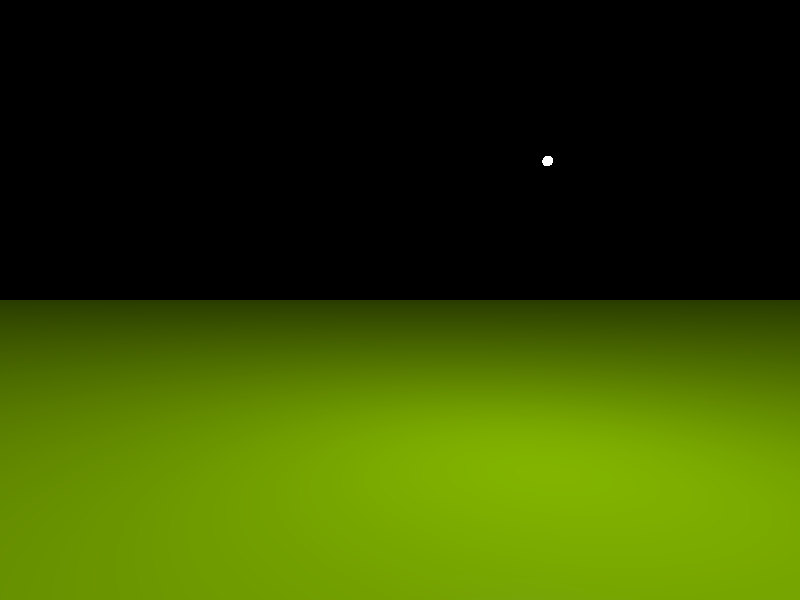{height=360}

# Plane Behavior

-   The plane is an ideal diffuse surface, therefore

    $$
    f_r(x, \Psi \rightarrow \Theta) = \frac{\rho_d}\pi,\quad\text{with $0 \leq \rho_d \leq 1$.}
    $$

-   Given a point $x$ on the plane, the rendering equation implies that

    $$
    L(x \rightarrow \Theta) = \int_{2\pi} \frac{\rho_d}\pi\,L(x \leftarrow \Psi)\,\cos(N_x, \Psi)\,\mathrm{d}\omega_\Psi.
    $$

-   What is the value of $L(x \leftarrow \Psi)$?

# Incoming Radiance

```{.asy im_fmt="html" im_opt="-f html" im_out="img,stdout,stderr" im_fname="single-plane-and-light"}
size(0,100);
import three;
currentlight=Viewport;

draw(O--1.5X, gray); //x-axis
draw(O--1.5Y, gray); //y-axis
draw(O--1.5Z, gray); //z-axis

label("$x$", 1.5X + 0.2Z);
label("$y$", 1.5Y + 0.2Z);
label("$z$", 1.5Z + 0.2X);

path3 xy = ((2, 2, -0.01) -- (-2, 2, -0.01) -- (-2, -2, -0.01) -- (2, -2, -0.01) -- cycle);

draw(surface(xy), green, nolight);
draw(shift(0, 1, 2) * scale3(0.1) * unitsphere, white);
draw((0, 1, 2) -- (0, 0, 0), black, Arrow3);
draw(unithemisphere, gray + opacity(0.7));
```


# Incoming Radiance

-   The value of $L(x \leftarrow \Psi)$ is **zero**, except when $\Psi$ points towards the light source.

-   We divide the integration domain:
    $$
    \int_{2\pi} = \int_{\Omega(d)} + \int_{2\pi - \Omega(d)},
    $$
    where $\Omega(d)$ is the solid angle of the sphere at distance $d$.

-   The second integral, over $2\pi - \Omega(d)$, is zero, because within that solid angle $L(x \leftarrow \Psi) = 0$.

# Incoming Radiance

The integral over the solid angle $\Omega(d)$ is simple if we assume that both $d$ (distance between the source and point $x$) and the angle $\theta$ between $N_x$ and $\Psi$ (the sphere is small) are constant within the domain:
$$
L(x \rightarrow \Theta) = \int_{\Omega(d)} \frac{\rho_d}\pi\,L_d\,\cos(N_x, \Psi)\,\mathrm{d}\omega_\Psi \approx \frac{\rho_d}\pi\,L_d\,\cos\theta \times \pi\left(\frac{r}d\right)^2,
$$
where $\theta$ is the angle between the normal and the direction of the small sphere.

# Properties of the Solution

-   $L(x \rightarrow \Theta) \approx \rho_d\,L_d\,\cos\theta\,\left(\frac{r}d\right)^2.$
-   Even though the point emits isotropically and the surface is ideally diffuse, there is still a dependence on the cosine of $\theta$.
-   The reflected radiance is proportional to the surface area of the sphere ($\propto r^2$).
-   As $d$ increases, the radiance reflected from the plane decreases as $d^{-2}$ (conservation of energy).

# Two Planes

Now suppose we have *two* ideal diffuse planes, one below and one above:

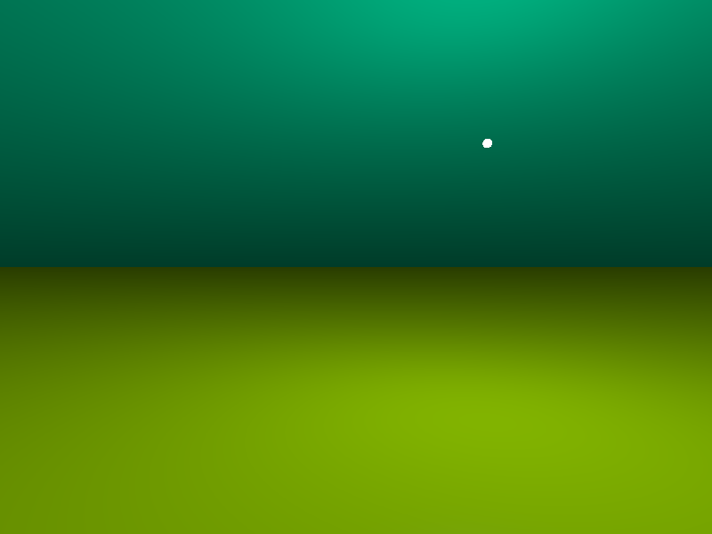{height=360}

How do we handle this case?

# Two Planes

-   Let's consider the bottom plane again.  The following holds:

    $$
    L_\text{down}(x \rightarrow \Theta) = \int_{2\pi} \frac{\rho^\text{down}_d}\pi\,L(x \leftarrow \Psi)\,\cos(N_x, \Psi)\,\mathrm{d}\omega_\Psi.
    $$

-   But now the value of the integral is no longer solely due to the contribution of the luminous sphere, because there is also the upper plane.

-   What is the value of $L_\text{up}(x \leftarrow \Psi)$ produced by the upper plane?

# Two Planes

-   The value of $L(x \leftarrow \Psi)$ for the upper plane is calculated using the same formula as in the previous slide:

    $$
    L_\text{up}(x \rightarrow \Theta) = \int_{2\pi} \frac{\rho^\text{up}_d}\pi\,L(x \leftarrow \Psi)\,\cos(N_x, \Psi)\,\mathrm{d}\omega_\Psi.
    $$

-   But this leads us into a recursive problem!

# The General Problem

-   In the general case, the integral to be calculated is *multiple*:

    $$
    L(x \rightarrow \Theta) = \int_{\Omega^{(1)}_x} \int_{\Omega^{(2)}_x} \int_{\Omega^{(3)}_x} \ldots
    $$

-   It is a multi-dimensional integral (the terms after the first are increasingly less important and tend towards zero, so the dimensions are not *infinite*).

# The General Problem

-   The rendering equation is impossible to solve analytically in the general case.

-   Hence the need to use numerical computation!

-   There are various approaches to solving the rendering equation.

# Types of Solutions

-   There are various ways to solve the rendering equation, and their names are not always used consistently in the literature.

-   The algorithms fall into two main families:

    *Image order*
    : The solution is calculated for a specific observer.

    *Object order*
    : The solution is independent of the observer.

-   In this course, we will only cover *image order* algorithms because they are the easiest to implement.

# Image-order Algorithms {#image-order-algorithms}

---

<center>
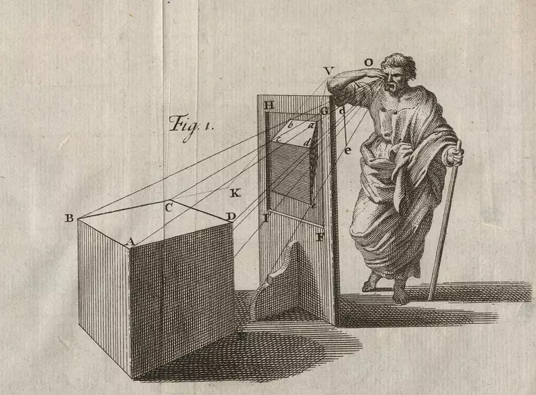
</center>
[[Leon Battista Alberti](https://it.wikipedia.org/wiki/Leon_Battista_Alberti), [*De pictura*](https://it.wikipedia.org/wiki/De_pictura) (1435)]{style="float:right"}

# General Description

-   In an *image order* algorithm, we define the position of an observer of the scene (the gentleman with the stick in Alberti's drawing) and the direction in which they observe.

-   A two-dimensional surface representing the screen is defined.

-   The rendering solution is calculated only for the points $\vec x$ on the surfaces $S$ of the scene that are visible to the observer through the screen.

# Forward Ray-Tracing {#forward-ray-tracing}

-   In Alberti's model, the observer's eye receives the radiation coming from the outside world.

-   An accurate simulation of light propagation should therefore follow these steps:

    #.  Generate radiation from light sources.
    #.  Trace the path of the radiation using geometrical optics.
    #.  Every time a photon reaches the observer's eye, record the direction it came from and its color (SED).

-   This approach is called *forward* ray-tracing: it follows the natural path of light rays.

# Backward Ray-Tracing {#backward-ray-tracing}

-   *Backward* ray-tracing is used in *image oriented* methods.

-   It consists of tracing the path of a light ray backward, starting from the *eye* of the observer and reaching the light source.

-   It is computationally more advantageous than *forward* ray tracing, because most of the light rays emitted from a source *do not* reach the observer.

---

<center>
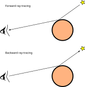
</center>

# *Backward* Ray-Tracing

-   Let's consider the rendering equation in the context of Alberti's image.

-   The *backward* ray-tracing approach allows us to solve the rendering equation only for the parts of surfaces that are visible through the screen.

    <center>
    {height=360px}
    </center>

# Advantages and Disadvantages

-   In this course, we will implement a *backward* ray-tracing algorithm, but this is not always the best choice!

-   *Forward* ray-tracing (combined with the *object order* approach) is useful in animations:

    #.  The rendering equation is solved for all surfaces in the scene.
    #.  $N$ frames of the animation are generated without having to recalculate the solution $N$ times.

    This obviously only applies if nothing in the scene changes, except possibly the observer's position.

-   Widely used *forward* ray tracing algorithms are [radiosity](https://en.wikipedia.org/wiki/Radiosity_(computer_graphics)) and [photon mapping](https://en.wikipedia.org/wiki/Photon_mapping).

# Screen and Observer {#screen-and-observer}

## Screen Discretization

-   Alberti conceived of a screen as a drawable surface; the same idea is found in [some Dürer prints](https://www.metmuseum.org/art/collection/search/366555) (16th century).

-   In computer graphics, we use the same idea, with the caveat that the screen is represented as a discrete matrix of points.

    <center>
    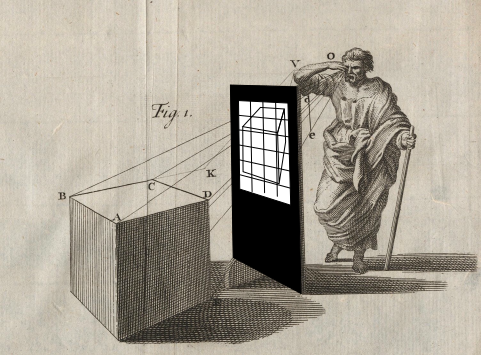{height=360px}
    </center>

---

## Screen Discretization

-   Alberti's observer would see this:

    <center>
    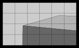
    </center>

-   The squares represent the pixels the screen is divided into. (Very large! The standard resolution of a recent monitor is at least 1920×1080).

## Projecting Light Rays

-   Following the *backward* ray-tracing approach, we project rays through the screen pixels. The algorithm is as follows:

    #.  For each pixel, generate a ray passing through it.
    #.  Each ray will hit a surface in the environment at a point $\vec x$.
    #.  Compute the solution to the rendering equation at $\vec x$, which is the radiance emitted towards the observer (i.e., passing through the screen pixel).
    #.  Use the estimated radiance to calculate the RGB color of the pixel.

-   This is a *general* approach: we haven't yet explained how to solve the rendering equation!

## Ray throug a Pixel {#ray-through-a-pixel}

-   We assume that each ray passes through the center of a pixel:

    <center>
    
    </center>

-   For a 1920×1080 resolution image, we need to create about 2×10⁶ light rays and solve the rendering equation as many times.

## Light Rays

-   How should a light ray be represented in computer memory?

    #.  Origin $O$ (3D point);
    #.  Direction of propagation $\vec d$ (3D vector);
    #.  Minimum distance $t_\text{min}$;
    #.  Maximum distance  $t_\text{max}$;
    #.  Depth $n$.

-   Let's examine each of these properties in detail.

## Origin and Direction

-   You are probably familiar with the canonical equation of a line used in analytic geometry ($ax + by + c = 0$, or $y = mx + q$), but these formulas are valid only in 2D and are not oriented.

-   The path of a light ray is better represented by the equation

    $$
    r(t) = O + t \vec d,
    $$

    where $O$ is the origin point, $\vec d$ is the direction, and $t \in \mathbb{R}$ is a parameter.

    <center>
    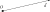{height=120px}
    </center>

## Ray Intersection

-   The parameter $t$ must obviously satisfy $t \geq 0$.

-   Given a light ray intersecting a surface $S$ at point P, we have

    $$
    P = r(t_P) = O + t_P \vec d
    $$

    for some value $t_P > 0$.

    <center>
    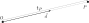{height=180px}
    </center>

## Distance

-   The value of $t_P$ is conceptually similar to time, but it's a dimensionless quantity.

-   It represents the distance between the origin $O$ and the point $P$, in units of the length of the vector $\vec d$.

    <center>
    {height=180px}
    </center>

## Minimum Distance

-   From a programming perspective, it's useful to set limits on the distance $t$: for example, we are obviously only interested in intersections with $t > 0$.

-   In some cases, it also makes sense to impose $t > t_\text{pixel}$, meaning that the ray has at least passed through the screen.

    <center>
    {height=320px}
    </center>

## Maximum Distance

-   Similarly, it makes sense to set a maximum distance $t_\text{max}$.

-   This distance is used for objects so far from the observer that their contribution to the scene is considered negligible.

-   If we are not interested in setting a maximum limit on the distance of the represented objects, we can set $t_\text{max} = +\infty$.

    (The IEEE standard for representing floating-point numbers defines the values `+Inf`, `-Inf`, and `Inf`, which are very useful for this purpose).

## Depth

-   The last parameter associated with a ray is the *depth* $n$, an integer incremented each time a ray is created from a reflection:

    <center>
    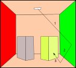{height=380px}
    </center>

-   Ray tracers usually set a limit on the maximum depth.

# Projections {#projections}

## Ray Generation

-   Having defined the screen and how to represent a light ray, the problem remains of *how* to generate the rays that pass through the screen.

-   There are many ways to produce these rays, each leading to a different representation.

-   We will focus on two types of projections:

    #.  Orthographic projection;

    #.  Perspective projection.

---

<center>
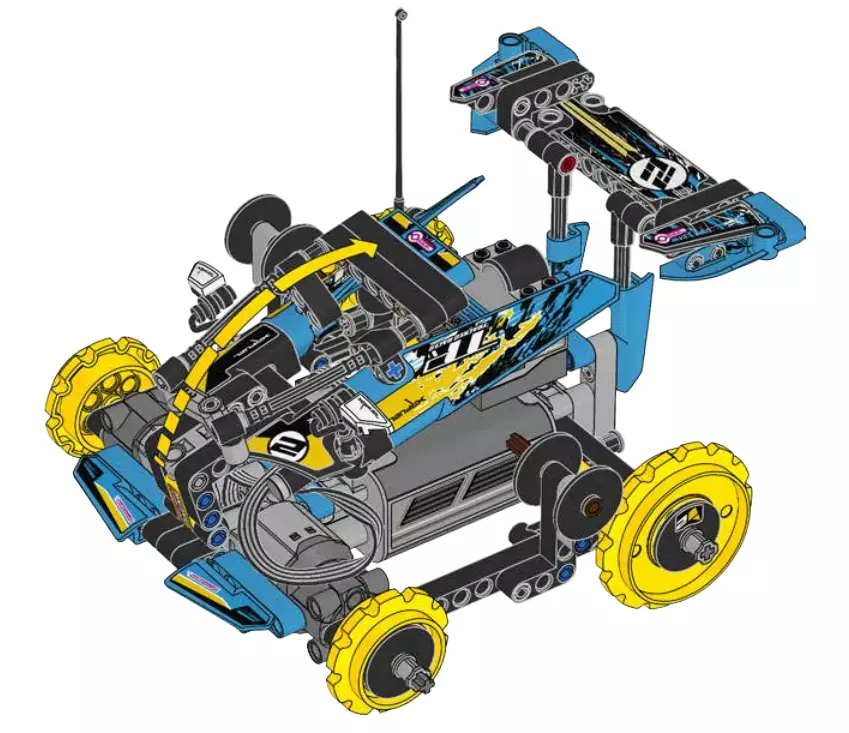{height=600px}
</center>
[LEGO Instruction Manual (orthogonal projection)]{style="float:right"}

---

<center>
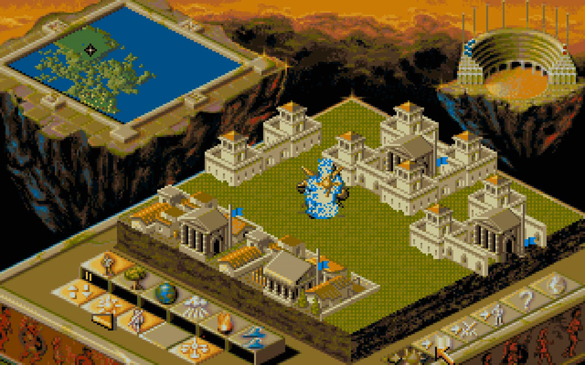{height=600px}
</center>
[*Populous 2* (orthogonal projection)]{style="float:right"}

---

<center>
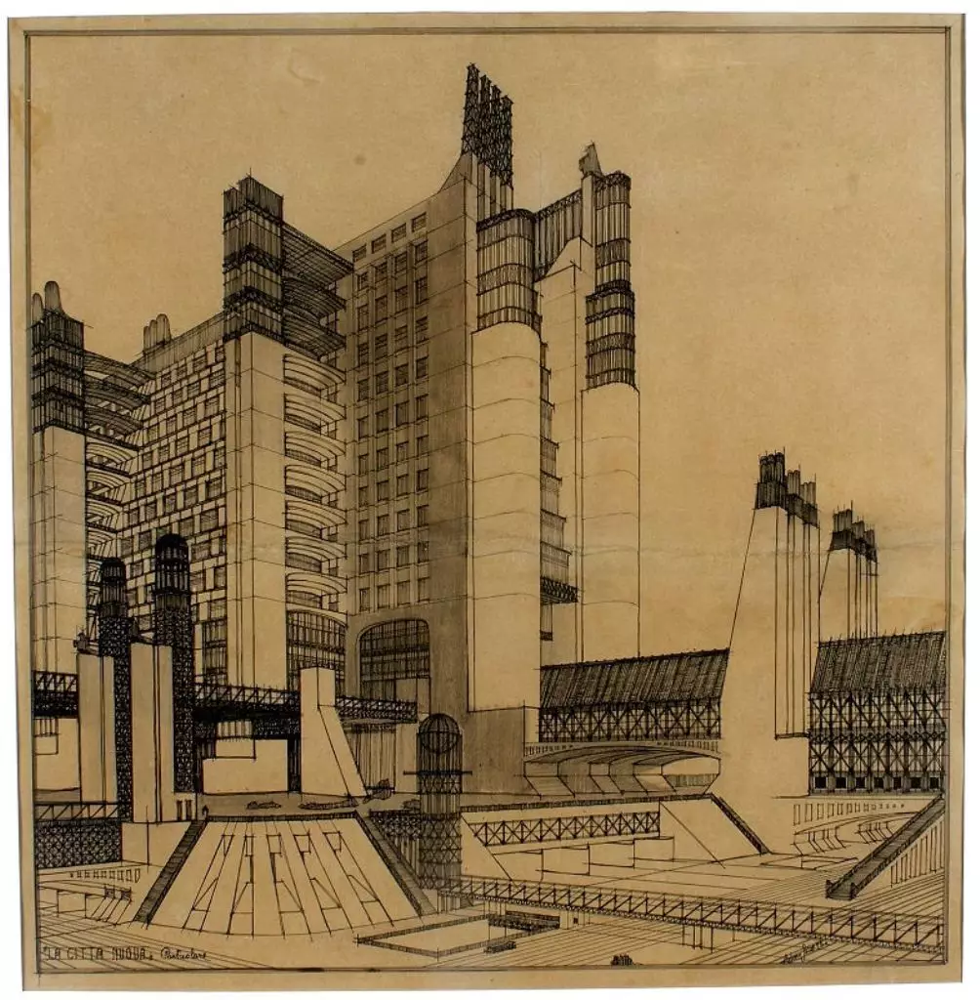{height=600px}
</center>
[*La città nuova*, [Antonio Sant'Elia](https://it.wikipedia.org/wiki/Antonio_Sant%27Elia) (1914, perspective projection)]{style="float:right"}

# Differen

<center>
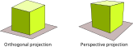
</center>

-   Orthogonal projection preserves parallelism and lengths: congruent and parallel segments in 3D space remain congruent and parallel in the drawing.

-   Perspective projection makes distant objects smaller: it is more realistic.

# Projections

<center>
{height=480px}
</center>

# Observer

-   To implement a projection, it is necessary to define the position of the observer and the direction in which they are looking.

-   A widely used approach is to use these quantities:

    1.  Observer position $P$ (3D point);
    2.  View direction $\vec d$ (3D vector);
    3.  "Up" vector $\vec u$ (3D vector);
    4.  "Right" vector $\vec r$ (3D vector).

# Observer

```{.asy im_fmt="html" im_opt="-f html" im_out="img,stdout,stderr" im_fname="standard-observer"}
size(0,100);
import three;
currentlight=Viewport;

draw(O--2X, gray); //x-axis
draw(O--Y, gray); //y-axis
draw(O--Z, gray); //z-axis

label("$x$", 2X + 0.2Z);
label("$y$", Y + 0.2Z);
label("$z$", Z + 0.2X);

path3 xy = ((1, -1, -0.5) -- (1, -1, 0.5) -- (1, 1, 0.5) -- (1, 1, -0.5) -- cycle);

draw(surface(xy), gray + opacity(0.7));
draw((0, 0, 0) -- (1, 0, 0), RGB(110, 110, 215), Arrow3);
draw((1, 0, 0) -- (1, -1, 0), RGB(215, 110, 110), Arrow3);
draw((1, 0, 0) -- (1, 0, 0.5), RGB(110, 215, 110), Arrow3);

draw(scale3(0.02) * unitsphere, black);

label("$P$", (0, 0.2, 0.2));
label("$\vec d$", (0.5, 0.2, 0.2));
label("$\vec r$", (1.0, -1.2, 0));
label("$\vec u$", (1.0, 0, 0.7));
```

# Aspect Ratio {#aspect-ratio}

# Aspect Ratio

-   In the representation of the vectors that identify the observer, $\vec r$ and $\vec u$ had different lengths.

-   This is due to the fact that computer screens are not square.

-   The ratio between width and height is called *aspect ratio*; if referring to a screen, it is called *display aspect ratio*.

# CRT Monitors

-   Old CRT monitors and televisions had an *aspect ratio* of 4:3 (and also non-square pixels, but fortunately this is no longer true today...).

-   Modern monitors have an *aspect ratio* of 16:9 (more often) or 16:10.

-   The trend of manufacturers seems to be to abandon 16:9/16:10 and adopt 3:2 (e.g., Microsoft Surface).

-   Ray-tracing programs should define $\vec r$ so that

    $$
    \left\|\vec r\right\| = R_\text{display}\,\left\|\vec u\right\|,
    $$

    where $R_\text{display} = N_\text{columns} / N_\text{rows}$ is the *aspect ratio* of the screen.

---
title: "Lezione 7"
subtitle: "Calcolo numerico per la generazione di immagini fotorealistiche"
author: "Maurizio Tomasi <maurizio.tomasi@unimi.it>"
...
