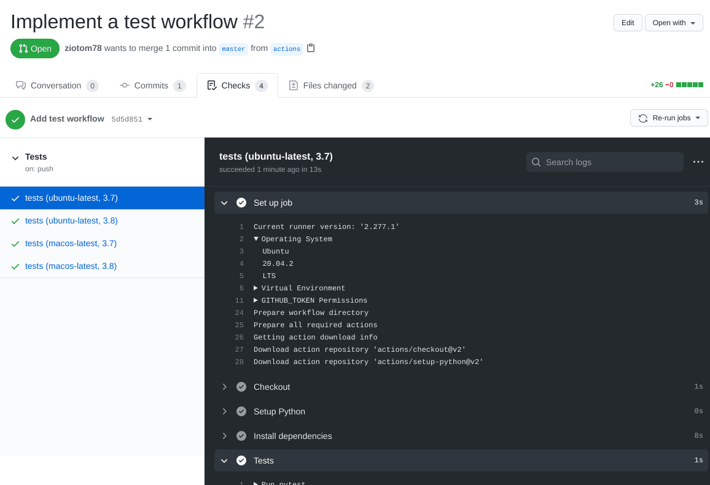
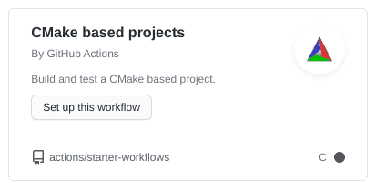

# Code to implement

# New types

-   Today we will implement three very simple types:

    1.  The `Ray` type represents a ray of light;
    2.  The `Camera` type represents the observer/camera;
    3.  The `ImageTracer` type sends rays from the observer to the screen.

-   The `Ray` type must be very efficient, so it is better if it is a *value type* like `Color`, `Vec`, etc. (see [lesson 02b](./tomasi-ray-tracing-02b.html#memory-usage)).

-   The `Camera` and `ImageTracer` types are not critical, and do not need to be particularly optimized.

-   As usual, you can refer to the [pytracer](https://github.com/ziotom78/pytracer) repository for a Python implementation (but do not implement the tests in the way used there!).

# The `Ray` class

-   It must contain the following fields:

    1.  `origin`: object of type `Point` (origin of the ray);
    2.  `dir`: object of type `Vec` (direction of the ray);
    3.  `tmin`: floating-point number (minimum distance);
    4.  `tmax`: floating-point number (maximum distance);
    5.  `depth`: integer.

-   You can make the last three fields have default values of `tmin = 1e-5`, `tmax = +∞`, `depth = 0`.

-   Define an `at` method that calculates a point along the ray for a given $t$, and an `is_close` method that checks if two rays have similar `origin` and `dir`.

# Implementation of `Ray`

```python
from math import inf

@dataclass
class Ray:
    origin: Point = Point()
    dir: Vec = Vec()
    tmin: float = 1e-5
    tmax: float = inf
    depth: int = 0

    def is_close(self, other: Ray, epsilon=1e-5) -> bool:
        return (self.origin.is_close(other.origin, epsilon=epsilon) and
                self.dir.is_close(other.dir, epsilon=epsilon))

    def at(self, t: float) -> Point:
        return self.origin + self.dir * t
```

# Tests for `Ray`

```python
class TestRays(unittest.TestCase):
    def test_is_close(self):
        ray1 = Ray(origin=Point(1.0, 2.0, 3.0), dir=Vec(5.0, 4.0, -1.0))
        ray2 = Ray(origin=Point(1.0, 2.0, 3.0), dir=Vec(5.0, 4.0, -1.0))
        ray3 = Ray(origin=Point(5.0, 1.0, 4.0), dir=Vec(3.0, 9.0, 4.0))

        assert ray1.is_close(ray2)
        assert not ray1.is_close(ray3)

    def test_at(self):
        ray = Ray(origin=Point(1.0, 2.0, 4.0), dir=Vec(4.0, 2.0, 1.0))
        assert ray.at(0.0).is_close(ray.origin)
        assert ray.at(1.0).is_close(Point(5.0, 4.0, 5.0))
        assert ray.at(2.0).is_close(Point(9.0, 6.0, 6.0))
```

# The Observer

-   We want to implement two kinds of projections in our code:

    1.  Orthogonal projection
    2.  Perspective projection

-   This is a good opportunity to implement *polymorphism*, that is, the ability to have a single function name correspond to different implementations depending on the type of the object.

# Example

-   The simplest (but perhaps unexpected!) example of polymorphism is overloading:

    ```c++
    void print(int i) { std::cout << "Integer: " << i << "\n"; }
    void print(float f) { std::cout << "Float: " << f << "\n"; }

    int main() {
        print(1);    // "Integer: 1"
        print(1.0f); // "Float: 1"
    }
    ```

-   The function `print` takes two *forms* depending on whether the argument is an integer or a floating-point number.

-   The decision of which call to use is made by the compiler at compile time.

# Projections and Polymorphism

-   We could then use overloading to implement the two projections (orthogonal and perspective):

    ```c++
    struct OrthogonalCamera { /* ... */ };
    struct PerspectiveCamera { /* ... */ };

    void fire_ray(const OrthogonalCamera & cam, ...);
    void fire_ray(const PerspectiveCamera & cam, ...);

    int main() {
        std::string kind_of_camera = input_camera();
        // ?
    }
    ```

-   But what type do we establish for the variable `cam`? `OrthogonalCamera` or `PerspectiveCamera`?

# Dynamic Polymorphism (1/2)

OOP allows us to avoid this mess by introducing a **third** type in addition to `OrthogonalCamera` or `PerspectiveCamera`, as shown in this C++ code:

```c++
struct Camera { virtual void fire_ray(...) = 0; };
struct OrthogonalCamera : public Camera { void fire_ray(...) override; };
struct PerspectiveCamera : public Camera { void fire_ray(...) override; };

int main() {
    std::string kind_of_camera = input_camera();
    Camera * camera = (kind_of_camera == "orthogonal") ?
        new OrthogonalCamera() : new PerspectiveCamera();
    // ...
}
```

# Dynamic Polymorphism (2/2)

But OOP is not the only way to achieve dynamic polymorphism, because you can also use *procedural polymorphism*. Here is an example in C++:

```c++
using FireRayProc = void(Type1 arg1, Type2 arg2);

void fire_ray_orthogonal(Type1 arg1, Type2 arg2);
void fire_ray_perspective(Type1 arg1, Type2 arg2);

void fire_all_rays(FireRayProc fire_ray) {
    // Use `fire_ray(arg1, arg2)` whenever appropriate
}

int main() {
    std::string kind_of_camera = input_camera();
    FireRayProc * proc = (kind_of_camera == "orthogonal") ?
        &fire_ray_orthogonal : &fire_ray_perspective;

    // Dynamic polymorphic call!
    fire_all_rays(proc);
}
```

# Types of polymorphism

-   In summary, there are two types of polymorphism:

    1.  Static polymorphism (i.e., at compile time): this is the case of *overloading*.

    2.  Dynamic polymorphism: this is the case of class hierarchies.

-   We will need dynamic polymorphism, which you can implement either using OOP constructs (suitable for languages like Java and Kotlin) or using procedural programming.


# Interfaces and *traits*

-   A very common case is when the base class is just a *workaround* to have a base type, but all methods are pure virtual (abstract).

-   Some modern languages offer lighter mechanisms called *interfaces* (Go, C#) or *traits* (Rust). An *interface* is the analogue of a class where all methods are empty; here is an example in Go:

    ```go
    type camera interface { fire_ray(...) void }
    type orthogonal_camera struct { /* ... */ }
    type perspective_camera struct { /* ... */ }

    func (cam orthogonal_camera) fire_ray(...) void { /* ... */ }
    func (cam perspective_camera) fire_ray(...) void { /* ... */ }
    ```

# The `*Camera` classes

-   If you want to use an OOP approach, `Camera` will be the type from which the new types `OrthogonalCamera` and `PerspectiveCamera` are derived.

-   The idea is precisely to implement the type hierarchy we have seen:

    <center>
    ```{.graphviz im_fmt="svg" im_out="img" im_fname="camera-hierarchy"}
    graph "" {
        camera [label="Camera" shape=box];
        ortho [label="OrthogonalCamera" shape=box];
        persp [label="PerspectiveCamera" shape=box];
        camera -- ortho;
        camera -- persp;
    }
    ```
    </center>

-   Use whatever your language allows to implement polymorphism: class hierarchy in C#/D/Java/Kotlin, [*traits*](https://doc.rust-lang.org/book/ch10-02-traits.html) in Rust, etc.

---

```{.asy im_fmt="html" im_opt="-f html" im_out="img,stdout,stderr" im_fname="camera-reference-frame"}
size(0,100);
import three;
currentlight=Viewport;

draw(-1.5X--1.5X, black); //x-axis
draw(O--1.5Y, black); //y-axis
draw(O--Z, black); //z-axis

label("$x$", 1.3X + 0.2Z);
label("$y$", 1.3Y + 0.2Z);
label("$z$", 0.9Z + 0.2X);

path3 xy = ((0, -1, -0.5) -- (0, -1, 0.5) -- (0, 1, 0.5) -- (0, 1, -0.5) -- cycle);

draw(surface(xy), gray + opacity(0.7));
draw((-1, 0, 0) -- (0, 0, 0), RGB(110, 110, 215), Arrow3);
draw((0, 0, 0) -- (0, -1, 0), RGB(215, 110, 110), Arrow3);
draw((0, 0, 0) -- (0, 0, 0.5), RGB(110, 215, 110), Arrow3);

draw(shift(-1, 0, 0) * scale3(0.02) * unitsphere, black);

label("$P$", (-1, 0.0, 0.2));
label("$\vec d$", (-0.5, 0.0, 0.2));
label("$\vec r$", (0.0, -1.2, 0));
label("$\vec u$", (0.1, 0, 0.6));
```

$$
P = (-d, 0, 0),\ \vec d = (d, 0, 0),\ \vec u = (0, 0, 1), \vec r = (0, -a, 0).
$$

# Orienting `Camera`

-   The only adjustable parameters of `Camera` are `d` (screen-observer distance) and `a` (image *aspect ratio*).

-   The reference system of the previous slide is rigid: it is therefore very easy to implement because there is no need to store the vectors $\vec d$, $\vec u$ and $\vec v$.

-   To orient a `Camera`, we can use the `Transformation` type that we implemented last week.

-   It must be possible to invoke a `fire_ray` method on objects of type `*Camera` that accepts a coordinate $(u, v)$ as input and returns a `Ray` object.


# Transformations

-   If we associate a transformation $T$ to the observer, we could apply it to the points/vectors that define the observer, namely $P$, $\vec d$, $\vec u$ and $\vec r$, and move/orient the observer.

-   But this makes it complicated to calculate the directions of the rays that pass through the screen in the `fire_ray` function!

-   It is better to create the rays in the original reference system, and **then** apply the transformation to the ray: it is simpler and requires fewer calculations.

-   Therefore, we need to implement the `Transformation * Ray` operator, which will apply the transformation $T$ to both $O$ (origin) and $\vec d$ (ray direction).

# Transforming `Ray`

-   This is the application of a transformation to a ray; you could alternatively redefine the `*` operator in the `Transform * Ray` case:

    ```python
    class Ray:
        …

        def transform(self, transformation: Transformation):
            return Ray(origin=transformation * self.origin,
                       dir=transformation * self.dir,
                       tmin=self.tmin,
                       tmax=self.tmax,
                       depth=self.depth)
    ```

-   It is not necessary to transform `tmin` and `tmax`.


# Test for `transform`

```python
def test_transform():
    ray = Ray(origin=Point(1.0, 2.0, 3.0), dir=Vec(6.0, 5.0, 4.0))
    transformation = translation(Vec(10.0, 11.0, 12.0)) * rotation_x(90.0)
    transformed = ray.transform(transformation)

    assert transformed.origin.is_close(Point(11.0, 8.0, 14.0))
    assert transformed.dir.is_close(Vec(6.0, -4.0, 5.0))
```

# Types of Projections

<center>
{height=480px}
</center>

# Screen Coordinates

-   To avoid confusion between spatial coordinates $(x, y, z)$ and 2D screen coordinates, we will use the letters $(u, v)$ to indicate screen points:

    <center>
    
    </center>

    For example, a ray fired towards $(u, v) = (0, 1)$ must pass through the point $P + \vec d - \vec r + \vec u$.

# `OrthogonalCamera`

-   To construct it, you need the `aspect_ratio` parameter (a floating point number, or a rational like `16//9` in Julia) and `transformation`.

-   This is a possible implementation in Python:

    ```python
    class OrthogonalCamera(Camera):
        def __init__(self, aspect_ratio=1.0, transformation=Transformation()):
            self.aspect_ratio = aspect_ratio
            self.transformation = transformation

        def fire_ray(self, u: float, v: float):
            origin = Point(-1.0, (1.0 - 2 * u) * self.aspect_ratio, 2 * v - 1)
            direction = VEC_X
            return Ray(origin=origin, dir=direction, tmin=1.0e-5).transform(self.transformation)
    ```

# Tests for the Observer

-   It is important to verify that the four corners of the image are projected correctly.  We also choose an *aspect ratio* different from 1.

-   For `OrthogonalCamera` we verify that the rays are parallel to each other: we do this by calculating their dot product and verifying that it coincides with the null vector.

-   (For `PerspectiveCamera` we will instead verify that all rays have the same origin).

# Tests for `OrthogonalCamera`

```python
def test_orthogonal_camera(self):
    cam = OrthogonalCamera(aspect_ratio=2.0)

    ray1 = cam.fire_ray(0.0, 0.0)
    ray2 = cam.fire_ray(1.0, 0.0)
    ray3 = cam.fire_ray(0.0, 1.0)
    ray4 = cam.fire_ray(1.0, 1.0)

    # Verify that the rays are parallel by verifying that cross-products vanish
    assert are_close(0.0, ray1.dir.cross(ray2.dir).squared_norm())
    assert are_close(0.0, ray1.dir.cross(ray3.dir).squared_norm())
    assert are_close(0.0, ray1.dir.cross(ray4.dir).squared_norm())

    # Verify that the ray hitting the corners have the right coordinates
    assert ray1.at(1.0).is_close(Point(0.0, 2.0, -1.0))
    assert ray2.at(1.0).is_close(Point(0.0, -2.0, -1.0))
    assert ray3.at(1.0).is_close(Point(0.0, 2.0, 1.0))
    assert ray4.at(1.0).is_close(Point(0.0, -2.0, 1.0))
```

# Tests for the observer

-   Let’s verify the correctness of transformations when applied to cameras:

    ```python
    def test_orthogonal_camera_transform():
        cam = OrthogonalCamera(transformation=translation(-VEC_Y * 2.0) * rotation_z(angle_deg=90))

        ray = cam.fire_ray(0.5, 0.5)
        assert ray.at(1.0).is_close(Point(0.0, -2.0, 0.0))
    ```

-   Things are similar for `PerspectiveCamera`.


# `PerspectiveCamera`

-   Apart from the *aspect ratio* and the transformation, perspective projections require the distance $d$ between the screen and the observer.

-   This is a possible implementation in Python:

    ```python
    class PerspectiveCamera(Camera):
        def __init__(self, distance=1.0, aspect_ratio=1.0, transformation=Transformation()):
            self.distance = distance
            self.aspect_ratio = aspect_ratio
            self.transformation = transformation

        def fire_ray(self, u: float, v: float):
            origin = Point(-self.distance, 0.0, 0.0)
            direction = Vec(self.distance, (1.0 - 2 * u) * self.aspect_ratio, 2 * v - 1)
            return Ray(origin=origin, dir=direction, tmin=1.0e-5).transform(self.transformation)
    ```


# Tests for `PerspectiveCamera`

```python
def test_perspective_camera(self):
    cam = PerspectiveCamera(screen_distance=1.0, aspect_ratio=2.0)

    ray1 = cam.fire_ray(0.0, 0.0)
    ray2 = cam.fire_ray(1.0, 0.0)
    ray3 = cam.fire_ray(0.0, 1.0)
    ray4 = cam.fire_ray(1.0, 1.0)

    # Verify that all the rays depart from the same point
    assert ray1.origin.is_close(ray2.origin)
    assert ray1.origin.is_close(ray3.origin)
    assert ray1.origin.is_close(ray4.origin)

    # Verify that the ray hitting the corners have the right coordinates
    assert ray1.at(1.0).is_close(Point(0.0, 2.0, -1.0))
    assert ray2.at(1.0).is_close(Point(0.0, -2.0, -1.0))
    assert ray3.at(1.0).is_close(Point(0.0, 2.0, 1.0))
    assert ray4.at(1.0).is_close(Point(0.0, -2.0, 1.0))
```


# `ImageTracer`

-   We are now missing the last piece: a functionality that links the `HdrImage` type to one of the types derived from `Camera`.

-   The new `ImageTracer` type will be responsible for sending rays to the corresponding pixels in an image, converting between the pixel index `(column, row)` used by `HdrImage` and the `(u, v)` values used by `Camera`.

-   For convenience, we define two functions associated with `ImageTracer`:

    1.  A `fire_ray` function that sends a ray towards a specified pixel;
    2.  A `fire_all_rays` function that iterates over all the pixels of the image calling `fire_ray`.

# `fire_ray`

-   The `fire_ray` function must send a ray towards a pixel in the image.

-   Apart from converting the coordinates from the `(u, v)` space to the pixel space, there is the problem of the pixel's *surface*.

-   A pixel is not in fact a point, because it has a certain area: at which point inside the pixel should the ray pass?

-   For the moment we will make the ray pass through the center of the pixel, but let's make it possible to specify a *relative* position through two coordinates `(u_pixel, v_pixel)`, similar to the `(u, v)` coordinates but referring to the pixel surface instead of the image.

# `fire_all_rays`

-   Once a ray has been "cast" towards a pixel, the `fire_all_rays` function should calculate the solution to the rendering equation.

-   We will implement multiple solution methods, some accurate but slow and others coarse but very fast: therefore polymorphism can be used here as well.

-   For the moment I recommend you use a procedural approach: `fire_all_rays` accepts as an argument a **function** that is invoked for each pixel/ray of the image and returns a `Color` object.


# `ImageTracer` in Python

```python
class ImageTracer:
    def __init__(self, image: HdrImage, camera: Camera):
        self.image = image
        self.camera = camera

    def fire_ray(self, col: int, row: int, u_pixel=0.5, v_pixel=0.5):
        # There is an error in this formula, but implement it as is anyway!
        u = (col + u_pixel) / (self.image.width - 1)
        v = (row + v_pixel) / (self.image.height - 1)
        return self.camera.fire_ray(u, v)

    def fire_all_rays(self, func):
        for row in range(self.image.height):
            for col in range(self.image.width):
                ray = self.fire_ray(col, row)
                color = func(ray)
                self.image.set_pixel(col, row, color)
```

# Tests for `ImageTracer`

```python
def test_image_tracer(self):
    image = HdrImage(width=4, height=2)
    camera = PerspectiveCamera(aspect_ratio=2)
    tracer = ImageTracer(image=image, camera=camera)

    ray1 = tracer.fire_ray(0, 0, u_pixel=2.5, v_pixel=1.5)
    ray2 = tracer.fire_ray(2, 1, u_pixel=0.5, v_pixel=0.5)
    assert ray1.is_close(ray2)

    tracer.fire_all_rays(lambda ray: Color(1.0, 2.0, 3.0))
    for row in range(image.height):
        for col in range(image.width):
            assert image.get_pixel(col, row) == Color(1.0, 2.0, 3.0)
```

# CI builds {#ci-builds}

# CI builds

-   When managing *pull requests*, it is necessary to be sure that the change does not worsen the code.

-   A basic requirement is that all tests continue to pass once the *pull request* is merged.

-   GitHub allows you to automatically verify this requirement, using *Continuous Integration builds* (which GitHub calls *GitHub actions*).

# Continuous Integration (CI)

-   It is a term that indicates a working method in which improvements and code changes are incorporated as soon as possible into the `master` branch.

-   Before they can be incorporated, it is necessary to be certain of their quality!

-   A CI build consists of creating a virtual machine on which a «clean» operating system is installed and on which the code is installed, compiled, and the tests are run.

-   At the end of the test execution, the virtual machine is deleted; if the CI build is run again, it starts over.

# Advantages of CI builds

-   They install the code on a virtual machine: it's harder to mess things up.

-   The virtual machine is always created from scratch: it's easier to discover the code's dependencies. (Example: which version of the C++ compiler was installed? Was the `libgd` library installed?)

-   You can create multiple virtual machines with different operating systems (Linux, Windows, Mac OS X…): the code is verified on each of them.

-   CI builds can be run automatically by GitHub every time a pull request is opened, every time a commit is made, etc.

# CI builds in GitHub

-   A CI build can be created and executed in GitHub using [GitHub Actions](https://docs.github.com/en/actions), a service that includes several possibilities that go beyond simple CI builds.

-   To activate a CI build, it is sufficient to create a hidden directory `.github/workflows` in your repository, containing a text file in [YAML](https://en.wikipedia.org/wiki/YAML) format, which contains this information:

    #.   When to execute the action (on every pull request? on every commit?)
    #.   Which operating system to use (Linux? Windows? which version?)
    #.   Which additional packages to install (C++ compiler? Python?)
    #.   How to compile the code and run the tests?

# The «Marketplace»

-   GitHub Actions has a «marketplace» that allows you to automatically configure a CI build with a few mouse clicks, depending on the language you use.

-   Pre-configured actions are available for many languages and development environments.

-   It's not a problem if you don't find an action that suits your needs: it's quite simple to create new custom actions, once you understand how to describe them.

---

<center>
{height=720px}
</center>

---

<center>
{height=720px}
</center>


# What can be done in a CI build?

-   You can run *linters* like [PyFlakes](https://pypi.org/project/pyflakes/) for Python or [CSA](https://clang-analyzer.llvm.org/) for C++.

-   If you use an automatic formatting tool (like [black](https://github.com/psf/black) for Python or [clang-format](https://clang.llvm.org/docs/ClangFormat.html) for C++), you can verify that the code is formatted correctly.

-   You can use sites like [ReadTheDocs](https://about.readthedocs.com/?ref=readthedocs.org) to publish the user manual with [Sphinx](https://www.sphinx-doc.org/), [MkDocs](https://www.mkdocs.org/) or [Jupyter Book](https://jupyterbook.org/en/stable/intro.html), ensuring that updated *docstrings* are included.

-   You can generate ready-to-download executables: this way the user is not obliged to install a C++/Nim/Rust/… compiler.

-   **The only requirement for this course is that you run the tests!**


# What to do today

# What to do today

-   Create a *branch* for today's work, which you will call `cameras`.

-   Implement these types:

    1.  `Ray`;
    2.  `Camera`, `OrthogonalCamera`, and `PerspectiveCamera`;
    3.  `ImageTracer`.

-   Implement all the tests. When you have finished the implementation and the tests pass successfully, close the PR.

-   Add a *workflow* to your GitHub repository that (1) downloads the code, (2) compiles it, and (3) runs the tests.

# Hints for C++

# GitHub Actions

- Once you have saved the code in a GitHub repository, set up a new "Action" (see the following video).

- The template is "CMake based projects" (ignore the fact that it seems to only support the C language):

    <center>
    
    </center>

---

<iframe src="https://player.vimeo.com/video/520878087?badge=0&amp;autopause=0&amp;player_id=0&amp;app_id=58479" width="1280" height="720" frameborder="0" allow="autoplay; fullscreen; picture-in-picture" allowfullscreen title="Setting up GitHub Actions for CMake-based projects"></iframe>

# Hints for C\#

# GitHub Actions

-   Add an Action to the GitHub repository, once you have committed and executed `git push`.

-   The template is «.NET» (avoid the «.NET desktop» template, we need the one for programs that work from the command line):

    <center>
    
    </center>

# Hints for Java/Kotlin

# GitHub Actions

-   Whether you use Java or Kotlin, select «Java with Gradle»:

    <center>
    
    </center>

    If you use Kotlin, Gradle will automatically download what is needed to support it.

-   The process will try to compile the code and run *all* the tests in the repository

# Troubleshooting

-   Remember to add the files in `gradle/wrapper/` to the commit

-   If you have problems in Kotlin due to the Gradle version, regenerate `gradlew` from the command line like this:

    ```sh
    gradle wrapper --gradle-version 8.4
    ```

    (Keep in mind that Gradle supports Kotlin only starting from version 5.3).

# Hints for Julia

# GitHub Actions

-   The repository for standard Julia Actions is [Julia Actions](https://github.com/julia-actions).
-   The most useful actions are:
    #.   `julia-actions/setup-julia@v2` to set up the Julia compiler;
    #.   `julia-actions/julia-buildpkg@v1` to build the package;
    #.   `julia-actions/julia-runtest@v1` to run the tests.

# Hints for D/Nim/Rust

# GitHub Actions

-   For D, you can use [setup-dlang](https://github.com/dlang-community/setup-dlang)

-   For Nim, there is [Setup Nim Environment](https://github.com/marketplace/actions/setup-nim-environment)


---
title: "Laboratory 6"
subtitle: "Calcolo numerico per la generazione di immagini fotorealistiche"
author: "Maurizio Tomasi <maurizio.tomasi@unimi.it>"
...
