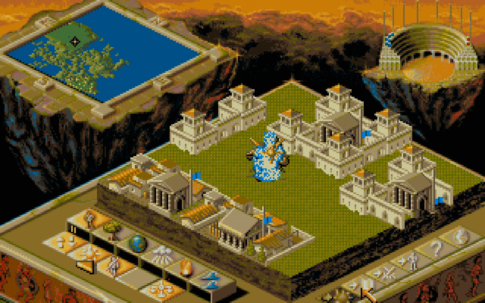
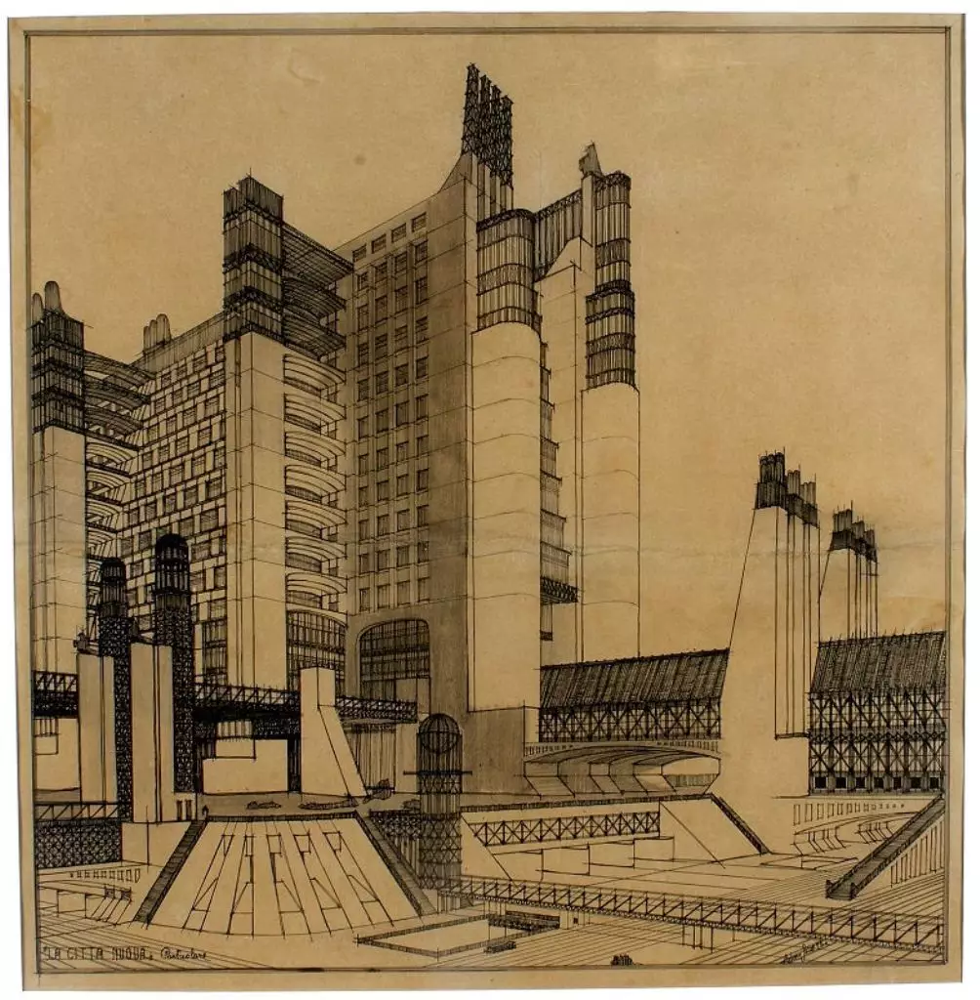

<center>

</center>
[[Leon Battista Alberti](https://it.wikipedia.org/wiki/Leon_Battista_Alberti), [*De pictura*](https://it.wikipedia.org/wiki/De_pictura) (1435)]{style="float:right"}

# Descrizione generale

-   In un algoritmo *image order* si definisce la posizione di un osservatore della scena (il signore col bastone nel disegno di Alberti) e la direzione in cui osserva.

-   Si definisce una superficie bidimensionale che rappresenta lo schermo.

-   Si calcola la soluzione del rendering per i soli punti $\vec x$ sulle superfici $S$ della scena che sono visibili dall'osservatore attraverso lo schermo.

# *Forward* ray-tracing

-   Nel modello di Alberti, l'occhio dell'osservatore riceve la radiazione proveniente dal mondo esterno.

-   Una simulazione accurata della propagazione della luce dovrebbe quindi seguire queste fasi:

    #.  Generare radiazione dalle sorgenti luminose.
    #.  Tracciare il percorso della radiazione usando l'ottica geometrica.
    #.  Ogni volta che un fotone raggiunge l'occhio dell'osservatore, registrare da che direzione proveniva e quale colore (SED) possedeva.

-   Questo approccio è chiamato *foward ray-tracing*: si segue il naturale cammino dei raggi luminosi.

# *Backward* ray-tracing

-   Il *backward* ray-tracing viene usato nei metodi *image oriented*.

-   Esso consiste nel percorrere a ritroso il cammino di un raggio di luce, partendo dall'*occhio* dell'osservatore e raggiungendo la sorgente luminosa.

-   È computazionalmente più vantaggioso del *forward* ray tracing, perché gran parte dei raggi luminosi emessi da una sorgente *non* raggiunge l'osservatore.

---

<center>

</center>

# *Backward* ray-tracing

-   Consideriamo l'equazione del rendering nel contesto dell'immagine di Alberti.

-   L'approccio del *backward* ray-tracing ci consente di risolvere l'equazione del rendering per le sole parti di superfici che sono visibili attraverso lo schermo.

    <center>
    {height=360px}
    </center>

# Vantaggi e svantaggi

-   In questo corso implementeremo algoritmo di *backward* ray-tracing, ma questa non è sempre la scelta migliore!

-   Il *forward* ray-tracing (combinato con l'approccio *object order*) è utile nelle animazioni:

    #.  Si risolve l'equazione del rendering per tutte le superfici della scena.
    #.  Si generano $N$ fotogrammi dell'animazione senza dover ricalcolare la soluzione $N$ volte.
    
    Questo vale ovviamente solo nel caso in cui nulla nella scena cambi, tranne eventualmente la posizione dell'osservatore.

-   Algoritmi molto usati di *forward* ray tracing sono [radiosity](https://en.wikipedia.org/wiki/Radiosity_(computer_graphics)) e [photon mapping](https://en.wikipedia.org/wiki/Photon_mapping).


# Schermo e osservatore

# Discretizzazione dello schermo

-   Alberti considerava uno schermo come una superficie disegnabile; la stessa idea si ritrova in [alcune stampe di Dürer](https://www.metmuseum.org/art/collection/search/366555) (XVI secolo).

-   Nella *computer graphics* si usa la stessa idea, con l'accortezza però di rappresentare lo schermo come una matrice discreta di punti.

    <center>
    {height=360px}
    </center>

---

# Discretizzazione dello schermo

-   L'osservatore di Alberti vedrebbe questo:

    <center>
    
    </center>

-   I quadrati rappresentano i pixel in cui è suddiviso lo schermo. (Molto grossi! La risoluzione standard di un monitor recente è almeno 1920×1080).

# Proiettare raggi luminosi

-   Se seguiamo l'approccio del *backward* ray-tracing, dobbiamo proiettare raggi attraverso i pixel dello schermo. Questo sarà l'algoritmo:

    #.  Per ogni pixel generiamo un raggio che passi dal pixel.
    #.  Ciascun raggio colpirà una superficie dell'ambiente in un punto $\vec x$.
    #.  Calcoliamo la soluzione dell'equazione del rendering in $\vec x$, che è la radianza emessa in direzione dell'osservatore (ossia, passante attraverso il pixel dello schermo).
    #.  Usiamo la radianza stimata per calcolare il colore RGB del pixel.

-   Questo è un approccio *generale*: non abbiamo ancora spiegato come risolvere l'equazione del rendering!

# Raggi per pixel

-   Assumiamo che ogni raggio passi per il centro di un pixel:

    <center>
    
    </center>

-   Per un'immagine di risoluzione 1920×1080 occorre creare circa 2×10⁶ raggi luminosi e risolvere altrettante volte l'equazione del rendering.

# Raggi luminosi

-   Quali caratteristiche deve avere la rappresentazione nella memoria di un computer di un raggio luminoso?

    #.  Origine $O$ (punto 3D);
    #.  Direzione di propagazione $\vec d$ (vettore 3D);
    #.  Minima distanza $t_\text{min}$;
    #.  Massima distanza  $t_\text{max}$;
    #.  Profondità $n$.
    
-   Vediamo nel dettaglio ciascuna di queste proprietà.

# Origine e direzione

-   Siete probabilmente familiari con l'equazione canonica della retta che avete usato in geometria analitica ($ax + by + c = 0$, oppure $y = mx + q$), ma queste formule valgono solo in 2D e non sono orientate.

-   Il cammino di un raggio luminoso è meglio rappresentato dall'equazione

    $$
    r(t) = O + t \vec d,
    $$
    
    dove $O$ è il punto di origine, $\vec d$ è la direzione, e $t \in \mathbb{R}$ un parametro.
    
    <center>
    {height=120px}
    </center>


# Intersezione di raggi

-   Per il parametro $t$ deve ovviamente valere che $t \geq 0$.

-   Dato un raggio luminoso che interseca una superficie $S$ in un punto P, vale che

    $$
    P = r(t_P) = O + t_P \vec d
    $$
    
    per qualche valore $t_P > 0$.

    <center>
    {height=180px}
    </center>


# Distanza

-   Il valore di $t_P$ è concettualmente simile a un tempo, ma è un numero puro.

-   Rappresenta la distanza tra l'origine $O$ e il punto $P$, in unità di misura della lunghezza del vettore $\vec d$.

    <center>
    {height=180px}
    </center>


# Distanza minima

-   Dal punto di vista di un programma, è utile porre dei limiti alla distanza $t$: ad esempio, è ovvio che siamo interessati solo alle intersezioni con $t > 0$.

-   In alcuni casi ha senso anche imporre che $t > t_\text{pixel}$, ossia che il raggio abbia quantomeno superato lo schermo.

    <center>
    {height=320px}
    </center>

# Distanza massima

-   Analogamente, è sensato porre una distanza massima $t_\text{max}$.

-   Questa distanza viene usata per quegli oggetti così lontani dall'osservatore che il loro contributo alla scena sia considerato trascurabile.

-   Se non si è interessati a mettere un limite massimo alla distanza degli oggetti rappresentati, si può comunque porre $t_\text{max} = +\infty$.

    (Lo standard IEEE per la rappresentazione dei numeri floating-point definisce i valori `+Inf`, `-Inf` e `Inf`, che sono utilissimi per questo scopo).

# Profondità

-   L'ultimo parametro associato a un raggio è la profondità (*depth*) $n$, un numero intero incrementato ogni volta che si crea un raggio da una riflessione:

    <center>
    {height=380px}
    </center>
    
-   Nei ray-tracer si pone solitamente un limite alla profondità massima.

# Tipi di proiezione

# Creazione di raggi

-   Fissato lo schermo e il modo di rappresentare un raggio luminoso, resta il problema di *come* generare i raggi che attraversano lo schermo.

-   Esistono molti modi per produrre questi raggi, e ciascuno di questi porta a una diversa rappresentazione.

-   Noi ci concentreremo su due tipi di proiezioni:

    #.  Proiezione ortogonale;

    #.  Proiezione prospettica.

---

<center>
{height=600px}
</center>
[Istruzioni LEGO (proiezione ortogonale)]{style="float:right"}

---

<center>
{height=600px}
</center>
[*Populous 2* (proiezione ortogonale)]{style="float:right"}

---

<center>
{height=600px}
</center>
[*La città nuova*, [Antonio Sant'Elia](https://it.wikipedia.org/wiki/Antonio_Sant%27Elia) (1914, proiezione prospettica)]{style="float:right"}

# Differenze

<center>

</center>

-   La proiezione ortogonale preserva il parallelismo e le lunghezze: segmenti congruenti e paralleli nello spazio 3D restano congruenti e paralleli nel disegno.

-   La proiezione prospettica rende gli oggetti lontani più piccoli: è più verosimile.

# Proiezioni

<center>
{height=480px}
</center>

# Osservatore

-   Per implementare una proiezione è necessario definire la posizione dell'osservatore e la direzione in cui guarda.

-   Un approccio molto usato è quello di usare queste quantità:

    #.  Posizione dell'osservatore $P$ (punto 3D);
    #.  Direzione di vista $\vec d$ (vettore 3D);
    #.  Vettore «alto» $\vec u$ (vettore 3D);
    #.  Vettore «destra» $\vec r$ (vettore 3D).

# Osservatore

```{.asy im_fmt="html" im_opt="-f html" im_out="img,stdout,stderr" im_fname="standard-observer"}
size(0,100);
import three;
currentlight=Viewport;

draw(O--2X, gray); //x-axis
draw(O--Y, gray); //y-axis
draw(O--Z, gray); //z-axis

label("$x$", 2X + 0.2Z);
label("$y$", Y + 0.2Z);
label("$z$", Z + 0.2X);

path3 xy = ((1, -1, -0.5) -- (1, -1, 0.5) -- (1, 1, 0.5) -- (1, 1, -0.5) -- cycle);

draw(surface(xy), gray + opacity(0.7));
draw((0, 0, 0) -- (1, 0, 0), RGB(110, 110, 215), Arrow3);
draw((1, 0, 0) -- (1, -1, 0), RGB(215, 110, 110), Arrow3);
draw((1, 0, 0) -- (1, 0, 0.5), RGB(110, 215, 110), Arrow3);

draw(scale3(0.02) * unitsphere, black);

label("$P$", (0, 0.2, 0.2));
label("$\vec d$", (0.5, 0.2, 0.2));
label("$\vec r$", (1.0, -1.2, 0));
label("$\vec u$", (1.0, 0, 0.7));
```

# *Aspect ratio*

# Rapporto di forma

-   Nella rappresentazione dei vettori che identificano l'osservatore, $\vec r$ e $\vec u$ avevano lunghezza diversa.

-   Ciò è dovuto al fatto che gli schermi dei computer non sono quadrati.

-   Il rapporto tra larghezza ed altezza è detto *aspect ratio*; se riferito a uno schermo, è detto *display aspect ratio*.

# Monitor catodici

-   I vecchi monitor e televisori a tubo catodico avevano un *aspect ratio* di 4:3 (e anche pixel non quadrati, ma questo per fortuna oggi non è più vero…).

-   I monitor moderni hanno un *aspect ratio* di 16:9 (più spesso) o 16:10.

-   La tendenza delle case produttrici sembra essere quella di abbandonare il 16:9/16:10 e adottare il 3:2 (es. Microsoft Surface).

-   I programmi di ray-tracing dovrebbero definire $\vec r$ in modo che

    $$
    \left\|\vec r\right\| = R_\text{display}\,\left\|\vec u\right\|,
    $$
    
    dove $R_\text{display} = N_\text{columns} / N_\text{rows}$ è l'*aspect ratio* dello schermo.
