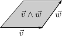
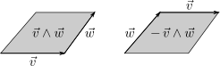
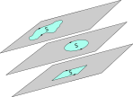
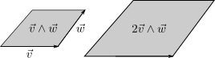
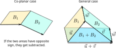
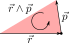

# Animations

# Creating animations

-   The mathematics of transformations that we introduced in the last lesson allows us to easily create *static* images.

-   What would change if we wanted to create **animations** instead?

-   Let's see a practical example.

# Transformations over time (1/2)

-   Consider a 3D object centered at the origin.

-   Imagine that at time $t = 0$ of the animation the object must be at position $\vec k_0$, and at time $t = 1$ at position $\vec k_1$.

-   If I want to generate the frame of the object at a generic time $0 \leq t \leq 1$, the transformation $A$ is trivially

    $$
    A(t) = T_{\vec k_0 + (\vec k_1 - \vec k_0) t} =
    \begin{pmatrix}
    1&0&0&k_{0x} + (k_{1x} - k_{0x})t\\
    0&1&0&k_{0y} + (k_{1y} - k_{0y})t\\
    0&0&1&k_{0z} + (k_{1z} - k_{0z})t\\
    0&0&0&1
    \end{pmatrix}.
    $$


# Transformations over time (2/2)

-   Scaling transformation are equally trivial to animate: to scale from $s_0$ to $s_1$, I can define $\xi(t) = s_0 + (s_1 - s_0) t$ so that the transformation is

    $$
    A(t) = M_{s_0 + (s_1 - s_0) t} = M_{\xi(t)} =
    \begin{pmatrix}
    \xi(t)&0&0&0\\
    0&\xi(t)&0&0\\
    0&0&\xi(t)&0\\
    0&0&0&1
    \end{pmatrix}.
    $$

-   Unfortunately, there is no such simple formula for rotations!

# Animating rotations

-   Rotations are represented through orthogonal matrices ($R(t) R(t)^t = I$).

-   We cannot interpolate the coefficients of two rotation matrices
    $$
    R(0) = \begin{pmatrix}
    m_{11}&m_{12}&m_{13}\\
    m_{21}&m_{22}&m_{23}\\
    m_{31}&m_{32}&m_{33}
    \end{pmatrix},\ %
    R(1) = \begin{pmatrix}
    m'_{11}&m'_{12}&m'_{13}\\
    m'_{21}&m'_{22}&m'_{23}\\
    m'_{31}&m'_{32}&m'_{33}
    \end{pmatrix},\quad
    $$
    with the usual formula $m_{ij} + \bigl(m'_{ij} - m_{ij}\bigr) t$: the resulting $R(t)$ is not orthogonal!

# Example

<iframe src="https://player.vimeo.com/video/538566733?title=0&amp;byline=0&amp;portrait=0&amp;speed=0&amp;badge=0&amp;autopause=0&amp;player_id=0&amp;app_id=58479" width="896" height="504" frameborder="0" allow="autoplay; fullscreen; picture-in-picture" allowfullscreen title="Scanning strategy of a CMB spacecraft (LiteBIRD-like)"></iframe>


# Example

-   The *Planck* satellite had a *star tracker* on board that identified the satellite's orientation with respect to the fixed stars.

-   The orientation (*attitude*) was measured 10 times per second (the scientific data were sampled ~100 times per second) and transmitted to the ground station:

    <center>
    
    </center>

-   On the ground, the orientation is needed at the same sampling rate as the scientific data, so interpolation is necessary.

-   To do this, the Planck *data reduction* pipeline used **quaternions**.

# Complex Numbers and Quaternions {#complex-numbers-and-quaternions}

# Brief Historical Overview

-   Ancient Greece: first examples of the parallelogram rule
-   Late 17th century: [Leibniz](https://en.wikipedia.org/wiki/Gottfried_Wilhelm_Leibniz) urged the creation of a way to link algebra and geometry
-   Late 18th century: [Wessel](https://en.wikipedia.org/wiki/Caspar_Wessel) introduced the sum and product of complex numbers, linking them to geometric properties, and hypothesized quaternions
-   1843: [Hamilton](https://en.wikipedia.org/wiki/William_Rowan_Hamilton) published his first work on quaternions
-   1844–1878: [Grassmann](https://en.wikipedia.org/wiki/Hermann_Grassmann) and [Clifford](https://en.wikipedia.org/wiki/William_Kingdon_Clifford) proposed geometric algebra
-   1861: [Maxwell](https://en.wikipedia.org/wiki/James_Clerk_Maxwell) formulated the equations of electromagnetism, using Hamilton's quaternion formalism
-   Late 19th century: [Gibbs](https://en.wikipedia.org/wiki/Josiah_Willard_Gibbs) and [Heaviside](https://en.wikipedia.org/wiki/Oliver_Heaviside) proposed modern vector calculus, which within a few decades became the dominant language in physics

# Complex Numbers and Quaternions

-   In the last lecture, we expressed rotations in matrix form.

-   It is also possible to express rotations using complex numbers (in 2D) or quaternions (in 3D).

-   Quaternions have many advantages over 3D rotation matrices and are used in many fields.

-   We **will not** use quaternions in our code, so this topic will not be required for the exam. If you want to learn more, two excellent texts are [*Visualizing quaternions*](https://www.amazon.com/Visualizing-Quaternions-Kaufmann-Interactive-Technology/dp/0120884003) (A. J. Hanson) and [*Quaternions for computer graphics*](https://link.springer.com/book/10.1007/978-0-85729-760-0) (J. A. Vince).

# Complex Numbers

-   The algebra ℂ of complex numbers contains elements $z = (\Re z, \Im z) = (x, y)$.

-   The product is defined as

    $$
    z_1 \cdot z_2 = (\Re z_1\,\Re z_2 - \Im z_1\,\Im z_2, \Re z_1\,\Im z_2 + \Im z_1\,\Re z_2).
    $$

-   Introducing $i$ such that $i^2 = -1$ and writing complex numbers in the form $z = x + i y$, the product formula is easier to remember:

    $$
    (x_1 + i y_1) \cdot (x_2 + i y_2) = x_1 x_2 - y_1 y_2 + i \bigl(x_1 y_2 + x_2 y_1\bigr).
    $$

# Rotations and Complex Numbers

-   On the plane, it is possible to encode a rotation $R(\theta)$ around the origin using the complex number

    $$
    r(\theta) = e^{i \theta} = \cos\theta + i\sin\theta
    $$

    if the vector to be rotated $\vec{v} = x \hat e_x + y \hat e_z$ is associated with the complex number

    $$
    z = x + iy.
    $$

    Under these assumptions, the expression $r(\theta) \cdot z$ is equivalent to $R(\theta)\vec{v}$.

-   Instead of the 4 coefficients of the matrix $R(\theta)$, only $\Re z$ and $\Im z$ are needed.

# From 2D to 3D

-   [*Quaternions*](https://en.wikipedia.org/wiki/Quaternion) generalize the ability of complex numbers to encode rotations in 3D. They were proposed by [W. R. Hamilton](https://en.wikipedia.org/wiki/William_Rowan_Hamilton) (the one from the Hamiltonian) in 1843 precisely to extend ℂ (“invented” a few decades earlier), and their algebra is indicated by ℍ.

-   If a complex number $z$ is formed by two coefficients (the real part $\Re z$ and the imaginary part $\Im z$), a quaternion $q \in \mathbb{H}$ is composed of **four** coefficients:

    $$
    q = (q_0, q_1, q_2, q_3) = \bigl(q_0, \vec{q}\bigr),
    $$

    The term $q_0$ is called the *scalar part*, while $\vec{q} = (q_1\ q_2\ q_3)$ is the *vector part*.

# Quaternion Product

-   The product $p q$ between two quaternions is defined as follows:

    $$
    p q = \begin{pmatrix}
    p_0 q_0 - p_1 q_1 - p_2 q_2 - p_3 q_3\\
    p_1 q_0 + p_0 q_1 + p_2 q_3 - p_3 q_2\\
    p_2 q_0 + p_0 q_2 + p_3 q_1 - p_1 q_3\\
    p_3 q_0 + p_0 q_3 + p_1 q_2 - p_2 q_1
    \end{pmatrix}.
    $$

-   This product satisfies all the properties of an associative algebra but **is not commutative**: $p q \not= q p$. (First algebra of this kind in history!).

# Notation for Quaternions {#quaternion-notation}

-   Hamilton invented a very convenient notation for quaternions:
    $$
    q = q_0 + q_1 \mathbf{i} + q_2 \mathbf{j} + q_3 \mathbf{k}.
    $$

-   If the following rules are defined, the product between quaternions from the previous slide follows consequently:

    $$
    \begin{aligned}
    \mathbf{i} \mathbf{i} &= -1, &\mathbf{i} \mathbf{j} &=  \mathbf{k}, &\quad\mathbf{j} \mathbf{i} = -\mathbf{k},\\
    \mathbf{j} \mathbf{j} &= -1, &\mathbf{j} \mathbf{k} &=  \mathbf{i}, &\quad\mathbf{k} \mathbf{j} = -\mathbf{i},\\
    \mathbf{k} \mathbf{k} &= -1, &\mathbf{k} \mathbf{i} &=  \mathbf{j}, &\quad\mathbf{i} \mathbf{k} = -\mathbf{j}.
    \end{aligned}
    $$

# Inner Product

-   It is possible to define an inner product between quaternions:

    $$
    p \cdot q = p_0 q_0 + p_1 q_1 + p_2 q_2 + p_3 q_3 = p_0 q_0 + \vec{p} \cdot \vec{q};
    $$

    from this, we can define a norm:

    $$
    \left\|q\right\| = \sqrt{q \cdot q} = \sqrt{q_0^2 + q_1^2 + q_2^2 + q_3^2} = \sqrt{q_0^2 + \left\|\vec{q}\right\|}.
    $$

-   There is also the *conjugate*

    $$
    q^* = (q_0, -q_1, -q_2, -q_3) = (q_0, -\vec{q}).
    $$

# 3D Rotations with Quaternions

-   Given a normalized vector $\hat n$ and an angle $\theta$, we associate with it the quaternion

    $$
    r(\theta, \hat n) = \left(\cos\frac\theta2, \sin\frac\theta2\,\hat n\right),
    $$

    which represents the rotation by an angle $\theta$ around $\hat n$.

-   If $\left\|\hat n\right\| = 1$, it obviously holds that $\left\|r(\theta, \hat n)\right\| = 1$.

-   Let's see how to represent a 3D rotation using $r(\theta, \hat n)$.

# Applying the Rotation

-   A generic vector $\vec v$ is rotated into $\vec v'$ through this product of three quaternions:

    $$
    \vec v' = r(\theta, \hat n) \cdot (0, \vec v) \cdot r^{-1}(\theta, \hat n),
    $$
    where $(0, \vec v)$ represents the quaternion associated with $\vec v$.

-   Intuitively, $r(\theta, \hat n)$ appears **twice** in the formula because it depends on the angle $\theta/2$, and not simply on the angle $\theta$.

-   From the formula, it is evident that $r(\theta, \hat n)$ and $-r(\theta, \hat n)$ represent the “same” rotation (90 clockwise vs. 270° counterclockwise).

# Are Quaternions Efficient?

-   A rotation matrix must be stored by saving 9 coefficients in memory, while a quaternion requires only 4.

-   Should we therefore use quaternions to represent rotations in our code?

-   Generally **no**! If you explicitly write the sequence of operations needed to rotate a vector, you’ll see that the matrix representation requires fewer calculations.

-   What are quaternions useful for, then?


# *Slerp* {#slerp-and-rotations}

-   The term *slerp* refers to the interpolation $r(t)$ between two rotations $r_1$ and $r_2$.

-   The formula for $r(t) \in \mathbb{H}$ for $t \in [0, 1]$ is simply

    $$
    r(t) = \frac{\sin(1 - t)\theta}{\sin\theta}r_1 + \frac{\sin t\theta}{\sin\theta}r_2,
    $$

    where $\theta$ is the “angle” between $r_1$ and $r_2$ (with $\left\|r_1\right\| = \left\|r_2\right\| = 1$):

    $$
    \theta = r_1 \cdot r_2.
    $$

-   It is easy to show that $r(t)$ represents a rotation $\forall t\in [0, 1]$.

# Example of Slerp

<p><embed width="640px" height="640px" src="js/slerp.html"/></p>

# Animating Transformations

-   Representing rotations with quaternions fills the last missing "hole": all the transformations presented in the previous lesson are easily interpolable:

    1.  Translations;
    2.  Scale transformations;
    3.  Rotations 🥳.

-   The page [Look, Ma, No Matrices!](https://enkimute.github.io/LookMaNoMatrices/) shows a nice example…

-   …which uses an extension of the concept of "quaternion", **multivectors**, to generate the effects shown at the bottom of the page.

-   Let's see then what multivectors and Clifford algebras are.


# Clifford’s Algebras {#clifford-algebras}

# Limits of Classical Geometry

-   Vectors and pseudovectors follow different transformation rules.

-   To describe rotations on a 2D plane, it is necessary to use 3D (pseudo)vectors, like *angular momentum* $\vec{L} = \vec{r} \times \vec{p}$ or *torque* $\vec{\tau} = \vec r \times \vec F$.

-   The cross product is definable only for $\mathbb{R}^3$ (and $\mathbb{R}^7$, [due to octonions](https://en.m.wikipedia.org/wiki/Seven-dimensional_cross_product)…), and has strange units: if $v$ and $w$ are in meters, $v \times w$ is in m².

-   The representation of rotations requires increasingly complicated algebras as the dimensions increase (complex numbers, quaternions…).

-   It is not possible to invert products between vectors: if $\vec a \times \vec x = \vec b$ with $\vec a$ and $\vec b$ known and $x$ an unknown vector, there is no way to uniquely reconstruct $\vec x$.

# Geometric Algebra

-   **Clifford algebras**, and in particular *geometric algebra*, overcome all the problems listed in the previous slide.

-   It is a branch of mathematics that rebuilds classical linear algebra and provides a more intuitive and coherent interpretation of certain geometric properties. [Clifford](https://en.wikipedia.org/wiki/William_Kingdon_Clifford) proposed it in 1878.

-   **Geometric algebra** is the application of Clifford algebras to the case of $\mathbb{R}^n$, and is what usually interests physicists. We will limit ourselves to these.


# The Exterior Product (or Grassman’s)

# Product between Vectors

-   The problem with the cross product $\times$ is that it is defined only on ℝ³, while we desire a general algebra!

-   In 1840, [Hermann Günter Grassmann](https://en.wikipedia.org/wiki/Hermann_Grassmann) (1809–1877) defined the exterior product $\vec v \wedge \vec w$ between two vectors $v$ and $w$ (today also called the *Grassmann product*) as the oriented area on the plane $\mathrm{Span}(\vec v, \vec w)$ with surface area

    $$
    \left\|\vec v\right\|\,\left\|\vec w\right\|\,\sin\theta.
    $$

    <center>
    {height=160px}
    </center>

# Oriented Areas

-   An oriented area like $\vec v \wedge \vec w$ is called a **bivector**.

-   Bivectors are oriented just like ordinary vectors: changing the sign of a bivector means reversing its direction of travel (∧ is **antisymmetric**).

    <center>
    
    </center>

-   This is analogous to what happens with a vector: $\vec v \rightarrow - \vec v$.

-   Just as a vector $\vec v$ does not depend on the point of application, a bivector does not depend on its perimeter («shape»).

# «Shape» of the Exterior Product

<center>

</center>

It may sound strange! However, this guarantees that $(2\vec v) \wedge \vec w = \vec v \wedge (2\vec w)$.

# Meaning of the Exterior Product

-   This is the information encoded by an exterior product $\vec v \wedge \vec w$:

    1.  Extent of the surface (e.g., 15 m²);
    2.  Inclination of the plane on which the surface lies;
    3.  Orientation of the surface.

-   This information is *not* encoded:

    1.  Shape of the surface;
    2.  Position of the plane with respect to the origin of the axes.

-   We now see that it is possible to define scalar-bivector product and addition operations on bivectors: this makes them a **vector space**.

# Scalar-Bivector Product

-   The expression $\lambda \vec v \wedge \vec w$ with $\lambda \in \mathbb{R}$ is still a bivector.

-   The area of $\lambda \vec v \wedge \vec w$ is $\left|\lambda\right|$ times the area of $\vec v \wedge \vec w$.

-   If $\lambda < 0$, the direction is reversed, otherwise it remains the same.

    <center>
    
    </center>


# Sum of Bivectors

<center>
{height=640px}
</center>

# Sum of Bivectors

-   If two bivectors $B_1$ and $B_2$ are coplanar, then:

    1.  $B_1 + B_2$ is a bivector on the same plane;
    2.  Its surface area is equal to the signed sum of the two (where the sign is determined by the direction).

-   If they are not coplanar, a vector $\vec w$ is considered along the line of intersection of the two planes, and $\vec u$ and $\vec v$ are identified such that

    $$
    B_1 = \vec u \wedge \vec w,\quad B_2 = \vec v \wedge \vec w.
    $$

    From the properties of $\wedge$ it follows that $B_1 + B_2 = (\vec u + \vec v) \wedge \vec w$.

# Basis of Bivectors

-   The sum formula appears complicated, but it allows the construction of a vector space.

-   Being a vector space, it is possible to decompose bivectors using **bases**, and in this way the sum is trivial to understand: as simple as adding $\vec v = 3\hat e_1 + 2\hat e_2$ to $\vec w = -2\hat e_1 + \hat e_2$.

-   We can define the **canonical basis** as the set of the three bivectors of unit area on the $xy$, $yz$ and $xz$ planes:

    $$
    \hat e_1 \wedge \hat e_2, \quad \hat e_2 \wedge \hat e_3, \quad \hat e_1 \wedge \hat e_3.
    $$

# Basis of Bivectors

```{.asy im_fmt="html" im_opt="-f html" im_out="img,stdout,stderr" im_fname="bivector-basis"}
size(0,100);
import three;
currentlight=Viewport;

draw(O--1.5X, gray); //x-axis
draw(O--1.5Y, gray); //y-axis
draw(O--1.5Z, gray); //z-axis

label("$x$", 1.5X + 0.2Z);
label("$y$", 1.5Y + 0.2Z);
label("$z$", 1.5Z + 0.2X);

path3 xy = ((1, 1, 0) -- (0.01, 1, 0) -- (0.01, 0.01, 0) -- (1, 0.01, 0) -- cycle);
path3 xz = rotate(90, X) * xy;
path3 yz = rotate(-90, Y) * reverse(xy);

draw(surface(xy), red + opacity(0.5));
draw(surface(xz), green + opacity(0.5));
draw(surface(yz), blue + opacity(0.5));

draw(xy, red, Arrow3);
draw(xz, green, Arrow3);
draw(yz, blue, Arrow3);

label("$\hat e_1 \wedge \hat e_2$", (0.5, 0.5, 0.05));
label("$\hat e_2 \wedge \hat e_3$", (0.05, 0.5, 0.5));
label("$\hat e_1 \wedge \hat e_3$", (0.5, 0.05, 0.5));
```

# Sum of Bivectors

-   If we have two bivectors

    $$
    \begin{aligned}
    \vec v &= 3 \hat e_1 \wedge \hat e_2 - \hat e_1 \wedge \hat e_3,\\
    \vec w &= 2 \hat e_1 \wedge \hat e_2 + 4\hat e_1 \wedge \hat e_3,\\
    \end{aligned}
    $$

    then their sum is

    $$
    \vec v + \vec w = 5\hat e_1 \wedge \hat e_2 + 3\hat e_1 \wedge \hat e_3.
    $$

-   It is therefore trivial to perform calculations with bivectors!

# Multivectors

-   The outer product can also be calculated between a bivector and a vector, and we can exploit the associative property:

    $$
    \vec u \wedge \vec v \wedge \vec w = (\vec u \wedge \vec v) \wedge \vec w = \vec u \wedge (\vec v \wedge \vec w)$$

-   The trivector $\vec u \wedge \vec v \wedge \vec w$ represents an *oriented volume*.

-   By repeatedly applying the outer product, we can generate trivectors, quadrivectors, etc. (This is why it is called *outer*).

-   In general, we speak of *multivectors*, or $k$-vectors: a scalar is a 0-vector, vectors are 1-vectors, bivectors are 2-vectors, etc.


# Calculation Examples

-   Consider for example ℝ³ and the canonical basis $\left\{\hat e_i\right\}$.

-   These are some examples of trivectors and calculations associated with them:

    $$
    \begin{aligned}
    \hat e_1 \wedge \hat e_3 \wedge \hat e_2 &= \hat e_1 \wedge (\hat e_3 \wedge \hat e_2) = -\hat e_1 \wedge (\hat e_2 \wedge \hat e_3) = -\hat e_1 \wedge \hat e_2 \wedge \hat e_3,\\
    \hat e_2 \wedge \hat e_3 \wedge \hat e_1 &= -\hat e_2 \wedge \hat e_1 \wedge \hat e_3 = \hat e_1 \wedge \hat e_2 \wedge \hat e_3,\\
    \hat e_1 \wedge \hat e_2 \wedge \hat e_3 \wedge \hat e_3 &= \hat e_1 \wedge \hat e_2 \wedge (\hat e_3 \wedge \hat e_3) = 0,\\
    \hat e_1 \wedge \hat e_2 \wedge \hat e_3 \wedge \hat e_2 &= -\hat e_1 \wedge (\hat e_2 \wedge \hat e_2) \wedge \hat e_3 = 0.\\
    \end{aligned}
    $$

-   From the last two examples, it is easy to see that the outer product of four elements of the basis is **always zero**.

# Number of Multivectors

-   Not only is the outer product of four elements of the **basis** zero: even if we take any four vectors in $\mathbb{R}^3$, their product is zero.

-   It is trivial to show that in a space $\mathbb{R}^n$ the maximum grade of multivectors is $n$.

-   Consequently, in $\mathbb{R}^3$ only the following objects are non-trivial:

    #. 0-vectors (scalars);
    #. 1-vectors (vectors);
    #. 2-vectors (bivectors), also called *pseudovectors*;
    #. 3-vectors (trivectors), also called *pseudoscalars*.

# The Geometric Product

# Birth of Geometric Algebra

-   Clifford started from Grassmann's outer product to define a **product between vectors**, which makes the vector space $\mathbb{R}^n$ an **algebra**.

-   Clifford's brilliant intuition was that the old, "classical" scalar product and Grassmann's "new" outer product are intuitively related, because

    $$
    \vec{v} \cdot \vec{w} \propto \cos\theta, \quad \vec{v} \wedge \vec{w} \propto \sin\theta,
    $$

    and obviously $\sin^2\theta + \cos^2\theta = 1$.

# Multiplication Tables

-   The relationship can also be seen by comparing how the elements of the canonical basis of ℝ³ combine:

    $$
    \begin{matrix}
    \cdot& e_1& e_2& e_3\\
    e_1& 1& 0& 0\\
    e_2& 0& 1& 0\\
    e_3& 0& 0& 1
    \end{matrix}
    \qquad\qquad
    \begin{matrix}
    \wedge& e_1& e_2& e_3\\
    e_1& 0& e_1 \wedge e_2& e_1 \wedge e_3\\
    e_2& -e_1 \wedge e_2& 0& e_2 \wedge e_3\\
    e_3& -e_1 \wedge e_3& -e_2 \wedge e_3& 0
    \end{matrix}
    $$

-   The idea of adding them together is tempting, also because it recalls the formula

    $$
    z = \left|z\right|\bigl(\cos\theta + i\sin\theta\bigr).
    $$

# Geometric Product

-   The **geometric product** is the sum of the inner product and the outer product:

    $$
    \vec v\,\vec w = \vec v \cdot \vec w + \vec v \wedge \vec w.
    $$

-   This product is defined on $\mathbb{R}^n$, for any value of $n \geq 1$ (but the case $n = 1$ is trivial), because the outer product $\vec v \wedge \vec w$ itself is easily generalizable to $n$ dimensions.

-   The geometric product defines an associative algebra on the vector space.


# Geometric Product

-   What does it mean to add a scalar like $\vec v \cdot \vec w$ and a bivector like $\vec v \wedge \vec w$?

-   The «sum» must be understood in a non-literal sense, just like the sum of the real/imaginary parts ($z = x + iy$) or of orthogonal vectors ($\vec v = 3\hat ı + 4\hat ȷ$).

-   Similarly, the notation $\vec v \cdot \vec w + \vec v \wedge \vec w$ is a mnemonic aid to remember how geometric products are added and multiplied.

# Existence of the Inverse

-   Let's calculate $\vec v^2$ for a generic vector $\vec v$:

    $$
    \vec v^2 = \vec v \vec v = \vec v \cdot \vec v + \vec v \wedge \vec v = \left\|\vec v\right\|^2 + 0 = \left\|\vec v\right\|^2.
    $$

-   This result implies that $\vec v / \left\|\vec v\right\|^2$ is the inverse of $\vec v$:

    $$
    \vec v \frac{\vec v}{\left\|\vec v\right\|^2} = \frac{\vec v \vec v}{\left\|\vec v\right\|^2} = 1,
    $$

    and therefore $\vec v^{-1} = \vec v / \left\|\vec v\right\|^2$: like any respectable algebra, **the inverse exists**!

# Other Examples

-   Suppose that $\vec v \perp \vec w$. Then

    $$
    \vec v \vec w = \vec v \cdot \vec w + \vec v \wedge \vec w = \vec v \wedge \vec w.
    $$

    For perpendicular vectors, the geometric product coincides with the exterior product.

-   The canonical basis $\left\{\hat e_i\right\}$ therefore has the following properties:

    $$
    \hat e_i \hat e_i = \left\|\hat e_i\right\|^2 = 1, \quad \hat e_i \hat e_j = \hat e_i \wedge \hat e_j = -\hat e_j \wedge \hat e_i = - \hat e_j \hat e_i\ \text{if $i \not= j$}.
    $$

# Products of Multivectors

-   We said that in $\mathbb{R}^n$ there can be multivectors of degree up to $n$, because the exterior product $\wedge$ of $n + 1$ vectors vanishes.

-   What happens to the geometric product of four orthonormal vectors in $\mathbb{R}^3$?

    $$
    \begin{aligned}
    \hat e_1 \hat e_2 \hat e_3 \hat e_3 &= \hat e_1 \hat e_2 (\hat e_3 \hat e_3) = \hat e_1 \hat e_2\\
    \hat e_1 \hat e_2 \hat e_3 \hat e_2 &= -\hat e_1 \hat e_2 \hat e_2 \hat e_3 = -\hat e_1 (\hat e_2 \hat e_2) \hat e_3 = -\hat e_1 \hat e_3,\\
    \hat e_1 \hat e_2 \hat e_3 \hat e_1 &= -\hat e_1 \hat e_2 \hat e_1 \hat e_3= \hat e_1 \hat e_1 \hat e_2 \hat e_3 = \hat e_2 \hat e_3.
    \end{aligned}
    $$

-   We always get bivectors!

# Examples

-   If you know how to operate on the elements of $\left\{\hat e_i\right\}$, it is easy to perform calculations on arbitrary vectors.

-   Take for example the vectors

    $$\vec v = 2\hat e_1 + \hat e_2,\quad \vec w = -\hat e_2.$$

    Then:

    $$
    \begin{aligned}
    \vec v \vec w &= \bigl(2\hat e_1 + \hat e_2\bigr) \bigl(-\hat e_2\bigr) = 2\hat e_1 \hat e_2 - \hat e_2^2 = 2\hat e_1 \hat e_2 - 1,\\
    \vec v^2 &= \vec v \vec v = \bigl(2\hat e_1 + \hat e_2\bigr) \bigl(2\hat e_1 + \hat e_2\bigr) =\\
    &= 4\hat e_1^2  + 2 \hat e_2 \hat e_1 + 2\hat e_1\hat e_2 + \hat e_2^2 = 5.\\
    \end{aligned}
    $$

# Geometric Algebra in 2D

# General Multivector in 2D

-   In $\mathbb{R}^2$ you can only have 0-vectors (scalars), 1-vectors, and 2-vectors (bivectors).

-   The general form of a multivector is therefore

    $$
    q = \alpha + \beta_1 \hat e_1 + \beta_2 \hat e_2 + \gamma \hat e_1 \hat e_2.
    $$

-   We have **four** degrees of freedom. How do its four components behave?

# Subalgebras

-   First, we note that from the expression

    $$
    q = \alpha + \beta_1 \hat e_1 + \beta_2 \hat e_2 + \gamma \hat e_1 \hat e_2
    $$

    it is possible to identify four subsets (subalgebras):

    1.  If $\beta_1 = \beta_2 = \gamma = 0$, the subset is isomorphic to $\mathbb{R}$.
    2.  If $\alpha = \gamma = 0$, the subset is isomorphic to the vector space $\mathbb{R}^2$.
    3.  If $\alpha = \beta_1 = \beta_2 = 0$, the subset still seems isomorphic to $\mathbb{R}$; these multivectors are called *pseudoscalars*.

-   Apart from these trivial cases, are there other interesting subalgebras?

# Multivectors and Complex Numbers

-   The pseudoscalar $\hat e_1 \hat e_2$ behaves like $i$!

    $$
    \bigl(\hat e_1 \hat e_2\bigr)^2 = \hat e_1 \hat e_2 \hat e_1 \hat e_2 = -\hat e_1 \hat e_2 \hat e_2 \hat e_1 = -1.
    $$

-   Let's compare complex numbers and multivectors with $\beta_1 = \beta_2 = 0$:

    $$
    \begin{aligned}
    (3 + i) (1 - 2 i) &= 3 + i - 6 i + 2 = 5 - 5i,\\
    (3 + \hat e_1 \hat e_2) (1 - 2\hat e_1 \hat e_2) &= 3 + \hat e_1 \hat e_2 - 6 \hat e_1 \hat e_2 + 2 = 5 - 5 \hat e_1 \hat e_2.
    \end{aligned}
    $$

    They coincide! The algebra with $\beta_1 = \beta_2 = 0$ is isomorphic to $\mathbb{C}$, and we set $\hat e_1 \hat e_2 = i$.

# Multivectors and 2D Rotations

-   The numbers $e^{i\theta}$ rotate points on the complex plane ℂ. Does this also work with multivectors?

-   Let's first see an interesting property of the geometric product:

    $$
    \begin{aligned}
    \vec u \vec v &= \vec u \cdot \vec v + \vec u \wedge \vec v =\\
    &= \left\|\vec u\right\| \cdot \left\|\vec v\right\| \cdot \cos\theta +
       \left\|\vec u\right\| \cdot \left\|\vec u\right\| \cdot \sin\theta \cdot \hat e_1 \hat e_2 =\\
    &= \left\|\vec u\right\| \cdot \left\|\vec v\right\| \cdot
       \bigl(\cos\theta + i\sin\theta\bigr) \equiv\\
    &\stackrel{\text{def.}}{\equiv} \left\|\vec u\right\| \cdot \left\|\vec v\right\| \cdot e^{i\theta} = \left\|\vec u\right\| \cdot \left\|\vec v\right\| \cdot e^{\theta \hat e_1 \hat e_2},
    \end{aligned}
    $$

    which for $\left\|\vec u\right\| = \left\|\vec v\right\| = 1$ leads to $\vec u \vec v = e^{i\theta}$, the rotation by an angle $\theta$!

# Multivectors and 2D Rotation

-   To rotate a vector $\vec v$ by an angle θ around the origin, it is sufficient to consider two unit vectors $\hat u_1$ and $\hat u_2$, whose angle between them is θ, and calculate the rotated multivector $\vec v'$ as

    $$
    \vec v' = \hat u_1 \hat u_2 \vec v = e^{i\theta} \vec v = \left(\cos\theta + i \sin\theta\right) \vec v.
    $$

-   This formula is valid only in the 2D case, but it can be rewritten in a general form.

# Alternative 2D Rotation {#alternative-2d-rotation}

-   The product between two complex numbers commutes, and so it is also in the Clifford subalgebra that contains multivectors in the form $\alpha + \hat e_1 \hat e_2 \beta$.

-   However, in the formula $\vec v' = e^{i\theta} \vec v$ the *vector* $\vec v$ appears, which is not part of the subalgebra: in this case the product does not commute!

-   In 2D, $z \vec v = \vec v z^*$ holds, where $z^*$ is the complex conjugate.

-   If we reduce to a relationship similar to the one [seen for quaternions](tomasi-ray-tracing-06a.html#/slerp-and-rotations), namely

    $$
    \vec v' = e^{i\theta} \vec v = e^{i\theta/2} e^{i\theta/2} \vec v = e^{i\theta/2}\vec v e^{-i\theta/2},
    $$

    we will see that the formula has a much more general application.

# Geometric Algebra in 3D

# Multivectors in ℝ³

-   Let's consider the canonical basis $\left\{\hat e_i\right\}$ in ℝ³.

-   The most general multivector we can think of must have this form:

    $$
    \begin{aligned}
    &\alpha +\\
    &\beta_1 \hat e_1 + \beta_2 \hat e_2 + \beta_3 \hat e_3 +\\
    &\gamma_1 \hat e_1 \hat e_2 + \gamma_2 \hat e_2 \hat e_3 + \gamma_3 \hat e_3 \hat e_1 +\\
    &\delta \hat e_1 \hat e_2 \hat e_3.
    \end{aligned}
    $$

-   We have **eight** degrees of freedom: 1 for scalars, 3 for vectors, 3 for bivectors, and 1 for trivectors (pseudoscalars). It still holds that $(\hat e_1 \hat e_2 \hat e_3)^2 = -1 \equiv i^2$.

# Rotations in 3D

-   To specify a rotation in 3D, you need the angle and the axis of rotation.

-   But in geometric algebra, you don't specify the *axis*, but the *plane* of rotation: a bivector!

-   If the rotation plane is the bivector $\hat I$, the vector $\vec v$ rotates into $\vec v'$ through

    $$
    \vec v' = e^{-\hat I \theta/2} \vec v e^{\hat I \theta/2},
    $$

    which is the expression we [already saw](tomasi-ray-tracing-06a.html#/alternative-2d-rotation) in the 2D case, where $\hat I = i = \hat e_1 \hat e_2$: the basis bivector laying on the complex plane. We have a geometric interpretation of the presence of $i$!

# Quantum Mechanics

-   [D. Hestenes](https://en.wikipedia.org/wiki/David_Hestenes), who rediscovered the works of Grassmann and Clifford in the 1960s-1970s, showed that the term $i$ in the Schrödinger equation
    $$
    H \left|\psi\right> = i\hbar \frac{\mathrm{d}}{\mathrm{d}t} \left|\psi\right>,
    $$
    is related to the same rotation that represents spin in Dirac-Pauli theory.

-   *It is only in a theory with electron spin that one can see why the wave function is complex […] spin is not a mere add-on in quantum mechanics, [and] was inadvertently incorporated into the original Schrödinger equation* ([Hestenes 2002](https://geocalc.clas.asu.edu/pdf/OerstedMedalLecture.pdf))

# Multivectors and Quaternions

-   It is easy to show that

    $$
    (\hat e_1 \hat e_2)^2 = -1,\quad (\hat e_2 \hat e_3)^2 = -1,\quad (\hat e_1 \hat e_3)^2 = -1,
    $$

    and therefore we can obtain a subalgebra that is isomorphic to the quaternion algebra ℍ by setting

    $$
    \mathbf{i} = \hat e_2 \hat e_3, \quad \mathbf{j} = \hat e_1 \hat e_3,\quad \mathbf{k} = \hat e_1 \hat e_2.
    $$

-   As is easy to demonstrate, all the [properties we had listed](tomasi-ray-tracing-06a-clifford-algebras.html#/quaternion-notation) continue to be valid.

# Quantum Mechanics

-   But the properties of bivectors in ℝ³ are the same that define the **Pauli matrices**, used to describe the coupling between spin and the electromagnetic field:

    $$
    \sigma_1 = \begin{pmatrix}0& 1\\1& 0\end{pmatrix}, \quad \sigma_2 = \begin{pmatrix}0& -i\\i& 0\end{pmatrix}, \quad \sigma_3 = \begin{pmatrix}1& 0\\0& -1\end{pmatrix}.
    $$

-   From the perspective of geometric algebra, the gap between classical physics and quantum mechanics is reduced, because the latter is based on bivectors on the **real** field ℝ as in the case of classical mechanics (where, however, bivectors are much less pervasive).

# Vector Product

-   In 3D there is the vector product $\vec u \times \vec v$. What is the equivalent in geometric algebra?

-   The formula for the vector product in classical geometry is

    $$
    \vec u \times \vec v = (u_2 v_3 - u_3 v_2) \hat e_1 + (u_3 v_1 - u_1 v_3) \hat e_2 + (u_1 v_2 - u_2 v_1) \hat e_3.
    $$

    If we explicitly write the exterior product, we get

    $$
    \vec u \wedge \vec v = (u_2 v_3 - u_3 v_2) \hat e_2 \hat e_3 + (u_3 v_1 - u_1 v_3) \hat e_3 \hat e_1 + (u_1 v_2 - u_2 v_1) \hat e_1 \hat e_2.
    $$

    It's not the same thing, but we're very close!

# Exterior and Vector Product

-   If $i = \hat e_1 \hat e_2 \hat e_3$, it can be easily verified that

    $$
    i\vec u \times \vec v = \vec u \wedge \vec v,
    $$

    and this formula can be used as a starting point to convert classical equations containing $\times$ into the formalism of geometric algebra.

-   The exterior product has a number of advantages over the vector product:

    1.  It is defined on $\mathbb{R}^n$ for any $n$, while $\times$ is only defined for $n = 3$.
    2.  The exterior product is associative, while the vector product is not: $u \times (v \times w) \not= (u \times v) \times w$. Calculations are therefore simpler.

# Laws of Physics and ∧

-   The vector product appears in many laws of physics:

    -   Rigid body dynamics;

    -   Maxwell's equations;

    -   Lorentz force.

-   In all these cases it is possible to modify the definitions and formulas to use the exterior product instead of the vector product.

# Rotational Dynamics

-   The *angular momentum* can be defined as the bivector $\vec L = \vec r \wedge \vec p$:

    <center>
    
    </center>

-   Unlike the traditional definition ($\vec L = \vec r \times \vec p$), here $\vec L$ represents an oriented section of a plane, which is intuitive: it is the plane on which the rotation takes place, and the orientation corresponds to the direction.

# Reflections and Angular Momentum

-   Remember the image that illustrated the reflection of pseudovectors?

    <center>
    {height=380px}
    </center>

-   If $L$ is a bivector, there is no problem! The plane on which the wheel rotates is perpendicular to the screen, and it is trivially reflected in the mirror.


# Maxwell's Equations

-   $\vec E$ is a vector, but $\vec B$ is a bivector!

    <center>
    {height=380px}
    </center>

-   (But it is more convenient to think in terms of the multivector $\vec F = \vec E + i c \vec B$).

# Multivectors and Ray Tracing?

-   Geometric algebra greatly simplifies the geometric equations needed in our course.

-   For example, scalars, vectors, planes, and volumes could be encoded by a single `Multivector` type, and transformations (rotations, translations, etc.) should be implemented only once: how wonderful!

-   However, a multivector in ℝ³ requires 8 floating-point numbers to be stored: since ray tracers mostly use vectors, this is a waste (our `Vec` structure requires only 3 floating-point numbers).

-   It is difficult (but not impossible) to implement efficient ray-tracing programs that use geometric algebra.

# Further Reading (1/2)

-   [A swift introduction to geometric algebra](https://www.youtube.com/watch?v=60z_hpEAtD8): some ideas and diagrams in these slides were taken from here (YouTube video, about 40 minutes).

-   [*Geometric Multiplication of Vectors*](https://www.springer.com/gp/book/9783030017552) (M. Josipović): very clear, aims to provide an intuitive idea of how geometric algebra works.

-   [*Understanding Geometric Algebra*](https://www.routledge.com/Understanding-Geometric-Algebra-Hamilton-Grassmann-and-Clifford-for-Computer/Kanatani/p/book/9780367575823) (K. Kanatani): has a more systematic approach than Josipović; shows the link between homogeneous matrices and geometric algebra.

-   [*Geometric Algebra for Physicists*](https://www.cambridge.org/core/books/geometric-algebra-for-physicists/FB8D3ACB76AB3AB10BA7F27505925091) (C. Doran, A. Lasenby): though introduction to GA and its applications to Physics. Includes classical mechanics, special relativity, electromagnetism, quantum mechanics, Lagrangian formalism, gravitation, etc.

# Further Reading (2/2)

-   [*Understanding geometric algebra for electromagnetic theory*](https://onlinelibrary.wiley.com/doi/book/10.1002/9781118078549) (J. W. Arthur): this only deals with electromagnetism and special relativity.

-   [*Geometric Algebra. An Algebraic System for Computer Games and Animation*](https://www.springer.com/gp/book/9781848823785) (J. A. Vince): shows how typical equations used in computer graphics (rotations, quaternions, projections, ray tracing, etc.) can be reformulated using multivectors.

-   [*A history of vector analysis*](https://en.wikipedia.org/wiki/A_History_of_Vector_Analysis) (M. J. Crowe): describes the history of vector analysis, comparing the algebras of Hamilton, Grassmann/Clifford, and the vector system of Gibbs/Heavyside (which is the «classical» one, but was born last).

---
title: "Lesson 7"
subtitle: "Calcolo numerico per la generazione di immagini fotorealistiche"
author: "Maurizio Tomasi <maurizio.tomasi@unimi.it>"
...
