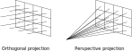

```{.asy im_fmt="html" im_opt="-f html" im_out="img,stdout,stderr" im_fname="camera-reference-frame"}
size(0,100);
import three;
currentlight=Viewport;

draw(-1.5X--1.5X, black); //x-axis
draw(O--1.5Y, black); //y-axis
draw(O--Z, black); //z-axis

label("$x$", 1.3X + 0.2Z);
label("$y$", 1.3Y + 0.2Z);
label("$z$", 0.9Z + 0.2X);

path3 xy = ((0, -1, -0.5) -- (0, -1, 0.5) -- (0, 1, 0.5) -- (0, 1, -0.5) -- cycle);

draw(surface(xy), gray + opacity(0.7));
draw((-1, 0, 0) -- (0, 0, 0), RGB(110, 110, 215), Arrow3);
draw((0, 0, 0) -- (0, -1, 0), RGB(215, 110, 110), Arrow3);
draw((0, 0, 0) -- (0, 0, 0.5), RGB(110, 215, 110), Arrow3);

draw(shift(-1, 0, 0) * scale3(0.02) * unitsphere, black);

label("$P$", (-1, 0.0, 0.2));
label("$\vec d$", (-0.5, 0.0, 0.2));
label("$\vec r$", (0.0, -1.2, 0));
label("$\vec u$", (0.1, 0, 0.6));
```

$$
P = (-d, 0, 0),\ \vec d = (d, 0, 0),\ \vec u = (0, 0, 1), \vec r = (0, -a, 0).
$$

# Orientare `Camera`

-   Gli unici parametri aggiustabili di `Camera` sono `d` (distanza schermo-osservatore) e `a` (*aspect ratio* dell'immagine).

-   Il sistema di riferimento della slide precedente è rigido: è quindi molto facile da implementare, perché non serve memorizzare i vettori $\vec d$, $\vec u$ e $\vec v$.

-   Per orientare una `Camera`, possiamo usare il tipo `Transformation` che abbiamo implementato settimana scorsa.

-   Sugli oggetti di tipo `*Camera` deve essere possibile invocare un metodo `fire_ray` che accetta in input una coordinata $(u, v)$ e restituisce un oggetto `Ray`.


# Trasformazioni

-   Se associamo una trasformazione $T$ all'osservatore, potremmo applicarla ai vettori che definiscono l'osservatore, ossia $\vec d$, $\vec u$ e $\vec r$, e spostare/orientare l'osservatore.

-   Ma così è complicato calcolare le direzioni dei raggi che attraversano lo schermo nella funzione `fire_ray`!

-   È meglio creare i raggi nel sistema di riferimento originale, e **poi** applicare la trasformazione al raggio: è più semplice e si fanno meno calcoli.

-   Serve quindi implementare l'operatore `Transformation * Ray`, che applicherà la trasformazione $T$ sia a $O$ (origine) che a $\vec d$ (direzione del raggio).

# Trasformare `Ray`

-   Questa è l'applicazione di una trasformazione a un raggio; potreste in alternativa ridefinire l'operatore `*` nel caso `Transform * Ray`:

    ```python
    class Ray:
        …

        def transform(self, transformation: Transformation):
            return Ray(origin=transformation * self.origin,
                       dir=transformation * self.dir,
                       tmin=self.tmin,
                       tmax=self.tmax,
                       depth=self.depth)
    ```

-   Non è necessario trasformare `tmin` e `tmax`.


# Test per `transform`

```python
def test_transform():
    ray = Ray(origin=Point(1.0, 2.0, 3.0), dir=Vec(6.0, 5.0, 4.0))
    transformation = translation(Vec(10.0, 11.0, 12.0)) * rotation_x(90.0)
    transformed = ray.transform(transformation)
    
    assert transformed.origin.is_close(Point(11.0, 8.0, 14.0))
    assert transformed.dir.is_close(Vec(6.0, -4.0, 5.0))
```

#  Tipi di proiezioni

<center>
{height=480px}
</center>

# Coordinate dello schermo

-   Per evitare confusione tra coordinate spaziali $(x, y, z)$ e coordinate 2D dello schermo, useremo le lettere $(u, v)$ per indicare punti dello schermo.

-   Il sistema di riferimento è il seguente:

    <center>
    
    </center>

# `OrthogonalCamera`

-   Per costruirla serve il parametro `aspect_ratio` (un floating point, o un razionale come `16//9` in Julia) e `transformation`.

-   Questa è una possibile implementazione in Python:

    ```python
    class OrthogonalCamera(Camera):
        def __init__(self, aspect_ratio=1.0, transformation=Transformation()):
            self.aspect_ratio = aspect_ratio
            self.transformation = transformation

        def fire_ray(self, u, v):
            origin = Point(-1.0, (1.0 - 2 * u) * self.aspect_ratio, 2 * v - 1)
            direction = VEC_X
            return Ray(origin=origin, dir=direction, tmin=1.0).transform(self.transformation)
    ```

# Test per l'osservatore

-   È importante verificare che i quattro angoli dell'immagine siano proiettati in modo corretto. Scegliamo anche un *aspect ratio* diverso da 1.

-   Per `OrthogonalCamera` verifichiamo che i raggi siano paralleli tra loro: lo facciamo calcolandone il prodotto scalare e verificando che coincida col vettore nullo.

-   Per `PerspectiveCamera` verifichiamo invece che tutti i raggi abbiano la medesima origine.

# Test per `OrthogonalCamera`

```python
def test_orthogonal_camera(self):
    cam = OrthogonalCamera(aspect_ratio=2.0)

    ray1 = cam.fire_ray(0.0, 0.0)
    ray2 = cam.fire_ray(1.0, 0.0)
    ray3 = cam.fire_ray(0.0, 1.0)
    ray4 = cam.fire_ray(1.0, 1.0)

    # Verify that the rays are parallel by verifying that cross-products vanish
    assert are_close(0.0, ray1.dir.cross(ray2.dir).squared_norm())
    assert are_close(0.0, ray1.dir.cross(ray3.dir).squared_norm())
    assert are_close(0.0, ray1.dir.cross(ray4.dir).squared_norm())

    # Verify that the ray hitting the corners have the right coordinates
    assert ray1.at(1.0).is_close(Point(0.0, 2.0, -1.0))
    assert ray2.at(1.0).is_close(Point(0.0, -2.0, -1.0))
    assert ray3.at(1.0).is_close(Point(0.0, 2.0, 1.0))
    assert ray4.at(1.0).is_close(Point(0.0, -2.0, 1.0))
```

# Test per l'osservatore

-   Verifichiamo anche l'applicazione di una trasformazione:

    ```python
    def test_orthogonal_camera_transform():
        cam = OrthogonalCamera(transformation=translation(-VEC_Y * 2.0) * rotation_z(angle_deg=90))
        
        ray = cam.fire_ray(0.5, 0.5)
        assert ray.at(1.0).is_close(Point(0.0, -2.0, 0.0))
    ```

-   Per `PerspectiveCamera` il test sarà molto simile.


# `PerspectiveCamera`

-   Oltre all'*aspect ratio* e alla trasformazione, la proiezione prospettica richiede anche la distanza $d$ tra lo schermo e l'osservatore.

-   Questa è l'implementazione in Python:

    ```python
    class PerspectiveCamera(Camera):
        def __init__(self, distance=1.0, aspect_ratio=1.0, transformation=Transformation()):
            self.distance = distance
            self.aspect_ratio = aspect_ratio
            self.transformation = transformation

        def fire_ray(self, u, v):
            origin = Point(-self.distance, 0.0, 0.0)
            direction = Vec(self.distance, (1.0 - 2 * u) * self.aspect_ratio, 2 * v - 1)
            return Ray(origin=origin, dir=direction, tmin=1.0).transform(self.transformation)
    ```


# Test per `PerspectiveCamera`

```python
def test_perspective_camera(self):
    cam = PerspectiveCamera(screen_distance=1.0, aspect_ratio=2.0)

    ray1 = cam.fire_ray(0.0, 0.0)
    ray2 = cam.fire_ray(1.0, 0.0)
    ray3 = cam.fire_ray(0.0, 1.0)
    ray4 = cam.fire_ray(1.0, 1.0)

    # Verify that all the rays depart from the same point
    assert ray1.origin.is_close(ray2.origin)
    assert ray1.origin.is_close(ray3.origin)
    assert ray1.origin.is_close(ray4.origin)

    # Verify that the ray hitting the corners have the right coordinates
    assert ray1.at(1.0).is_close(Point(0.0, 2.0, -1.0))
    assert ray2.at(1.0).is_close(Point(0.0, -2.0, -1.0))
    assert ray3.at(1.0).is_close(Point(0.0, 2.0, 1.0))
    assert ray4.at(1.0).is_close(Point(0.0, -2.0, 1.0))
```


# `ImageTracer`

-   Ci manca ora l'ultimo tassello: una funzionalità che leghi il tipo `HdrImage` a uno dei tipi derivati da `Camera`.

-   Il nuovo tipo `ImageTracer` si occuperà di inviare raggi ai pixel corrispondenti in un'immagine, facendo la conversione tra l'indice `(column, row)` di un pixel usati da `HdrImage` e i valori `(u, v)` che usa `Camera`.

-   Per comodità, definiamo due funzioni associate a `ImageTracer`:

    #.   Una funzione `fire_ray` che invia un raggio verso un pixel specificato;
    #.   Una funzione `fire_all_rays` che itera su tutti i pixel dell'immagine la chiamata a `fire_ray`.

# `fire_ray`

-   La funzione `fire_ray` deve inviare un raggio verso un pixel dell'immagine.

-   A parte convertire le coordinate dallo spazio `(u, v)` allo spazio dei pixel, c'è il problema della *superficie* del pixel.

-   Un pixel non è infatti un punto, perché ha una certa area: in quale punto all'interno del pixel deve passare il raggio?

-   Per il momento faremo passare il raggio nel centro del pixel, ma facciamo in modo che si possa specificare una posizione *relativa* tramite due coordinate `(u_pixel, v_pixel)`, simili alle coordinate `(u, v)` ma riferite alla superficie del pixel anziché dell'immagine.

# `fire_all_rays`

-   Ma una volta che viene «lanciato» un raggio verso un pixel, la funzione `fire_all_rays` cosa dovrebbe fare?

-   Sappiamo che nel programma completo dovremo calcolare la soluzione dell'equazione del rendering, ma non siamo pronti a farlo!

-   Quello che possiamo fare è accettare come argomento di `fire_all_rays` una **funzione**: essa verrà invocata per ogni pixel/raggio dell'immagine e dovrà restituire un colore, ossia un oggetto di tipo `Color`.

# `ImageTracer` in Python

```python
class ImageTracer:
    def __init__(self, image: HdrImage, camera: Camera):
        self.image = image
        self.camera = camera

    def fire_ray(self, col: int, row: int, u_pixel=0.5, v_pixel=0.5):
        # There is an error in this formula, but implement it as is anyway!
        u = (col + u_pixel) / (self.image.width - 1)
        v = (row + v_pixel) / (self.image.height - 1)
        return self.camera.fire_ray(u, v)

    def fire_all_rays(self, func):
        for row in range(self.image.height):
            for col in range(self.image.width):
                ray = self.fire_ray(col, row)
                color = func(ray)
                self.image.set_pixel(col, row, color)
```

# Test per `ImageTracer`

```python
def test_image_tracer(self):
    image = HdrImage(width=4, height=2)
    camera = PerspectiveCamera(aspect_ratio=2)
    tracer = ImageTracer(image=image, camera=camera)

    ray1 = tracer.fire_ray(0, 0, u_pixel=2.5, v_pixel=1.5)
    ray2 = tracer.fire_ray(2, 1, u_pixel=0.5, v_pixel=0.5)
    assert ray1.is_close(ray2)

    tracer.fire_all_rays(lambda ray: Color(1.0, 2.0, 3.0))
    for row in range(image.height):
        for col in range(image.width):
            assert image.get_pixel(col, row) == Color(1.0, 2.0, 3.0)
```


# Guida per l'esercitazione

# Guida per l'esercitazione

-   Create un *branch* per il lavoro di oggi, che chiamerete `cameras`.

-   Implementate questi tipi:

    #.  `Ray`;
    #.  `Camera`, `OrthogonalCamera` e `PerspectiveCamera`;
    #.  `ImageTracer`.
    
-   Implementate tutti i test. Quando avete terminato l'implementazione e i test passano con successo, chiudete il PR.
