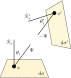
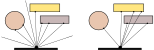
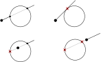
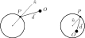
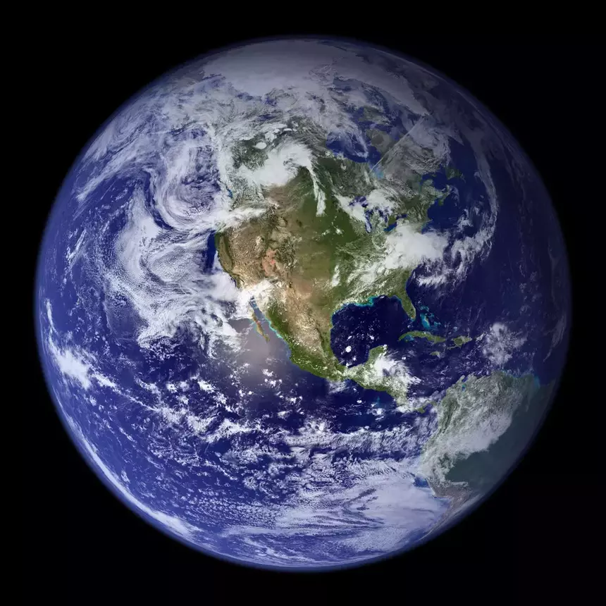
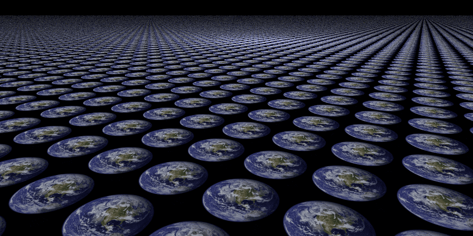
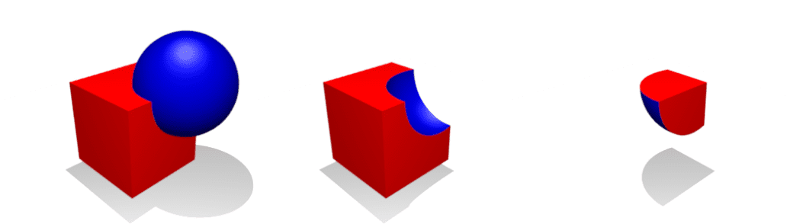
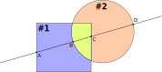
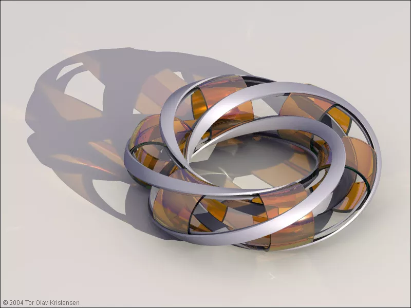

{height=560px}

# Forma alternativa

-   Per definizione di angolo solido quindi, $\mathrm{d}\omega_\Psi$ si scrive così:

    $$
    \mathrm{d}\omega_\Psi = \frac{\mathrm{d}\sigma'\,\cos\theta_i'}{\left\|x - x'\right\|^2}.
    $$
    
-   Il termine integrale dell'equazione del rendering si riscrive quindi così:

    $$
    \int_{\sum S} f_r(x, \Psi \rightarrow \Theta)\,L(x, x - x')\,\frac{\cos\theta_i\,\cos\theta'}{\left\|x - x'\right\|^2}\mathrm{d}\sigma',
    $$
    
    dove $\sum S$ indica tutte le superfici **visibili** da $x$.

---

{height=560px}

# Funzione di visibilità

-   Per risolvere questa ambiguità, si introduce solitamente una funzione di visibilità (*visibility function*) $v(x, x')$ definita in questo modo:

    $$
    v(x, x') = \begin{cases}
    1\ &\text{ se $x'$ è visibile da $x$,}\\
    0\ &\text{ se $x'$ non è visibile da $x$.}
    \end{cases}
    $$

-   In questo modo si riscrive l'integrale sull'intero insieme dei punti $x'$:

    $$
    \int_{\forall x' \in \sum S} f_r(x, \Psi \rightarrow \Theta)\,L(x, x - x')\,\frac{\cos\theta_i\,\cos\theta'}{\left\|x - x'\right\|^2}\,v(x, x')\,\mathrm{d}\sigma'.
    $$

# Raggi e forme geometriche

-   Vediamo quindi che in un codice di ray-tracing è necessario avere la possibilità di effettuare questi calcoli:

    #.  Intersezione tra un raggio e una superficie;
    #.  Determinazione della funzione di visibilità $v(x, x')$ tra due punti.
    
-   Questi due problemi possono essere risolti in modo molto simile, ed è quello che vedremo nella lezione di oggi.

# Intersezioni tra raggi e forme geometriche

# Rappresentazione di forme

-   In un ray-tracer si rappresentano superfici tramite equazioni analitiche.

-   L'intersezione tra raggi luminosi e forme è calcolata usando le regole della geometria analitica:

    #.   Si rappresentano raggi e forme come equazioni in cui l'incognita è il punto $(x, y, z)$ dello spazio.
    #.   Si risolve il sistema delle equazioni per il raggio e per la forma, in modo da trovare i punti $(x, y, z)$ in comune tra le due equazioni.
    
-   Grazie alla nostra implementazione delle trasformazioni affini, possiamo implementare solo le forme più semplici, che potranno poi essere modificate tramite concatenazioni di trasformazioni.

# Trasformazioni

-   Solitamente le forme geometriche sono espresse in forme complesse; ad esempio, la sfera unitaria è rappresentata da una equazione implicita:

    $$
    x^2 + y^2 + z^2 = 1.
    $$

-   Diventa difficile applicare una trasformazione $T$ a una forma nel caso generale. (Sono facili da applicare solo a punti e a vettori!)

-   È più conveniente applicare ai raggi luminosi la trasformazione **inversa**: se $T$ trasforma il sistema di riferimento «privilegiato» di una forma nel sistema reale del mondo, $T^{-1}$ può trasformare un raggio $O + t \vec d$ nel sistema reale del mondo in quello privilegiato della forma.

# Trasformare raggi

-   Supponiamo che $T$ sia la trasformazione da applicare alla superficie $S$. La superficie trasformata $T\cdot S$ è allora l'insieme di punti

    $$
    T\cdot S = \left\{T x: x \in S\right\},
    $$
    
-   Se il raggio $O + t \vec d$ interseca $T\cdot S$ quando $t = \tilde t$, allora
    
    $$
    O + \tilde t \vec d = T \tilde x,\ \Rightarrow\ T^{-1} O + \tilde t\,T^{-1} \vec d = \tilde x,
    $$
    
    ossia l'intersezione tra raggio e superficie *trasformata* $T\cdot S$ è lo stesso punto di intersezione del raggio *antitrasformato* con la superficie $S$, e $\tilde t$ non cambia.
    
# Tipi di forme

-   Ci sono alcune forme geometriche particolarmente semplici da implementare eppure versatili; in questo corso discuteremo le seguenti:

    #.   Sfere;
    #.   Piani;
    #.   *Constructive Solid Geometry* (CSG);
    #.   Cubi;
    #.   Triangoli.
    
-   Tratteremo cubi e triangoli più avanti, dal momento che sono solitamente associati ad argomenti più avanzati (*bounding boxes* e *triangle meshes*).

# Sfere

# Sfera unitaria

-   L'equazione della sfera tridimensionale con centro $C$ e raggio $R$ è

    $$
    (x - c_x)^2 + (y - c_y)^2 + (z - c_z)^2 = R^2,
    $$
    
    e deriva dalla definizione geometrica di sfera. Ma la presenza di $C$ ed $R$ è inutile, perché come detto useremo le trasformazioni.

-   Ci limitiamo quindi a considerare la sfera unitaria centrata nell'origine:

    $$
    x^2 + y^2 + z^2 = 1\ \rightarrow\ \left\|P - 0\right\|^2 = (P - 0) \cdot (P - 0) = 1,
    $$
    
    dove $0$ è l'origine degli assi e $P$ è il generico punto della sfera.

# Intersezione raggio-sfera

-   Determinare l'intersezione tra un raggio ed una sfera richiede di risolvere contemporaneamente le equazioni

    $$
    \begin{cases}
    (P - 0) \cdot (P - 0) = 1,\\
    P = O + t \vec d,
    \end{cases}
    $$
    
-   L'incognita è il valore $t$ che dice a che distanza dall'origine del raggio avviene l'intersezione con la sfera.
    
# Soluzione dell'equazione

-   Si tratta quindi di sostituire banalmente la seconda equazione nella prima:

    $$
    (O + t\vec d - 0) \cdot (O + t\vec d - 0) - 1 = 0.
    $$
    
-   La scrittura $O - 0$ indica semplicemente che $O$ va considerato un *vettore* anziché un punto. Noi semplifichiamo la notazione così:

    $$
    O - 0 = \vec O,
    $$
    
    che suggerisce che potremo usare la funzione/metodo `Point.toVec()`.
    
# Soluzione dell'equazione

-   Espandendo la definizione di prodotto scalare otteniamo

    $$
    t^2 \left\|\vec d\right\|^2 + 2 t\,\vec O \cdot \vec d + \left\|\vec O\right\|^2 - 1 = 0,
    $$
    
-   È una equazione di secondo grado, e ammette quindi zero, una o due soluzioni:

    #.  Zero soluzioni: il raggio non colpisce la sfera;
    #.  Una soluzione: il raggio è tangente alla sfera;
    #.  Due soluzioni: il raggio colpisce la sfera, la attraversa e ne colpisce la superficie nella parte opposta.

# Intersezioni raggio-sfera

-   Per distinguere i tre casi occorre il discriminante:

    $$
    \frac\Delta4 = \left(\vec O \cdot \vec d\right)^2 - \left\|\vec d\right\|^2\cdot \left(\left\|\vec O\right\|^2 - 1\right).
    $$
    
-   Nel caso in cui $\Delta > 0$, le due intersezioni sono

    $$
    t = \begin{cases}
    t_1 &= \frac{-\vec O \cdot d - \sqrt{\Delta / 4}}{\left\|\vec d\right\|^2},\\
    t_2 &= \frac{-\vec O \cdot d + \sqrt{\Delta / 4}}{\left\|\vec d\right\|^2}.
    \end{cases}
    $$

# Intersezioni invalide

-   Non tutte le intersezioni tra raggio e sfera sono valide: dipende anche dal punto di partenza del raggio.

-   Inoltre non ha molto senso considerare le intersezioni tangenti, quindi noi le ignoreremo.

    

    
    

    

# Intersezioni valide

-   Il criterio per decidere se un'intersezione è valida dipende anche dai valori $t_\text{min}$ e $t_\text{max}$ del raggio $O + t \vec d$.

-   Mettendo insieme tutto ciò che abbiamo detto sinora, una intersezione per $t = \tilde t$ è valida solo se

    $$
    t_\text{min} \leq \tilde t \leq t_\text{max}
    $$
    
    (usare < anziché ≤ non cambia nulla).
    
-   Se le due intersezioni $t_1$ e $t_2$ soddisfano entrambe questo criterio, allora si considera il valore minore delle due, ossia $t_1$ (*criterio di visibilità*).

# Oltre le intersezioni

-   Una volta individuato $t$ e di conseguenza il punto $P$, il lavoro però non è finito.

-   Per applicare la BRDF $f_r$ al punto è necessario conoscere anche la normale $\hat n$ alla superficie.

-   Inoltre in generale la BRDF di una superficie dipende dal punto esatto di intersezione, che per una superficie è solitamente indicato come un punto **bidimensionale** $(u, v)$.

# Normale di una sfera

-   Fortunatamente la sfera è una forma geometrica regolare. Dato un punto $P$, la normale alla superficie è il raggio:

    $$
    \hat n_P = P - O,
    $$
    
    dove $O$ è il centro della sfera.
    
-   C'è però una ambiguità: la normale dovrebbe essere *entrante* o *uscente*?

---

{height=560px}

# Normale di una sfera

-   La scelta della normale dipende dalla *direzione di arrivo $\vec d$ del raggio*.

-   Possiamo quindi verificare il segno di

    $$
    \hat n \cdot \vec d = \left\|\hat n\right\|\cdot\left\|\vec d\right\|\,\cos\theta,
    $$
    
    e se è positivo consideriamo $-\hat n$ anziché $\hat n$.

# Punto di intersezione

-   Una volta determinato il punto di intersezione $P$ tra la sfera e il raggio, bisogna solitamente stimare la BRDF in $P$.

-   Ma è scomodo farlo se $P$ è un punto nello spazio tridimensionale; occorre piuttosto conoscerne la posizione in termini della superficie della sfera.

-   Nel caso specifico della sfera si può usare la coppia latitudine-longitudine; nel caso generico di una superficie $S$ si cerca comunque una parametrizzazione bidimensionale $(u, v)$.

---

{height=680px}

# Superficie della sfera

-   Dato un punto $P$ sulla superficie della sfera, possiamo ricavare la colatitudine $\theta$ e la longitudine $\phi$ tramite la trigonometria:

    $$
    \theta = \arccos p_z, \quad \phi = \arctan \frac{p_y}{p_x}.
    $$
    
-   L'intervallo di valori $\theta \in [0, \pi], \phi \in [0, 2\pi]$ è troppo specifico per la sfera, quindi di solito si usa la parametrizzazione

    $$
    u = \frac\phi{2\pi} = \frac{\arctan p_y / p_x}{2\pi}, \quad v = \frac\theta\pi = \frac{\arccos p_z}\pi.
    $$

# Piani

# Piano infinito

-   In geometria affine, un piano è definito tramite il suo vettore normale $\hat n$ e un punto $O$ attraverso cui passa il piano:

    $$
    (P - O) \cdot \hat n = 0,
    $$
    
    dove $P$ è il generico punto sul piano.
    
-   (Come potete intuire, in geometria algebrica invece i piani sono rappresentati mediante bivettori, e la loro equazione è identica a quella della retta: una meraviglia se si fanno calcoli a mano!)

# Piano standard

-   Visto che possiamo sfruttare le trasformazioni, studiamo quindi il piano particolare che passa per l'origine ed è generato dagli assi $x$ e $y$ (ossia è perpendicolare all'asse $z$).

-   In tal caso

    $$
    (P - O) \cdot \hat n = 0\ \Rightarrow\ \vec P \cdot \hat e_z = 0,
    $$
    
    che equivale a chiedere che
    
    $$
    P_z = 0.
    $$
    
# Intersezione raggio-piano

-   L'intersezione tra il piano e il raggio $O + t \vec d$ è quindi banalissima: basta richiedere che la componente $z$ del punto lungo il raggio si annulli per qualche valore di $t$.

-   La soluzione analitica è

    $$
    O_z + t d_z = 0\ \Rightarrow\ t = -\frac{O_z}{d_z},
    $$
    
    che vale ovviamente solo se $d_z \not= 0$, ossia se la direzione $\vec d$ del raggio non è parallela al piano $xy$.

# Normali

-   La normale del piano è ovviamente $\pm \hat e_z$, dove il segno si determina con la medesima regola usata per la sfera.

-   Ma nel caso del piano la formula è ancora più semplice: se $\vec d$ è la direzione del raggio, allora la condizione per cambiare segno diventa

    $$
    \vec d \cdot \hat n < 0\ \Rightarrow\ d_z < 0.
    $$

# Parametrizzazione del piano

-   A differenza della sfera, un piano è una superficie infinita.

-   In questo caso si parametrizza il piano con condizioni periodiche:

    $$
    u = p_x - \lfloor p_x \rfloor,\quad v = p_y - \lfloor p_y \rfloor,
    $$
    
    dove $\lfloor \cdot \rfloor$ indica l'arrotondamento per difetto, in modo che $u, v \in [0, 1)$ come nel caso della sfera.

-   L'intera superficie del piano è quindi la ripetizione periodica della regione $[0, 1] \times [0, 1]$ (*tile pattern*).

# Parametrizzazione del piano

# *Constructive Solid Geometry*

# *Constructive Solid Geometry*

-   Le forme viste finora sono semplicissime: sfere e piani.

-   Vedremo in futuro che forme arbitrariamente complesse si possono approssimare con insiemi di triangoli.

-   Oggi però affrontiamo brevemente un'altra tecnica per costruire forme geometriche complesse a partire da forme semplici: la *Constructive Solid Geometry* (CSG).

# Operazioni Booleane

-   Unione
-   Differenza
-   Intersezione

# Unione

-   Si determinano le intersezioni con *tutte* le forme;
-   Si sceglie l'intersezione più prossima, assegnandole la BRDF della forma corrispondente.

# Differenza

-   Si determinano le intersezioni con le forme;
-   Si omettono le intersezioni interne alla forma #2 (C) e quelle sulla superficie di #2 che non sono interne a #1 (D).

# Intersezione

-   Si determinano le intersezioni con le forme;
-   Si considerano solo le intersezioni in una delle due forme che sono interne all'altra forma (il punto B interseca #2 ed è interno a #1, C interseca #1 ed è interno a #2).

# Fusione

-   Funziona come un'unione, ma i punti interni B e C non vengono considerati.
-   È utile solo per materiali semitrasparenti.

# Gerarchie

{height=560px}

---

[[*Villarceau Circles*](http://hof.povray.org/Villarceau_Circles-CSG.html), by Tor Olav Kristensen (2004)]{style="float:right"}
