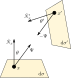
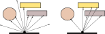
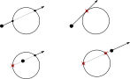
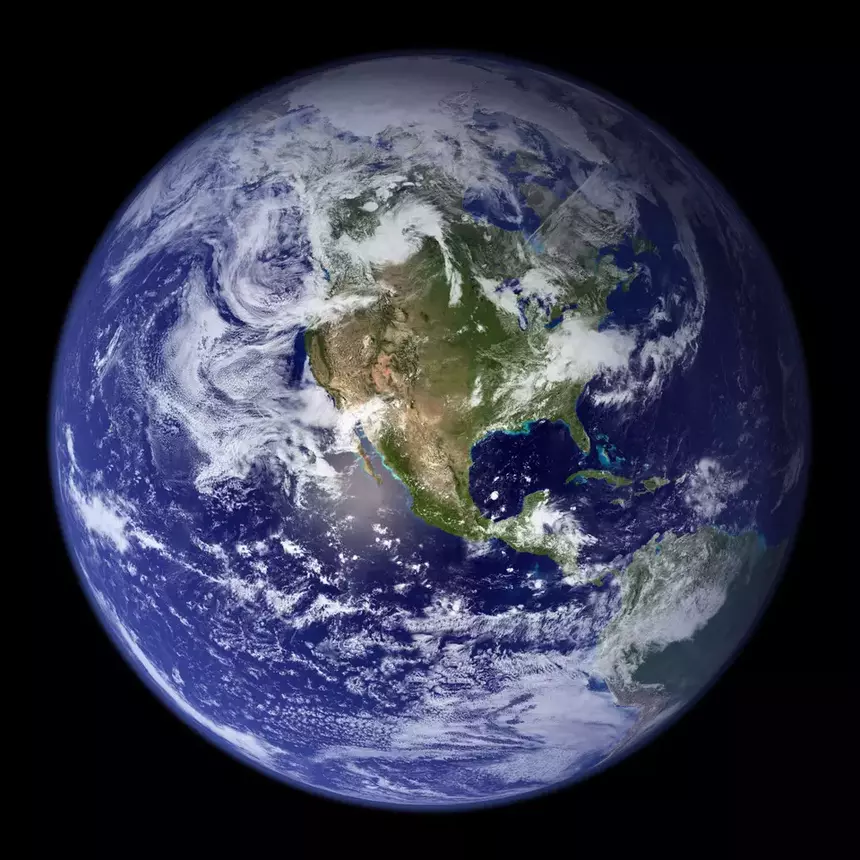
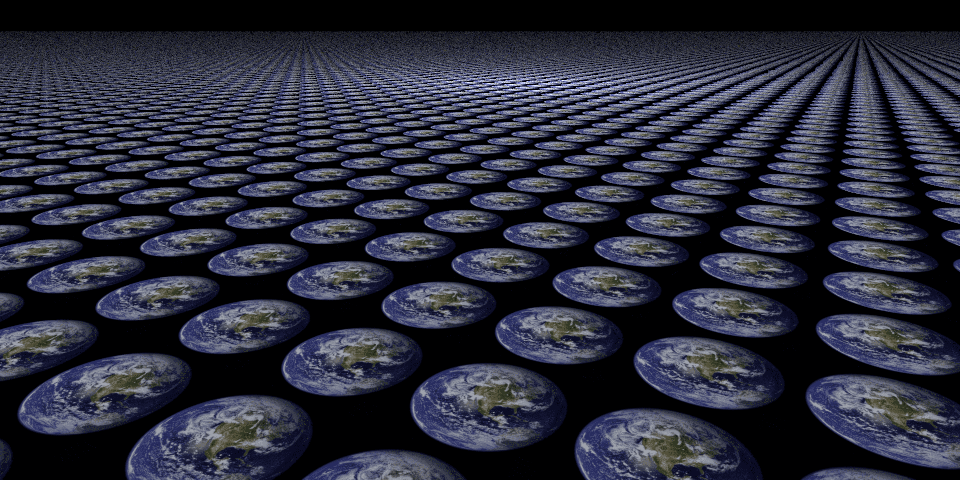
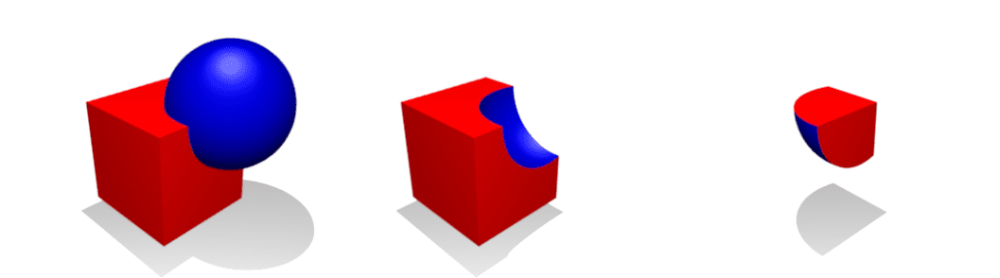
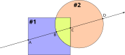
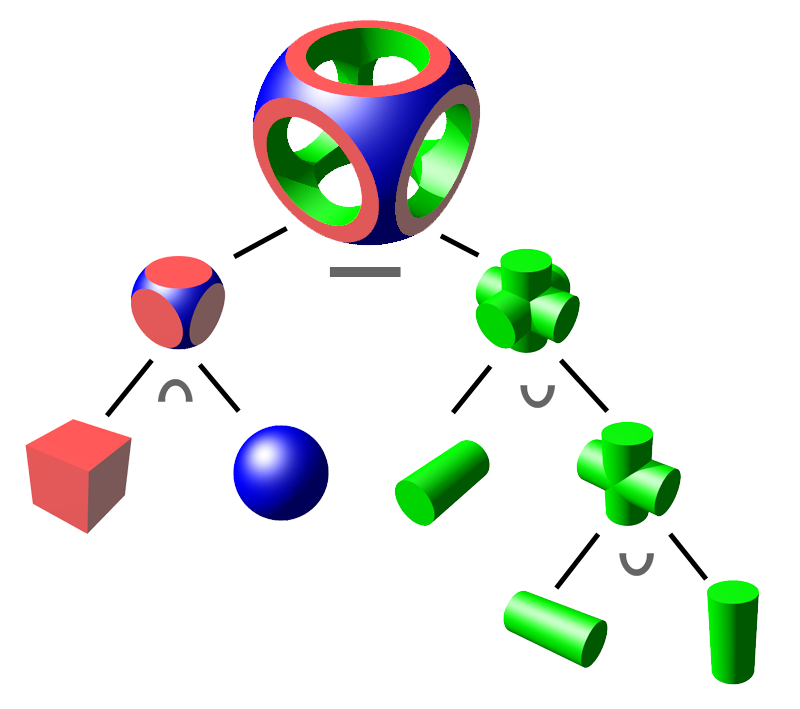
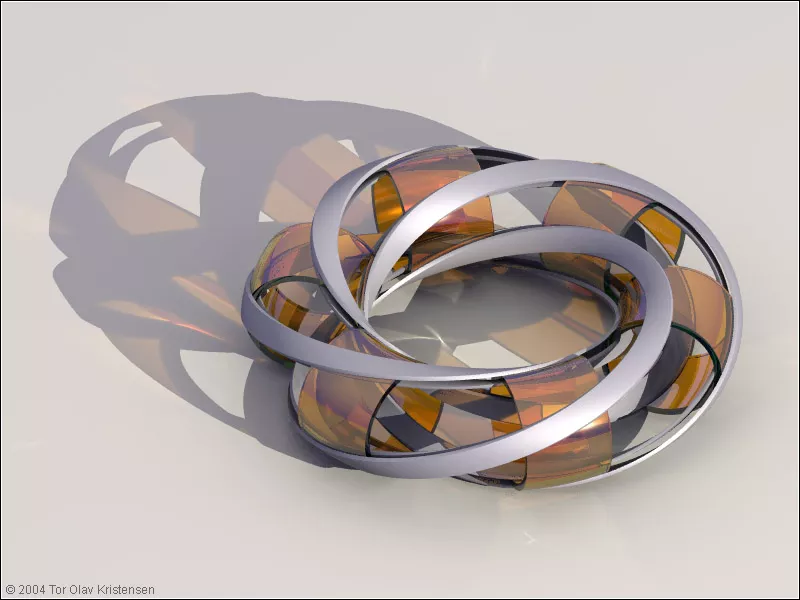

# Geometric Shapes

# «Cornell box»

{height=560}

# Rendering Equation {#rendering-equation}

-   To solve the rendering equation, we need to trace the path of light rays in three-dimensional space and solve the rendering equation:

    $$
    \begin{aligned}
    L(x \rightarrow \Theta) = &L_e(x \rightarrow \Theta) +\\
    &\int_{4\pi} f_r(x, \Psi \rightarrow \Theta)\,L(x \leftarrow \Psi)\,\cos(N_x, \Psi)\,\mathrm{d}\omega_\Psi,
    \end{aligned}
    $$

-   The integral is calculated over the solid angle, and it is not very convenient for the numerical solution of the problem: we will have a list of **objects**, not solid angles, to iterate over.

-   Therefore, we look for an alternative formulation that makes things simpler.

# Alternative Form

-   Let's focus on the most complex term of the equation, i.e., the integral:

    $$
    \int_{4\pi} f_r(x, \Psi \rightarrow \Theta)\,L(x \leftarrow \Psi)\,\cos(N_x, \Psi)\,\mathrm{d}\omega_\Psi.
    $$

-   The integral is calculated over the entire solid angle 4π, and its physical meaning is to take into account the radiation falling on point $x$ of a surface.

-   This radiation must have been emitted by some surface element $\mathrm{d}\sigma'$ on the scene, corresponding to a point $x'$ in space (see the following figure).

---

{height=560px}

# Alternative Form

-   By definition of solid angle, therefore, $\mathrm{d}\omega_\Psi$ is written as follows:

    $$
    \mathrm{d}\omega_\Psi = \frac{\mathrm{d}\sigma'\,\cos\theta_i'}{\left\|x - x'\right\|^2}.
    $$

-   The integral term of the rendering equation can therefore be rewritten as follows:

    $$
    \int_{\sum S} f_r(x, \Psi \rightarrow \Theta)\,L(x, x - x')\,\frac{\cos\theta_i\,\cos\theta'}{\left\|x - x'\right\|^2}\mathrm{d}\sigma',
    $$

    where $\sum S$ indicates all surfaces **visible** from $x$.

---

{height=560px}

# Visibility Function

-   To resolve this ambiguity, a visibility function $v(x, x')$ is usually introduced, defined as follows:

    $$
    v(x, x') = \begin{cases}
    1\ &\text{ if $x'$ is visible from $x$,}\\
    0\ &\text{ if $x'$ is not visible from $x$.}
    \end{cases}
    $$

-   In this way, the integral is rewritten over the entire set of points $x'$:

    $$
    \int_{\forall x' \in \sum S} f_r(x, \Psi \rightarrow \Theta)\,L(x, x - x')\,\frac{\cos\theta_i\,\cos\theta'}{\left\|x - x'\right\|^2}\,v(x, x')\,\mathrm{d}\sigma'.
    $$

# Rays and Geometric Shapes

-   We see that in a ray-tracing code it is necessary to be able to perform these calculations:

    #.  Intersection between a ray and a surface;
    #.  Determination of the visibility function $v(x, x')$ between two points.

-   These two problems can be solved in a very similar way, and that is what we will see in today's lesson.

# Ray/Shape Intersections {#intersections-btw-rays-and-shapes}

# Representation of Shapes

-   In a ray-tracer, surfaces are represented by analytical equations.

-   The intersection between light rays and shapes is calculated using the rules of analytic geometry:

    #.   Rays and shapes are represented as equations where the unknown is the point $(x, y, z)$ in space.
    #.   The system of equations for the ray and for the shape is solved, in order to find the points $(x, y, z)$ in common between the two equations.

-   Thanks to our implementation of affine transformations, we can implement only the simplest shapes, which can then be modified through concatenations of transformations.

# Transformations

-   Usually geometric shapes are expressed in complex forms; for example, the unit sphere is represented by an implicit equation:

    $$
    x^2 + y^2 + z^2 = 1.
    $$

-   However, we know how to apply a transformation $T$ only to points, vectors, and normals, not to implicit equations.

-   It is more convenient to apply the **inverse** transformation to the light rays: if $T$ transforms the "privileged" reference system of a shape into the real world system, $T^{-1}$ can transform a ray $O + t \vec d$ in the real world system into the privileged one of the shape.

# Transforming Rays

-   Suppose that $T$ is the transformation to be applied to the surface $S$. The transformed surface $T\cdot S$ is then the set of points

    $$
    T\cdot S = \left\{T x: x \in S\right\},
    $$

-   If the ray $O + t \vec d$ intersects $T\cdot S$ when $t = \tilde t$, then

    $$
    O + \tilde t \vec d = T \tilde x,\ \Rightarrow\ T^{-1} O + \tilde t\,T^{-1} \vec d = \tilde x,
    $$

    which is equivalent to formulating the intersection problem in the reference system of $S$. Note that $\tilde t$ **does not change** between the two formulations!

# Types of Shapes

-   In this course we will discuss the following geometric shapes:

    #.   Spheres;
    #.   Planes;
    #.   *Constructive Solid Geometry* (CSG);
    #.   Cubes;
    #.   Triangles.

-   We will deal with cubes and triangles later, since they are usually associated with more advanced topics (*bounding boxes* and *triangle meshes*).

# Spheres {#spheres}

# Unit Sphere

-   The equation of a three-dimensional sphere with center $C$ and radius $R$ is

    $$
    (x - c_x)^2 + (y - c_y)^2 + (z - c_z)^2 = R^2,
    $$

    and it derives from the geometric definition of a sphere.

-   However, we will limit ourselves to considering only the unit sphere centered at the origin:

    $$
    x^2 + y^2 + z^2 = 1\ \rightarrow\ \left\|P - 0\right\|^2 = (P - 0) \cdot (P - 0) = 1,
    $$

    where $0$ is the origin of the axes and $P$ is a generic point on the sphere. We can then translate and transform it into an ellipsoid using a transformation $T$.

# Ray-Sphere Intersection

-   Determining the intersection between a ray and a sphere requires solving the following equations simultaneously:

    $$
    \begin{cases}
    (P - 0) \cdot (P - 0) = 1,\\
    P = O + t \vec d,
    \end{cases}
    $$

-   The unknowns are $P$ and $t$; the latter indicates the distance from the origin of the ray at which the intersection with the sphere occurs.

# Solving the Equation

-   We can find $t$ by substituting the second equation into the first:

    $$
    (O + t\vec d - 0) \cdot (O + t\vec d - 0) - 1 = 0.
    $$

-   The notation $O - 0$ simply indicates that $O$ should be considered a *vector* rather than a point. We simplify the notation as follows:

    $$
    O - 0 = \vec O,
    $$

    which suggests that we can use the `Point.toVec()` function/method.

# Solving the Equation

-   Expanding the definition of the dot product, we obtain

    $$
    t^2 \left\|\vec d\right\|^2 + 2 t\,\vec O \cdot \vec d + \left\|\vec O\right\|^2 - 1 = 0,
    $$

-   This is a quadratic equation, and therefore admits zero, one, or two solutions:

    1.  Zero solutions: the ray does not intersect the sphere;
    2.  One solution: the ray is tangent to the sphere;
    3.  Two solutions: the ray intersects the sphere, passes through it, and intersects its surface on the opposite side.

# Ray-Sphere Intersections

-   To distinguish between the three cases, we need the discriminant:

    $$
    \frac\Delta4 = \left(\vec O \cdot \vec d\right)^2 - \left\|\vec d\right\|^2\cdot \left(\left\|\vec O\right\|^2 - 1\right).
    $$

-   In the case where $\Delta > 0$, the two intersections are

    $$
    t = \begin{cases}
    t_1 &= \frac{-\vec O \cdot d - \sqrt{\Delta / 4}}{\left\|\vec d\right\|^2},\\
    t_2 &= \frac{-\vec O \cdot d + \sqrt{\Delta / 4}}{\left\|\vec d\right\|^2}.
    \end{cases}
    $$

# Invalid Intersections

-   Not all intersections between a ray and a sphere are valid: it also depends on the starting point of the ray.

-   Furthermore, it doesn't make much sense to consider tangent intersections, so we will ignore them.

    

    
    

# Valid Intersections

-   The criterion for deciding whether an intersection is valid also depends on the values $t_\text{min}$ and $t_\text{max}$ of the ray $O + t \vec d$.

-   Putting together everything we have said so far, an intersection for $t = \tilde t$ is valid only if

    $$
    t_\text{min} \leq \tilde t \leq t_\text{max}
    $$

    (using < instead of ≤ doesn't change anything).

-   If both intersections $t_1$ and $t_2$ satisfy this criterion, then the smaller of the two is considered, i.e., $t_1$ (*visibility criterion*).

# Beyond Intersections

-   Once $t$ and consequently the point $P$ have been identified, the work is not yet finished.

-   To apply the BRDF $f_r$ to the point, it is also necessary to know the normal $\hat n$ to the surface.

-   Furthermore, in general, the BRDF of a surface depends on the exact point of intersection, which for a surface is usually indicated as a **two-dimensional** point $(u, v)$.

-   Let's look at these two aspects in detail, starting with the normal.

# Normal of a Sphere

-   Given a point $P$, any radius is always normal to the surface of the sphere, so it is easy to determine the normal at point $P$:

    $$
    \hat n_P = P - C,
    $$

    where $C$ is the center of the sphere.

-   However, there is an ambiguity in the sign: both $P - C$ and $C - P$ are normal to the surface. But should the normal be *inward* or *outward*?

---

{height=560px}

# Normal of a Sphere

-   The choice of the normal depends on the *direction of arrival $\vec d$ of the ray*.

-   We can therefore check the sign of

    $$
    \hat n \cdot \vec d = \left\|\hat n\right\|\cdot\left\|\vec d\right\|\,\cos\theta,
    $$

    and if it is positive, we consider $-\hat n$ instead of $\hat n$.

# Intersection Point

-   Once the intersection point $P$ between the sphere and the ray is determined, it is usually necessary to estimate the BRDF at $P$.

-   But it is inconvenient to do so if $P$ is expressed in 3D coordinates!

---

{height=680px}

---

# Intersection Point

-   Rather than the point $P$, it is necessary to know the position in two-dimensional coordinates on the surface of the sphere.

-   In the specific case of the sphere, the latitude-longitude pair can be used; in the general case of a surface $S$, a two-dimensional parameterization $(u, v)$ is sought.

---

# Surface of the Sphere

-   Given a point $P$ on the surface of the sphere, we can derive the colatitude $\theta$ and the longitude $\phi$ using trigonometry:

    $$
    \theta = \arccos p_z, \quad \phi = \arctan \frac{p_y}{p_x}.
    $$

-   The range of values $\theta \in [0, \pi], \phi \in [0, 2\pi]$ is too specific for the sphere, so the parameterization

    $$
    u = \frac\phi{2\pi} = \frac{\arctan p_y / p_x}{2\pi}, \quad v = \frac\theta\pi = \frac{\arccos p_z}\pi.
    $$
 is usually used.

# Planes {#planes}

# Infinite Plane

-   In affine geometry, a plane is defined by its normal vector $\hat n$ and a point $O$ through which the plane passes:

    $$
    (P - O) \cdot \hat n = 0,
    $$

    where $P$ is a generic point on the plane.

-   (As you can guess, in algebraic geometry, planes are represented by bivectors, and their equation is identical to that of a line: a marvel if you do calculations by hand!)

# Standard Plane

-   Since we can exploit transformations, we study the particular plane that passes through the origin and is generated by the $x$ and $y$ axes (i.e., it is perpendicular to the $z$ axis).

-   In this case

    $$
    (P - O) \cdot \hat n = 0\ \Rightarrow\ \vec P \cdot \hat e_z = 0,
    $$

    which is equivalent to requiring that

    $$
    P_z = 0.
    $$

# Ray-Plane Intersection

-   The intersection between the plane and the ray $O + t \vec d$ is therefore very simple: just require that the $z$ component of the point along the ray vanishes for some value of $t$.

-   The analytical solution is

    $$
    O_z + t d_z = 0\ \Rightarrow\ t = -\frac{O_z}{d_z},
    $$

    which is obviously valid only if $d_z \not= 0$, i.e., if the direction $\vec d$ of the ray is not parallel to the $xy$ plane.

# Normals

-   The normal of the plane is obviously $\pm \hat e_z$, where the sign is determined by the same rule used for the sphere.

-   But in the case of the plane, the formula is even simpler: if $\vec d$ is the direction of the ray, then the condition for changing the sign becomes

    $$
    \vec d \cdot \hat n < 0\ \Rightarrow\ d_z < 0.
    $$

# Parameterization of the Plane

-   Unlike the sphere, a plane is an infinite surface.

-   In this case, the plane is parameterized with periodic conditions:

    $$
    u = p_x - \lfloor p_x \rfloor,\quad v = p_y - \lfloor p_y \rfloor,
    $$

    where $\lfloor \cdot \rfloor$ indicates the floor function, so that $u, v \in [0, 1)$ as in the case of the sphere.

-   The entire surface of the plane is therefore the periodic repetition of the region $[0, 1] \times [0, 1]$ (*tile pattern*).

# Parameterization of the Plane

# *Constructive Solid Geometry* {#constructive-solid-geometry}

# *Constructive Solid Geometry*

-The shapes seen so far are very simple: spheres and planes.

-   We will see in the future that arbitrarily complex shapes can be approximated with sets of triangles.

-   Today we present a technique to construct complex geometric shapes starting from simple shapes: *Constructive Solid Geometry* (CSG).

# Boolean Operations

-   Union
-   Difference
-   Intersection

# Union

-   The intersections with *all* the shapes are determined;
-   The closest intersection is chosen, assigning it the BRDF of the corresponding shape.

# Difference

-   The intersections with the shapes are determined;
-   The intersections internal to shape #2 (C) and those on the surface of #2 that are not internal to #1 (D) are omitted.

# Intersection

-   The intersections with the shapes are determined;
-   Only the intersections in one of the two shapes that are internal to the other shape are considered (point B intersects #2 and is internal to #1, C intersects #1 and is internal to #2).

# Fusion

-   It works like a union, but the internal points B and C are not considered.
-   It is only useful for semi-transparent materials.

# Hierarchies

{height=560px}

---

[[*Villarceau Circles*](http://hof.povray.org/Villarceau_Circles-CSG.html), by Tor Olav Kristensen (2004)]{style="float:right"}

---
title: "Lesson 8"
subtitle: "Calcolo numerico per la generazione di immagini fotorealistiche"
author: "Maurizio Tomasi <maurizio.tomasi@unimi.it>"
...
