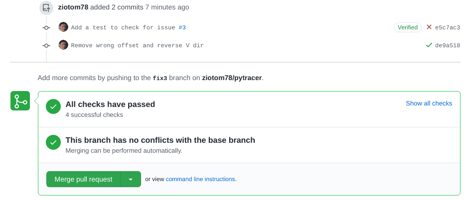
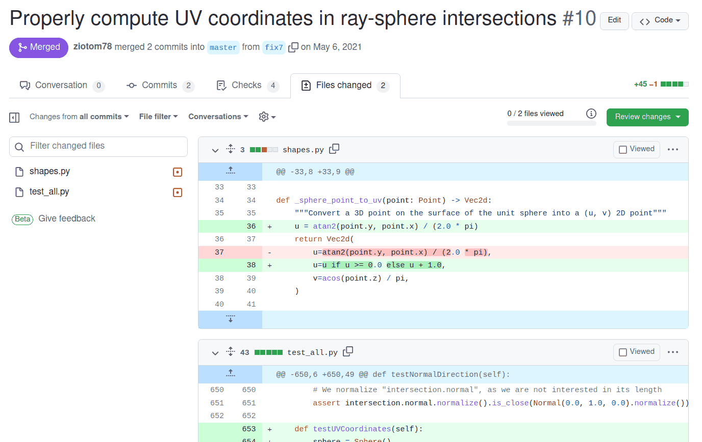
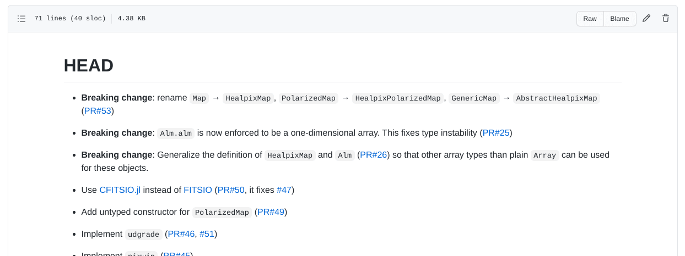
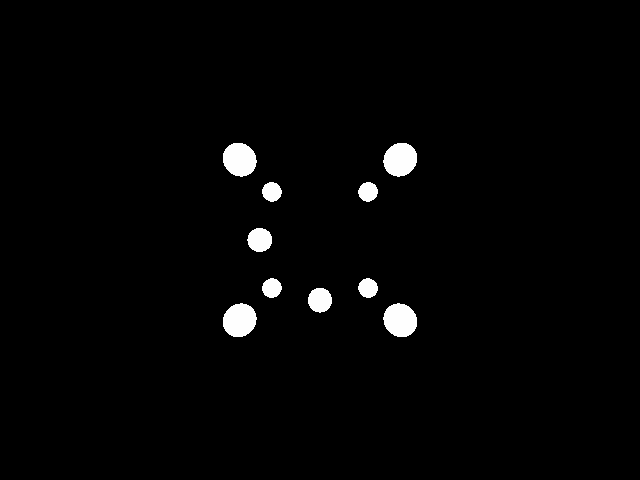

# Issues {#issues}

# A bug in the code!

-   Last week's Python code intentionally contained an error in the implementation of the `ImageTracer.fire_ray` method:

    ```python
    u = (col + u_pixel) / (self.image.width - 1)
    v = (row + v_pixel) / (self.image.height - 1)
    ```

-   The error lies in the fact that the rows in `HdrImage` are numbered from the *top*, not the *bottom*, while the $v$ coordinate increases *upwards*. In the second line, however, the variable `v` increases as `row` increases: this is wrong!

# What to do with bugs

-   The existence of this bug causes a vertical flip of the images: the top and bottom are swapped!

-   Yet we implemented tests!

-   Why didn't we notice?


# Tests from last lesson

```python
# These were the tests we implemented last week
image = HdrImage(width=4, height=2)
camera = PerspectiveCamera(aspect_ratio=2)
tracer = ImageTracer(image=image, camera=camera)

# Here we check that "u_pixel" and "v_pixel" do what they're supposed to do
ray1 = tracer.fire_ray(0, 0, u_pixel=2.5, v_pixel=1.5)
ray2 = tracer.fire_ray(2, 1, u_pixel=0.5, v_pixel=0.5)
assert ray1.is_close(ray2)

# Here we check that all pixels have been visited at least once
tracer.fire_all_rays(lambda ray: Color(1.0, 2.0, 3.0))
for row in range(image.height):
    for col in range(image.width):
        assert image.get_pixel(col, row) == Color(1.0, 2.0, 3.0)
```


# Incomplete Tests

-   Our tests did not verify the correct orientation of the image: they were **incomplete**.

-   This kind of problem is common even in professional projects: there is a potential error condition that the tests do not cover, which is therefore not discovered during implementation.

-   Today we will see the right way to correct the error; in the next theory lesson we will discuss "debugging" at a higher level.


# Correcting a Bug

Corrections in a public repository like GitHub require these steps:

#.   Report the problem on GitHub by opening an *issue* (synonyms: *bug report* or *ticket*). The issue will be assigned a unique number, e.g. #156.

#.   Create a branch in the repository, calling it for example `fix156`.

#.   Modify the tests so that they highlight the error: once implemented, these new tests must obviously fail.

#.   Only once the new tests are implemented can the bug be fixed.

#.   When the new tests pass, open a PR linked to the branch, and if everything works (including the *CI builds*) update the `CHANGELOG`, merge, and close the *issue*.


# Opening an *Issue*

<iframe src="https://player.vimeo.com/video/544935196?badge=0&amp;autopause=0&amp;player_id=0&amp;app_id=58479" width="672" height="640" frameborder="0" allow="autoplay; fullscreen; picture-in-picture" allowfullscreen title="How to open a new issue in GitHub"></iframe>

# Creating a New Test

-   The test we had written for `ImageTracer` was not exhaustive…

-   …but it was already quite complex, because it verified two distinct things:

    #.   The correctness of the handling of `u_pixel` and `v_pixel`

    #.   The fact that `ImageTracer.fire_all_rays` was able to "visit" all the pixels of the image.

-   It is not advisable to add material to this test, otherwise if it fails in the future it would be less immediate to understand *where* the problem lies.

# Work to Do

-   What we will do now is divide the test into three sub-tests:

    #.  The two existing checks, which however must be divided into two distinct tests;
    #.  A new test that fails due to the bug we highlighted.

-   In implementing this test in Python, I used a feature of the testing framework (`unittest`) that probably also exists in your frameworks.


# Inelegant Repetitions

```python
def test_uv_sub_mapping():
    # Create the objects to test
    image = HdrImage(width=4, height=2)
    camera = PerspectiveCamera(aspect_ratio=2)
    tracer = ImageTracer(image=image, camera=camera)

    ray1 = tracer.fire_ray(0, 0, u_pixel=2.5, v_pixel=1.5)
    ray2 = tracer.fire_ray(2, 1, u_pixel=0.5, v_pixel=0.5)
    assert ray1.is_close(ray2)

def test_image_coverage():
    # Create the objects to test (same as above)
    image = HdrImage(width=4, height=2)
    camera = PerspectiveCamera(aspect_ratio=2)
    tracer = ImageTracer(image=image, camera=camera)

    tracer.fire_all_rays(lambda ray: Color(1.0, 2.0, 3.0))
    for row in range(image.height):
        for col in range(image.width):
            assert image.get_pixel(col, row) == Color(1.0, 2.0, 3.0)
```

# *Set-up* e *tear-down*

-   The inelegance lies in the fact that we must create the `image`, `camera`, and `tracer` objects in every test.

-   Test frameworks (not all 🙁) usually provide the ability to invoke *set-up* procedures to create the objects on which the tests are then executed.

-   (Similarly, these frameworks also implement the ability to invoke *tear-down* procedures at the end of the tests, for example to delete temporary files created during the tests themselves).

---


```python
class TestImageTracer(unittest.TestCase):
    # This is invoked automatically whenever you run `pytest`
    def setUp(self):
        self.image = HdrImage(width=4, height=2)
        self.camera = PerspectiveCamera(aspect_ratio=2)
        self.tracer = ImageTracer(image=self.image, camera=self.camera)

    def test_orientation(self):
        # Fire a ray against top-left corner of the screen
        top_left_ray = self.tracer.fire_ray(0, 0, u_pixel=0.0, v_pixel=0.0)
        assert Point(0.0, 2.0, 1.0).is_close(top_left_ray.at(1.0))

        # Fire a ray against bottom-right corner of the screen
        bottom_right_ray = self.tracer.fire_ray(3, 1, u_pixel=1.0, v_pixel=1.0)
        assert Point(0.0, -2.0, -1.0).is_close(bottom_right_ray.at(1.0))

    def test_uv_sub_mapping(self):
        ray1 = self.tracer.fire_ray(0, 0, u_pixel=2.5, v_pixel=1.5)
        ray2 = self.tracer.fire_ray(2, 1, u_pixel=0.5, v_pixel=0.5)
        assert ray1.is_close(ray2)

    def test_image_coverage(self):
        self.tracer.fire_all_rays(lambda ray: Color(1.0, 2.0, 3.0))
        for row in range(self.image.height):
            for col in range(self.image.width):
                assert self.image.get_pixel(col, row) == Color(1.0, 2.0, 3.0)
```

# Creating a PR

<center>{height=560px}</center>

# Correcting a bug

-   These are the correct instructions to use in `ImageTracer.fire_ray`:

    ```python
    u = (col + u_pixel) / self.image.width
    v = 1.0 - (row + v_pixel) / self.image.height
    ```

-   If we commit this, the test will now pass:

    <center>{height=280px}</center>

# Bug Closure

-   At this point the bug is fixed, and we can proceed to close the *issue*.

-   It is very important, however, to first take a general look at the PR to verify that it is clearly legible.  In particular, select the *Files changed* tab and read it critically:

    1.  Are the files being modified the ones I expect, or are there other changes that I was working on when the bug was discovered? (See [this example](https://github.com/litebird/litebird_sim/pull/232)).

    2.  Will those who see these changes be able to understand them without reading the entire codebase?

-   Avoid including «gratuitous» changes…

---

<center>{height=680px}</center>

Example taken from a PR of [pytracer](https://github.com/ziotom78/pytracer/pull/10/files)

# Closing a bug

<iframe src="https://player.vimeo.com/video/544950712?badge=0&amp;autopause=0&amp;player_id=0&amp;app_id=58479" width="672" height="640" frameborder="0" allow="autoplay; fullscreen; picture-in-picture" allowfullscreen title="How to close an issue in GitHub"></iframe>

# Bug Tracking

-   GitHub tracks a repository's bugs on a dedicated page: you can see which bugs are open and which have been closed.

-   But, as with *commits*, a list of bugs is quite poor, and doesn't tell a "story."

-   Let's see now the purpose of the CHANGELOG.md file, which is a form of documentation.

# CHANGELOG {#changelog}

-   All public repositories should have a `CHANGELOG`/`NEWS`/`HISTORY`/… file, which lists the bugs fixed and the new features of the code, listed by version number.

-   See for example the [`HISTORY.md`](https://github.com/JuliaLang/julia/blob/master/HISTORY.md) file of the Julia compiler

# CHANGELOG

-   In a `CHANGELOG` file you should indicate all the corrections and modifications made to the code.

-   No need to be verbose: one or two lines per change are sufficient, if you include the link to the *issue*/*pull request*

-   It should be written in **reverse chronological order**: the most recent changes are at the top. This makes it easier for the reader to see what's new in the latest version (which is likely the one they want to download).

-   It is usually divided into sections, one for each version of the code. The first section is usually called `HEAD`, and contains the corrections and modifications that will end up in the next future version of the code.


# CHANGELOG of [Healpix.jl](https://github.com/ziotom78/Healpix.jl)

<center></center>


# CHANGELOG of [pytracer](https://github.com/ziotom78/pytracer)

-   In the [pytracer](https://github.com/ziotom78/pytracer) repository there is a `CHANGELOG.md` file, written in Markdown, which you can use as inspiration. In particular, "our" bug appears like this:

    ```markdown
    …

    -   Fix an issue with the vertical order of the images [#4](https://github.com/ziotom78/pytracer/pull/4)

    # Version 0.1.0

    -   First release of the code
    ```

-   Remember from now on that **the last commit in a PR** should always be the update of `CHANGELOG.md`!


# Our “[black triangle](https://rampantgames.com/blog/?p=7745)”!

<center></center>

# Geometry

```{.asy im_fmt="html" im_opt="-f html" im_out="img,stdout,stderr" im_fname="first-image-geometry"}
size(0,100);
import three;
currentlight=Viewport;

// Spheres on the vertexes of the cube
draw(shift( 0.5,  0.5,  0.5) * scale3(0.1) * unitsphere, white);
draw(shift(-0.5,  0.5,  0.5) * scale3(0.1) * unitsphere, white);
draw(shift( 0.5, -0.5,  0.5) * scale3(0.1) * unitsphere, white);
draw(shift(-0.5, -0.5,  0.5) * scale3(0.1) * unitsphere, white);
draw(shift( 0.5,  0.5, -0.5) * scale3(0.1) * unitsphere, white);
draw(shift(-0.5,  0.5, -0.5) * scale3(0.1) * unitsphere, white);
draw(shift( 0.5, -0.5, -0.5) * scale3(0.1) * unitsphere, white);
draw(shift(-0.5, -0.5, -0.5) * scale3(0.1) * unitsphere, white);

// Two additional spheres
draw(shift( 0.0,  0.0, -0.5) * scale3(0.1) * unitsphere, white);
draw(shift( 0.0,  0.5,  0.0) * scale3(0.1) * unitsphere, white);

// A wireframe to suggest the structure of the cube
path3 square = (
    ( 0.5,  0.5,  0.0) --
    (-0.5,  0.5,  0.0) --
    (-0.5, -0.5,  0.0) --
    ( 0.5, -0.5,  0.0) -- cycle);

draw(shift(0.0, 0.0,  0.5) * square, black);
draw(shift(0.0, 0.0, -0.5) * square, black);
draw(rotate(90, X) * shift(0.0, 0.0,  0.5) * square, black);
draw(rotate(90, X) * shift(0.0, 0.0, -0.5) * square, black);
draw(rotate(90, Y) * shift(0.0, 0.0,  0.5) * square, black);
draw(rotate(90, Y) * shift(0.0, 0.0, -0.5) * square, black);

// The screen
path3 screen = ((-1, -1, -0.5) -- (-1, -1, 0.5) -- (-1, 1, 0.5) -- (-1, 1, -0.5) -- cycle);

draw(surface(screen), gray + opacity(0.7));

// The observer
triple observer_pos = (-2.0, 0.0, 0.0);
draw(shift(observer_pos) * scale3(0.05) * unitsphere, white);

draw(observer_pos -- (-1, -1, -0.5), gray);
draw(observer_pos -- (-1, -1,  0.5), gray);
draw(observer_pos -- (-1,  1,  0.5), gray);
draw(observer_pos -- (-1,  1, -0.5), gray);

// Axes
draw(O--1.5X, gray); //x-axis
draw(O--1.5Y, gray); //y-axis
draw(O--1.5Z, gray); //z-axis

label("$x$", 1.5X + 0.2Z);
label("$y$", 1.5Y + 0.2Z);
label("$z$", 1.5Z + 0.2X);
```

# Shapes

-   We need to implement shapes in our code.

-   For today, it is sufficient to implement a `Sphere` type; if you want, add also a `Plane` (it's very quick to add).

-   Create an abstract type `Shape`, which implements the (abstract) method `ray_intersection`. This accepts a `Ray` parameter and returns a `HitRecord` type. If your language supports it, you can make the return type *nullable* (intersection exists/doesn't exist).

# `Shape` in Python

```python
class Shape:
    def __init__(self, transformation=Transformation()):
        self.transformation = transformation

    def ray_intersection(self, ray: Ray) -> Optional[HitRecord]:
        return NotImplementedError(
            "Shape.ray_intersection is an abstract method and cannot be called directly"
        )
```

# `HitRecord`

-   To return information about an intersection, it's good practice to use a dedicated type: `HitRecord`.

-   This type should contain the following information:

    1.  `world_point`: 3D point where the intersection occurred (`Point`);
    2.  `normal`: surface normal at the intersection (`Normal`);
    3.  `surface_point`: $(u, v)$ coordinates of the intersection (new type `Vec2d`);
    4.  `t`: ray parameter associated with the intersection;
    5.  `ray`: the light ray that caused the intersection.

-   For testing, it's helpful if it implements an `is_close`/`are_close` method.

# `Sphere` in Python

-   The number of intersections between the ray $O + t \vec d$ and the sphere depends on the sign of

    $$
    \frac\Delta4 = \left(\vec O \cdot \vec d\right)^2 - \left\|\vec d\right\|^2\cdot \left(\left\|\vec O\right\|^2 - 1\right).
    $$

-   If $\Delta > 0$, the two intersections are

    $$
    t = \begin{cases}
    t_1 &= \frac{-\vec O \cdot d - \sqrt{\Delta / 4}}{\left\|\vec d\right\|^2},\\
    t_2 &= \frac{-\vec O \cdot d + \sqrt{\Delta / 4}}{\left\|\vec d\right\|^2}.
    \end{cases}
    $$

# `Sphere` in Python

-   You must **inverse transform** the ray before calculating the intersection:

    ```python
    def ray_intersection(self, ray: Ray) -> Optional[HitRecord]:
        inv_ray = ray.transform(self.transformation.inverse())
        # ...
    ```

-   Once you have calculated `t1` and `t2`, you must determine which of the two intersections is closest to the ray origin:

    ```python
    if (t1 > inv_ray.tmin) and (t1 < inv_ray.tmax):
        first_hit_t = t1
    elif (t2 > inv_ray.tmin) and (t2 < inv_ray.tmax):
        first_hit_t = t2
    else:
        return None   # The ray missed the sphere
    ```

# Normals and UV Coordinates

-   You must implement the calculation of the normal at the intersection point; in the [pytracer](https://github.com/ziotom78/pytracer/blob/d12284d0c60965e48b004a305d6ba8e28c13f757/shapes.py#L42-L51) code this is done inside `_sphere_normal`:

    ```python
    def _sphere_normal(point: Point, ray_dir: Vec) -> Normal:
        result = Normal(point.x, point.y, point.z)
        return result if (point.to_vec().dot(ray_dir) < 0.0) else -result
    ```

-   You also need code that calculates the intersection point on the sphere's surface, in $(u, v)$ coordinates, for which a new `Vec2d` type is useful:

    ```python
    def _sphere_point_to_uv(point: Point) -> Vec2d:
        u = atan2(point.y, point.x) / (2.0 * pi)
        return Vec2d(u=u if u >= 0.0 else u + 1.0, v=acos(point.z) / pi)
    ```

# Creating `HitRecord`

```python
hit_point = inv_ray.at(first_hit_t)
return HitRecord(
    world_point=self.transformation * hit_point,
    normal=self.transformation * _sphere_normal(hit_point, ray.dir),
    surface_point=_sphere_point_to_uv(hit_point),
    t=first_hit_t,
    ray=ray,
)
```

# Tests for `Sphere` (1/2)

-   The ray with $O = (0, 0, 2)$ and $\vec d = -\hat e_z$ must intersect the unit sphere at point $P = (0, 0, 1)$ with normal $\hat n = \hat e_z$.
-   The ray with $O = (3, 0, 0)$ and $\vec d = -\hat e_x$ must intersect the unit sphere at point $P = (1, 0, 0)$ with normal $\hat n = \hat e_x$.
-   The ray with $O = (0, 0, 0)$ and $\vec d = \hat e_x$ must intersect the unit sphere at $P = (1, 0, 0)$ with normal $\hat n = -\hat e_x$ (the ray is *inside* the sphere).

In all these cases, also verify the $(u, v)$ coordinates and the value of $t$.

# Tests for `Sphere` (2/2)

-   Apply a translation $\vec t = (10, 0, 0)$ to the sphere and intersect it with the ray with $O = (10, 0, 2)$ and $\vec d = -\hat e_z$.
-   Intersect the same translated sphere with the ray with $O = (13, 0, 0)$ and $\vec d = -\hat e_x$. The intersection should be $P = (11, 0, 0)$ with normal $\hat n = \hat e_x$.
-   Verify that there are no potential intersections with the **untranslated** sphere, using these rays:
    1. Ray with $O = (0, 0, 2)$ and $\vec d = -\hat e_z$;
    2. Ray with $O = (-10, 0, 0)$ and $\vec d = -\hat e_z$;

In all these cases, also verify the $(u, v)$ coordinates and the value of $t$.

# The `World` Type

-   A scene is composed of many shapes.
-   We need a type to contain this list of shapes: the `World` type.
-   It must maintain a list of `Shape` objects: take care to declare this list correctly, as some languages may require special care for lists of abstract objects (e.g., a [trait object vector](https://doc.rust-lang.org/book/ch17-02-trait-objects.html) in Rust).
-   It must implement a `ray_intersection` method that iterates over the shapes, searches for intersections, and returns the one closest to the ray origin.

# `World` in Python

```python
class World:
    def __init__(self):
        self.shapes = []

    def add(self, shape: Shape):
        self.shapes.append(shape)

    def ray_intersection(self, ray: Ray) -> Optional[HitRecord]:
        closest = None  # "closest" should be a nullable type!
        for shape in self.shapes:
            intersection = shape.ray_intersection(ray)

            if not intersection:
                continue

            if (not closest) or (intersection.t < closest.t):
                closest = intersection

        return closest
```

# Our demo

<center></center>

The asymmetry in the arrangement of the spheres allows for the identification of errors in the ordering of the rows/columns of the image.

# The Scene

-   Position the spheres at the vertices of the cube with edges $(\pm 0.5, \pm 0.5, \pm 0.5)$.
-   Each sphere must have a radius of 1/10.
-   The observer should be moved by $-\hat e_x$, meaning their position should be $(-2, 0, 0)$ and the center of the screen $(-1, 0, 0)$.
-   Choose whether to use `OrthogonalCamera` or `PerspectiveCamera`.

# The `main`

-   Our `main` has so far been able to convert a PFM image into another format (PNG, JPEG, WebP, etc.)
-   We must now change the program's interface so that it allows the use of two modes:
    #.  Conversion from PFM to other formats (the old mode);
    #.  A new `demo` mode, where it generates the image described above.

# Example in Python

-   In Python, I used the Click library, which allows building command-line user interfaces that support so-called *actions* (other libraries call them *verbs*).

-   After the executable name, a command should be provided, optionally followed by parameters:

    ```text
    ./main.py pfm2png input.pfm output.png
    ./main.py demo --width=480 --height=480
    ./main.py --help
    ...
    ```

---

<asciinema-player src="cast/python-click-cli-example-88x27.cast" cols="88" rows="27" font-size="medium"></asciinema-player>

# Possible Interfaces

-   *Actions* exactly like Click (if your library supports them);

-   Two separate executables: `demo` and `pfm2png`

-   Requesting input from the terminal (not recommended):

    ```python
    print("What do you want to do? (demo/pfm2png)")
    choice = input(choice)
    if choice == "demo":
        # …
    ```
-   Et cetera…

# `demo` Command

1.  Initialize a `World` object with the 10 spheres in the indicated positions;
2.  Create an `OrthogonalCamera` or `PerspectiveCamera` object ([pytracer](https://github.com/ziotom78/pytracer/blob/d12284d0c60965e48b004a305d6ba8e28c13f757/main.py#L125-L130) allows the user to choose);
3.  (Optional) You can try rotating the observer to obtain more interesting angles (see below);
4.  Create an `ImageTracer` object;
5.  Perform image tracing, using an "on/off" criterion (see next slide);
6.  Save the PFM image;
7.  (Optional) Immediately convert the image to PNG using default values for tone-mapping.

# On-Off Tracing

-   An on/off ray-tracer checks if the ray has hit a surface, and if so, colors the pixel with an arbitrary color (white), otherwise it colors it with the background color (black).

-   In our case, it is sufficient to invoke `fire_all_rays` by passing a one-line function as an argument:

    ```python
    tracer.fire_all_rays(lambda ray: WHITE if world.ray_intersection(ray) else BLACK)
    ```

# Animations

-   In `demo` mode, the Python code allows modifying the orientation of the observer relative to the axes using the `--angle-deg` flag.

-   This can be used to generate animations through simple Bash scripts:

    ```sh
    for angle in $(seq 0 359); do
        # Angle with three digits, e.g. angle="1" → angleNNN="001"
        angleNNN=$(printf "%03d" $angle)
        ./main.py demo --width=640 --height=480 --angle-deg $angle --output=img$angleNNN.png
    done

    # -r 25: Number of frames per second
    ffmpeg -r 25 -f image2 -s 640x480 -i img%03d.png \
        -vcodec libx264 -pix_fmt yuv420p \
        spheres-perspective.mp4
    ```

# Perspective Projection

<video src="./media/spheres-perspective.mp4" width="640px" height="480px" controls loop autoplay/>

# Orthogonal Projection

<video src="./media/spheres-orthogonal.mp4" width="640px" height="480px" controls loop autoplay/>

# What to do today

# What to do today

1.  Fix the bug from last time by opening an *issue*;
2.  Create a `CHANGELOG.md` file;
3.  Work on a new `demo` branch;
4.  Create the `Shape`, `Sphere`, `World`, `Vec2d` types;
5.  Implement the `demo` command, in the way you prefer (you can look for a library to interpret the command line);
6.  Open a PR and update the `CHANGELOG.md` file.

---
title: "Esercitazione 8"
subtitle: "Calcolo numerico per la generazione di immagini fotorealistiche"
author: "Maurizio Tomasi <maurizio.tomasi@unimi.it>"
...
