<center>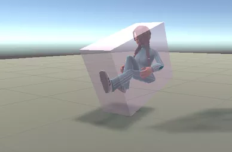{height=540px}</center>

# Utilità degli AABB

-   Gli AABB sono utili solo per scene complesse, formate da molti oggetti non banali. Per scene semplici possono al contrario **rallentare** il rendering.

-   Sono però molto utili con le *mesh* di triangoli e con oggetti CSG complessi.

-   Se voleste supportare gli AABB nel vostro ray-tracer, dovreste aggiungere al tipo `Shape` un membro `aabb` da usare all'interno di `Shape.rayIntersection`:

    ```python
    class MyComplexShape:
        # ...
        def rayIntersection(self, ray: Ray) -> Union[HitRecord, None]:
            inv_ray = ray.transform(self.transformation.inverse())
            if not self.aabb.quickRayIntersection(inv_ray):
                return None
                
            # etc.
    ```


# Triangoli e *mesh* di triangoli

# Modellizzazione 3D

<center>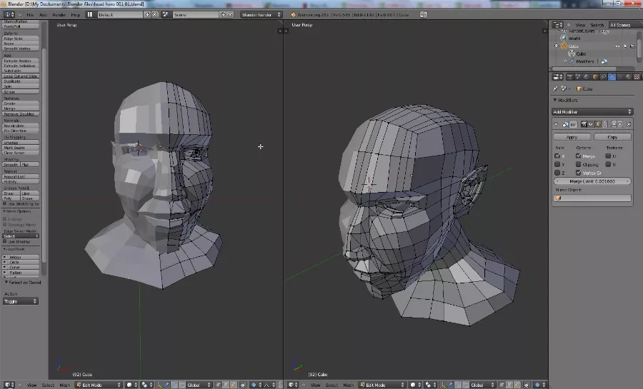</center>

# Scanner 3D

<center></center>

# Scanner 3D

<center> 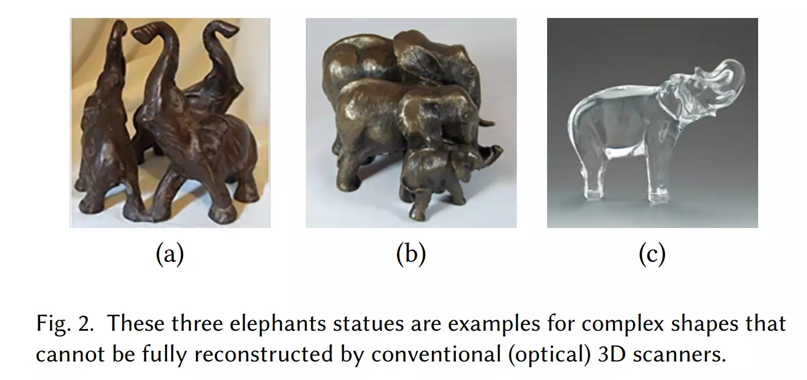 </center>

# [Scanner 3D a liquidi](https://doi.org/10.1145/3072959.3073693)

<center> 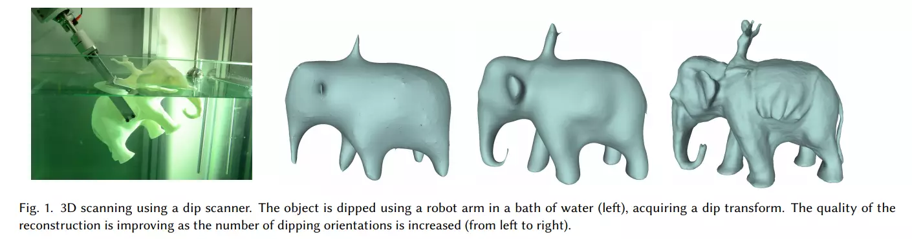 </center>

# [Scanner 3D a liquidi](https://doi.org/10.1145/3072959.3073693)

<center>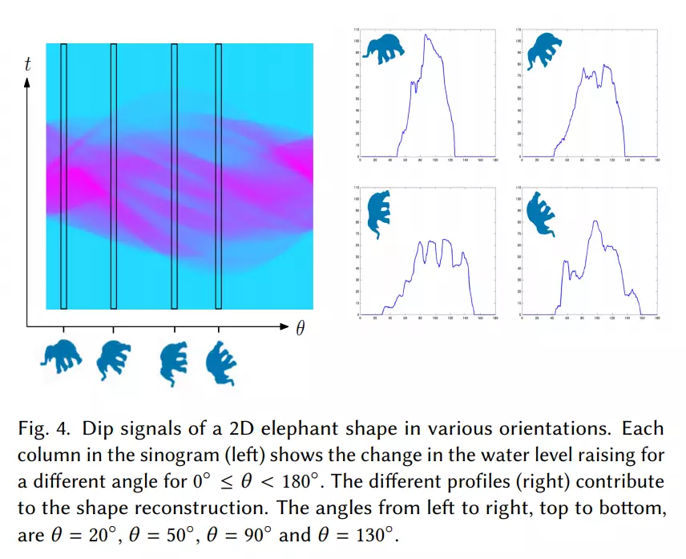{height=560px}</center>

# Stanford bunny (1994)

<center>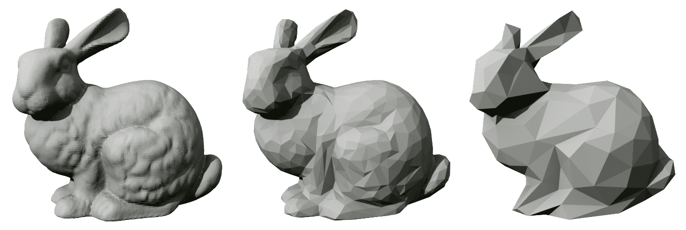</center>

(Modello ottenuto dalla scansione di una statuetta di ceramica)

# Triangoli

I triangoli sono la forma geometrica più usata nei programmi di modellizzazione e rendering 3D, per le molte loro proprietà:

#. Sono la superficie piana con il minor numero di vertici (→ efficienti da memorizzare).
#. La loro rappresentazione nello spazio è univoca (per tre punti passa uno e un solo triangolo planare).
#. La loro superficie è parametrizzabile in coordinate $(u, v)$ in forma molto semplice.
#. Superfici complesse possono essere rappresentate come unione di più triangoli.


# Coordinate baricentriche

-   Le coordinate baricentriche sono state proposte da Möbius nel 1827, ed esprimono i punti di un piano passante per i punti $A, B, C$ mediante l'espressione

    $$
    P(\alpha, \beta, \gamma) = \alpha A + \beta B + \gamma C,
    $$
    
    dove $\alpha, \beta, \gamma \in \mathbb{R}$ sono le *coordinate baricentriche*.
    
-   Le coordinate baricentriche risultano molto utili per caratterizzare il triangolo di vertici $A, B, C$: il punto $P$ è interno al triangolo se e solo se

    $$
    0 \le \alpha \le 1,\quad 0 \le \beta \le 1,\quad 0 \le \gamma \le 1, \quad \alpha + \beta + \gamma = 1.
    $$

# Coordinate nei triangoli
    
-   La condizione $\alpha + \beta + \gamma = 1$ fa sì che i punti di un triangolo siano caratterizzati da due gradi di libertà, come dev'essere per una superficie bidimensionale.
    
-   L'uguaglianza nelle prime tre disequazioni vale per i punti lungo il bordo del triangolo.

-   Usando l'ultima uguaglianza, si ottiene una forma più significativa:

    $$
    P(\beta, \gamma) = A + \beta(B - A) + \gamma(C - A).
    $$

---

<center>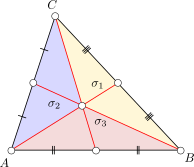{height=640px}</center>

# Coordinate nei triangoli

-   Si può dimostrare che le coordinate baricentriche di un punto $P$ sono legate all'area $A$ del triangolo e alle aree dei tre sotto-triangoli aventi come vertice il punto $P$ e due dei vertici:

    $$
    \alpha = \frac{\sigma_1}\sigma = 1 - \frac{\sigma_2 + \sigma_3}\sigma, \quad \beta = \frac{\sigma_2}\sigma, \quad \gamma = \frac{\sigma_3}\sigma.
    $$
    
-   Se si assegna segno negativo alle aree che sono fuori dal triangolo, queste equazioni valgono per qualsiasi punto sul piano in cui giace il triangolo.
    
# Esempio interattivo { data-state="barycentric-coordinates-demo" }

<center>
    <canvas
        id="barycentric-coordinates-canvas"
        width="620px"
        height="480px"
        style="left:0px;top:0px;cursor:crosshair;border:1px solid black;"/>
</center>

<script type="text/javascript" src="./js/barycentric-coordinates.js"></script>

# Intersezione con raggi

-   Vediamo ora come usare le coordinate baricentriche per calcolare efficientemente l'intersezione tra un triangolo e un raggio.

-   A differenza di quanto fatto con le sfere e i piani, in questo caso non adotteremo un sistema di riferimento semplificato. Il motivo sarà chiaro quando spiegheremo le *mesh* di triangoli.

-   Identificheremo quindi un triangolo tramite le coordinate dei tre punti $A, B, C$ (nove valori floating-point).

# Il problema analitico

-   Consideriamo il raggio $r(t): O + t \vec d$ e il punto generico $P(\beta, \gamma)$ del triangolo. L'intersezione è data da

    $$
    A + \beta (B - A) + \gamma (C - A) = O + t \vec d,
    $$
    
    con il vincolo $0 \leq \beta, \gamma \leq 1$.
    
-   Riordiniamo l'equazione in modo da spostare le tre incognite $\beta$, $\gamma$ e $t$ sulla sinistra:

    $$
    \beta (B - A) + \gamma (C - A) - t \vec d = O - A.
    $$


# Forma matriciale

-   L'equazione che abbiamo ottenuto è

    $$
    \beta (B - A) + \gamma (C - A) - t \vec d = O - A,
    $$
    
    che è un'equazione vettoriale nelle tre componenti $x, y, z$.
    
-   In forma matriciale, il sistema si riscrive così:
    
    $$
    \begin{pmatrix}
    b_x - a_x& c_x - a_x& d_x\\
    b_y - a_y& c_y - a_y& d_y\\
    b_z - a_z& c_z - a_z& d_z\\
    \end{pmatrix}
    \begin{pmatrix}
    \beta\\\gamma\\t
    \end{pmatrix}
    =
    \begin{pmatrix}
    o_x - a_x\\o_y - a_y\\o_z - a_z
    \end{pmatrix}.
    $$

# Soluzione analitica

-   La soluzione dipende dal determinante della matrice M:

    $$
    \det M = \det
    \begin{pmatrix}
    b_x - a_x& c_x - a_x& d_x\\
    b_y - a_y& c_y - a_y& d_y\\
    b_z - a_z& c_z - a_z& d_z\\
    \end{pmatrix},
    $$
    
    che deve essere diverso da zero, altrimenti il raggio è parallelo al piano del triangolo.
    
-   La soluzione si ottiene facilmente con la [regola di Cramer](https://en.wikipedia.org/wiki/Cramer%27s_rule), che è inefficiente nel caso generale ma adeguata per matrici 3×3 come è il caso qui.

# Soluzione analitica

-   Ovviamente, una volta ottenuta la soluzione è necessario verificare che 

    $$
    t_\text{min} < t < t_\text{max}, \quad 0 \leq \beta \leq 1, \quad 0 \leq \gamma \leq 1.
    $$
    
-   La normale del triangolo si può ottenere facilmente dal prodotto vettoriale tra i due vettori allineati con i lati:

    $$
    \hat n = \pm (B - A) \times (C - A),
    $$
    
    dove il segno è determinato dalla direzione del raggio.
    
-   Le coordinate $(u, v)$ possono essere poste uguali a $(\beta, \gamma)$.


# *Mesh* di triangoli

---

<iframe src="https://player.vimeo.com/video/517979969?badge=0&amp;autopause=0&amp;player_id=0&amp;app_id=58479" width="1934" height="810" frameborder="0" allow="autoplay; fullscreen; picture-in-picture" allowfullscreen title="Moana (Clements, Musker, Hall, Williams) Beach scene (no sound)"></iframe>

# [*Moana island scene*](https://www.disneyanimation.com/resources/moana-island-scene/)

<center>

</center>

# [*Moana island scene*](https://www.disneyanimation.com/resources/moana-island-scene/)

<center>

</center>

# [*Tamstorf & Pritchett (EGSR 2019)*](https://disneyanimation.com/publications/the-challenges-of-releasing-the-moana-island-scene/)

<center>
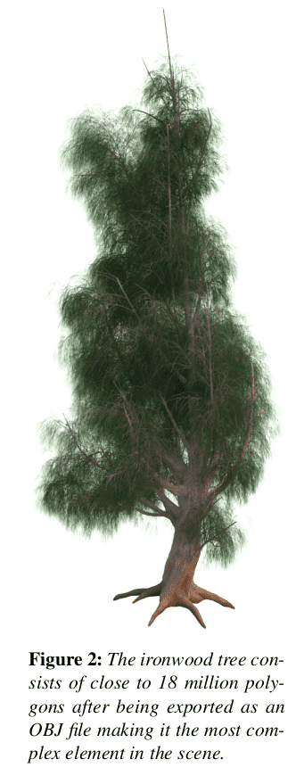{height=640px}
</center>

# *Mesh* di triangoli

-   Le scene viste nelle slide precedenti sono formate dalla combinazione di molte forme semplici.

-   Mantenere in memoria una lista di forme semplici richiede una serie di accorgimenti non banali.

-   Oggi discuteremo delle *mesh* di triangoli, in cui la forma elementare è appunto un triangolo planare.

# Memorizzare triangoli

-   Abbiamo visto come implementare il codice per calcolare l'intersezione tra raggio e triangolo nel caso generale in cui il triangolo sia codificato tramite i suoi tre vertici $A$, $B$ e $C$.

-   Non abbiamo seguito l'approccio usato per sfere e piani di scegliere una forma «standard» (es., un triangolo sul piano $xy$), perché questo avrebbe richiesto di memorizzare una trasformazione 4×4 e la sua inversa, per un totale di 32 numeri floating-point (128 bytes a precisione singola).

-   Memorizzare le tre coordinate di un triangolo richiede solo 3×3×4 = 36 byte…

-   …ma si può fare di meglio!

# Memorizzazione di *mesh*

-   In una *mesh* di triangoli si memorizzano i vertici in una lista ordinata $P_k$, con $k = 1\ldots N$.

-   I triangoli sono rappresentati da una terna di indici interi $i_1, i_2, i_3$ che rappresenta la posizione dei vertici $P_{i_1}, P_{i_2}, P_{i_3}$ nella lista ordinata.

-   Se si usano numeri interi a 32 bit per memorizzare gli indici, ogni triangolo richiede 3×4 = 12 bytes.

-   Questo è vantaggioso se un vertice è condiviso da più triangoli, che è il caso generale.

---

<center></center>

---

<iframe src="https://player.vimeo.com/video/546494716?badge=0&amp;autopause=0&amp;player_id=0&amp;app_id=58479" width="1102" height="620" frameborder="0" allow="autoplay; fullscreen; picture-in-picture" allowfullscreen title="Wireframe models in Blender"></iframe>

Modello: 44.000 vertici, 80.000 triangoli.

# Normali

-   Un triangolo è una superficie piana, ed ogni punto della sua superficie possiede quindi la medesima normale $\hat n$.

-   Nel caso di *mesh* di triangoli, si possono usare le coordinate baricentriche del triangolo per simulare una superficie liscia.

-   Ricordiamo che le tre coordinate baricentriche sono definite in modo che la loro somma sia normalizzata:

    $$
    \alpha + \beta + \gamma = 1.
    $$
    
# Smooth shading
    
-   Se una *mesh* di triangoli è il risultato dell'approssimazione di una superficie liscia, nel momento in cui si approssima la superficie occorre quindi calcolare sia i vertici dei triangoli che le normali.

-   Ogni normale è associata a un punto, e viene mantenuta in una lista separata.

-   In corrispondenza di un punto $P$ definito da $\alpha, \beta, \gamma$ si può assegnare la normale

    $$
    \hat n_P = \alpha \hat n_1 + \beta \hat n_2 + \gamma \hat n_3.
    $$

---

<iframe src="https://player.vimeo.com/video/546515481?badge=0&amp;autopause=0&amp;player_id=0&amp;app_id=58479" width="1138" height="640" frameborder="0" allow="autoplay; fullscreen; picture-in-picture" allowfullscreen title="Flat and smooth shading in Blender"></iframe>

# Coordinate $(u, v)$

-   Nel caso di una mesh ci sono infiniti modi possibili per creare una mappatura $(u, v)$ sulla superficie.

-   Nelle *mesh* si fa in modo che ogni triangolo copra una porzione specifica dell'intero spazio $[0, 1] \times [0, 1]$.

-   Programmi di modellizzazione 3D come Blender permettono di modificare la mappatura $(u, v)$ di ogni triangolo.

---

<center>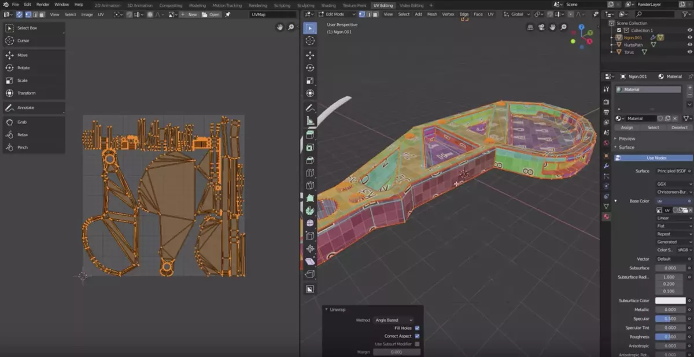</center>

# [Wavefront OBJ](https://en.wikipedia.org/wiki/Wavefront_.obj_file)

-   È un formato molto semplice da caricare e utilizzato per memorizzare mesh (non solo di triangoli).

-   Esempio (inizio del modello `minicooper.obj`):

    ```text
    # Vertexes
    v  20.851225 -39.649834 32.571609
    v  20.720263 -39.659435 32.675613
    v  20.589304 -39.649834 32.571609
    …
    # Normals
    vn  -0.000006 38.811405 3.583478
    vn  -0.000006 38.811405 3.583478
    vn  -0.000006 38.811405 3.583478
    …
    # Triangles («faces»)
    f 3//3 2//2 1//1
    f 4//4 3//3 1//1
    f 5//5 4//4 1//1
    ```

# File OBJ

-   Sotto Linux potete installare `openctm-tools`.

-   Il comando `ctmviewer NOMEFILE` visualizza un file OBJ in una finestra interattiva.

-   Il sito di [J. Burkardt](https://people.sc.fsu.edu/~jburkardt/data/obj/obj.html) contiene molti file OBJ scaricabili liberamente (il modello della Mini Cooper è preso da lì).

# Intersezione con raggi

-   Il calcolo dell'intersezione tra una *mesh* e un raggio non è semplice da implementare.

-   Il problema è che gran parte del tempo richiesto per calcolare la soluzione dell'equazione del rendering viene speso per l'intersezione tra raggi e forme.

-   All'aumentare delle forme aumenta necessariamente anche il tempo di calcolo.


---

<center>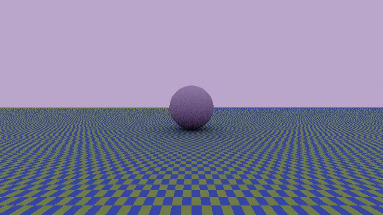</center>

Questa immagine contiene tre forme geometriche (due piani e una sfera), ed è stata calcolata in ~156 secondi.

# Intersezione con *mesh*

-   Il tempo necessario per il calcolo di un'immagine è all'incirca proporzionale al numero di intersezioni tra raggi e forme.

-   Se nell'immagine precedente ci fosse uno degli alberi di *Oceania* (18 milioni di triangoli), il tempo scalerebbe di conseguenza, e sarebbe dell'ordine di 93 anni anziché 156 secondi.

-   Ovviamente ciò non è accettabile, ma esistono tecniche di ottimizzazione che consentono di ridurre molto il numero di intersezioni da calcolare.

# AABB e *mesh*

-   Gli AABB sono perfetti per essere applicati a *mesh* di triangoli. (In questo caso non si applicano ovviamente ai **singoli** triangoli, ma alla *mesh* nel suo complesso).

-   Al momento del caricamento di una *mesh*, si può calcolare il suo AABB calcolando il valore minimo e il valore massimo delle coordinate di tutti i vertici.

-   Nel caso dell'albero di *Oceania*, l'intersezione tra un raggio e i 18 milioni di triangoli avverebbe solo per quei raggi effettivamente orientati verso quell'albero.

---

<center>{height=540px}</center>

# Oltre le AABB

-   Non è però sempre sufficiente usare gli AABB per le *mesh* di triangoli.

-   Sovente le scene sono occupate quasi completamente da un oggetto complesso, e in questo caso gli AABB non portano alcun vantaggio (è il caso dell'immagine precedente).

-   È però possibile basarsi sull'idea degli AABB per implementare ottimizzazioni più sofisticate.

-   Vedremo ora i KD-tree, una tecnica particolarmente efficiente.

# KD-tree

-   I KD-tree sono un'applicazione particolare di una famiglia più ampia di algoritmi, chiamati *Binary Space Partitions* (BSP).

-   Gli algoritmo BSP sono usati per effettuare ricerche su domini spaziali; nel nostro caso, il problema è quello di ricercare l'eventuale triangolo nella *mesh* che intersechi un raggio dato.

-   I metodi BSP sono iterativi, e a ogni iterazione dimezzano il volume dello spazio da ricercare.

# Metodo di bisezione

-   Richiamiamo il metodo di bisezione con cui si ricercano gli zeri di una funzione, che si spiega nel corso di TNDS (II anno della triennale).

-   Data una funzione continua $f: [a, b] \rightarrow \mathbb{R}$ tale che $f(a) \cdot f(b) \leq 0$, il teorema degli zeri garantisce che $\exists x \in [a, b]: f(x) = 0$.

-   Il metodo di bisezione consiste nel dividere l'intervallo $[a, b]$ in due parti $[a, c]$ e $[c, b]$, con $c = (a + b)/2$, e applicare il metodo al sottointervallo in cui il teorema degli zeri vale ancora.

-   Si può dimostrare che per ottenere una precisione $\epsilon$ nella stima dello zero servono $N = \log_2 (b - a)/\epsilon$ passaggi, ossia $O(\log N)$: è molto efficiente!

# Metodi BSP

-   I metodi BSP racchiudono tutte le forme di un mondo in un bounding box, quindi lo dividono in due regioni, partizionando le forme nell'una o nell'altra metà (o in entrambe, se sono lungo la suddivisione).

-   Questa suddivisione viene ripetuta ricorsivamente fino a una certa profondità: idealmente, finché le bounding box non contengono un certo numero (piccolo) di oggetti.

-   I KD-tree sono un tipo di BSP in cui i bounding box sono i ben noti AABB.

-   I KD-tree sono spiegati (e implementati!) nella [sezione 4.4 di *Physically based rendering*](https://www.pbr-book.org/3ed-2018/Primitives_and_Intersection_Acceleration/Kd-Tree_Accelerator) (Pharr, Jakob, Humphreys, terza ed.)

---

<center>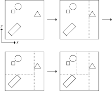{height=640px}</center>
[Figura 4.14 da *Physically based rendering* (Pharr, Jakob, Humphreys, terza ed.)]{style="float:right"}

# KD-tree e *mesh*

-   Questa è la procedura per costruire in memoria un KD-tree:

    #.  Si calcola l'AABB della *mesh*;

    #.  Si decide lungo quale direzione (x/y/z) effettuare la divisione;
    
    #.  Si partizionano i triangoli tra le due metà dell'AABB; quei triangoli che cadono lungo la linea di divisione vengono riportati in **entrambe** le metà;
    
    #.  Si ripete la procedura per ciascuna delle due metà finché il numero di triangoli in ogni comparto è inferiore a una certa soglia (per es., tra 1 e 10).

-   Tale procedura va fatta **una volta sola**, prima di risolvere l'equazione del rendering.


# KD-tree in memoria

-   Un KD-tree può essere memorizzato in modo efficiente usando una struttura ad albero, che viene costruita in fase di caricamento della *mesh*.

-   Per rappresentare le suddivisioni si può definire un tipo `KdTreeSplit`:

    ```python
    class KdTreeSplit:
        axis: int     # Index of the axis; 0: x, 1: y, 2: z
        split: float  # Location of the split along the axis
    ```
    
-   Il nodo generico dell'albero si rappresenta così:

    ```python
    class KdTreeNode:
        entry: Union[KdTreeSplit, List[int]]  # List[int]: List of indexes to triangles
        left: Union[KdTreeNode, None]
        right: Union[KdTreeNode, None]
    ```

---

<center>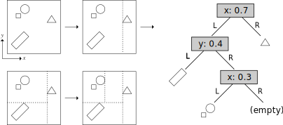{height=640px}</center>


# Intersezione con raggi

-   Per determinare se un raggio interseca una *mesh* ottimizzata con un KD-tree, basta seguire questa procedura:

    #.  Si verifica se il raggio interseca l'AABB; se non lo fa, il ciclo termina.
    #.  Si determina quale delle due metà viene attraversata per prima dal raggio:
        #.  Se solo una metà viene attraversata, si analizza solo quella;
        #.  Se entrambe, si analizza prima quella intersecata per valori minori di $t$.
    #.  Il processo continua finché non si arriva in un nodo terminale: a quel punto si analizzano tutti i triangoli nel nodo usando l'algoritmo lineare.

-   Si può dimostrare che questo processo richiede un tempo $O(\log N)$, dove $N$ è il numero di triangoli della *mesh*: è quindi un procedimento estremamente efficiente!

---

<center>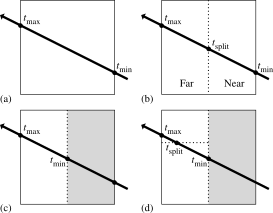{height=640px}</center>
[Figura 4.17 da *Physically based rendering* (Pharr, Jakob, Humphreys, terza ed.)]{style="float:right"}


# Dettagli

-   Per costruire un KD-tree occorre rispondere ad alcuni quesiti:

    #.  A ogni suddivisione, lungo quale asse è meglio effettuare la suddivisione? (L'asse lungo cui AABB è più esteso?)
    #.  In quale punto dell'asse conviene suddividere? (Il punto medio?)
    #.  Quando è meglio fermarsi? (Quando un nodo ha meno di *N* forme?)
    
-   Rispondere a queste domande non è banale, ma è importante trovare una soluzione *efficiente*!

-   Una soluzione ottimizzata può essere anche 1÷2 ordini di grandezza più veloce della soluzione banale suggerita qui sopra.


# Irregolarità delle *mesh*

<center>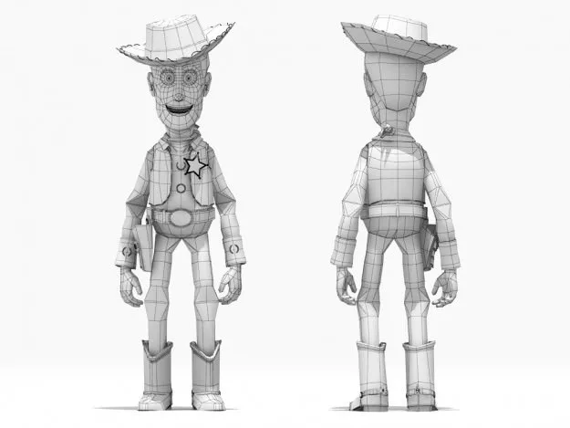</center>


# «Costo» di un KD-tree

-   Per costruire un KD-tree efficiente occorre valutare il *costo computazionale* dell'albero, che è dato da

    $$
    C(t) = C_\text{trav} + P_L \cdot C(L) + P_R \cdot C(R),
    $$
    
    dove
    
    #.  $C_\text{trav}$ è il *costo di attraversamento*: quanto tempo serve per scendere di un livello nell'albero (costante);
    #.  $P_L, P_R$ sono le probabilità che il raggio colpisca un triangolo dentro il ramo;
    #.  $C(L), C(R)$ è il costo del sottonodo, ossia il tempo necessario per analizzare il lato sinistro/destro.

# Costruzione ottimizzata

-   Si possono fare queste assunzioni:

    -   Assumere che $P_L$ e $P_R$ (probabilità che il raggio colpisca una forma) siano proporzionali alla superficie totale dei triangoli nella sottocella;
    -   Calcolare $C(L)$ e $C(R)$ ricorsivamente, assumendo che per nodi terminali sia proporzionale al numero di triangoli.
    
-   Un algoritmo robusto tenta varie suddivisioni dell'albero, calcolando il costo di ciascuna, e sceglie la suddivisione che porta al costo minore.

-   I benefici in termini di velocità possono andare da un fattore 10 a un fattore 100 rispetto a un KD-tree costruito con assunzioni semplici.

