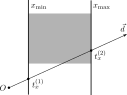
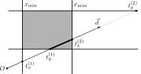
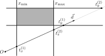
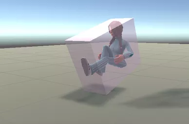
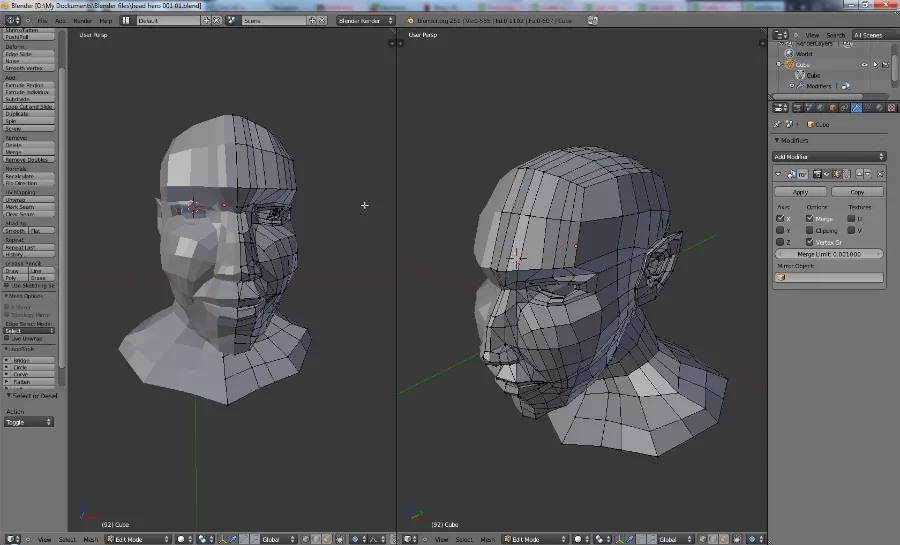
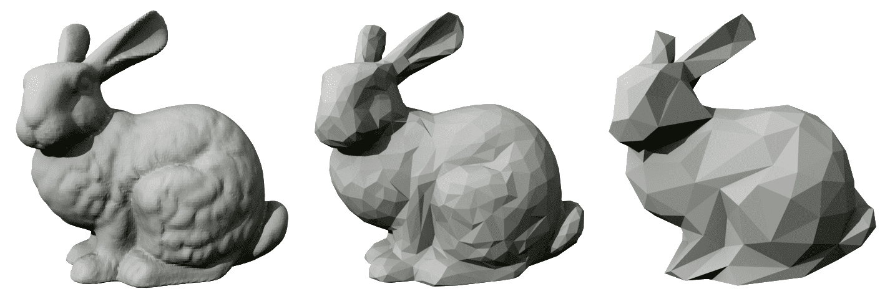
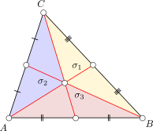
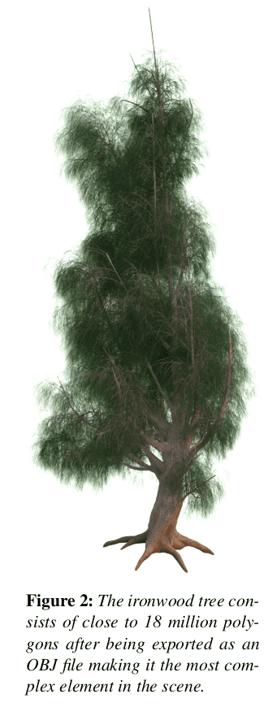
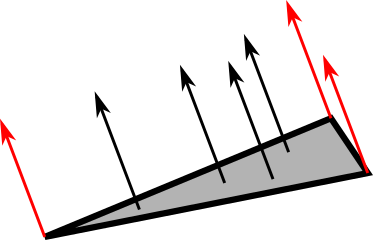
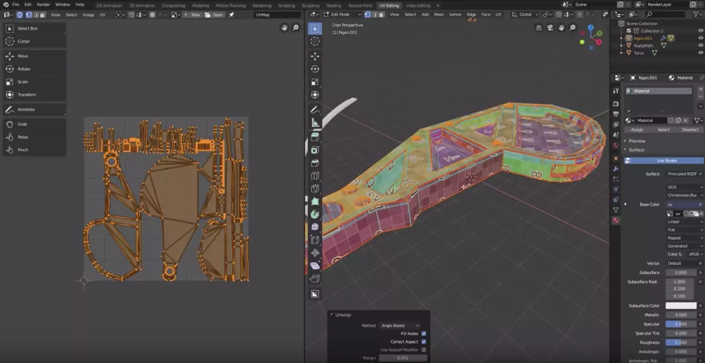

# *Axis-aligned boxes*

# *Axis-aligned boxes*

-   The cubic shape is not very interesting in itself, but it lends itself to some very simple optimizations.

-   Due to its particular purpose, we will treat the case of cubes using different conventions than those made for spheres and planes:

    #.   We will not limit ourselves to the unit cube with a vertex at the origin…
    #.   …but we will assume that the faces are parallel to the coordinate planes.

-   These assumptions are referred to in the literature as *axis-aligned bounding box* (AAB).

# In-memory representation

-   A parallelepiped with edges aligned along the $xyz$ axes can be defined by the following quantities:

    #. The minimum and maximum $x$ values;
    #. The minimum and maximum $y$ values;
    #. The minimum and maximum $z$ values.

-   Equivalently, you can store two opposite vertices of the parallelepiped, $P_m$ (minimum values of $x$, $y$ and $z$) and $P_M$ (maximum values).

# Ray-AABB intersection

-   Let's write the ray as $r: O + t \vec d$.

-   The calculation is very similar to that done for the plane, if one dimension is considered at a time:

    <center></center>

# Ray-AABB intersection

-   Let $F_i$ be a generic point on the plane perpendicular to the $i$-th direction (six planes in total), which will have coordinates

    $$
    F_0 = (f_0^{\text{min}/\text{max}}, \cdot, \cdot), \quad F_1 = (\cdot, f_1^{\text{min}/\text{max}}, \cdot), \quad F_2 = (\cdot, \cdot, f_2^{\text{min}/\text{max}}).
    $$

-   Along the $i$-th coordinate, *two* planes intersect:

    $$
    O + t_i \vec d = F^{\text{min}/\text{max}}_i\quad\Rightarrow\quad t_i^{\text{min}/\text{max}} = \frac{f_i^{\text{min}/\text{max}} - O_i}{d_i}.
    $$

# Ray-AABB intersection

-   Each direction produces two intersections, so in total there are six potential intersections (one for each face of the cube).

-   But not all intersections are correct: they are calculated for the entire infinite plane on which the face of the cube lies.

-   It is therefore necessary to verify for each value of $t$ if the corresponding point $P$ actually lies on one of the faces of the cube.

# Ray-AABB intersection

-   In the case of the previous image, where the ray intersects the parallelepiped, the intervals $[t^{(1)}_i, t^{(2)}_i]$ have a common section:

<center></center>

-   The intersection of the intervals is an interval whose extremes correspond to the intersection points of the ray with the AABB.


# Ray-AABB intersection

-   In the case where the ray misses the parallelepiped, the intervals $[t^{(1)}_i, t^{(2)}_i]$ are disjoint:

<center></center>

-   Therefore, if the intersection of the intervals for the three axes gives the empty set, the ray does not hit the AABB.

# Bounding boxes

# Rendering complexity

-   Last week we implemented the `World` type, which contains a list of objects

-   When calculating an intersection with an object, `World.ray_intersection` must iterate over all the `Shape`s in `World`

-   If you increase the number of `Shape`s tenfold, the time required to produce an image also increases tenfold…

-   …but even solving the rendering equation in simple cases can take hours!


---

<center></center>

This image contains three geometric shapes (two planes and a sphere), and was calculated in ~156 seconds.

---

<iframe src="https://player.vimeo.com/video/517979969?badge=0&amp;autopause=0&amp;player_id=0&amp;app_id=58479" width="1934" height="810" frameborder="0" allow="autoplay; fullscreen; picture-in-picture" allowfullscreen title="Moana (Clements, Musker, Hall, Williams) Beach scene (no sound)"></iframe>

# [*Moana island scene*](https://www.disneyanimation.com/resources/moana-island-scene/)

<center>

</center>


# Optimizations

-   With our implementation of `World`, the time required to compute an image is roughly proportional to the number of ray-shape intersections.

-   But realistic scenes contain many shapes!

-   *Moana island scene* is a scene composed of ~15 billion basic shapes. The rendering time would be on the order of 25,000 years!

-   However, there are optimization techniques that allow to greatly reduce the number of intersections to be calculated. One of these is based on *axis-aligned bounding boxes*.


# *Axis-aligned bounding box*

-   *Axis-aligned bounding boxes* (AABBs) are AABBs that delimit the volume occupied by objects.

-   They are widely used in *computer graphics* as an optimization mechanism.

-   The principle is as follows:

    #.  For each shape in space, its AABB is calculated;
    #.  When determining the intersection between a ray and a shape, it is first checked whether the ray intersects the AABB;
    #.  If it does not intersect, we move on to the next shape, otherwise we proceed with the intersection calculation.

---

<center>{height=540px}</center>

# Usefulness of AABBs

-   AABBs are useful only for complex scenes, made up of many non-trivial objects. For simple scenes they can actually **slow down** rendering.

-   They are however very useful with triangle *meshes* and with complex CSG objects.

-   If you want to support AABBs in your ray-tracer, you should add an `aabb` member to the `Shape` type to be used inside `Shape.rayIntersection`:

    ```python
    class MyComplexShape:
        # ...
        def rayIntersection(self, ray: Ray) -> Union[HitRecord, None]:
            inv_ray = ray.transform(self.transformation.inverse())
            if not self.aabb.quickRayIntersection(inv_ray):
                return None

            # etc.
    ```


# Triangles, quadrilaterals, and *meshes* {#triangles-and-meshes}

# 3D Modeling

<center></center>

# 3D Scanners

<center></center>

# Stanford bunny (1994)

<center></center>

(Model obtained from the scan of a ceramic statuette)

# Triangles

Triangles are a geometric shape widely used in 3D modeling and rendering programs, due to their many properties:

#. They are the planar surface with the fewest vertices (→ efficient to store).
#. Their representation in space is unique (one and only one planar triangle passes through three points).
#. Their surface is parameterizable in $(u, v)$ coordinates in a very simple way.
#. Complex surfaces can be represented as a union of multiple triangles.


# Barycentric Coordinates

-   Barycentric coordinates were proposed by Möbius in 1827. They express the points of a plane passing through the points $A, B, C$ by means of the expression

    $$
    P(\alpha, \beta, \gamma) = \alpha A + \beta B + \gamma C,
    $$

    where $\alpha, \beta, \gamma \in \mathbb{R}$ are the *barycentric coordinates*.

-   Barycentric coordinates are very useful for characterizing the triangle with vertices $A, B, C$: the point $P$ is inside the triangle if and only if

    $$
    0 \le \alpha \le 1,\quad 0 \le \beta \le 1,\quad 0 \le \gamma \le 1, \quad \alpha + \beta + \gamma = 1.
    $$

# Coordinates in Triangles

-   The condition $\alpha + \beta + \gamma = 1$ means that the points of a triangle are characterized by two degrees of freedom, as it should be for a two-dimensional surface.

-   Equality in the first three inequalities holds for the points along the edge of the triangle.

-   Using the last equality, a more meaningful form is obtained:

    $$
    P(\beta, \gamma) = A + \beta(B - A) + \gamma(C - A) = A + \beta \vec v_{AB} + \gamma \vec v_{AC},
    $$

    which expresses $P$ as $A$ plus a displacement towards $B$ and one towards $C$.

---

<center>{height=640px}</center>

# Coordinates in Triangles

-   It can be shown that the barycentric coordinates of a point $P$ are related to the area $\sigma$ of the triangle and to the areas of the three sub-triangles having as vertex the point $P$ and two of the vertices:

    $$
    \alpha = \frac{\sigma_1}\sigma = 1 - \frac{\sigma_2 + \sigma_3}\sigma, \quad \beta = \frac{\sigma_2}\sigma, \quad \gamma = \frac{\sigma_3}\sigma.
    $$

-   If a negative sign is assigned to the areas that are outside the triangle, these equations hold for any point on the plane in which the triangle lies.

# Interactive Example { data-state="barycentric-coordinates-demo" }

<center>
    <canvas
        id="barycentric-coordinates-canvas"
        width="620px"
        height="480px"
        style="left:0px;top:0px;cursor:crosshair;border:1px solid black;"/>
</center>

<script type="text/javascript" src="./js/barycentric-coordinates.js"></script>

# Quadrilaterals

-   We will focus on triangles today, but rendering programs also offer the possibility of defining *quadrilaterals*.

-   If we limit ourselves to parallelograms, they can be represented as the union of a vertex $P$ and two vectors $\vec v$ and $\vec w$; in this way, the results that we will show today are easily extendable to them as well:

    <center>
    
    </center>

# Ray Intersection

-   Let's now see how to use barycentric coordinates to efficiently calculate the intersection between a triangle and a ray.

-   Unlike what we did with spheres and planes, in this case we will not adopt a simplified reference system. The reason will be clear when we explain triangle *meshes*.

-   We will therefore identify a triangle by the coordinates of the three points $A, B, C$ (nine floating-point values).

# The Analytical Problem

-   Consider the ray $r(t): O + t \vec d$ and the generic point $P(\beta, \gamma)$ of the triangle. The intersection is given by

    $$
    A + \beta (B - A) + \gamma (C - A) = O + t \vec d,
    $$

    with the constraint $0 \leq (\beta, \gamma) \leq 1$.

-   Let's rearrange the equation to move the three unknowns $\beta$, $\gamma$ and $t$ to the left:

    $$
    \beta (B - A) + \gamma (C - A) - t \vec d = O - A.
    $$


# Matrix Form

-   The equation we obtained is

    $$
    \beta (B - A) + \gamma (C - A) - t \vec d = O - A,
    $$

    which is a vector equation in the three components $x, y, z$.

-   In matrix form, the system can be rewritten as follows:

    $$
    \begin{pmatrix}
    b_x - a_x& c_x - a_x& d_x\\
    b_y - a_y& c_y - a_y& d_y\\
    b_z - a_z& c_z - a_z& d_z\\
    \end{pmatrix}
    \begin{pmatrix}
    \beta\\\gamma\\t
    \end{pmatrix}
    =
    \begin{pmatrix}
    o_x - a_x\\o_y - a_y\\o_z - a_z
    \end{pmatrix}.
    $$

# Analytical Solution

-   The solution depends on the determinant of the matrix M:

    $$
    \det M = \det
    \begin{pmatrix}
    b_x - a_x& c_x - a_x& d_x\\
    b_y - a_y& c_y - a_y& d_y\\
    b_z - a_z& c_z - a_z& d_z\\
    \end{pmatrix},
    $$

    which must be different from zero, otherwise the ray is parallel to the plane of the triangle.

-   The solution is easily obtained with [Cramer's rule](https://en.wikipedia.org/wiki/Cramer%27s_rule), which is inefficient in the general case but adequate for 3×3 matrices as is the case here.

# Analytical Solution

-   Obviously, once the solution is obtained it is necessary to verify that

    $$
    t_\text{min} < t < t_\text{max}, \quad 0 \leq \beta \leq 1, \quad 0 \leq \gamma \leq 1.
    $$

-   The normal of the triangle can be easily obtained from the cross product between the two vectors aligned with the sides:

    $$
    \hat n = \pm (B - A) \times (C - A),
    $$

    where the sign is determined by the direction of the ray.

-   The $(u, v)$ coordinates can be set equal to $(\beta, \gamma)$.


# *Mesh*

# [*Moana island scene*](https://www.disneyanimation.com/resources/moana-island-scene/)

<center>

</center>

# [*Moana island scene*](https://www.disneyanimation.com/resources/moana-island-scene/)

<center>

</center>

---

<center>
{height=640px}
</center>

<small>
[The challenges of Releasing the *Moana* Island Scene (Tamstorf & Pritchett, EGSR 2019)](https://disneyanimation.com/publications/the-challenges-of-releasing-the-moana-island-scene/)
</small>

# *Mesh*

-   The scenes seen in the previous slides are formed by the combination of many simple shapes.

-   Keeping a list of simple shapes in memory requires a series of non-trivial measures.

-   Today we will discuss *meshes*, in which the elementary shape is precisely a planar triangle. (The same discussion can be made for quadrilateral *meshes*, but for simplicity we will focus on triangles).

# Storing Triangles

-   We have seen how to implement the code to calculate the intersection between a ray and a triangle in the general case where the triangle is encoded by its three vertices $A$, $B$, and $C$.

-   We did not follow the approach used for spheres and planes of choosing a "standard" shape (e.g., a triangle on the $xy$ plane), because this would have required storing a 4×4 transformation and its inverse, for a total of 32 floating-point numbers (128 bytes at single precision).

-   Storing the three coordinates of a triangle requires only 3×3×4 = 36 bytes…

-   …but we can do better!

---

<center></center>

# Mesh Storage

-   In a triangle *mesh*, the vertices are stored in an ordered list $P_k$, with $k = 1\ldots N$.

-   Triangles are represented by a triplet of integer indices $i_1, i_2, i_3$ which represents the position of the vertices $P_{i_1}, P_{i_2}, P_{i_3}$ in the ordered list.

-   If 32-bit integers are used to store the indices, each triangle requires 3×4 = 12 bytes.

-   This is advantageous if a vertex is shared by multiple triangles, which is the general case.

---

<iframe src="https://player.vimeo.com/video/546494716?badge=0&amp;autopause=0&amp;player_id=0&amp;app_id=58479" width="1102" height="620" frameborder="0" allow="autoplay; fullscreen; picture-in-picture" allowfullscreen title="Wireframe models in Blender"></iframe>

Model: 44,000 vertices, 80,000 triangles.

# Normals

<p style="text-align:center">{height=240px}</p>

-   A triangle is a planar surface, and therefore every point on its surface has the same normal $\hat n$.

-   In the case of triangle *meshes*, the barycentric coordinates of the triangle can be used to simulate a smooth surface: this is especially useful when the *mesh* is obtained from the discretization of a smooth surface.

# Smooth Shading

<p style="text-align:center">{height=240px}</p>

-   When approximating a smooth surface, it is necessary to calculate both the vertices of the triangles and the normals at the vertices.

-   At the point $P$ defined by $\alpha, \beta, \gamma$, the normal is assigned as

    $$
    \hat n_P = \alpha \hat n_1 + \beta \hat n_2 + \gamma \hat n_3.
    $$

---

<iframe src="https://player.vimeo.com/video/546515481?badge=0&amp;autopause=0&amp;player_id=0&amp;app_id=58479" width="1138" height="640" frameborder="0" allow="autoplay; fullscreen; picture-in-picture" allowfullscreen title="Flat and smooth shading in Blender"></iframe>

# $(u, v)$ Coordinates

-   In the case of a *mesh*, there are infinitely many possible ways to create a $(u, v)$ mapping on the surface.

-   In *meshes*, each element of the *mesh* is made to cover a specific portion of the entire space $[0, 1] \times [0, 1]$.

-   3D modeling programs like Blender allow you to modify the $(u, v)$ mapping of each element.

---

<center></center>

# [Wavefront OBJ](https://en.wikipedia.org/wiki/Wavefront_.obj_file)

-   It's a very simple format to load and used to store meshes (not just triangles).

-   Example (beginning of the `minicooper.obj` model):

    ```text
    # Vertexes
    v  20.851225 -39.649834 32.571609
    v  20.720263 -39.659435 32.675613
    v  20.589304 -39.649834 32.571609
    …
    # Normals
    vn  -0.000006 38.811405 3.583478
    vn  -0.000006 38.811405 3.583478
    vn  -0.000006 38.811405 3.583478
    …
    # Triangles («faces»)
    f 3//3 2//2 1//1
    f 4//4 3//3 1//1
    f 5//5 4//4 1//1
    ```

# OBJ Files

-   The easiest way to view them is to use [Blender](https://www.blender.org/), of course! Under Linux you can also use `openctm-tools`, which is more lightweight (the command `ctmviewer FILENAME` displays an OBJ file in an interactive window).

-   The website of [J. Burkardt](https://people.sc.fsu.edu/~jburkardt/data/obj/obj.html) contains many freely downloadable OBJ files (I took the Mini Cooper model from there).

# Ray Intersection

-   Calculating the intersection between a *mesh* and a ray is not easy to implement.

-   The problem is that much of the time required to calculate the solution to the rendering equation is spent on ray-shape intersections.

-   As the number of shapes increases, the computation time necessarily increases as well.

# AABB and *mesh*

-   AABBs are perfect for applying to *meshes*. (In this case they obviously do not apply to the **individual** elements, but to the *mesh* as a whole).

-   When loading a *mesh*, its AABB can be calculated by calculating the minimum and maximum values of the coordinates of all vertices.

-   In the case of the *Oceania* tree, the intersection between a ray and the 18 million elements would only occur for those rays actually oriented towards that tree.

---

<center>{height=540px}</center>

# Beyond AABBs

-   However, it is not always sufficient to use AABBs for *meshes* to be efficient.

-   Scenes are often almost completely occupied by a complex object, and in this case AABBs do not provide any advantage (as in the previous image).

-   However, it is possible to build on the idea of AABBs to implement more sophisticated optimizations: the most used ones employ [KD-trees](https://en.wikipedia.org/wiki/K-d_tree) and [BVHs](https://en.wikipedia.org/wiki/Bounding_volume_hierarchy). See the [book by Pharr, Jakob & Humphreys](https://pbr-book.org/4ed/Primitives_and_Intersection_Acceleration).


# Debugging {#debugging}

---

<iframe width="1008" height="566" src="https://www.youtube.com/embed/4gNYTqn3qRc" title="YouTube video player" frameborder="0" allow="accelerometer; autoplay; clipboard-write; encrypted-media; gyroscope; picture-in-picture; web-share" allowfullscreen></iframe>

# Introduction to Debugging

-   Last week you fixed your first bug, which concerned the incorrect orientation of the images saved by your code.

-   In general, a *bug* is a problem in the program that makes it work differently than expected.

-   It is very important to have a scientific approach to bug management! In the next slides I will give you some general guidelines.


# Fault, Infection, and Failure

-   Zeller's excellent book [*Why Programs Fail: A Guide to Systematic Debugging*](https://www.whyprogramsfail.com/) explains the discovery of a *bug* as the combination of three factors:

    1.  **Fault**: an error in the way the code is written;
    2.  **Infection**: a certain input "activates" the fault and alters the value of some variables compared to the expected case;
    3.  **Failure**: the outcome of the program is wrong, either because the results are incorrect, or because the program crashes.

-   The *bug* lies in the initial fault, but if there is no infection or no failure, it is difficult to notice it!


# An Example from Numerical Analysis

-   In the Numerical Analysis course, you have to implement code that calculates the value of

    \[
    \int_0^\pi \sin x\,\mathrm{d}x
    \]

    using Simpson's rule:

    \[
    \int_a^b f(x)\,\mathrm{d}x \approx \frac{h}3 \left[f(a) + 4\sum_{i=1}^{n/2} f\bigl(x_{2i-1}\bigr) + 2\sum_{i=1}^{n/2 - 1} f\bigl(x_{2i}\bigr) + f(b)\right].
    \]

-   Often the implementation is wrong even though the result is correct ($\int = 2$)!


---

\[
\int_a^b f(x)\,\mathrm{d}x \approx \frac{h}3 \left[f(a)+ {\color{red}{4}}\sum_{i=1}^{n/2} f\bigl(x_{2i-1}\bigr) + {\color{red}{2}}\sum_{i=1}^{n/2 - 1} f\bigl(x_{2i}\bigr) + f(b)\right].
\]

-   Often students swap the 4 with the 2.

-   This leads to an *infection*: the value of the expression in square brackets is wrong.

-   This leads to a *failure*: the result of the integral is wrong.

-   Of all the cases, this is the simplest: it is immediately obvious what the problem is!

---

\[
\int_a^b f(x)\,\mathrm{d}x \approx \frac{h}3 \left[f(a)+ 4\sum_{i=1}^{\color{red}{n/2}} f\bigl(x_{2i-1}\bigr) + 2\sum_{i=1}^{\color{red}{n/2 - 1}} f\bigl(x_{2i}\bigr) + f(b)\right].
\]

-   Sometimes students terminate one of the two summations too early (they forget the last term) or too late (they add an extra term).

-   In the case of $\int_0^\pi \sin x\,\mathrm{d}x$, the last term of the summation is for $x \approx \pi$, so it is very small: there is an *infection*, but if you print only a few significant digits on the screen, the result may be rounded to the correct value, and therefore there is no *failure*.

---


\[
\int_a^b f(x)\,\mathrm{d}x \approx \frac{h}3 \left[{\color{red}{f(a)}}+ 4\sum_{i=1}^{n/2} f\bigl(x_{2i-1}\bigr) + 2\sum_{i=1}^{n/2 - 1} f\bigl(x_{2i}\bigr) + {\color{red}{f(b)}}\right].
\]

-   Sometimes students forget to add $f(a)$ and/or $f(b)$, or they multiply them by 2 or 4.

-   However, in the case of $\int_0^\pi \sin x\,\mathrm{d}x$, the value of the expression in square brackets is still correct because $f(0) = f(\pi) = 0$.

-   In this case there is a *fault* but there is no *infection* nor a *failure*: this is the most difficult case to identify!


# Duplicate *Issues*

-   It is very common for the same *fault* to lead to different *failures*: this depends on the input data, the type of action being performed with the program, etc.

-   It is therefore very common for users to open different *issues* that are however caused by the same *fault*.

-   Example: [a crash in Julia](https://github.com/JuliaLang/julia/issues/48332) is caused by the combination of two previously reported issues, which at first glance did not seem related.

-   GitHub allows you to assign the *Duplicated* label to *issues*: 


# How to Report *Issues*

-   When you observe a *failure* and want to open an *issue*, you must indicate:

    1.  List of actions that led to the failure (including all inputs!)
    2.  Program output
    3.  Description of the expected behavior and the observed behavior instead

    This is because the developer must be able to **reproduce** the *failure* in order to identify the *fault* that caused it.

-   If a user reports an issue to you without some of these things being clear, do not hesitate to ask for more details.

-   GitHub allows you to configure an [issue template](https://docs.github.com/en/communities/using-templates-to-encourage-useful-issues-and-pull-requests/configuring-issue-templates-for-your-repository).

# Identifying *Faults* Scientifically (Zeller)

1.  Observe/reproduce a *failure*
2.  Formulate a hypothesis about the *fault* that caused the *failure*
3.  Use the hypothesis to

# Debugging tools

| Type                            | Examples                                                                                               |
|---------------------------------|--------------------------------------------------------------------------------------------------------|
| SYmbolic debugger               | [GDB](https://sourceware.org/gdb/), [LLDB](https://lldb.llvm.org/)                                     |
| Memory checkers                 | [Memcheck](https://valgrind.org/docs/manual/mc-manual.html)                                            |
| Dynamic analysis                | [Valgrind](https://valgrind.org/docs/manual/mc-manual.html)                                            |
| Record-and-replay               | [rr](https://rr-project.org/), [UDB](https://undo.io/products/udb/)                                    |
| Fuzzying debuggers              | [AFL++](https://github.com/AFLplusplus/AFLplusplus), [libFuzzer](https://llvm.org/docs/LibFuzzer.html) |

---
title: "Lesson 9"
subtitle: "Calcolo numerico per la generazione di immagini fotorealistiche"
author: "Maurizio Tomasi <maurizio.tomasi@unimi.it>"
...
