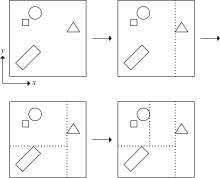
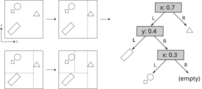
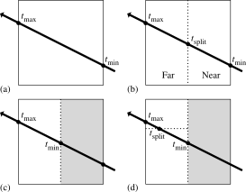
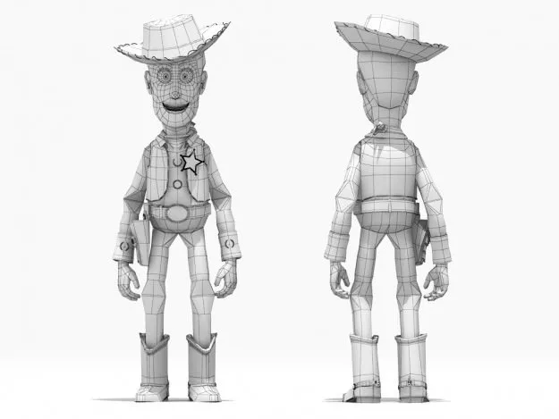

# Polygonal meshes {#polygonal-meshes}

# [*Moana island scene*](https://www.disneyanimation.com/resources/moana-island-scene/)

<center>

</center>

# [*Moana island scene*](https://www.disneyanimation.com/resources/moana-island-scene/)

<center>

</center>

---

<center>
{height=640px}
</center>

<small>
[The challenges of Releasing the *Moana* Island Scene (Tamstorf & Pritchett, EGSR 2019)](https://disneyanimation.com/publications/the-challenges-of-releasing-the-moana-island-scene/)
</small>

# Polygonal meshes

-   The scenes seen in the previous slides are formed by the combination of many simple shapes.

-   Managing scenes with millions of primitive shapes requires sophisticated memory management and data structures.

-   Today we will discuss *triangular meshes*, in which the elementary shape is precisely a planar triangle. (The same discussion can be made for quadrilateral *meshes*, but for simplicity we will focus on triangles).

# Storing triangles

-   We have seen how to implement the code to calculate the intersection between a ray and a triangle in the general case where the triangle is encoded by its three vertices $A$, $B$, and $C$.

-   Unlike our approach for spheres and planes (where we applied transformations to canonical shapes), meshes require a more direct storage method: storing a 4×4 transformation and its inverse requires 32 floating-point numbers (128 bytes at single precision).

-   Storing the three coordinates of a triangle requires only 3×3×4 = 36 bytes…

-   …but we can do better!

---

<center></center>

# Mesh storage

-   In a triangle mesh, the vertices are stored in an ordered list $P_k$, with $k = 1\ldots N$.

-   Triangles are represented by a triplet of integer indices $i_1, i_2, i_3$ which represents the position of the vertices $P_{i_1}, P_{i_2}, P_{i_3}$ in the ordered list.

-   If 32-bit integers are used to store the indices, each triangle requires 3×4 = 12 bytes.

-   This approach is highly efficient, since vertices are typically shared by multiple adjacent triangles. And it’s easier to move vertices in 3D space!

---

<iframe src="https://player.vimeo.com/video/546494716?badge=0&amp;autopause=0&amp;player_id=0&amp;app_id=58479" width="1102" height="620" frameborder="0" allow="autoplay; fullscreen; picture-in-picture" allowfullscreen title="Wireframe models in Blender"></iframe>

Model: 44,000 vertices, 80,000 triangles.

# Normals

<p style="text-align:center">{height=240px}</p>

-   A triangle is a planar surface, and therefore every point on its surface has the same normal $\hat n$.

-   In the case of triangle *meshes*, the barycentric coordinates of the triangle can be used to simulate a smooth surface: this is especially useful when the mesh is obtained from the discretization of a smooth surface.

# Smooth Shading

<p style="text-align:center">{height=240px}</p>

-   When approximating a smooth surface, it is necessary to calculate both the vertices of the triangles and the normals at the vertices.

-   At the point $P$ defined by $\alpha, \beta, \gamma$, the normal is assigned as

    $$
    \hat n_P = \alpha \hat n_1 + \beta \hat n_2 + \gamma \hat n_3.
    $$
    
    (Caution: $\hat n_P$ is not necessarily normalized!)

---

<iframe src="https://player.vimeo.com/video/546515481?badge=0&amp;autopause=0&amp;player_id=0&amp;app_id=58479" width="1138" height="640" frameborder="0" allow="autoplay; fullscreen; picture-in-picture" allowfullscreen title="Flat and smooth shading in Blender"></iframe>

# $(u, v)$ Coordinates

-   In the case of a mesh, there are infinitely many possible ways to create a $(u, v)$ mapping on the surface.

-   In *meshes*, each element of the mesh is made to cover a specific portion of the entire space $[0, 1] \times [0, 1]$.

-   3D modeling programs like Blender allow you to modify the $(u, v)$ mapping of each element.

---

<center></center>

# [Wavefront OBJ](https://en.wikipedia.org/wiki/Wavefront_.obj_file)

-   It is a very simple format, widely used to store meshes (not just triangles).

-   Example (beginning of the `minicooper.obj` model):

    ```text
    # Vertices
    v  20.851225 -39.649834 32.571609
    v  20.720263 -39.659435 32.675613
    v  20.589304 -39.649834 32.571609
    …
    # Normals
    vn  -0.000006 38.811405 3.583478
    vn  -0.000006 38.811405 3.583478
    vn  -0.000006 38.811405 3.583478
    …
    # Triangles («faces»). Indices start from 1, not from 0!
    f 3//3 2//2 1//1
    f 4//4 3//3 1//1
    f 5//5 4//4 1//1
    ```

# OBJ Files

-   The easiest way to view them is to use [Blender](https://www.blender.org/), of course! Under Linux you can also use `openctm-tools`, which is more lightweight (the command `ctmviewer FILENAME` displays an OBJ file in an interactive window).

-   The website of [J. Burkardt](https://people.sc.fsu.edu/~jburkardt/data/obj/obj.html) contains many freely downloadable OBJ files (I took the Mini Cooper model from there).

# Ray Intersection

-   Calculating the intersection between a mesh and a ray is not easy to implement.

-   The bottleneck in solving the rendering equation is typically the time spent on ray-shape intersections.

-   As the number of shapes increases, the computation time necessarily increases as well as $O(N)$.

-   An effective optimization is the use of bounding boxes, which rely on the concept of “axis-aligned box”. Let’s start from the latter.


# *Axis-aligned boxes*

# *Axis-aligned boxes*

-   The cubic shape is not very interesting in itself, but it lends itself to some optimizations relevant for polygonal meshes.

-   Due to its particular purpose, we will treat the case of cubes using different conventions than those made for spheres and planes:

    #.   We will not limit ourselves to the unit cube with a vertex at the origin…
    #.   …but we will assume that the faces are parallel to the coordinate planes.

-   These assumptions are referred to in the literature as *axis-aligned bounding box* (AABB).

# In-memory representation

-   A box with edges aligned along the $xyz$ axes can be defined by the following quantities:

    #. The minimum and maximum $x$ values;
    #. The minimum and maximum $y$ values;
    #. The minimum and maximum $z$ values.

-   Equivalently, you can store two opposite vertices of the parallelepiped, $P_m$ (minimum values of $x$, $y$ and $z$) and $P_M$ (maximum values).

# Ray-AABB intersection

-   Let's write the ray as $r: O + t \vec d$.

-   The calculation for the 3D case is very similar to the 2D case, so let’s consider the latter:

    <center></center>

# Ray-AABB intersection

-   Let $F_i$ be a generic point on a face of the box perpendicular to the $i$-th direction (six planes in total), which will have coordinates

    $$
    F_0 = (f_0^{\text{min}/\text{max}}, \cdot, \cdot), \quad F_1 = (\cdot, f_1^{\text{min}/\text{max}}, \cdot), \quad F_2 = (\cdot, \cdot, f_2^{\text{min}/\text{max}}).
    $$

-   In general, there are *two* ray-face intersection along the $i$-th coordinate, if we consider whole planes instead of the actual faces:

    $$
    O + t_i \vec d = F^{\text{min}/\text{max}}_i\quad\Rightarrow\quad t_i^{\text{min}/\text{max}} = \frac{f_i^{\text{min}/\text{max}} - O_i}{d_i}.
    $$

# Ray-AABB intersection

-   Each direction produces two intersections, so in total there are six potential intersections (one for each face of the cube).

-   But not all intersections are correct: they are calculated for the entire infinite plane on which the face of the cube lies.

-   It is therefore necessary to verify for each value of $t$ if the corresponding point $P$ actually lies on one of the faces of the cube.

# Ray-AABB intersection

-   In the case of the previous image, where the ray intersects the parallelepiped, the intervals $[t^{(1)}_i, t^{(2)}_i]$ have a common section:

<center></center>

-   The intersection of the intervals is an interval whose extremes correspond to the intersection points of the ray with the AABB.


# Ray-AABB intersection

-   In the case where the ray misses the parallelepiped, the intervals $[t^{(1)}_i, t^{(2)}_i]$ are disjoint:

<center></center>

-   Therefore, if the intersection of the intervals for the three axes gives the empty set, the ray does not hit the AABB.

# Bounding boxes

# Rendering complexity

-   Last week we implemented the `World` type, which contains a list of objects

-   When calculating an intersection with an object, `World.ray_intersection` must iterate over all the `Shape`s in `World`

-   If you increase the number of `Shape`s tenfold, the time required to produce an image also increases tenfold…

-   …but even solving the rendering equation in simple cases can take hours!


---

<center></center>

This image contains three geometric shapes (two planes and a sphere), and was calculated in ~156 seconds.

---

<iframe src="https://player.vimeo.com/video/517979969?badge=0&amp;autopause=0&amp;player_id=0&amp;app_id=58479" width="1934" height="810" frameborder="0" allow="autoplay; fullscreen; picture-in-picture" allowfullscreen title="Moana (Clements, Musker, Hall, Williams) Beach scene (no sound)"></iframe>

# [*Moana island scene*](https://www.disneyanimation.com/resources/moana-island-scene/)

<center>

</center>


# Optimizations

-   With our implementation of `World`, the time required to compute an image is roughly proportional to the number of ray-shape intersections.

-   But realistic scenes contain many shapes!

-   *Moana island scene* is a scene composed of ~15 billion basic shapes. The rendering time would be on the order of 25,000 years!

-   Now that we have described axis-aligned boxes, let’s move to the concept of axis-aligned *bounding* boxes, which provides a simple but effective optimization.

---

<center>{height=540px}</center>

# *Axis-aligned bounding box*

-   *Axis-aligned bounding boxes* (AABBs) are AABBs that delimit the volume occupied by objects.

-   They are widely used in *computer graphics* as an optimization mechanism.

-   The principle is as follows:

    #.  For each shape in space, its AABB is calculated;
    #.  When determining the intersection between a ray and a shape, it is first checked whether the ray intersects the AABB;
    #.  If it does not intersect, we move on to the next shape, otherwise we proceed with the intersection calculation.

---

<center>{height=540px}</center>

# Usefulness of AABBs

-   AABBs are useful only for scenes made up of many objects. For simple scenes, they can introduce unnecessary overhead.

-   They are however very useful with triangle *meshes* and complex CSG objects.

-   If you want to support AABBs in your ray-tracer, you should add an `aabb` member to the `Shape` type to be used inside `Shape.rayIntersection`:

    ```python
    class MyComplexShape:
        # ...
        def rayIntersection(self, ray: Ray) -> Optional[HitRecord]:
            inv_ray = ray.transform(self.transformation.inverse())
            if not self.aabb.quickRayIntersection(inv_ray):
                return None

            # etc.
    ```


# AABB and meshes

-   AABBs are perfect for applying to *meshes*. (In this case they obviously do not apply to the **individual** elements, but to the mesh as a whole).

-   When loading a mesh, its AABB can be calculated by calculating the minimum and maximum values of the coordinates of all vertices.

-   In the case of the *Oceania* tree, the intersection between a ray and the 18 million elements would only occur for those rays actually oriented towards that tree.

# Beyond AABBs

-   However, it is not always sufficient to use AABBs for *meshes* to be efficient.

-   Scenes are often almost completely occupied by a few complex objects, and in this case AABBs do not provide any advantage (as in the previous image).

-   However, there are several sophisticated optimizations that transform the problem of looking for ray-triangle hits from $O(N)$ to $O(\log_2 N)$. The most common acceleration structures are [KD-trees](https://en.wikipedia.org/wiki/K-d_tree) and [Bounding Volume Hierarchies](https://en.wikipedia.org/wiki/Bounding_volume_hierarchy). They are both explained in the [book by Pharr, Jakob & Humphreys](https://pbr-book.org/4ed/Primitives_and_Intersection_Acceleration); we will quickly explain the former.

# KD-trees

# KD-trees

- KD-trees are a specific application of a broader family of algorithms called *Binary Space Partitioning* (BSP).

- BSP algorithms are used for searching in spatio-temporal domains; in our case, the problem is to find the potential triangle in the *mesh* that intersects a given ray.

- BSP methods are iterative, and at each iteration, they partition the volume of the space to be searched.

# Bisection Method

- Let's recall the bisection method used to find the zeros of a function, which is explained in the TNDS course (II year of the Bachelor's degree).

- Given a continuous function $f: [a, b] \rightarrow \mathbb{R}$ such that $f(a) \cdot f(b) \leq 0$, the intermediate value theorem guarantees that $\exists x \in [a, b]: f(x) = 0$.

- The bisection method consists of dividing the interval $[a, b]$ into two parts $[a, c]$ and $[c, b]$, with $c = (a + b)/2$, and applying the method to the sub-interval where the intermediate value theorem still holds.

- It can be shown that to achieve a precision $\epsilon$ in estimating the zero, $N = \log_2 ((b - a)/\epsilon)$ steps are needed, i.e., $O(\log N)$: it's very efficient\!

-----

<p style="text-align:center">{height=520px}</p>

If the zero $x_0$ is known with precision $\pm 1$, just 20 steps are sufficient to reach a precision of $\pm 2^{-20} = \pm 10^{-6}$.

# BSP Methods

- BSP methods enclose all the shapes of a world within a bounding box, then divide it into two regions, partitioning the shapes into one half or the other (or both, if they lie along the division).

- This subdivision is repeated recursively up to a certain depth: ideally, until the bounding boxes contain a certain (small) number of objects.

- KD-trees are a type of BSP where the bounding boxes are the well-known AABBs.

- KD-trees are explained and implemented in [section 4.4 of *Physically Based Rendering*](https://www.pbr-book.org/3ed-2018/Primitives_and_Intersection_Acceleration/Kd-Tree_Accelerator) (Pharr, Jakob, Humphreys, 3rd ed.)

-----

<center>{height=640px}</center>
[Figure 4.14 from *Physically Based Rendering* (Pharr, Jakob, Humphreys, 3rd ed.)]{style="float:right"}

# KD-trees and *Meshes*

- This is the procedure to build a KD-tree in memory:

  1.  Calculate the AABB of the *mesh*;
  2.  Decide along which direction (x/y/z) to perform the split;
  3.  Partition the triangles between the two halves of the AABB; triangles that fall along the splitting line are included in **both** halves;
  4.  Repeat the procedure for each of the two halves until the number of triangles in each compartment is below a certain threshold (e.g., between 1 and 10).

- This procedure needs to be done **only once**, before solving the rendering equation.

# KD-tree in Memory

- A KD-tree can be stored in a tree structure built when loading the mesh.

- To represent the splits, a `KdTreeSplit` type can be defined:

    ```python
    class KdTreeSplit:
        axis: int     # Index of the axis; 0: x, 1: y, 2: z
        split: float  # Location of the split along the axis
    ```

- The generic node of the tree is represented like this:

    ```python
    class KdTreeNode:
        entry: Union[KdTreeSplit, List[int]]  # List[int]: List of indexes to ◺
        left: Optional[KdTreeNode]
        right: Optional[KdTreeNode]
    ```

-----

<center>{height=640px}</center>

# Ray Intersection

- To determine if a ray intersects a *mesh* optimized with a KD-tree, follow this procedure:

  1.  Check if the ray intersects the AABB; if not, the process stops.
  2.  Determine which of the two halves is crossed first by the ray:
      * If only one half is crossed, analyze only that one;
      * If both are crossed, first analyze the one intersected for smaller values of $t$.
  3.  The traversal continues until a leaf node is reached. At that point, analyze all triangles in the node using the linear algorithm.

- For the Oceania tree, in the case of a perfectly balanced KD-tree (50%–50%), fewer than 25 comparisons are needed to determine the intersection with a ray.

-----

<center>{height=640px}</center>
[Figure 4.17 from *Physically Based Rendering* (Pharr, Jakob, Humphreys, 3rd ed.)]{style="float:right"}

# Details

- To build a KD-tree, some questions need to be answered:

  1.  At each split, along which axis is it best to perform the subdivision? (The axis with the widest extent?)
  2.  At which point on the axis should the split occur? (The midpoint?)
  3.  When is it best to stop? (When a node contains fewer than *N* shapes?)

- Answering these questions is not trivial, but finding an *efficient* solution is important\!

# Irregularity of *Meshes*

<center></center>

# "Cost" of a KD-tree

-   To build an efficient KD-tree, the *computational cost* of the tree needs to be evaluated, which is given by


    $$
    C(t) = C_\text{trav} + P_L \cdot C(L) + P_R \cdot C(R),
    $$

    where

    1.  $C_\text{trav}$ is the *traversal cost*: the time required to descend one level in the tree (constant);
    2.  $P_L, P_R$ are the probabilities that the ray hits a triangle within the branch;
    3.  $C(L), C(R)$ is the cost of the subnode, i.e., the time required to analyze the left/right side.

# Optimized Construction

- These assumptions can be made:

    - $P_L$ and $P_R$ (probability that the ray hits a shape) are proportional to the total surface area of the triangles in the subcell;
    - Calculate $C(L)$ and $C(R)$ recursively, assuming that for terminal nodes, it is proportional to the number of triangles.

- A robust algorithm tries various tree splits, calculating the cost of each, and chooses the split that leads to the lowest cost (“Surface area heuristic”).

- The speed benefits can range from a factor of 10 to a factor of 100 compared to a KD-tree built with simple assumptions.


# Debugging {#debugging}

---

<iframe width="1008" height="566" src="https://www.youtube.com/embed/4gNYTqn3qRc" title="YouTube video player" frameborder="0" allow="accelerometer; autoplay; clipboard-write; encrypted-media; gyroscope; picture-in-picture; web-share" allowfullscreen></iframe>

# Introduction to Debugging

-   Last week you fixed your first bug, which concerned the incorrect orientation of the images saved by your code.

-   In general, a *bug* is a problem in the program that makes it work differently than expected.

-   It is very important to have a scientific approach to bug management! In the next slides I will give you some general guidelines.


# Fault, Infection, and Failure

-   Zeller's excellent book [*Why Programs Fail: A Guide to Systematic Debugging*](https://www.whyprogramsfail.com/) categorizes the manifestation of a *bug* into three distinct stages:

    1.  **Fault**: an error in the way the code is written;
    2.  **Infection**: a certain input "activates" the fault and alters the value of some variables compared to the expected case;
    3.  **Failure**: the outcome of the program is wrong, either because the results are incorrect, or because the program crashes.

-   The *bug* lies in the initial fault, but if there is no infection or no failure, it is difficult to notice it!


# Example

-   In your second-year, you implemented code that calculates the value of

    \[
    \int_0^\pi \sin x\,\mathrm{d}x
    \]

    using Simpson's rule:

    \[
    \int_a^b f(x)\,\mathrm{d}x \approx \frac{h}3 \left[f(a) + 4\sum_{i=1}^{n/2} f\bigl(x_{2i-1}\bigr) + 2\sum_{i=1}^{n/2 - 1} f\bigl(x_{2i}\bigr) + f(b)\right].
    \]

-   Often the implementation is wrong even though the result is correct ($\int = 2$)!


---

\[
\int_a^b f(x)\,\mathrm{d}x \approx \frac{h}3 \left[f(a)+ {\color{red}{4}}\sum_{i=1}^{n/2} f\bigl(x_{2i-1}\bigr) + {\color{red}{2}}\sum_{i=1}^{n/2 - 1} f\bigl(x_{2i}\bigr) + f(b)\right].
\]

-   Often students swap the 4 with the 2.

-   This leads to an *infection*: the value of the expression in square brackets is wrong.

-   This leads to a *failure*: the result of the integral is wrong.

-   Of all the cases, this is the simplest: it is immediately obvious what the problem is!

---

\[
\int_a^b f(x)\,\mathrm{d}x \approx \frac{h}3 \left[f(a)+ 4\sum_{i=1}^{\color{red}{n/2}} f\bigl(x_{2i-1}\bigr) + 2\sum_{i=1}^{\color{red}{n/2 - 1}} f\bigl(x_{2i}\bigr) + f(b)\right].
\]

-   Sometimes students terminate one of the two summations too early (they forget the last term) or too late (they add an extra term).

-   In the case of $\int_0^\pi \sin x\,\mathrm{d}x$, the last term of the summation is for $x \approx \pi$, so it is very small: there is an *infection*, but if you print only a few significant digits on the screen, the result may be rounded to the correct value, and therefore there is no *failure*.

---


\[
\int_a^b f(x)\,\mathrm{d}x \approx \frac{h}3 \left[{\color{red}{f(a)}}+ 4\sum_{i=1}^{n/2} f\bigl(x_{2i-1}\bigr) + 2\sum_{i=1}^{n/2 - 1} f\bigl(x_{2i}\bigr) + {\color{red}{f(b)}}\right].
\]

-   Sometimes students forget to add $f(a)$ and/or $f(b)$, or they multiply them by 2 or 4.

-   However, in the case of $\int_0^\pi \sin x\,\mathrm{d}x$, the value of the expression in square brackets is still correct because $f(0) = f(\pi) = 0$.

-   In this case there is a *fault* but there is no *infection* nor a *failure*: this is the most difficult case to identify!


# Duplicate *Issues*

-   It is very common for the same *fault* to lead to different *failures*: this depends on the input data, the type of action being performed with the program, etc.

-   It is therefore very common for users to open different *issues* that are however caused by the same *fault*.

-   Example: [a crash in Julia](https://github.com/JuliaLang/julia/issues/48332) is caused by the combination of two previously reported issues, which at first glance did not seem related.

-   GitHub allows you to assign the *Duplicated* label to *issues*: 


# How to Report *Issues*

-   When you observe a *failure* and want to open an *issue*, you must indicate:

    1.  List of actions that led to the failure (including all inputs!)
    2.  Program output
    3.  Description of the expected behavior and the observed behavior instead

    This is because the developer must be able to **reproduce** the *failure* in a controlled environment to identify the *fault* that caused it.

-   If a user reports an issue to you without some of these things being clear, do not hesitate to ask for more details.

-   GitHub allows you to configure an [issue template](https://docs.github.com/en/communities/using-templates-to-encourage-useful-issues-and-pull-requests/configuring-issue-templates-for-your-repository).

# Identifying *Faults* Scientifically (Zeller)

1.  Observe/reproduce a *failure*
2.  Formulate a hypothesis about the *fault* that caused the *failure*
3.  Use the hypothesis to predict where an infection might be visible (e.g., using a debugger or `print` statements). If the observation contradicts the prediction, refine the hypothesis.

# Debugging tools

| Type                                        | Examples                                                                                               |
|---------------------------------------------|--------------------------------------------------------------------------------------------------------|
| Symbolic debuggers                          | [GDB](https://sourceware.org/gdb/), [LLDB](https://lldb.llvm.org/)                                     |
| Memory checkers                             | [Memcheck](https://valgrind.org/docs/manual/mc-manual.html)                                            |
| Dynamic analysis                            | [Valgrind](https://valgrind.org/docs/manual/mc-manual.html)                                            |
| Record-and-replay                           | [rr](https://rr-project.org/), [UDB](https://undo.io/products/udb/)                                    |
| Fuzzing debuggers                          | [AFL++](https://github.com/AFLplusplus/AFLplusplus), [libFuzzer](https://llvm.org/docs/LibFuzzer.html) |

---
title: "Lesson 9"
subtitle: "Calcolo numerico per la generazione di immagini fotorealistiche"
author: "Maurizio Tomasi <maurizio.tomasi@unimi.it>"
...
