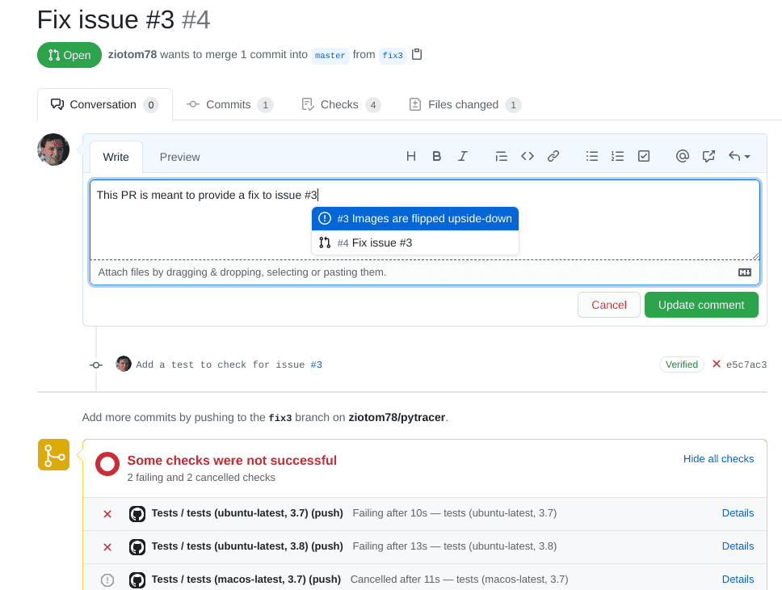
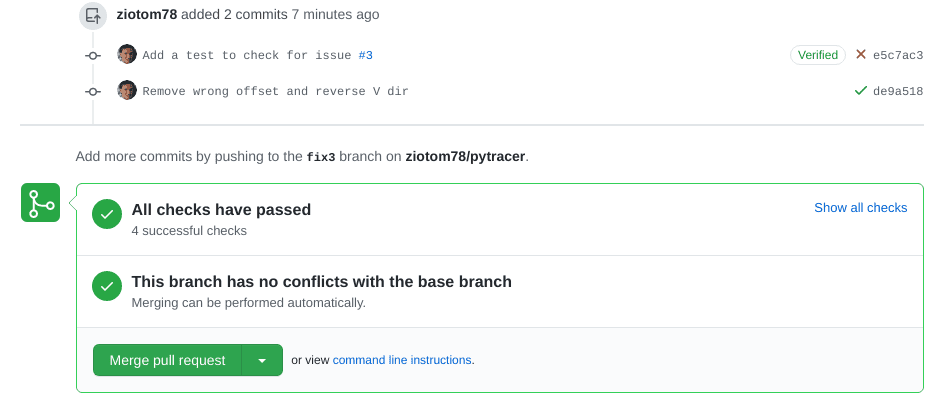
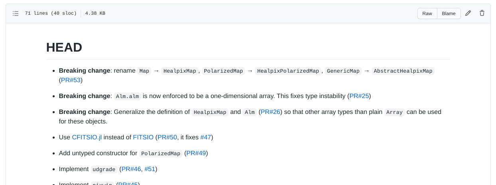
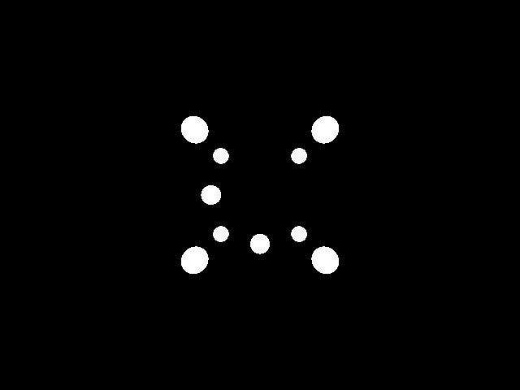
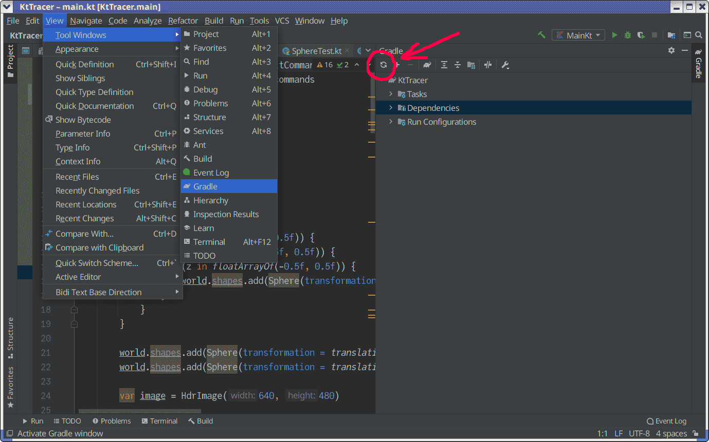

```python
class TestImageTracer(unittest.TestCase):
    # This is invoked automatically whenever you run `pytest`
    def setUp(self):
        self.image = HdrImage(width=4, height=2)
        self.camera = PerspectiveCamera(aspect_ratio=2)
        self.tracer = ImageTracer(image=self.image, camera=self.camera)

    def test_orientation(self):
        # Fire a ray against top-left corner of the screen
        top_left_ray = self.tracer.fire_ray(0, 0, u_pixel=0.0, v_pixel=0.0)
        assert Point(0.0, 2.0, 1.0).is_close(top_left_ray.at(1.0))

        # Fire a ray against bottom-right corner of the screen
        bottom_right_ray = self.tracer.fire_ray(3, 1, u_pixel=1.0, v_pixel=1.0)
        assert Point(0.0, -2.0, -1.0).is_close(bottom_right_ray.at(1.0))

    def test_uv_sub_mapping(self):
        ray1 = self.tracer.fire_ray(0, 0, u_pixel=2.5, v_pixel=1.5)
        ray2 = self.tracer.fire_ray(2, 1, u_pixel=0.5, v_pixel=0.5)
        assert ray1.is_close(ray2)

    def test_image_coverage(self):
        self.tracer.fire_all_rays(lambda ray: Color(1.0, 2.0, 3.0))
        for row in range(self.image.height):
            for col in range(self.image.width):
                assert self.image.get_pixel(col, row) == Color(1.0, 2.0, 3.0)
```

# Fallimento dei test

<asciinema-player src="cast/github-issue-failed-tests-86x22.cast" cols="86" rows="22" font-size="medium"></asciinema-player>

# Creazione di un PR

<center>{height=560px}</center>

# Correzione del bug

-   Questa è la correzione per il metodo `ImageTracer.fire_ray`:

    ```python
    u = (col + u_pixel) / self.image.width
    v = 1.0 - (row + v_pixel) / self.image.height
    ```

-   Facendo il commit, si vede che ora il test passa:

    <center>{height=280px}</center>

# Chiusura del bug

<iframe src="https://player.vimeo.com/video/544950712?badge=0&amp;autopause=0&amp;player_id=0&amp;app_id=58479" width="672" height="640" frameborder="0" allow="autoplay; fullscreen; picture-in-picture" allowfullscreen title="How to close an issue in GitHub"></iframe>

# Traccia dei bug

-   GitHub tiene traccia dei bug di un repository nella pagina dedicata: è possibile consultare quindi quali bug siano aperti e quali siano stati già chiusi.

-   Ma, come nel caso dei *commit*, una lista di bug è ben povera, e non racconta una «storia».

-   Vediamo ora lo scopo del file CHANGELOG.md, che è una forma di documentazione.

# CHANGELOG

-   Tutti i repository pubblici dovrebbero avere un file `CHANGELOG`/`NEWS`/`HISTORY`/…, che elenca i bug corretti e le nuove caratteristiche del codice elencati in funzione del numero di versione.

-   Questo è il file `HISTORY.md` di Julia:

    <center>{height=320px}</center>

# CHANGELOG

-   In un file `CHANGELOG` occorre indicare tutte le correzioni e modifiche fatte al codice.

-   Non serve essere verbosi, una volta che si inserisce il link alla *issue* o alla *pull request*: in genere basta una riga o due.

-   Va scritto in ordine **cronologico inverso**: ossia, le modifiche più recenti vanno riportate in cima. In questo modo è più semplice per chi legge vedere quali sono le novità.

-   Di solito si divide in sezioni, una per ogni versione del codice. La prima sezione si chiama di solito `HEAD`, e contiene le correzioni e le modifiche che finiranno nella prossima futura versione del codice.

# CHANGELOG di [Healpix.jl](https://github.com/ziotom78/Healpix.jl)

<center></center>


# CHANGELOG di [pytracer](https://github.com/ziotom78/pytracer)

-   Ho aggiunto nel repository di [pytracer](https://github.com/ziotom78/pytracer) questo file `CHANGELOG.md`, scritto in Markdown, che potete usare come ispirazione:

    ```markdown
    # HEAD

    -   Fix an issue with the vertical order of the images [#4](https://github.com/ziotom78/pytracer/pull/4)

    # Version 0.1.0

    -   First release of the code
    ```

-   Ricordatevi d'ora in poi che **ogni volta** che farete il *merge* di un *pull request* dovrete aggiornare `CHANGELOG.md` subito dopo!

# Cose da fare oggi

# La prima immagine!

<center></center>

# Geometria

```{.asy im_fmt="html" im_opt="-f html" im_out="img,stdout,stderr" im_fname="first-image-geometry"}
size(0,100);
import three;
currentlight=Viewport;

// Spheres on the vertexes of the cube
draw(shift( 0.5,  0.5,  0.5) * scale3(0.1) * unitsphere, white);
draw(shift(-0.5,  0.5,  0.5) * scale3(0.1) * unitsphere, white);
draw(shift( 0.5, -0.5,  0.5) * scale3(0.1) * unitsphere, white);
draw(shift(-0.5, -0.5,  0.5) * scale3(0.1) * unitsphere, white);
draw(shift( 0.5,  0.5, -0.5) * scale3(0.1) * unitsphere, white);
draw(shift(-0.5,  0.5, -0.5) * scale3(0.1) * unitsphere, white);
draw(shift( 0.5, -0.5, -0.5) * scale3(0.1) * unitsphere, white);
draw(shift(-0.5, -0.5, -0.5) * scale3(0.1) * unitsphere, white);

// Two additional spheres
draw(shift( 0.0,  0.0, -0.5) * scale3(0.1) * unitsphere, white);
draw(shift( 0.0,  0.5,  0.0) * scale3(0.1) * unitsphere, white);

// A wireframe to suggest the structure of the cube
path3 square = (
    ( 0.5,  0.5,  0.0) --
    (-0.5,  0.5,  0.0) --
    (-0.5, -0.5,  0.0) --
    ( 0.5, -0.5,  0.0) -- cycle);

draw(shift(0.0, 0.0,  0.5) * square, black);
draw(shift(0.0, 0.0, -0.5) * square, black);
draw(rotate(90, X) * shift(0.0, 0.0,  0.5) * square, black);
draw(rotate(90, X) * shift(0.0, 0.0, -0.5) * square, black);
draw(rotate(90, Y) * shift(0.0, 0.0,  0.5) * square, black);
draw(rotate(90, Y) * shift(0.0, 0.0, -0.5) * square, black);

// The screen
path3 screen = ((-1, -1, -0.5) -- (-1, -1, 0.5) -- (-1, 1, 0.5) -- (-1, 1, -0.5) -- cycle);

draw(surface(screen), gray + opacity(0.7));

// The observer
triple observer_pos = (-2.0, 0.0, 0.0);
draw(shift(observer_pos) * scale3(0.05) * unitsphere, white);

draw(observer_pos -- (-1, -1, -0.5), gray);
draw(observer_pos -- (-1, -1,  0.5), gray);
draw(observer_pos -- (-1,  1,  0.5), gray);
draw(observer_pos -- (-1,  1, -0.5), gray);

// Axes
draw(O--1.5X, gray); //x-axis
draw(O--1.5Y, gray); //y-axis
draw(O--1.5Z, gray); //z-axis

label("$x$", 1.5X + 0.2Z);
label("$y$", 1.5Y + 0.2Z);
label("$z$", 1.5Z + 0.2X);
```

# Forme

-   Dobbiamo implementare delle forme nel nostro codice.

-   Per oggi basta implementare un tipo `Sphere`; se volete, aggiungete anche un `Plane` (è molto veloce da aggiungere).

-   Create un tipo astratto `Shape`, che implementi il metodo (astratto) `ray_intersection`. Questo accetta come parametro un parametro `Ray` e restituisce un tipo `HitRecord`. Se il vostro linguaggio lo supporta, il tipo di ritorno dovrebbe essere *nullable*.

# `Shape` in Python

```python
class Shape:
    def __init__(self, transformation=Transformation()):
        self.transformation = transformation

    def ray_intersection(self, ray: Ray) -> Union[HitRecord, None]:
        return NotImplementedError(
            "Shape.ray_intersection is an abstract method and cannot be called directly"
        )
```

# `HitRecord`

-   Per restituire le informazioni su una intersezione, è buona norma usare un tipo dedicato: `HitRecord`.

-   Il tipo deve contenere queste informazioni:

    #.   `world_point`: punto 3D in cui è avvenuta l'intersezione (`Point`);
    #.   `normal`: normale della superficie all'intersezione (`Normal`);
    #.   `surface_point`: coordinate $(u, v)$ dell'intersezione (nuovo tipo `Vec2d`);
    #.   `t`: parametro del raggio associato all'intersezione;
    #.   `ray`: raggio di luce che ha causato l'intersezione.

-   Per i test è utile che implementi un metodo `is_close`/`are_close`.

# `Sphere` in Python

-   Ricordiamo che il numero di intersezioni tra il raggio $O + t \vec d$ e la sfera unitaria dipende dal discriminante:

    $$
    \frac\Delta4 = \left(\vec O \cdot \vec d\right)^2 - \left\|\vec d\right\|^2\cdot \left(\left\|\vec O\right\|^2 - 1\right).
    $$

-   Nel caso in cui $\Delta > 0$, le due intersezioni sono

    $$
    t = \begin{cases}
    t_1 &= \frac{-\vec O \cdot d - \sqrt{\Delta / 4}}{\left\|\vec d\right\|^2},\\
    t_2 &= \frac{-\vec O \cdot d + \sqrt{\Delta / 4}}{\left\|\vec d\right\|^2}.
    \end{cases}
    $$

# `Sphere` in Python

-   Dovete **antitrasformare** il raggio prima di calcolare l'intersezione:

    ```python
    def ray_intersection(self, ray: Ray) -> Union[HitRecord, None]:
        inv_ray = ray.transform(self.transformation.inverse())
        # ...
    ```

-   Quando avete calcolato `t1` e `t2`, dovete determinare quale delle due intersezioni è la più vicina all'origine del raggio:

    ```python
    if (tmin > inv_ray.tmin) and (tmin < inv_ray.tmax):
        first_hit_t = tmin
    elif (tmax > inv_ray.tmin) and (tmax < inv_ray.tmax):
        first_hit_t = tmax
    else:
        return None
    ```

#   Normali e coordinate UV

-   Dovete implementare il calcolo della normale al punto di intersezione; nel codice di [pytracer](https://github.com/ziotom78/pytracer/blob/d12284d0c60965e48b004a305d6ba8e28c13f757/shapes.py#L42-L51) ciò è fatto all'interno di `_sphere_normal`:

    ```python
    def _sphere_normal(point: Point, ray_dir: Vec) -> Normal:
        result = Normal(point.x, point.y, point.z)
        return result if (point.to_vec().dot(ray_dir) < 0.0) else -result
    ```

-   Serve anche il codice che calcola il punto di intersezione sulla superficie della sfera, in coordinate $(u, v)$ (`Vec2d` è un nuovo semplice tipo per queste coordinate):

    ```python
    def _sphere_point_to_uv(point: Point) -> Vec2d:
        return Vec2d(u=atan2(point.y, point.x) / (2.0 * pi), v=acos(point.z) / pi)
    ```

# Creazione di `HitRecord`

```python
hit_point = inv_ray.at(first_hit_t)
return HitRecord(
    world_point=self.transformation * hit_point,
    normal=self.transformation * _sphere_normal(hit_point, ray.dir),
    surface_point=_sphere_point_to_uv(hit_point),
    t=first_hit_t,
    ray=ray,
)
```

# Test per `Sphere` (1/2)

-   Il raggio con $O = (0, 0, 2)$ e $\vec d = -\hat e_z$ deve intersecare la sfera unitaria nel punto $P = (0, 0, 1)$ con normale $\hat n = \hat e_z$.
-   Il raggio con $O = (3, 0, 0)$ e $\vec d = -\hat e_x$ deve intersecare la sfera unitaria nel punto $P = (1, 0, 0)$ con normale $\hat n = \hat e_x$.
-   Il raggio con $O = (0, 0, 0)$ e $\vec d = \hat e_x$ deve intersecare la sfera unitaria in $P = (1, 0, 0)$ con normale $\hat n = -\hat e_x$ (il raggio è *interno* alla sfera).

In tutti questi casi verificate anche le coordinate $(u, v)$ e il valore di $t$.

# Test per `Sphere` (2/2)

-   Applicate una traslazione $\vec t = (10, 0, 0)$ alla sfera e intersecatela con il raggio con $O = (10, 0, 2)$ e $\vec d = -\hat e_z$.
-   Intersecate la stessa sfera traslata con il raggio con $O = (13, 0, 2)$ e $\vec d = -\hat e_x$. L'intersezione dovrebbe essere $P = (11, 0, 0)$ con normale $\hat n = \hat e_x$.
-   Verificate che non vi siano potenziali intersezioni con la sfera **non** traslata, usando questi raggi:
    #.  Raggio con $O = (0, 0, 2)$ e $\vec d = -\hat e_z$;
    #.  Raggio con $O = (-10, 0, 0)$ e $\vec d = -\hat e_z$;

In tutti questi casi verificate anche le coordinate $(u, v)$ e il valore di $t$.

# Il tipo `World`

-   Una scena è composta da tante forme.
-   Ci occorre un tipo che contenga questa lista di forme: il tipo `World`.
-   Esso deve mantenere al suo interno una lista di oggetti `Shape`: abbiate cura a dichiarare correttamente questa lista, perché alcuni linguaggi potrebbero richiedere cautele particolari per liste di oggetti astratti.
-   Deve implementare un metodo `ray_intersection` che iteri sulle forme, cerchi le intersezioni, e restituisca quella più vicina all'origine del raggio.

# `World` in Python

```python
class World:
    def __init__(self):
        self.shapes = []

    def add(self, shape: Shape):
        self.shapes.append(shape)

    def ray_intersection(self, ray: Ray) -> Union[HitRecord, None]:
        closest = None  # "closest" should be a nullable type!
        for shape in self.shapes:
            intersection = shape.ray_intersection(ray)

            if not intersection:
                continue

            if (not closest) or (intersection.t < closest.t):
                closest = intersection

        return closest
```

# Il nostro demo

<center></center>

L'asimmetria nella disposizione delle sfere consente di individuare errori nell'ordinamento delle righe/colonne dell'immagine.

# La scena

-   Posizionate le sfere ai vertici del cubo con spigoli $(\pm 0.5, \pm 0.5, \pm 0.5)$.
-   Ciascuna sfera deve avere raggio 1/10.
-   L'osservatore deve essere spostato di $-\hat e_x$, ossia la sua posizione deve essere $(-2, 0, 0)$ e il centro dello schermo $(-1, 0, 0)$.
-   Scegliete voi se usare `OrthogonalCamera` o `PerspectiveCamera`.

# Il `main`

-   Il nostro `main` è stato sinora in grado di convertire un'immagine PFM in un altro formato (PNG, JPEG, WebP, etc.)
-   Dobbiamo ora cambiare l'interfaccia del programma in modo che permetta di usare due modalità:
    #.  Conversione da PFM ad altri formati (la vecchia modalità);
    #.  Una nuova modalità `demo`, dove genera l'immagine descritta poco fa.

# Esempio in Python

-   In Python ho usato la libreria Click, che permette di costruire interfacce utente da linea di comando che supportano le cosiddette *actions* (altre librerie li chiamano *verbs*).

-   Dopo il nome dell'eseguibile va riportato un comando, seguito opzionalmente da parametri:

    ```text
    ./main.py pfm2png input.pfm output.png
    ./main.py demo --width=480 --height=480
    ./main.py --help
    ...
    ```

---

<asciinema-player src="cast/python-click-cli-example-88x27.cast" cols="88" rows="27" font-size="medium"></asciinema-player>

# Possibili interfacce

-   *Actions* esattamente come Click (se la vostra libreria li supporta);
-   Due eseguibili separati: `demo` e `pfm2png`
-   Richiesta di input da terminale:

    ```python
    print("What do you want to do? (demo/pfm2png)")
    choice = input(choice)
    if choice == "demo":
        # …
    ```
-   Eccetera…

# Comando `demo`

#.  Inizializzare un oggetto `World` con le 10 sfere nelle posizioni indicate;
#.  Creare un oggetto `OrthogonalCamera` o `PerspectiveCamera` ([pytracer](https://github.com/ziotom78/pytracer/blob/d12284d0c60965e48b004a305d6ba8e28c13f757/main.py#L125-L130) consente all'utente di scegliere);
#.  (Opzionale) Potete provare a ruotare l'osservatore per ottenere angolazioni più interessanti (v. seguito);
#.  Create un oggetto `ImageTracer`;
#.  Fare un tracing dell'immagine, usando un criterio «on/off» (v. slide seguente);
#.  Salvare l'immagine PFM;
#.  (Opzionale) Convertite immediatamente l'immagine in PNG usando valori di default per il tone-mapping.

# On-off tracing

-   Un ray-tracer on/off controlla se il raggio ha colpito una superficie, e in caso positivo colora il pixel con un colore arbitrario (bianco), altrimenti lo colora col colore di sfondo (nero).

-   Nel nostro caso è sufficiente invocare `fire_all_rays` passando come argomento una funzione di una riga:

    ```python
    tracer.fire_all_rays(lambda ray: WHITE if world.ray_intersection(ray) else BLACK)
    ```

# Animazioni

-   Nella modalità `demo`, il codice Python permette di modificare l'orientazione dell'osservatore rispetto agli assi tramite il flag `--angle-deg`.

-   Questo può essere usato per generare delle animazioni tramite semplici script Bash:

    ```sh
    for angle in $(seq 0 359); do
        # Angle with three digits, e.g. angle="1" → angleNNN="001"
        angleNNN=$(printf "%03d" $angle)
        ./main.py demo --width=640 --height=480 --angle-deg $angle --output=img$angleNNN.png
    done

    # -r 25: Number of frames per second
    ffmpeg -r 25 -f image2 -s 640x480 -i img%03d.png \
        -vcodec libx264 -pix_fmt yuv420p \
        spheres-perspective.mp4
    ```

# Proiezione prospettica

<video src="./media/spheres-perspective.mp4" width="640px" height="480px" controls loop autoplay/>

# Proiezione ortogonale

<video src="./media/spheres-orthogonal.mp4" width="640px" height="480px" controls loop autoplay/>

# Link a Gather

Useremo il solito link: [gather.town/app/CgOtJvyNfVKMIQ9e/LaboratorioRayTracing](https://gather.town/app/CgOtJvyNfVKMIQ9e/LaboratorioRayTracing)


# Guida per l'esercitazione


# Cose da fare

#.  Correggere il bug della scorsa volta aprendo una *issue*;
#.  Creare un file `CHANGELOG.md`;
#.  Lavorare su un nuovo branch `demo`;
#.  Creare i tipi `Shape`, `Sphere`, `World`, `Vec2d`;
#.  Implementare il comando `demo`, nel modo in cui preferite;
#.  Aprire una PR e aggiornare il file `CHANGELOG.md`.


# Indicazioni per C++

# Indicazioni per C++

-   Se vi piace l'interfaccia a linea di comando di pytracer, potete usare librerie come [args](https://github.com/Taywee/args) o [CLI11](https://github.com/CLIUtils/CLI11#other-parsers), che supportano le *azioni* (chiamate rispettivamente *commands* e *subcommands*).

-   Per implementare il tipo `World`, usate [`make_shared`](https://www.cplusplus.com/reference/memory/make_shared/) e [`shared_ptr`](https://www.cplusplus.com/reference/memory/shared_ptr/).

    In questo modo evitate di dover chiamare `new` e `delete` per creare distruggere gli oggetti derivati da `Shape`.

# Esempio di `shared_ptr`

```c++
#include <iostream>
#include <memory>
#include <vector>

using namespace std;

struct Shape {};
struct Sphere : public Shape {};
struct Plane : public Shape {};

int main() {
  // This would work even if "Shape" were an abstract type
  std::vector<std::shared_ptr<Shape>> list_of_shapes;

  // This calls "new" automatically, and it will call "delete" at the end
  list_of_shapes.push_back(make_shared<Sphere>());
  list_of_shapes.push_back(make_shared<Sphere>());
  list_of_shapes.push_back(make_shared<Plane>());
}
```

# Indicazioni per Julia

# Indicazioni per Julia

-   Non preoccupatevi troppo dell'interfaccia da linea di comando: i programmi Julia non sono pensati per essere efficienti da linea di comando. Potete limitarvi a fornire uno script `demo.jl` accanto a uno script `pfm2png.jl`.

-   Definite un `abstract struct` per `Shape`, e poi derivate il tipo `Sphere`.

-   In questa lezione vedrete veramente quanto può essere chiaro il codice matematico in Julia! (intersezione raggio-sfera).

# Indicazioni per C\#

# Indicazioni per C\#

-   La lezione di oggi dovrebbe essere molto semplice da implementare.

-   Sfruttate a fondo le caratteristiche OOP del C\#: definite una classe astratta `Shape` da cui derivare `Sphere`.

-   Se volete implementare una buona interfaccia utente, potete usare la libreria [RunInfoBuilder](https://github.com/rushfive/RunInfoBuilder) oppure [EntryPoint](https://github.com/Nick-Lucas/EntryPoint).


# Indicazioni per Kotlin

# Indicazioni per Kotlin

-   Come per il C\#, anche per Kotlin le cose da implementare oggi dovrebbero essere molto banali.

-   Per creare una interfaccia utente da linea di comando potete usare [Clikt](https://github.com/ajalt/clikt).

-   Se aggiungete questa dipendenza seguendo le istruzioni sul sito di Clikt, dovete poi scaricarla prima di poterla usare. È sufficiente usare l'icona *Refresh* nella finestra *Gradle* (v. slide successiva).

---

<center>{height=640px}</center>

# File JAR

-   È abbastanza noioso dover invocare `gradlew` per eseguire un programma Kotlin da linea di comando. Esiste però un plugin che consente di creare file JAR autonomi, l'equivalente degli «eseguibili» nel mondo Java.

-   Assicuratevi innanzitutto di avere una versione recente di Gradle e dello script `gradlew`:

    ```text
    gradle wrapper --gradle-version 7.0
    ```
    
# Gradlefile

Dovete modificare il file `build.gradle.kts` in modo che abbia le righe evidenziate col commento `// ←`:

```kotlin
import org.jetbrains.kotlin.gradle.tasks.KotlinCompile
import com.github.jengelman.gradle.plugins.shadow.tasks.ShadowJar  // ←

plugins {
    kotlin("jvm") version "1.5.0"
    id("com.github.johnrengelman.shadow") version "5.1.0"          // ←
    application
}

tasks.withType<ShadowJar>() {                                      // ←
    manifest {                                                     // ←
        attributes["Main-Class"] = "MainKt"                        // ←
    }                                                              // ←
}                                                                  // ←

// Etc.
```

# Creare ed eseguire JAR

-   Per creare un file JAR è sufficiente eseguire il comando

    ```text
    ./gradlew shadowJar
    ```

-   Il risultato sarà salvato nella directory `./build/libs` e avrà nome `*-all.jar`.

-   Potete eseguire da linea di comando un file JAR col comando

    ```text
    java jar NOMEFILE.jar
    ```
    
    eventualmente passando gli argomenti (senza bisogno di `--args` come avveniva per `gradlew`).
