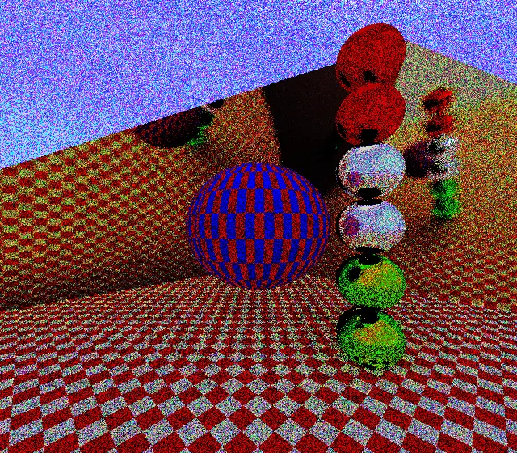
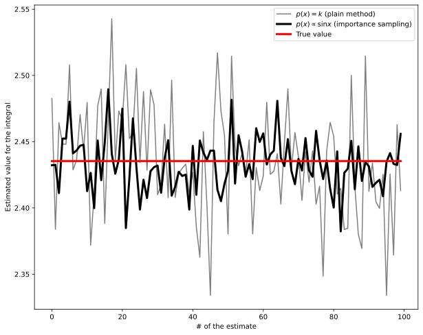
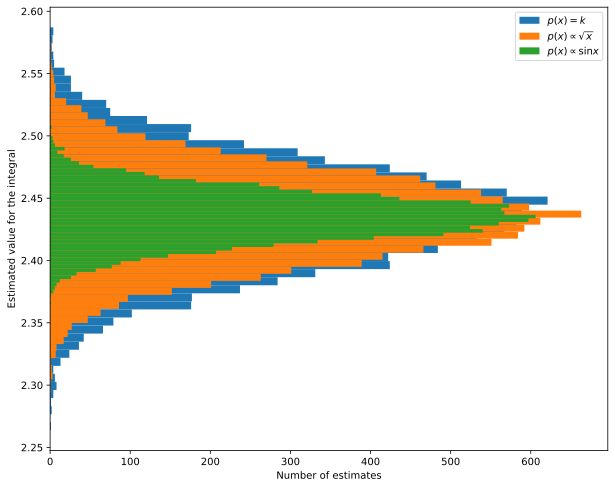
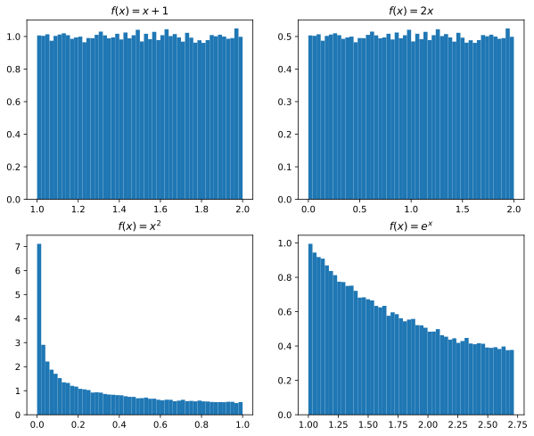
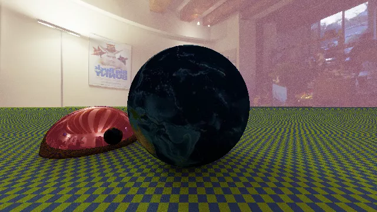

# Path tracing {#path-tracing}

# Rendering Equation

-   To solve the rendering equation we need to trace the path of light rays in three-dimensional space and solve the rendering equation:

    $$
    \begin{aligned}
    L(x \rightarrow \Theta) = &L_e(x \rightarrow \Theta) +\\
    &\int_{4\pi} f_r(x, \Psi \rightarrow \Theta)\,L(x \leftarrow \Psi)\,\cos(N_x, \Psi)\,\mathrm{d}\omega_\Psi.
    \end{aligned}
    $$

-   There are various ways to solve the equation, but we will implement only two: path tracing and point-light tracing.


# Path Tracing

-   It is conceptually the simplest method to implement.

-   It is able to produce *unbiased* solutions (without systematic effects).

-   It is computationally very inefficient.

-   There are many techniques to make it faster; we will implement only the simplest ones (it is not the main objective of the course!).


# Path Tracing

-   The most complex term of the rendering equation is the integral

    $$
    \begin{aligned}
    L(x \rightarrow \Theta) = &L_e(x \rightarrow \Theta) +\\
    &\int_{2\pi} f_r(x, \Psi \rightarrow \Theta)\,L(x \leftarrow \Psi)\,\cos(N_x, \Psi)\,\mathrm{d}\omega_\Psi,
    \end{aligned}
    $$

    which for simplicity we consider applied to an *opaque* and not transparent material (4π→2π).

-   As we have seen, it is actually a multiple integral, over an arbitrary number of dimensions: in these cases, integrals are efficiently estimated using Monte Carlo (MC) methods.


# Path Tracing and MC

-   The *path tracing* algorithm is as follows:

    #.  For each pixel on the screen, a ray is projected through the pixel.
    #.  When a ray hits a surface at a point $P$, the emission $L_e$ at point $P$ is evaluated.
    #.  The integral at point $P$ is evaluated using the Monte Carlo method, sampling the solid angle with $N$ new secondary rays that depart from $P$ along random directions.
    #.  For each secondary ray, the process is repeated recursively.

-   The algorithm allows to obtain an exact solution for the rendering equation, although at the cost of a large computation time.

---

<iframe width="1050" height="590" src="https://www.youtube.com/embed/eo_MTI-d28s" title="YouTube video player" frameborder="0" allow="accelerometer; autoplay; clipboard-write; encrypted-media; gyroscope; picture-in-picture" allowfullscreen></iframe>

[An explanation of the rendering equation (Eric Arnebäck)](https://www.youtube.com/watch?v=eo_MTI-d28s)


# Probability and Monte Carlo {#probability-and-mc}

# Probability Review

-   Given a variable $X$, the *cumulative distribution function* (CDF) $P(x)$ is the probability that $X$ is less than a fixed value $x$:

    $$
    P(x) = \mathrm{Pr}\{X \leq x\}
    $$

-   The *probability density function* (PDF) $p(x)$ is the derivative of $P(x)$, and is such that $p(x)\,\mathrm{d}x$ is the probability that $X$ is in the interval $[x, x + \mathrm{d}x]$:

    $$
    p(x) = \frac{\mathrm{d}P(x)}{\mathrm{d}x}.
    $$


# Probability Review

-   Since $\lim_{x \rightarrow -\infty} P(x) = 0$ and $\lim_{x \rightarrow +\infty} P(x) = 1$, it follows that

    $$
    \int_{\mathbb{R}} p(x)\,\mathrm{d}x = 1.
    $$

-   From the definition it follows that the probability that $X$ falls in the interval $[a, b]$ is

    $$
    P\bigl(X \in [a, b]\bigr) = P(b) - P(a) = \int_a^b p(x)\,\mathrm{d}x.
    $$


# Probability Review

-   The *expected value* of a function $f(X)$ dependent on the random variable $X$ with PDF $p(x)$ is defined as

    $$
    E_p[f] = \int_\mathbb{R}\,f(x)\,p(x)\,\mathrm{d}x.
    $$

-   The *variance* of $f(X)$ with respect to $p$ is defined as

    $$
    V_p[f] = E_p\left[\bigl(f(x) - E_p[f]\bigr)^2\right] = \int_\mathbb{R}\,\bigl(f(x) - E_p[f]\bigr)^2\,p(x)\,\mathrm{d}x.
    $$

-   The *standard deviation* is defined as $\sqrt{V_p[f]}$.


# Probability Review

-   $E_p$ is a linear operator:

    $$
    E_p[a f(x)] = a E_p[f(x)], \quad E[f(x) + g(x)] = E[f(x)] + E[g(x)].
    $$

-   For the variance (which is **not linear!**) it holds that

    $$
    V_p[a f(x)] = a^2 V_p[f(x)].
    $$

-   From these properties it follows that

    $$
    V_p[f] = E_p\bigl[f^2(x)\bigr] - E_p\bigl[f(x)\bigr]^2.
    $$

# Monte Carlo Integration

# Monte Carlo Integration

-   In the *path tracing* algorithm, the integrals that appear in the rendering equation must be calculated

-   It is a recursive integral, therefore of infinite dimension: Monte Carlo methods are necessary.

-   In Monte Carlo methods, the variance must be carefully controlled, because if it is excessive the quality of the image suffers.

---

<center>

</center>

If the variance in the estimation of the integrals is excessive, a grainy image is created.


# Variance in MC methods

-   Suppose we want to numerically calculate the value of the integral

    $$
    I = \int_a^b f(x)\,\mathrm{d}x
    $$

-   The mean method provides a simple approximation $F_N$ for $I$:

    $$
    I = \int_a^b f(x)\,\mathrm{d}x \approx F_N \equiv (b - a) \cdot \left[\frac1N \sum_{i=1}^N f(X_i)\right],
    $$

    where $X_i$ are $N$ random numbers with constant PDF $p(x) = 1 / (b - a)$.


---

$$
\begin{aligned}
E_p[F_N] &= E_p\left[\frac{b - a}N \sum_{i = 1}^N f(x_i)\right] =\\
&= \frac{b - a}N \sum_{i = 1}^N E_p[f(x_i)] =\\
&= \frac{b - a}N \sum_{i = 1}^N \int_{\mathbb{R}} f(x)\,p(x)\,\mathrm{d}x = \\
&= \frac1N \sum_{i = 1}^N \int_a^b f(x)\,\mathrm{d}x = \int_a^b f(x)\,\mathrm{d}x = I.
\end{aligned}
$$

# Importance Sampling

-   It is easy to show that if $X$ follows an arbitrary distribution $p(x)$, an estimator of the integral is

    $$
    F_N = \frac1N \sum_{i = 1}^N \frac{f(X_i)}{p(X_i)},
    $$

    provided that $p(x) > 0$ when $f(x) \not= 0$.

-   If $p(x)$ is chosen well, it is possible to increase the accuracy of the estimate. In the case where $f(x) = k \cdot p(x)$, in fact, the term in the sum is constant ($k$) and equal to the integral. Only $N = 1$ is needed to estimate it!

# Example

-   Let's see a practical example in the calculation of the integral of $f(x) = \sqrt{x}\,\sin x$:

    $$
    \int_0^\pi f(x)\,\mathrm{d}x = \int_0^\pi \sqrt{x}\,\sin x\,\mathrm{d}x \approx 2.435.
    $$

-   To use importance sampling we must decide which $p(x)$ to use:

    1.  $p(x) \propto \sqrt{x}\,\sin x$? (No, this is precisely the integrand!)
    2.  $p(x) \propto \sqrt{x}$?
    3.  $p(x) \propto \sin x$?

-   To decide, it is always good to plot the integrand $f(x)$.

---

-   This is the graph of $f(x)$ and our hypotheses for $p(x)$:

    <center>
    ```{.gnuplot im_fmt="svg" im_out="img" im_fname="importance-sampling-demo1"}
    set terminal svg font "Helvetica,18"
    set xlabel "x"
    set ylabel "y"
    set key left top
    plot [0:3.14159] sqrt(x) lw 2 lt rgb "#33c013" t "√x", \
                     sin(x) lw 2 lt rgb "#c03333" t "sin x", \
                     sqrt(x) * sin(x) lw 5 lt rgb "#000000" t "f(x)"
    ```
    </center>

-   Clearly the best option is $p(x) \propto \sin x$, because its shape resembles that of $f(x)$.

# Example

-   Normalizing $p(x) \propto \sin x$ over the integration domain, we obtain

    $$
    p(x) = \frac{\chi_{[0, \pi]}(x)}2 \sin x.
    $$

-   We must now obtain random numbers $X_i$ that follow this distribution. We use the inverse transform sampling method, passing from the PDF $p(x)$ to the CDF $P(x) = \mathrm{Pr}\{X \leq x\}$:

    $$
    P(x) = \int_{-\infty}^x p(x')\,\mathrm{d}x' = \frac12(1 - \cos x)\quad\text{ for }x \in [0, \pi].
    $$

# Example

-   Since $P(x) = \frac12 (1 - \cos x)$, then

    $$
    P^{-1}(y) = \arccos(1 - 2y).
    $$

-   Therefore, if $Y_i$ is uniformly distributed over $[0, 1]$, then $P^{-1}(Y_i) = X_i$ is distributed according to $p(x)$. (We will see shortly how to rigorously demonstrate this).

-   We now implement a Python code that calculates the integral using the mean method **without** and **with** importance sampling, to actually verify what the advantage is.

---

```python
import numpy as np, matplotlib.pylab as plt

def estimate(f, n):  # Plain mean method
    x = np.random.rand(n) * np.pi  # Random numbers in the range [0, π]
    return np.pi * np.mean(f(x))

def estimate_importance(f, n):  # Mean method with importance sampling
    x = np.random.rand(n)       # Uniform random numbers in the range [0, 1]
    xp = np.arccos(1 - 2 * x)   # These are distributed as p(x) = 1/2 sin(x)
    return np.mean(f(xp) / (0.5 * np.sin(xp)))

# Estimate many times the same integral using the two methods
f = lambda x: np.sqrt(x) * np.sin(x)
est1 = [estimate(f, 1000) for i in range(100)]
est2 = [estimate_importance(f, 1000) for i in range(len(est1))]

fig = plt.figure(figsize=(10, 8))
plt.plot(est1, label='$p(x) = k$ (plain method)', color="gray")
plt.plot(est2, label='$p(x) \propto \sin x$ (importance sampling)',
         color="black", linewidth=3)
plt.plot(2.435321164 * np.ones(len(est1)), label="True value",
         color="red", linewidth=3)

plt.xlabel("# of the estimate")
plt.ylabel("Estimated value for the integral")
plt.legend()
```

---

<center></center>


# Another option

-   What would change if we pick $p(x) \propto \sqrt x$? The following Python code implements *importance sampling* in this case:

    ```python
    def estimate_importance2(f, n):
        x = np.random.rand(n)

        # This is because P⁻¹ (y) = (3/2 y)^⅔
        xp = np.pi * x ** (2 / 3)

        # p(x) = 3/(2π^3/2) * √x
        return np.mean(f(xp) / (3 / (2 * np.pi ** 1.5) * np.sqrt(xp)))
    ```

-   This time, we will use a histogram to show how the MC samples are distributed around the true value.

---

```python
# The first part of the script is the same as in the previous example
# …

def estimate_importance2(f, n):
    x = np.random.rand(n)

    # These are distributed as p(x) = 3/(2π^3/2) * √x
    xp = np.pi * x**(2/3)

    return np.mean(f(xp) / (3 / (2 * np.pi ** 1.5) * np.sqrt(xp)))

est0 = [estimate(f, 1000) for i in range(10_000)]
est1 = [estimate_importance1(f, 1000) for i in range(10_000)]
est2 = [estimate_importance2(f, 1000) for i in range(10_000)]

fig = plt.figure(figsize=(10, 8))
plt.hist(est0, bins=50, label="$p(x) = k$", orientation="horizontal")
plt.hist(est2, bins=50, label="$p(x) \propto \sqrt{x}$", orientation="horizontal")
plt.hist(est1, bins=50, label="$p(x) \propto \sin x$", orientation="horizontal")
plt.legend()
plt.xlabel("Number of estimates")
plt.ylabel("Estimated value for the integral")
```

---

<center></center>


---

<center>

</center>

If we choose the way we integrate carefully, we can reduce the variance in the pixels of the image produced by our code.


# Implementing Path Tracing

# Application to Ray Tracing

-   Let's consider the rendering equation:

    $$
    \begin{aligned}
    L(x \rightarrow \Theta) = &L_e(x \rightarrow \Theta) +\\
    &\int_{2\pi} f_r(x, \Psi \rightarrow \Theta)\,L(x \leftarrow \Psi)\,\cos(N_x, \Psi)\,\mathrm{d}\omega_\Psi.
    \end{aligned}
    $$

-   The integral is over two dimensions ($\mathrm{d}\omega$ is a solid angle), so it makes sense to use the mean value method.

# Using the Mean Value Method

-   The integral can be estimated with this procedure:

    #.  Choose $N$ random directions $\Psi_i$ (or equivalently infinitesimal solid angles $\mathrm{d} \omega_i$);
    #.  Evaluate the integrand along the $N$ directions, obtaining $N$ estimates;
    #.  Apply the mean value method by calculating the average of all the $N$ estimates.

-   However, there are two complications:

    -   How do we choose the «random directions» $\Psi_i$? Here we are in 2D, not 1D!
    -   How do we evaluate the integrand, since it is recursive?

# Random Directions {#random-directions}

-   We have always indicated directions with the angles θ and φ, related to Cartesian coordinates through spherical coordinates with $r = 1$:

    $$
    x = \sin\theta\cos\varphi, \quad y = \sin\theta\sin\varphi, \quad z = \cos\theta.
    $$

-   Even if we wanted to apply the mean value method *without* importance sampling, we should have a constant probability $p(\omega)$. But this does **not** coincide with requiring that $p(\theta)$ and $p(\varphi)$ be constant!

-   We must choose the random directions so that $p(\omega)$ is constant, and to do this we must understand how changes of variables act on probability distributions in $n$ dimensions.

# 1D Probability Distributions

-   If the random variables $X_1, X_2, \ldots$ have a distribution $p_X(x)$, and if we define an *invertible* transformation $Y = f(X)$, for which there exists an $f^{-1}$ such that $X = f^{-1}(Y)$, we ask ourselves: what is the distribution $p_Y(y)$ of the $Y_i$?

-   There are many ways to calculate $p_Y$. The simplest is to directly calculate the CDF of the $Y$:

    $$
    P_Y(y) = \mathrm{Pr}(Y \leq y) = \mathrm{Pr}\bigl(f(X) \leq y\bigr).
    $$

    At this point we can apply $f^{-1}$ to both sides of the inequality $f(X) \leq y$, but with a caveat.

# 1D Probability Distributions

-   If $f^{-1}$ is an *increasing* function, it holds that

    $$
    f(X) \leq y\quad\Rightarrow\quad X \leq f^{-1}(y).
    $$

-   If it is decreasing instead, it holds that

    $$
    f(X) \leq y\quad\Rightarrow\quad X \geq f^{-1}(y).
    $$

-   Let's first see the case where $f^{-1}$ is increasing.

# Case of Increasing Inverse

-   In this case

    $$
    P_Y(y) = \mathrm{Pr}\bigl(f(X) \leq y\bigr) = \mathrm{Pr}\bigl(X \leq f^{-1}(y)\bigr) = P_X\bigl(f^{-1}(y)\bigr).
    $$

-   From the CDF $P_Y(y)$ we can move to the PDF by applying the formula for the derivative of a composite function:

    $$
    p_Y(y) = P_Y'(y) = \frac{\mathrm{d} P_X\bigl(f^{-1}(y)\bigr)}{\mathrm{d}y} = p_X\bigl(f^{-1}(y)\bigr)\cdot \frac{\mathrm{d}f^{-1}}{\mathrm{d}y}(y).
    $$

# Case of Decreasing Inverse

-   If $f^{-1}$ is a decreasing function, then it holds that

    $$
    P_Y(y) = \mathrm{Pr}\bigl(X \geq f^{-1}(y)\bigr) = 1 - \mathrm{Pr}\bigl(X \leq f^{-1}(y)\bigr) = 1 - P_X\bigl(f^{-1}(y)\bigr).
    $$

-   Applying the derivative again as in the previous case, we get

    $$
    p_Y(y) = P_Y'(y) = \frac{\mathrm{d} P_X\bigl(f^{-1}(y)\bigr)}{\mathrm{d}y} = -p_X\bigl(f^{-1}(y)\bigr)\cdot \frac{\mathrm{d}f^{-1}}{\mathrm{d}y}(y).
    $$

-   Note, however, that the derivative of $f^{-1}$ is *negative* in this case.

# General Case

-   Combining the two cases, we get

    $$
    p_Y(y) = p_X\bigl(f^{-1}(y)\bigr)\cdot \left|\frac{\mathrm{d}f^{-1}}{\mathrm{d}y}(y)\right|,
    $$

    which is correct because $p_Y(y)$ must always be positive. This relationship also preserves the normalization of $p_Y$.

-   A mnemonic trick to remember it starts from the fact that $p_Y(y)\,\left|\mathrm{d}y\right| = p_X(x)\,\left|\mathrm{d}x\right|$ must hold: from here the above relationship is easily derived.

-   Let's see some practical examples.

# Examples

Suppose the variables $X$ are uniformly distributed on $[0, 1]$, so that $p_X(x) = \chi_{[0, 1]}(x)$, and suppose that $Y = f(X)$. Consequently:

#.   If $f(X) = X + 1$ and $f^{-1}(Y) = Y - 1$, then $p_Y(y) = \chi_{[1, 2]}(y)$.

#.   If $f(X) = 2X$ and $f^{-1}(Y) = Y / 2$, then $p_Y(y) = \frac12 \chi_{[0, 2]}(y)$.

#.   If $f(X) = X^2$ and $f^{-1}(Y) = \sqrt{Y}$, then $p_Y(y) = \frac{\chi_{[0, 1]}(y)}{2\sqrt{y}}$.

#.   If $f(X) = e^{X - 1}$ and $f^{-1}(Y) = 1 + \log Y$, then $p_Y(y) = \frac{\chi_{[1/e, 1]}(y)}y$.

# Verification in Python

You can numerically verify the correctness of the results in the previous slide with this Python program, which extracts 100,000 random numbers, transforms them, and plots their histogram:

```python
import numpy as np
import matplotlib.pylab as plt

curplot = 1
def plot_distribution(numbers, title, fun):
    global curplot
    plt.subplot(2, 2, curplot)
    plt.title(title)
    plt.hist(fun(numbers), bins=50, density=True)
    curplot += 1

numbers = np.random.rand(100_000)

fig = plt.figure(figsize=(10, 8))
plot_distribution(numbers, "$f(x) = x + 1$", lambda x: x + 1)
plot_distribution(numbers, "$f(x) = 2x$", lambda x: 2 * x)
plot_distribution(numbers, "$f(x) = x^2$", lambda x: x**2)
plot_distribution(numbers, "$f(x) = e^x$", lambda x: np.exp(x))

plt.savefig("distributions-python.svg", bbox_inches="tight")
```

---

<center></center>

# 2D Probability Distributions

-   Sampling solid angles is more complex because it requires drawing *pairs* of random numbers.

-   Fortunately, the math is similar to the 1D case. Since integrals and changes of variables are involved, the Jacobian determinant appears in the expression:

    $$
    p_Y(\vec y) = p_X\bigl(\vec{f}^{-1}(\vec y)\bigr)\cdot\left|\frac1{\det J(y)}\right|.
    $$

# Polar Coordinates

-   Suppose we draw two numbers $r, \theta$ with probability $p(r, \theta)$. If $r, \theta$ are the polar coordinates of a point on the plane, then the point has Cartesian coordinates

    $$
    x = r \cos \theta, \quad y = r \sin \theta.
    $$

-   The determinant of the Jacobian matrix is

    $$
    \det J = \det\begin{pmatrix}
    \partial_r x& \partial_\theta x\\
    \partial_r y& \partial_\theta y
    \end{pmatrix} =
    \det\begin{pmatrix}
    \cos\theta& -r\sin\theta\\
    \sin\theta& r\cos\theta
    \end{pmatrix} = r,
    $$

    and consequently $p(x, y) = p(r, \theta) / r$, or $p(r, \theta) = r\cdot p(x, y)$.

# Spherical Coordinates

-   In the case of spherical coordinates, we have

    $$
    x = r \sin\theta\cos\varphi, \quad y = r \sin\theta\sin\varphi, \quad z = r \cos\theta,
    $$

    and we find that $\det J = r^2 \sin\theta$.

-   Consequently, the following relation holds

    $$
    p(r, \theta, \varphi) = r^2 \sin\theta \cdot p(x, y, z),
    $$

    which, as in the polar case, can be used to derive $p(x, y, z)$ from $p(r, \theta, \varphi)$ and vice versa.

# Sampling the Hemisphere

-   Let's return to the problem of drawing random directions on the $2\pi\,\text{steradian}$ hemisphere. This is equivalent to drawing pairs $\theta, \varphi$ such that the probability is uniform.

-   Since random number generators allow us to draw *only one number at a time*, we must follow a procedure to derive first one and then the other.

-   To explain the procedure, we need two new concepts: the *marginal probability density function* and the *conditional probability density function*.

# Two New Definitions

-   We define the *marginal probability density function* $p(x)$:

    $$
    p(x) = \int_\mathbb{R} p(x, y)\,\mathrm{d}y,
    $$

    which is the probability of obtaining $x$ independently of the value of $y$.

-   The *conditional probability density function* $p(y \mid x)$ is the probability of obtaining $y$ given that a specific value $x$ has been obtained:

    $$
    p(y \mid x) = \frac{p(x, y)}{p(x)}\quad\Longleftrightarrow\quad p(x, y) = p(x) p(y \mid x).
    $$

# Example: «Cornell Box»

{height=560}

# Schema of the «Cornell Box»

{height=560}

# Example

-   Let's consider a simple example where $x$ and $y$ are discrete (Boolean) variables to understand the two definitions.

-   Suppose the two variables $x$ and $y$ represent the following:

    1.  $x \in \{T, F\}$ determines whether a ray started from the lamp on the ceiling;
    2.  $y \in \{T, F\}$ determines whether a ray hits the cube on the right.

-   Consequently, $p(T, T)$ is the probability that a ray starts from the lamp and reaches the right cube, $p(F, T)$ is the probability that a ray hits the same cube but did **not** start from the lamp.

# Example

-   The marginal density $p(x) = \int p(x, y)\,\mathrm{d}y$ in our example is interpreted as follows: $p(T)$ is the probability that a ray started from the lamp on the ceiling, regardless of where it is directed.

-   The conditional density $p(y \mid x)$ is such that $p(y = T \mid x = T)$ tells us the probability that a ray starting from the lamp ($x = T$) hits the cube ($y = T$).

-   The conditional density $p(x \mid y)$ (with $x$ and $y$ swapped) is such that $p(x = T \mid y = T)$ tells us the probability that a ray that hit the cube ($y = T$) started from the lamp ($x = T$).

# Application to Directions

-   Now let's see how to draw a random direction on the $2\pi$ hemisphere using the concepts we just learned.

-   The algorithm is simple:

    1.  Calculate the *marginal density* of one of the two variables, for example $\theta$;
    2.  Draw a random value for $\theta$ according to that marginal density: this is easy because we have reduced it to a 1D case;
    3.  Once $\theta$ is known, use the *conditional density* to estimate the probability of obtaining $\varphi$ given the particular $\theta$ we just obtained;
    4.  Draw $\varphi$ following the distribution just obtained: here too we are in a one-dimensional case that is easy to handle!

# Application to Directions

-   If on the hemisphere $\mathcal{H}^2$ we must have $p(\omega) = c$, then

    $$
    \int_{\mathcal{H}^2} p(\omega)\,\mathrm{d}\omega = 1 \quad \Rightarrow \quad c\int_{\mathcal{H}^2}\mathrm{d}\omega = 1\quad\Rightarrow\quad c = \frac1{2\pi}.
    $$

-   Since $p(\omega) = 1 / (2\pi)$ and $\mathrm{d}\omega = \sin\theta\,\mathrm{d}\theta\,\mathrm{d}\varphi$, then

    $$
    p(\omega)\mathrm{d}\omega = p(\theta, \varphi)\,\mathrm{d}\theta\,\mathrm{d}\varphi\quad\Rightarrow\quad p(\theta, \varphi) = \frac{\sin\theta}{2\pi}.
    $$

# PDF of θ and φ

-   The marginal density $p(\theta)$ is given by

    $$
    p(\theta) = \int_0^{2\pi} p(\theta, \varphi)\,\mathrm{d}\varphi = \int_0^{2\pi} \frac{\sin\theta}{2\pi}\,\mathrm{d}\varphi = \sin\theta.
    $$

-   The conditional density $p(\varphi \mid \theta)$ is

    $$
    p(\varphi \mid \theta) =
    \frac{p(\theta, \varphi)}{p(\theta)} =
    \frac{\sin\theta / 2\pi}{\sin\theta} =
    \frac1{2\pi}.
    $$

    Thus, the conditional density function for $\varphi$ is constant, which makes sense given the symmetry of the variable.

# Sampling θ and φ

-   To sample $\theta$ and $\varphi$ we need their CDF. For $\theta$, it is

    $$
    P_\theta(\theta) =
    \int_0^\theta p(\theta')\,\mathrm{d}\theta' =
    \int_0^\theta \sin\theta'\,\mathrm{d}\theta' =
    1 - \cos\theta,
    $$

-   Its inverse provides the formula to sample $\theta$:

    $$
    \theta = P_\theta^{-1}(X_1) = \arccos (1 - X_1) = \arccos X'_1,
    $$

    where we employ the fact that both $X_1$ and $1 - X_1$ are random numbers uniformly distributed over $[0, 1]$: this saves a subtraction.

# Sampling θ and φ

-   For $\varphi$, we need the conditional cumulative probability $P_\varphi(\varphi \mid \theta)$:

    $$
    P_\varphi(\varphi \mid \theta) =
    \int_0^\varphi p(\varphi' \mid \theta)\,\mathrm{d}\varphi' =
    \int_0^\varphi \frac1{2\pi}\,\mathrm{d}\varphi' =
    \frac{\varphi}{2\pi}.
    $$

-   Thus, our sample for $\varphi$ is just

    $$
    \varphi = P_\varphi^{-1}(X_2) = 2\pi X_2
    $$

    (a plain rescaling).

# Random Directions

This Python code generates a uniform distribution of directions over the $2\pi$ solid angle:

```python
import numpy as np
import matplotlib.pylab as plt

x1 = np.random.rand(1000)
x2 = np.random.rand(len(x1))

# Here is the transformation!
θ = np.arccos(x1)
φ = 2 * np.pi * x2

x = np.sin(θ) * np.cos(φ)
y = np.sin(θ) * np.sin(φ)
z = np.cos(θ)

fig = plt.figure()
ax = fig.add_subplot(projection='3d')

ax.scatter(x, y, z)
ax.set_zlim(-1, 1)
plt.savefig("uniform-density-random.svg", bbox_inches="tight")
```

---

<iframe src="pd-images/uniform-hemisphere-distribution.html" width="640" height="640" frameborder="0"></iframe>


# Phong Distribution {#phong-distribution}

-   A more general distribution that we will need is the following:

    $$
    p(\omega) = k \cos^n\theta,
    $$

    with $n$ an integer. (The form we obtained previously corresponds to the case $n = 0$).

-   Normalization is obtained in the usual way:

    $$
    \int_{\mathcal{H}^2} k \cos^n\theta\,\sin\theta\,\mathrm{d}\theta\,\mathrm{d}\varphi = \frac{2\pi}{n + 1}\quad\Rightarrow\quad k = \frac{n + 1}{2\pi}.
    $$

# Phong Distribution

-   The marginal density of $\theta$ is

    $$
    p(\theta) = (n + 1) \cos^n\theta\,\sin\theta.
    $$

-   The conditional density of $\varphi$ is again a constant, as is evident from the symmetry of $p(\omega)$:

    $$
    p(\varphi \mid \theta) = \frac1{2\pi}.
    $$


# Phong Distribution

-   Repeating the calculations we obtain

    $$
    \begin{aligned}
    \theta &= \arccos\left[\bigl(1 - X_1\bigr)^{\frac1{n + 1}}\right] = \arccos\left[\bigl(X'_1\bigr)^{\frac1{n + 1}}\right],\\
    \varphi &= 2\pi X_2,
    \end{aligned}
    $$

    where again $X_1$ and $X_2$ are random numbers with a uniform distribution on $[0, 1]$.

-   This distribution $p(\theta, \varphi)$ is called the *Phong distribution*.


# Example with $n = 1$

<iframe src="pd-images/cosine-hemisphere-distribution.html" width="560" height="560" frameborder="0"></iframe>


# BRDF

# Implementing a BRDF

-   To solve the rendering equation, we need to evaluate the term

    $$
    f_r(x, \Psi \rightarrow \Theta),
    $$

    which is a pure number that "weighs" the amount of radiation coming from direction $\Psi$ and reflected towards $\Theta$.

-   However, since $f_r$ depends on the frequency $\lambda$, it should actually be encoded as a function $f_r = f_r(\lambda)$…

-   …but due to the properties of the human eye, it is sufficient for $f_r$ to return *three* values: a pure number for the R component, one for G, and one for B.

# BRDF Characteristics

-   Conceptually, from a code perspective, it's useful to consider the BRDF of a material as composed of two types of information:

    #.  Those properties that depend on the angle of incidence of the light and the observer's position;
    #.  Those properties that do **not** depend on the direction, and which are identified under the collective name of *pigment*.

-   It is therefore convenient to define a `BRDF` type that contains a `Pigment` subtype.

# Pigment Types

-   The pigment does *not* determine the final appearance of the material because the greater or lesser glossiness/metallic nature/… are defined by the BRDF.

-   Pigments are usually used to represent the variability of a BRDF on the surface: under this hypothesis, what changes from point to point is not the *entire* BRDF, but only the pigment.

-   In *computer graphics*, various types of pigments are usually defined:

    #.   Uniform (also called *solid*, who knows why).
    #.   Checkered: very useful for debugging.
    #.   Image (also called *textured*).
    #.   [Procedural](https://en.wikipedia.org/wiki/Procedural_texture) (see chapter 5 of Shirley & Morley).

---

<iframe src="https://player.vimeo.com/video/549664049?badge=0&amp;autopause=0&amp;player_id=0&amp;app_id=58479" width="1102" height="620" frameborder="0" allow="autoplay; fullscreen; picture-in-picture" allowfullscreen title="Path-tracing example"></iframe>

# BRDF Form

-   The directional dependence of the BRDF depends both on the angle of incidence of the light with respect to the normal $\hat n$, and on the observer's viewing angle, also with respect to $\hat n$.

-   We have already seen some types of BRDF in the first lesson:

    #.   [Ideal Diffuse Surface](tomasi-ray-tracing-01a.html#/ideal-diffusive-surface);
    #.   [Reflective Surface](tomasi-ray-tracing-01a.html#/other-brdfs).

-   In the exercises, we will implement BRDFs, along with a random number generator.

# Example

<center></center>

In the scene, all surfaces are ideal diffuse surfaces, except for the red sphere, which implements a reflective BRDF. The environment is a sphere of very large radius whose material is based on an [HDR file](https://blog.gregzaal.com/2017/01/17/blender-institute-hdri/) (using a *textured* pigment).

---
title: "Lesson 10"
subtitle: "Calcolo numerico per la generazione di immagini fotorealistiche"
author: "Maurizio Tomasi <maurizio.tomasi@unimi.it>"
...
