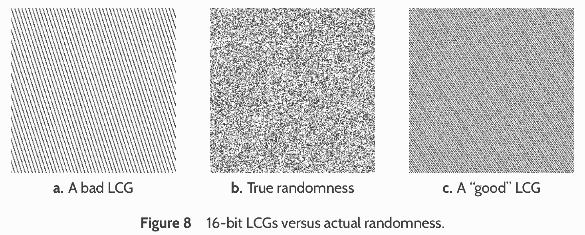

<center>
    <video src="media/flat-renderer.mp4" width="640" height="480" controls loop autoplay/>
</center>

(A causa del fatto che l'immagine è quasi completamente nera, il *tone mapping* fa saturare i colori se si usa il valore standard di luminosità; convertite l'immagine fissando una luminosità media di ~0.5).

# Generare animazioni

-   Generare un'animazione lunga può essere molto tedioso.

-   Se la CPU del vostro computer supporta più *core* (molto probabile), potete usare [GNU Parallel](https://www.gnu.org/software/parallel/) (`sudo apt install parallel` sotto Debian/Ubuntu/Mint) per usare tutti i core e produrre tanti frame contemporaneamente: il vantaggio in termini di tempo è impressionante!

-   Scrivete uno script `generate-image.sh` che produca una immagine dato un parametro numerico e rendetelo eseguibile con `chmod +x NOMEFILE`, poi eseguite il comando `parallel` in un modo simile a questo:

    ```text
    parallel -j NUM_OF_CORES ./generate-image.sh '{}' ::: $(seq 0 359)
    ```

# `generate-image.sh`

```sh
#!/bin/bash

if [ "$1" == "" ]; then
    echo "Usage: $(basename $0) ANGLE"
    exit 1
fi

readonly angle="$1"
readonly angleNNN=$(printf "%03d" $angle)
readonly pfmfile=image$angleNNN.pfm
readonly pngfile=image$angleNNN.png

time ./main.py demo --algorithm flat --angle-deg $angle \
    --width 640 --height 480 --pfm-output $pfmfile \
    && ./main.py pfm2png --luminosity 0.5 $pfmfile $pngfile
```


# Generazione di numeri pseudocasuali

---

<center>[](https://xkcd.com/221/)</center>

[xkcd.com/221/](https://xkcd.com/221/)

# Numeri pseudo-casuali

-   Avete sicuramente già avuto a che fare con numeri casuali, probabilmente per eseguire simulazioni Monte Carlo (vedi ad es. il corso di TNDS).

-   In questo corso non affronteremo in dettaglio il problema della generazione dei numeri casuali, ma useremo una serie di risultati senza dimostrarli.

-   Il contesto delle immagini fotorealistiche è interessante per verificare il funzionamento di un generatore di numeri casuali: se la qualità del generatore non è ottima, si vede subito!

---

<center></center>

# Come funziona un generatore

-   Un generatore di numeri pseudo-casuali è solitamente implementato come una *state machine*, ossia un algoritmo che mantiene in memoria una informazione sul proprio stato[^*], che viene aggiornata ogni volta che produce un nuovo numero.

-   I generatori usati oggi di solito producono numeri *interi* in un dato intervallo.

-   Essendo soltanto pseudo-casuali, se si conosce l'ultimo numero estratto e lo stato di un generatore, si può predire quale sarà il numero successivo (*determinismo*). Questo può essere un vantaggio!

# Qualità di un generatore

#.  I numeri che produce dovrebbero essere «casuali»…

#.  …ma anche predicibili!

#.  I numeri presi a coppie/terne/quaterne/etc. dovrebbero continuare ad essere «casuali».

#.  Dovrebbe essere veloce da eseguire.

#.  Dovrebbe essere possibile far avanzare velocemente il suo stato interno: questa proprietà viene detta «ricercabilità» (*seekability*).

# 1. «Casualità»

-   Un generatore di numeri *pseudo*-casuali deterministico deve avere un certo periodo $N$: una volta estratti $N$ valori, è condannato a ripetere nuovamente la sequenza (oppure, in rari casi, a fermarsi).
-   È importante che i primi $N$ valori siano distribuiti il più uniformemente possibile.
-   È anche importante che il periodo sia sufficientemente lungo! Nello studio del satellite PICO avevamo riscontrato strani risultati, dovuti al fatto che il periodo del generatore era «solo» $2^{32}$ e quindi dopo un certo tempo il codice rivedeva da capo gli stessi numeri.

# 2. Predicibilità

-   Siccome i numeri pseudo-casuali vengono impiegati per simulazioni al calcolatore, è importante poter fare il debugging del codice.

-   Se i numeri del generatore fossero *veramente* casuali e riscontrassimo un problema che emerge solo di tanto in tanto, il debugging sarebbe molto difficile!

-   Di solito i generatori richiedono di essere inizializzati con un «seme» (*seed*): se si fornisce due volte lo stesso seme, la sequenza di numeri è la stessa. Questo è *estremamente* utile!

# 3. Dimensionalità

-   I numeri casuali vengono spesso usati per produrre vettori casuali, ossia campioni $x \in \mathbb{R}^n$, per qualche valore di $n$ (ad esempio, punti sul piano con $n = 2$, punti nello spazio con $n = 3$, etc.).

-   Un cattivo generatore di numeri casuali può mostrare strane correlazioni quando usato per generare punti 2D, ma non mostrare alcun problema se usato per punti 1D.

-   Un generatore che mantiene le proprietà di «casualità» ad ogni dimensione si dice che soddisfa l'*equidistribuzione $k$-dimensionale*.

---

<center></center>

# 4. Velocità

-   Le applicazioni alla fisica dei metodi Monte Carlo richiedono di eseguire molte volte delle simulazioni, in modo da ridurre gli effetti del campionamento.

-   I generatori di numeri casuali più diffusi sai basano su operazioni a livello di bit, che sono le più veloci realizzabili con le comuni CPU.

-   Un generatore dovrebbe mantenere il proprio stato in una struttura di memoria il più piccola possibile: in questo modo è più facile per la CPU ottimizzarne l'esecuzione.


# 5. Ricercabilità

-   In un generatore ogni numero casuale viene ricavato dallo stato del generatore, e lo stato cambia per ogni nuovo numero generato. Di conseguenza, il valore casuale $x_{k + 1}$ dipende dalla conoscenza del valore $x_k$.

-   Se io volessi produrre $2\times 10^9$ numeri casuali avendo a disposizione due computer, potrei voler generare 10⁹ campioni sulla prima macchina e 10⁹ sulla seconda.

-   Se però non si imposta correttamente il problema, c'è il rischio che le due sequenze di campioni siano correlate.

# Esempio

-   Supponiamo che io inizi dal *seed* 5 sul primo computer, e assegno al secondo computer il *seed* 36.

-   Per colmo di sfortuna però, il generatore è tale per cui dopo il numero 5 estrae il numero 36…

-   …così che la sequenza di numeri generati è la seguente:

    ```text
    computer #1:  5  36  17  29  45  …
    computer #2: 36  17  29  45   3  …
    ```
    
-   Non basta dare un *seed* diverso ai due computer per essere sicuri!

# Soluzioni al problema

-   Una possibile soluzione è quella di avere un criterio per cui due stati del generatore siano *ortogonali*: ossia, non possono generare la stessa sequenza di campioni, neppure sfasata. Questi generatore tipicamente richiedono di essere inizializzati con *due* numeri iniziali: il *seed* e un identificativo della sequenza. Se si usano due identificativi diversi, le sequenze generate sono scorrelate.

-   Un'altra soluzione è quella di poter avanzare lo stato del generatore di $k$ passaggi in maniera rapida, *senza* effettivamente generare $k - 1$ numeri casuali e richiedendo un numero di operazioni ben minore di $\propto k$ (tipicamente vale che $\propto \log k$).

# Generazione parallela

Per generare una lunga sequenza di $N$ numeri casuali distribuendola su $k$ computer si può usare questa procedura:

#.  Parto da un *seed* fissato, oppure casuale (ricavato dalla data e ora in cui è stato eseguito il programma), e creo lo stato iniziale del generatore;
#.  Assegno a ognuno dei $k$ computer il compito di generare solo $N/k$ campioni, e copio lo *stesso* stato iniziale del generatore su ciascuno di essi;
#.  Sul computer $i$-esimo avanzo lo stato del generatore di $i \times N / k$, usando l'algoritmo «veloce»;
#.  Ogni generatore procede a generare i $N/k$ campioni.


# Algoritmi

-   Le librerie standard dei compilatori offrono funzionalità per la generazione dei numeri casuali, ma la qualità di questi generatori è molto diseguale!

-   Nel 2014 Melissa O'Neill ha pubblicato [uno splendido articolo](https://www.pcg-random.org/paper.html) su una nuova famiglia di generatori di numeri casuali che soddisfa *tutte* le caratteristiche elencate prima, ed è rilasciato come libreria open-source sul sito [www.pcg-random.org](https://www.pcg-random.org/).

-   In questo corso useremo quindi l'algoritmo PCG, che ha tutte le belle proprietà elencate prima.


# L'algoritmo PCG

-   L'algoritmo che implementeremo per generare numeri pseudo-casuali è descritto nello stesso articolo [O'Neill (2014)](https://www.pcg-random.org/paper.html).

-   Anche se potrebbero esistere implementazioni del PCG nel vostro linguaggio, è richiesto che lo implementiate da soli.

-   Ci sono infatti numerose varianti dell'algoritmo, che si distinguono per le dimensioni in bit delle quantità usate durante la generazione.

-   Faciliterà il lavoro dei vari gruppi se ciascuno userà il medesimo generatore col medesimo seed.

# Implementazione in Python

-   L'implementazione Python dell'algoritmo richiede delle operazioni che permettano di controllare il modo in cui Python esegue operazioni su interi.

-   A differenza dei linguaggi che usate voi (C++, Julia, etc.), in Python esiste solo un tipo `int`, le cui dimensioni si adattano a seconda del numero che va memorizzato.

-   In Python non è possibile avere un overflow, perché l'interprete Python alloca sempre più spazio per non perdere cifre.

-   I linguaggi che usate ottimizzano invece le prestazioni, e possono subire overflow. Questi overflow sono non solo accettati, ma addirittura *richiesti* nell'algoritmo PCG.

---

<asciinema-player src="cast/overflow-python-julia-74x26.cast" cols="74" rows="26" font-size="medium"></asciinema-player>

# Gestione degli interi

-   Per rendere Python più simile a Julia, si può implementare una funzione che mascheri i bit meno significativi, simulando i numeri a 64 e a 32 bit.

-   Un esempio di implementazione è il seguente:

    ```python
    def to_uint64(x: int) -> int:
        # Mask "x" with 2^64 - 1
        return x & 0xffffffffffffffff
    ```

-   Ovviamente questo non è necessario se si usa un linguaggio che implementa tipi interi di dimensione fissata. Questo è il caso di tutti i linguaggi che state usando 😀.


# Interi usati dal PCG

-   L'algoritmo PCG che implementeremo è quello che genera numeri a 32 bit nell'intervallo $[0, 2^{32} - 1]$ (`uint32_t` in C++).

-   La struttura dati usati dall'algoritmo PCG ha bisogno di memorizzare al suo interno due numeri interi `unsigned` a 64 bit.

-   Familiarizzatevi con i tipi di interi senza segno forniti dal vostro linguaggio.


# PCG in Python

-   Ecco l'implementazione del tipo `PCG` e del costruttore:

    ```python
    @dataclass
    class PCG:
        state: int = 0
        inc: int = 0

        def __init__(self, init_state=42, init_seq=54):
            self.state = 0
            self.inc = (init_seq << 1) | 1
            self.random()   # Throw a random number and discard it
            self.state += init_state
            self.random()   # Throw a random number and discard it
    ```

-   In Python non possiamo specificare i bit che ci occorrono, ma nelle vostre implementazioni dovrete dichiarare `state` e `inc` come `unsigned` a 64 bit.

# Il metodo `PCG.random`


```python
def random(self):
    # 64-bit variable
    oldstate = self.state

    self.state = to_uint64((oldstate * 6364136223846793005 + self.inc))
    
    # "^" is the xor operation
    xorshifted = to_uint32((((oldstate >> 18) ^ oldstate) >> 27))

    # 32-bit variable
    rot = oldstate >> 59

    return to_uint32((xorshifted >> rot) | (xorshifted << ((-rot) & 31)))
```

# Test per `PCG`

```python
def test_random():
    pcg = PCG()
    
    # You can check these members in a test only if you
    # did not declare "state" and "inc" as private members
    # of the PCG type
    assert pcg.state == 1753877967969059832
    assert pcg.inc == 109

    for expected in [2707161783, 2068313097,
                     3122475824, 2211639955,
                     3215226955, 3421331566]:
        assert expected == pcg.random()
```

# Numeri floating-point

-   Ovviamente il metodo `PCG.random` restituisce un numero *intero*.

-   Nella lezione di teoria però abbiamo sempre usato numeri pseudo-casuali $X_i$ distribuiti uniformemente su $[0, 1]$.

-   Dal momento che l'implementazione PCG che stiamo usando è a 32 bit e ha periodo $2^{32} -1$, è sufficiente normalizzare i numeri interi restituiti dall'algoritmo per avere la distribuzione uniforme:

    ```python
    def random_float(self) -> float:
        return self.random() / 0xffffffff
    ```

# *Seed*

-   Fate in modo che il costruttore del tipo `PCG` accetti come parametri di default i seguenti:

    ```text
    init_state = 42
    init_seq = 54
    ```
    
-   In questo modo nei test basterà creare una variabile `PCG` col costruttore di default e il test sarà ripetibile (e confrontabile tra gruppi diversi!).


# Guida per l'esercitazione


# Cose da fare

#.  Create un nuovo branch di nome `pathtracing`;
#.  Create i tipi `Pigment`, `UniformPigment`, `CheckeredPigment` (se vi va, implementate anche `ImagePigment`);
#.  Create i tipi `BRDF` e `DiffuseBRDF`;
#.  Creare il tipo `Material`;
#.  Modificate `Shape` perché contenga una istanza di `Material`;
#.  Modificate `HitRecord` perché contenga un puntatore alla `Shape` colpita da un raggio;
#.  Se vi va, implementate un flat-renderer (ma modificate anche il demo).
#.  Implementate il generatore PCG.
#.  Implementate gli stessi test di [pytracer](https://github.com/ziotom78/pytracer/blob/f6431700cab1205632d32a0021b0cd4aace5cd4c/test_all.py#L729-L841).


# Indicazioni per C++

# Indicazioni per C++

-   È necessario includere spesso un oggetto in un altro (un `Pigment` dentro un `BRDF`, un `Pigment` dentro un `Material`, etc.).
-   Il modo più efficiente di farlo è tramite `std::shared_ptr<T>`: abituatevi ad usarlo!
-   In questo modo è possibile creare un oggetto `Material` che viene usato da più forme (`Shape`) senza doverlo duplicare in memoria, e una `Shape` non deve essere copiata ogni volta in un `HitRecord` .

# Generatore PCG

-   Per usare i tipi interi con numero di bit fissato, dovete \#includere `<cstdint>`.

-   I tipi che vi interessano sono `uint32_t` e `uint64_t`.

-   Siccome lo stato del generatore va modificato ogni volta che si genera un numero casuale, quando una funzione lo richiede come parametro bisogna specificare il tipo come `PCG &` e non `const PCG &`.

# Indicazioni per C\#

# Indicazioni per C\#

-   I tipi interi a 32 e a 64 bit si indicano con `uint` e `ulong`.

-   Per obbligare un numero ad essere rappresentato come `uint` aggiungete una `U` (es. `10U`); per renderlo un `ulong` aggiungete `UL` (es. `10UL`).

# Indicazioni per Julia

# Indicazioni per Julia

-   I tipi interi a 32 e a 64 bit si indicano con `UInt32` e `UInt64`.

-   Per forzare un numero ad essere rappresentato come *unsigned*, scrivetelo in notazione esadecimale (es., `0xa` anziché `10`) oppure usate il costruttore del tipo: `UInt64(10)`.

-   L'operatore *xor* logico in Julia si indica con `⊻` (`\xor`).

# Indicazioni per Kotlin

# Numeri unsigned

-   Kotlin supporta tipi `unsigned` dalla versione 1.3, ma sono classificati come «sperimentali» fino alla versione 1.5, rilasciata pochi giorni fa. ([Qui l'annuncio](https://www.infoworld.com/article/3615548/kotlin-150-stabilizes-unsigned-integer-types.html)).

-   Per poter usare i tipi `unsigned` in una classe/funzione, potete fare l'upgrade alla versione 1.5 modificando `build.gradle.kts`. Altrimenti dovete indicare le classi e le funzioni che usano questi tipi (anche indirettamente) scrivendo `@ExperimentalUnsignedTypes`. Ad esempio:

    ```kotlin
    // Any class referring to PCG will need "@ExperimentalUnsignedTypes"
    @ExperimentalUnsignedTypes
    class PCG(initState: ULong = 42UL, initSeq: ULong = 54UL) {
        var state: ULong
        var inc: ULong
        init { /* … */ }
    }
    ```

# Operazioni su bit

-   In Kotlin le operazioni binarie usano nomi mnemonici anziché simboli.

-   Lo shift di bit a destra (`>>` in Python) e a sinistra (`<<`) si indica con `shr` (*SHift Right*) e `shl` (*SHift Left*).

-   L'operazione di *xor* tra bit si indica banalmente con `xor`.
