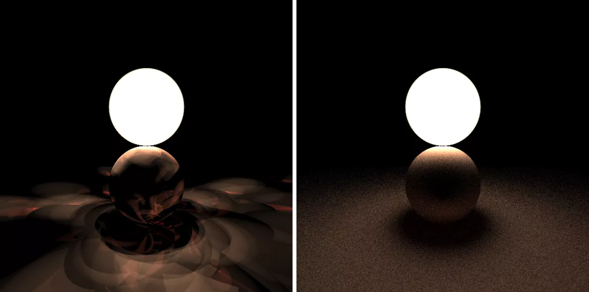
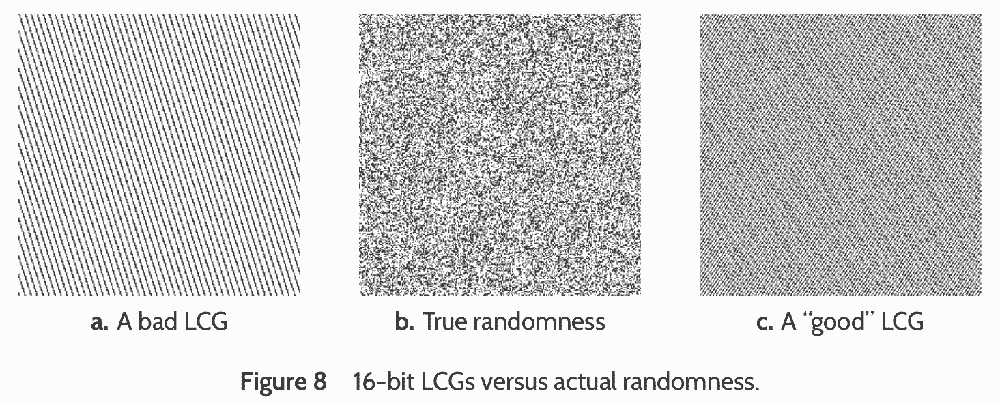
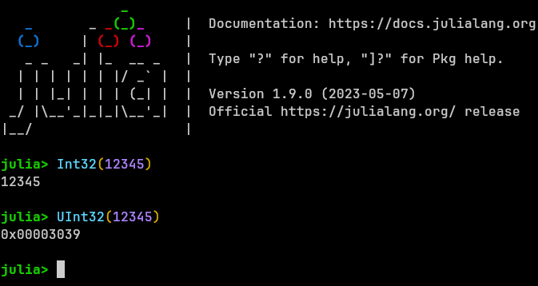
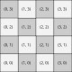

# Generating pseudorandom numbers {#random-numbers}

# Pseudorandom numbers

-   You have surely already dealt with random numbers, probably to perform Monte Carlo simulations (see e.g. the TNDS course).

-   In this course we will not address the problem of random number generation in detail, but we will use a series of results without proving them.

-   The context of photorealistic images is interesting to verify the operation of a random number generator: if the quality of the generator is not excellent, you spot it immediately!

---

<center></center>

# How a generator works

-   A pseudorandom number generator is usually implemented as a *state machine*, i.e., an algorithm that keeps information about its state in memory, which is updated every time it produces a new number.

-   The generators used today usually produce *integer* numbers in a given range.

-   Being only pseudo-random, if you know the last number drawn and the state of a generator, you can predict what the next number will be (*determinism*). This can be an advantage!

# Quality of a generator

#.  The numbers it produces should be "random"…

#.  …but also predictable!

#.  Numbers taken in pairs/triples/quadruples/etc. should continue to be "random".

#.  It should be fast to execute.

#.  It should be possible to quickly advance its internal state: this property is called "seekability".

# 1. "Randomness"

-   A deterministic *pseudo*-random number generator must have a certain period $N$: once $N$ values have been extracted, it is doomed to repeat the sequence again (or, in rare cases, to stop).
-   It is important that the first $N$ values are distributed as uniformly as possible.
-   It is also important that the period is sufficiently long! In the study of the PICO satellite we had encountered strange results, due to the fact that the period of the generator was "only" $2^{32}$ and therefore after a certain time the code reviewed the same numbers from the beginning.

# 2. Predictability

-   Since pseudo-random numbers are used for computer simulations, it is important to be able to debug the code.

-   If the generator's numbers were *truly* random and we encountered a problem that only emerges from time to time, debugging would be very difficult!

-   Usually generators require to be initialized with a "seed": if you provide the same seed twice, the sequence of numbers is the same. This is *extremely* useful!

# 3. Dimensionality

-   Random numbers are often used to produce random vectors, i.e., samples $x \in \mathbb{R}^n$, for some value of $n$ (for example, points on the plane with $n = 2$, points in space with $n = 3$, etc.).

-   A bad random number generator can work perfectly in generating 1D sequences, but show strange correlations when used to generate 2D points.

-   A generator that maintains the properties of "randomness" in $k$ dimensions is said to satisfy *$k$-dimensional equidistribution*.

---

# Example

-   Suppose that a generator produces 32-bit numbers where the first 31 bits are "random", but the last bit regularly alternates between 0 and 1:

    1.  1110111101100010110101110111001<font color=#f00>0</font> (even number)
    2.  1010001010100100001000010111010<font color=#f00>1</font> (odd number)
    3.  0100001101100101100111111000111<font color=#f00>0</font> (even number)
    4.  0101011011001110101000110101011<font color=#f00>1</font> (odd number)
    5.  Etc., so that **all** values between 0 and 2³²−1 are extracted once

-   If I want to produce random 2D points $(x, y)$ uniformly distributed, the abscissas will always have an even value and the ordinates an odd value ⇒ half of the theoretically possible points will actually never be chosen!

---

<center></center>

A *randogram* (see O'Neill, 2014).

# 4. Performance

-   Applications of Monte Carlo methods to physics require running many simulations to reduce the effects of sampling.

-   One way to achieve high speed is to use bitwise logical operations, which are the fastest operations that can be performed on common CPUs.

-   A generator should keep its state in the smallest possible memory structure: this makes it easier for the CPU to optimize its execution.


# 5. Seekability

-   In a generator, each random number is derived from the generator's state, and the state changes for each new number generated. Consequently, the random value $x_{k + 1}$ depends on the knowledge of the value $x_k$.

-   If I wanted to produce $2\times 10^9$ random numbers using two computers, I might want to generate $10^9$ samples on the first machine and $10^9$ on the second.

-   However, if the problem is not set up correctly, there is a risk that the two sample sequences will be correlated.

# Example

-   If I assign the same *seed* to the two computers, I get the same sequence: argh!

-   I could then assign the *seed* 5 to the first computer and the *seed* 36 to the second.

-   However, if the generator is such that after the number 5 it extracts the number 36, the sequence of generated numbers is then the following:

    ```text
    computer #1:  5  36  17  29  45  …
    computer #2: 36  17  29  45   3  …
    ```

-   Obviously, this would also be a problem if I assigned 17, 29, or 45 to the second computer instead of 36.

-   It is not enough to give a different *seed* to the two computers to obtain independent sequences!


# Solutions to the problem

-   One possible solution is to have a criterion whereby two states of the generator are *orthogonal*: that is, they cannot generate the same sequence of samples, not even shifted. These generators typically require initialization with *two* initial numbers: a sequence identifier and the *seed*. If two different identifiers are used, the generated sequences are uncorrelated.

-   Another solution is to be able to advance the state of the generator by $k$ steps quickly, *without* actually generating $k - 1$ random numbers and requiring a number of operations much less than $\sim k$ (typically $\sim \log k$).

# Parallel Generation

To generate a long sequence of $N$ random numbers by distributing it over $k$ computers, the following procedure can be used:

1. Start with a fixed *seed*, or a random one (obtained from the date and time the program was executed), and create the initial state of the generator;

2. Assign to each of the $k$ computers the task of generating only $N/k$ samples, and copy the *same* initial state of the generator to each of them;

3. On the $i$-th computer, advance the generator state by $i \times N / k$, using the "fast" algorithm;

4. Each generator proceeds to generate the $N/k$ samples.


# Algorithms

-   The standard libraries of compilers offer functionality for generating random numbers, but the quality of these generators is very uneven!

-   In 2014, Melissa O'Neill published [a fantastic article](https://www.pcg-random.org/paper.html) on a new family of random number generators that satisfies *all* the characteristics listed above, and it is released as an open-source library on the website [www.pcg-random.org](https://www.pcg-random.org/).

-   In this course, we will therefore use the PCG algorithm, which has all the nice properties listed above.


# The PCG Algorithm {#pcg-algorithm}

-   The algorithm we will implement to generate pseudo-random numbers is described in the same article [O'Neill (2014)](https://www.pcg-random.org/paper.html).

-   Even if there might be PCG implementations in your language, you are required to implement it yourself.

-   There are in fact numerous variants of the algorithm, which are distinguished by the bit size of the quantities used during generation.

-   If everyone uses the same generator with the same seed, it will be easier to do cross-group debugging!


# *Unsigned* Numbers

-   PCG, like many similar algorithms, requires calculations with bit masks.

-   Bit masks are usually encoded with unsigned integers.

    <center>
    {width=480px}
    </center>

-   A negative number like `-12` (`0b1100`) is encoded with two's complement: all bits of `12` are inverted and 1 is added, resulting in `0b11110100` (8 bits).

# Bitwise Operations

<small>

| Name             | Example (Julia)             |
|------------------|-----------------------------|
| And              | `0b1001 & 0b0011 == 0b0001` |
| Or               | `0b1001 | 0b0011 == 0b1011` |
| Xor              | `0b1001 ^ 0b0011 == 0b1010` |
| Arithmetic shift | `0b1001 >> 1 == 0b100`      |
|                  | `Int8(-12) >> 1 == -6`      |
|                  | `Int16(-12) >> 1 == -6`     |
| Logical shift    | `0b1001 >>> 1 == 0b100`     |
|                  | `Int8(-12) >>> 1 == 122`    |
|                  | `Int16(-12) >>> 1 == 32762` |
- In a right *arithmetic shift*, the new most significant bit is a copy of the old one, so as to preserve the sign.

- In a *logical shift*, the new most significant bit is always zero, and this is the one to use in PCG.

</small>

# Implementation in Python

-   The implementation of the PCG algorithm requires wrapping when integers overflow.

-   Unlike the languages you use, in Python there is only one `int` type, whose size adapts depending on the number to be stored.

-   Overflows are not possible in Python because the Python interpreter always allocates more space to avoid losing digits.

-   The languages you use, on the other hand, optimize for performance and can experience overflows. These overflows are not only accepted, but actually *required* in the PCG algorithm.

----

<asciinema-player src="cast/overflow-python-julia-74x26.cast" cols="74" rows="26" font-size="medium"></asciinema-player>

# Integer Management

-   To make Python behave more like Julia, you can implement a function that masks the least significant bits, simulating 64-bit and 32-bit numbers.

-   An example implementation is as follows:

    ```python
    def to_uint64(x: int) -> int:
        # Mask "x" with 2^64 - 1
        return x & 0xffffffffffffffff
    ```

-   Obviously, this is not necessary if you are using a language that implements fixed-size integer types. This is the case with all the languages you are using 😀.


# Integers Used by PCG

-   The PCG algorithm we will implement is the one that generates 32-bit numbers in the range $[0, 2^{32} - 1]$ (`uint32_t` in C++).

-   The data structure used by the PCG algorithm needs to store two 64-bit `unsigned` integers internally.

-   Familiarize yourselves with the unsigned integer types provided by your language. (Languages like Java don't have unsigned integers, so you have to make do with signed ones 🙁; however, Kotlin [implements them](https://kotlinlang.org/docs/unsigned-integer-types.html) 🥳)

-   I wrote a blog post about the caveats when working with unsigned types: [Use of `unsigned int` in C++](https://ziotom78.github.io/c++/2025/02/02/unsigned-and-c++.html). Even if you do not use C++, it might be worth reading it.


# PCG in Python

-   Here is the implementation of the `PCG` type and the constructor:

    ```python
    @dataclass
    class PCG:
        state: int = 0   # 64-bit unsigned integer
        inc: int = 0     # 64-bit unsigned integer

        def __init__(self, init_state=42, init_seq=54):
            self.state = 0
            self.inc = (init_seq << 1) | 1
            self.random()   # Throw a random number and discard it
            self.state += init_state
            self.random()   # Throw a random number and discard it
    ```

-   In Python, we cannot specify the bits we need, but in your implementations, you will have to declare `state` and `inc` as 64-bit `unsigned` integers.


# The `PCG.random` Method

```python
def random(self) -> int:  # 32-bit unsigned number (in Java, return a 64-bit number)
    oldstate = self.state    # 64-bit unsigned integer

    self.state = to_uint64((oldstate * 6364136223846793005 + self.inc))

    # "^" is the xor operation
    xorshifted = to_uint32((((oldstate >> 18) ^ oldstate) >> 27))

    # 32-bit variable
    rot = oldstate >> 59

    # Rotation with a wrap; in Java/Kotlin, use Integer.rotateRight(xorshifted, rot)
    # In Java, apply a two's complement (& 0xffffffffL) to return a long
    return to_uint32((xorshifted >> rot) | (xorshifted << ((-rot) & 31)))
```

# Tests for `PCG`

```python
def test_random():
    pcg = PCG()

    # You can check these members in a test only if you
    # did not declare "state" and "inc" as private members
    # of the PCG type
    assert pcg.state == 1753877967969059832
    assert pcg.inc == 109

    for expected in [2707161783, 2068313097,
                     3122475824, 2211639955,
                     3215226955, 3421331566]:
        assert expected == pcg.random()
```

# Floating-Point Numbers

-   Obviously, the `PCG.random` method returns an *integer*.

-   In path tracing, however, we will always need pseudo-random numbers $X_i$ uniformly distributed on $[0, 1]$.

-   Since the PCG implementation we are using is 32-bit and has a period of $2^{32} - 1$, it is sufficient to normalize the integers returned by the algorithm to obtain the uniform distribution:

    ```python
    def random_float(self) -> float:
        return self.random() / 0xffffffff
    ```

# *Seed*

-   Make sure that the constructor of the `PCG` type accepts the following default parameters:

    ```text
    init_state = 42
    init_seq = 54
    ```

-   This way, in the tests, it will be enough to create a `PCG` variable with the default constructor, and the test will be repeatable (and comparable between different groups!).


# BRDFs

# Data Types

-   Today we will start implementing our path-tracer, and we will begin with materials, BRDFs, and pigments. We will need these primitive data types:

    #.  The `Pigment` type is **abstract** and represents the color associated with a particular point on a surface $(u, v)$;
    #.  The `BRDF` type is **abstract** and represents the BRDF of a material, which must contain a `Pigment` member;
    #.  The `Material` type is **concrete** and represents the union of the emissive part of a material (the $L_e$ term, which we still represent as a `Pigment`) and its BRDF.

-   From the abstract types `Pigment` and `BRDF`, we will then derive a series of concrete types.

# `Pigment`

-   The base type `Pigment` is used to calculate a color (type `Color`) associated with a coordinate $(u, v)$, through a method/function `get_color`, which associates a `Vec2D` with a `Color`.

-   You should at least define these two types:

    -   `UniformPigment` (uniform color, the simplest pigment!);
    -   `CheckeredPigment` (checkerboard, useful for debugging).

-   You could also define an `ImagePigment` that is constructed from an `HdrImage`: this allows creating very interesting effects if applied to spheres with images containing [equirectangular projections](https://en.wikipedia.org/wiki/Equirectangular_projection). Use the implementation in [pytracer](https://github.com/ziotom78/pytracer/blob/f994f863bf2c37b3f3f73f681435895f8117c8fb/materials.py#L53-L73) as a reference.

# Checkered Pigment

<center>{height=420px}</center>

Color 1 is used in the squares where the row and column numbers are both even or odd, color 2 in the other cases. The number of divisions should be configurable in the constructor.

# `BRDF`

-   The `BRDF` type must encode the BRDF of the rendering equation, i.e.,

    $$
    f_r = f_r(x, \Psi \rightarrow \Theta).
    $$

-   The BRDF is by definition a scalar, but to represent the dependence on the wavelength $\lambda$, the Python code returns a `Color` instead of a `float`: each component (R/G/B) is the BRDF integrated over that band.

-   This is the prototype of `BRDF.Eval` as implemented in [pytracer](https://github.com/ziotom78/pytracer/blob/f6431700cab1205632d32a0021b0cd4aace5cd4c/materials.py#L92-L98):

    ```python
    class BRDF:
        def eval(self, normal: Normal, in_dir: Vec, out_dir: Vec, uv: Vec2d) -> Color:
            # …
    ```

# BRDF and `Pigment`

-   The `BRDF` type should contain a `Pigment` type or a derivative (in C++ for example, a pointer would be used, or `std::shared_ptr<Pigment>`).

-   Use the R/G/B components returned by the pigment for a given point $(u, v)$ on the surface to "weight" the contribution of $f_r$ to the various frequencies (if one of the RGB components is zero, all photons in that band are absorbed).

-   This is, for example, the implementation of the diffuse BRDF ($f_r = \rho_d / \pi$) in [pytracer](https://github.com/ziotom78/pytracer/blob/f6431700cab1205632d32a0021b0cd4aace5cd4c/materials.py#L101-L108), which effectively assumes $\rho_d = \rho_d(\lambda)$:

    ```python
    class DiffuseBRDF(BRDF):
        def eval(self, normal: Normal, in_dir: Vec, out_dir: Vec, uv: Vec2d) -> Color:
            return self.pigment.get_color(uv) * (self.reflectance / pi)
    ```

# `Material`

-   The `Material` type must encompass the information about the interaction between surface points and photons:

    #.  The BRDF $f_r = f_r(x, \Psi \rightarrow \Theta)$;
    #.  The emitted radiance as a function of the point on the surface: $L_e = L_e(u, v)$.

-   In [pytracer](https://github.com/ziotom78/pytracer/blob/f6431700cab1205632d32a0021b0cd4aace5cd4c/materials.py#L111-L115) it is defined as follows:

    ```python
    @dataclass
    class Material:
        """A material"""
        brdf: BRDF = DiffuseBRDF()
        emitted_radiance: Pigment = UniformPigment(BLACK)  # A *pigment*!
    ```

# Versatility

-   The `Pigment` type only needs to return a color given a coordinate $(u, v)$, so it only requires a `get_color` method. (It could therefore be rethought as a [*function object*](https://en.wikipedia.org/wiki/Function_object), if desired…)

-   The `BRDF` type will have to become more complex than how we implemented it today (in a path tracer, it is **not necessary to evaluate** $f_r$, and therefore we will use `BRDF.eval` for other purposes!), so it is better not to use shortcuts.

-   The `Material` type is simply the union of a BRDF and a pigment (the $L_e$ term), and will not be extended.

# Updating `Shape`

-   You must add an instance of a `Material` inside `Shape`:

    ```python
    class Shape:
        def __init__(self, transformation: Transformation = Transformation(),
                     material: Material = Material()):
            self.transformation = transformation
            self.material = material
    ```

-   The `HitRecord` type should be modified to also contain a pointer to the `Shape` object that was "hit" by the ray: this way it will be possible to trace back to the `Material` to use during the resolution of the rendering equation (an alternative is to save `Material` instead of `Shape`).


# Flat-renderer

-   Now that we have assigned a `Material` to each `Shape`, it is possible to create a slightly more interesting renderer than the on/off type used in our demo.

-   Specifically, we could implement a simple renderer that, instead of using black and white colors, assigns to a pixel the color of the `Pigment` calculated at the point where the ray hits the object.

-   The pytracer code implements a base class, [`Renderer`](https://github.com/ziotom78/pytracer/blob/f6431700cab1205632d32a0021b0cd4aace5cd4c/render.py#L24-L35), from which two classes derive: [`OnOffRenderer`](https://github.com/ziotom78/pytracer/blob/f6431700cab1205632d32a0021b0cd4aace5cd4c/render.py#L38-L49) and [`FlatRenderer`](https://github.com/ziotom78/pytracer/blob/f6431700cab1205632d32a0021b0cd4aace5cd4c/render.py#L52-L69): when running the `demo` command, you can choose which one to use via the `--algorithm` flag.

---

<center>
    <video src="media/flat-renderer.mp4" width="640" height="480" controls loop autoplay/>
</center>

(Due to the image being almost completely black, the *tone mapping* saturates the colors if the standard brightness value is used; convert the image by setting an average brightness of ~0.5).

# Generating Animations

-   Generating a long animation can be very tedious.

-   If your computer's CPU supports multiple *cores* (very likely), you can use [GNU Parallel](https://www.gnu.org/software/parallel/) (`sudo apt install parallel` under Debian/Ubuntu/Mint) to use all cores and produce many frames simultaneously: the time savings are impressive!

-   Write a script `generate-image.sh` that produces an image given a numeric parameter and make it executable with `chmod +x FILENAME`, then run the `parallel` command in a way similar to this:


    ```text
    parallel -j NUM_OF_CORES ./generate-image.sh '{}' ::: $(seq 0 359)
    ```

# `generate-image.sh`

```sh
#!/bin/bash

if [ "$1" == "" ]; then
    echo "Usage: $(basename $0) ANGLE"
    exit 1
fi

readonly angle="$1"
readonly angleNNN=$(printf "%03d" $angle)
readonly pfmfile=image$angleNNN.pfm
readonly pngfile=image$angleNNN.png

time ./main.py demo --algorithm flat --angle-deg $angle \
    --width 640 --height 480 --pfm-output $pfmfile \
    && ./main.py pfm2png --luminosity 0.5 $pfmfile $pngfile
```


# What to do today


# What to do today

1. Implement the PCG generator.
2. Create a new branch named `pathtracing`;
3. Create the types `Pigment`, `UniformPigment`, `CheckeredPigment` (if you like, also implement `ImagePigment`);
4. Create the types `BRDF` and `DiffuseBRDF`;
5. Create the type `Material`;
6. Modify `Shape` to contain an instance of `Material`;
7. Modify `HitRecord` to contain a pointer to the `Shape` hit by a ray;
8. If you like, implement a flat-renderer (in this case, update the demo).
9. Implement the same tests as [pytracer](https://github.com/ziotom78/pytracer/blob/f6431700cab1205632d32a0021b0cd4aace5cd4c/test_all.py#L729-L841).

---
title: "Laboratory 10"
subtitle: "Calcolo numerico per la generazione di immagini fotorealistiche"
author: "Maurizio Tomasi <maurizio.tomasi@unimi.it>"
...
