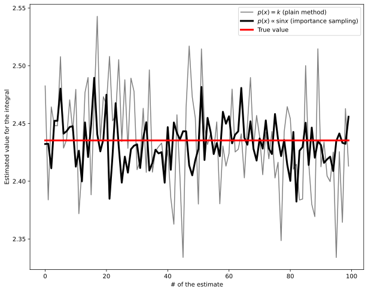
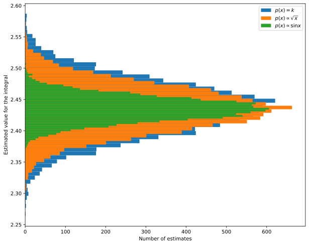
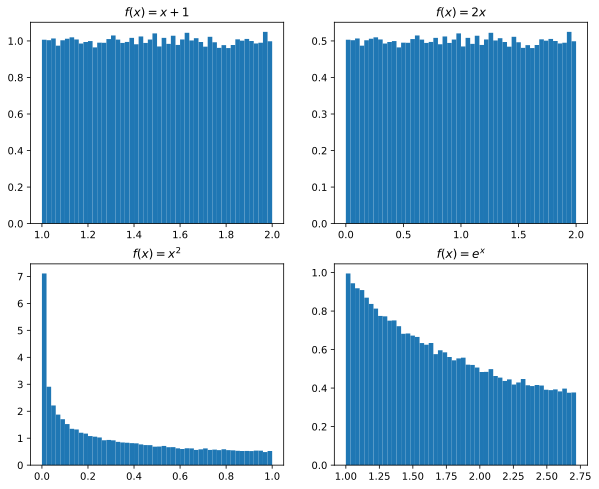
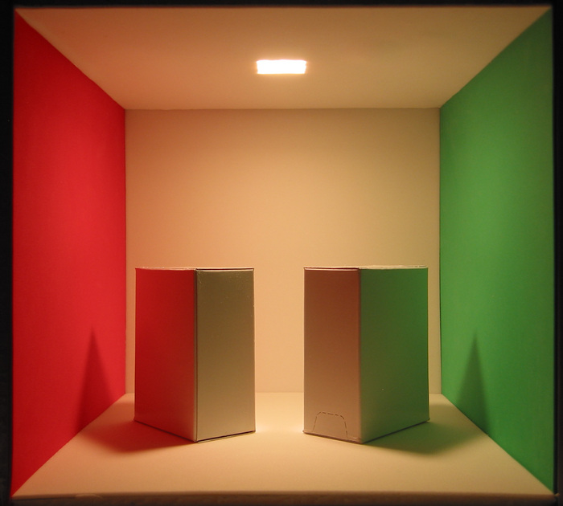
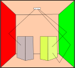

$$
\begin{aligned}
E_p[F_N] &= E_p\left[\frac{b - a}N \sum_{i = 1}^N f(x_i)\right] =\\
&= \frac{b - a}N \sum_{i = 1}^N E_p[f(x_i)] =\\
&= \frac{b - a}N \sum_{i = 1}^N \int_{\mathbb{R}} f(x)\,p(x)\,\mathrm{d}x = \\
&= \frac1N \sum_{i = 1}^N \int_a^b f(x)\,\mathrm{d}x = \int_a^b f(x)\,\mathrm{d}x = I.
\end{aligned}
$$

# *Importance sampling*

-   È facile dimostrare che se $X$ segue una distribuzione arbitraria $p(x)$, un estimatore dell'integrale è

    $$
    F_N = \frac1N \sum_{i = 1}^N \frac{f(X_i)}{p(X_i)},
    $$
    
    a patto che $p(x) > 0$ quando $f(x) \not= 0$. (Notate che qui non figura $b - a$).
    
-   Se si sceglie accuratamente $p(x)$, è possibile aumentare l'accuratezza della stima. Nel caso in cui $f(x) \propto p(x)$ infatti, il termine nella sommatoria è costante e uguale all'integrale: basta $N = 1$ per stimarlo!

# Esempio

-   Vediamo un esempio pratico nel calcolo dell'integrale di $f(x) = \sqrt{x}\,\sin x$:

    $$
    \int_0^\pi f(x)\,\mathrm{d}x = \int_0^\pi \sqrt{x}\,\sin x\,\mathrm{d}x \approx 2.435.
    $$
    
-   Per usare l'*importance sampling* dobbiamo decidere quale $p(x)$ usare:

    #.  $p(x) \propto \sqrt{x}$?
    #.  $p(x) \propto \sin x$?
    #.  $p(x) \propto \sqrt{x}\,\sin x$? (No, questa è proprio l'integranda!)

-   Per decidere è sempre bene fare il grafico dell'integranda $f(x)$.

---

-   Questo è il grafico di $f(x)$ e delle nostre ipotesi per $p(x)$:

    <center>
    ```{.gnuplot im_fmt="svg" im_out="img" im_fname="importance-sampling-demo1"}
    set terminal svg font "Helvetica,18"
    set xlabel "x"
    set ylabel "y"
    set key left top
    plot [0:3.14159] sqrt(x) lw 2 lt rgb "#33c013" t "√x", \
                     sin(x) lw 2 lt rgb "#c03333" t "sin x", \
                     sqrt(x) * sin(x) lw 5 lt rgb "#000000" t "f(x)"
    ```
    </center>

-   Chiaramente l'opzione migliore è $p(x) \propto \sin x$, perché la sua forma ricorda quella di $f(x)$.

# Esempio

-   Se $p(x) \propto \sin x$ nel dominio di integrazione, vuol dire che

    $$
    p(x) = \frac12 \sin x\,\chi_{[0, \pi]}(x).
    $$
    
-   Dobbiamo ora ottenere numeri casuali $X_i$ che seguano questa distribuzione. Usiamo il metodo della funzione inversa, passando dalla PDF $p(x)$ alla CDF $P(x)$:

    $$
    P(x) = \int_{-\infty}^x p(x')\,\mathrm{d}x' = \frac12(1 - \cos x).
    $$
    
# Esempio

-   Siccome $P(x) = \frac12 (1 - \cos x)$, allora

    $$
    P^{-1}(y) = \arccos(1 - 2y).
    $$
    
-   Se quindi $X_i$ è distribuito uniformemente su $[0, 1]$, allora $P^{-1}(X_i) = Y_i$ è distribuito secondo $p(x)$. (Vedremo tra poco come dimostrarlo rigorosamente).

-   Implementiamo ora un codice Python che calcoli l'integrale col metodo della media **senza** e **con** l'*importance sampling*, per verificare effettivamente quale sia il vantaggio.

---

```python
import numpy as np
import matplotlib.pylab as plt

def f(x):
    return np.sqrt(x) * np.sin(x)

# Plain mean method
def estimate(f, n):
    # Random numbers in the range [0, π]
    x = np.random.rand(n) * np.pi
    return np.mean(np.pi * f(x))

# Mean method with importance sampling
def estimate_importance(f, n):
    # Random numbers in the range [0, 1], uniformly distributed
    x = np.random.rand(n)
    
    # These are distributed as p(x) = 1/2 sin(x)
    xp = np.arccos(1 - 2 * x)
    
    return np.mean(f(xp) / (0.5 * np.sin(xp)))
    
# Estimate many times the same integral using the two methods
est1 = [estimate(f, 1000) for i in range(100)]
est2 = [estimate_importance(f, 1000) for i in range(len(est1))]

fig = plt.figure(figsize=(10, 8))
plt.plot(est1, label='$p(x) = k$ (plain method)', color="gray")
plt.plot(est2, label='$p(x) \propto \sin x$ (importance sampling)',
         color="black", linewidth=3)
plt.plot(2.435321164 * np.ones(len(est1)), label="True value",
         color="red", linewidth=3)

plt.xlabel("# of the estimate")
plt.ylabel("Estimated value for the integral")
plt.legend()
```

---

<center></center>


# Altra possibilità

-   Cosa cambierebbe se scegliessimo $p(x) \propto \sqrt x$?

-   Potete verificare che il seguente codice Python implementa l'*importance sampling* in questo caso:

    ```python
    def estimate_importance2(f, n):
        x = np.random.rand(n)

        # This is because P^−1 (y) = (3/2 y)^(2/3)
        xp = np.pi * x ** (2 / 3)

        # p(x) = 3/(2π^3/2) * √x
        return np.mean(f(xp) / (3 / (2 * np.pi ** 1.5) * np.sqrt(xp)))
    ```

-   Questa volta usiamo un istogramma per mostrare meglio come le stime Monte Carlo si distribuiscono attorno al valore vero.

---

```python
import numpy as np
import matplotlib.pylab as plt

def f(x):
    return np.sqrt(x) * np.sin(x)

# Plain mean method
def estimate(f, n):
    # Random numbers in the range [0, π]
    x = np.random.rand(n) * np.pi
    return np.mean(np.pi * f(x))

def estimate_importance(f, n):
    # Random numbers in the range [0, 1], uniformly distributed
    x = np.random.rand(n)
    
    # These are distributed as p(x) = 1/2 sin(x)
    xp = np.arccos(1 - 2 * x)
    
    return np.mean(f(xp) / (0.5 * np.sin(xp)))
    
def estimate_importance2(f, n):
    x = np.random.rand(n)
    
    # These are distributed as p(x) = 3/(2π^3/2) * √x
    xp = np.pi * x**(2/3)
    
    return np.mean(f(xp) / (3 / (2 * np.pi ** 1.5) * np.sqrt(xp)))
    
est0 = [estimate(f, 1000) for i in range(10_000)]
est1 = [estimate_importance1(f, 1000) for i in range(10_000)]
est2 = [estimate_importance2(f, 1000) for i in range(10_000)]

fig = plt.figure(figsize=(10, 8))
plt.hist(est0, bins=50, label="$p(x) = k$", orientation="horizontal")
plt.hist(est2, bins=50, label="$p(x) \propto \sqrt{x}$", orientation="horizontal")
plt.hist(est1, bins=50, label="$p(x) \propto \sin x$", orientation="horizontal")
plt.legend()
plt.xlabel("Number of estimates")
plt.ylabel("Estimated value for the integral")
```

---

<center></center>

# Applicazione al ray-tracing

-   Consideriamo ora il problema dell'equazione del rendering:

    $$
    \begin{aligned}
    L(x \rightarrow \Theta) = &L_e(x \rightarrow \Theta) +\\
    &\int_{4\pi} f_r(x, \Psi \rightarrow \Theta)\,L(x \leftarrow \Psi)\,\cos(N_x, \Psi)\,\mathrm{d}\omega_\Psi.
    \end{aligned}
    $$

-   L'integrale è su due dimensioni ($\mathrm{d}\omega$ è un angolo solido), quindi ha senso usare il metodo della media.

# Uso del metodo della media

-   Si può stimare l'integrale con questa procedura:

    #.  Si scelgono $N$ direzioni casuali $\Psi_i$ (o equivalentemente angoli solidi infinitesimi $\mathrm{d} \omega_i$);
    #.  Si valuta l'integranda lungo le $N$ direzioni, ottenendo $N$ stime;
    #.  Si applica il metodo della media calcolando la media di tutte le $N$ stime.
    
-   Ci sono però due complicazioni:

    -   Come si scelgono le «direzioni casuali» $\Psi_i$? Qui siamo in 2D, non in 1D!
    -   Come si valuta l'integranda, visto che è ricorsiva?
    
# Direzioni casuali

-   Abbiamo sempre indicato le direzioni con gli angoli θ e φ, legati alle coordinate cartesiane tramite le relazioni sferiche con $r = 1$:

    $$
    x = \sin\theta\cos\varphi, \quad y = \sin\theta\sin\varphi, \quad z = \cos\theta.
    $$
    
-   Se anche volessimo applicare il metodo della media *senza* importance sampling, dovremmo avere una probabilità $p(\omega)$ costante. Ma questo **non** coincide col chiedere che $p(\theta)$ e $p(\varphi)$ siano costanti!

-   Dobbiamo scegliere le direzioni casuali in modo che $p(\omega)$ sia una costante, e per fare questo dobbiamo capire come i cambi di variabile agiscono sulle distribuzioni di probabilità in $n$ dimensioni.

# Distribuzioni di probabilità 1D

-   Se le variabili casuali $X_1, X_2, \ldots$ hanno distribuzione $p_X(x)$, e se definiamo una trasformazione *invertibile* $Y = f(X)$, per cui esista quindi $f^{-1}$ tale che $X = f^{-1}(Y)$, ci chiediamo: qual è la distribuzione $p_Y(y)$ degli $Y_i$?

-   Ci sono molti modi per calcolare $p_Y$. Il più semplice consiste nel calcolare direttamente la CDF degli $Y$:

    $$
    P_Y(y) = \mathrm{Pr}(Y \leq y) = P\bigl(f(X) \leq y\bigr).
    $$
    
    A questo punto possiamo applicare $f^{-1}$ ad entrambi i membri della disequazione $f(X) \leq y$, ma con un'accortezza.
    
# Distribuzioni di probabilità 1D

-   Se $f^{-1}$ è una funzione *crescente*, vale che

    $$
    f(X) \leq y\quad\Rightarrow\quad X \leq f^{-1}(y).
    $$
    
-   Se invece è decrescente, vale che

    $$
    f(X) \leq y\quad\Rightarrow\quad X \geq f^{-1}(y).
    $$
    
-   Vediamo innanzitutto il caso in cui $f^{-1}$ è crescente.

# Caso di inversa crescente

-   In questo caso

    $$
    P_Y(y) = P\bigl(X \leq f^{-1}(y)\bigr) = P_X\bigl(f^{-1}(y)\bigr).
    $$
    
-   Dalla CDF $P_Y(y)$ possiamo passare alla PDF applicando la formula per la derivata di una funzione composta:

    $$
    p_Y(y) = P_Y'(y) = \frac{\mathrm{d} P_X\bigl(f^{-1}(y)\bigr)}{\mathrm{d}y} = p_X\bigl(f^{-1}(y)\bigr)\cdot \frac{\mathrm{d}f^{-1}}{\mathrm{d}y}(y).
    $$
    
# Caso di inversa decrescente

-   Se $f^{-1}$ è una funzione decrescente, allora vale che

    $$
    P_Y(y) = P\bigl(X \geq f^{-1}(y)\bigr) = 1 - P\bigl(X \leq f^{-1}(y)\bigr) = 1 - P_X\bigl(f^{-1}(y)\bigr).
    $$
    
-   Applicando di nuovo la derivata come nel caso precedente, otteniamo che

    $$
    p_Y(y) = P_Y'(y) = \frac{\mathrm{d} P_X\bigl(f^{-1}(y)\bigr)}{\mathrm{d}y} = -p_X'\bigl(f^{-1}(y)\bigr)\cdot \frac{\mathrm{d}f^{-1}}{\mathrm{d}y}(y).
    $$
    
-   Notiamo però che la derivata di $f^{-1}$ in questo caso è *negativa*.

# Caso generale

-   Mettendo insieme i due casi, otteniamo che

    $$
    p_Y(y) = p_X\bigl(f^{-1}(y)\bigr)\cdot \left|\frac{\mathrm{d}f^{-1}}{\mathrm{d}y}(y)\right|,
    $$
    
    che è corretto perché $p_Y(y)$ deve sempre essere positiva. Questa relazione inoltre preserva la normalizzazione di $p_Y$.
    
-   Un trucco mnemonico per ricordarla parte dal fatto che deve valere $p_Y(y)\,\left|\mathrm{d}y\right| = p_X(x)\,\left|\mathrm{d}x\right|$: da qui si ricava facilmente la relazione sopra.
    
-   Vediamo ora qualche esempio pratico.

# Esempi

Supponiamo che le variabili $X$ siano distribuite uniformemente su $[0, 1]$, in modo che $p_X(x) = \chi_{[0, 1]}(x)$, e supponiamo che $Y = f(X)$. Di conseguenza:

#.   Se $f(X) = X + 1$ e $f^{-1}(Y) = Y - 1$, allora $p_Y(y) = \chi_{[1, 2]}(y)$.

#.   Se $f(X) = 2X$ e $f^{-1}(Y) = X / 2$, allora $p_Y(y) = \frac12 \chi_{[0, 2]}(y)$.

#.   Se $f(X) = X^2$ e $f^{-1}(Y) = \sqrt{Y}$, allora $p_Y(y) = \frac{\chi_{[0, 1]}(y)}{2\sqrt{y}}$.

#.   Se $f(X) = e^{X - 1}$ e $f^{-1}(Y) = 1 + \log Y$, allora $p_Y(y) = \frac{\chi_{[1, e]}(y)}y$.

# Verifica in Python

Potete verificare numericamente la correttezza dei risultati nella slide precedente con questo programma Python, che estrae 100.000 numeri casuali, li trasforma e ne traccia l'istogramma:

```python
import numpy as np
import matplotlib.pylab as plt

curplot = 1
def plot_distribution(numbers, title, fun):
    global curplot
    plt.subplot(2, 2, curplot)
    plt.title(title)
    plt.hist(fun(numbers), bins=50, density=True)
    curplot += 1
    
numbers = np.random.rand(100_000)

fig = plt.figure(figsize=(10, 8))
plot_distribution(numbers, "$f(x) = x + 1$", lambda x: x + 1)
plot_distribution(numbers, "$f(x) = 2x$", lambda x: 2 * x)
plot_distribution(numbers, "$f(x) = x^2$", lambda x: x**2)
plot_distribution(numbers, "$f(x) = e^x$", lambda x: np.exp(x))

plt.savefig("distributions-python.svg", bbox_inches="tight")
```

---

<center></center>

# Distribuzioni di probabilità 2D

-   Nel caso si debbano campionare angoli solidi, il problema è più complicato perché bisogna estrarre *coppie* di numeri casuali.

-   Fortunatamente la matematica è abbastanza simile a quella vista nel caso 1D; siccome sono in gioco integrali e cambi di variabile, è scontato che nell'espressione debba comparire il determinante della Jacobiana:

    $$
    p_Y(\vec y) = p_X\bigl(\vec{f}^{-1}(\vec y)\bigr)\cdot\left|\frac1{\det J(y)}\right|.
    $$

# Coordinate polari

-   Supponiamo di estrarre due numeri $r, \theta$ con una probabilità $p(r, \theta)$. Se $r, \theta$ sono le coordinate polari di un numero sul piano, allora il punto ha coordinate

    $$
    x = r \cos \theta, \quad y = r \sin \theta.
    $$
    
-   Il determinante della matrice Jacobiana è

    $$
    \det J = \det\begin{pmatrix}
    \partial_r x& \partial_\theta x\\
    \partial_r y& \partial_\theta y
    \end{pmatrix} = 
    \det\begin{pmatrix}
    \cos\theta& -r\sin\theta\\
    \sin\theta& r\cos\theta
    \end{pmatrix} = r,
    $$
    
    e di conseguenza vale $p(x, y) = p(r, \theta) / r$, ossia $p(r, \theta) = r\cdot p(x, y)$.

# Coordinate sferiche

-   Nel caso delle coordinate sferiche, vale che

    $$
    x = \sin\theta\cos\varphi, \quad y = \sin\theta\sin\varphi, \quad z = \cos\theta,
    $$
    
    e si ricava che $\det J = r^2 \sin\theta$.
    
-   Di conseguenza, vale la relazione

    $$
    p(r, \theta, \varphi) = r^2 \sin\theta \cdot p(x, y, z),
    $$
    
    che come nel caso polare può essere usata sia per ricavare $p(x, y, z)$ da $p(r, \theta, \varphi)$ che viceversa.

# Campionare la semisfera

-   Torniamo al problema di estrarre direzioni casuali sulla semisfera $2\pi$. Questo equivale ad estrarre coppie $\theta, \varphi$ tali che la probabilità sia uniforme.

-   Siccome i generatori di numeri casuali permettono di estrarre *un solo numero alla volta*, dobbiamo seguire una strada per ricavare prima l'uno e poi l'altro.

-   Per spiegare il procedimento, abbiamo bisogno di due nuovi concetti: la *funzione di densità marginale* e la *funzione di densità condizionale*.

# Due nuove definizioni

-   Definiamo la *funzione di densità marginale* $p(x)$:

    $$
    p(x) = \int_\mathbb{R} p(x, y)\,\mathrm{d}y,
    $$
    
    che è la probabilità di ottenere $x$ indipendentemente dal valore di $y$.

-   La *funzione di densità condizionale* $p(y | x)$ è la probabilità di ottenere $y$ nell'ipotesi che si sia ottenuto uno specifico valore $x$:

    $$
    p(y | x) = \frac{p(x, y)}{p(x)}.
    $$

# Esempio: «Cornell box»

{height=560}

# Schema del «Cornell box»

{height=560}

# Esempio

-   Facciamo un semplice esempio in cui $x$ e $y$ sono variabili discrete (Booleane) per capire le due definizioni.

-   Supponiamo che le due variabili $x$ e $y$ rappresentino questo:

    #.  $x \in \{V, F\}$ determina se un raggio è partito dalla lampada sul soffitto;
    #.  $y \in \{V, F\}$ determina se un raggio colpisce il cubo di destra.

-   Di conseguenza, $p(V, V)$ è la probabilità che un raggio parta dalla lampada e raggiunga il cubo di destra, $p(F, V)$ è la probabilità che un raggio colpisca lo stesso cubo ma **non** sia partito dalla lampada.

# Esempio

-   La densità marginale $p(x) = \int p(x, y)\,\mathrm{d}y$ nel nostro esempio si interpreta così: $p(V)$ è la probabilità di che un raggio sia partito dalla lampada sul soffitto, indipendentemente da dove sia diretto.

-   La densità condizionale $p(y | x)$ è tale per cui $p(y = V | x = V)$ dice qual è la probabilità che un raggio partito dalla lampada ($x = V$) colpisca il cubo ($y = V$).

-   La densità condizionale $p(x | y)$ (con $x$ e $y$ scambiati) è tale per cui $p(y = V | x = V)$ dice qual è la probabilità che un raggio che ha colpito il cubo ($y = V$) sia partito dalla lampada ($x = V$).

# Applicazione alle direzioni

-   Vediamo ora come estrarre una direzione casuale sulla semisfera 2π usando i concetti appena appresi.

-   L'algoritmo è semplice:

    #.  Calcoliamo la *densità marginale* di una delle due variabili, ad esempio θ;
    #.  Estraiamo un valore casuale per θ secondo quella densità marginale: è facile, perché ci siamo ricondotti a un caso 1D;
    #.  Una volta noto θ, usiamo la *densità condizionale* per stimare la probabilità di ottenere φ dato il particolare θ che abbiamo appena ottenuto;
    #.  Estraiamo φ seguendo la distribuzione appena ottenuta: anche qui siamo in un caso monodimensionale semplice da trattare!
    
# Applicazione alle direzioni

-   Se sulla semisfera $\mathcal{H}^2$ deve valere che $p(\omega) = c$, allora

    $$
    \int_{\mathcal{H}^2} p(\omega)\,\mathrm{d}\omega = 1 \quad \Rightarrow \quad c\int_{\mathcal{H}^2}\mathrm{d}\omega = 1\quad\Rightarrow\quad c = \frac1{2\pi}.
    $$
    
-   Siccome $p(\omega) = 1 / (2\pi)$ e $\mathrm{d}\omega = \sin\theta\,\mathrm{d}\theta\,\mathrm{d}\varphi$, allora

    $$
    p(\omega)\mathrm{d}\omega = p(\theta, \varphi)\,\mathrm{d}\theta\,\mathrm{d}\varphi\quad\Rightarrow\quad p(\theta, \varphi) = \frac{\sin\theta}{2\pi}.
    $$

# PDF di θ e φ

-   La densità marginale $p(\theta)$ è data da

    $$
    p(\theta) = \int_0^{2\pi} p(\theta, \varphi)\,\mathrm{d}\theta\,\mathrm{d}\varphi = \int_0^{2\pi} \frac{\sin\theta}{2\pi}\,\mathrm{d}\theta\,\mathrm{d}\varphi = \sin\theta.
    $$

-   La densità condizionale $p(\varphi | \theta)$ è

    $$
    p(\varphi | \theta) = \frac{p(\theta, \varphi)}{p(\theta)} = \frac1{2\pi}.
    $$
    
    Per φ quindi la PDF è costante, il che è sensato vista la simmetria della variabile.
    
# Campionare θ e φ
    
-   Per campionare θ e φ abbiamo bisogno della loro CDF, che è

    $$
    \begin{aligned}
    P_\theta(\theta) &= \int_0^\theta \sin\theta'\,\mathrm{d}\theta' = 1 - \cos\theta,\\
    P_\varphi(\varphi | \theta) &= \int_0^\varphi \frac1{2\pi}\,\mathrm{d}\varphi' = \frac{\varphi}{2\pi}.
    \end{aligned}
    $$
    
-   Date due variabili $X_1, X_2$ distribuite su $[0, 1]$, le variabili θ e φ che corrispondono alle CDF appena calcolate sono

    $$
    \theta = P_\theta^{-1}(X_1) = \arccos X_1,\quad
    \varphi = P_\varphi^{-1}(X_2) = 2\pi X_2.
    $$

# Direzioni casuali

Questo codice Python genera una distribuzione di direzioni uniforme sull'angolo solido 2π:

```python
import numpy as np
import matplotlib.pylab as plt

x1 = np.random.rand(1000)
x2 = np.random.rand(len(x1))

# Here is the transformation!
θ = np.arccos(x1)
φ = 2 * np.pi * x2

x = np.sin(θ) * np.cos(φ)
y = np.sin(θ) * np.sin(φ)
z = np.cos(θ)

fig = plt.figure()
ax = fig.add_subplot(projection='3d')

ax.scatter(x, y, z)
ax.set_zlim(-1, 1)
plt.savefig("uniform-density-random.svg", bbox_inches="tight")
```

---

<iframe src="pd-images/uniform-hemisphere-distribution.html" width="640" height="640" frameborder="0"></iframe>


# Distribuzione di Phong

-   Una distribuzione più generale che ci servirà è la seguente:

    $$
    p(\omega) = k \cos^n\theta,
    $$
    
    con $n$ numero intero. (La forma che abbiamo ottenuto in precedenza corrisponde al caso $n = 0$).
    
-   La normalizzazione si ottiene al solito modo:

    $$
    \int_{\mathcal{H}^2} k \cos^n\theta\,\sin\theta\,\mathrm{d}\theta\,\mathrm{d}\varphi = \frac{2\pi}{n + 1}\quad\Rightarrow\quad k = \frac{n + 1}{2\pi}.
    $$

# Distribuzione di Phong

-   La densità marginale di $\theta$ è

    $$
    p(\theta) = (n + 1) \cos^n\theta\,\sin\theta.
    $$
    
-   La densità condizionale di $\varphi$ è nuovamente una costante, com'è evidente per la simmetria di $p(\omega)$:

    $$
    p(\varphi | \theta) = \frac1{2\pi}.
    $$


# Risultato di Phong

-   Ripetendo i calcoli si ottiene

    $$
    \begin{aligned}
    \theta &= \arccos\left[\bigl(1 - X_1\bigr)^{\frac1{n + 1}}\right],\\
    \varphi &= 2\pi X_2,
    \end{aligned}
    $$
    
    dove ancora una volta $X_1$ e $X_2$ sono numeri casuali con distribuzione uniforme su $[0, 1]$.
    
-   Questa distribuzione $p(\theta, \varphi)$ è chiamata *distribuzione di Phong*, e ci sarà molto utile.


# Esempio con $n = 1$

<iframe src="pd-images/cosine-hemisphere-distribution.html" width="560" height="560" frameborder="0"></iframe>


# BRDF

# Implementare una BRDF

-   Per risolvere l'equazione del rendering bisogna valutare il termine

    $$
    f_r(x, \Psi \rightarrow \Theta),
    $$
    
    che è un numero puro che «pesa» la quantità di radiazione proveniente dalla direzione $\Psi$ e riflessa verso $\Theta$.
    
-   Siccome però $f_r$ dipende dalla frequenza $\lambda$, in realtà dovrebbe essere codificato come una funzione $f_r = f_r(\lambda)$…

-   …ma per le proprietà dell'occhio umano ci basta che $f_r$ restituisca *tre* valori: un numero puro per la componente R, uno per G, e uno per B.

# Caratteristiche della BRDF

-   Concettualmente, è utile dal punto di vista del codice considerare la BRDF di un materiale come composta da due tipi di informazioni:

    #.  Quelle proprietà che dipendono dall'angolo di incidenza della luce e dalla posizione dell'osservatore;
    #.  Quelle proprietà che invece **non** dipendono dalla direzione, e che vengono identificate sotto il nome collettivo di *pigmento*.
    
-   È comodo quindi definire un tipo `BRDF` che ha al suo interno un sotto-tipo `Pigment`.

# Tipi di pigmenti

-   Il pigmento *non* dice quale sia l'aspetto finale del materiale, perché la maggiore o minore brillantezza/metallicità/… sono definite dalla BRDF.

-   I pigmenti sono solitamente usati per rappresentare la variabilità di una BRDF sulla superficie: sotto questa ipotesi, quello che cambia da punto a punto non è *tutta* la BRDF, ma solo il pigmento.

-   Nella *computer graphics* sono solitamente definiti vari tipi di pigmenti:

    #.   Uniforme (chiamato anche *solid*, chissà perché).
    #.   A scacchiera (*checkered*): molto utile per il debugging.
    #.   Immagine (detto anche *textured*).
    #.   [Procedurale](https://en.wikipedia.org/wiki/Procedural_texture) (v. il capitolo 5 di Shirley & Morley).

---

<iframe src="https://player.vimeo.com/video/549664049?badge=0&amp;autopause=0&amp;player_id=0&amp;app_id=58479" width="1102" height="620" frameborder="0" allow="autoplay; fullscreen; picture-in-picture" allowfullscreen title="Path-tracing example"></iframe>

# Forma della BRDF

-   La dipendenza direzionale della BRDF dipende sia dall'angolo di incidenza della luce rispetto alla normale $\hat n$, che dall'angolo di vista dell'osservatore, sempre rispetto a $\hat n$.

-   Abbiamo già visto alcuni tipi di BRDF nella prima lezione:

    #.   [Superficie diffusiva ideale](tomasi-ray-tracing-01a-rendering-equation.html#/superficie-diffusiva-ideale)
    #.   [Superficie riflettente](tomasi-ray-tracing-01a-rendering-equation.html#/superficie-riflettente)
    #.   [Superficie rifrattiva](tomasi-ray-tracing-01a-rendering-equation.html#/superficie-rifrattiva)
