# MC and Path Tracing

# MC Integration

-   In the last lecture we introduced Monte Carlo methods to estimate the integral in the rendering equation:

    $$
    \begin{aligned}
    L(x \rightarrow \Theta) = &L_e(x \rightarrow \Theta) +\\
    &\int_{2\pi} f_r(x, \Psi \rightarrow \Theta)\,L(x \leftarrow \Psi)\,\cos(N_x, \Psi)\,\mathrm{d}\omega_\Psi.
    \end{aligned}
    $$

-   We said that it is possible to use the mean method, optimized via *importance sampling*, to estimate the integral.

# Random Directions

-   To estimate the integral in two dimensions, we first discussed the case of the simple mean method, **without** using *importance sampling*.

-   In this case, the evaluation of the integral requires choosing $N$ random directions $\Psi$ and calculating the value of the integrand. The PDF of the directions is defined through their solid angle $\omega$, and we saw that

    $$
    p(\omega) = \frac1{2\pi}.
    $$

-   However, this explains how to evaluate the integral if we already know the value of $L(x \leftarrow \Psi)$ in the integrand, but this is not the general case!

# Recursive Integral

-   In principle, it should not be difficult to evaluate the term $L(x \leftarrow \Psi)$ inside the integral: just apply the rendering equation recursively.

-   The recursive call represents the fact that to calculate the radiance *leaving* a point on the surface we must know the radiance *entering* that point, and this leads to a chain of calculations.

-   As in all recursive algorithms, it is necessary to establish a stopping criterion ([*stopping criterion*](https://en.wikipedia.org/wiki/Recursion_(computer_science))).

---

```python
def radiance(self, ray: Ray, num_of_samples=100) -> Color:
    hit_record = self.world.ray_intersection(ray)
    material = get_material(hit_record)
    emitted_radiance = material.get_emitted_radiance(hit_record.surface_point)

    # Estimate the integral using Monte Carlo
    cum_radiance = Color(0.0, 0.0, 0.0)
    for i in range(num_of_samples):
        # Create a new (secondary) ray
        mc_ray = scatter_ray(..., depth=ray.depth + 1)
        # To compute the radiance, we must do a recursive call! Will it ever stop?
        mc_radiance = radiance(mc_ray, num_of_samples=num_of_samples)
        cum_radiance += material.brdf(...) * mc_radiance

    return emitted_radiance + cum_radiance * (1.0 / num_of_samples)
```

# Stopping the Recursion

-   The simplest criterion is to limit the number of iterations. After three or four iterations, the cycle ends:

    ```python
    hit_record = self.world.ray_intersection(ray)
    material = get_material(hit_record)
    emitted_radiance = material.get_emitted_radiance(hit_record.surface_point)

    cum_radiance = Color(0.0, 0.0, 0.0)
    if ray.depth < 5:
        # Compute the MC integral only if we have not gone too deep
        for i in range(num_of_samples):
            ....

    # If ray.depth > 5, then "cum_radiance" is zero
    return emitted_radiance + cum_radiance * (2 * pi) / num_of_samples
    ```

-   This method is very effective to limit the computation time. But is it correct?

# Stopping Recursion

-   Even though it is a widely used method, assigning a null value to radiance when `ray.depth` exceeds a threshold is *not* physically correct!

-   Since $L(x \leftarrow \Psi) \geq 0$, "truncating" the contribution of the integral after a certain number of iterations means **underestimating** the value of the integral: if the radiance is underestimated, a *bias* is introduced into the solution.

-   In our case, truncating the recursion will always produce a **darker** image.

# {data-transition="none"}

<center>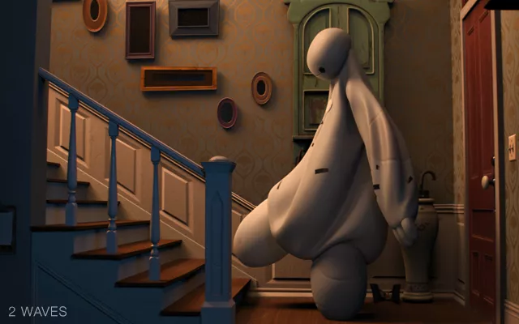{height=560px}</center>

[Big Hero 6 (Walt Disney Animation Studios, 2014), 2 reflections]{style="float:right"}

# {data-transition="none"}

<center>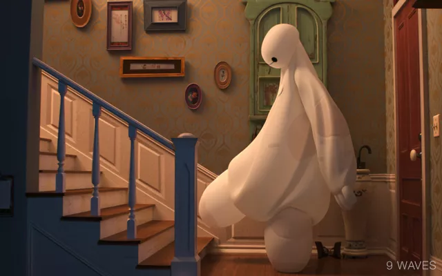{height=560px}</center>

[Big Hero 6 (Walt Disney Animation Studios, 2014), 9 reflections]{style="float:right"}

---

<center>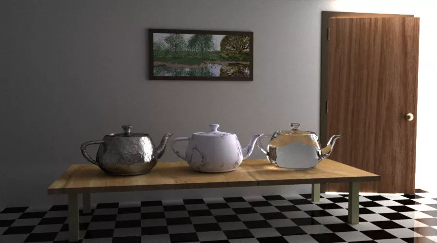</center>

[[*Metropolis Light Transport*](https://graphics.stanford.edu/papers/metro/), Veach & Guibas (1997)]{style="float:right"}

# Russian Roulette {#russian-roulette}

-   A widely used algorithm in path tracing is *Russian roulette*, which removes the *bias*, i.e., the underestimation of radiance, at the cost of increasing uncorrelated (white) noise.

-   The procedure requires setting a probability $0 \leq q \leq 1$ (in real Russian roulette, $q = 1/6$). This is the algorithm:

    1.  A random number $0 \leq x \leq 1$ is drawn;
    2.  If $x > q$, the radiance $L$ is calculated and $L / (1 - q)$ is returned;
    3.  If $x \leq q$, the calculation is stopped and zero is returned.

---

-   The method replaces the radiance $L$ with a random radiance $L'$ as follows:

    $$
    L' = \begin{cases}
    \frac{L}{1 - q}\ &\text{if $x > q$},\\
    0&\text{otherwise}.
    \end{cases}
    $$

    $L'$ has expected value

    $$
    E[L'] = E\left[(1 - q) \frac{L}{1 - q} + 0\cdot q\right] = E[L].
    $$

-   There is a probability $q$ of returning zero (underestimation), but if $x > q$ (with probability $1 - q$) an overestimation of $L$ is returned, because $1 / (1 - q) > 1$.

# Disadvantages

-   Russian roulette is not a solution without flaws!

-   Suppose, for example, you choose $q = 0.99$. In this case, it will be very difficult to return $L / (1 - q)$, because in most cases zero will simply be returned.

-   On the other hand, the few times that $L / (1 - q)$ is returned, the value $L$ multiplied by one hundred will be returned, i.e., $1 / (1 - 0.99)$.

-   Obviously, this implies a significant increase in the variance of the estimate, which means that the image will be dominated by so-called *fireflies*, although clearly *unbiased*.

# Details

-   To implement Russian roulette, a minimum threshold is usually set for the value of `depth`:

    ```python
    if ray.depth > 2:
        threshold = compute_threshold(...)  # Estimate a reasonable value for "q"
        if pcg.random_float() > threshold:
            return radiance / (1 - threshold)
        else:
            return Color(0.0, 0.0, 0.0)
    ```

    This does *not* introduce a bias, but allows to reduce noise in the image.

-   For $q$, I suggest using the maximum value among the R, G, B components of the BRDF at the intersection point.

# Path Tracing in Action

-   We have all the theory available to implement the path tracing algorithm!

-   The number $N$ of samples (directions) used to estimate each integral is a free parameter, and should be chosen depending on the scene and how efficient the path tracer is.

-   Assuming a threshold for `ray.depth` equal to $m$ reflections, the total number $N_\text{tot}$ of rays that the code must simulate is $\leq N^m$. If you choose $N = 100$ and $m = 9$, you get $N_\text{tot} = 10^{18}$: it is important not to overdo it with the value of $N$!

# $N = 3$ {data-transition="none"}

<center>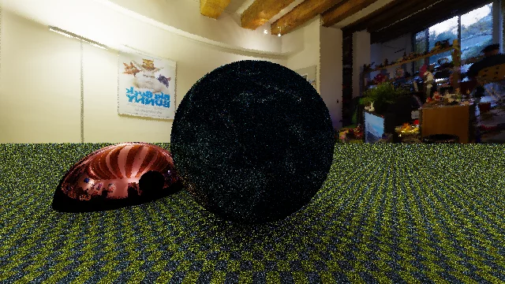</center>
[726,939 rays]{style="float:right"}

# $N = 10$ {data-transition="none"}

<center>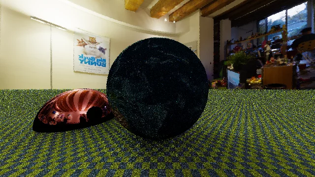</center>
[5,010,840 rays]{style="float:right"}

# $N = 25$ {data-transition="none"}

<center></center>
[26,343,150 rays]{style="float:right"}

# $N = 50$ {data-transition="none"}

<center>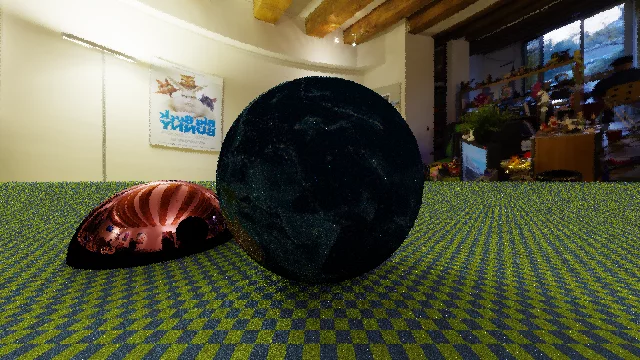</center>
[98,875,400 rays]{style="float:right"}

# $N = 100$ {data-transition="none"}

<center>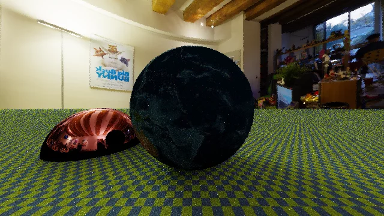</center>
[382,384,500 rays]{style="float:right"}

# *Importance sampling* {#mc-integrals-and-importance-sampling}

-   We implemented the code using the mean method to estimate the integral, but this is not optimal!

-   In the last lesson, we saw that the variance of the mean method can be reduced if we extract random samples according to a "clever" distribution $p(\theta, \phi)$.

-   What distribution could be "clever" here?

# *Importance Sampling*

-   Let's write once again the integral of the rendering equation:

    $$
    \int_{2\pi} f_r(x, \Psi \rightarrow \Theta)\,L(x \leftarrow \Psi)\,\cos(N_x, \Psi)\,\mathrm{d}\omega_\Psi.
    $$

-   Suppose we place ourselves in the reference system where $\theta$ and $\phi$ are measured with respect to the normal axis $N_x$; then the angle between $N_x$ and $\Psi$ is precisely $\theta$, and therefore

    $$
    \int_{2\pi} f_r(x, \Psi \rightarrow \Theta)\,L(x \leftarrow \Psi)\,\cos\theta\,\mathrm{d}\omega_\Psi.
    $$

# Possibilities

$$
\int_{2\pi}
\textcolor{#ad3434}{f_r(x, \Psi \rightarrow \Theta)}\,
\textcolor{#34ad34}{L(x \leftarrow \Psi)}\,
\textcolor{#3434ad}{\cos\theta}\,
\mathrm{d}\omega_\Psi.
$$

-   To choose a "clever" distribution, we should look for a $p(x)$ that resembles the integrand but is at the same time easy to normalize.

-   There are three terms in the integrand that we need to understand how to combine into a $p(\omega)$:

    #.  $\textcolor{#ad3434}{f_r(x, \Psi \rightarrow \Theta)}$;
    #.  $\textcolor{#34ad34}{L(x \leftarrow \Psi)}$;
    #.  $\textcolor{#3434ad}{\cos\theta}$.

# Implementation

-   One solution is to choose $p(\omega) \propto \cos\theta$. The intuitive sense is that it "pays" more to choose directions more aligned along the normal (i.e., with small $\theta$), because that's where most of the radiance comes from.

-   A better solution, however, is to choose

    $$
    p(\omega) \propto f_r(x, \Psi \rightarrow \Theta) \cos\theta,
    $$

    because the $f_r$ function itself can have strong dependencies on the direction, as in the case of reflective surfaces.

# Diffuse BRDF

-   On a diffuse surface, the incident radiation is diffused over 2π, and it holds that

    $$
    f_r(x, \Psi \rightarrow \Theta) = \frac{\rho_d}\pi.
    $$

-   Consequently, to use *importance sampling*, we need to find a PDF $p(\omega)$ such that

    $$
    p(\omega) \propto \frac{\rho_d}\pi\,\cos\theta \propto \cos\theta.
    $$

    This result can be traced back to the [Phong distribution](tomasi-ray-tracing-10a.html#/phong-distribution) ($\propto \cos^n\theta$).

---

In the case of a diffuse surface, it holds that

$$
\begin{aligned}
&\int_{2\pi} f_r(x, \Psi \rightarrow \Theta)\,L(x \leftarrow \Psi)\,\cos(N_x, \Psi)\,\mathrm{d}\omega_\Psi \approx\\
\approx&\frac1N\sum_{i=1}^N \frac{f_r(x, \Psi_i \rightarrow \Theta)\,L(x \leftarrow \Psi_i)\,\cos\theta}{p(\omega)} =\\
=&\frac{\rho_d}{N}\sum_{i=1}^N L(x \leftarrow \Psi_i),
\end{aligned}
$$

where, obviously, it is necessary that the $\Psi_i$ are distributed according to $p(\omega) \propto \cos\theta$.

# Using BRDFs

-   Given a certain number $N$ of rays with which to calculate the integral, the use of *importance sampling* allows us to reduce the variance: for the same $N$, with *importance sampling* the image is less noisy.

-   Note that if we use *importance sampling* to evaluate the integral, it is **not** necessary for the code to explicitly calculate the value of $f_r$: this simplifies in the expression!

-   The price to pay is that we have to generate random directions with distributions that are generally not uniform.

# Reflective BRDF

-   Let's now consider the BRDF of a perfectly reflective mirror.

-   We already know that mirrors obey the law of reflection:

    <center>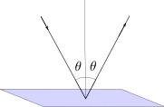{height=320px}</center>

    In this case, the BRDF is obviously proportional to a Dirac delta function.


# Reflective BRDF

-   The implementation of the reflective BRDF is very simple because, in the evaluation of the integral, the secondary rays are all aligned along the direction $(\theta_r, \phi_r)$.

-   From the point of view of vectors, the law of reflection is written as follows:

    $$
    \vec r = 2(\hat n \cdot \Psi) \hat n - \Psi,
    $$

    where $\vec r$ is the reflected vector.


# Reflective BRDF

-   In [*Geometrical Considerations and Nomenclature for Reflectance*](https://graphics.stanford.edu/courses/cs448-05-winter/papers/nicodemus-brdf-nist.pdf) (Nicodemus, Richmond & Hsia, 1977), it is shown through energy considerations that for an ideal reflective surface, we have

    $$
    f_r(x, \Psi \rightarrow \Theta) \propto \frac{\delta(\sin^2\theta_r - \sin^2\theta)\,\delta(\psi_r \pm \pi - \psi)}{\cos\theta},
    $$

    where $(\theta, \phi)$ is obviously the incoming ray direction $\Psi$, and $(\theta_r, \psi_r)$ is the reflected direction.

-   The presence of $\cos\theta$ in the denominator means that $p(\omega)$ does not depend on $\cos\theta$: therefore, we do not have to "weight" the reflected radiance by $\cos\theta$.


# Arbitrary Orthonormal Bases (ONB) {#orthonormal-basis}


# Random Directions in Space

-   To estimate the integral of the rendering equation using the mean method, we need to generate random directions with a given distribution $p(\omega)$ over the 2π hemisphere.

-   However, the 2π hemisphere is defined with respect to the normal $\hat n$, which can have an arbitrary orientation in three-dimensional space!

-   While the mathematical generation of random directions is clear, from an *implementation* standpoint, it's not so simple: we need to change reference frames!

# Reference Frames

<center>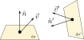</center>

-   The expressions we derived for generating random directions according to various distributions all assume that $\theta$ is measured starting from the $z$ axis.

-   When we generate a random direction in that reference frame, we then need to convert the vector to the *global* system in which the "world" objects are defined.

-   This task is simple if we use orthonormal bases (ONBs) created *ad hoc*.

# Orthonormal Bases

-   Given an orthonormal basis (ONB) $\left\{\hat e_1, \hat e_2, \hat e_3\right\}$ and a vector $\vec v$, it holds that

    $$
    \vec v = \sum_{i=1}^3 \left<\vec v, \hat e_i\right> \hat e_i = v_x \hat e_x + v_y \hat e_y + v_z \hat e_z.
    $$

-   If we have a new ONB $\left\{\hat e'_1, \hat e'_2, \hat e'_3\right\}$, the vector $\vec v$ changes its representation depending on the basis, from $(v_x, v_y, v_z)$ to $(v'_x, v'_y, v'_z)$:

    $$
    \vec v' = \sum_{i=1}^3 \left<\vec v', \hat e'_i\right> \hat e'_i = v'_x \hat e'_x + v'_y \hat e'_y + v'_z \hat e'_z = v_x \hat e_x + v_y \hat e_y + v_z \hat e_z.
    $$


# Arbitrary ONBs

-   The simplest way to create a new ONB is based on the fact that from two elements of the basis, we can always derive the third using the cross product:

    $$
    \hat e_x \times \hat e_y = \hat e_z,\quad
    \hat e_y \times \hat e_z = \hat e_x,\quad
    \hat e_z \times \hat e_x = \hat e_y.
    $$

-   To create an ONB, we choose an arbitrary vector $\vec g$, and set

    $$
    \hat e'_x = \text{norm}(\hat n \times \vec g),\quad
    \hat e'_y = \hat n \times \hat e'_x,\quad
    \hat e'_z = \hat n,
    $$

    where $\text{norm}(\vec v) = \vec v / \left\|\vec v\right\|$ normalizes the length of the vector.

# A Difficulty

-   However, the method for creating a new ONB only works as long as the arbitrary vector $\vec g$ is not aligned with $\hat n$, otherwise

    $$
    \hat n \times \vec g = 0.
    $$

-   Therefore, in the algorithm implementation, we need to include a test: if $\hat n \approx \vec g$, then we replace $\vec g$ with another vector $\vec h$. Usually, we choose $\vec g = (1, 0, 0)$ and $\vec h = (0, 1, 0)$.

-   [Duff et al. 2017](https://graphics.pixar.com/library/OrthonormalB/paper.pdf), based on [Frisvad, 2012](http://orbit.dtu.dk/files/
126824972/onb_frisvad_jgt2012_v2.pdf), proposed an alternative algorithm based on quaternions that requires half the execution time (it avoids this check and the normalization).

# Duff et al. (2017)

<center>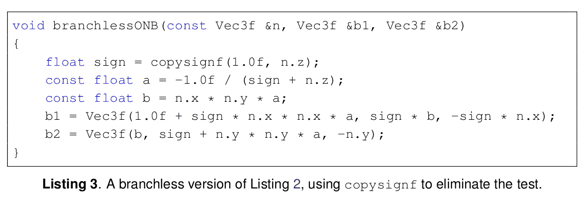</center>

[The authors work at [Pixar Animation Studios](https://www.pixar.com/).]


# Further Insights

# Further Insights

-   Let's now briefly look at some possibilities for improving the path tracing algorithm:
    -   Antialiasing;
    -   *Point-light tracing*;
    -   Direct illumination;
    -   *Photon mapping*.
-   If you wish, you can implement antialiasing and *point-light tracing* in your code.
-   Direct illumination and *photon mapping* go well beyond what can be implemented for this course.

# Aliasing and Antialiasing {#antialiasing}

# Aliasing

-   In the `ImageTracer` type of our ray tracer, we assumed that the color of each pixel was determined by the color of the ray [passing through the center](http://localhost:8000/tomasi-ray-tracing-07a.html#/ray-through-a-pixel):

    <center>
    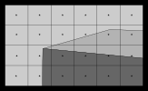{height=280px}
    </center>

-   This assumption causes the phenomenon called *aliasing*, caused by the finite size of the pixels, and the production of the so-called [*Moiré fringes*](https://en.wikipedia.org/wiki/Moir%C3%A9_pattern)

---

<center>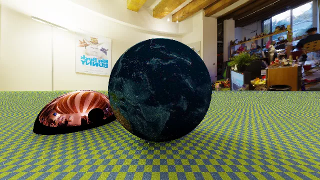</center>

The human eye tends to notice wavy lines in the checkered pattern on the plane.

---

<center>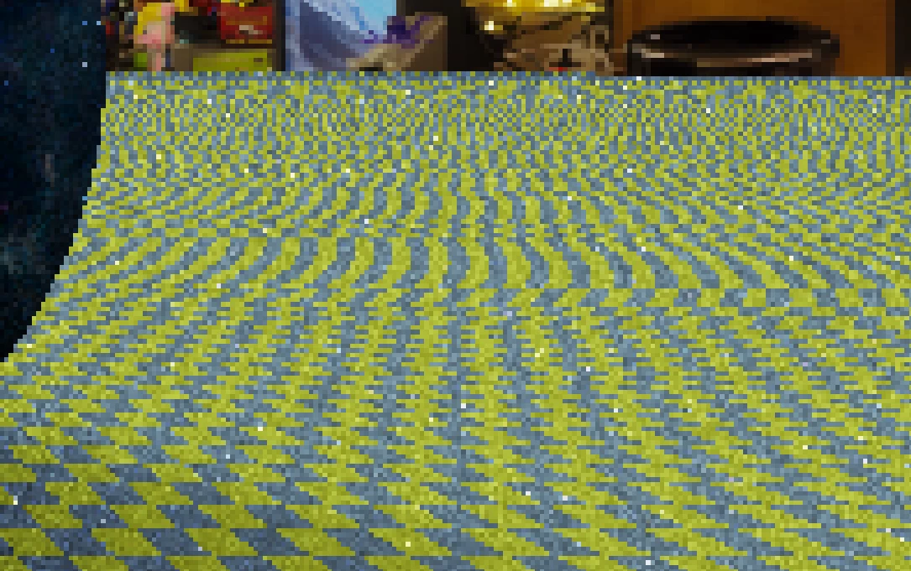</center>

---

<center></center>

The problem with *aliasing* is that some pixels cover areas of the screen that contain different colors.

# Antialiasing

-   *Antialiasing* refers to an algorithm that reduces artifacts in an image caused by color variations at scales smaller than a pixel.

-   A simple way to implement *antialiasing* is to give our `ImageTracer` type the ability to sample a pixel using multiple rays and then calculate the average of the radiance associated with each.

# Antialiasing and MC

-   It may not be immediately obvious, but the rays we send within the same pixel **should not be evenly spaced**, otherwise, the problem of Moiré fringes would still occur (albeit to a lesser extent):

    <center>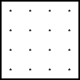{height=240px}</center>

-   It's better to use a Monte Carlo method to sample the interior of a pixel.

# Stratified Sampling {#stratified-sampling}

-   Randomly extracting points on the $[0, 1] \times [0, 1]$ plane of a pixel is simple: just extract both $u$ and $v$ from a uniform distribution.

-   However, the result has poor variance behavior because it's easy for some regions of the pixel to be under-sampled compared to others.

-   *Stratified sampling* is a simple method to reduce variance: the pixel space is divided into many sub-squares, and a random position is extracted within each of the squares.

---

<center>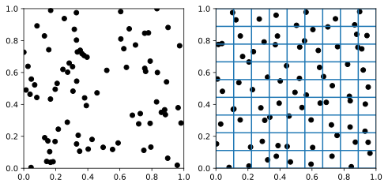</center>

# Implementation

-   Stratified sampling is simple to implement, but it requires the number of rays to be a perfect square (1, 4, 9, …).

-   Implementing antialiasing with stratified sampling has the advantage of greatly reducing the grainy appearance of images produced with path tracing.

-   We have already seen that graininess can be reduced by increasing the number $N$ of secondary rays, but the computation time is proportional to $N^m$, where $m$ is the maximum recursion depth.

-   Using antialiasing with $N$ rays, the computation time is only proportional to $N$: much better!

# {data-transition="none"}

<center>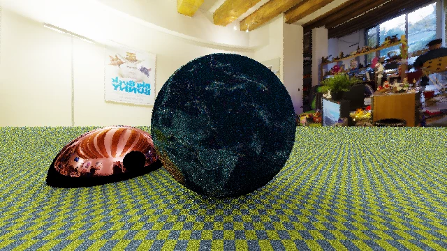</center>

1 ray per pixel

# {data-transition="none"}

<center></center>

4 rays per pixel

# {data-transition="none"}

<center></center>

9 rays per pixel

# {data-transition="none"}

<center>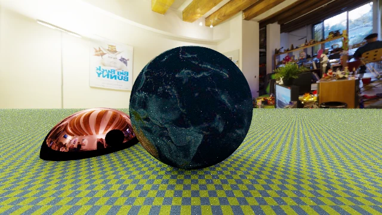</center>

16 rays per pixel

# {data-transition="none"}

<center>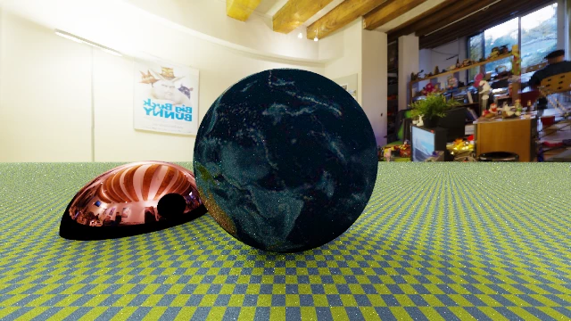</center>

25 rays per pixel


# Point-light tracing {#point-light-tracing}

# Point-light tracing

-   A widely used algorithm for generating 3D images is what we will call *point-light tracing*. (It is usually called *ray tracing* or *ray casting*; however, both terms are very generic, and sometimes indicate different algorithms).

-   It is based on the consideration that in certain scenes most of the light energy originates from a few objects with a small apparent diameter: a lamp, the sun, etc.

-   If all the objects in the scene are divided into «luminous» and non-luminous, the integral of the equation can be evaluated over a reduced domain.

---

<center>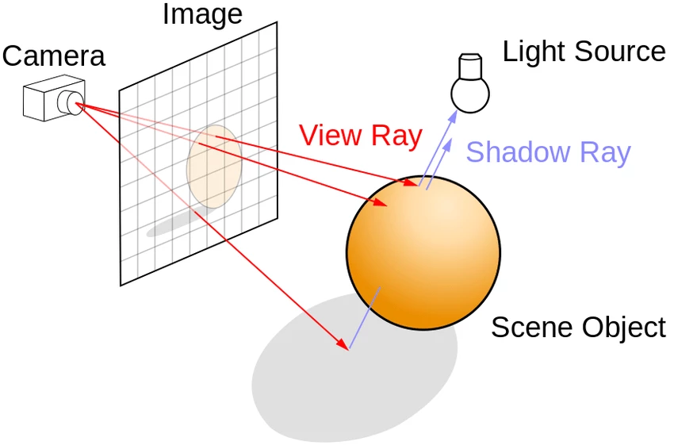</center>

# Light Sources

-   The classic *point-light tracing* algorithm makes these assumptions:

    #.  Light sources are point-like and reduce to Dirac deltas.
    #.  If a source is not luminous, it does not contribute to the overall brightness of the image.
    #.  To compensate for the lack of radiation illuminating the parts not directly illuminated, some ray tracers arbitrarily add an «ambient light» term (a color close to black but not exactly zero).

-   It is not possible to model diffuse illumination, but the time required to calculate the solution is much shorter.

# Implementation

-   In the `World` type, a list of `LightSource` objects must be maintained, each of which is a `Point` associated with a certain emission (`Color`).

-   Image generation uses `ImageTracer` as usual to project rays from `Camera` to `HdrImage` (possibly using anti-aliasing).

-   When a ray interacts with a surface, it is determined which `LightSource` objects are visible and their contribution modulated by the `BRDF` is summed.

-   The algorithm is very fast because it is not recursive (unless you want to implement reflective/refractive surfaces).

---

<video src="media/raycaster-demo.mp4" width="640px" height="360px" controls loop autoplay/>

# Considerations

-   In the general case, the farther a light source is, the less bright it is; its radiance is constant, but the solid angle $\mathrm{d}\omega$ in the integral of the rendering equation scales as $r^{-2}$.

-   However, if a light source is a Dirac delta, it has no solid angle, and therefore in a point-light tracer one should compensate for this effect.

-   However, it is not enough to divide the contribution of a light source by $r^2$, because the units of measurement would not correspond!

-   Usually in point-light tracers this effect is ignored (see the case of [POV-Ray](https://www.povray.org/documentation/view/3.6.1/317/)). Alternatively, a reference dimension $d$ can be assigned to each light source, and scaled by $(d / r)^2$.


# Direct Illumination {#direct-illumination}

# Direct Illumination

-   We applied *importance sampling* to the ray tracing equation by writing a probability function

    $$
    p(\omega) \propto \cos\theta \times f_r.
    $$

-   This trick can greatly improve the rendering quality in the case of BRDFs highly dependent on $\theta$, but it does not help if the term

    $$
    L(x \leftarrow \Psi)
    $$

    in the rendering equation integral varies greatly. To reduce variance in these cases, the *(explicit) direct lighting* algorithm exists.

# «Easy» Case

<center>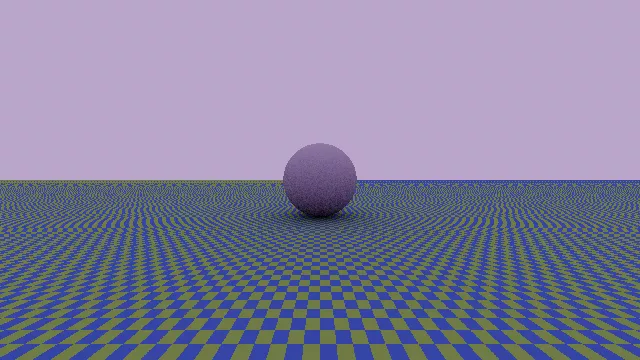</center>

# «Difficult» Case

<center>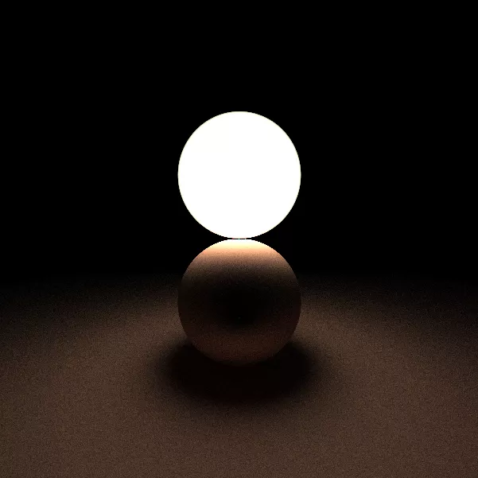</center>

# Direct Illumination

<center>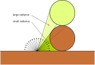</center>

If the $p(\omega)$ used in *importance sampling* could «weigh» the presence or absence of light sources, convergence would be much faster!

# Implementation

-   To implement such an optimization, a flag must be added to the `Material` type, indicating whether the material is a «significant» emitter or not.

-   When calculating the integral of the rendering equation, the 2π domain is divided into two parts:

    #.   The solid angle $\Omega_\text{lum}$ subtended by those objects whose `Material` has the «emitter» flag set to `true`;
    #.   The remaining solid angle $\Omega_\text{rem}$.

-   The integral related to $\Omega_\text{rem}$ is calculated in the usual way.

# Lighting

-   The integral related to the solid angle $\Omega_\text{lum}$ is calculated in a special way.

-   Each `Shape` must be able to calculate its own solid angle (easy for planes, spheres and triangles, difficult for CSG objects!).

-   Furthermore, a method is needed that returns a random direction towards the emissive object, uniformly distributed within its solid angle (easy for spheres and triangles, difficult for planes and CSG objects!).

-   The implementation is complicated by the fact that the normalization constants for the various $p(\omega)$ used, and the overlaps of different solid angles, must be taken into account.

# Photon Mapping {#photon-mapping}

# Photon Mapping

-   Photon mapping is a technique that optimizes the computation time for the solution of the rendering equation. It is illustrated in the book [*Realistic Image Synthesis Using Photon Mapping*](https://www.routledge.com/Realistic-Image-Synthesis-Using-Photon-Mapping/Jensen/p/book/9781568814629) (Jensen, 2009).

-   It is a [forward ray-tracing](tomasi-ray-tracing-08a-projections.html#/forward-ray-tracing) algorithm (the only one we analyze in this course!) which is performed in two steps:

    #.  Creation of the photon map;
    #.  Rendering of the image.

# Photon Mapping Algorithm

-   For each light source, a series of rays are emitted in random directions.

-   At each interaction with a surface, it is chosen with a certain probability whether to create a *photon*: this is a `Photon` type that contains the position (a `Point`) and its energy (i.e., a `Color` field).

-   The list of all created `Photon` objects (the *photon map*) is stored in the `World` type (it is not necessary to associate a `Photon` with the `Shape` that produced it).

-   To calculate $L(x \leftarrow \Psi)$ in the rendering equation, all `Photon` objects within a certain distance $d$ from $x$ are considered.

# Photons in the «Cornell Box»

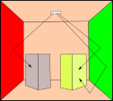{height=560}

---

<center>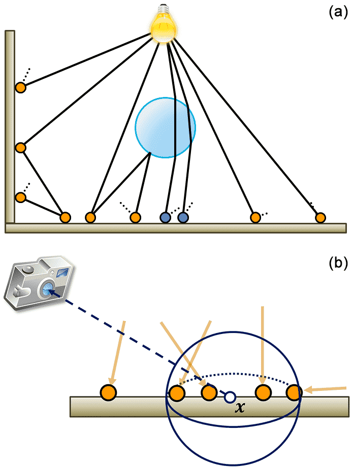{height=480px}</center>

[[*Physically based computer graphics for realistic image formation to simulate optical measurement systems*](https://jsss.copernicus.org/articles/6/171/2017/), Retzlaff et al. (2017)]{style="float:right"}


# Algorithm Characteristics

-   The calculation of photons can be reused for subsequent executions of the *path tracing* algorithm (possibly saving it to disk).

-   Searching for the photons closest to a point $x$ can be made very fast using a KD-Tree structure (stored directly in `World`).

-   It is easy to use it to simulate effects related to the light spectrum (prism diffraction, caustics, etc.).

-   Usually, *photon mapping* is used only to calculate the indirect light component (i.e., the light that reaches the surfaces but **not** the light that directly reaches the observer's eye): for the latter, *path-tracing* can be used.

---
title: "Lesson 11"
subtitle: "Calcolo numerico per la generazione di immagini fotorealistiche"
author: "Maurizio Tomasi <maurizio.tomasi@unimi.it>"
...
