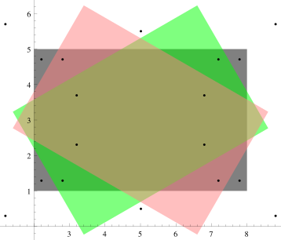
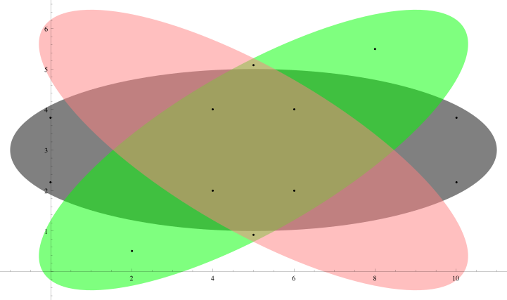
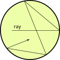
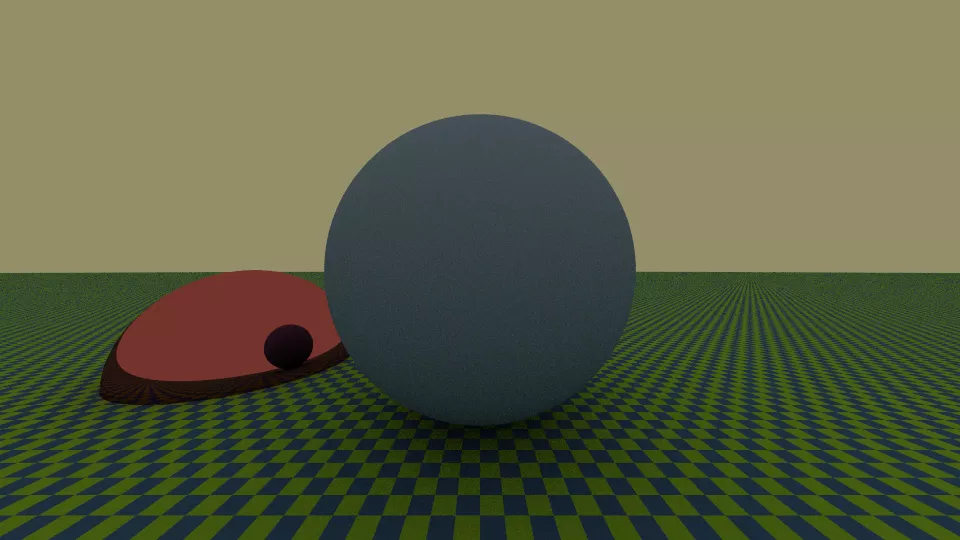

# Implementing the Path Tracer

# What have we learned

-   Today we will finally implement our *path tracer*, which concludes the discussion on the rendering equation

-   Even though there are still two weeks until the end of the course, we can already evaluate what we should have learned from the course

-   Let's do it with a question…

# What bugs do you expect today?

::: notes

-   The image cannot be upside-down: we already have tests for that

-   The ray-sphere intersection is definitely correct

-   The R and B colors cannot be inverted

-   Etc.

:::

---

# Work Methodology

-   We have always implemented one feature at a time (saving images, *tone mapping*, projections…)

-   For each feature, we implemented a series of tests

-   This is why every week we had the confidence that when we relied on code written in previous weeks, it was probably "correct"

-   It is impossible to write code as long as the one you produced so far without proceeding this way

-   **This is the most important lesson provided by this course!**

# Example: intersection tests in Lobester

{height=480px}

# Example: intersection tests in Lobester

{height=480px}

# Orthonormal Bases (ONB)

# Creating ONBs

-   It is convenient to use the algorithm from [Duff et al. 2017](https://graphics.pixar.com/library/OrthonormalB/paper.pdf):

    ```python
    def create_onb_from_z(normal: Union[Vec, Normal]) -> Tuple[Vec, Vec, Vec]:
        # In Python there isn't a `copysign` function 🙁
        sign = 1.0 if (normal.z > 0.0) else -1.0
        a = -1.0 / (sign + normal.z)
        b = normal.x * normal.y * a

        e1 = Vec(1.0 + sign * normal.x * normal.x * a, sign * b, -sign * normal.x)
        e2 = Vec(b, sign + normal.y * normal.y * a, -normal.y)

        return e1, e2, Vec(normal.x, normal.y, normal.z)

    ```

-   When calling this function, pay close attention to the fact that the `normal` parameter must already be normalized!

# Testing

-   To verify the correct operation of `create_onb_from_z`, we can use *random testing* (an idea apparently originating in the world of the [Haskell](https://www.haskell.org/) language, see [quickcheck](https://hackage.haskell.org/package/QuickCheck)).

-   The idea is to generate a large number of random vectors, pass them as parameters to `create_onb_from_z`, and verify that the return type is indeed an ONB. (Apparently Duff et al. discovered the bug in the algorithm from [Frisvad, 2012](http://orbit.dtu.dk/files/126824972/onb_frisvad_jgt2012_v2.pdf) this way).

-   The general approach of *random testing* is to generate random inputs and verify that the outputs satisfy certain properties.  It is especially convenient for mathematical functions, but it is not always the best solution.

---

# *Random testing* in [pytracer](https://github.com/ziotom78/pytracer/blob/01a672c782515030dd5abc9a33d1e0c843bbd394/test_all.py#L914-L934)

```python
pcg = PCG()  # Use the default seed, so if the test fails you can debug it
expected_zero, expected_one = pytest.approx(0.0), pytest.approx(1.0)

# As Python is slow, we just test 100 times the function. You can use
# larger numbers, as far as the time required to run the test is kept short
for i in range(100):
    # We could use a fancier code that samples uniformly over the 4π sphere…
    normal = Vec(*[pcg.random_float() for i in range(3)]).normalize()
    e1, e2, e3 = create_onb_from_z(normal)

    # Verify that the z axis is aligned with the normal
    assert e3.is_close(normal)

    # Verify that the base is orthogonal
    assert expected_zero == e1.dot(e2)
    assert expected_zero == e2.dot(e3)
    assert expected_zero == e3.dot(e1)

    # Verify that each component is normalized
    assert expected_one == e1.squared_norm()
    assert expected_one == e2.squared_norm()
    assert expected_one == e3.squared_norm()

    # You could also check that e₁×e₂=e₃, e₂×e₃=e₁, e₃×e₁=e₂
```

# *Importance sampling*

# Implementation
-   We anticipated that our *path tracer* will use the Monte Carlo method to estimate the integral of the rendering equation:

    $$
    \int_{2\pi} f_r(x, \Psi \rightarrow \Theta)\,L(x \leftarrow \Psi)\,\cos\theta\,\mathrm{d}\omega_\Psi.
    $$

-   To improve variance we will use *importance sampling*, employing the PDF

    $$
    p(\omega) \propto f_r \cdot \cos\theta.
    $$

# The `BRDF` Type

-   We therefore need to add a method that applies to the types derived from `BRDF` and that has [this signature](https://github.com/ziotom78/pytracer/blob/01a672c782515030dd5abc9a33d1e0c843bbd394/materials.py#L103):

    ```python
    def scatter_ray(self,
        pcg: PCG,                    # Used to generate random numbers
        incoming_dir: Vec,           # Direction of the incoming ray
        interaction_point: Point,    # Where the ray hit the surface
        normal: Normal,              # Normal on interaction_point
        depth: int,                  # Depth value for the new ray
    ) -> Ray
    ```

-   Each type derived from `BRDF` (e.g., `DiffuseBRDF`, `SpecularBRDF`, etc.) will have to redefine `scatter_ray`.

# `DiffuseBRDF`

-   For the diffuse BRDF, we deduced that $p(\omega) \propto \cos\theta$.

-   The implementation of [`DiffuseBRDF.scatter_ray`](https://github.com/ziotom78/pytracer/blob/01a672c782515030dd5abc9a33d1e0c843bbd394/materials.py#L117-L130) must therefore use the [algorithm we derived](tomasi-ray-tracing-10a.html#risultato-di-phong) for the Phong distribution with $n = 1$:

    ```python
    def scatter_ray(self, pcg: PCG, incoming_dir: Vec,
                    interaction_point: Point, normal: Normal, depth: int) -> Ray:
        e1, e2, e3 = create_onb_from_z(normal)
        cos_theta_sq = pcg.random_float()
        cos_theta, sin_theta = sqrt(cos_theta_sq), sqrt(1.0 - cos_theta_sq)
        phi = 2.0 * pi * pcg.random_float()

        return Ray(origin=interaction_point,
                   dir=e1 * cos(phi) * sin_theta + e2 * sin(phi) * sin_theta + e3 * cos_theta,
                   tmin=1.0e-3,   # Be generous here
                   tmax=inf,
                   depth=depth)
    ```

# `SpecularBRDF`

-   Ray generation for the specular BRDF is perfectly deterministic, and there is no $\cos\theta$ term to weight the ray's contribution.

-   The implementation of [`SpecularBRDF.scatter_ray`](https://github.com/ziotom78/pytracer/blob/01a672c782515030dd5abc9a33d1e0c843bbd394/materials.py#L151-L164) is therefore particularly simple:

    ```python
    def scatter_ray(self, pcg: PCG, incoming_dir: Vec,
                    interaction_point: Point, normal: Normal, depth: int) -> Ray:
        ray_dir = Vec(incoming_dir.x, incoming_dir.y, incoming_dir.z).normalize()
        normal = normal.to_vec().normalize()

        return Ray(origin=interaction_point,
                   dir=ray_dir - normal * 2 * normal.dot(ray_dir),
                   tmin=1e-3,
                   tmax=inf,
                   depth=depth)
    ```

# *Path tracing*

# The `PathTracer` Type

-   We have defined two renderers so far: `OnOffRenderer` and `FlatRenderer`. Today we implement `PathTracer`.

-   The constructor parameters are as follows:

    1.  The `World` object to render;
    2.  The background color, used for those directions along which there are no intersections;
    3.  The random number generator to use (`PCG` type);
    4.  Number of rays to generate for the integral calculation;
    5.  Maximum ray depth;
    6.  Depth limit beyond which to use Russian Roulette.

# [Implementation](https://github.com/ziotom78/pytracer/blob/01a672c782515030dd5abc9a33d1e0c843bbd394/render.py#L73-L126)

```python
def __call__(self, ray: Ray) -> Color:
    return Color(0.0, 0.0, 0.0) if ray.depth > self.max_depth

    hit_record = self.world.ray_intersection(ray)
    return self.background_color if not hit_record

    hit_material = hit_record.material
    hit_color = hit_material.brdf.pigment.get_color(hit_record.surface_point)
    emitted_radiance = hit_material.emitted_radiance.get_color(hit_record.surface_point)

    hit_color_lum = max(hit_color.r, hit_color.g, hit_color.b)

    if ray.depth >= self.russian_roulette_limit:  # Russian roulette
        q = max(0.05, 1 - hit_color_lum)
        if self.pcg.random_float() > q:
            # Keep the recursion going, but compensate for other potentially discarded rays
            hit_color *= 1.0 / (1.0 - q)
        else:
            # Terminate prematurely
            return emitted_radiance

    # Monte Carlo integration

    cum_radiance = Color(0.0, 0.0, 0.0)

    # Only do costly recursions if it's worth it
    if hit_color_lum > 0.0:
        for ray_index in range(self.num_of_rays):
            new_ray = hit_material.brdf.scatter_ray(
                pcg=self.pcg,
                incoming_dir=hit_record.ray.dir,
                interaction_point=hit_record.world_point,
                normal=hit_record.normal,
                depth=ray.depth + 1,
            )
            new_radiance = self(new_ray)  # Recursive call
            cum_radiance += hit_color * new_radiance

    return emitted_radiance + cum_radiance * (1.0 / self.num_of_rays)
```

# Test {#furnace-test}

-   A simple method to verify the functioning of a *path tracer* is the so-called *furnace test*.

-   It consists of casting a ray inside an arbitrarily shaped object with diffuse BRDF and constant luminosity $L_e$ and reflectance $\rho_d$.

-   The generic ray will follow a path trapped within the object, and thus each ray will keep hitting the same sphere over and over again. This is a situation where the rendering equation can be solved analytically.

---

<center></center>

---


$$
\begin{aligned}
L &= L_e + \rho_d \Bigl(L_e + \rho_d \bigl(L_e + \rho_d(L_e + \dots)\bigr)\Bigr) =\\
  &= L_e + \rho_d L_e + \rho_d^2 L_e + \rho_d^3 L_e + \ldots =\\
  &= L_e \bigl(1 + \rho_d + \rho_d^2 + \rho_d^3 + \ldots \bigr) =\\
  &= L_e \sum_{n=0}^\infty \rho_d^n =\\
  &= \frac{L_e}{1 - \rho_d}.
\end{aligned}
$$

# Tests in Pytracer

-   The pytracer code implements the test [`testFurnace`](https://github.com/ziotom78/pytracer/blob/01a672c782515030dd5abc9a33d1e0c843bbd394/test_all.py#L938-L962) which uses these assumptions:

    1.  Creates a sphere centered at the origin;
    2.  Casts a ray starting from the center of the sphere;
    3.  Invokes `PathTracer` setting `max_depth=100` and ensuring that the Russian roulette algorithm is *not* used;
    4.  Verifies that the returned radiance corresponds to $L_e / (1 - \rho_d)$.

-   The test is repeated a number of times using random values of $L_e$ and $\rho_d$ (avoiding choosing $\rho_d \approx 1$!).

---

```python
pcg = PCG()

# Run the furnace test several times using random values for L_e and ρ_d
for i in range(5):
    emitted_radiance = pcg.random_float()
    reflectance = pcg.random_float() * 0.9  # Avoid numbers that are too close to 1

    world = World()

    enclosure_material = Material(
        brdf=DiffuseBRDF(pigment=UniformPigment(Color(1.0, 1.0, 1.0) * reflectance)),
        emitted_radiance=UniformPigment(Color(1.0, 1.0, 1.0) * emitted_radiance),
    )

    world.add(Sphere(material=enclosure_material))

    path_tracer = PathTracer(pcg=pcg, num_of_rays=1, world=world, max_depth=100, russian_roulette_limit=101)

    ray = Ray(origin=Point(0, 0, 0), dir=Vec(1, 0, 0))
    color = path_tracer(ray)

    expected = emitted_radiance / (1.0 - reflectance)
    assert pytest.approx(expected, 1e-3) == color.r
    assert pytest.approx(expected, 1e-3) == color.g
    assert pytest.approx(expected, 1e-3) == color.b
```

# The `main` Method

-   Now that we have a *path tracer*, it's good to modify our `demo` command so that it creates an image that better highlights how the algorithm works.

-   You can define any scene you like, using the shapes you have implemented in your code (spheres, planes, triangles, CSG, etc.).

-   The important thing is that you define a large diffuse surface (a plane or a large radius sphere), which acts as a light source and therefore has a non-negligible $L_e$ component.

-   In [pytracer](https://github.com/ziotom78/pytracer/blob/01a672c782515030dd5abc9a33d1e0c843bbd394/main.py#L116-L150) I defined a plane for the ground, a sphere for the sky, and two spheres in the foreground: the first has a diffuse BRDF, the second a reflective BRDF.

---

<center></center>


# Random Numbers

-   Make sure that the two numbers that initialize the `PCG` generator can be passed from the command line.

-   The most important number is `init_seq`, because it uniquely identifies the sequence of numbers generated by the `PCG`, and therefore allows the production of completely decorrelated images (which can then be averaged together without producing *bias*).

-   Averaging different images (produced concurrently using [GNU Parallel](https://www.gnu.org/software/parallel/)) is a good way to reduce variance without increasing the actual computation time (*wall-clock time*).


# Profiling

# Profiling

-   From today, your code will have to do a lot of calculations!

-   Compare the code speeds of different groups in generating similar images, to understand if there are bottlenecks: with the languages you use, in theory there shouldn't be significant differences.

-   If you notice differences, you need to measure which part of the code is slowing it down: this is what is called *profiling*.


# Performance Measurement

-   It is not enough to know how long your entire code takes to produce an image: you need to know how much time it spends in each function.

-   There are various ways to measure it, and many tools available: it's impossible to be exhaustive!

-   I'll list some possibilities, and offer some tips and tricks.


# Types of Profilers

-   The simplest method is to surround the functions «suspected» of being bottlenecks with time measurements:

    ```python
    from time import perf_counter_ns   # Or: "monotonic". DO NOT USE ANYTHING ELSE!!
    start = perf_counter_ns()
    long_function_call(...)
    elapsed_time = perf_counter_ns() - start
    ```

-   There are profilers that measure the cumulative time spent by each line of code: be careful, because they can slow down the code a lot!

-   Statistical profilers are also available, which are less accurate but do not significantly slow down the code.

# Outsmarting the compiler

-   Modern compilers are so smart that they can make benchmark results worthless.

-   For instance, the following code will likely report that the cross product of two vectors takes **no time** to run:

    ```c++
    Vec a{1.0, 2.0, 3.0}, b{5.0, 4.0, 2.0}, c;
    auto time0{perf_conter()};
    const int N{10'000'000};
    for(int i{}; i < N; ++i) {
        c = cross(a, b);
    }
    auto time1{perf_counter()};
    println("Time: {}" (time1 - time0) / N);  // This is likely zero!
    ```

# Tips (1/4)

-   **Never** test mathematical functions on variables set to zero, as compilers usually optimize these calls out

-   If you initialize your variables to random numbers, be sure not to include random number generator in the profiling! Good practice: initialize a vector of random numbers **before** the test:

    ```c++
    vector inputs{100'000};
    for(int i{}; i < ssize(inputs); ++i) {
        inputs[i] = gen_random();
    }

    // Now run the benchmark
    auto time0{perf_conter()};
    // etc.
    ```

# Tips (2/4)

-   Other stuff might happen while your benchmark code is running:

    #.  If you are using a Just-in-time (JIT) compiler (Julia, C\#, Java, etc.), the first time you call a function it needs to be compiled/optimized
    #.  Your language might perform garbage collection (C\#, Julia, Go, D, etc.);
    #.  Your system might dynamically adjust CPU frequency to optimize power drain;
    #.  Other processes (OS updater, email client) might run in the background;
    #.  Etc.

-   It might be that you are measuring the time spent to run your program **and** to do something else.

# Tips (3/4)

-   It’s a good idea to run a benchmark a few times (3? 5?) and then consider the **minimum** time alongside other statistical parameters (average, median, etc.).

    <center>
    
    </center>

-   Many benchmark libraries provide detailed statistics and consider JIT warm-up times and other nuisances: [Google Benchmark](https://github.com/google/benchmark) (C++), [BenchmarkTools.jl](https://juliapackages.com/p/benchmarktools) (Julia), [BenchmarkDotNet](https://benchmarkdotnet.org/) (C\#, F\#), etc.

# Tips (4/4)

-   Don't measure the time of *every* function, just focus on the ones that could be problematic. (For example, it doesn't matter if the function that interprets the command line is fast!)

-   Often the output of profilers is quite unreadable and too detailed: however, there are tools to extract summary graphs such as [flamegraphs](http://www.brendangregg.com/FlameGraphs/cpuflamegraphs.html), which are easier to read.

-   The [speedscope](https://www.speedscope.app/) site provides a way to produce navigable *flamegraphs* through a browser, starting from the output of various profilers, and does not require installation.


# What to do today

# What to do today

#.  Continue working in the `pathtracing` branch;
#.  Implement a function to create an orthonormal basis starting from a normal vector (if in your language it is not easy to return three return values, implement a new `ONB` type);
#.  Implement the `scatter_ray` method that works on BRDF types, and implement the specular BRDF;
#.  Implement the path tracing algorithm;
#.  Modify the demo so that it has a diffuse sky capable of illuminating the scene.
#.  After *merging*, release version `0.3.0` and update the `CHANGELOG.md` file.

# Optional Additions

-   [Antialiasing](tomasi-ray-tracing-11a.html#aliasing) (see [PR#13 of pytracer](https://github.com/ziotom78/pytracer/pull/13));
-   [Point-light tracing](tomasi-ray-tracing-11a.html#point-light-tracing-1), a.k.a. *Whitted algorithm* (see [PR#14 of pytracer](https://github.com/ziotom78/pytracer/pull/14)).

---
title: "Laboratory 11"
subtitle: "Calcolo numerico per la generazione di immagini fotorealistiche"
author: "Maurizio Tomasi <maurizio.tomasi@unimi.it>"
...
