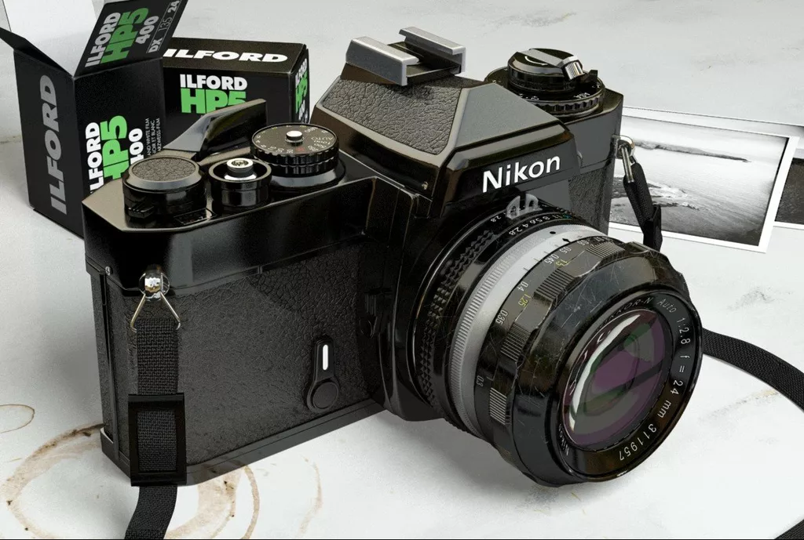

# Parsing Text Files

# Problem Context

-   So far, we have created photorealistic images by modifying the `demo` command of our ray tracer.

-   You should all have realized that this is quite cumbersome! Every time we wanted to modify the image, we had to perform these actions:

    #.  Modify the code in `main`;
    #.  Recompile;
    #.  Run the code and check the result.

-   This approach is not sustainable: in fact, we force users to learn how to write code in the programming language we used!

# Objective

-   Our goal is to define a *format* for describing scenes and to write code to interpret it.

-   Once implemented, the user will use a common editor like Emacs or Visual Studio Code to create a file, called e.g. `scene.txt`, and will run the program like this:

    ```
    ./myprogram render scene.txt
    ```

    and the `Shape` and `Material` objects will be created in memory based on what is specified in `scene.txt`.

-   Unlike the `demo` command, it will be easy for the user to modify `scene.txt`.

-   What we need is to implement a *compiler*!

# User Categories

-   In the case where the language used is Julia or Python, which allows interactive use, the best solution would be to define the scenes directly in the REPL (or in a Jupyter/Pluto notebook)!

-   But in the case of programs written in C#, Nim or Rust, such a solution is not easy to implement within your executable!

-   (This is even truer for those of you who provide binaries with each new *release* of the code: in that case, your users may not even have compilers installed!)

-   I ask *all of you* (including Julia users!) to implement a compiler: this is of great pedagogical value.

# Pedagogical Value

Implementing a compiler is a very useful educational activity:

1.  Compiler theory teaches how to tackle a complex problem (compilation) by breaking it down into a series of simple problems that are solved sequentially: this is very instructive!

2.  You will better understand the syntax of the languages used in this course.

3.  You will understand why compilers sometimes produce misleading errors.

4.  In case of syntax errors, you will have to provide the user with clear and precise information (e.g., "a parenthesis is missing on line NN").

5.  Creating new languages can be a lot of fun!


# Language Types

*General-purpose languages*
: These are the "programming languages" you know well (C++, Python, etc.). They are called *general-purpose* because they are not designed for a specific domain, and can be used to create video games, operating systems, numerical libraries, graphical applications, etc.

*Domain-specific languages* (DSLs)
: These are languages that solve a very specific problem, and whose syntax is designed to express the problem in the most natural way possible.

In our case, we will have to define a DSL and implement a compiler for it. Our approach will be *very* practical with just enough theory.


# DSLs in *general-purpose* languages

-   You shouldn't be surprised that today we will invent a new "language" for our program: it's a more common activity than you might think (even though physicists almost never do it 🙁).

-   It's so common that some *general-purpose* languages allow you to define DSLs **within themselves**: these are the so-called "metaprogrammable" languages (e.g., [Common LISP](https://gigamonkeys.com/book/practical-a-simple-database.html), [Julia](https://docs.julialang.org/en/v1/manual/metaprogramming/), [Kotlin](https://www.raywenderlich.com/2780058-domain-specific-languages-in-kotlin-getting-started), [Nim](https://forum.nim-lang.org/t/2380)…).


# Scene Definition Languages {#scene-definition-languages}

# Overview

-   We are interested in defining 3D scenes.

-   To define our language, we should first get an idea of what the "competition" does.

-   So let's see how three *renderers* allow you to specify the scenes that are provided as input: DKBTrace, POV-Ray, and YafaRay. Obviously, all these programs work from the command line, as ours will:

    ```
    $ program input_file
    ```

# DKBTrace

-   In 1986, David K. Buck released DKBTrace, a ray tracer that used Whitted’s algorithm.
-   Written in C.
-   The program only worked on the [Commodore Amiga](https://en.wikipedia.org/wiki/Amiga), an old microcomputer widely used at the time for graphics.
-   The developer soon abandoned DKBTrace to work on POV-Ray (which we'll see shortly).


# Input files

```text
{ DKBTrace example file }
INCLUDE "colors.dat"
INCLUDE "shapes.dat"
INCLUDE "textures.dat"

VIEW_POINT
    LOCATION  <0 0 0>
    DIRECTION <0 0 1>
    UP        <0 1 0>
    RIGHT     <1.33333 0 0>
END_VIEW_POINT

OBJECT
    SPHERE
        <0 0 3> 1
    END_SPHERE
    TEXTURE
        COLOUR Red
    END_TEXTURE
END_OBJECT

OBJECT
    SPHERE
        <0 0 0> 1
    END_SPHERE
    TEXTURE
        COLOUR White
    END_TEXTURE
    TRANSLATE <2 4 -3>
    LIGHT_SOURCE
    COLOUR White
END_OBJECT
```

# [POV-Ray](http://povray.org/)

-   POV-Ray solves the rendering equation using Whitted’s algorithm (but which in the POV-Ray manual is simply called *raytracing*), just like DKBTrace.

-   The first version was released in 1991; currently the most recent version is 3.7.0 (released in 2013). Version 3.8 is under development.

-   Originally it was written in C, and then [rewritten in C++](https://github.com/POV-Ray/povray/tree/3.7-stable).

-   Starting with version 3.0 it implements the [*radiosity*](https://en.wikipedia.org/wiki/Radiosity_(computer_graphics)) algorithm to simulate diffuse sources in a way similar to path-tracing.

# Input files

```povray
// POV-Ray example file
#include "colors.inc"
background { color Cyan }

#declare tex = texture {
    pigment { color Yellow }
}

camera {
  location <0, 2, -3>
  look_at  <0, 1,  2>
}

sphere {
  <0, 1, 2>, 2
  texture { tex }
}

light_source { <2, 4, -3> color White }
```

---

<center>{height=720px}</center>


# [YafaRay](http://www.yafaray.org/)

-   Written in C++ (repository hosted on [GitHub](https://github.com/YafaRay)).

-   It solves the rendering equation using *path-tracing*.

-   It can be used as a [Blender](https://www.blender.org/) plug-in.

-   The file format is based on [XML](https://en.wikipedia.org/wiki/XML).

# Input files

```xml
<scene>

<shader type="generic" name="Default">
    <attributes>
        <color r="0.750000" g="0.750000" b="0.800000" />
        <specular r="0.000000" g="0.000000" b="0.000000" />
        <reflected r="0.000000" g="0.000000" b="0.000000" />
        <transmitted r="0.000000" g="0.000000" b="0.000000" />
    </attributes>
</shader>

<transform
    m00="8.532125" m01="0.000000" m02="0.000000" m03="0.000000"
    m10="0.000000" m11="8.532125" m12="0.000000" m13="0.000000"
    m20="0.000000" m21="0.000000" m22="8.532125" m23="0.000000"
    m30="0.000000" m31="0.000000" m32="0.000000" m33="1.000000"
>
<object name="Plane" shader_name="Default" >
    <attributes>
    </attributes>
    <mesh>
        <include file=".\Meshes\Plane.xml" />
    </mesh>
</object>
</transform>

<light type="pathlight" name="path" power= "1.000000" depth="2" samples="16"
       use_QMC="on" cache="on"  cache_size="0.008000"
       angle_threshold="0.200000"  shadow_threshold="0.200000" >
</light>

<camera name="Camera" resx="1024" resy="576" focal="1.015937" >
    <from x="0.323759" y="-7.701275" z="2.818493" />
    <to x="0.318982" y="-6.717273" z="2.640400" />
    <up x="0.323330" y="-7.523182" z="3.802506" />
</camera>

<filter type="dof" name="dof" focus="7.97854234329" near_blur="10.000000"
        far_blur="10.000000" scale="2.000000">
</filter>

<filter type="antinoise" name="Anti Noise" radius="1.000000"
        max_delta="0.100000">
</filter>

<background type="HDRI" name="envhdri" exposure_adjust="1">
    <filename value="Filename.HDR" />
</background>

<render camera_name="Camera" AA_passes="2" AA_minsamples="2"
        AA_pixelwidth="1.500000" AA_threshold="0.040000"
        raydepth="5" bias="0.300000" indirect_samples="1"
        gamma="1.000000" exposure="0.000000" background_name="envhdri">
    <outfile value="butterfly2.tga"/>
    <save_alpha value="on"/>
</render>

</scene>
```

---

<center></center>

# Our Format

# Defining the Format

-   Our new exciting task is to define our own format!

-   We could draw inspiration from very simple formats: for instance, each line might contain a letter (`v`, `f`, `n`, etc.) specifying the object and followed by a sequence of parameters when needed.

-   For example, we could define a diffuse BRDF (`d`) with color $(0.3, 0.7, 0.5)$ associated with a sphere (`s`) centered at $(1, 3, 6)$ with radius $r = 2$ with code like this:

    ```text
    d 0.3 0.7 0.5
    s 1 3 6 2
    ```

    But it wouldn't be readable at all! Let's try to think of something more elegant.

# How to Implement the Format

-   A good format must not be ambiguous, and it must also be easy to learn.

-   Instead of using letters like `s` or `d` to indicate different entities (sphere or diffuse BRDF), we will use strings (`sphere` and `diffuse`).

-   The notation `s 1 3 6 2` is not clear because the radius is not distinguished from the coordinates. Inspired by the syntax of Python and Julia, we will indicate points and vectors with square brackets, e.g., `[1, 3, 6]`.

-   We will also implement the ability to associate a name with objects (**variables**!), so we can refer to previously-created BRDFs (e.g., `green_matte`) when we define new shapes.

# What to Include

-   Our format is for describing a scene, not for rendering!

-   For this purpose, we need to think of a syntax to specify:

    - Observers;
    - Shapes (spheres, planes, and any other object you have implemented);
    - Transformations;
    - Vectors;
    - BRDFs, materials, and pigments;
    - Colors;
    - Numbers.

# Choices to Make

-   We need to define a syntax for creating objects, and obviously there are various possibilities. For example, to define a sphere we could use any of these four syntaxes:

    ```text
    sphere [1 3 6] 2
    sphere([1, 3, 6], 2)
    create sphere with center [1, 3, 6] and radius 2
    ```

-   The choice of one syntax or another is up to us!

-   For Pytracer I chose the syntax shown in the next slide.


# Example

```python
# Declare a floating-point variable named "clock"
float clock(150)

# Declare a few new materials. Each of them includes a BRDF and a pigment
# (the emitted radiance). We can split a definition over multiple lines
# and indent them as we like
material sky_material(
    diffuse(image("sky-dome.pfm")),
    uniform(<0.7, 0.5, 1>)
)

material ground_material(
    diffuse(checkered(<0.3, 0.5, 0.1>,
                      <0.1, 0.2, 0.5>, 4)),
    uniform(<0, 0, 0>)
)

material sphere_material(
    specular(uniform(<0.5, 0.5, 0.5>)),
    uniform(<0, 0, 0>)
)

# Define a few shapes
sphere(sphere_material, translation([0, 0, 1]))

# The language is flexible enough to permit spaces before "("
plane (ground_material, identity)

# Here we use the "clock" variable! Note that vectors are notated using
# square brackets ([]) instead of angular brackets (<>) like colors, and
# that we can compose transformations through the "*" operator
plane(sky_material, translation([0, 0, 100]) * rotation_y(clock))

# Define a perspective camera, with some transformation, aspect
# ratio, and eye-screen distance
camera(perspective, rotation_z(30) * translation([-4, 0, 1]), 1.0, 1.0)
```

# How to Interpret the Format?

- From a purely conceptual point of view, the task ahead is not so different from reading a PFM file…

- …with the difference, however, that the input file we are considering now is much more complex and "flexible" than the PFM format!

- This greater versatility entails many more risks of error: it's easy for the user creating a scene to forget a comma, or confuse the `<>` notation (colors) with `[]` (vectors). We must therefore pay great attention to reporting errors to the user!

- To interpret this type of file, it is necessary to proceed in stages.

# Comparison with Compilers

- The work ahead is similar to writing a real compiler. For example, the `g++` command reads text files like the following:

    ```c++
    #include <print>

    int main(int argc, char *argv[]) {
      std::println("The name of the program is {}", argv[0]);
    }
    ```

    and produces an executable file containing the sequence of machine instructions corresponding to this C++ code.

- In our case, the code must construct in memory a series of variables that contain the `Shape`s, the `Camera`, and the `Material`s that make up the scene.

# Terminology {#terminology}

In compiler theory, the following terms are fundamental:

- **Lexical** analysis studies the categorization of individual words and establishes, for example, that the word "apple" is correct, while "aple" is incorrect.
- **Syntactic** analysis studies the relationships between the elements of an expression and establishes, for example, that a verb can never follow an article ("the compile").
- **Semantic** analysis studies the relationship between an expression like "the house at the end of the road" and the extra-linguistic object to which it refers (precisely, that particular house at the end of the road).

# Computer Languages

In the case of a computer "language" like ours, the concepts translate quite closely:

1.  A **lexical** analysis, which verifies that the individual "words" are written correctly;
2.  A **syntactic** analysis, which considers how the individual "words" are concatenated;
3.  A **semantic** analysis, the result of which is the set of variables in memory of the corresponding type (in our case, `Sphere`, `Plane`, `SpecularBRDF`, etc.), as if they had been declared and initialized directly in our source code.

# Compiler Workflow

```{.graphviz im_fmt="svg" im_out="img" im_fname="compiler-architecture"}
graph "" {
    rankdir="LR";
    source [label="source code" shape=ellipse];
    lexer [label="lexer" shape=box];
    parser [label="parser" shape=box];
    AST [label="AST builder" shape=box];
    optimizer [label="optimizer" shape=box];
    executable [label="executable" shape=ellipse];

    source -- lexer;
    lexer -- parser;
    parser -- AST;
    AST -- optimizer;
    optimizer -- executable;
}
```

-   The *lexer* breaks down the source code into simple elements, called *tokens*, and reports lexical errors;
-   The *parser* analyzes the sequence of tokens to link them together and understand their syntax and semantics (e.g., correctness of types);
-   The *AST builder* creates the so-called *Abstract Syntax Tree* (not used in our case);
-   The *optimizer* applies optimizations to the AST (not used in our case);
-   The executable is generated from the optimized AST (not used in our case).

# Example: Lexical Analysis

-   Consider the sentence

    ```
    The child eats the apple
    ```

-   What a lexer for the English language would do is produce this list:

    1.  `The`: definite article
    2.  `child`: common noun, singular
    3.  `eats`: verb "to eat", indicative mood, present tense, third person singular…

# Example: Lexical Analysis

-   Let's consider the first lines of the example shown earlier:

    ```python
    # Declare a variable named "clock"
    float clock(150)
    ```

-   The result of the lexical analysis of the lines above is the production of the following token list (whitespace/comments have already been removed):

    ```python
    [
        KeywordToken(TOKEN_FLOAT), # A "keyword", because "float" is a reserved word
        IdentifierToken("clock"),  # An "identifier" is a variable name
        SymbolToken("("),
        LiteralNumberToken(150.0),
        SymbolToken(")"),
    ]
    ```

# Example: Syntactic Analysis

-   Consider the sentence

    ```
    The child eats the apple
    ```

-   The syntactic analysis verifies that the agreements are correct (article/noun, noun/verb…)

-   It determines which is the subject and which is the direct object


# Example: Syntactic Analysis

-   Syntactic analysis starts from the sequence of tokens produced by lexical analysis:

    ```python
    # List of tokens for `float clock(150)`:
    [
        KeywordToken(TOKEN_FLOAT), IdentifierToken("clock"), SymbolToken("("),
        LiteralNumberToken(150.0), SymbolToken(")"),
    ]
    ```

-   The syntactic analysis must verify that the token sequence is correct: if the first token is the keyword `float`, then we are defining a floating-point variable. Therefore, the next token must contain the name of the variable (it must be an *identifier*), followed by the numerical value enclosed in parentheses.


# Syntax Errors

-   Taking inspiration from this example, consider the following C++ code:

    ```c++
    int if;

    if = read_number_from_file();
    if (if % 2 == 0)
        std::println("The number {} is even",  if);
    ```

-   This code above is unambiguous for a human being, but C++ forbids it: its syntax requires that the variable type (`int`) be followed by an *identifier*, and not by a *keyword* (`if`).

-   The ambiguity only disappears when lexing and parsing are done at the same time, but C++ does not work in this way! (Well, actually…)

# Example: Semantic Analysis

```python
# Declare a variable named "clock"
float clock(150)
```

-   Syntactic analysis reveals that we are creating a variable `clock` with a value of `150.0`.

-   The semantic analysis must verify that the definition of this variable does not create inconsistencies. For example, has `clock` already been defined?

# Implementation

# How the lexer works

-   The lexer is the part of the code that handles lexical analysis.

-   Its task is to read from a *stream* (typically a file) and produce a list of tokens as output, classified according to their type.

-   For efficiency reasons, lexers *do not* return a list of tokens, but read the tokens one at a time, returning them as they interpret them, and are therefore used like this:

    ```python
    while True:
        token = read_token()
        if token.eof():
            break

        …
    ```

# Output of a lexer

-   A lexer must be able to classify tokens according to their type.

-   In our language, we have the following tokens:

    #.  *Keyword*: a keyword of the language, such as `sphere` and `diffuse`;
    #.  *Identifier*: the name of a variable/type/function such as `clock`;
    #.  *Numeric literal*: a number such as `150`, possibly distinguished between *integer literal* and *floating-point literal* (we will not make a distinction);
    #.  *String literal*: a string of characters, usually enclosed in `"` (double quotes) or `'` (single quotes);
    #.  *Symbol*: a non-alphanumeric character, such as `(`, `+`, `,`, etc.) We will not consider symbols composed of multiple characters (e.g., `>=` in C++).

# Types of tokens

-   The implementation of the `Token` type allows us to delve into the type system of the languages we have used in the course.

-   Following an OOP approach, the different types of tokens could be classes derived from a base type, `Token` precisely: a class hierarchy is thus built.

-   This solution works, and it is what I used in pytracer. However, it is not the most convenient solution!

---

```python
@dataclass
class Token:
    """A lexical token, used when parsing a scene file"""
    pass


class LiteralNumberToken(Token):
    """A token containing a literal number"""
    def __init__(self, value: float):
        super().__init__()
        self.value = value

    def __str__(self) -> str:
        return str(self.value)


class SymbolToken(Token):
    """A token containing a symbol (e.g., a comma or a parenthesis)"""
    def __init__(self, symbol: str):
        super().__init__()
        self.symbol = symbol

    def __str__(self) -> str:
        return self.symbol


# Etc.
```


# Tokens and Class Hierarchies {#tokens-and-class-hierarchies}

-   There are some disadvantages to using a class hierarchy:

    #.  The code becomes verbose: you have to implement many classes, all very similar to each other.
    #.  Class hierarchies are designed to be *extensible*: you can always define a new class derived from `Token`. But in the case of a language, the list of token types is fixed and unlikely to grow.

-   The most suitable type for a token is a *sum type*, also called a *tagged union* or *object variant*, which contrasts with the *product types* that you all know (probably without knowing it). Let's see what they consist of.


# *Product Types*

-   The classic `struct`/`class` used by C++/C\#/… defines a *product type* because, from a mathematical point of view, it is a **Cartesian product** between sets.

-   Consider this definition in C++:

    ```c++
    struct MyStruct {
        int32_t a; // Can be any value in the set I of all 32-bit signed integers
        uint8_t c; // Can be any value in the set B of all 8-bit unsigned bytes
    };
    ```

    If the set of all possible values of an `int32_t` is $I$ and of an `uint8_t` is $B$, then `MyStruct var` can hold values in $I \times B$.


# *Sum Types*

-   A *sum type* combines multiple types using *set summation* (i.e., the union $\cup$) instead of the Cartesian product.

-   In our C++ example, *sum types* are defined using the keyword `union` (very appropriate!):

    ```c++
    union MyUnion {
        int32_t a;
        uint8_t c;
    };
    ```

-   In this case, the variable `MyUnion var` is such that $\mathtt{var} \in I \cup B$: it can be an `int32_t` **or** a `uint8_t`, but not both.

# Using `union`

```c++
union MyUnion {
    int32_t a;   // This takes 4 bytes
    uint8_t c;   // This takes 1 byte
};

/* The size in memory of MyUnion is *not* 4+1 == 5, but it is max(4, 1) == 4
 *
 * <-------a------->
 * +---+---+---+---+
 * | 1 | 2 | 3 | 4 |
 * +---+---+---+---+
 * <-c->
 */

int main() {
    MyUnion s;

    s.a = 10;   // Integer
    std::cout << s.a << "\n";

    s.c = 24U;  // This replaces the value 10 (signed) with the value (24) unsigned
    std::cout << s.c << "\n";
}
```

# Sum Types and Tokens

-   A token is best represented using a sum type. Suppose we have, for simplicity, only two types of tokens:

    1.  *Literal number* (e.g., `150`), represented in memory as a `float`;
    2.  *Literal string* (e.g., `"filename.pfm"`), represented by `std::string`;

-   A function `read_token(stream)` getting the next token read from `stream` can either return a *literal number* or a *literal string*.

-   If numbers belong to the set $N$ and strings to $S$, then clearly the token `t` is such that $\mathtt{t} \in N \cup S$: it can be one of the two types, but not more than one type at the same time. It is therefore a *sum type*!

# *Sum Types* vs Hierarchies

-   A `union` encloses all types within a single definition:

    ```c++
    union MyUnion {
        int32_t a;   // This takes 4 bytes
        uint8_t c;   // This takes 1 byte
    };
    ```

-   It is easier to read and understand than a class hierarchy, where classes might be sparse over several files:

    ```c++
    struct Value {};
    struct Int32Value : Value { int32_t a; };
    struct UInt8Value : Value { uint8_t c; };
    ```


# *Sum Types* and *Tokens*

-   We could then define the `Token` type in C++ as follows:

    ```c++
    union Token {
       float number;
       std::string string;
    };
    ```

-   However, once a value is assigned, there is no way to understand which of the two sets $N$ or $S$ the element belongs to (`union`s are not *tagged*):

    ```c++
    Token my_token;
    my_token = read_token(stream);  // Read the next token from the stream

    if (my_token.???)   // How can I check if it is a "literal number" or a "string"?
    ```

# *Tagged unions* in C/C++

```c++
// Kinds of tokens. Here we just consider two types
enum class TokenType {
  LITERAL_NUMBER,
  LITERAL_STRING,
};

// The sum type.
union TokenValue {
  float number;
  std::string string;

  // The default constructor and destructor are *mandatory* for unions to
  // be used in structs/classes
  TokenValue() : number(0.0) {}
  ~TokenValue() {}
};

// Here is the "Token" type! We just combine `TokenType` and `TokenValue`
// in a product type, which implements a proper "tagged union".
struct Token {
  TokenType type;    // The "tag"
  TokenValue value;  // The "union"

  Token() : type(TokenType::LITERAL_NUMBER) {}

  void assign_number(float val) {
      type = TokenType::LITERAL_NUMBER;
      value.number = val;
  }

  void assign_string(const std::string & s) {
      type = TokenType::LITERAL_STRING;
      value.string = s;
  }
};

int main() {
  Token my_token;
  token.assign_number(150.0);
}
```

# *Tagged unions* in C/C++

-   The example shows that to implement a *tagged union* *three* types are needed:

    #.  The `Token` type contains the so-called *tag* (which indicates whether the token belongs to $N$ or $S$);
    #.  The `TokenType` type is the *tag*, and an `enum` (C) or `enum class` (C++);
    #.  The `TokenValue` type is the actual `union`, which in C++ must be equipped with a default constructor and destructor to be used in `Token`.

-   All this is necessary in those languages that do not support *tagged unions* (see [this post](https://www.schoolofhaskell.com/school/to-infinity-and-beyond/pick-of-the-week/sum-types) for an overview of the languages that have this shortcoming).

-   Nim supports tags, see chapter [*Object variants*](https://nim-lang.org/docs/manual.html#types-object-variants) in the manual.


# Exhaustiveness of checks

```c++
// Let's assume we have four token types
enum class TokenType {
  LITERAL_NUMBER,
  LITERAL_STRING,
  SYMBOL,
  KEYWORD,
};

void print_token(const Token & t) {
    switch(t.type) {
    case TokenType::LITERAL_NUMBER: std::cout << t.value.number; break;
    case TokenType::LITERAL_STRING: std::cout << t.value.string; break;
    case TokenType::SYMBOL: std::cout << t.value.symbol; break;
    // Oops! I forgot TokenType::KEYWORD, but not every compiler will produce a warning!
    }
}
```


# Good *sum types*

-   Languages like [Haskell](https://wiki.haskell.org/Algebraic_data_type), those derived from ML (es., [OCaml](https://ocaml.org/), F\#), [Pascal](https://www.freepascal.org/docs-html/ref/refsu15.html), [Nim](https://nim-lang.org/docs/tut2.html#object-oriented-programming-object-variants), [Rust](https://doc.rust-lang.org/book/ch06-01-defining-an-enum.html), etc., implement *sum types* in a more natural way.

-   For instance, in OCaml you can define a `Token` in this way:

    ```ocaml
    type token =
        | LiteralNumber of float
        | LiteralString of string
        | Symbol of char
        | Keyword of string;
    ```

    No need to define a complex class hierarchy!

# Exhaustiveness in OCaml

-   In languages like [OCaml](https://ocaml.org/) and [F#](https://fsharpforfunandprofit.com/posts/discriminated-unions/), checks on *sum types* are exhaustive:

    ```ocaml
    let print_token tok = match tok with
       | LiteralNumber a -> print_float a
       | LiteralString s -> print_string s
       | Symbol c -> print_char c;

    (* Warning 8 [partial-match]: this pattern-matching is not exhaustive.
     * Here is an example of a case that is not matched:
     * Keyword _                                         *)
    ```

-   *Sum types* represent "rigid" class hierarchies where the child classes are known a priori: precisely the case of tokens! Languages like [OCaml](https://ocaml.org/) are in fact often used to write compilers (e.g., [FFTW](http://www.fftw.org/fftw-paper-ieee.pdf),  [Rust](https://www.reddit.com/r/rust/comments/18b808/is_the_original_ocaml_compiler_still_available/)).


# *Sum types* vs hierarchies

-   A *sum type* is useful when the number of types (`LiteralToken`, `SymbolToken`, …) is limited and will not change easily, while the number of *methods* to apply to that type (e.g., `print_token`) can grow indefinitely.

-   A class hierarchy is useful in the opposite case: the number of types can grow potentially indefinitely, but the number of methods is in principle limited. A good example is `Shape`: you can define infinite shapes (`Sphere`, `Plane`, `Cone`, `Cylinder`, `Parabola`, etc.), but the number of operations to perform is limited (`ray_intersection`, `is_point_inside`, etc.).


# How a Lexer Works

# How a Lexer Works

-   The lexer reads characters from a stream, one at a time, and decides which tokens to create based on the characters it encounters.

-   For example, reading the `"` character (double quote) in C++ code indicates that a character string is being defined:

    ```c++
    const char * message = "error, you must specify an input file";
    ```

    When lexers used in C++ compilers encounter a `"` character, they continue reading characters until the next `"`, which signals the end of the string, and return a *string literal* token.

# Ambiguities in lexers

-   The case of a string literal is simple to handle: every time a `"` character is encountered, we are dealing with this type of token.

-   But in most cases a lexer must deal with ambiguities. For example, does a `i` indicate that a *keyword* like `int` is starting, or an *identifier* like `iterations_per_minute`?

    In this case, characters are read as long as they belong to the list of valid characters in an identifier (usually lowercase/uppercase letters, digits, `_`), then the string is compared against the list of possible keywords.

# Unreading stuff

-   In a lexer (but the same applies to parsers), it is handy to make a character go back into the stream, i.e., to “unread” that character:

    ```python
    c = read_char(file)   # Suppose that this returns the character "X"
    unread_char(file, c)  # Puts the "X" back into the file
    c = read_char(file)   # Read the "X" again
    ```

    This is equivalent to reading a character in advance (*look ahead* operation), and allows writing the lexer in a more elegant way.

-   The `unread_char` operation does not alter the file: it only stores the character `X` in a variable, and returns it on the next call to `read_char`.

# Use of `unread_char`

-   Why is `unread_char` useful in a lexer? Let's consider the expression `15+4`, which is composed of `15` (*numeric literal*), `+` (*symbol*), `4` (*numeric literal*).

-   The lexer identifies the character `1` and understands that it must create a *numeric literal* token…

-   Then, it must read characters until it finds the first non-digit, which is `+`.

-   Reading `+` signals that the integer is complete and a *literal number token* must be emitted.

-   But `+` must be **put back**, because it will be part of the next token.

# Reading a *numeric literal*

```python
ch = read_char()

# Very basic and ugly code! It does not interpret negative numbers!
if ch.isdigit():
    # We have a numeric literal here!
    literal = ch

    while True:
        ch = read_char()  # Read the next character

        if ch.isdigit():
            # We have got the next digit for the current numeric literal
            literal += ch
        else:
            # The number has ended, so put the last character back in place
            self.unread_char(ch)
            break

    try:
        value = int(literal)
    except ValueError:
        print(f"invalid numeric literal {literal}")
```

---
title: "Lesson 12"
subtitle: "Calcolo numerico per la generazione di immagini fotorealistiche"
author: "Maurizio Tomasi <maurizio.tomasi@unimi.it>"
...
