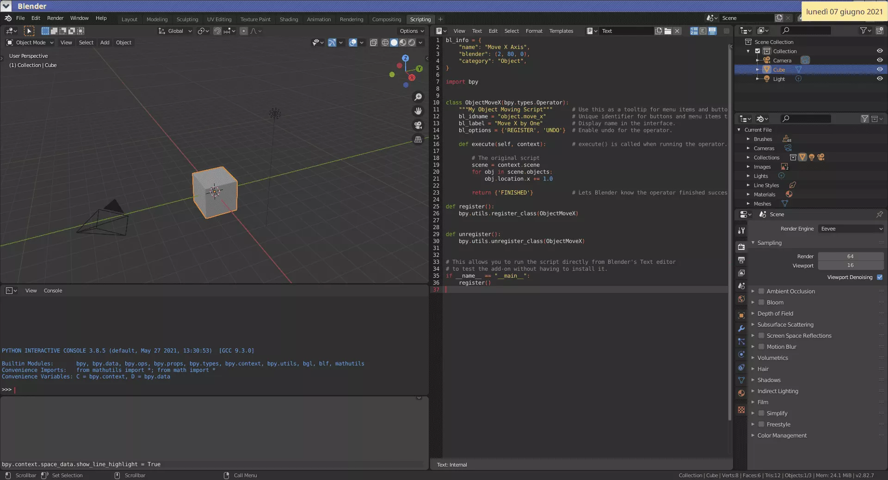

```python
# Start from the identity matrix
result = Transformation()

while True:
    # For simplicity, let's consider just two kinds of transformations
    transformation_kw = expect_keywords(stream, [
        KeywordEnum.TRANSLATION,
        KeywordEnum.ROTATION_Y,
    ])

    if transformation_kw == KeywordEnum.TRANSLATION:
        expect_symbol(stream, "(")
        result *= translation(parse_vector(stream, scene))
        expect_symbol(stream, ")")
    elif transformation_kw == KeywordEnum.ROTATION_Y:
        expect_symbol(stream, "(")
        result *= rotation_y(expect_number(stream, scene))
        expect_symbol(stream, ")")

    # Peek the next token
    next_kw = stream.read_token()
    if (not isinstance(next_kw, SymbolToken)) or (next_kw.symbol != "*"):
        # Pretend you never read this token and put it back!
        # This requires to alter the definition of `InputStream`
        # so that it holds the unread tokens as well as unread characters
        stream.unread_token(next_kw)
        break
```

# Grammatiche EBNF

# Descrivere una grammatica

-   Per «grammatica» si intende l'insieme delle regole lessicali, sintattiche e semantiche di un linguaggio.

-   Dal punto di vista dell'analisi sintattica, dovrebbe essere evidente che un parser ha bisogno in ogni istante di sapere qual è la lista di *token* ammissibili nel punto in cui è arrivato ad interpretare il codice sorgente.

-   Nella teoria dei compilatori sono state inventate alcune notazioni per descrivere la grammatica di linguaggi, che sono utilissime nel momento in cui si implementa un *lexer* o un *parser*.

-   In effetti, prima di implementare il parser di pytracer ho dovuto io stesso scrivere la nostra grammatica in un formato che consentisse di derivare la lista esaustiva di tutte le possibilità.

# Grammatica EBNF

-   La notazione che vedremo è detta *Extended Backus-Naur Form* (EBNF), ed è il risultato del lavoro di molte persone, tra cui Niklaus Wirth (il creatore del linguaggio Pascal).

-   Non descriveremo EBNF in modo completo, ma la presenteremo solo nella misura in cui serve ai nostri scopi. È utile comprenderla perché spesso la documentazione dei linguaggi di programmazione contiene la loro grammatica (ad esempio [Nim](https://nim-lang.org/docs/manual.html#syntax-grammar), [C#](https://docs.microsoft.com/en-us/dotnet/csharp/language-reference/language-specification/lexical-structure) e [Kotlin](https://kotlinlang.org/docs/reference/grammar.html); per Rust [ci stanno lavorando](https://github.com/rust-lang/wg-grammar), mentre [il manuale di D](https://dlang.org/spec/grammar.html) usa una sintassi diversa).

-   Nella slide successiva è mostrata l'intera struttura sintattica della nostra grammatica in formato EBNF.

# EBNF del nostro formato

```python
scene ::= declaration*

declaration ::= float_decl | plane_decl | sphere_decl | material_decl | camera_decl

float_decl ::= "float" IDENTIFIER "(" number ")"

plane_decl ::= "plane" "(" IDENTIFIER "," transformation ")"

sphere_decl ::= "sphere" "(" IDENTIFIER "," transformation ")"

material_decl ::= "material" IDENTIFIER "(" brdf "," pigment ")"

camera_decl ::= "camera" "(" camera_type "," transformation "," number "," number ")"

camera_type ::= "perspective" | "orthogonal"

brdf ::= diffuse_brdf | specular_brdf

diffuse_brdf ::= "diffuse" "(" pigment ")"

specular_brdf ::= "specular" "(" pigment ")"

pigment ::= uniform_pigment | checkered_pigment | image_pigment

uniform_pigment ::= "uniform" "(" color ")"

checkered_pigment ::= "checkered" "(" color "," color "," number ")"

image_pigment ::= "image" "(" LITERAL_STRING ")"

color ::= "<" number "," number "," number ">"

transformation ::= basic_transformation | basic_transformation "*" transformation

basic_transformation ::= "identity" 
    | "translation" "(" vector ")"
    | "rotation_x" "(" number ")"
    | "rotation_y" "(" number ")"
    | "rotation_z" "(" number ")"
    | "scaling" "(" vector ")"
    
number ::= LITERAL_NUMBER | IDENTIFIER

vector ::= "[" number "," number "," number "]"
```

# Spiegazione di EBNF

-   Il simbolo `::=` definisce un elemento della grammatica, ad esempio:

    ```
    number ::= LITERAL_NUMBER | IDENTIFIER
    ```

-   Il simbolo `|` rappresenta una serie di alternative (*or* logico).

-   Il simbolo `*` denota zero o più ripetizioni (`+` ne indica una o più):

    ```
    scene ::= declaration*
    ```

-   Gli identificatori `MAIUSCOLI` identificano *token*, quelli `minuscoli` altri elementi definiti nella grammatica EBNF.

-   Sono possibili definizioni ricorsive:

    ```
    transformation ::= basic_transformation | basic_transformation "*" transformation
    ```

# Gestione degli errori di un compilatore

# Gestione degli errori

-   Il nostro codice solleva una eccezione tutte le volte che viene individuato un errore nel codice sorgente.

-   È in grado di segnalare la riga e la colonna del *token* in corrispondenza del quale è stato trovato l'errore, e ciò è molto utile!

-   Ma questo modello di esecuzione impone che al primo errore la compilazione termini! I compilatori moderni come `g++` e `clang++` invece proseguono la compilazione andando in cerca anche degli errori successivi.

-   Per non fermarsi al primo errore occorre cercare un *termination token*, ossia un *token* che sia usato per terminare un comando: una volta trovato, si prosegue dal *token* successivo.

# *Termination tokens*

-   Nel linguaggio C++, due *termination tokens* molto usati sono il `;` (usato per terminare uno *statement*) e `}` (usato per terminare un blocco di codice. Ad esempio:

    ```c++
    if (x < 0) {
        x *= -1.0  // Error: missing ';'
    }
    x /= 1O;       // Uh-oh, I wrote a capital "o" instead of "0"
    ```
    
-   In un linguaggio come il nostro non è semplice individuare un *termination token*; la cosa migliore sarebbe richiedere la presenza di `;` alla fine di ogni *statement*, come nel C++, oppure obbligare a concludere le definizioni con un ritorno a capo (che sia codificato come un token `TOKEN_NEWLINE`).

# Linguaggi a confronto

# Complessità di un compilatore

-   La produzione di *liste* di errori anziché di un solo errore alla volta è importante soprattutto in quei casi in cui il compilatore è molto lento da eseguire. Questo è il caso del C++ e di Rust.

-   Il nostro linguaggio sarà molto semplice da interpretare (non ha una semantica complessa, e non richiede la creazione di una AST né l'applicazione di un ottimizzatore): non vale quindi la pena preoccuparsi di implementare questa funzionalità.

-   Però cogliamo l'occasione per capire perché possano esserci grandi differenze nella velocità di compilazione di linguaggi!

# Complessità del C++

-   La grande complessità del C++ è legata soprattutto ai `template` e all'uso degli *header file*; rendiamoci conto di questa difficoltà già guardando alcuni semplici esempi.

-   Considerate questa definizione, che mostra la difficoltà di interpretare `>>`:

    ```c++
    std::vector<std::vector<double>> matrix = identity(3); // >> are *two* tokens
    std::cin >> matrix[0][0]; // Here >> is *one* token
    ```
    
-   È impossibile creare la sequenza di token corretta con l'approccio che abbiamo seguito, che divide rigidamente il *lexing* dal *parsing* (e infatti la prima riga non era ammessa dallo standard C++ fino a pochi anni fa).

# Altre difficoltà dei `template`

-   I template C++ rendono complessa anche l'analisi sintattica:

    ```c++
    template<bool x86_64> struct MyStruct;
    template<> struct MyStruct<false> { /* Fields valid on 32-bit machines */ };
    template<> struct MyStruct<true> { /* Fields valid on 64-bit machines */ };
    ```
    
-   Si tratta in pratica di *due* strutture con lo stesso nome (`MyStruct`). Questo può essere usato ad esempio nel codice seguente:

    ```c++
    MyStruct<sizeof(size_t) > 4> A;  // On 64-bit machines use the extended definition
    ```
    
    Ma a livello di sintassi, il termine `>` rende tutto complicato!
    
# Soluzioni al problema (1/2)

-   Quando sono stati introdotti i *template* in C++, è stata una [pessima](https://keleshev.com/parsing-ambiguity-type-argument-v-less-than) [scelta](https://stackoverflow.com/questions/7304699/what-are-all-the-syntax-problems-introduced-by-the-usage-of-angle-brackets-in-c) usare come simboli `<` e `>`, perché (1) erano già usati come operatori di confronto, e (2) esistevano già gli operatori `<<` e `>>`.

-   C\# risolve entrambi i problemi dei template (che in C\# si chiamano *generics*):

    1.  Per distinguere tra il caso in cui `>>` va interpretato come due token o come uno, la regola è che se il token successivo è `(`, `)`, `]`, `:`, `;`, `,`, `.`, `?`, `==` oppure `!=`, allora va interpretato come due token, altrimenti uno;
    2.  Dentro le parentesi angolari dei generici si possono solo indicare tipi, non espressioni come `a > b`.

-   Pascal, Nim e Kotlin usano `shl` e `shr` per questi operatori.

# Soluzioni al problema (2/2)

-   Il linguaggio D invece usa una [sintassi diversa](https://dlang.org/spec/template.html) per i *template*, e nell'esempio precedente scriverebbe

    ```d
    MyStruct!(sizeof(size_t) > 4) A;
    ```

    Questa sintassi è molto più semplice da analizzare!
 
-   Rust usa `<>` come il C++, ma per rimuovere l'ambiguità richiede di scrivere `::<` nelle espressioni:

    ```rust
    //      Here you can use <      Here you must use ::<
    //        ~~~~~~~~~~~~~           ~~~~~~~~~~~~~~~~~
    let x:    foo::Foo<Bar>     =     foo::Foo::<Bar>();
    ```

# Esempio: variabili

-   Nel linguaggio Pascal le variabili si elencano dentro una clausola
    `var`. Il nome della variabile viene per primo ed è chiaramente
    separato dal tipo:

    ```pascal
    var
        myvar : Array [1..100] of Integer;
        other : String;
        x     : Real;
    ```
    
-   Questa sintassi è molto facile da interpretare: il Pascal è infatti progettato per essere semplice e nel contempo veloce da compilare.

-   Idee simili sono usate nei linguaggi Modula, Oberon, Ada, Nim e Kotlin.


# Dichiarazioni in C++

-   In C/C++ invece le dichiarazioni di variabili sono complicate, perché l'identificatore che contiene il nome della variabile è messo in mezzo al tipo:

    ```c
    int myvar[100];  /* More complicated: static const int * myvar[100] */
    ```
    
    che dichiara un array di 100 variabili di tipo `int`.
    
-   I token che definiscono il tipo sono `int`, `[`, `100` e `]`, e si trovano sia a *sinistra* che a *destra* del nome della variabile: questo per il programmatore è complicato! (Provate a interpretare il caso *more complicated* da soli!)

# Il caso di Go

-   Il linguaggio [Go](https://golang.org/), che è fortemente ispirato al C, rende più semplici le dichiarazioni usando una notazione diversa, più simile al Pascal:

    ```go
    var myvar [100]int
    ```
    
-   La keyword `var` segnala al *parser* che si sta dichiarando una variabile.

-   I token che definiscono il tipo sono riportati tutti insieme, *dopo* l'identificatore che rappresenta il nome della variabile.
    
-   La scrittura `[100]int` segue l'ordine naturale delle parole: «un array di 100 valori `int`», ed è più facile da leggere per il programmatore (in C bisogna leggere a ritroso, da destra a sinistra).

# Testing di compilatori

# Testing

-   La scrittura di test per un compilatore è una faccenda molto complessa, perché il numero di possibili errori è praticamente infinito!

-   Non è possibile avere test completamente esaustivi; bisogna avere fantasia e prepararsi ad aggiungere molti nuovi test una volta che gli utenti inizieranno ad usare il proprio programma. (In pytracer ho implementato giusto il minimo sindacale, siete incoraggiati a scrivere più test!)

-   Se siete curiosi, nella directory [`clang/test/Lexer`](https://github.com/llvm/llvm-project/tree/main/clang/test/Lexer) ci sono i file sorgente usati per i test del solo *lexer* di Clang!


# Generazione automatica di compilatori

# Generazione automatica

-   Esistono strumenti per generare automaticamente *lexer* e *parser*. Questi richiedono come file di input una grammatica (solitamente nella forma EBNF), e producono in output codice sorgente che interpreta la grammatica.

-   Due strumenti storicamente importanti sono `lex` e `yacc`, che oggi sono disponibili nelle versioni open source [Flex](https://en.wikipedia.org/wiki/Flex_(lexical_analyser_generator)) e [Bison](https://en.wikipedia.org/wiki/GNU_Bison) (generano codice C/C++).

-   [Lemon](https://sqlite.org/src/doc/trunk/doc/lemon.html) genera codice C, ed è stato usato per scrivere il parser SQL usato in SQLite.

-   [ANTLR](https://en.wikipedia.org/wiki/ANTLR) (C++, C\#, Java, Python) è la soluzione più completa e moderna.

-   Tenete però presente che la maggior parte della gente preferisce scrivere *lexer* e *parser* a mano…


# Approfondimenti

-   Il libro di Wirth [*Compiler Construction*](https://people.inf.ethz.ch/wirth/CompilerConstruction/) (Addison-Wesley, 1996) è di una chiarezza esemplare: in poche pagine come implementa un compilatore per il linguaggio [Oberon](https://en.wikipedia.org/wiki/Oberon_(programming_language)) (un linguaggio creato da Wirth come successore del Pascal).

-   Il testo «sacro» che illustra la teoria dei compilatori è il cosiddetto *dragon book* di Aho, Sethi, Lam & Ullman: *Compilers – Principles, Techniques and Tools* (Pearson Publishing, 2006).

-   Oggi i compilatori sono notevolmente più complessi a causa della necessaria integrazione con gli ambienti di sviluppo (PyCharm, CLion, IntelliJ IDEA, etc.). Guardate il video [*Anders Hejlsberg on Modern Compiler Construction*](https://www.youtube.com/watch?v=wSdV1M7n4gQ): apprezzerete molto di più quello che fanno le vostre IDE!

# Conclusioni del corso

# Conclusioni del corso

-   Siamo arrivati alla fine del corso!

-   Una volta implementato il *parser*, potrete rilasciare la versione `1.0` del vostro programma, venderla alla Disney Studios, fare un sacco di soldi e vivere da nababbi per il resto della vostra vita!

-   Se invece avete intenzione di continuare a fare il mestiere del «fisico», prima di concludere è bene rivedere cosa abbiamo imparato in questo corso e come ciò vi possa essere utile in futuro, anche se questo non prevederà il *rendering* di scene 3D…


# Le abilità più importanti

-   Il codice va scritto poco alla volta, verificando con test ogni nuova *feature*: non si scrive tutto un programma da cima a fondo senza mai provarlo o compilarlo!

-   Automatizzate i test mediante *CI builds*.

-   Usate sistemi di controllo versione per monitorare i cambiamenti.

-   Siate ordinati nell'uso di *issues*, *pull requests*, file `CHANGELOG`, etc.

-   Decidete sin da subito quale licenza usare per rilasciare il proprio codice.

-   Documentate il proprio lavoro (`README`, docstrings…)

-   Imparate a usare una IDE appropriata!


# Codici di simulazione

-   Nel caso specifico di codici di simulazione, scegliete bene il vostro [generatore di numeri casuali](tomasi-ray-tracing-11b.html#algoritmi)!

-   È importante che l'utente del vostro codice possa specificare il *seed* e, se il generatore lo prevede, l'identificatore della sequenza: questo permette la ripetibilità delle simulazioni, e ciò aiuta molto in fase di *debugging*.

-   Se si devono fare tante simulazioni, usate la possibilità dei computer moderni di fare calcoli in parallelo. Nei casi più semplici è sufficiente usare [GNU Parallel](tomasi-ray-tracing-11b.html#generare-animazioni).


# Estendibilità

-   È molto probabile che gli utenti dei programmi che svilupperete provino ad usarli in contesti che voi non avevate previsto.

-   È importante quindi che il proprio programma abbia un certo grado di *versatilità*.

-   (Non bisogna però esagerare: più un programma è versatile, più e complesso da scrivere, e rischiate quindi di non arrivare mai a rilasciare la versione 1.0!)

# I/O: usate degli standard!

-   Nel nostro progetto abbiamo implementato la possibilità di leggere la scena da un file. Questo è molto più versatile del semplice comando `demo`!

-   In maniera analoga, alcuni di voi hanno fatto in modo che il proprio programma salvasse immagini in più formati: non solo PFM, ma anche PNG, JPEG, etc.

-   In generale, è bene fare affidamento su formati diffusi (PNG, JPEG) piuttosto che su formati oscuri (PFM) o addirittura inventati da soli! Quest'ultima opzione è percorribile solo se non esistono formati adatti (è il caso del linguaggio per le scene che abbiamo inventato noi).


# Possibili approcci

-   La versatilità negli input/output di un programma si ottiene in vari modi:

    #.  Usare un formato di dati generico già disponibile;
    #.  Inventare un formato di dati *ad hoc* per il programma;
    #.  Incorporare il compilatore/interprete di un linguaggio nel proprio programma;
    #.  Creare *bindings* al nostro codice in un linguaggio interpretato (es. Python).

-   Vediamo una ad una queste possibilità.

# 1. Usare un formato esistente

# Esempio

-   Considerate un programma che fa una simulazione di un fenomeno fisico, e stampa risultati a video:

    ```
    $ ./myprogram
    Calculating...
    Estimated temperature of the air: 296 K
    The speed of the particle is 8.156 m/s²
    Force: 156.0 N
    $
    ```

-   L'output del programma non è facilmente fruibile: i numeri sono difficili da recuperare in mezzo al testo. Un output migliore è il seguente:

    ```
    $ ./myprogram
    "Temperature [K]",296
    "Speed [m/s²]",8.156
    "Force [N]",156.0
    ```

---

<asciinema-player src="cast/sc-im-84x19.cast" cols="84" rows="19" font-size="medium"></asciinema-player>


# Usare un formato esistente

-   Il vantaggio di formati esistenti è che sono leggibili anche da programmi diversi dal vostro: ad esempio, un file CSV è leggibile da Microsoft Excel, LibreOffice, Gnumeric, etc. Ciò è molto comodo soprattutto quando dovete condividere questi dati con altre persone.

-   Se dovete solo salvare tabelle di numeri, le soluzioni migliori sono probabilmente file CSV (di testo) o file Excel (binari). La libreria Python [Pandas](https://pandas.pydata.org/pandas-docs/stable/reference/api/pandas.read_excel.html) li supporta entrambi.

-   Formati più compatti che vanno bene per dati tabulari e matriciali sono [FITS](https://en.wikipedia.org/wiki/FITS) (vecchio ma molto ben supportato) e [HDF5](https://en.wikipedia.org/wiki/Hierarchical_Data_Format) (più nuovo ed efficiente, meno supportato).


# Formati più complessi

-   I formati CSV ed Excel vanno bene per *memorizzare* numeri organizzati in tabelle, ma spesso si devono applicare filtri complessi e calcoli a questi dati.

-   Un ottimo formato per questo scopo è [sqlite3](https://www.sqlite.org/index.html): a differenza di CSV ed Excel, offre eccellenti funzioni per fare ricerche e calcoli sui dati, ed è ottimizzato per grandi volumi di dati (fino a terabytes).

-   Se non è sufficiente un tipo tabellare, potete usare il formato [JSON](https://en.wikipedia.org/wiki/JSON), [YAML](https://en.wikipedia.org/wiki/YAML) (che avete già usato per le GitHub Actions) o [XML](https://en.wikipedia.org/wiki/XML): sono in grado di salvare tipi di dati molto diversi tra loro (persino liste e dizionari!).

-   XML è il più complesso, ma implementa un sistema di controllo della «sintassi» nel file (detto [XML schema](https://en.wikipedia.org/wiki/XML_schema)) che lo rende molto più robusto (anche se più difficile da scrivere).

---

<asciinema-player src="cast/json-example-python-julia-78x20.cast" cols="78" rows="20" font-size="medium"></asciinema-player>

Il vantaggio di usare un formato diffuso come JSON è che sono a disposizioni molti strumenti per visualizzarlo e modificarlo: vedete ad esempio [jq](https://stedolan.github.io/jq/).

# Il caso del nostro ray-tracer

-   Nel caso del nostro programma avremmo potuto usare il formato JSON:

    ```json
    { "camera": {
            "projection": "perspective",
            "transformations": [
                { "type": "rotation_z", "angle_deg": 30.0 },
                { "type:" "translation", "vector": [-4, 0, 1] }
            ],
            "distance": 1.0,
            "aspect_ratio": 1.0
        },
        ...
    }
    ```

-   Non serve un *lexer* e un *parser*, ma bisogna comunque validare il contenuto (es., `camera` deve contenere `projection`).

# 2. Inventare un formato

# Inventare un formato

-   È la soluzione che abbiamo adottato per descrivere le scene tridimensionali nel nostro programma.

-   Attività molto creativa, ma ha alcuni potenziali problemi:

    -   Rischia di richiedere molto tempo allo sviluppatore…
    
    -   …e richiede che l'utente impari la sintassi e la semantica del vostro linguaggio
    
-   Noi l'abbiamo adottata a lezione per la sua valenza didattica (comprensione del funzionamento dei compilatori, gestione degli errori, …), e perché non è comunque facile usare un formato generico come JSON in questo contesto particolare.


# 3. Incorporare un linguaggio

# Incorporare un linguaggio

-   Una soluzione usata soprattutto per programmi vasti e complessi è quella di incorporare un interprete di un linguaggio «semplice» all'interno del proprio programma (questo tipo di interpreti è detto *embedded*).

-   Esempi notevoli:

    -   Microsoft [Visual Basic for Applications](https://en.wikipedia.org/wiki/Visual_Basic_for_Applications) (linguaggio BASIC incluso in Word, Excel e molte altre);
    -   [AutoLISP](https://en.wikipedia.org/wiki/AutoLISP) (interprete LISP usato in AutoCAD);
    -   [GNU Guile](https://www.gnu.org/software/guile/) (interprete Scheme usato in [The Gimp](https://docs.gimp.org/en/gimp-concepts-script-fu.html), [Lilypond](https://lilypond.org/doc/v2.18/Documentation/extending/scheme-tutorial), etc.)
    -   Python (usato in [Blender](https://docs.blender.org/manual/en/latest/advanced/scripting/introduction.html), [Inkscape](https://wiki.inkscape.org/wiki/index.php/Python_modules_for_extensions), [The Gimp](https://www.gimp.org/docs/python/index.html), [Minecraft](https://projects.raspberrypi.org/en/projects/getting-started-with-minecraft-pi/4)).

-   Vedi [*Programmable Applications: Interpreter Meets Interface*](https://dspace.mit.edu/handle/1721.1/5980) (Eisenberg, 1995).

---

<center>{height=620px}</center>

In Blender è possibile aprire un terminale Python in cui lanciare comandi per creare oggetti, modificarli, etc.

# Logica di funzionamento

-   Il linguaggio incorporato nella applicazione è «esteso» con funzioni specifiche per manipolare gli oggetti gestiti dall'applicazione. Ad esempio, questo codice VBA può essere usato per modificare la cella `A1` di un foglio Excel:

    ```monobasic
    Sub Macro1()
        Worksheets(1).Range("A1").Value = "Wow!"
        Worksheets(1).Range("A1").Borders.LineStyle = xlDouble
    End Sub
    ```

-   Comodo per automatizzare task ripetitivi (es. creare oggetti ripetuti in programmi grafici come Blender).

-   Alcuni linguaggi ([GNU Guile](https://www.gnu.org/software/guile/), [Lua](https://www.lua.org/)…) sono pensati principalmente per usi *embedded*.

# Esempio Python

Questo programma C inizializza l'interprete Python ed esegue un semplice script. Nella realtà, questo script potrebbe essere stato digitato dall'utente in una finestra di dialogo del programma:

```c
#define PY_SSIZE_T_CLEAN
#include <Python.h>

int
main(int argc, char *argv[])
{
    wchar_t *program = Py_DecodeLocale(argv[0], NULL);
    if (program == NULL) {
        fprintf(stderr, "Fatal error: cannot decode argv[0]\n");
        exit(1);
    }
    Py_SetProgramName(program);  /* optional but recommended */
    Py_Initialize();
    /* Run a simple Python program that prints the current date */
    PyRun_SimpleString("from time import time,ctime\n"
                       "print('Today is', ctime(time()))\n");
    if (Py_FinalizeEx() < 0) {
        exit(120);
    }
    PyMem_RawFree(program);
    return 0;
}
```

# Registrare funzioni

Si può estendere l'interprete Python perché riconosca nuove funzioni: è in questo modo che si rendono disponibili le funzionalità del proprio programma attraverso Python. Ecco un [esempio](https://docs.python.org/3/extending/embedding.html):

```c
static int numargs=0;

/* Return the number of arguments of the application command line */
static PyObject*
emb_numargs(PyObject *self, PyObject *args)
{
    if(!PyArg_ParseTuple(args, ":numargs"))
        return NULL;
    return PyLong_FromLong(numargs);
}

/* This will enable the interpreter to understand the following script:
 *
 *     import emb
 *     print(emb.numargs())
 *
 */
static PyMethodDef EmbMethods[] = {
    {"numargs", emb_numargs, METH_VARARGS,
     "Return the number of arguments received by the process."},
    {NULL, NULL, 0, NULL}
};

static PyModuleDef EmbModule = {
    PyModuleDef_HEAD_INIT, "emb", NULL, -1, EmbMethods,
    NULL, NULL, NULL, NULL
};

static PyObject*
PyInit_emb(void)
{
    return PyModule_Create(&EmbModule);
}
```

# Il caso del nostro ray-tracer

-   Avremmo potuto allora rendere disponibili in Python funzioni come `create_sphere`, `create_brdf`, etc.

-   I file di input sarebbero stati normali script Python, che potevano impiegare tutte le potenzialità del linguaggio (variabili, funzioni, cicli `for`, etc.):

    ```python
    black = color(0.0, 0.0, 0.0)  # We can define variables of any type, not only floats!
    
    sphere_material = create_material(
        brdf=diffuse_brdf(uniform_pigment(color(0.7, 0.5, 1.0))),
        emitted_radiance=uniform_pigment(black),
    )
    
    # Create many objects using a `for` loop
    for angle in [0, 90, 180, 270]:
        create_sphere(sphere_material, rotation_x(angle) * translation(vec(10, 0, 0)))
    ```

# 4. Creare *bindings*

# Creare *bindings*

-   Un approccio simile a quello degli interpreti *embedded* è quello di rendere il proprio codice invocabile da un linguaggio esterno (solitamente Python).

-   La differenza con la soluzione precedente è che in questo caso si usa l'interprete Python installato nel sistema, e non un interprete dedicato.

-   Il vantaggio è ovviamente che si possono combinare librerie già installate con la nostra: la soluzione è molto più versatile, ed è generalmente quella da preferire.

-   Questa soluzione è facilmente praticabile con linguaggi come C++, Nim, Rust…; è decisamente più complessa per Julia, C\# o Kotlin.

# Fine!
