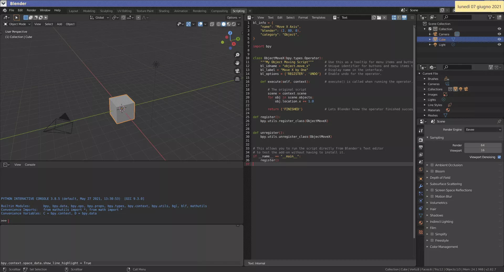

# Syntactic and Semantic Analysis

# Syntactic and Semantic Analysis

-   In the last lesson, we saw how to implement a lexical analysis of a source file that defines a 3D scene.

-   The lexer we implemented reads a sequence of characters from a *stream* (a file) and produces a sequence of tokens as output.

-   Today's task is to interpret the sequence of tokens (syntactic analysis) and from this build a series of objects of type `Shape`, `Material`, etc. in memory (semantic analysis).

# Syntactic Analysis

-   The syntax of a language can be divided into categories depending on the peculiarities of its syntax and how the tokens are concatenated: [LL(n)](https://en.wikipedia.org/wiki/LL_parser), [LR(n)](https://en.wikipedia.org/wiki/LR_parser), [GLR(n)](https://en.wikipedia.org/wiki/GLR_parser), [LALR(n)](https://en.wikipedia.org/wiki/LALR_parser), etc.

-   Each of these families requires specific algorithms for parsing, and unfortunately, algorithms that work well for one family do not necessarily work well for others!

-   Our language is of type LL(1), like [Pascal](https://en.wikipedia.org/wiki/Pascal_(programming_language)) and [Rust](https://en.wikipedia.org/wiki/Rust_(programming_language)) but unlike C++, and the algorithm for analyzing LL grammars is among the simplest.

# How to Approach the Problem

-   Let's consider this definition:

    ```python
    material sky_material(
        diffuse(image("sky-dome.pfm")),
        uniform(<0.7, 0.5, 1>)
    )
    ```

-   The definition includes these elements:

    1.  A material;
    2.  A BRDF (`diffuse`);
    3.  Two pigments (`image` and `uniform`);
    4.  A color, indicated by `<0.7, 0.5, 1>`.

# Top-Down Approach

-   However, it is simple to write a function that analyzes the definition of `sky_material` if it can rely on other functions, each of which analyzes *only one element*.

-   Therefore, we define a function `parse_color` that interprets a sequence of tokens as a color and returns the corresponding `Color` object, a function `parse_pigment`, a function `parse_brdf`, etc.

-   These functions will have the task of calling each other, one inside the other, so that higher-level functions like `parse_material` can rely on progressively simpler ones like `parse_color`.

# `parse_color`

```python
def expect_symbol(stream: InputStream, symbol: str) -> None:
    """Read a token from `stream` and check that it matches `symbol`."""
    token = stream.read_token()
    if not isinstance(token, SymbolToken) or token.symbol != symbol:
        raise parser_error(token, f"got '{token}' instead of '{symbol}'")

    # Don't bother returning the character: we were already expecting it


def expect_number(stream: InputStream, scene: Scene) -> float:
    """Read a token from `stream` and check that it is either a literal number or a variable.

    Return the number as a ``float``."""
    token = input_file.read_token()
    if isinstance(token, LiteralNumberToken):
        return token.value
    elif isinstance(token, IdentifierToken):
        variable_name = token.identifier
        if variable_name not in scene.float_variables:
            raise GrammarError(token.location, f"unknown variable '{token}'")
        return scene.float_variables[variable_name]

    raise GrammarError(token.location, f"got '{token}' instead of a number")


# This parses a list of tokens like "<0.7, 0.5, 1>". Note that functions
# with name "expect_*" only read *one* token, while functions named
# "parse_*" read more than one token.
def parse_color(stream: InputStream) -> Color:
    expect_symbol(stream, "<")
    red = expect_number(stream)
    expect_symbol(stream, ",")
    green = expect_number(stream)
    expect_symbol(stream, ",")
    blue = expect_number(stream)
    expect_symbol(stream, ">")

    # Create the "Color" object *immediately* (not something a real-world
    # compiler will do, but our case is simpler than a real compiler)
    return Color(red, green, blue)
```

# `parse_pigment`

```python
def parse_pigment(stream: InputStream) -> Pigment:
    # Examples: uniform(<0.7, 0.5, 1>)
    #           checkered(<0.3, 0.5, 0.1>, <0.1, 0.2, 0.5>, 4)
    #           image("bitmap.pfm")
    keyword = expect_keywords(stream, [
        KeywordEnum.UNIFORM,
        KeywordEnum.CHECKERED,
        KeywordEnum.IMAGE,
    ])

    expect_symbol(stream, "(")
    if keyword == KeywordEnum.UNIFORM:
        color = parse_color(stream)

        result = UniformPigment(color=color)
    elif keyword == KeywordEnum.CHECKERED:
        color1 = parse_color(stream)

        expect_symbol(stream, ",")

        color2 = parse_color(stream)

        expect_symbol(stream, ",")

        num_of_steps = int(expect_number(stream))

        result = CheckeredPigment(color1=color1, color2=color2, num_of_steps=num_of_steps)
    elif …: # Other pigments
        …

    expect_symbol(stream, ")")
    return result
```

# Semantic Analysis and Beyond

-   A full-blown compiler like GCC would use the result of semantic analysis to build an Abstract Syntax Tree (AST).
-   The AST would be passed to the optimizer and then to the code generator, whose purpose is to output machine code.
-   Question: if you declare a variable like

    ```c++
    uint8_t buffer[1024 * 1024 * 1024]; // 1 GB!
    ```

    do you think GCC needs to allocate this memory during the compilation? If so, at which stage? (Lexing, parsing, AST optimization, machine code emission, …)

# Semantic Analysis and Beyond

-   Our "compiler" is very simple, and as soon as the syntactic analysis understands that a variable/material/shape/observer is being defined, it **immediately** creates a corresponding object in memory (e.g., `Color`).

-   In some sense, our compiler is an **interpreter**, because it “executes” the code as soon as it is processed by the parser.

-   This is a huge simplification for us! Even traditional “interpreters” like Python and Julia have a compilation stage which precedes the execution stage.

# Types of Grammars

# LL(n) Grammars

-   In an LL(n) grammar, tokens are analyzed "from left to right," that is, in the order in which they are produced by the lexer.

-   The number $n$ in the notation LL(n) indicates that $n$ *look-ahead* tokens are needed to correctly interpret the syntax: that is, the $n$ subsequent tokens are examined to interpret the current token (similar to how `unread_char` works in our lexer).

-   Consequently, our format for describing scenes is of type LL(1) because:

    1. The syntax is analyzed by reading one token after another, in order;
    2. It may be necessary to check the type of the **one** token following the current one, but no more than that.

# Why LL(1)?

-   Let's now explain in which contexts it is necessary to use *look-ahead*.

-   Consider this definition:

    ```
    float clock(150)
    ```

    In this case, *look-ahead* is **not** necessary:

    1. The first token is the keyword `float`, which indicates that a variable is being defined;
    2. Therefore, our compiler knows that the next tokens will necessarily be the *identifier*, the symbol `(`, a *numeric literal*, and the symbol `)`.

# Declaring a `float`

```python
# Read the first token of the next statement. Only a handful of
# keywords are allowed at the beginning of a statement.
what = expect_keywords(stream, [KeywordEnum.FLOAT, …])

if what == KeywordEnum.FLOAT:
    # We are going to declare a new "float" variable

    # Read the name of the variable
    variable_name = expect_identifier(stream)

    # Now we must get a "("
    expect_symbol(stream, "(")

    # Read the literal number to associate with the variable
    variable_value = expect_number(stream, scene)

    # Check that the statement ends with ")"
    expect_symbol(stream, ")")

    # Done! Add the variable to the list
    variable_table[variable_name] = variable_value
elif …:  # Statements other than "float …" can be interpreted here
    …
```

# Why LL(1)?

-   Let’s consider these definitions:

    ```python
    plane(sky_material, translation([0, 0, 100]))                        # Case #1
    plane(sky_material, translation([0, 0, 100]) * rotation_y(clock))    # Case #2
    ```

-   We must write a function `parse_plane` that calls a function `parse_transformation`.

-   But the transformation is problematic: after `…100])` we cannot tell if the definition is complete or if the `*` symbol (composition) follows. In the latter case, `parse_transformation` would still have work to do!

---

```python
# Start from the identity matrix
result = Transformation()

while True:
    # For simplicity, let's consider just two kinds of transformations
    transformation_kw = expect_keywords(stream, [
        KeywordEnum.TRANSLATION,
        KeywordEnum.ROTATION_Y,
    ])

    if transformation_kw == KeywordEnum.TRANSLATION:
        expect_symbol(stream, "(")
        result *= translation(parse_vector(stream, scene))
        expect_symbol(stream, ")")
    elif transformation_kw == KeywordEnum.ROTATION_Y:
        expect_symbol(stream, "(")
        result *= rotation_y(expect_number(stream, scene))
        expect_symbol(stream, ")")

    # Peek the next token
    next_kw = stream.read_token()
    if (not isinstance(next_kw, SymbolToken)) or (next_kw.symbol != "*"):
        # Pretend you never read this token and put it back!
        # This requires to alter the definition of `InputStream`
        # so that it holds the unread tokens as well as unread characters
        stream.unread_token(next_kw)
        break
```

# EBNF Grammars

# Describing a grammar

-   By "grammar" we mean the set of lexical, syntactic, and semantic rules of a language.

-   From the point of view of syntactic analysis, it should be evident that a parser needs to know at every moment what is the list of tokens admissible at the point where it has arrived in interpreting the source code.

-   In compiler theory, some notations have been invented to describe the grammar of languages, which are very useful when implementing a lexer or a parser.

# EBNF Grammar

-   The notation we will see is called *Extended Backus-Naur Form* (EBNF), and is the result of the work of many people, including [Niklaus Wirth](https://en.wikipedia.org/wiki/Niklaus_Wirth) (the creator of the Pascal language).

-   We will not provide a full description of EBNF and will just present it in simple terms. It is useful to understand it because often the documentation of programming languages contains their grammar (for example [Nim](https://nim-lang.org/docs/manual.html#syntax-grammar), [C#](https://docs.microsoft.com/en-us/dotnet/csharp/language-reference/language-specification/lexical-structure) and [Kotlin](https://kotlinlang.org/docs/reference/grammar.html); for Rust [they are working on it](https://github.com/rust-lang/wg-grammar), while [the D manual](https://dlang.org/spec/grammar.html) uses a different syntax).

-   The next slide shows the entire syntactic structure of our grammar in EBNF format.

# EBNF for our format

```python
scene ::= declaration*

declaration ::= float_decl | plane_decl | sphere_decl | material_decl | camera_decl

float_decl ::= "float" IDENTIFIER "(" number ")"

plane_decl ::= "plane" "(" IDENTIFIER "," transformation ")"

sphere_decl ::= "sphere" "(" IDENTIFIER "," transformation ")"

material_decl ::= "material" IDENTIFIER "(" brdf "," pigment ")"

camera_decl ::= "camera" "(" camera_type "," transformation "," number "," number ")"

camera_type ::= "perspective" | "orthogonal"

brdf ::= diffuse_brdf | specular_brdf

diffuse_brdf ::= "diffuse" "(" pigment ")"

specular_brdf ::= "specular" "(" pigment ")"

pigment ::= uniform_pigment | checkered_pigment | image_pigment

uniform_pigment ::= "uniform" "(" color ")"

checkered_pigment ::= "checkered" "(" color "," color "," number ")"

image_pigment ::= "image" "(" LITERAL_STRING ")"

color ::= "<" number "," number "," number ">"

transformation ::= basic_transformation | basic_transformation "*" transformation

basic_transformation ::= "identity"
    | "translation" "(" vector ")"
    | "rotation_x" "(" number ")"
    | "rotation_y" "(" number ")"
    | "rotation_z" "(" number ")"
    | "scaling" "(" vector ")"

number ::= LITERAL_NUMBER | IDENTIFIER

vector ::= "[" number "," number "," number "]"
```

# EBNF Explanation

-   The symbol `::=` defines a grammar element, for example:

    ```
    number ::= LITERAL_NUMBER | IDENTIFIER
    ```

-   The symbol `|` represents a series of alternatives (logical *or*).

-   The symbol `*` denotes zero or more repetitions (`+` indicates one or more):

    ```
    scene ::= declaration*
    ```

-   `UPPERCASE` indicates tokens produced by the lexer, `lowercase`  identifies other elements in the EBNF grammar.

-   Recursive definitions are possible:

    ```
    transformation ::= basic_transformation | basic_transformation "*" transformation
    ```

# Compiler Error Handling {#compiler-errors}

# Error Handling

-   Our code raises an exception whenever an error is detected in the source code.

-   It is able to report the row and column of the token where the error was found, which is very useful!

-   But this execution model requires that compilation terminates at the first error! Modern compilers like `g++` and `clang++` instead continue compilation, looking for subsequent errors.

-   To avoid stopping at the first error, we need to look for a *termination token*, i.e., a token that is used to terminate a command: once found, we continue from the next token.

# *Termination Tokens*

-   In the C++ language, two frequently used *termination tokens* are `;` (used to terminate a *statement*) and `}` (used to terminate a block of code). For example:

    ```c++
    if (x < 0) {
        x *= -1.0  // Error: missing ';'
    }
    x /= 1O * a;       // Uh-oh, I wrote a capital "o" instead of "0"
    ```

-   In a language like ours, it is not easy to identify a *termination token*; the best thing would be to require the presence of `;` at the end of each *statement*, as in C++, or to require definitions to be terminated by a newline character (encoded as a `TOKEN_NEWLINE` token).

# Language Comparison {#comparison-of-languages}

# Compiler Complexity

-   Producing *lists* of errors instead of just one error at a time is especially important in cases where the compiler is very slow to execute. This is the case with C++ and Rust.

-   Our language will be very easy to interpret (it does not have complex semantics, and does not require the creation of an AST or the application of an optimizer): it is therefore not worth worrying about implementing this functionality.

-   However, let's take this opportunity to understand why there can be large differences in the compilation speed of languages!

# C++ Complexity

-   The great complexity of C++ is mainly related to `template`s and the use of *header files*.

-   Let’s have a look at some of the problems with the C++ grammar by considering a couple of real-world examples.

# First example

-   Imagine that you have N particle detectors. You want to collect the energy of each event measured by each detector.

-   The domain is 2D (detectors × events), but it cannot be stored in a matrix: if there is one row per detector, the number of columns will depend on the number of events recorded by each detector.

-   Thus, we must define a structure that can hold lists of lists:

    ```python
    data = [
        [10.5, 3.7, 4.6, 13.4],  # Events caught by det#1
        [],                      # No events for det#2
        [8.5, 3.3],              # Events caught by det#3
        ...
    ]
    ```

# First example

-   Using a typed language like C++, we might define `data` in this way:

    ```c++
    std::vector<std::vector<double>> data;
    ```

-   However, this definition was not correct: pre-C++11 compilers would refuse to compile this code. Can you guess why?

# First example

-   The problem is that `>>` can either be interpreted by the lexer as two tokens (`>` and `>`) or one (`>>`). The following example shows the problem:

    ```c++
    std::vector<std::vector<double>> matrix = identity(3); // Here >> are *two* tokens
    std::cin >> matrix[0][0]; // Here >> is *one* token
    ```

-   It is impossible to create the correct token sequence with the approach we have followed, which rigidly separates *lexing* from *parsing*.

-   Only C++11 mandated compilers to accept this syntax: see document [N1757](https://www.open-std.org/jtc1/sc22/wg21/docs/papers/2005/n1757.html), published in 2005. (The C++ language was invented in the 1980s!)

# Second example

-   Let’s move to another example to show an additional difficulty with templates.

-   Nowadays, the most common CPU architectures are 32-bit and 64-bit, depending on the size of their CPU registers. (This affects how much data the CPU can handle in one pass and how much memory can address.)

-   Operating Systems and systems libraries like [glibc](https://www.gnu.org/software/libc/) and [musl](https://musl.libc.org/) need to define the fields in structures using the most appropriate types for their field.

-   If we are using C++, we might use templates to define these structures in a smart way.

---

-   You are probably familiar with C++ templates using *types* as parameters:

    ```c++
    template<typename T> class vector {
        // ...   Use parameter `T` whenever you refer to the type of one element
    }
    ```

-   This means that when you write

    ```c++
    std::vector<double> my_vec;   // The template parameter here is "double"
    ```

    the template gets instantiated by substituting `double` to each occurrence of `T` in the definition of the `vector` class.

---

-   But you are not limited to *types*: C++ lets you to use *values* as template parameters.

-   This is handy in our case. We can define a structure that mimicks the POSIX [`stat`](https://www.man7.org/linux/man-pages/man3/stat.3type.html) datatype:

    ```c++
    template<bool> struct my_stat;  // No `typename T` here, just `bool`

    // 64-bit case: the value of `bool` is `true`
    template<> struct my_stat<true> {
        int64_t st_dev;  // Device number
        int64_t st_ino;  // Inode number
        // ...
    }

    // 32-bit case: the value of `bool` is `false`
    template<> struct my_stat<false> {
        int32_t st_dev;  // Device number
        int32_t st_ino;  // Inode number
        // ...
    }
    ```

---

-   Using the previous definition, we can employ the fact that `size_t` is an integer type that is 8-byte wide on 64-bit architectures but just 4-byte wide on 32-bit:

    ```c++
    my_stat<sizeof(size_t) > 4> stat;  // Use the most appropriate definition
    ```

-   In this way, we do not need to use `#ifdef`s and macro madness in defining some code that will do the right thing when compiled on 32-bit or 64-bit machines.

-   However, at the syntax level, the `>` term in this example makes everything complicated for the parser!

# An important quote

> I've become somewhat infamous about wanting to keep the language [Rust] LL(1) but the fact is that today one can't parse Rust very easily, much less pretty-print (thus auto-format) it, and this is an actual (and fairly frequent) source of problems. It's easier to work with than C++, but that's fairly faint praise. I lost almost every argument about this, from the **angle brackets for type parameters** [emphasis added] to the pattern-binding ambiguity to the semicolon and brace rules to … ugh I don't even want to get into it. The grammar is not what I wanted. Sorry.

<p style="text-align:right">[Graydon Hoare](https://graydon2.dreamwidth.org/307291.html), creatore del linguaggio Rust.</p>


# Solutions to the problem (1/2)

-   When *templates* were introduced in C++, it was a [terrible](https://keleshev.com/parsing-ambiguity-type-argument-v-less-than) [choice](https://stackoverflow.com/questions/7304699/what-are-all-the-syntax-problems-introduced-by-the-usage-of-angle-brackets-in-c) to use `<` and `>` as symbols because (1) they were already used as comparison operators, and (2) the operators `<<` and `>>` already existed.

-   C# suffers from the same problem, but it is less severe (in C# *templates* are called *generics*):

    1.  To distinguish between the case where `>>` should be interpreted as two tokens or one, the rule is that if the next token is `(`, `)`, `]`, `:`, `;`, `,`, `.`, `?`, `==`, or `!=`, then it should be interpreted as two tokens, otherwise one;
    2.  Inside `<>` you can only specify types, not expressions like `a > b`.

-   Pascal, Nim, and Kotlin use `shl` and `shr` for these operators.

# Solutions to the problem (2/2)

-   The D language instead uses a [different syntax](https://dlang.org/spec/template.html) for *templates*, and in the previous example would write

    ```d
    MyStruct!(sizeof(size_t) > 4) A;
    ```

    This syntax is much easier to parse!

-   Rust uses `<>` like C++, but to remove the ambiguity it requires writing `::<` in expressions:

    ```rust
    //      Here you can use <      Here you must use ::<
    //        ~~~~~~~~~~~~~           ~~~~~~~~~~~~~~~~~
    let x:    foo::Foo<Bar>     =     foo::Foo::<Bar>();
    ```

# Example: variables

-   In C/C++, variable declarations are complicated because the identifier containing the variable name is placed in the middle of the type:

    ```c
    int myvar[100];  /* More complicated: static const int * myvar[100] */
    ```

    which declares an array of 100 variables of type `int`.

-   The tokens that define the type are `int`, `[`, `100`, and `]`, and are located both to the *left* and *right* of the variable name: this is complicated for the programmer! (Try to interpret the *more complicated* case yourself!)

# Example: variables

-   The [Go](https://golang.org/) language uses a simpler notation:

    ```go
    var myvar [100]int
    ```

-   The `var` keyword signals to the parser that a variable is being declared.

-   The tokens that define the type are reported all together, *after* the identifier representing the variable name.

-   The notation `[100]int` follows the natural order of words: "an array of 100 `int` values", and is easier for the programmer to read (in C you have to read backwards, from right to left).

# Example: variables

-   Go was inspired by Pascal, where variables are listed within a `var` clause. The variable name comes first and is clearly separated from the type:

    ```pascal
    var
        myvar : Array [1..100] of Integer;
        other : String;
        x     : Real;
    ```

-   This syntax is very easy to interpret: Pascal is in fact designed to be simple and at the same time fast to compile.

-   Similar ideas are used in the Modula, Oberon, Ada, Nim, and Kotlin languages.


# Testing compilers {#compiler-testing}

# Testing

-   Writing tests for a compiler is a very complex matter, because the number of possible errors is practically infinite!

-   It is not possible to have completely exhaustive tests; you need to be creative and be prepared to add many new tests once users start using your program. (In pytracer I have implemented just the bare minimum, you are encouraged to write more tests!)

-   If you are curious, in the [`clang/test/Lexer`](https://github.com/llvm/llvm-project/tree/main/clang/test/Lexer) directory there are the source files used for the tests of only the Clang lexer!


# Automatic Compiler Generation {#automatic-generation-of-compilers}

# Automatic Generation

-   There are tools to automatically generate *lexers* and *parsers*. These tools require a grammar as input (usually in EBNF form), and produce source code that interprets the grammar.

-   Two historically important tools are `lex` and `yacc`, which are available today in the open-source versions [Flex](https://en.wikipedia.org/wiki/Flex_(lexical_analyser_generator)) and [Bison](https://en.wikipedia.org/wiki/GNU_Bison) (they generate C/C++ code).

-   [Lemon](https://sqlite.org/src/doc/trunk/doc/lemon.html) generates C code and was used to write the SQL parser used in SQLite.

-   [ANTLR](https://en.wikipedia.org/wiki/ANTLR) (C++, C#, Java, Python) is the most complete and modern solution.

-   Keep in mind, however, that most people prefer to write *lexers* and *parsers* by hand…


# Further resources

-   Wirth's book [*Compiler Construction*](https://people.inf.ethz.ch/wirth/CompilerConstruction/) (Addison-Wesley, 1996) is remarkably clear: in a few pages it shows how to implement a compiler for the [Oberon](https://en.wikipedia.org/wiki/Oberon_(programming_language)) language (a language created by Wirth as a successor to Pascal).

-   The "sacred" text that illustrates compiler theory is the so-called *dragon book* by Aho, Sethi, Lam & Ullman: *Compilers – Principles, Techniques and Tools* (Pearson Publishing, 2006).

-   Today, compilers are considerably more complex due to the necessary integration with development environments (PyCharm, CLion, IntelliJ IDEA, etc.). Watch the video [*Anders Hejlsberg on Modern Compiler Construction*](https://www.youtube.com/watch?v=wSdV1M7n4gQ): you will appreciate much more what your IDEs do!


# Conclusions

# Conclusions

-   We've reached the end of the course!

-   Once you've implemented the parser, you can release version `1.0` of your program, sell it to Disney Studios, make a ton of money, and live in luxury for the rest of your life!

-   If, however, you intend to continue working as a «physicist», before concluding, it's good to review what we've learned in this course and how it can be useful to you in the future, even if it doesn't involve *rendering* 3D scenes…


# The Most Important Skills

-   Write code little by little, verifying each new *feature* with tests: don't write an entire program from top to bottom without ever testing or compiling it!

-   Automate tests using *CI builds*.

-   Use version control systems to track changes.

-   Be organized in the use of *issues*, *pull requests*, `CHANGELOG` files, etc.

-   Decide from the start which license to use to release your code.

-   Document your work (`README`, docstrings…).

-   Learn to use a proper IDE!


# Simulation Codes

-   In the specific case of simulation codes, choose your [random number generator](tomasi-ray-tracing-11b.html#algoritmi) carefully!

-   It's important that the user of your code can specify the *seed* and, if the generator allows it, the sequence identifier: this allows for the repeatability of simulations, which helps a lot during *debugging*. (As a testament to this, have a look at this [PR](https://github.com/litebird/litebird_sim/pull/414)…)

-   If you have to run many simulations, use the ability of modern computers to perform calculations in parallel. In the simplest cases, it's enough to use [GNU Parallel](tomasi-ray-tracing-11b.html#generare-animazioni).


# Extensibility

-   It's very likely that the users of the programs you develop will try to use them in contexts you hadn't foreseen.

-   Therefore, it's important that your program has a certain degree of *versatility*.

-   (However, don't overdo it: the more versatile a program is, the more complex it is to write, and therefore you risk never releasing version 1.0!)

# I/O: Use Standards!

-   In our project, we implemented the ability to read the scene from a file. This is much more versatile than the simple `demo` command!

-   Similarly, some of you have made it so that your program saves images in multiple formats: not just PFM, but also PNG, JPEG, etc.

-   In general, it's good to rely on widespread formats (PNG, JPEG) rather than obscure formats (PFM) or even ones you invent yourself! This last option is viable only if there are no suitable formats (as is the case with the scene description language we invented).

---

{height=650px}

# Deep Dive into Input and Output

# Possible Approaches

-   The versatility of a program's input/output can be achieved in various ways:

    #.  Using an already available generic data format;
    #.  Inventing a *custom* data format for the program;
    #.  Embedding the compiler/interpreter of a language into the program;
    #.  Creating *bindings* to our code in an interpreted language (e.g., Python).

-   Let's examine these possibilities one by one.

# 1. Using an Existing Format

# Example

-   Consider a program that simulates a physical phenomenon and prints results to the screen:

    ```
    $ ./myprogram
    Calculating…
    Estimated temperature of the air: 296 K
    The speed of the particle is 8.156 m/s²
    Force: 156.0 N
    $
    ```

-   The program's output is not easily usable: numbers are difficult to extract from the text. A better choice would be to use the [CSV](https://en.wikipedia.org/wiki/Comma-separated_values) format, which can be imported in spreadsheets like Excel or [Sc-im](https://github.com/andmarti1424/sc-im):

    ```
    $ ./myprogram
    "Temperature [K]",296
    "Speed [m/s²]",8.156
    "Force [N]",156.0
    ```

---

<asciinema-player src="cast/sc-im-84x19.cast" cols="84" rows="19" font-size="medium"></asciinema-player>


# Using an Existing Format

-   The advantage of existing formats is that they can be read by programs other than your own. This is especially convenient when you need to share data with others.

-   If you only need to store numerical tables, the best solutions are probably CSV files (text-based) or Excel files (binary). The Python library [Pandas](https://pandas.pydata.org/pandas-docs/stable/reference/api/pandas.read_excel.html) supports both.

-   More compact formats suitable for tabular and matrix data include [FITS](https://en.wikipedia.org/wiki/FITS) (old but well-supported) and [HDF5](https://en.wikipedia.org/wiki/Hierarchical_Data_Format) (newer and more efficient, though less widely supported).


# More Complex Formats

-   CSV and Excel are good for *storing* numbers organized in tables, but often, you need to apply complex filters and calculations to this data.

-   A great format for this purpose is [sqlite3](https://www.sqlite.org/index.html): unlike CSV and Excel, it offers excellent functions for searching and computing data and is optimized for large data volumes (up to terabytes).

-   When your data are more structured than plain tables, consider [JSON](https://en.wikipedia.org/wiki/JSON), [YAML](https://en.wikipedia.org/wiki/YAML) (which you have already used for GitHub Actions), or [XML](https://en.wikipedia.org/wiki/XML): these can store complex data types as lists and dictionaries.

-   XML is the most complex, but it implements a validation system (called [XML schema](https://en.wikipedia.org/wiki/XML_schema)) which makes it much more robust than JSON or YAML.

---

In this example, a Python program saves the value of a complex variable in a JSON file, which is then read back by a Julia program:

<asciinema-player src="cast/json-example-python-julia-78x20.cast" cols="78" rows="20" font-size="medium"></asciinema-player>

Many tools are available for JSON; see, for example, [jq](https://stedolan.github.io/jq/).

# The Case of Our Ray Tracer

-   In our program, we could have used the JSON format:

    ```json
    { "camera": {
            "projection": "perspective",
            "transformations": [
                { "type": "rotation_z", "angle_deg": 30.0 },
                { "type:" "translation", "vector": [-4, 0, 1] }
            ],
            "distance": 1.0,
            "aspect_ratio": 1.0
        },
        …
    }
    ```

-   No need to write a compiler, but our program must still validate the content (e.g., checking that `camera` contains a `projection` is still our duty!).

# 2. Inventing a Format

# Inventing a Format

-   This is the approach we adopted to describe 3D scenes in our program.

-   It is a highly creative activity but has some potential issues:

    -   It may take a lot of time for the developer…

    -   …and requires users to learn the syntax and semantics of your language.

-   We adopted this approach in class for its educational value (understanding compilers, error handling, etc.) and because using a generic format like JSON in this specific context would have been not necessarily easier.


# 3. Embedding a Language

# Embedding a Language

-   A solution often used in large and complex programs is to embed an interpreter of a "simple" language into the program (this type of interpreter is called *embedded*).

-   Notable examples:

    -   Microsoft [Visual Basic for Applications](https://en.wikipedia.org/wiki/Visual_Basic_for_Applications) (BASIC language included in Word, Excel, and many others);
    -   [AutoLISP](https://en.wikipedia.org/wiki/AutoLISP) (LISP interpreter used in AutoCAD);
    -   [GNU Guile](https://www.gnu.org/software/guile/) (Scheme interpreter used in [The Gimp](https://docs.gimp.org/en/gimp-concepts-script-fu.html), [Lilypond](https://lilypond.org/doc/v2.18/Documentation/extending/scheme-tutorial), etc.);
    -   Python (used in [Blender](https://docs.blender.org/manual/en/latest/advanced/scripting/introduction.html), [Inkscape](https://wiki.inkscape.org/wiki/index.php/Python_modules_for_extensions), [The Gimp](https://www.gimp.org/docs/python/index.html), [Minecraft](https://projects.raspberrypi.org/en/projects/getting-started-with-minecraft-pi/4)).

-   See [*Programmable Applications: Interpreter Meets Interface*](https://dspace.mit.edu/handle/1721.1/5980) (Eisenberg, 1995).

---

<center>{height=620px}</center>

In Blender, you can open a Python terminal to run commands for creating and modifying objects.

# Functioning Logic

-   The language embedded in the application is "extended" with functions specific to manipulating the objects managed by the application. For example, this VBA code modifies cell `A1` in an Excel sheet:

    ```monobasic
    Sub Macro1()
        Worksheets(1).Range("A1").Value = "Wow!"
        Worksheets(1).Range("A1").Borders.LineStyle = xlDouble
    End Sub
    ```

-   Useful for automating repetitive tasks (e.g., animating an object in Blender following an accurate physical model).

-   Some languages ([GNU Guile](https://www.gnu.org/software/guile/), [Lua](https://www.lua.org/)…) are primarily designed for *embedded* use.

# Python Example

This C program initializes the Python interpreter and executes a simple script. In reality, this script could have been provided by the user in the GUI of the program:

```c
#define PY_SSIZE_T_CLEAN
#include <Python.h>

int
main(int argc, char *argv[])
{
    wchar_t *program = Py_DecodeLocale(argv[0], NULL);
    if (program == NULL) {
        fprintf(stderr, "Fatal error: cannot decode argv[0]\n");
        exit(1);
    }
    Py_SetProgramName(program);  /* optional but recommended */
    Py_Initialize();
    /* Run a simple Python program that prints the current date */
    PyRun_SimpleString("from time import time,ctime\n"
                       "print('Today is', ctime(time()))\n");
    if (Py_FinalizeEx() < 0) {
        exit(120);
    }
    PyMem_RawFree(program);
    return 0;
}
```

# 4. Creating *Bindings*

# Creating *Bindings*

-   A similar approach to embedded interpreters is making your code callable from an external language (usually Python).

-   The difference from the previous solution is that in this case, you use the system-installed Python interpreter, not a dedicated one.

-   The advantage is that you can combine your library with existing ones: this makes it much more versatile and is generally the preferred approach.

-   This solution is easily achievable with languages like C++, Nim, Rust…; it is considerably more complex for Julia, C#, or Kotlin.

---
title: "Lesson 13"
subtitle: "Calcolo numerico per la generazione di immagini fotorealistiche"
author: "Maurizio Tomasi <maurizio.tomasi@unimi.it>"
...
